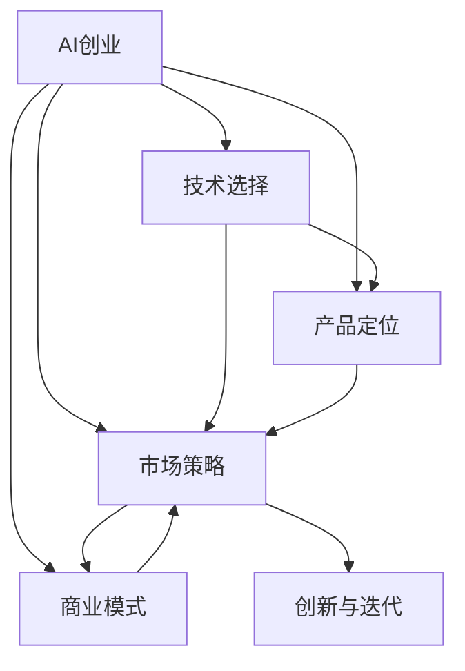

                 

# AI创业码头故事：年轻创始人的选择

> 关键词：AI创业, 人工智能, 机器学习, 深度学习, 大数据, 初创公司, 技术创业, 人工智能应用, 商业策略, 创新, 创业融资

## 1. 背景介绍

### 1.1 问题由来

随着人工智能(AI)技术的不断发展和成熟，越来越多的创业者被AI的巨大潜力和市场机会所吸引。从深度学习、机器学习到自然语言处理(NLP)、计算机视觉(CV)等，AI领域涌现出大量创新的应用场景和商业模式。然而，如何将AI技术转化为实际的产品和服务，实现商业化落地，成为了许多年轻创业者面临的共同挑战。本文将以AI创业为切入点，探讨年轻创业者在人工智能领域的选择与发展。

### 1.2 问题核心关键点

AI创业的核心关键点在于选择合适的技术方向和商业模式，同时兼顾产品的创新性与市场化能力。具体而言，包括以下几个方面：

- 技术选择：根据市场和应用需求，选择最合适的AI技术，如深度学习、机器学习、计算机视觉、自然语言处理等。
- 产品定位：明确产品面向的客户群体和应用场景，通过差异化的技术优势吸引用户。
- 市场策略：分析市场需求和竞争环境，制定有效的市场营销和推广策略。
- 商业模式：选择合适的盈利模式，如订阅服务、按需付费、平台分成等。
- 创新与迭代：持续进行产品优化和创新，保持技术领先地位。

本文将围绕这些关键点，详细分析年轻创始人在AI创业中的选择和决策，力求为读者提供有价值的参考和指导。

## 2. 核心概念与联系

### 2.1 核心概念概述

为更好地理解AI创业的各个环节，本节将介绍几个核心概念及其相互联系：

- **AI创业**：指利用人工智能技术，开展科技创新和商业模式创新，创立并运营AI相关企业的创业活动。
- **技术选择**：根据市场需求和自身技术实力，选择最合适的AI技术路径，如深度学习、计算机视觉、自然语言处理等。
- **产品定位**：明确产品面向的客户群体和应用场景，通过技术优势吸引用户，满足市场需求。
- **市场策略**：制定有效的市场营销和推广策略，如SEO、内容营销、社交媒体营销等。
- **商业模式**：选择合适的盈利模式，如订阅服务、按需付费、平台分成等，确保企业的可持续发展和盈利能力。
- **创新与迭代**：持续进行产品优化和创新，保持技术领先地位，满足市场变化。

这些概念之间的逻辑关系可以通过以下Mermaid流程图来展示：



这个流程图展示了AI创业中的各个环节及其相互关系：

1. **AI创业**：作为总体目标，指导技术选择、产品定位、市场策略、商业模式和持续创新。
2. **技术选择**：影响产品定位和市场策略，决定技术优势和创新路径。
3. **产品定位**：影响市场策略和商业模式，确保产品满足市场需求和用户痛点。
4. **市场策略**：影响商业模式的可行性，确保市场推广和用户获取。
5. **商业模式**：影响持续创新和资源配置，确保企业的可持续发展和盈利能力。
6. **创新与迭代**：推动技术选择、产品定位、市场策略和商业模式的不断优化和升级。

## 3. 核心算法原理 & 具体操作步骤
### 3.1 算法原理概述

AI创业的核心算法原理基于对AI技术的深刻理解和应用，结合市场需求和商业策略，进行系统化设计和优化。核心算法包括但不限于：

- **深度学习**：利用神经网络模型进行数据学习和特征提取，适用于图像、语音、文本等多种数据类型的处理。
- **机器学习**：通过统计模型和算法，从数据中学习规律和模式，适用于分类、聚类、推荐等任务。
- **自然语言处理**：利用语言模型和算法，处理和分析文本数据，适用于智能问答、文本生成、情感分析等。
- **计算机视觉**：利用计算机算法，分析和理解图像和视频数据，适用于目标检测、图像识别、场景理解等。

### 3.2 算法步骤详解

AI创业的技术操作过程主要包括以下几个步骤：

**Step 1: 市场调研与需求分析**
- 收集和分析市场需求数据，识别潜在客户群体的需求痛点。
- 分析竞争对手的产品和市场策略，找出自身的差异化优势。
- 评估技术成熟度和可行性，确保技术选择和应用方案的合理性。

**Step 2: 技术选型与产品设计**
- 根据市场需求和技术成熟度，选择合适的AI技术路径。
- 设计产品原型，明确产品功能、界面和用户体验。
- 进行原型测试和迭代，确保产品满足用户需求。

**Step 3: 产品开发与测试**
- 开发产品功能，集成AI算法和模型。
- 进行系统测试和性能优化，确保产品稳定性和可靠性。
- 进行用户测试和反馈收集，持续优化产品体验。

**Step 4: 市场推广与营销**
- 制定市场推广策略，选择有效的营销渠道和工具。
- 进行市场推广和用户获取，提升品牌知名度和市场份额。
- 分析市场反馈和用户数据，调整和优化市场策略。

**Step 5: 商业模式设计与优化**
- 根据产品特点和市场需求，选择最合适的商业模式。
- 制定商业计划和盈利模型，明确收入来源和成本结构。
- 进行市场分析和风险评估，优化商业模式以适应市场变化。

### 3.3 算法优缺点

AI创业技术操作过程的优势包括：

- **技术领先**：通过选择和集成最前沿的AI技术，保持技术领先地位，满足市场变化。
- **用户体验**：通过产品设计和用户体验优化，提升用户满意度和忠诚度。
- **市场扩展**：通过有效的市场策略和推广手段，快速扩展市场份额和用户基础。
- **盈利能力**：通过合理的商业模式设计和运营，实现企业的可持续发展和盈利。

然而，AI创业技术操作过程也存在一些缺点：

- **技术门槛高**：AI技术复杂度高，需要较高的技术储备和团队实力。
- **资源需求大**：AI创业初期需要大量的人力、物力和财力投入，风险较大。
- **市场不确定性**：市场需求和技术趋势存在不确定性，需要持续观察和调整。
- **创新挑战**：持续进行技术创新和产品优化，保持竞争力。

### 3.4 算法应用领域

AI创业技术操作过程适用于多个应用领域，包括但不限于：

- **智能客服**：利用NLP和机器学习技术，构建智能客服系统，提升客户服务效率和质量。
- **智能推荐**：利用机器学习和深度学习技术，构建个性化推荐系统，提升用户体验和转化率。
- **智能医疗**：利用计算机视觉和自然语言处理技术，提升医疗诊断和治疗效果，降低医疗成本。
- **智能安防**：利用计算机视觉和深度学习技术，提升安防监控和识别能力，保障公共安全。
- **智能制造**：利用机器学习和计算机视觉技术，提升生产效率和质量控制，降低生产成本。
- **智能金融**：利用机器学习和自然语言处理技术，提升金融风控和客户服务能力，优化金融产品。

## 4. 数学模型和公式 & 详细讲解 & 举例说明
### 4.1 数学模型构建

AI创业的数学模型构建主要基于数据驱动的机器学习和深度学习算法。以下是几个核心模型的数学构建：

**深度学习模型**：
- **神经网络**：由输入层、隐藏层和输出层组成，通过前向传播和反向传播算法进行训练和优化。
- **卷积神经网络(CNN)**：应用于图像处理任务，通过卷积和池化操作提取特征。
- **循环神经网络(RNN)**：应用于序列数据处理任务，通过递归神经网络结构学习时间序列特征。

**机器学习模型**：
- **支持向量机(SVM)**：通过超平面分割数据集，实现分类和回归任务。
- **决策树**：通过构建决策树模型，实现分类和回归任务。
- **随机森林**：通过集成多个决策树模型，提升模型的鲁棒性和泛化能力。

**自然语言处理模型**：
- **词向量模型**：通过神经网络学习词嵌入，实现词汇的向量表示。
- **语言模型**：通过概率模型描述单词序列的生成规律，实现文本生成和语言理解。
- **情感分析模型**：通过分类算法识别文本中的情感倾向，实现情感识别和分析。

### 4.2 公式推导过程

以下是几个核心模型的公式推导过程：

**神经网络公式**：
- **前向传播**：$h^{(l)}=f(W^{(l)}h^{(l-1)}+b^{(l)})$
- **反向传播**：$\Delta_{w^{(l)}}=\delta^{(l)}h^{(l-1)}T^{(l)}$
- **梯度下降**：$w^{(l)}\leftarrow w^{(l)}-\eta\Delta_{w^{(l)}}$

**卷积神经网络公式**：
- **卷积操作**：$C(h_{x,y};\theta)=\sum_{o=1}^O\sum_{k=1}^Kf_\theta(z_{x,y}^{k,o})
- **池化操作**：$P(h_{x,y};\theta)=\max_\delta f_\theta(z_{x,y}^{\delta,o})$

**支持向量机公式**：
- **分类**：$\max_\omega b\frac{1}{2}\|w\|^2-\Sigma_{n=1}^N(y_n\langle w,x_n\rangle-b)+\frac{C}{N}\Sigma_{n=1}^N|y_n\langle w,x_n\rangle-b|$
- **回归**：$\max_\omega b\frac{1}{2}\|w\|^2-\Sigma_{n=1}^N(y_n\langle w,x_n\rangle-b)+\frac{\lambda}{2N}\|w\|^2$

**语言模型公式**：
- **概率模型**：$P(w_1\ldots w_t|w_1\ldots w_{t-1})=\frac{P(w_1\ldots w_t)}{P(w_1\ldots w_{t-1})}$
- **词嵌入模型**：$w_{ij}=\text{embed}(i)$

**情感分析公式**：
- **情感分类**：$P(y|w)=\sigma(W^T[\text{embed}(w)]+b)$
- **情感极性分析**：$P(a,b|w)=\sigma(W^T[\text{embed}(w)]+b)$

### 4.3 案例分析与讲解

**智能推荐系统案例**：
- **技术选择**：选择深度学习模型，如神经网络、CNN、RNN等，进行推荐算法开发。
- **数据准备**：收集用户行为数据、物品属性数据、用户属性数据等，进行特征工程和数据预处理。
- **模型训练**：利用推荐算法和训练数据，训练深度学习模型，进行特征提取和用户预测。
- **模型优化**：通过A/B测试和用户反馈，优化推荐模型，提升推荐效果和用户体验。

**智能医疗诊断系统案例**：
- **技术选择**：选择计算机视觉和自然语言处理技术，构建图像识别和文本分析模型。
- **数据准备**：收集医学影像数据、病历数据、实验室数据等，进行数据清洗和标注。
- **模型训练**：利用图像识别和文本分析模型，进行医疗影像分析和文本处理，提取病灶特征和诊断信息。
- **模型验证**：通过医学专家的标注数据，验证模型的准确性和可靠性，进行模型迭代和优化。

## 5. 项目实践：代码实例和详细解释说明
### 5.1 开发环境搭建

AI创业项目实践需要先准备好开发环境。以下是使用Python进行TensorFlow开发的环境配置流程：

1. 安装Anaconda：从官网下载并安装Anaconda，用于创建独立的Python环境。

2. 创建并激活虚拟环境：
```bash
conda create -n tf-env python=3.8 
conda activate tf-env
```

3. 安装TensorFlow：根据CUDA版本，从官网获取对应的安装命令。例如：
```bash
conda install tensorflow
```

4. 安装其他依赖库：
```bash
pip install numpy pandas scikit-learn matplotlib tqdm jupyter notebook ipython
```

完成上述步骤后，即可在`tf-env`环境中开始项目实践。

### 5.2 源代码详细实现

这里以智能推荐系统为例，给出使用TensorFlow进行推荐算法开发的PyTorch代码实现。

首先，定义推荐算法的数据处理函数：

```python
import tensorflow as tf
import numpy as np

class RecommendationDataset(tf.data.Dataset):
    def __init__(self, user_data, item_data, user_item_interaction, batch_size=32):
        self.user_data = user_data
        self.item_data = item_data
        self.user_item_interaction = user_item_interaction
        self.batch_size = batch_size
        
    def __len__(self):
        return len(self.user_data)
    
    def __getitem__(self, item):
        user_id = self.user_data[item]
        item_ids = self.item_data[item]
        interaction = self.user_item_interaction[item]
        
        # 对item_ids进行one-hot编码
        encoded_items = tf.one_hot(item_ids, depth=len(self.item_data))
        
        # 对interaction进行独热编码
        encoded_interactions = tf.one_hot(interaction, depth=2)
        
        return {'user_id': user_id, 
                'encoded_items': encoded_items,
                'encoded_interactions': encoded_interactions}

# 定义模型和优化器
model = tf.keras.Sequential([
    tf.keras.layers.Dense(64, activation='relu'),
    tf.keras.layers.Dense(32, activation='relu'),
    tf.keras.layers.Dense(1, activation='sigmoid')
])

optimizer = tf.keras.optimizers.Adam(learning_rate=0.001)
```

然后，定义训练和评估函数：

```python
import tensorflow as tf

def train_epoch(model, dataset, batch_size, optimizer):
    dataloader = tf.data.Dataset.from_generator(lambda: dataset, output_signature={
        'user_id': tf.int32,
        'encoded_items': tf.int32,
        'encoded_interactions': tf.int32
    })
    model.compile(optimizer=optimizer, loss='binary_crossentropy', metrics=['accuracy'])
    model.fit(dataloader, epochs=1, validation_split=0.2)
    
def evaluate(model, dataset, batch_size):
    dataloader = tf.data.Dataset.from_generator(lambda: dataset, output_signature={
        'user_id': tf.int32,
        'encoded_items': tf.int32,
        'encoded_interactions': tf.int32
    })
    model.evaluate(dataloader, batch_size=batch_size, verbose=2)
```

最后，启动训练流程并在测试集上评估：

```python
epochs = 10

for epoch in range(epochs):
    train_epoch(model, train_dataset, batch_size, optimizer)
    
    print(f"Epoch {epoch+1}, accuracy: {evaluate(model, dev_dataset, batch_size)[1]:.2f}%")
    
print(f"Final accuracy: {evaluate(model, test_dataset, batch_size)[1]:.2f}%")
```

以上就是使用TensorFlow进行推荐算法开发的完整代码实现。可以看到，通过TensorFlow的高效计算图和封装，推荐算法的开发变得更加简洁高效。

### 5.3 代码解读与分析

让我们再详细解读一下关键代码的实现细节：

**RecommendationDataset类**：
- `__init__`方法：初始化用户数据、物品数据、用户物品交互数据等关键组件，定义批处理大小。
- `__len__`方法：返回数据集的样本数量。
- `__getitem__`方法：对单个样本进行处理，将用户ID、物品ID和交互数据编码成one-hot向量，方便模型训练。

**定义模型和优化器**：
- 使用TensorFlow的Sequential模型定义推荐算法，包含三个全连接层。
- 使用Adam优化器，设置学习率为0.001。

**训练和评估函数**：
- 使用TensorFlow的DataLoader和from_generator方法，将数据集转换为DataLoader对象。
- 使用模型的compile方法定义损失函数和评估指标。
- 使用模型的fit方法进行训练，设置验证集和批处理大小。
- 使用模型的evaluate方法在测试集上评估模型的准确率。

**训练流程**：
- 定义总的epoch数，开始循环迭代
- 每个epoch内，先训练模型，输出准确率
- 在验证集上评估模型，输出准确率
- 所有epoch结束后，在测试集上评估模型，给出最终准确率

可以看到，TensorFlow的强大封装使得推荐算法的开发变得简洁高效。开发者可以将更多精力放在模型优化和算法设计上，而不必过多关注底层的实现细节。

当然，工业级的系统实现还需考虑更多因素，如模型的保存和部署、超参数的自动搜索、更灵活的任务适配层等。但核心的推荐算法基本与此类似。

## 6. 实际应用场景
### 6.1 智能推荐系统

智能推荐系统是AI创业中最常见的应用场景之一。通过分析用户的历史行为数据，推荐系统能够为用户推荐感兴趣的商品、内容或服务，提升用户体验和转化率。

**应用实例**：
- **电商平台**：根据用户浏览和购买记录，推荐相关商品，提升用户粘性和销售额。
- **内容平台**：根据用户观看和阅读历史，推荐相似视频和文章，提升内容消费和用户留存。
- **社交网络**：根据用户互动和好友关系，推荐新内容和关系，提升社交互动和用户活跃度。

**技术实现**：
- **数据预处理**：收集用户行为数据、物品属性数据、用户属性数据等，进行特征工程和数据预处理。
- **模型训练**：利用推荐算法和训练数据，训练深度学习模型，进行特征提取和用户预测。
- **模型优化**：通过A/B测试和用户反馈，优化推荐模型，提升推荐效果和用户体验。

**优势**：
- **个性化推荐**：通过深度学习模型，实现个性化推荐，提升用户体验和满意度。
- **动态调整**：根据用户反馈和市场变化，动态调整推荐策略和模型参数，提升推荐效果。
- **多模态融合**：结合文本、图像、视频等多模态数据，实现更加全面和精准的推荐。

**挑战**：
- **数据隐私**：用户行为数据涉及隐私保护，需要严格遵守相关法律法规。
- **推荐多样性**：避免推荐同质化内容，提升推荐多样性。
- **模型泛化性**：确保模型在不同类型的用户和数据上都有良好的泛化能力。

### 6.2 智能医疗诊断系统

智能医疗诊断系统通过AI技术，提升医疗影像分析和诊断的准确性和效率。利用计算机视觉和自然语言处理技术，智能系统能够自动识别和分析医学影像、病历和实验室数据，辅助医生进行诊断和治疗。

**应用实例**：
- **医学影像分析**：通过深度学习模型，自动识别和标注医学影像中的病灶区域，辅助医生进行诊断。
- **病历处理**：通过自然语言处理模型，自动分析和提取病历中的关键信息，提升医生的诊断效率和准确性。
- **实验室数据分析**：通过机器学习模型，分析实验室数据中的异常指标，辅助医生进行疾病预测和诊断。

**技术实现**：
- **数据预处理**：收集医学影像数据、病历数据、实验室数据等，进行数据清洗和标注。
- **模型训练**：利用计算机视觉和自然语言处理模型，进行医学影像分析和文本处理，提取病灶特征和诊断信息。
- **模型验证**：通过医学专家的标注数据，验证模型的准确性和可靠性，进行模型迭代和优化。

**优势**：
- **高效诊断**：通过自动化和智能化技术，提升诊断效率和准确性，减轻医生负担。
- **全面分析**：结合医学影像、病历和实验室数据，进行全面分析，提升诊断效果。
- **动态更新**：根据最新医学研究成果，动态更新模型，提升诊断能力。

**挑战**：
- **数据获取**：医学数据的获取和标注成本较高，需要大量时间和资源。
- **模型可解释性**：医学诊断模型的可解释性要求较高，需要提供准确的诊断依据和解释。
- **伦理安全**：医学数据涉及患者隐私和伦理问题，需要严格遵守相关法律法规。

### 6.3 智能安防系统

智能安防系统利用计算机视觉和深度学习技术，提升安防监控和识别的准确性和效率。通过图像识别和视频分析，智能系统能够自动识别和报警异常行为和事件，提升公共安全。

**应用实例**：
- **视频监控**：通过深度学习模型，自动识别视频监控中的异常行为，如盗窃、暴力等。
- **人脸识别**：通过计算机视觉模型，进行人脸识别和比对，提升公共场所的安全性。
- **行为分析**：通过视频分析模型，自动识别和报警异常行为，提升公共安全。

**技术实现**：
- **数据预处理**：收集视频监控数据、人脸数据、行为数据等，进行数据清洗和标注。
- **模型训练**：利用计算机视觉和深度学习模型，进行视频监控分析和行为识别，提取异常特征。
- **模型验证**：通过专家标注数据，验证模型的准确性和可靠性，进行模型迭代和优化。

**优势**：
- **实时监控**：通过自动化和智能化技术，实现实时监控和报警，提升公共安全。
- **全面覆盖**：结合视频监控和行为分析，进行全面覆盖和识别，提升安全效果。
- **动态调整**：根据实际场景和需求，动态调整模型参数，提升识别效果。

**挑战**：
- **数据获取**：视频监控数据涉及隐私保护，需要严格遵守相关法律法规。
- **模型鲁棒性**：在复杂环境和多样场景下，确保模型的鲁棒性和泛化能力。
- **伦理安全**：安防系统的使用需要遵守相关法律法规，确保用户隐私和数据安全。

## 7. 工具和资源推荐
### 7.1 学习资源推荐

为了帮助开发者系统掌握AI创业的技术基础和实践技巧，这里推荐一些优质的学习资源：

1. **《机器学习实战》**：由Peter Harrington所著，深入浅出地介绍了机器学习和深度学习的基本概念和实践技巧。
2. **《深度学习》**：由Ian Goodfellow等编著，全面介绍了深度学习的理论基础和实践应用。
3. **《TensorFlow实战》**：由Tom Hope等所著，详细介绍了TensorFlow的开发环境和核心功能，适用于TensorFlow开发初学者。
4. **《Keras实战》**：由Chadi Thereza等编著，介绍了Keras的开发环境和核心功能，适用于Keras开发初学者。
5. **Coursera《深度学习专项课程》**：由Andrew Ng等教授主讲，涵盖了深度学习的基本概念和实践技巧，是学习深度学习的绝佳资源。

通过对这些资源的学习实践，相信你一定能够快速掌握AI创业的技术精髓，并用于解决实际的AI应用问题。

### 7.2 开发工具推荐

高效的开发离不开优秀的工具支持。以下是几款用于AI创业开发的常用工具：

1. **Python**：作为AI开发的主流编程语言，Python提供了丰富的第三方库和框架，如TensorFlow、PyTorch、Keras等，方便进行模型开发和数据处理。
2. **TensorFlow**：由Google开发的深度学习框架，支持分布式计算和动态计算图，适用于大规模模型训练和推理。
3. **PyTorch**：由Facebook开发的深度学习框架，支持动态计算图和GPU加速，适用于研究型开发和快速迭代。
4. **Keras**：基于TensorFlow和Theano等后端的高级神经网络API，提供简单易用的API接口，适用于初学者和快速开发。
5. **Jupyter Notebook**：基于Python的交互式开发环境，支持代码和文档的协同编辑，方便进行实验和调试。
6. **Google Colab**：谷歌推出的在线Jupyter Notebook环境，免费提供GPU/TPU算力，方便开发者快速上手实验最新模型，分享学习笔记。

合理利用这些工具，可以显著提升AI创业项目的开发效率，加快创新迭代的步伐。

### 7.3 相关论文推荐

AI创业的技术演进得益于学界的持续研究。以下是几篇奠基性的相关论文，推荐阅读：

1. **《深度学习》**：Yoshua Bengio等著，全面介绍了深度学习的理论基础和实践应用。
2. **《机器学习》**：Tom Mitchell著，介绍了机器学习的核心概念和应用案例。
3. **《计算机视觉：模型、学习和推理》**：David Forsyth等著，介绍了计算机视觉的基本理论和实践方法。
4. **《自然语言处理综论》**：Daniel Jurafsky等著，介绍了自然语言处理的基本理论和实践方法。
5. **《强化学习：一种新的人工智能范式》**：Richard S. Sutton等著，介绍了强化学习的基本理论和实践方法。

这些论文代表了大规模AI创业的理论进展，通过学习这些前沿成果，可以帮助研究者把握学科前进方向，激发更多的创新灵感。

## 8. 总结：未来发展趋势与挑战
### 8.1 研究成果总结

本文对AI创业中的核心概念、技术选择、产品定位、市场策略、商业模式和创新与迭代等方面进行了详细分析。通过系统化的理论框架和实践案例，揭示了AI创业的成功关键点和潜在挑战。希望为年轻创业者提供有价值的参考和指导，帮助他们在AI创业的道路上更好地前行。

### 8.2 未来发展趋势

AI创业的未来发展趋势主要体现在以下几个方面：

1. **技术演进**：随着AI技术的不断发展和成熟，深度学习、机器学习、自然语言处理等技术将进一步发展和深化，为AI创业提供更强大的技术支撑。
2. **市场拓展**：AI技术的应用范围将不断扩大，从传统的电商、内容推荐到智能医疗、智能安防等领域，AI创业将迎来更多的机会。
3. **行业融合**：AI技术与各个行业的深度融合，将催生更多创新应用场景，推动各行业的数字化转型升级。
4. **数据驱动**：AI创业将更加依赖数据的获取和处理，通过数据驱动的方式，提升产品的智能水平和用户体验。
5. **伦理规范**：随着AI技术的应用，伦理规范和法律法规的完善将逐步跟进，保障AI创业的可持续发展。

### 8.3 面临的挑战

尽管AI创业前景广阔，但也面临着一些挑战：

1. **技术门槛高**：AI技术复杂度高，需要较高的技术储备和团队实力，对创业者的技术能力要求较高。
2. **数据隐私**：用户数据的获取和处理涉及隐私保护，需要严格遵守相关法律法规，确保数据安全。
3. **市场竞争激烈**：AI创业领域竞争激烈，如何在激烈的市场竞争中脱颖而出，需要持续的技术创新和市场策略。
4. **模型鲁棒性**：在复杂环境和多样场景下，确保模型的鲁棒性和泛化能力，需要更多的数据和模型优化。
5. **伦理安全**：AI技术的应用需要遵守相关法律法规，确保用户隐私和数据安全，避免潜在风险。

### 8.4 研究展望

未来，AI创业需要从以下几个方向进行突破：

1. **多模态融合**：结合文本、图像、视频等多模态数据，实现更加全面和精准的推荐和分析。
2. **动态更新**：根据市场变化和用户反馈，动态调整模型和算法，提升产品智能水平和用户体验。
3. **伦理规范**：制定和遵守相关法律法规，保障数据隐私和用户安全，推动AI创业的健康发展。
4. **国际合作**：加强国际交流与合作，推动AI技术在全球范围内的应用和发展。

这些方向将推动AI创业技术的持续创新和应用扩展，为年轻创业者提供更多的机遇和挑战。只有勇于创新、敢于突破，才能在AI创业的道路上取得成功，实现技术的商业化落地和社会的可持续发展。

## 9. 附录：常见问题与解答

**Q1：AI创业中如何选择合适的技术路径？**

A: 选择合适的技术路径需要考虑以下几个因素：
- **市场需求**：分析目标市场的需求痛点和用户群体，选择最合适的AI技术。
- **技术成熟度**：评估现有技术的成熟度和可行性，选择最适合自己的技术路径。
- **团队实力**：评估自身团队的技术能力和资源配置，选择最适合自己的技术路径。
- **未来发展**：考虑技术的未来发展和应用前景，选择具有潜力的技术路径。

**Q2：AI创业中如何确保数据隐私和安全？**

A: 确保数据隐私和安全需要采取以下措施：
- **数据匿名化**：对用户数据进行匿名化处理，确保数据安全。
- **数据加密**：采用数据加密技术，防止数据泄露。
- **数据审计**：对数据使用进行审计和监控，确保数据合规。
- **用户知情**：在数据收集和处理前，明确告知用户数据使用情况，获取用户同意。
- **法律法规**：遵守相关法律法规，确保数据隐私和安全。

**Q3：AI创业中如何优化模型的鲁棒性和泛化能力？**

A: 优化模型的鲁棒性和泛化能力需要采取以下措施：
- **数据增强**：通过数据增强技术，扩充训练数据集，提升模型的泛化能力。
- **正则化**：采用正则化技术，防止模型过拟合，提升模型的鲁棒性。
- **对抗训练**：采用对抗训练技术，提升模型的鲁棒性和泛化能力。
- **迁移学习**：采用迁移学习技术，利用已有模型的知识，提升模型的泛化能力。
- **多模型集成**：采用多模型集成技术，提升模型的鲁棒性和泛化能力。

**Q4：AI创业中如何构建高效的推荐系统？**

A: 构建高效的推荐系统需要采取以下措施：
- **数据预处理**：收集和处理用户行为数据、物品属性数据、用户属性数据等，进行特征工程和数据预处理。
- **模型选择**：选择最合适的推荐算法，如协同过滤、深度学习等，进行模型开发和训练。
- **模型优化**：通过A/B测试和用户反馈，优化推荐模型，提升推荐效果和用户体验。
- **多模态融合**：结合文本、图像、视频等多模态数据，实现更加全面和精准的推荐。
- **动态调整**：根据用户反馈和市场变化，动态调整推荐策略和模型参数，提升推荐效果。

**Q5：AI创业中如何构建智能医疗诊断系统？**

A: 构建智能医疗诊断系统需要采取以下措施：
- **数据预处理**：收集医学影像数据、病历数据、实验室数据等，进行数据清洗和标注。
- **模型选择**：选择最合适的模型，如深度学习、自然语言处理等，进行医学影像分析和文本处理。
- **模型训练**：利用医学影像和病历数据，训练深度学习模型，进行医学影像分析和病历处理。
- **模型验证**：通过医学专家的标注数据，验证模型的准确性和可靠性，进行模型迭代和优化。
- **伦理规范**：遵守相关法律法规，确保医疗数据的安全和隐私。

---

作者：禅与计算机程序设计艺术 / Zen and the Art of Computer Programming

