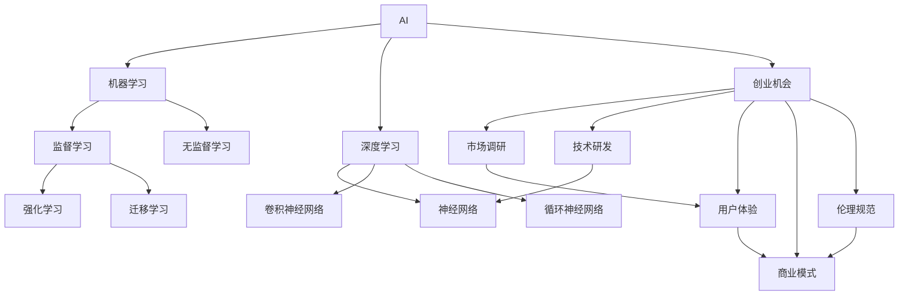

                 

# AI创业者的机会：AI让人类生活更美好

> 关键词：人工智能(AI), 创业机会, 人类生活质量, 算法优化, 数据科学, 应用场景, 创业案例

## 1. 背景介绍

### 1.1 问题由来

人工智能(AI)技术的迅猛发展正深刻改变着社会的各个方面，从医疗、教育到金融、娱乐，AI已经嵌入到日常生活的方方面面。这种变革不仅推动了经济的增长，还显著提升了人类的生活质量。AI技术的普适性和深远影响，使其成为了当前创业领域的热点。

然而，AI的广泛应用也带来了新的挑战和风险，如数据隐私、算法偏见、技术滥用等问题。如何平衡技术进步与社会福祉，确保AI技术的应用能够真正造福人类，成为了AI创业者和研究人员共同关注的焦点。

### 1.2 问题核心关键点

AI创业的核心关键点在于如何结合最新的AI技术和实际应用需求，创造出具有实际价值的产品和服务。要实现这一点，需要深入理解AI技术的原理和应用场景，同时关注用户体验和市场接受度。

具体而言，AI创业可以从以下几个方面着手：

- **技术前沿**：跟踪AI领域的最新研究成果，掌握核心算法和技术框架。
- **用户需求**：深入了解目标用户的需求和痛点，设计出满足实际需求的解决方案。
- **商业模式**：探索合理的商业模式，确保产品的市场可行性和可持续性。
- **伦理规范**：注重AI技术的伦理和社会责任，避免负面影响，赢得用户信任。

通过在这些关键点上的持续探索和创新，AI创业者可以在保持技术领先的同时，实现商业成功和社会价值。

### 1.3 问题研究意义

研究AI创业机会及其对人类生活质量的影响，对于推动AI技术的良性发展、促进社会进步具有重要意义：

1. **提升生产力**：AI技术能够显著提高生产效率，降低运营成本，促进经济增长。
2. **改善民生**：AI在医疗、教育、交通等领域的应用，能够改善人类生活质量，提供个性化服务。
3. **驱动创新**：AI创业为各行各业带来新的创新点和商业模式，推动技术突破和产业升级。
4. **促进就业**：AI创业不仅创造了新的就业机会，还能通过技能培训提升劳动者的综合素质。
5. **应对挑战**：AI技术在解决复杂社会问题，如气候变化、公共健康等，具有巨大潜力。

## 2. 核心概念与联系

### 2.1 核心概念概述

AI创业的核心概念包括：

- **人工智能(AI)**：通过计算机算法和大数据处理，使计算机能够模拟人的智能行为。
- **机器学习(ML)**：一种使计算机通过数据学习，从而不断提升性能的技术。
- **深度学习(DL)**：一种特殊类型的机器学习，通过多层神经网络进行非线性处理，广泛应用于图像、语音、自然语言处理等领域。
- **创业机会**：指在特定市场、技术或资源条件下，能够带来显著经济效益或社会效益的商业机会。
- **用户体验(UX)**：指用户在使用产品或服务时的体验和感受，是评价产品成功与否的重要指标。
- **商业模式(MoM)**：指企业运营和盈利的方式，包括产品定价、销售渠道、市场定位等。
- **伦理规范(Ethics)**：指在AI应用中遵循的道德和法律准则，确保技术的公正和透明。

这些核心概念相互联系，共同构成了AI创业的框架。理解这些概念，能够帮助创业者系统地思考和设计AI产品的各个方面。

### 2.2 核心概念原理和架构的 Mermaid 流程图



这个流程图展示了AI创业的各个环节和它们之间的关系。AI技术的核心是机器学习和深度学习，其中神经网络、卷积神经网络和循环神经网络是主要的技术手段。创业机会的识别和实现依赖于市场调研、技术研发、用户体验设计、商业模式规划和伦理规范的遵守。

## 3. 核心算法原理 & 具体操作步骤

### 3.1 算法原理概述

AI创业的核心算法原理主要涉及机器学习、深度学习和自然语言处理(NLP)等领域。以下是这些算法的简要概述：

- **监督学习(Supervised Learning)**：通过带有标签的数据训练模型，使其能够预测新数据。监督学习广泛应用于分类、回归等任务。
- **无监督学习(Unsupervised Learning)**：通过未标记的数据训练模型，发现数据中的结构和模式。无监督学习常用于数据降维、聚类等任务。
- **深度学习(DL)**：通过多层神经网络进行复杂的非线性映射，解决传统机器学习难以处理的图像、语音、文本等数据。
- **自然语言处理(NLP)**：使计算机能够理解和生成自然语言，包括分词、词性标注、语义分析等任务。

这些算法在AI创业中应用广泛，帮助创业者开发出具备实际应用价值的AI产品。

### 3.2 算法步骤详解

AI创业的一般流程包括以下几个关键步骤：

**Step 1: 市场调研**

- 确定目标市场：了解市场需求、竞争环境和用户需求。
- 确定用户群体：明确目标用户的基本特征和需求。

**Step 2: 技术研发**

- 技术选型：选择适合的技术栈和算法。
- 模型开发：设计、训练和优化AI模型。

**Step 3: 用户体验设计**

- 界面设计：创建直观、易用的用户界面。
- 交互设计：优化用户与系统的交互流程。

**Step 4: 商业模式设计**

- 定价策略：制定合理的产品定价策略。
- 销售渠道：选择适合的销售和分销渠道。

**Step 5: 伦理规范遵守**

- 数据保护：确保用户数据的安全和隐私。
- 算法透明：公开算法的决策过程和依据。

通过这些步骤，AI创业者可以系统地开发和推广AI产品，实现技术创新和商业成功。

### 3.3 算法优缺点

AI创业中的主要算法具有以下优缺点：

**监督学习**

- **优点**：
  - 通过有标注的数据进行训练，模型预测准确度高。
  - 模型训练过程有目标导向，易于解释和优化。
  - 在特定任务上表现优秀。

- **缺点**：
  - 需要大量标注数据，标注成本高。
  - 数据偏差可能导致模型有偏见。
  - 新任务和新数据需要重新训练。

**无监督学习**

- **优点**：
  - 适用于大数据、少标注或无标注的情况。
  - 模型具有较强的泛化能力，适用于发现数据中的模式和结构。

- **缺点**：
  - 模型预测结果难以解释。
  - 模型性能依赖于数据的丰富性和多样性。
  - 部分算法计算复杂度高，训练时间长。

**深度学习**

- **优点**：
  - 处理非线性问题能力强，适用于复杂数据。
  - 自动化特征提取，减少手动设计特征的工作量。
  - 在图像、语音、文本等任务中表现优异。

- **缺点**：
  - 模型复杂度高，训练时间长，计算资源需求大。
  - 模型黑盒特性强，难以解释和调试。
  - 数据需求量大，标注成本高。

**自然语言处理**

- **优点**：
  - 使计算机能够理解和生成自然语言，应用广泛。
  - 能够处理大量文本数据，进行情感分析、文本分类等任务。

- **缺点**：
  - 处理长文本时，计算资源需求大。
  - 语言模型存在歧义，影响模型效果。
  - 数据集的多样性和质量直接影响模型性能。

### 3.4 算法应用领域

AI创业的算法应用领域广泛，涵盖了医疗、教育、金融、零售等多个行业。以下是一些典型的应用场景：

- **医疗健康**：
  - 疾病诊断：通过图像识别技术，自动检测X光片、CT扫描中的异常情况。
  - 个性化医疗：利用深度学习对患者数据进行分析，提供个性化治疗方案。
  - 健康监测：通过可穿戴设备收集的数据，进行健康状况评估和预测。

- **教育培训**：
  - 智能辅导：基于AI的个性化辅导系统，提供定制化的学习内容和学习路径。
  - 语言学习：通过自然语言处理技术，帮助用户学习新语言，提供语言教学和翻译服务。
  - 学习分析：分析学生的学习行为和成绩，提供针对性的学习建议。

- **金融服务**：
  - 风险评估：利用机器学习模型分析信用数据，评估借贷风险。
  - 金融预测：通过时间序列分析，预测股票价格、汇率等金融指标。
  - 欺诈检测：通过异常检测算法，识别金融交易中的欺诈行为。

- **零售电商**：
  - 智能推荐：利用深度学习对用户行为进行分析，提供个性化的商品推荐。
  - 库存管理：通过机器学习预测销售趋势，优化库存管理和供应链管理。
  - 客户服务：使用自然语言处理技术，提供智能客服和客户支持。

## 4. 数学模型和公式 & 详细讲解 & 举例说明

### 4.1 数学模型构建

AI创业中的数学模型主要涉及统计学、概率论和优化理论等领域。以下是几个关键数学模型的构建和解释：

**线性回归模型**

线性回归模型用于处理输入变量与输出变量之间的线性关系，公式如下：

$$
y = \beta_0 + \beta_1 x_1 + \beta_2 x_2 + \cdots + \beta_n x_n + \epsilon
$$

其中，$y$ 是输出变量，$x_i$ 是输入变量，$\beta_i$ 是回归系数，$\epsilon$ 是随机误差。线性回归模型常用于预测和分析。

**卷积神经网络(CNN)**

卷积神经网络是深度学习中的一种特殊网络结构，主要用于图像处理任务。其核心思想是通过卷积层和池化层提取图像的特征，公式如下：

$$
f(x) = \max(\sum_{i=1}^k a_i g(b_i x + c_i))
$$

其中，$x$ 是输入图像，$g$ 是激活函数，$a_i$ 和 $b_i$ 是卷积核参数，$c_i$ 是偏置参数。卷积神经网络通过多层卷积和池化操作，提取图像的特征并进行分类或回归。

**循环神经网络(RNN)**

循环神经网络主要用于处理序列数据，如文本和语音。其核心思想是通过循环层捕捉序列数据中的时间依赖关系，公式如下：

$$
h_t = f(W x_t + U h_{t-1} + b)
$$

其中，$h_t$ 是隐藏状态，$x_t$ 是输入，$U$ 和 $W$ 是权重参数，$b$ 是偏置参数。循环神经网络通过循环层和全连接层，处理序列数据并生成序列输出。

### 4.2 公式推导过程

**线性回归的梯度下降算法**

线性回归模型的梯度下降算法用于优化模型的参数，公式如下：

$$
\theta^{k+1} = \theta^k - \alpha \frac{1}{m} \sum_{i=1}^m (y_i - \hat{y}_i) x_i
$$

其中，$\theta$ 是模型参数，$\alpha$ 是学习率，$m$ 是样本数，$y_i$ 是真实标签，$\hat{y}_i$ 是模型预测值。梯度下降算法通过不断更新参数，使模型损失最小化。

**卷积神经网络的前向传播算法**

卷积神经网络的前向传播算法用于计算模型的输出，公式如下：

$$
f(x) = \max(\sum_{i=1}^k a_i g(b_i x + c_i))
$$

其中，$x$ 是输入图像，$g$ 是激活函数，$a_i$ 和 $b_i$ 是卷积核参数，$c_i$ 是偏置参数。前向传播算法通过多层卷积和池化操作，提取图像的特征并进行分类或回归。

**循环神经网络的前向传播算法**

循环神经网络的前向传播算法用于计算模型的输出，公式如下：

$$
h_t = f(W x_t + U h_{t-1} + b)
$$

其中，$h_t$ 是隐藏状态，$x_t$ 是输入，$U$ 和 $W$ 是权重参数，$b$ 是偏置参数。前向传播算法通过循环层和全连接层，处理序列数据并生成序列输出。

### 4.3 案例分析与讲解

**图像分类案例**

假设我们要开发一个图像分类器，用于识别猫和狗的图像。我们收集了1000张标注数据，其中猫500张，狗500张。首先，我们将数据集分为训练集和测试集，并使用卷积神经网络模型进行训练。训练过程中，我们采用交叉熵损失函数，并使用随机梯度下降算法进行优化。

具体步骤如下：

1. 准备数据集：将图像数据归一化，并划分为训练集和测试集。
2. 构建模型：选择LeNet-5模型作为基本架构，添加卷积层、池化层和全连接层，并使用softmax函数进行分类。
3. 训练模型：使用随机梯度下降算法，最小化交叉熵损失函数，更新模型参数。
4. 评估模型：在测试集上评估模型性能，计算准确率和混淆矩阵。

最终，我们得到了一个性能不错的图像分类器，能够识别新的猫和狗图像，并给出正确的分类结果。

## 5. 项目实践：代码实例和详细解释说明

### 5.1 开发环境搭建

AI创业的项目实践通常需要借助Python、TensorFlow、PyTorch等工具。以下是AI项目开发的环境搭建流程：

1. 安装Python：
```bash
sudo apt-get install python3
```

2. 安装TensorFlow：
```bash
pip install tensorflow
```

3. 安装PyTorch：
```bash
pip install torch torchvision torchaudio
```

4. 安装Jupyter Notebook：
```bash
pip install jupyter notebook
```

5. 安装Git和GitHub：
```bash
sudo apt-get install git
```

6. 安装GitHub桌面应用：
```bash
sudo apt-get install git-gui
```

完成上述步骤后，即可在本地搭建AI项目开发环境。

### 5.2 源代码详细实现

以下是一个简单的图像分类器代码实现，用于识别猫和狗的图像：

```python
import tensorflow as tf
from tensorflow import keras

# 加载数据集
(x_train, y_train), (x_test, y_test) = keras.datasets.cifar10.load_data()

# 数据预处理
x_train = x_train / 255.0
x_test = x_test / 255.0

# 构建模型
model = keras.Sequential([
    keras.layers.Conv2D(32, (3, 3), activation='relu', input_shape=(32, 32, 3)),
    keras.layers.MaxPooling2D((2, 2)),
    keras.layers.Flatten(),
    keras.layers.Dense(10, activation='softmax')
])

# 编译模型
model.compile(optimizer='adam',
              loss='sparse_categorical_crossentropy',
              metrics=['accuracy'])

# 训练模型
model.fit(x_train, y_train, epochs=10, validation_data=(x_test, y_test))

# 评估模型
model.evaluate(x_test, y_test)
```

该代码使用了TensorFlow的Keras API构建了一个简单的卷积神经网络模型，用于图像分类任务。模型包括两个卷积层、一个池化层和一个全连接层。在模型训练过程中，使用了Adam优化器和交叉熵损失函数。

### 5.3 代码解读与分析

代码中，我们首先加载了CIFAR-10数据集，并进行了数据预处理。然后，我们构建了一个简单的卷积神经网络模型，包括卷积层、池化层和全连接层。最后，我们使用Adam优化器和交叉熵损失函数编译并训练了模型，并在测试集上评估了模型的性能。

## 6. 实际应用场景

### 6.1 智能医疗

AI在医疗领域的应用广泛，通过图像识别、自然语言处理等技术，提升了医疗服务的质量和效率。以下是一些典型的应用场景：

- **医学影像分析**：利用深度学习技术，自动分析医学影像中的异常情况，辅助医生进行诊断。
- **病历数据分析**：通过自然语言处理技术，分析电子病历，提取重要信息，帮助医生制定治疗方案。
- **个性化治疗**：利用机器学习算法，分析患者的基因数据和历史病历，提供个性化的治疗建议。

### 6.2 智能教育

AI在教育领域的应用，通过智能辅导、语言学习等技术，提供了个性化和高效的学习体验。以下是一些典型的应用场景：

- **智能辅导系统**：基于AI的个性化辅导系统，提供定制化的学习内容和路径，帮助学生提升学习成绩。
- **语言学习**：通过自然语言处理技术，帮助用户学习新语言，提供语言教学和翻译服务。
- **学习分析**：分析学生的学习行为和成绩，提供针对性的学习建议，提升学习效果。

### 6.3 智能金融

AI在金融领域的应用，通过风险评估、金融预测等技术，提升了金融服务的智能化水平。以下是一些典型的应用场景：

- **风险评估**：利用机器学习模型分析信用数据，评估借贷风险，提供信用贷款审批。
- **金融预测**：通过时间序列分析，预测股票价格、汇率等金融指标，帮助投资者做出决策。
- **欺诈检测**：通过异常检测算法，识别金融交易中的欺诈行为，保障金融安全。

### 6.4 未来应用展望

未来，AI技术在各个领域的应用前景广阔，将带来更多创新和变革。以下是一些可能的未来应用方向：

- **智能交通**：通过自动驾驶、智能导航等技术，提升交通系统的智能化水平。
- **智能制造**：利用AI技术优化生产流程，提高生产效率和产品质量。
- **智能家居**：通过语音识别、场景感知等技术，提升家居设备的智能化和便利性。
- **智能安防**：通过人脸识别、视频分析等技术，提升公共安全和社会管理水平。

## 7. 工具和资源推荐

### 7.1 学习资源推荐

为了帮助AI创业者系统掌握AI技术和创业知识，以下是一些优质的学习资源：

1. 《Python深度学习》：适合初学者入门的深度学习教材，涵盖了深度学习的基本概念和实践。
2. 《深度学习》（Ian Goodfellow著）：全面介绍深度学习理论和实践的权威教材。
3. Coursera的《机器学习》课程：由斯坦福大学教授Andrew Ng讲授，系统讲解机器学习算法和应用。
4. Kaggle：数据科学和机器学习竞赛平台，提供丰富的数据集和案例，帮助开发者练习和提升技能。
5. Google AI开发者社区：提供最新的AI技术资讯、代码示例和开源项目，促进AI技术的传播和应用。

### 7.2 开发工具推荐

以下是一些常用的AI开发工具：

1. Python：最流行的编程语言之一，广泛应用于AI领域。
2. TensorFlow：Google开发的开源深度学习框架，支持分布式计算和动态图。
3. PyTorch：Facebook开发的开源深度学习框架，支持动态图和动态计算图。
4. Jupyter Notebook：交互式编程环境，方便编写和运行Python代码。
5. Git：版本控制工具，帮助开发者管理代码版本和协作开发。

### 7.3 相关论文推荐

以下是一些AI领域的经典论文，推荐阅读：

1. Deep Learning（Ian Goodfellow、Yoshua Bengio、Aaron Courville著）：全面介绍深度学习理论和实践的权威教材。
2. Convolutional Neural Networks for Visual Recognition（Alex Krizhevsky、Ilya Sutskever、Geoffrey Hinton著）：介绍卷积神经网络在图像识别中的应用。
3. Learning to Execute（Andrei Alexandrescu、Gilles Louppe、James Glass、Ted Williams著）：介绍通过自然语言生成指令，使AI系统执行特定任务。
4. A Survey on Transfer Learning（Ravi Kiran Kurmi、Ganesh Shankar、Mohamed Salama、Vijay Vijayakumar著）：综述了机器学习和深度学习中的迁移学习方法。
5. Towards AI-Driven Personalized Healthcare（Mingyuan Zhou、Wei Yang、Jianfu Qian、Qinghua Huang、Jiawei Han著）：讨论了AI在个性化医疗中的应用前景。

## 8. 总结：未来发展趋势与挑战

### 8.1 研究成果总结

AI创业在近年来取得了显著进展，推动了各行业的数字化转型。然而，AI技术的快速发展也带来了新的挑战和风险，如数据隐私、算法偏见、技术滥用等。如何平衡技术进步与社会福祉，确保AI技术的应用能够真正造福人类，成为了AI创业者和研究人员共同关注的焦点。

### 8.2 未来发展趋势

未来，AI技术将继续在各个领域深入应用，推动社会进步和经济发展。以下是一些可能的未来趋势：

1. **自动化**：自动化技术将进一步发展，提升生产力和服务效率。
2. **智能化**：AI技术将进一步提升决策智能化水平，帮助人类解决复杂问题。
3. **人机协同**：AI与人类的协同工作将更加紧密，提升工作效率和质量。
4. **跨领域融合**：AI技术将与其他技术进行更多融合，产生新的应用场景和创新点。
5. **伦理规范**：AI技术的伦理规范将得到更广泛的关注和重视，确保技术的公平和透明。

### 8.3 面临的挑战

AI创业在面临机遇的同时，也面临诸多挑战：

1. **技术复杂性**：AI技术的实现涉及复杂算法和数据处理，需要跨学科的复合型人才。
2. **数据隐私**：AI系统需要大量数据进行训练，如何保护用户数据隐私，防止数据泄露，是一个重要的挑战。
3. **算法偏见**：AI模型可能会学习到数据中的偏见，导致不公平的决策，需要更多的公平性研究。
4. **技术滥用**：AI技术容易被滥用，如深度伪造、自动驾驶等，需要相应的法律和伦理规范。
5. **安全性**：AI系统可能会被攻击和操纵，需要增强系统的安全性。

### 8.4 研究展望

未来的AI创业研究需要在以下几个方面寻求新的突破：

1. **技术创新**：开发更加高效、智能、安全的AI技术，推动技术进步。
2. **伦理规范**：制定和遵守AI技术的伦理规范，确保技术的公平和透明。
3. **跨领域融合**：推动AI技术与其他技术的融合，创造更多创新应用。
4. **数据隐私**：研究如何保护用户数据隐私，确保数据安全和透明。
5. **人机协同**：探索人机协同的工作方式，提升工作效率和质量。

通过这些研究方向的探索，AI创业者可以更好地应对未来的挑战，推动AI技术的发展和应用。

## 9. 附录：常见问题与解答

**Q1：AI创业的主要挑战有哪些？**

A: AI创业的主要挑战包括技术复杂性、数据隐私、算法偏见、技术滥用和安全性等。这些挑战需要在技术、伦理和社会治理等多方面进行综合应对。

**Q2：如何评估AI模型的性能？**

A: 评估AI模型的性能通常使用以下指标：

- 准确率：模型预测正确的样本数占总样本数的比例。
- 精确率：模型预测为正类的样本中，实际为正类的比例。
- 召回率：实际为正类的样本中，被模型预测为正类的比例。
- F1分数：精确率和召回率的调和平均数，综合评估模型的性能。

**Q3：如何选择合适的AI开发工具？**

A: 选择合适的AI开发工具需要考虑以下几个方面：

- 技术的成熟度：选择技术成熟、社区活跃的工具，确保开发效率和稳定性。
- 功能丰富度：选择功能丰富、支持多种AI模型的工具，提升开发灵活性。
- 易用性：选择易用、界面友好的工具，降低开发门槛。
- 开源与商业支持：选择开源工具或商业支持的工具，根据实际需求选择合适的方案。

**Q4：AI创业如何确保数据隐私？**

A: 确保数据隐私的方法包括：

- 数据匿名化：对数据进行去标识化处理，防止数据泄露。
- 数据加密：对敏感数据进行加密处理，防止数据被非法访问。
- 访问控制：设置严格的访问权限，防止未经授权的人员访问数据。
- 数据共享协议：与第三方合作时，签订数据共享协议，明确数据使用和保护规则。

**Q5：如何应对AI技术的伦理挑战？**

A: 应对AI技术的伦理挑战的方法包括：

- 制定伦理规范：建立AI技术的伦理规范，确保技术应用的公平和透明。
- 透明算法：公开算法的决策过程和依据，确保算法的透明性和可解释性。
- 社会监督：通过社会监督和用户反馈，及时发现和纠正技术滥用问题。
- 伦理审查：建立AI技术的伦理审查机制，确保技术应用的公正和合法。

通过这些方法，AI创业者可以更好地应对AI技术的伦理挑战，确保技术的应用能够真正造福人类。

---

作者：禅与计算机程序设计艺术 / Zen and the Art of Computer Programming

