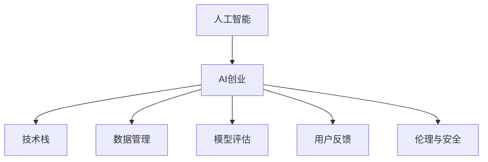

                 

# AI创业者的码头之志：让AI服务于人类

> 关键词：人工智能,创业,技术,人类,服务

## 1. 背景介绍

### 1.1 问题由来
在全球范围，技术创新不断驱动社会进步，人工智能（AI）已经成为推动经济、文化、社会全面发展的重要引擎。AI创业，作为驱动AI技术落地应用的关键力量，正日益被世人瞩目。AI创业者，不仅是技术的布道者，更是人类福祉的守护者。他们将AI技术深深植根于社会的各个角落，将AI服务于人类，实现技术与人类和谐共生的美好愿景。

### 1.2 问题核心关键点
AI创业的核心在于如何让AI技术落地应用，服务人类。这其中包含几个关键点：
1. **数据获取与标注**：高质量的数据是训练AI模型的基础。如何高效地获取和标注数据是AI创业中的重要挑战。
2. **算法选择与优化**：选择适合具体问题的算法，并进行有效的调优，以最大化模型的效果。
3. **模型部署与应用**：将训练好的模型高效部署，并在实际应用中发挥作用。
4. **用户反馈与迭代**：通过用户的反馈，持续优化模型和应用，提升用户体验。
5. **伦理与安全**：确保AI系统公平、透明、可靠，防止数据泄露、算法偏见等问题。

### 1.3 问题研究意义
AI创业者的码头之志，不仅在于技术创新，更在于如何通过技术服务于人类，改善人们的生活。研究AI创业，对于推动技术普及、提升社会福祉、促进经济繁荣具有重要意义。

1. **技术创新驱动**：AI创业将推动更多技术创新，解决人类面临的复杂问题，如医疗、教育、交通等，提升社会整体的技术水平。
2. **社会福祉提升**：通过AI技术，解决社会不公，提升人类生活质量，如医疗服务、教育资源、环境保护等。
3. **经济发展促进**：AI创业将促进产业转型升级，创造新的经济增长点，如智能制造、智慧城市、无人驾驶等。
4. **知识与文化普及**：通过普及AI知识，提升公众对AI技术的理解与认同，促进AI技术的广泛应用。

## 2. 核心概念与联系

### 2.1 核心概念概述

为更好地理解AI创业的核心概念，本节将介绍几个密切相关的核心概念：

- **人工智能**：通过计算机系统模拟人类智能行为的技术，包括机器学习、深度学习、自然语言处理等。
- **AI创业**：指创业者利用人工智能技术，开发新产品或服务，实现技术落地应用的过程。
- **技术栈**：指AI创业所需的各种技术组件和工具，如深度学习框架、数据处理工具、云平台等。
- **数据管理**：指如何高效、安全地管理数据，包括数据收集、清洗、标注、存储等。
- **模型评估**：指评估AI模型的性能和效果，包括精度、召回率、F1-score等指标。
- **用户反馈**：指通过用户反馈，持续优化AI模型和应用，提升用户体验。
- **伦理与安全**：指确保AI系统的公平性、透明性和安全性，防止数据滥用和算法偏见。

这些核心概念之间的逻辑关系可以通过以下Mermaid流程图来展示：



这个流程图展示了大语言模型的核心概念及其之间的关系：

1. 人工智能是AI创业的基础。
2. AI创业需要技术栈的支持，包括数据管理、模型评估、用户反馈等。
3. 数据管理是AI创业的重要环节。
4. 模型评估是衡量AI创业效果的重要指标。
5. 用户反馈是持续优化AI模型的关键。
6. 伦理与安全是AI创业不可忽视的重要方面。

## 3. 核心算法原理 & 具体操作步骤
### 3.1 算法原理概述

AI创业的核心在于如何将AI技术落地应用，服务于人类。这其中涉及到的核心算法原理主要包括：

- **深度学习**：利用多层神经网络进行数据建模，是当前AI创业中最核心的技术。
- **自然语言处理（NLP）**：使机器能够理解、处理和生成人类语言，广泛应用于智能客服、翻译、问答系统等。
- **强化学习**：通过试错过程，优化决策策略，适用于机器人控制、游戏AI等。
- **迁移学习**：将一个领域的知识迁移到另一个领域，适用于跨领域应用。
- **半监督学习**：利用少量标注数据和大量未标注数据，提高模型性能。
- **对抗训练**：通过引入对抗样本，增强模型的鲁棒性。

### 3.2 算法步骤详解

AI创业的技术操作步骤大致可以分为以下几个阶段：

**Step 1: 数据收集与预处理**
- 收集与任务相关的数据，包括结构化数据和非结构化数据。
- 清洗和预处理数据，如去除噪声、处理缺失值、特征工程等。

**Step 2: 数据标注与验证**
- 对数据进行标注，确保数据质量。
- 划分为训练集、验证集和测试集，进行模型训练和验证。

**Step 3: 模型选择与训练**
- 选择适合的算法，如深度学习、NLP等。
- 搭建模型架构，并进行模型训练。

**Step 4: 模型评估与调优**
- 在验证集上评估模型性能，如精度、召回率、F1-score等。
- 根据评估结果进行模型调优，如调整超参数、优化算法等。

**Step 5: 模型部署与应用**
- 将训练好的模型部署到实际应用中。
- 不断收集用户反馈，进行持续优化。

**Step 6: 监测与维护**
- 实时监测系统运行状态，防止模型失效。
- 定期维护和更新模型，确保系统的持续稳定。

### 3.3 算法优缺点

AI创业中的算法优点主要包括：

- **高效性**：深度学习等算法在处理大规模数据时具有高效性。
- **泛化能力**：通过迁移学习等技术，可以实现跨领域应用。
- **可解释性**：通过模型评估和用户反馈，可以逐步提高模型的可解释性。
- **应用广泛**：AI创业涉及领域广泛，如医疗、教育、金融等。

同时，AI创业的算法也存在一些缺点：

- **数据依赖**：模型效果很大程度上依赖于数据的质量和数量。
- **计算资源消耗大**：深度学习等算法需要大量的计算资源。
- **模型复杂度高**：模型结构和参数复杂，难以调试和优化。
- **对抗性攻击风险**：对抗训练等技术虽然可以增强模型鲁棒性，但攻击手段也在不断进化。
- **伦理和安全问题**：AI系统的决策过程难以解释，可能存在伦理和安全风险。

### 3.4 算法应用领域

AI创业的算法技术广泛应用于多个领域，例如：

- **医疗**：智能诊断、个性化治疗、药物研发等。
- **教育**：智能辅导、个性化推荐、学习效果评估等。
- **金融**：风险控制、欺诈检测、智能投顾等。
- **零售**：客户推荐、库存管理、销售预测等。
- **交通**：智能调度、自动驾驶、交通预测等。
- **安全**：网络安全防护、反欺诈检测、视频监控分析等。
- **能源**：智能电网、节能优化、可再生能源管理等。

## 4. 数学模型和公式 & 详细讲解 & 举例说明

### 4.1 数学模型构建

本节将使用数学语言对AI创业中的核心算法进行更加严格的刻画。

记AI系统为 $M$，包括输入数据 $x$ 和输出 $y$，其映射关系为 $M: x \rightarrow y$。假设任务为二分类问题，即输出 $y \in \{0, 1\}$。假设训练集为 $D=\{(x_i, y_i)\}_{i=1}^N$。

定义损失函数 $\mathcal{L}(y, \hat{y})$ 衡量模型的预测输出 $\hat{y}$ 与真实标签 $y$ 之间的差异。常见损失函数包括交叉熵损失、均方误差损失等。

### 4.2 公式推导过程

以交叉熵损失函数为例，推导其表达式及其梯度。

假设模型 $M$ 在输入 $x$ 上的输出为 $\hat{y}=M(x)$。二分类交叉熵损失函数定义为：

$$
\mathcal{L}(y, \hat{y}) = -[y\log \hat{y} + (1-y)\log (1-\hat{y})]
$$

将损失函数对模型参数 $\theta$ 求梯度，得：

$$
\nabla_{\theta}\mathcal{L}(y, \hat{y}) = -\frac{y}{\hat{y}} - \frac{1-y}{1-\hat{y}}
$$

通过反向传播算法，计算出梯度，更新模型参数，最小化损失函数。

### 4.3 案例分析与讲解

以智能推荐系统为例，详细讲解如何构建数据模型并训练模型。

假设用户历史行为数据为 $D=\{(x_i, y_i)\}_{i=1}^N$，其中 $x_i$ 为行为特征向量，$y_i$ 为推荐结果。使用深度学习算法，搭建模型 $M$，定义损失函数为交叉熵损失。

首先，对用户行为数据进行特征工程，提取用户特征 $x_i$。然后，搭建深度学习模型 $M$，如神经网络。在训练过程中，使用交叉熵损失函数，最小化预测结果与实际标签之间的差异。

通过不断迭代训练，优化模型参数，最终得到推荐模型 $M$。该模型可以根据用户新行为数据预测推荐结果，实现个性化推荐。

## 5. 项目实践：代码实例和详细解释说明
### 5.1 开发环境搭建

在进行AI创业项目实践前，我们需要准备好开发环境。以下是使用Python进行TensorFlow开发的环境配置流程：

1. 安装Anaconda：从官网下载并安装Anaconda，用于创建独立的Python环境。

2. 创建并激活虚拟环境：
```bash
conda create -n tf-env python=3.8 
conda activate tf-env
```

3. 安装TensorFlow：根据CUDA版本，从官网获取对应的安装命令。例如：
```bash
conda install tensorflow tensorflow-gpu=cuda11.1 -c tf -c conda-forge
```

4. 安装各类工具包：
```bash
pip install numpy pandas scikit-learn matplotlib tqdm jupyter notebook ipython
```

完成上述步骤后，即可在`tf-env`环境中开始AI创业项目实践。

### 5.2 源代码详细实现

这里我们以智能推荐系统为例，给出使用TensorFlow进行模型开发的PyTorch代码实现。

首先，定义推荐系统数据处理函数：

```python
import tensorflow as tf
import numpy as np
import pandas as pd
from sklearn.model_selection import train_test_split

def load_data(path):
    df = pd.read_csv(path)
    return df

def split_data(df, test_size=0.2):
    train, test = train_test_split(df, test_size=test_size)
    return train, test

def preprocess_data(df):
    # 特征工程等处理
    return df

def build_dataset(df, batch_size=64):
    # 构建数据集，批处理等
    return tf.data.Dataset.from_tensor_slices(df).shuffle(buffer_size=1024).batch(batch_size)
```

然后，定义模型和优化器：

```python
from tensorflow.keras.layers import Input, Dense, Embedding, Dropout
from tensorflow.keras.models import Model
from tensorflow.keras.optimizers import Adam

input_dim = 10
embedding_dim = 128
hidden_dim = 64

input_layer = Input(shape=(input_dim,))
embedding_layer = Embedding(input_dim, embedding_dim)(input_layer)
dropout_layer = Dropout(0.2)(embedding_layer)
dense_layer = Dense(hidden_dim, activation='relu')(dropout_layer)
output_layer = Dense(1, activation='sigmoid')(dense_layer)

model = Model(input_layer, output_layer)
optimizer = Adam(lr=0.001)

# 编译模型
model.compile(optimizer=optimizer, loss='binary_crossentropy', metrics=['accuracy'])
```

接着，定义训练和评估函数：

```python
def train_model(model, train_dataset, epochs=10, batch_size=64):
    # 训练模型
    model.fit(train_dataset, epochs=epochs, batch_size=batch_size)

def evaluate_model(model, test_dataset, batch_size=64):
    # 评估模型
    test_loss, test_acc = model.evaluate(test_dataset, batch_size=batch_size)
    return test_loss, test_acc
```

最后，启动训练流程并在测试集上评估：

```python
train_dataset = preprocess_data(train)
test_dataset = preprocess_data(test)

train_model(model, train_dataset)
test_loss, test_acc = evaluate_model(model, test_dataset)

print(f"Test loss: {test_loss}, Test accuracy: {test_acc}")
```

以上就是使用TensorFlow进行智能推荐系统开发的完整代码实现。可以看到，TensorFlow的高级API使得模型构建和训练变得非常简单，开发者可以将更多精力放在数据处理和模型改进等高层逻辑上，而不必过多关注底层的实现细节。

### 5.3 代码解读与分析

让我们再详细解读一下关键代码的实现细节：

**load_data函数**：
- 读取用户行为数据，并返回Pandas数据框。

**split_data函数**：
- 将数据集划分为训练集和测试集，比例为80:20。

**preprocess_data函数**：
- 进行特征工程，如归一化、编码等处理。

**build_dataset函数**：
- 构建TensorFlow数据集，并进行批处理和随机打乱。

**train_model函数**：
- 使用交叉熵损失函数和Adam优化器，训练模型。

**evaluate_model函数**：
- 在测试集上评估模型性能，输出损失和准确率。

**训练流程**：
- 定义模型架构和优化器，编译模型。
- 加载训练集和测试集，并进行预处理。
- 启动训练流程，并在测试集上评估。

可以看到，TensorFlow提供了强大的API，使得AI创业项目开发变得高效便捷。开发者可以根据具体需求，利用TensorFlow的高级功能，快速搭建模型、训练模型、评估模型，并实现复杂的AI应用。

当然，工业级的系统实现还需考虑更多因素，如模型裁剪、量化加速、服务化封装、弹性伸缩等。但核心的AI创业流程基本与此类似。

## 6. 实际应用场景
### 6.1 智能客服系统

AI创业在智能客服系统中的应用，正日益广泛。通过深度学习和自然语言处理技术，智能客服系统能够高效响应客户咨询，提供全天候服务。

具体而言，可以将客户历史咨询记录作为训练数据，利用AI创业项目开发的模型进行微调。微调后的模型能够自动理解客户意图，匹配最合适的答案模板进行回复。对于客户提出的新问题，还可以接入检索系统实时搜索相关内容，动态组织生成回答。如此构建的智能客服系统，能大幅提升客户咨询体验和问题解决效率。

### 6.2 金融舆情监测

金融机构需要实时监测市场舆论动向，以便及时应对负面信息传播，规避金融风险。AI创业在金融舆情监测中的应用，为金融机构提供了新的解决方案。

具体而言，可以收集金融领域相关的新闻、报道、评论等文本数据，并对其进行主题标注和情感标注。利用AI创业项目开发的模型进行微调，使其能够自动判断文本属于何种主题，情感倾向是正面、中性还是负面。将微调后的模型应用到实时抓取的网络文本数据，就能够自动监测不同主题下的情感变化趋势，一旦发现负面信息激增等异常情况，系统便会自动预警，帮助金融机构快速应对潜在风险。

### 6.3 个性化推荐系统

当前的推荐系统往往只依赖用户的历史行为数据进行物品推荐，无法深入理解用户的真实兴趣偏好。AI创业在个性化推荐系统中的应用，能够更好地挖掘用户行为背后的语义信息，从而提供更精准、多样的推荐内容。

具体而言，可以收集用户浏览、点击、评论、分享等行为数据，提取和用户交互的物品标题、描述、标签等文本内容。利用AI创业项目开发的模型进行微调，从文本内容中准确把握用户的兴趣点。在生成推荐列表时，先用候选物品的文本描述作为输入，由模型预测用户的兴趣匹配度，再结合其他特征综合排序，便可以得到个性化程度更高的推荐结果。

### 6.4 未来应用展望

随着AI创业技术的不断发展，AI系统将在更多领域得到应用，为传统行业带来变革性影响。

在智慧医疗领域，AI创业项目开发的模型可以用于智能诊断、个性化治疗、药物研发等，提升医疗服务的智能化水平，辅助医生诊疗，加速新药开发进程。

在智能教育领域，AI创业项目开发的模型可以用于智能辅导、个性化推荐、学习效果评估等，因材施教，促进教育公平，提高教学质量。

在智慧城市治理中，AI创业项目开发的模型可以用于城市事件监测、舆情分析、应急指挥等环节，提高城市管理的自动化和智能化水平，构建更安全、高效的未来城市。

此外，在企业生产、社会治理、文娱传媒等众多领域，AI创业项目开发的AI应用也将不断涌现，为经济社会发展注入新的动力。相信随着技术的日益成熟，AI创业必将在构建人机协同的智能时代中扮演越来越重要的角色。

## 7. 工具和资源推荐
### 7.1 学习资源推荐

为了帮助开发者系统掌握AI创业的理论基础和实践技巧，这里推荐一些优质的学习资源：

1. TensorFlow官方文档：提供详细的API介绍和实例代码，是TensorFlow开发者的必备资料。
2. PyTorch官方文档：提供深度学习框架的全面介绍和实践指导，适合初学者和专家学习。
3. TensorFlow实战视频教程：由B站UP主"秦玉蓝"发布，涵盖从入门到进阶的完整教程，非常适合初学者上手。
4. Kaggle竞赛：参加Kaggle数据科学竞赛，积累实战经验，提升AI创业项目的开发能力。
5. Coursera《深度学习专项课程》：由吴恩达教授主讲的深度学习课程，提供系统的深度学习理论基础和实践技巧。

通过对这些资源的学习实践，相信你一定能够快速掌握AI创业的精髓，并用于解决实际的AI问题。
###  7.2 开发工具推荐

高效的开发离不开优秀的工具支持。以下是几款用于AI创业开发的常用工具：

1. TensorFlow：由Google主导开发的深度学习框架，生产部署方便，适合大规模工程应用。
2. PyTorch：基于Python的开源深度学习框架，灵活动态的计算图，适合快速迭代研究。
3. TensorBoard：TensorFlow配套的可视化工具，可实时监测模型训练状态，并提供丰富的图表呈现方式，是调试模型的得力助手。
4. Weights & Biases：模型训练的实验跟踪工具，可以记录和可视化模型训练过程中的各项指标，方便对比和调优。
5. PyTorch Lightning：轻量级的深度学习框架，适合快速搭建原型和实验，支持自动化的超参数调优和模型训练。

合理利用这些工具，可以显著提升AI创业项目的开发效率，加快创新迭代的步伐。

### 7.3 相关论文推荐

AI创业的研究源于学界的持续研究。以下是几篇奠基性的相关论文，推荐阅读：

1. Yann LeCun, Yoshua Bengio, Geoffrey Hinton. Deep Learning. 2015.
2. Ian Goodfellow, Yoshua Bengio, Aaron Courville. Deep Learning. 2016.
3. Andrew Ng. Machine Learning Yearning. 2018.
4. Andrew Ng, Fei-Fei Li. Artificial Intelligence: A Modern Approach. 2020.
5. Hinton, Geoffrey E., et al. "Deep learning for self-driving cars." arXiv preprint arXiv:1504.08083 (2015).
6. Sutskever, I., Vinyals, O., & Le, Q. V. (2014). Sequence to sequence learning with neural networks. Neural Information Processing Systems, 2763-2771.

这些论文代表了大语言模型微调技术的发展脉络。通过学习这些前沿成果，可以帮助研究者把握学科前进方向，激发更多的创新灵感。

## 8. 总结：未来发展趋势与挑战

### 8.1 总结

本文对AI创业的核心概念和操作步骤进行了全面系统的介绍。首先阐述了AI创业的背景和意义，明确了AI创业的重要目标是通过AI技术服务于人类。其次，从原理到实践，详细讲解了AI创业中的数学模型和核心算法，给出了AI创业项目的完整代码实例。同时，本文还广泛探讨了AI创业技术在智能客服、金融舆情、个性化推荐等多个行业领域的应用前景，展示了AI创业技术的广阔前景。此外，本文精选了AI创业技术的各类学习资源，力求为读者提供全方位的技术指引。

通过本文的系统梳理，可以看到，AI创业者的码头之志，不仅在于技术创新，更在于如何通过技术服务于人类，改善人们的生活。未来，随着AI技术的不断发展和完善，AI创业必将在更多领域得到应用，为人类社会的进步和繁荣贡献力量。

### 8.2 未来发展趋势

展望未来，AI创业技术将呈现以下几个发展趋势：

1. **技术不断迭代**：深度学习、自然语言处理等技术将不断进步，推动AI创业技术的持续创新。
2. **多模态融合**：AI创业将从单一模态向多模态融合发展，提升系统对复杂场景的理解和处理能力。
3. **智能决策支持**：AI创业将从决策支持向智能决策发展，通过深度学习和大数据分析，实现更加精准和高效的决策。
4. **开源社区壮大**：开源社区将不断壮大，推动AI创业技术的普及和应用。
5. **产业生态完善**：AI创业将逐步形成完善的产业生态，从技术研发到市场应用，实现全链条协同。
6. **跨界应用拓展**：AI创业将从传统行业向更多新兴领域拓展，如智能家居、智慧交通、智慧农业等。

这些趋势凸显了AI创业技术的广阔前景。AI创业技术将在更多领域得到应用，为人类社会的进步和繁荣贡献力量。

### 8.3 面临的挑战

尽管AI创业技术已经取得了显著进展，但在迈向更加智能化、普适化应用的过程中，它仍面临诸多挑战：

1. **数据获取与标注**：高质量的数据是AI创业的基础，如何高效地获取和标注数据是AI创业中的重要挑战。
2. **模型复杂度与计算资源**：AI创业中使用的深度学习模型复杂度高，需要大量的计算资源，可能存在资源瓶颈。
3. **模型鲁棒性与对抗性攻击**：AI创业模型在面对对抗性攻击时，可能表现不稳定，需要进一步提升鲁棒性。
4. **用户隐私与安全**：AI创业模型可能涉及用户隐私数据，如何确保数据安全和隐私保护是重要挑战。
5. **伦理与安全问题**：AI创业模型可能存在伦理问题，如何确保模型的公平性、透明性和安全性是重要课题。
6. **人机协作与用户体验**：AI创业系统如何与人类协同工作，提升用户体验，也是重要挑战。

这些挑战凸显了AI创业技术的复杂性和挑战性，需要研究者不断探索和解决。

### 8.4 研究展望

面对AI创业技术所面临的挑战，未来的研究需要在以下几个方面寻求新的突破：

1. **数据获取与标注**：探索无监督学习、半监督学习等技术，提高数据获取和标注效率。
2. **模型鲁棒性**：研究对抗性训练、鲁棒优化等技术，提升AI创业模型的鲁棒性。
3. **用户隐私与安全**：开发数据加密、隐私保护等技术，确保用户数据安全和隐私保护。
4. **伦理与安全问题**：引入伦理导向的评估指标，开发公平性、透明性、安全性等技术。
5. **人机协作与用户体验**：研究人机交互、用户体验设计等技术，提升人机协同效果。

这些研究方向将推动AI创业技术的不断进步，为人类社会的进步和繁荣贡献力量。

## 9. 附录：常见问题与解答

**Q1：AI创业中的数据获取与标注有哪些方法？**

A: AI创业中的数据获取与标注方法包括：
1. 网络爬虫：从网上抓取公开数据，如新闻、评论等。
2. 众包平台：利用众包平台进行数据标注，如Amazon Mechanical Turk、CrowdFlower等。
3. 公开数据集：利用已有的数据集进行数据获取和标注，如Kaggle、UCI等。
4. 用户行为数据：收集用户在使用产品或服务过程中产生的行为数据，如点击、浏览、购买等。

**Q2：AI创业中如何选择合适的算法？**

A: AI创业中应根据具体任务和数据特点选择合适的算法：
1. 任务类型：对于分类、回归、生成等不同类型的任务，选择不同的算法，如逻辑回归、决策树、GAN等。
2. 数据特点：对于结构化、非结构化等不同类型的数据，选择适合的算法，如RNN、CNN、BERT等。
3. 模型复杂度：对于模型复杂度要求高的任务，选择复杂度高的算法，如深度学习、Transformer等。
4. 计算资源：根据计算资源和硬件配置，选择适合的高效算法，如AdaBoost、随机森林等。

**Q3：AI创业中如何进行模型评估？**

A: AI创业中的模型评估方法包括：
1. 交叉验证：将数据集分为训练集、验证集和测试集，通过交叉验证评估模型性能。
2. 混淆矩阵：对于分类任务，使用混淆矩阵评估模型精度、召回率、F1-score等指标。
3. ROC曲线：对于二分类任务，使用ROC曲线评估模型性能，计算AUC值。
4. MSE和MAE：对于回归任务，使用均方误差和平均绝对误差评估模型性能。
5. ELBO和VAE：对于生成任务，使用ELBO和VAE评估模型性能。

**Q4：AI创业中如何优化模型？**

A: AI创业中的模型优化方法包括：
1. 超参数调优：通过网格搜索、随机搜索等方法，优化模型超参数，如学习率、批大小、迭代次数等。
2. 正则化：使用L2正则、Dropout等方法，防止模型过拟合。
3. 对抗训练：引入对抗样本，提高模型鲁棒性。
4. 迁移学习：利用预训练模型进行迁移学习，提高模型泛化能力。
5. 数据增强：通过回译、近义替换等方式扩充训练集，提高模型泛化能力。

**Q5：AI创业中如何保证模型公平性？**

A: AI创业中的模型公平性保证方法包括：
1. 数据清洗：确保训练数据具有代表性，避免数据偏见。
2. 算法优化：通过公平性导向的算法优化，如权重调整、重新采样等，提升模型公平性。
3. 监督学习：利用公平性监督数据，指导模型训练，确保模型公平性。
4. 透明性：提高模型决策过程的透明性，便于理解和解释。
5. 伦理审查：建立伦理审查机制，定期评估模型公平性。

这些方法可以共同作用，提升AI创业模型的公平性和透明性，确保模型对所有用户公平无偏。

