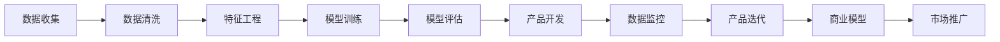

                 

# AI创业者的码头故事：95后博士的选择

## 1. 背景介绍

### 1.1 问题由来

在21世纪的互联网浪潮中，AI成为了最炙手可热的技术领域之一。从AlphaGo战胜世界围棋冠军，到深度学习在医疗、金融、教育等各行各业的大放异彩，AI技术的进步正深刻地改变着人类社会的方方面面。然而，随着AI技术的迅猛发展，行业竞争也变得愈发激烈，创业门槛不断升高，技术人才的争夺也日益白热化。在这样的背景下，一位95后的博士选择了在码头的AI创业之路。

### 1.2 问题核心关键点

作为一位AI创业者，这位95后的博士面临的核心问题是如何在激烈的竞争中脱颖而出，实现商业价值和技术突破的有机结合。这需要他具备以下能力：

1. **技术实力**：扎实的AI算法和模型知识，能够在复杂的场景中提取关键技术要素。
2. **产品思维**：将AI技术应用到实际产品中，能够快速迭代产品功能，满足市场需求。
3. **团队管理**：具备高效的团队管理和协作能力，能够在不同领域的专业人才之间架起桥梁。
4. **商业理解**：深入理解行业现状和用户需求，能够在市场竞争中准确把握机会，快速做出决策。
5. **资源整合**：整合行业资源，建立广泛的行业联系，获取必要的技术支持与资金支持。

通过深入分析这些核心关键点，我们可以更好地理解这位95后博士在AI创业中的挑战和选择。

## 2. 核心概念与联系

### 2.1 核心概念概述

为更好地理解这位95后博士的AI创业之路，我们首先需要梳理涉及的核心概念及其相互联系。

- **AI算法**：包括深度学习、强化学习、迁移学习等，是实现AI技术的基础。
- **深度学习框架**：如TensorFlow、PyTorch等，提供高效、灵活的AI模型开发平台。
- **产品开发流程**：从需求分析、原型设计、模型训练到产品上线，是AI技术转化的关键环节。
- **数据处理与分析**：数据清洗、特征工程、模型评估等，是保证AI模型性能的重要步骤。
- **商业模型构建**：如SaaS、PaaS、BaaS等，将AI产品转化为可操作的商业模式。

这些概念通过一个完整的AI产品开发流程联系起来：



### 2.2 核心概念原理和架构的 Mermaid 流程图


通过这个流程图，我们可以清晰地看到AI产品从模型训练到市场推广的全过程，以及各个环节的关键技术要素。

## 3. 核心算法原理 & 具体操作步骤

### 3.1 算法原理概述

作为AI创业者，这位95后的博士需要掌握的核心算法原理包括深度学习、迁移学习、强化学习等。其中，深度学习是实现AI技术的基础，而迁移学习和强化学习则是在特定场景中实现技术突破的关键。

深度学习框架（如TensorFlow、PyTorch等）提供了高效的模型开发平台，通过反向传播算法和优化器，可以训练出高效、灵活的模型。迁移学习则是利用预训练模型在不同领域的应用，减少数据量和训练时间。强化学习则是通过与环境的交互，优化模型决策，实现自适应学习。

### 3.2 算法步骤详解

1. **数据准备**：收集和处理数据集，保证数据质量和多样性。
2. **模型选择与训练**：选择合适的深度学习框架和模型，进行模型训练和调参。
3. **迁移学习应用**：利用预训练模型进行迁移学习，提升模型性能。
4. **强化学习优化**：通过强化学习算法优化模型决策，提升模型鲁棒性。
5. **产品开发**：将模型转化为实际产品，开发前端和后端系统。
6. **市场推广**：通过市场调研、用户反馈等手段，进行产品推广和迭代。

### 3.3 算法优缺点

深度学习框架和模型具有以下优点：

- **高效灵活**：能够快速迭代模型，适应各种复杂场景。
- **性能优越**：在图像、语音、自然语言处理等领域表现优异。

然而，深度学习也存在以下缺点：

- **资源消耗大**：需要大量计算资源进行模型训练和推理。
- **模型复杂**：模型结构复杂，难以解释和调试。
- **数据依赖高**：模型性能依赖高质量的数据集。

在产品开发和市场推广过程中，需要注意平衡技术突破和商业价值的实现，避免过度依赖技术而忽视用户需求。

### 3.4 算法应用领域

这位95后的博士通过深度学习、迁移学习和强化学习等算法，成功地将AI技术应用到多个领域：

- **医疗领域**：通过深度学习模型实现疾病诊断和预测，利用迁移学习提升模型鲁棒性。
- **金融领域**：通过深度学习模型进行风险评估和信用评分，利用强化学习优化投资决策。
- **教育领域**：通过深度学习模型实现个性化教育，利用迁移学习提升教育效果。

这些领域的应用展示了AI技术的广泛前景，同时也突显了其在实际场景中的巨大潜力。

## 4. 数学模型和公式 & 详细讲解 & 举例说明

### 4.1 数学模型构建

在AI产品开发过程中，数学模型的构建是保证技术实现的关键步骤。以深度学习为例，常见的数学模型包括全连接神经网络、卷积神经网络（CNN）、循环神经网络（RNN）等。

### 4.2 公式推导过程

以全连接神经网络为例，其数学模型构建公式如下：

$$
\begin{align*}
y &= W^TX + b\\
L &= \frac{1}{2m} \sum_{i=1}^m (y_i - \hat{y}_i)^2
\end{align*}
$$

其中 $W$ 为权重矩阵，$b$ 为偏置向量，$X$ 为输入数据，$y$ 为真实标签，$\hat{y}$ 为模型预测结果，$m$ 为样本数量。

### 4.3 案例分析与讲解

以医疗领域的疾病诊断为例，使用深度学习模型进行预测，其流程如下：

1. **数据收集**：收集大量的医疗数据，包括病人的历史病历、检查结果等。
2. **数据预处理**：对数据进行清洗、归一化等处理，保证数据质量和多样性。
3. **模型选择**：选择合适的网络结构和损失函数，如CNN进行图像处理，交叉熵损失函数进行预测。
4. **模型训练**：使用训练集进行模型训练，优化权重矩阵 $W$ 和偏置向量 $b$。
5. **模型评估**：使用测试集进行模型评估，计算准确率、召回率等指标。
6. **模型应用**：将训练好的模型应用到新病人的诊断中，进行预测和决策。

## 5. 项目实践：代码实例和详细解释说明

### 5.1 开发环境搭建

为了快速搭建开发环境，我们推荐使用以下工具：

1. **Python 环境管理**：使用Anaconda或Miniconda进行环境管理，确保各库版本一致。
2. **深度学习框架**：选择TensorFlow或PyTorch作为深度学习框架，利用其丰富的API和文档快速开发。
3. **数据库管理**：使用MySQL或MongoDB进行数据存储和处理。
4. **前端开发**：使用React或Vue.js进行前端开发，提升用户体验。
5. **后端开发**：使用Flask或Django进行后端开发，提供API接口。

### 5.2 源代码详细实现

以下是一个简单的医疗诊断应用的代码实现，包括数据处理、模型训练和预测等环节：

```python
import pandas as pd
import tensorflow as tf
from tensorflow.keras.models import Sequential
from tensorflow.keras.layers import Dense, Dropout

# 加载数据
data = pd.read_csv('medical_data.csv')

# 数据预处理
X = data[['age', 'gender', 'symptoms']]
y = data['disease']

# 定义模型
model = Sequential([
    Dense(64, activation='relu', input_shape=(3,)),
    Dropout(0.5),
    Dense(32, activation='relu'),
    Dropout(0.5),
    Dense(1, activation='sigmoid')
])

# 编译模型
model.compile(optimizer='adam', loss='binary_crossentropy', metrics=['accuracy'])

# 训练模型
model.fit(X, y, epochs=10, batch_size=32)

# 预测
test_data = pd.read_csv('test_data.csv')
X_test = test_data[['age', 'gender', 'symptoms']]
y_pred = model.predict(X_test)
```

### 5.3 代码解读与分析

上述代码实现了基本的医疗诊断模型训练和预测功能，具体解读如下：

- **数据加载与预处理**：使用pandas加载数据，并进行特征提取和处理。
- **模型定义与编译**：定义多层感知器模型，并使用adam优化器和二元交叉熵损失函数进行编译。
- **模型训练**：使用训练集进行模型训练，迭代10轮，每轮32个样本。
- **模型预测**：使用测试集进行模型预测，输出概率值。

## 6. 实际应用场景

### 6.1 医疗领域

在医疗领域，AI技术的应用主要集中在疾病诊断、治疗方案推荐、医疗影像分析等方面。利用深度学习模型，可以提取病历、检查结果等数据中的关键信息，进行疾病预测和诊断。通过迁移学习和强化学习，可以在不同医院和患者群体之间实现知识的共享和优化。

### 6.2 金融领域

在金融领域，AI技术的应用主要集中在风险评估、信用评分、投资决策等方面。利用深度学习模型，可以分析客户的财务数据和行为数据，进行风险预测和信用评分。通过迁移学习和强化学习，可以在不同金融产品和市场环境中实现知识迁移和优化。

### 6.3 教育领域

在教育领域，AI技术的应用主要集中在个性化教育、学习路径推荐、智能辅导等方面。利用深度学习模型，可以分析学生的学习数据和行为数据，进行个性化教育方案的推荐。通过迁移学习和强化学习，可以优化学习路径和教学方法，提升教育效果。

## 7. 工具和资源推荐

### 7.1 学习资源推荐

为了帮助开发者系统掌握AI创业所需的知识，推荐以下学习资源：

1. **深度学习课程**：如Coursera上的《深度学习专项课程》，涵盖深度学习基础、模型训练、模型优化等核心内容。
2. **AI创业书籍**：如《人工智能创业指南》，介绍AI创业的实际案例和经验。
3. **开源项目**：如GitHub上的TensorFlow和PyTorch官方仓库，提供丰富的模型和工具库。
4. **技术博客**：如DeepLearningAI、Towards Data Science等，获取最新的AI技术和应用案例。
5. **在线课程**：如Udacity上的AI创业课程，涵盖AI创业的商业模式、团队管理、市场推广等内容。

### 7.2 开发工具推荐

为了提高AI创业的开发效率，推荐以下开发工具：

1. **IDE**：如PyCharm或Visual Studio Code，支持Python开发。
2. **数据管理**：如MySQL或MongoDB，支持大规模数据存储和处理。
3. **深度学习框架**：如TensorFlow或PyTorch，支持高效的模型训练和推理。
4. **前端开发**：如React或Vue.js，提升用户体验。
5. **后端开发**：如Flask或Django，提供API接口。

### 7.3 相关论文推荐

为深入理解AI创业中的关键技术，推荐以下相关论文：

1. **深度学习论文**：如《ImageNet Classification with Deep Convolutional Neural Networks》，介绍CNN在图像识别中的应用。
2. **迁移学习论文**：如《Transfer Learning in Reinforcement Learning》，介绍迁移学习在强化学习中的应用。
3. **强化学习论文**：如《Playing Atari with Deep Reinforcement Learning》，介绍强化学习在游戏中的应用。
4. **商业模型论文**：如《The Business Value of AI》，介绍AI技术在商业模型中的应用。

## 8. 总结：未来发展趋势与挑战

### 8.1 研究成果总结

AI创业者的码头故事展示了95后博士在AI领域的奋斗历程，从技术突破到产品迭代，再到市场推广，每一个环节都需要精心的策划和执行。通过这个故事，我们看到了AI技术的强大潜力，也看到了其在实际应用中的挑战和机遇。

### 8.2 未来发展趋势

未来，AI创业将继续迎来新的发展机遇，主要体现在以下几个方面：

1. **AI技术普及**：AI技术将逐渐普及到各行各业，催生更多的AI应用场景。
2. **数据资源丰富**：更多的数据资源将为AI技术提供支撑，推动AI技术的进步。
3. **模型性能提升**：深度学习、迁移学习和强化学习等算法的不断优化，将提升AI模型的性能。
4. **商业模型多样化**：SaaS、PaaS、BaaS等多样化的商业模型将为AI技术提供更多应用路径。
5. **行业融合加速**：AI技术将与更多行业进行深度融合，推动产业升级。

### 8.3 面临的挑战

尽管AI创业充满了机遇，但也面临着诸多挑战：

1. **技术瓶颈**：模型性能提升、数据处理等技术瓶颈仍需攻克。
2. **市场竞争激烈**：AI领域的竞争日益激烈，如何在竞争中脱颖而出是一大难题。
3. **商业落地难**：AI技术的商业化需要整合更多行业资源，难度较大。
4. **用户接受度低**：AI技术的应用需要解决用户接受度的问题，增加推广难度。
5. **伦理道德问题**：AI技术的应用需要考虑伦理道德问题，避免技术滥用。

### 8.4 研究展望

面对未来的挑战，AI创业需要从以下几个方面进行突破：

1. **技术突破**：持续优化深度学习、迁移学习和强化学习等算法，提升模型性能。
2. **数据整合**：整合更多行业数据，提升数据资源质量，降低数据处理难度。
3. **商业模式创新**：探索更多商业模式，提升AI技术的商业价值。
4. **用户教育**：通过用户教育，提高AI技术的接受度，增加推广效果。
5. **伦理道德建设**：加强伦理道德建设，确保AI技术的安全性和公正性。

通过不断突破和创新，AI创业者可以在码头的舞台上，不断拓展AI技术的应用边界，推动AI技术的产业化进程，为社会带来更多的价值。

## 9. 附录：常见问题与解答

**Q1：AI创业的第一步是什么？**

A: AI创业的第一步是明确产品定位和市场需求，确保技术创新与市场需求的匹配。

**Q2：如何提高AI模型的性能？**

A: 提高AI模型性能的方法包括：增加数据量、优化模型结构、调整超参数、引入迁移学习和强化学习等。

**Q3：如何进行AI产品迭代？**

A: AI产品迭代主要通过用户反馈、市场调研和数据分析进行，不断优化产品功能和用户体验。

**Q4：如何平衡技术突破和商业价值？**

A: 平衡技术突破和商业价值需要在产品开发过程中，充分考虑用户需求和市场环境，确保技术的实际应用价值。

**Q5：AI创业中常见的风险有哪些？**

A: AI创业中的常见风险包括技术风险、市场风险、资金风险、人才风险等，需要制定详细的风险管理策略。

总之，AI创业者的码头故事为我们展示了一位95后博士在AI领域的奋斗历程，也揭示了AI技术在实际应用中的挑战和机遇。未来，AI创业者需要不断突破技术瓶颈，探索新的商业模式，整合更多行业资源，才能在竞争激烈的市场上占据一席之地，推动AI技术的发展和应用。

