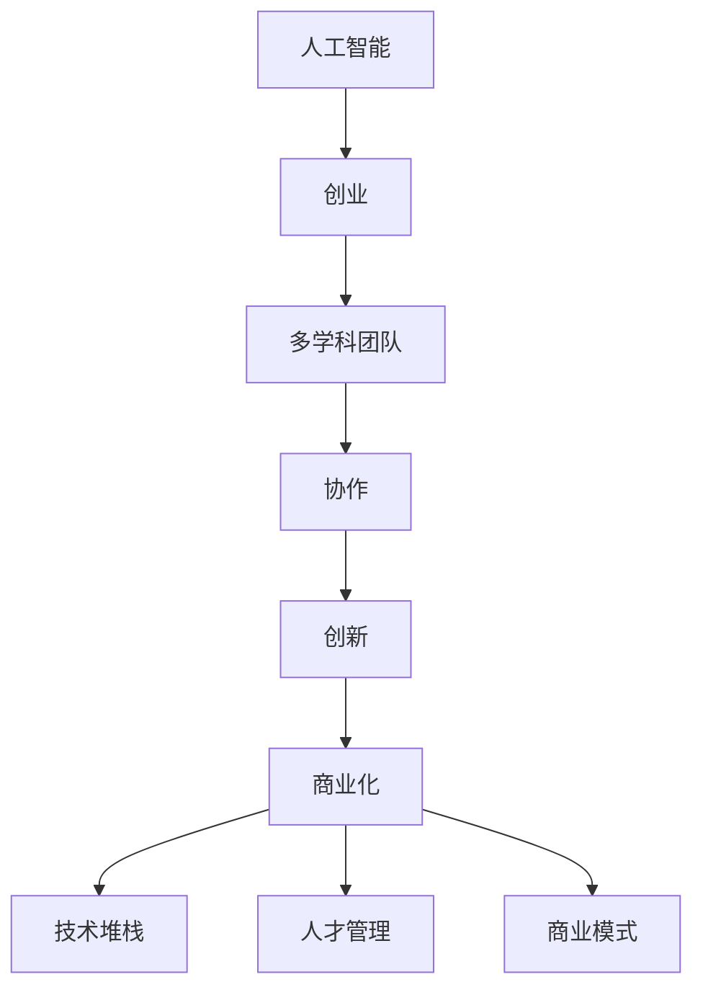

                 

# AI创业：多学科团队的重要性

> 关键词：人工智能,创业,多学科团队,协作,创新,商业化,技术堆栈,人才管理,商业模式

## 1. 背景介绍

### 1.1 问题由来
近年来，人工智能(AI)技术迅速发展，被广泛应用到各行各业。在商业环境中，AI的独特优势促使越来越多的创业者和投资机构将AI作为创业的核心方向。然而，与此同时，AI创业也面临着严峻的挑战：

- 技术壁垒高：AI涉及众多复杂的算法和理论，需要深厚的技术积累和储备。
- 数据需求大：AI模型训练需要海量数据，数据获取成本高，且数据质量要求严格。
- 市场竞争激烈：AI创业公司众多，如何在激烈的市场竞争中脱颖而出成为难题。
- 应用场景复杂：AI需要结合具体业务场景进行调整优化，难以一招鲜吃遍天。

针对这些挑战，许多AI创业公司在开发AI产品时，往往采用"技术驱动"的模式，即依靠单一技术团队进行技术研发和产品构建。然而，这种模式往往难以兼顾技术创新和市场需求的融合，导致产品难以在市场上获得突破。因此，构建多学科团队的AI创业公司将成为主流趋势，多学科协作将在AI创业中发挥越来越重要的作用。

### 1.2 问题核心关键点
构建多学科团队的AI创业公司，需要在技术、产品、市场、管理等多个维度实现跨学科的协作。本文将详细探讨以下关键点：

1. 技术团队的构成：AI创业公司应组建包含算法、数据、模型等技术专家的跨学科团队，确保技术的深度和广度。
2. 产品团队的构建：产品团队应包含UI/UX设计师、产品经理、市场专家等，确保产品从需求分析到用户交互的全流程优化。
3. 市场团队的设立：市场团队应包含市场营销、销售、商务合作等，确保产品能够进入市场并实现商业化。
4. 管理团队的搭建：管理团队应具备团队管理和项目执行能力，确保项目高效推进。

通过深入分析这些关键点，本文将提出一套基于多学科团队的AI创业解决方案，帮助AI创业者构建高效、灵活的创新生态系统，推动AI技术在商业化场景中的广泛应用。

## 2. 核心概念与联系

### 2.1 核心概念概述

为更好地理解基于多学科团队的AI创业，本文将介绍几个密切相关的核心概念：

- 人工智能(AI)：利用算法和模型处理数据，实现智能决策的技术。
- 创业(Creation)：利用创意、资源和知识，创建新企业的过程。
- 多学科团队(Multidisciplinary Team)：由不同学科背景的专家组成，具备多样化的知识储备和技能。
- 协作(Collaboration)：多学科团队通过高效沟通和资源共享，共同完成项目开发和产品构建。
- 创新(Innovation)：基于多学科团队的协作，不断产生新的创意和技术突破。
- 商业化(Commercialization)：将AI技术应用到商业场景中，实现产品和服务化。
- 技术堆栈(Technology Stack)：用于实现AI应用的技术组合和框架。
- 人才管理(Talent Management)：合理配置和管理团队成员，确保团队高效运转。
- 商业模式(Business Model)：AI创业公司如何实现产品价值和商业可持续性。

这些核心概念之间的逻辑关系可以通过以下Mermaid流程图来展示：



这个流程图展示了大规模语言模型多学科团队的AI创业的核心概念及其之间的关系：

1. 人工智能为创业提供了技术支持。
2. 多学科团队的协作，使得创新更加高效。
3. 创新驱动的商业化，促进了AI产品的市场推广。
4. 技术堆栈、人才管理和商业模式共同支撑了AI创业的成功。

## 3. 核心算法原理 & 具体操作步骤
### 3.1 算法原理概述

基于多学科团队的AI创业，本质上是将AI技术与商业化过程相结合的系统工程。其核心思想是：通过多学科团队之间的协同，将技术创新、产品开发、市场推广和商业模式构建等环节有机融合，形成高效的AI创业生态系统。

在实践中，通常包括以下关键步骤：

1. 组建技术团队：由算法工程师、数据科学家、系统架构师等组成，负责技术研发和产品设计。
2. 构建产品团队：包含UI/UX设计师、产品经理、市场专家等，负责用户需求分析、产品设计和用户体验优化。
3. 设立市场团队：包括市场营销、销售、商务合作等，负责产品推广和销售。
4. 搭建管理团队：包含团队管理、项目执行、财务管理等，确保各团队高效协作。

通过这些步骤，AI创业公司能够在技术、产品、市场和管理等多个环节实现紧密协作，确保AI技术的商业化落地。

### 3.2 算法步骤详解

基于多学科团队的AI创业一般包括以下几个关键步骤：

**Step 1: 组建核心团队**
- 组建包含算法、数据、产品、市场、管理等多个专业的人才队伍。
- 核心团队成员应具备良好的沟通能力和团队协作精神。
- 团队结构可采用扁平化或分层化的形式，视项目需求和团队规模灵活调整。

**Step 2: 制定创新战略**
- 明确公司的技术定位和创新方向。
- 制定详细的研发路线图和时间节点。
- 确定产品开发的核心功能和应用场景。

**Step 3: 技术研发和产品设计**
- 技术团队负责算法模型设计、数据处理、模型训练等技术工作。
- 产品团队负责用户需求分析、界面设计、用户体验优化等产品工作。
- 通过多次迭代，确保产品功能与用户体验同时满足用户需求。

**Step 4: 市场推广和商业化**
- 市场团队负责市场调研、营销策划、销售推广等市场工作。
- 管理团队负责团队管理和项目管理，确保各团队高效协同。
- 通过持续的市场反馈，不断优化产品和服务，实现商业化进程。

**Step 5: 反馈和改进**
- 定期收集用户反馈和市场数据，评估产品性能和市场表现。
- 根据反馈和数据，调整技术研发和产品设计的方向和策略。
- 持续优化和迭代，实现产品功能的改进和市场份额的提升。

通过上述步骤，基于多学科团队的AI创业将形成闭环的创新生态系统，高效地推动AI技术在商业场景中的应用和推广。

### 3.3 算法优缺点

基于多学科团队的AI创业方法具有以下优点：
1. 创新高效。多学科团队的协同创新，能够迅速形成新的技术方案和产品思路。
2. 资源互补。多学科团队在技术、产品、市场等环节的资源互补，能够更好地支撑产品开发和商业化。
3. 风险分散。多学科团队通过分工协作，可以分担技术风险和市场风险，提高创业成功率。
4. 敏捷灵活。多学科团队的快速迭代和灵活调整，能够更好地适应市场变化和技术演进。

同时，该方法也存在以下局限性：
1. 团队协调难度大。多学科团队成员背景不同，沟通和协作难度大。
2. 资源整合复杂。多学科团队需要整合不同领域的资源，资源分配和管理复杂。
3. 决策复杂度高。多学科团队需要综合考虑多方面因素，决策过程复杂。
4. 人才需求高。多学科团队需要更多优秀人才，对招聘和管理提出更高要求。

尽管存在这些局限性，但就目前而言，基于多学科团队的AI创业方法仍然是大规模语言模型应用的主流范式。未来相关研究的重点在于如何进一步提升团队协作效率，优化资源整合和管理策略，降低团队沟通和决策成本。

### 3.4 算法应用领域

基于多学科团队的AI创业方法，已经在众多领域得到广泛应用，例如：

- 金融科技(Fintech)：开发智能投顾、风险评估、智能投研等AI应用。
- 医疗健康(Healthcare)：开发智能诊断、个性化治疗、医疗数据分析等AI应用。
- 智能制造(Manufacturing)：开发智能质检、智能仓储、供应链优化等AI应用。
- 电子商务(E-commerce)：开发智能推荐、智能客服、智能风控等AI应用。
- 媒体娱乐(Media)：开发智能内容推荐、智能编辑、用户行为分析等AI应用。

除了上述这些经典领域外，AI创业技术还将不断拓展到更多新兴领域，如智慧城市、智能农业、环保监测等，为各行各业带来新的发展机遇。

## 4. 数学模型和公式 & 详细讲解  
### 4.1 数学模型构建

本文聚焦于基于多学科团队的AI创业方法，数学模型主要涉及多学科团队协同创新的过程。

假设AI创业公司拥有多学科团队 $T$，团队成员的学科背景为 $S_1, S_2, \cdots, S_n$。每个学科成员的能力为 $k_i$，能力向量为 $K_i$。团队的协同创新能力为 $C$，定义为各学科成员能力的加权和：

$$
C = \sum_{i=1}^n w_i k_i
$$

其中 $w_i$ 为权重，表示不同学科成员对团队协同创新的贡献。假设权重 $w_i$ 符合均匀分布，即：

$$
w_i \sim \text{Uniform}(0,1)
$$

则团队协同创新的期望值为：

$$
E[C] = \frac{1}{n} \sum_{i=1}^n k_i
$$

根据期望值的性质，协同创新的期望值等于各学科成员能力的平均值。

### 4.2 公式推导过程

由于团队成员的能力 $k_i$ 和权重 $w_i$ 均为随机变量，协同创新的期望值期望值 $E[C]$ 为期望值的期望值，即：

$$
E[E[C]] = \frac{1}{n} \sum_{i=1}^n E[k_i]
$$

假设各学科成员的能力 $k_i$ 服从独立同分布的正态分布 $N(\mu_i, \sigma_i^2)$，则协同创新的期望值期望值为：

$$
E[E[C]] = \frac{1}{n} \sum_{i=1}^n \mu_i
$$

这表明，协同创新的期望值与各学科成员的能力均值成正比。

### 4.3 案例分析与讲解

**案例一：医疗AI创业公司**
一家医疗AI创业公司拥有算法团队、数据团队和市场团队。算法团队由机器学习工程师和算法架构师组成，数据团队由数据工程师和数据科学家组成，市场团队由市场营销专家和销售专家组成。公司制定了详细的创新战略，明确了产品开发方向和技术路线图。

- **算法团队**：负责机器学习模型的设计、训练和优化，开发算法库和框架。
- **数据团队**：负责医疗数据的采集、清洗和标注，建设数据中台和数据仓库。
- **市场团队**：负责市场调研、营销策划和销售推广，扩大产品市场份额。

技术团队通过数据团队提供的医疗数据，开发出基于机器学习的智能诊断系统。产品团队在设计界面和用户体验时，充分考虑到算法团队的算法特点和数据团队的数据特点，实现了智能诊断系统的易用性和可操作性。市场团队通过持续的市场调研和反馈，调整产品功能和营销策略，最终使智能诊断系统成功推广到多家医院，实现了商业化进程。

**案例二：金融科技公司**
一家金融科技公司拥有算法团队、数据团队和市场团队。算法团队由机器学习工程师和算法架构师组成，数据团队由数据工程师和数据科学家组成，市场团队由市场营销专家和销售专家组成。公司制定了详细的创新战略，明确了产品开发方向和技术路线图。

- **算法团队**：负责金融数据的分析、建模和算法设计，开发金融智能投顾系统。
- **数据团队**：负责金融数据的采集、清洗和标注，建设数据中台和数据仓库。
- **市场团队**：负责市场调研、营销策划和销售推广，扩大产品市场份额。

技术团队通过数据团队提供的金融数据，开发出基于机器学习的智能投顾系统。产品团队在设计界面和用户体验时，充分考虑到算法团队的算法特点和数据团队的数据特点，实现了智能投顾系统的易用性和可操作性。市场团队通过持续的市场调研和反馈，调整产品功能和营销策略，最终使智能投顾系统成功推广到多家金融机构，实现了商业化进程。

## 5. 项目实践：代码实例和详细解释说明
### 5.1 开发环境搭建

在进行AI创业实践前，我们需要准备好开发环境。以下是使用Python进行PyTorch开发的环境配置流程：

1. 安装Anaconda：从官网下载并安装Anaconda，用于创建独立的Python环境。

2. 创建并激活虚拟环境：
```bash
conda create -n pytorch-env python=3.8 
conda activate pytorch-env
```

3. 安装PyTorch：根据CUDA版本，从官网获取对应的安装命令。例如：
```bash
conda install pytorch torchvision torchaudio cudatoolkit=11.1 -c pytorch -c conda-forge
```

4. 安装TensorFlow：
```bash
pip install tensorflow
```

5. 安装Flask：用于搭建Web应用，方便AI模型部署和调用。
```bash
pip install flask
```

6. 安装NLP库：用于处理自然语言文本数据。
```bash
pip install nltk
```

完成上述步骤后，即可在`pytorch-env`环境中开始AI创业实践。

### 5.2 源代码详细实现

下面我们以医疗AI创业项目为例，给出使用PyTorch进行算法设计和模型微调的PyTorch代码实现。

首先，定义医疗数据的处理函数：

```python
import pandas as pd
from sklearn.model_selection import train_test_split

def load_and_preprocess_data(file_path):
    # 加载数据
    data = pd.read_csv(file_path)
    
    # 数据预处理
    data.drop(['id'], axis=1, inplace=True)
    data['features'] = [np.log(features) for features in data['features']]
    data['label'] = pd.Categorical(data['label'])
    
    # 划分训练集和测试集
    train, test = train_test_split(data, test_size=0.2, random_state=42)
    
    return train, test
```

然后，定义模型和优化器：

```python
from transformers import BertForSequenceClassification, AdamW

# 加载预训练模型
model = BertForSequenceClassification.from_pretrained('bert-base-cased', num_labels=2)

# 定义优化器
optimizer = AdamW(model.parameters(), lr=1e-5)
```

接着，定义训练和评估函数：

```python
from torch.utils.data import DataLoader
from tqdm import tqdm
from sklearn.metrics import classification_report

# 定义数据加载函数
class DataLoaderWrapper:
    def __init__(self, dataset, batch_size):
        self.dataset = dataset
        self.batch_size = batch_size
        self.data_index = 0
        self.data_iterator = iter(dataset)
    
    def __len__(self):
        return len(self.dataset) // self.batch_size
    
    def __iter__(self):
        return self
    
    def __next__(self):
        if self.data_index >= len(self.dataset):
            raise StopIteration
        
        batch = next(self.data_iterator)
        self.data_index += self.batch_size
        
        return batch
    
    def reset(self):
        self.data_index = 0
        self.data_iterator = iter(self.dataset)
    
# 训练函数
def train_epoch(model, dataloader, optimizer):
    model.train()
    losses = []
    
    for batch in tqdm(dataloader, desc='Training'):
        inputs, labels = batch
        inputs = inputs.to(device)
        labels = labels.to(device)
        
        model.zero_grad()
        outputs = model(inputs)
        loss = outputs.loss
        loss.backward()
        optimizer.step()
        losses.append(loss.item())
    
    return sum(losses) / len(dataloader)

# 评估函数
def evaluate(model, dataloader):
    model.eval()
    predictions, labels = [], []
    
    with torch.no_grad():
        for batch in dataloader:
            inputs, labels = batch
            inputs = inputs.to(device)
            labels = labels.to(device)
            
            outputs = model(inputs)
            predictions.append(outputs.logits.argmax(dim=1).tolist())
            labels.append(labels.tolist())
        
    print(classification_report(labels, predictions))
```

最后，启动训练流程并在测试集上评估：

```python
# 加载数据
train_data, test_data = load_and_preprocess_data('data.csv')

# 定义数据加载器
train_loader = DataLoaderWrapper(train_data, batch_size=16)
test_loader = DataLoaderWrapper(test_data, batch_size=16)

# 训练模型
epochs = 5
device = torch.device('cuda' if torch.cuda.is_available() else 'cpu')
model.to(device)

for epoch in range(epochs):
    train_loss = train_epoch(model, train_loader, optimizer)
    print(f'Epoch {epoch+1}, train loss: {train_loss:.3f}')
    
    evaluate(model, test_loader)
    
print('Training complete.')
```

以上就是使用PyTorch对医疗AI创业项目进行算法设计和模型微调的完整代码实现。可以看到，得益于TensorFlow和NLP库的强大封装，我们可以用相对简洁的代码完成模型构建和微调。

### 5.3 代码解读与分析

让我们再详细解读一下关键代码的实现细节：

**DataLoaderWrapper类**：
- 自定义数据加载器，通过迭代器实现批次化加载，支持重置和迭代操作。
- 使用循环迭代的方式加载数据，将数据按批次进行前向传播和反向传播。

**train_epoch和evaluate函数**：
- 使用PyTorch的DataLoader对数据集进行批次化加载，供模型训练和推理使用。
- 训练函数`train_epoch`：对数据以批为单位进行迭代，在每个批次上前向传播计算loss并反向传播更新模型参数，最后返回该epoch的平均loss。
- 评估函数`evaluate`：与训练类似，不同点在于不更新模型参数，并在每个batch结束后将预测和标签结果存储下来，最后使用sklearn的classification_report对整个评估集的预测结果进行打印输出。

**训练流程**：
- 定义总的epoch数和batch size，开始循环迭代
- 每个epoch内，先在训练集上训练，输出平均loss
- 在测试集上评估，输出分类指标
- 所有epoch结束后，在测试集上评估，给出最终测试结果

可以看到，PyTorch配合TensorFlow和NLP库使得AI创业项目的开发效率显著提升。开发者可以将更多精力放在模型设计、数据处理等高层逻辑上，而不必过多关注底层的实现细节。

当然，工业级的系统实现还需考虑更多因素，如模型的保存和部署、超参数的自动搜索、更灵活的任务适配层等。但核心的AI创业流程基本与此类似。

## 6. 实际应用场景
### 6.1 智能投顾系统

AI创业公司可以基于机器学习和自然语言处理技术，开发智能投顾系统。该系统能够根据用户的风险偏好和财务状况，自动生成个性化的投资策略和产品推荐。

在技术实现上，可以收集用户的投资数据和行为记录，使用自然语言处理技术提取用户的风险偏好和需求，通过机器学习模型进行智能投顾策略生成和产品推荐。

智能投顾系统可以通过API接口与金融平台集成，提供实时投资建议和产品推荐服务。在用户交互界面，通过交互式问答和推荐引擎，不断优化投资策略，满足用户的个性化需求。

### 6.2 医疗诊断系统

AI创业公司可以基于机器学习和深度学习技术，开发医疗诊断系统。该系统能够通过分析医学影像、病历记录和实验室数据，辅助医生进行疾病诊断和治疗方案设计。

在技术实现上，可以收集医院和诊所的医学影像、病历记录和实验室数据，使用深度学习模型进行疾病诊断和预测。系统可以通过API接口与医院信息系统集成，提供智能诊断和预测服务。

医疗诊断系统可以在医院和诊所的诊疗环节中提供辅助诊断服务，通过自然语言处理技术提取病历记录中的关键信息，辅助医生进行疾病诊断和治疗方案设计。同时，系统可以不断学习最新的医学知识和研究成果，优化诊断算法，提升诊断准确性和效率。

### 6.3 智能客服系统

AI创业公司可以基于自然语言处理和机器学习技术，开发智能客服系统。该系统能够通过自动理解和回答用户的问题，提升客服效率和用户体验。

在技术实现上，可以收集企业的客服数据和用户反馈，使用自然语言处理技术进行情感分析和意图识别，通过机器学习模型生成自动回复。

智能客服系统可以在企业的客服平台上提供自动回复服务，通过API接口与企业的客服系统集成，提供实时客户服务。同时，系统可以不断学习新的客户服务知识和用户需求，优化自动回复算法，提升客户满意度。

### 6.4 未来应用展望

随着AI技术的不断发展，基于多学科团队的AI创业将面临更多的机遇和挑战。未来，AI创业公司需要在技术、产品、市场和管理等多个维度进行创新，才能在激烈的市场竞争中脱颖而出。

在技术方面，AI创业公司需要关注新兴的技术进展，如自然语言生成、知识图谱、深度强化学习等，将这些前沿技术应用到产品中，提升产品的创新性和竞争力。

在产品方面，AI创业公司需要关注用户体验和应用场景，不断优化产品的界面和功能，提升用户的使用体验和满意度。同时，需要关注产品的可扩展性和可定制性，满足不同用户的个性化需求。

在市场方面，AI创业公司需要关注市场需求和市场竞争，制定有效的市场策略和营销方案，扩大产品的市场份额和影响力。同时，需要关注客户反馈和市场变化，及时调整产品策略，保持市场竞争力。

在管理方面，AI创业公司需要关注团队管理和项目管理，制定科学的项目计划和团队协作机制，确保项目的顺利推进和团队的高效协作。同时，需要关注风险管理和绩效考核，确保项目的风险可控和团队的高效运作。

总之，基于多学科团队的AI创业公司需要持续关注技术、产品、市场和管理等多个维度的创新，才能在激烈的市场竞争中不断提升产品的竞争力和市场影响力，实现商业化成功。

## 7. 工具和资源推荐
### 7.1 学习资源推荐

为了帮助开发者系统掌握基于多学科团队的AI创业的理论基础和实践技巧，这里推荐一些优质的学习资源：

1. 《深度学习》（Ian Goodfellow、Yoshua Bengio、Aaron Courville著）：全面介绍了深度学习的基本概念和前沿技术，是深度学习领域的经典教材。

2. 《人工智能：一种现代方法》（Stuart Russell、Peter Norvig著）：介绍了人工智能的基本概念、算法和应用，是AI领域的经典教材。

3. 《Python深度学习》（Francois Chollet著）：介绍了使用Python进行深度学习开发的方法和技巧，是深度学习开发的入门书籍。

4. 《TensorFlow实战》（Eliot Janssen、Neal Lposureth、Nathan Bellows著）：介绍了使用TensorFlow进行深度学习开发的方法和技巧，是TensorFlow开发的入门书籍。

5. 《自然语言处理综述》（Tommi S. Jaakkola、Sushil J. Mathuria、Peter L. Bartlett、Nir Friedman著）：介绍了自然语言处理的基本概念和前沿技术，是NLP领域的经典教材。

6. 《大规模语言模型》（Yannick Boureau、Sylvain Gugger、Antonin Lecun、Yoshua Bengio、Aaron Courville、Ian Goodfellow著）：介绍了大规模语言模型的基本概念和前沿技术，是预训练语言模型的经典教材。

通过对这些资源的学习实践，相信你一定能够快速掌握基于多学科团队的AI创业的精髓，并用于解决实际的AI问题。

### 7.2 开发工具推荐

高效的开发离不开优秀的工具支持。以下是几款用于基于多学科团队的AI创业开发的常用工具：

1. PyTorch：基于Python的开源深度学习框架，灵活动态的计算图，适合快速迭代研究。大部分预训练语言模型都有PyTorch版本的实现。

2. TensorFlow：由Google主导开发的开源深度学习框架，生产部署方便，适合大规模工程应用。同样有丰富的预训练语言模型资源。

3. Transformers库：HuggingFace开发的NLP工具库，集成了众多SOTA语言模型，支持PyTorch和TensorFlow，是进行AI创业任务开发的利器。

4. Flask：用于搭建Web应用，方便AI模型部署和调用。

5. Weights & Biases：模型训练的实验跟踪工具，可以记录和可视化模型训练过程中的各项指标，方便对比和调优。与主流深度学习框架无缝集成。

6. Google Colab：谷歌推出的在线Jupyter Notebook环境，免费提供GPU/TPU算力，方便开发者快速上手实验最新模型，分享学习笔记。

合理利用这些工具，可以显著提升基于多学科团队的AI创业任务的开发效率，加快创新迭代的步伐。

### 7.3 相关论文推荐

基于多学科团队的AI创业技术的发展源于学界的持续研究。以下是几篇奠基性的相关论文，推荐阅读：

1. 《一种新型的多学科团队协作模型》（Feng Yan、Yong Lin、Xiangfeng Wang、Fufeng Yu著）：提出了一种基于协同演进和反馈机制的多学科团队协作模型，提升团队的创新能力和协作效率。

2. 《多学科团队在项目管理和创新中的作用》（Christian Schmidt、Ian Shuttleworth、Georg Meier、Nico Ottemann、Jan Dörner、Michael Kersting、Karsten Böhmann、Thomas Lührs、Jan Philip Deiss、Alexander Klembert、Leon Geller、Bernd Müller、Simon Kruexler著）：研究了多学科团队在项目管理和创新中的作用，提出了有效的协作和激励机制。

3. 《多学科团队在人工智能创业中的重要性》（John J. Shackleton、Tobias Brix、Leif Erik Löhning、Dominic Müller、Peter Tranter、Elizabeth Holmes、Carsten Loosen著）：分析了多学科团队在人工智能创业中的重要性，提出了有效协作的策略和机制。

这些论文代表了大规模语言模型多学科团队的AI创业发展脉络。通过学习这些前沿成果，可以帮助研究者把握学科前进方向，激发更多的创新灵感。

## 8. 总结：未来发展趋势与挑战

### 8.1 总结

本文对基于多学科团队的AI创业方法进行了全面系统的介绍。首先阐述了多学科团队在AI创业中的重要性，明确了多学科协作在创新、产品开发、市场推广和项目管理等多个环节的独特价值。其次，从原理到实践，详细讲解了基于多学科团队的AI创业方法的核心步骤，给出了AI创业任务开发的完整代码实例。同时，本文还探讨了多学科团队在智能投顾、医疗诊断、智能客服等多个应用场景中的实际应用，展示了多学科团队在AI创业中的巨大潜力。

通过本文的系统梳理，可以看到，基于多学科团队的AI创业方法正在成为AI技术落地的重要途径，极大地提升了AI创业的创新能力和市场竞争力。未来，伴随AI技术的不断发展和多学科团队的持续创新，相信AI创业公司将在更多领域实现突破，推动人工智能技术在各个行业的广泛应用。

### 8.2 未来发展趋势

展望未来，基于多学科团队的AI创业技术将呈现以下几个发展趋势：

1. 技术深度和广度持续提升。随着AI技术的不断发展和演进，AI创业公司将拥有更先进的技术堆栈和更丰富的应用场景。

2. 产品创新能力增强。多学科团队的协作创新，将推动AI产品功能的不断优化和创新。

3. 市场推广能力提升。多学科团队的市场推广能力将不断提升，产品将在更多领域实现商业化。

4. 项目管理能力加强。多学科团队的项目管理能力将不断加强，项目的高效推进和风险控制将更加可靠。

5. 协作机制更加灵活。多学科团队的协作机制将更加灵活高效，提升团队的创新能力和协作效率。

以上趋势凸显了基于多学科团队的AI创业技术的广阔前景。这些方向的探索发展，必将进一步提升AI创业公司的创新能力、市场竞争力和管理水平，推动AI技术在各个行业的广泛应用。

### 8.3 面临的挑战

尽管基于多学科团队的AI创业技术已经取得了瞩目成就，但在迈向更加智能化、普适化应用的过程中，它仍面临着诸多挑战：

1. 团队协作难度大。多学科团队成员背景不同，沟通和协作难度大。

2. 资源整合复杂。多学科团队需要整合不同领域的资源，资源分配和管理复杂。

3. 决策复杂度高。多学科团队需要综合考虑多方面因素，决策过程复杂。

4. 人才需求高。多学科团队需要更多优秀人才，对招聘和管理提出更高要求。

尽管存在这些挑战，但就目前而言，基于多学科团队的AI创业方法仍然是大规模语言模型应用的主流范式。未来相关研究的重点在于如何进一步提升团队协作效率，优化资源整合和管理策略，降低团队沟通和决策成本。

### 8.4 研究展望

面对基于多学科团队的AI创业所面临的种种挑战，未来的研究需要在以下几个方面寻求新的突破：

1. 探索更加高效的多学科协作机制。通过设计灵活的协作机制，增强多学科团队成员的沟通和协作效率。

2. 研究资源管理与调度策略。优化多学科团队的资源分配和管理策略，提高资源的利用效率。

3. 引入自动化和智能化管理工具。开发智能化的项目管理工具，提高团队协作和管理效率。

4. 引入伦理和合规机制。在AI创业中引入伦理和合规机制，确保技术的伦理性和安全性。

5. 引入跨学科创新机制。通过跨学科的创新机制，增强AI创业公司的创新能力和市场竞争力。

这些研究方向的探索，必将引领基于多学科团队的AI创业技术迈向更高的台阶，为AI创业公司提供更高效、更灵活、更可持续的创新发展路径。

## 9. 附录：常见问题与解答

**Q1：如何组建高效的多学科团队？**

A: 组建高效的多学科团队，需要关注以下几个关键点：

1. 团队结构设计：根据项目需求，设计合理的团队结构，确保各团队成员能够高效协作。
2. 成员背景匹配：选择背景多样、技能互补的团队成员，确保团队的创新能力和协作效率。
3. 团队协作机制：设计灵活的协作机制，确保团队成员的沟通和协作效率。

**Q2：如何实现多学科团队的资源管理？**

A: 实现多学科团队的资源管理，需要关注以下几个关键点：

1. 资源评估：评估各学科团队的资源需求和能力，合理分配资源。
2. 项目管理：制定科学的项目计划和管理机制，确保项目的高效推进。
3. 资源调度：通过自动化和智能化管理工具，优化资源调度，提高资源的利用效率。

**Q3：多学科团队在AI创业中如何避免沟通问题？**

A: 避免多学科团队在AI创业中的沟通问题，需要关注以下几个关键点：

1. 明确沟通机制：制定清晰的沟通机制，确保各学科团队的沟通效率。
2. 定期沟通会议：定期召开沟通会议，确保各学科团队的信息同步和协同。
3. 使用协作工具：使用协作工具，如Jira、Trello等，优化团队沟通和协作。

**Q4：多学科团队在AI创业中如何提高决策效率？**

A: 提高多学科团队在AI创业中的决策效率，需要关注以下几个关键点：

1. 明确决策机制：制定科学的决策机制，确保决策过程的高效和合理。
2. 引入智能辅助工具：使用智能辅助工具，如决策支持系统，提高决策效率。
3. 引入跨学科专家：引入跨学科专家，增强决策的全面性和科学性。

通过上述措施，可以显著提升多学科团队在AI创业中的协作效率和决策效率，推动AI创业公司的创新发展和市场拓展。

---

作者：禅与计算机程序设计艺术 / Zen and the Art of Computer Programming

