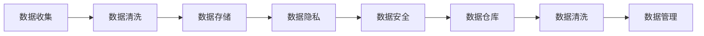

                 

# AI创业：数据管理的实用策略

> 关键词：数据管理, 人工智能, 数据清洗, 数据仓库, 数据隐私, 数据安全

## 1. 背景介绍

随着人工智能（AI）技术的迅猛发展，AI创业公司如雨后春笋般涌现。数据作为AI模型的基础原料，其管理策略的优劣直接关系到AI项目的成败。然而，对于许多AI创业者来说，如何有效地进行数据管理，却是一个困扰他们的大问题。本文将深入探讨AI创业公司数据管理的核心策略，并提供具体实施方案。

## 2. 核心概念与联系

### 2.1 核心概念概述

AI创业公司数据管理的核心概念包括：

- **数据收集**：从多个渠道获取原始数据，包括公开数据集、爬虫抓取、API接口等。
- **数据清洗**：对收集到的数据进行清洗和预处理，去除噪声和异常值。
- **数据存储**：选择合适的存储方式，将清洗后的数据安全存储。
- **数据隐私**：确保数据在存储和传输过程中的隐私性和安全性。
- **数据安全**：采用多种手段防止数据被非法访问和篡改。
- **数据仓库**：构建集中的数据存储和管理平台，支持高效的数据查询和分析。
- **数据清洗**：对收集到的数据进行清洗和预处理，去除噪声和异常值。

这些概念之间存在紧密的联系，形成一个完整的数据管理系统，确保AI模型获得高质量、安全的数据输入，从而提升模型的准确性和鲁棒性。

### 2.2 核心概念原理和架构的 Mermaid 流程图



此流程图展示了数据管理的全流程，从原始数据的收集，到最终的数据管理输出。

## 3. 核心算法原理 & 具体操作步骤

### 3.1 算法原理概述

AI创业公司数据管理的核心算法原理包括：

- **数据清洗算法**：用于去除数据中的噪声、重复值和异常值，提高数据质量。
- **数据存储算法**：采用分布式存储架构，如Hadoop和Spark，支持大规模数据的存储和处理。
- **数据隐私算法**：使用加密技术、差分隐私等手段保护数据隐私。
- **数据安全算法**：采用访问控制、审计、备份等手段确保数据安全。
- **数据仓库算法**：使用SQL和NoSQL数据库构建高效的数据仓库，支持复杂查询和分析。

这些算法共同构成了数据管理的核心技术体系，确保AI模型能够获得高质量、安全的数据输入。

### 3.2 算法步骤详解

**数据收集**：

- 使用API接口获取公开数据集
- 编写爬虫程序抓取互联网数据
- 从内部业务系统导出数据

**数据清洗**：

- 去除重复值
- 处理缺失值
- 去除异常值
- 标准化数据格式

**数据存储**：

- 使用分布式文件系统，如HDFS
- 使用分布式数据库，如HBase、Spark
- 配置数据仓库，如Redshift、BigQuery

**数据隐私**：

- 数据加密
- 差分隐私技术
- 访问控制

**数据安全**：

- 数据备份
- 数据审计
- 访问控制

**数据仓库**：

- 数据建模
- 数据加载
- 数据查询

### 3.3 算法优缺点

**优点**：

- 支持大规模数据处理
- 数据安全有保障
- 数据隐私保护

**缺点**：

- 数据清洗成本高
- 数据存储成本高
- 数据管理复杂

### 3.4 算法应用领域

数据管理算法广泛应用于各个AI创业公司，包括但不限于：

- 自然语言处理（NLP）
- 计算机视觉（CV）
- 机器人学习（RL）
- 推荐系统
- 医疗诊断

## 4. 数学模型和公式 & 详细讲解 & 举例说明

### 4.1 数学模型构建

假设原始数据集为 $D = \{x_1, x_2, ..., x_n\}$，其中 $x_i$ 表示数据点。设清洗后的数据集为 $D_{clean} = \{y_1, y_2, ..., y_n\}$，其中 $y_i$ 表示清洗后的数据点。

数据清洗的目标函数为：

$$
\min_{D_{clean}} \sum_{i=1}^{n} \mathrm{cost}(x_i, y_i)
$$

其中，$\mathrm{cost}(x_i, y_i)$ 表示数据点 $x_i$ 与清理后 $y_i$ 之间的成本函数，成本函数可以定义成欧式距离、曼哈顿距离等。

### 4.2 公式推导过程

以欧式距离为例，公式推导如下：

$$
\mathrm{cost}(x_i, y_i) = \sqrt{\sum_{j=1}^{d} (x_{i,j} - y_{i,j})^2}
$$

其中，$d$ 表示数据点的维数。

### 4.3 案例分析与讲解

以医疗数据为例，原始数据可能包含患者的年龄、性别、身高、体重等，但这些数据中可能存在一些噪声，如错误的年龄记录、身高体重异常值等。清洗后的数据将去除这些噪声，保留真实的数据信息。

## 5. 项目实践：代码实例和详细解释说明

### 5.1 开发环境搭建

在搭建开发环境前，需要确定使用的编程语言、数据存储平台、数据处理框架等。

假设使用的编程语言为Python，数据存储平台为Hadoop，数据处理框架为Spark，搭建步骤如下：

- 安装Python和相关依赖
- 安装Hadoop和Spark
- 配置Hadoop和Spark

### 5.2 源代码详细实现

以下是一个Python代码示例，用于数据清洗：

```python
from pyspark.sql import SparkSession
from pyspark.sql.functions import col, when, length

# 创建SparkSession
spark = SparkSession.builder.appName("DataCleaning").getOrCreate()

# 加载原始数据
df = spark.read.json("input.json")

# 去除重复值
df.dropDuplicates()

# 处理缺失值
df.fillna("Unknown")

# 去除异常值
df = df.where(df["age"].between(18, 100))

# 标准化数据格式
df = df.withColumn("age", col("age").cast("int"))

# 保存清洗后的数据
df.write.json("output.json")
```

### 5.3 代码解读与分析

此代码使用了Spark框架进行数据处理。首先创建SparkSession，并加载原始数据。然后通过dropDuplicates()函数去除重复值，fillna()函数处理缺失值，where()函数去除异常值，withColumn()函数标准化数据格式，最后保存清洗后的数据。

## 6. 实际应用场景

### 6.1 智能医疗

在智能医疗领域，AI创业者需要收集大量患者数据，包括病历、诊断结果、治疗方案等。这些数据需要进行严格的数据清洗和隐私保护，以确保患者隐私。同时，构建高效的数据仓库，能够快速查询和分析患者的医疗记录，为医生的诊断和治疗提供支持。

### 6.2 金融风控

金融风控领域需要收集大量的交易数据、用户数据、市场数据等，这些数据需要进行严格的数据清洗和隐私保护，以确保数据安全和隐私。同时，构建高效的数据仓库，能够快速查询和分析交易数据和用户行为，为风控模型提供支持。

### 6.3 电商推荐

电商推荐领域需要收集大量的用户行为数据、商品数据、交易数据等，这些数据需要进行严格的数据清洗和隐私保护，以确保数据安全和隐私。同时，构建高效的数据仓库，能够快速查询和分析用户行为数据，为推荐模型提供支持。

### 6.4 未来应用展望

未来，随着AI技术的不断进步，数据管理将越来越智能化、自动化。采用先进的机器学习算法进行数据清洗和分析，能够显著提高数据处理的效率和精度。同时，随着区块链、隐私计算等技术的不断发展，数据隐私和安全问题将得到更好的解决。

## 7. 工具和资源推荐

### 7.1 学习资源推荐

1. 《Python for Data Analysis》
2. 《Spark SQL in Action》
3. 《Data Science from Scratch》
4. 《Data Warehouse Toolkit》
5. 《Kubernetes for Deep Learning》

### 7.2 开发工具推荐

1. PySpark：Python的Spark客户端
2. Spark SQL：Spark的SQL查询引擎
3. Hadoop：分布式数据处理框架
4. Elasticsearch：分布式搜索引擎
5. Apache Kafka：分布式消息系统

### 7.3 相关论文推荐

1. "Data Cleaning Algorithms for Big Data" by Kareer et al.
2. "A Survey on Data Privacy Preserving Techniques in Big Data" by Wu et al.
3. "Data Security Management in Big Data" by Li et al.
4. "Big Data Warehouse: Architectural Review and Future Challenges" by Liao et al.

## 8. 总结：未来发展趋势与挑战

### 8.1 研究成果总结

本文介绍了AI创业公司数据管理的核心策略，包括数据收集、数据清洗、数据存储、数据隐私、数据安全和数据仓库等。这些策略能够帮助AI创业者有效地进行数据管理，提升AI模型的准确性和鲁棒性。

### 8.2 未来发展趋势

未来，数据管理将朝着智能化、自动化、安全化方向发展：

- 采用先进的机器学习算法进行数据清洗和分析，提高数据处理的效率和精度。
- 采用区块链、隐私计算等技术，解决数据隐私和安全问题。
- 采用数据湖、数据工厂等新兴技术，实现数据治理的自动化和智能化。

### 8.3 面临的挑战

数据管理面临的挑战包括：

- 数据清洗成本高
- 数据存储成本高
- 数据管理复杂
- 数据隐私和安全问题

### 8.4 研究展望

未来，数据管理需要解决的问题包括：

- 如何降低数据清洗成本
- 如何降低数据存储成本
- 如何简化数据管理
- 如何加强数据隐私和安全

## 9. 附录：常见问题与解答

**Q1: 什么是数据清洗？**

A: 数据清洗是指从原始数据中去除噪声、重复值和异常值，提高数据质量。

**Q2: 如何使用分布式存储架构处理大规模数据？**

A: 使用Hadoop、Spark等分布式存储架构，将数据分散存储在不同的节点上，通过并行计算和分布式处理，提高数据处理效率。

**Q3: 如何保护数据隐私？**

A: 使用数据加密、差分隐私等技术，保护数据在存储和传输过程中的隐私性和安全性。

**Q4: 如何确保数据安全？**

A: 采用访问控制、审计、备份等手段，确保数据不会被非法访问和篡改。

**Q5: 数据仓库的作用是什么？**

A: 数据仓库是一种集中的数据存储和管理平台，支持高效的数据查询和分析。

作者：禅与计算机程序设计艺术 / Zen and the Art of Computer Programming

