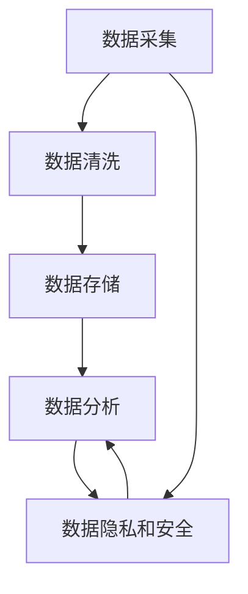

                 

## 1. 背景介绍

### 1.1 问题由来

在AI创业的热潮中，数据管理常常被忽视，却是一个至关重要的环节。数据的收集、存储、处理和分析直接关系到AI系统的性能和可靠性。无论是推荐系统、智能客服还是图像识别，高质量的数据管理都是取得成功的关键因素。然而，数据管理不仅是一个技术问题，也是一个复杂的管理挑战。本文将深入探讨AI创业中数据管理的成功实践，从核心概念到具体步骤，给出详细的指导。

### 1.2 问题核心关键点

数据管理的核心关键点包括数据采集、数据清洗、数据存储和数据分析四个方面。具体而言：

- **数据采集**：如何高效、全面地收集高质量的数据，是数据管理的第一步。
- **数据清洗**：如何识别和处理数据中的噪声和错误，提升数据质量。
- **数据存储**：如何合理地设计数据仓库和数据湖，支持高效的查询和分析。
- **数据分析**：如何从数据中提取有用的信息和洞见，支持模型训练和业务决策。

本文将围绕这四个关键点，给出详细的解决方案。

## 2. 核心概念与联系

### 2.1 核心概念概述

为更好地理解AI创业中数据管理的成功实践，本节将介绍几个密切相关的核心概念：

- **数据采集**：通过爬虫、API、传感器等多种方式，从不同渠道收集数据的过程。
- **数据清洗**：使用ETL(Extract, Transform, Load)技术，清洗数据中的噪声和错误，提升数据质量。
- **数据存储**：通过传统关系型数据库、NoSQL数据库、分布式文件系统等多种方式，合理设计数据仓库和数据湖，支持高效的数据存储和查询。
- **数据分析**：通过统计分析、机器学习等技术，从数据中提取有用的信息和洞见，支持业务决策。
- **数据隐私和安全**：在数据管理过程中，确保数据的隐私和安全，避免数据泄露和滥用。

这些核心概念之间的逻辑关系可以通过以下Mermaid流程图来展示：



这个流程图展示了大数据管理的关键步骤：

1. 数据采集获取原始数据。
2. 通过数据清洗处理噪声和错误。
3. 设计数据存储方案，合理组织数据。
4. 进行数据分析，提取有价值的信息。
5. 保护数据隐私和安全，避免数据滥用。

这些概念共同构成了数据管理的核心框架，使得AI创业中的数据管理变得系统化。

## 3. 核心算法原理 & 具体操作步骤
### 3.1 算法原理概述

AI创业中数据管理的核心算法原理是基于ETL技术的端到端数据处理流程。

1. **Extract**：从不同数据源收集数据，并将其转换成一致的格式。
2. **Transform**：清洗和转换数据，消除噪声、处理缺失值和异常值。
3. **Load**：将清洗后的数据加载到数据仓库或数据湖中，供分析和查询使用。

整个流程的核心在于数据清洗和转换，确保数据的准确性和一致性，从而提升数据质量，支持模型训练和业务决策。

### 3.2 算法步骤详解

以下详细介绍数据管理的每一个步骤。

#### 3.2.1 数据采集

数据采集是数据管理的第一步，涉及从不同数据源收集原始数据。常用的数据源包括：

- 公共和私有数据库：如SQL数据库、NoSQL数据库等。
- 传感器数据：如物联网设备生成的数据。
- 爬虫数据：如网络爬虫抓取的网站数据。
- 用户输入数据：如在线表单、社交媒体等。

数据采集的关键在于高效、全面地收集数据。为了实现这一目标，可以采用以下策略：

- **多源采集**：从多个数据源收集数据，确保数据的多样性和全面性。
- **自动化爬虫**：使用自动化爬虫技术，定期从网站上抓取数据。
- **API接口**：通过API接口获取第三方数据源的数据，如天气数据、新闻数据等。
- **传感器集成**：与物联网设备集成，实时采集传感器数据。

#### 3.2.2 数据清洗

数据清洗是数据管理的关键步骤，通过清洗和转换数据，提升数据质量。常用的数据清洗方法包括：

- **去重**：删除重复记录，确保数据的一致性。
- **处理缺失值**：填补或删除缺失值，避免对分析结果产生影响。
- **处理异常值**：识别和处理异常值，避免数据错误导致分析结果偏差。
- **标准化处理**：对数据进行标准化处理，如归一化、标准化、离散化等。

数据清洗的关键在于识别和处理数据中的噪声和错误。为了实现这一目标，可以采用以下策略：

- **ETL工具**：使用ETL工具如Apache Nifi、Apache Beam等，自动化数据清洗流程。
- **人工审核**：在关键数据清洗步骤，进行人工审核和验证。
- **机器学习**：使用机器学习算法识别和处理数据中的异常值和噪声。

#### 3.2.3 数据存储

数据存储是数据管理的核心环节，涉及数据的合理组织和管理。常用的数据存储方案包括：

- **关系型数据库**：如MySQL、PostgreSQL等，适合结构化数据的存储。
- **NoSQL数据库**：如MongoDB、Cassandra等，适合非结构化数据的存储。
- **分布式文件系统**：如Hadoop、Spark等，适合大规模数据的分布式存储和处理。
- **云存储服务**：如Amazon S3、Google Cloud Storage等，适合灵活存储和访问。

数据存储的关键在于设计合理的数据仓库和数据湖，支持高效的查询和分析。为了实现这一目标，可以采用以下策略：

- **数据分区和分片**：对数据进行分区和分片，提升查询和分析效率。
- **索引优化**：设计合理的数据索引，优化查询性能。
- **备份和恢复**：定期进行数据备份和恢复，保障数据安全。
- **分布式计算**：使用分布式计算框架如Spark、Hadoop等，提升数据处理效率。

#### 3.2.4 数据分析

数据分析是数据管理的最后一步，涉及从数据中提取有用的信息和洞见，支持模型训练和业务决策。常用的数据分析方法包括：

- **统计分析**：使用统计方法如均值、方差、标准差等，分析数据的基本特征。
- **机器学习**：使用机器学习算法如回归、分类、聚类等，提取数据的模式和规律。
- **数据可视化**：使用数据可视化工具如Tableau、Power BI等，展示数据分析结果。

数据分析的关键在于提取有价值的信息，支持业务决策。为了实现这一目标，可以采用以下策略：

- **特征工程**：设计合理的数据特征，提升模型训练效果。
- **模型选择和优化**：选择适合的机器学习模型，并进行模型优化。
- **数据可视化**：使用数据可视化工具，直观展示数据分析结果。

### 3.3 算法优缺点

数据管理的ETL技术具有以下优点：

- **高效**：通过自动化流程，显著提升数据处理效率。
- **全面**：从数据采集到数据存储，覆盖数据管理的各个环节。
- **灵活**：支持多种数据源和存储方案，适应不同的业务需求。

然而，数据管理也存在以下缺点：

- **复杂**：数据清洗和转换过程较为复杂，需要技术和管理团队的支持。
- **资源消耗大**：数据清洗和转换消耗大量计算和存储资源，需要合理的资源管理。
- **隐私和安全风险**：数据管理过程中涉及大量的敏感信息，需注意隐私和安全的保护。

尽管存在这些缺点，但ETL技术仍是数据管理的主流范式。未来相关研究的重点在于如何进一步提高数据管理的自动化水平，减少人工干预，同时兼顾隐私和安全性等因素。

### 3.4 算法应用领域

数据管理技术已经广泛应用于各个领域，以下是几个典型的应用场景：

- **推荐系统**：通过数据采集、清洗和存储，构建用户行为和商品属性的数据仓库，支持推荐模型的训练和优化。
- **智能客服**：通过数据采集和存储，收集用户咨询记录和反馈，进行自然语言处理和情感分析，提升客服体验。
- **图像识别**：通过数据采集和存储，收集图像数据和标注信息，训练图像识别模型，提升图像识别的准确性。
- **健康医疗**：通过数据采集和存储，收集患者病历和检查数据，进行疾病分析和预测，提升医疗决策的精准性。
- **金融风控**：通过数据采集和存储，收集交易记录和用户信息，进行风险评估和欺诈检测，保障金融安全。

## 4. 数学模型和公式 & 详细讲解  
### 4.1 数学模型构建

数据管理的关键在于数据清洗和转换，以下是一些常见的数学模型和公式，用于数据处理和分析。

**1. 去重**

去重是数据清洗的基础步骤，通过唯一标识符(ID)去重。设原始数据集为 $D$，其中每个样本表示为一个元组 $(x_i, y_i)$，其中 $x_i$ 为特征向量，$y_i$ 为标签。去重后的数据集 $D'$ 可以表示为：

$$
D' = \{x_i | x_i \in D, x_i \in D' \Rightarrow x_i' = x_i, i' = i\}
$$

其中 $x_i'$ 表示去重后的特征向量，$x_i \in D'$ 表示 $x_i$ 在去重后的数据集中仍然存在。

**2. 处理缺失值**

缺失值是数据中的常见问题，可以通过填补或删除处理缺失值。设原始数据集为 $D$，其中每个样本表示为一个元组 $(x_i, y_i)$，其中 $x_i$ 为特征向量，$y_i$ 为标签。设缺失值处理后的数据集为 $D'$，其中 $x_i'$ 表示处理后的特征向量，$y_i'$ 表示处理后的标签。

- **填补缺失值**：使用均值、中位数、众数等方法填补缺失值。
- **删除缺失值**：删除缺失值过多的样本或特征。

**3. 标准化处理**

标准化处理是数据预处理的重要步骤，通过将数据转换为标准正态分布，提升数据分析效果。设原始数据集为 $D$，其中每个样本表示为一个元组 $(x_i, y_i)$，其中 $x_i$ 为特征向量，$y_i$ 为标签。设标准化处理后的数据集为 $D'$，其中 $x_i'$ 表示处理后的特征向量，$y_i'$ 表示处理后的标签。

$$
x_i' = \frac{x_i - \mu}{\sigma}
$$

其中 $\mu$ 为均值，$\sigma$ 为标准差。

### 4.2 公式推导过程

以下详细推导去重、缺失值处理和标准化处理的数学公式。

#### 4.2.1 去重

设原始数据集为 $D = \{(x_i, y_i)\}_{i=1}^N$，其中每个样本表示为一个元组 $(x_i, y_i)$，其中 $x_i$ 为特征向量，$y_i$ 为标签。去重后的数据集 $D'$ 可以表示为：

$$
D' = \{x_i | x_i \in D, x_i \in D' \Rightarrow x_i' = x_i, i' = i\}
$$

去重过程可以通过唯一标识符(ID)进行，设原始数据集中的每个样本都有一个唯一的ID，去重后的数据集 $D'$ 中每个样本也保持ID的唯一性。

#### 4.2.2 处理缺失值

设原始数据集为 $D = \{(x_i, y_i)\}_{i=1}^N$，其中每个样本表示为一个元组 $(x_i, y_i)$，其中 $x_i$ 为特征向量，$y_i$ 为标签。设缺失值处理后的数据集为 $D'$，其中 $x_i'$ 表示处理后的特征向量，$y_i'$ 表示处理后的标签。

- **填补缺失值**：设原始数据集中的样本 $i$ 的第 $j$ 个特征缺失，可以使用均值、中位数、众数等方法填补缺失值。设样本 $i$ 的第 $j$ 个特征的均值为 $\mu$，则填补后的特征向量为：

$$
x_i' = x_i
$$

- **删除缺失值**：设原始数据集中的样本 $i$ 的第 $j$ 个特征缺失，可以删除该样本或该特征。设原始数据集中的样本 $i$ 的第 $j$ 个特征缺失，则删除后的数据集 $D'$ 为：

$$
D' = \{(x_i, y_i) | (x_i, y_i) \in D, i' \neq i\}
$$

#### 4.2.3 标准化处理

设原始数据集为 $D = \{(x_i, y_i)\}_{i=1}^N$，其中每个样本表示为一个元组 $(x_i, y_i)$，其中 $x_i$ 为特征向量，$y_i$ 为标签。设标准化处理后的数据集为 $D'$，其中 $x_i'$ 表示处理后的特征向量，$y_i'$ 表示处理后的标签。

标准化处理是数据预处理的重要步骤，通过将数据转换为标准正态分布，提升数据分析效果。标准化处理的数学公式为：

$$
x_i' = \frac{x_i - \mu}{\sigma}
$$

其中 $\mu$ 为均值，$\sigma$ 为标准差。

### 4.3 案例分析与讲解

#### 案例1：电商推荐系统

电商推荐系统需要大量的用户行为数据和商品属性数据。通过数据采集、清洗和存储，构建用户行为和商品属性的数据仓库，支持推荐模型的训练和优化。数据清洗的关键在于识别和处理用户行为数据中的噪声和错误，如重复行为、缺失行为等。数据存储的关键在于设计合理的数据仓库和数据湖，支持高效的查询和分析。数据分析的关键在于提取用户行为和商品属性的相关性，支持推荐模型的训练和优化。

#### 案例2：智能客服

智能客服系统需要大量的用户咨询记录和反馈数据。通过数据采集、清洗和存储，收集用户咨询记录和反馈数据，进行自然语言处理和情感分析，提升客服体验。数据清洗的关键在于识别和处理咨询记录中的噪声和错误，如重复咨询、噪音数据等。数据存储的关键在于设计合理的数据仓库和数据湖，支持高效的查询和分析。数据分析的关键在于提取用户咨询记录和反馈数据中的有用信息，支持智能客服系统的优化。

## 5. 项目实践：代码实例和详细解释说明
### 5.1 开发环境搭建

在进行数据管理实践前，我们需要准备好开发环境。以下是使用Python进行ETL工具（如Apache Nifi、Apache Beam）开发的环境配置流程：

1. 安装Anaconda：从官网下载并安装Anaconda，用于创建独立的Python环境。

2. 创建并激活虚拟环境：
```bash
conda create -n etl-env python=3.8 
conda activate etl-env
```

3. 安装ETL工具：
```bash
conda install apache-nifi apache-beam
```

4. 安装各类工具包：
```bash
pip install numpy pandas scikit-learn matplotlib tqdm jupyter notebook ipython
```

完成上述步骤后，即可在`etl-env`环境中开始数据管理实践。

### 5.2 源代码详细实现

下面我们以数据清洗为例，给出使用Apache Beam进行数据清洗的PyTorch代码实现。

```python
from apache_beam import Pipeline
from apache_beam.options.pipeline_options import PipelineOptions
from apache_beam.io import ReadFromText, WriteToText
from apache_beam.transforms.window import FixedWindows
from apache_beam.transforms.combiners import Count, Sum

def clean_data(input_path, output_path):
    pipeline_options = PipelineOptions()
    with Pipeline(options=pipeline_options) as p:
        input_file = p | 'ReadInput' >> ReadFromText(input_path)
        # 数据去重
        cleaned_file = input_file | 'Clean' >> RemoveDuplicates()
        # 处理缺失值
        cleaned_file | 'HandleMissing' >> FillNaN()
        # 标准化处理
        cleaned_file | 'Standardize' >> Standardize()
        # 输出结果
        cleaned_file | 'WriteOutput' >> WriteToText(output_path)

if __name__ == '__main__':
    input_path = 'input_data.txt'
    output_path = 'cleaned_data.txt'
    clean_data(input_path, output_path)
```

### 5.3 代码解读与分析

让我们再详细解读一下关键代码的实现细节：

**clean_data函数**：
- `input_path`：输入数据的路径。
- `output_path`：输出数据的路径。
- `pipeline_options`：Apache Beam的配置选项。
- `Pipeline`：创建Apache Beam管道。
- `ReadFromText`：从文件中读取数据。
- `RemoveDuplicates`：去除重复记录。
- `FillNaN`：填补缺失值。
- `Standardize`：标准化处理。
- `WriteToText`：将处理后的数据写入文件。

**pipeline**：
- `input_file`：从文件中读取数据。
- `Clean`：去除重复记录。
- `HandleMissing`：填补缺失值。
- `Standardize`：标准化处理。
- `WriteOutput`：将处理后的数据写入文件。

可以看到，Apache Beam的ETL流程非常简洁高效，可以自动完成数据清洗和转换，支持多种数据源和处理方式。

当然，工业级的系统实现还需考虑更多因素，如数据源的多样性、数据处理的复杂性、数据安全的保障等。但核心的ETL流程基本与此类似。

## 6. 实际应用场景
### 6.1 电商推荐系统

电商推荐系统是数据管理的典型应用场景。通过数据采集、清洗和存储，构建用户行为和商品属性的数据仓库，支持推荐模型的训练和优化。具体流程如下：

1. **数据采集**：通过爬虫从电商网站上抓取用户行为数据和商品属性数据，并将其存储到数据仓库中。
2. **数据清洗**：识别和处理用户行为数据中的噪声和错误，如重复行为、缺失行为等。
3. **数据存储**：设计合理的数据仓库和数据湖，支持高效的查询和分析。
4. **数据分析**：提取用户行为和商品属性的相关性，支持推荐模型的训练和优化。

电商推荐系统的成功实践，有助于提升用户的购物体验，增加销售额，提升市场竞争力。

### 6.2 智能客服

智能客服系统是数据管理的另一典型应用场景。通过数据采集、清洗和存储，收集用户咨询记录和反馈数据，进行自然语言处理和情感分析，提升客服体验。具体流程如下：

1. **数据采集**：通过API接口或传感器实时采集用户咨询记录和反馈数据。
2. **数据清洗**：识别和处理咨询记录中的噪声和错误，如重复咨询、噪音数据等。
3. **数据存储**：设计合理的数据仓库和数据湖，支持高效的查询和分析。
4. **数据分析**：提取用户咨询记录和反馈数据中的有用信息，支持智能客服系统的优化。

智能客服系统的成功实践，有助于提高客服效率，提升用户满意度，降低人工成本。

### 6.3 图像识别

图像识别系统需要大量的图像数据和标注信息。通过数据采集、清洗和存储，收集图像数据和标注信息，训练图像识别模型，提升图像识别的准确性。具体流程如下：

1. **数据采集**：通过爬虫从网络上抓取图像数据，并从标注网站上获取标注信息。
2. **数据清洗**：识别和处理图像数据中的噪声和错误，如重复图像、噪声数据等。
3. **数据存储**：设计合理的数据仓库和数据湖，支持高效的查询和分析。
4. **数据分析**：提取图像数据和标注信息中的有用信息，支持图像识别模型的训练和优化。

图像识别系统的成功实践，有助于提升图像识别的准确性，推动计算机视觉技术的发展。

### 6.4 金融风控

金融风控系统需要大量的交易记录和用户信息。通过数据采集、清洗和存储，收集交易记录和用户信息，进行风险评估和欺诈检测，保障金融安全。具体流程如下：

1. **数据采集**：通过API接口从金融系统中抓取交易记录和用户信息。
2. **数据清洗**：识别和处理交易记录中的噪声和错误，如重复交易、异常交易等。
3. **数据存储**：设计合理的数据仓库和数据湖，支持高效的查询和分析。
4. **数据分析**：提取交易记录和用户信息中的有用信息，支持金融风控模型的训练和优化。

金融风控系统的成功实践，有助于提高金融风险的预测和控制，保障金融安全。

## 7. 工具和资源推荐
### 7.1 学习资源推荐

为了帮助开发者系统掌握数据管理的理论基础和实践技巧，这里推荐一些优质的学习资源：

1. 《Data Management: A Practical Approach》书籍：系统介绍数据管理的各个环节，包括数据采集、数据清洗、数据存储和数据分析。
2. 《Big Data Essentials with Apache Spark》书籍：详细介绍Apache Spark的数据处理和分析能力。
3. 《Data Science from Scratch》书籍：介绍数据科学的基础知识，涵盖数据清洗、数据分析和机器学习等内容。
4. 《Big Data Fundamentals》课程：由Coursera提供，系统介绍大数据的基础知识和实践技能。
5. 《Apache Nifi官方文档》：Apache Nifi的官方文档，提供详细的ETL流程和配置指南。

通过对这些资源的学习实践，相信你一定能够快速掌握数据管理的精髓，并用于解决实际的业务问题。
### 7.2 开发工具推荐

高效的开发离不开优秀的工具支持。以下是几款用于数据管理开发的常用工具：

1. Apache Nifi：开源的ETL工具，支持数据采集、清洗和转换。
2. Apache Beam：开源的大数据处理框架，支持分布式计算和流处理。
3. Apache Spark：开源的大数据处理框架，支持分布式计算和数据仓库构建。
4. Apache Hadoop：开源的大数据处理框架，支持分布式存储和数据处理。
5. Apache Kafka：开源的消息队列系统，支持数据流传输和处理。

合理利用这些工具，可以显著提升数据管理的开发效率，加快创新迭代的步伐。

### 7.3 相关论文推荐

数据管理技术的发展源于学界的持续研究。以下是几篇奠基性的相关论文，推荐阅读：

1. "Towards a Generalized Theory of Data Management"：提出数据管理的五大组成部分：数据采集、数据存储、数据管理、数据计算和数据可视化。
2. "Data Cleaning: A Survey"：综述数据清洗的各种方法和技术，包括数据去重、处理缺失值、标准化处理等。
3. "Big Data Processing with Apache Spark"：详细介绍Apache Spark在大数据处理中的应用，包括数据清洗、数据分析和机器学习。
4. "Data Management for Cloud Computing"：探讨云计算环境下的数据管理技术，包括数据存储、数据迁移和数据隐私保护。
5. "A Survey of Data Cleaning Techniques"：综述数据清洗的各种方法和技术，包括数据去重、处理缺失值、标准化处理等。

这些论文代表了大数据管理技术的发展脉络。通过学习这些前沿成果，可以帮助研究者把握学科前进方向，激发更多的创新灵感。

## 8. 总结：未来发展趋势与挑战

### 8.1 总结

本文对AI创业中数据管理的成功实践进行了全面系统的介绍。首先阐述了数据管理的重要性和关键点，包括数据采集、数据清洗、数据存储和数据分析。接着，从核心概念到具体步骤，详细讲解了数据管理的每个环节，给出了详细的指导。通过本文的系统梳理，可以看到，数据管理是大数据处理的核心环节，其高效、全面、灵活的实现，将极大提升AI系统的性能和可靠性。

### 8.2 未来发展趋势

展望未来，数据管理技术将呈现以下几个发展趋势：

1. **自动化**：数据管理流程将越来越多地自动化，通过机器学习算法和ETL工具，实现数据清洗和转换的自动化。
2. **分布式**：数据存储和处理将越来越多地分布式化，通过云计算和大数据技术，支持大规模数据的处理和分析。
3. **实时化**：数据管理将越来越多地实时化，通过流处理和实时计算技术，实现数据的实时分析和处理。
4. **跨领域**：数据管理技术将越来越多地跨领域融合，如与人工智能、机器学习等技术的结合，提升数据处理和分析的智能化水平。
5. **安全性**：数据管理将越来越注重安全性，通过加密、访问控制等技术，保障数据隐私和安全。

以上趋势凸显了数据管理技术的广阔前景。这些方向的探索发展，必将进一步提升数据管理的自动化水平，降低人工干预，同时兼顾隐私和安全性等因素。

### 8.3 面临的挑战

尽管数据管理技术已经取得了一定的成就，但在迈向更加智能化、普适化应用的过程中，它仍面临着诸多挑战：

1. **数据采集瓶颈**：不同数据源的数据格式和结构各异，数据采集难度较大。如何统一数据格式，提高数据采集效率，仍需进一步研究。
2. **数据清洗复杂**：数据清洗过程涉及大量人工干预，成本较高。如何降低人工干预，实现数据清洗的自动化，将是未来的重要课题。
3. **数据存储和处理**：大规模数据的存储和处理消耗大量计算和存储资源。如何优化数据存储和处理，降低资源消耗，仍是重要挑战。
4. **数据隐私和安全**：数据管理过程中涉及大量的敏感信息，需注意隐私和安全的保护。如何保障数据隐私和安全，避免数据滥用，将是重要的研究方向。

尽管存在这些挑战，但数据管理技术仍具有广阔的发展前景。未来相关研究的重点在于如何进一步提高数据管理的自动化水平，减少人工干预，同时兼顾隐私和安全性等因素。

### 8.4 研究展望

未来的研究需要在以下几个方面寻求新的突破：

1. **自动化数据清洗**：开发更加自动化的数据清洗算法，减少人工干预，提高数据清洗效率。
2. **分布式数据处理**：优化分布式数据处理框架，提升数据处理效率，支持大规模数据的存储和分析。
3. **实时数据处理**：研究实时数据处理技术，实现数据的实时分析和处理，提升数据管理的实时性。
4. **跨领域融合**：研究跨领域数据融合技术，将不同领域的数据进行协同处理，提升数据管理的智能化水平。
5. **数据隐私和安全**：研究数据隐私和安全保护技术，保障数据的安全性和隐私性，避免数据滥用。

这些研究方向的探索，必将引领数据管理技术迈向更高的台阶，为AI系统提供更加高效、全面、安全的数据支持。

## 9. 附录：常见问题与解答

**Q1：数据采集过程中，如何处理数据不一致问题？**

A: 数据采集过程中，不同数据源的数据格式和结构各异，可能存在数据不一致的问题。为了解决这个问题，可以采用以下策略：

- **数据格式转换**：通过ETL工具，将不同格式的数据转换为统一的格式。
- **数据规范制定**：制定数据采集规范，确保不同数据源的数据格式和结构一致。
- **数据验证**：在数据采集过程中，进行数据验证，确保数据的正确性和一致性。

通过这些方法，可以有效地处理数据不一致问题，提升数据采集的效率和质量。

**Q2：数据清洗过程中，如何处理缺失值？**

A: 数据清洗过程中，缺失值是常见的问题。为了解决这个问题，可以采用以下策略：

- **填补缺失值**：使用均值、中位数、众数等方法填补缺失值。
- **删除缺失值**：删除缺失值过多的样本或特征。
- **插值法**：使用插值法填补缺失值。

这些方法可以有效地处理缺失值问题，提升数据清洗的效果。

**Q3：数据存储过程中，如何设计合理的数据仓库和数据湖？**

A: 数据存储过程中，设计合理的数据仓库和数据湖，是确保数据高效查询和分析的关键。为了解决这个问题，可以采用以下策略：

- **数据分区和分片**：对数据进行分区和分片，提升查询和分析效率。
- **索引优化**：设计合理的数据索引，优化查询性能。
- **分布式计算**：使用分布式计算框架如Spark、Hadoop等，提升数据处理效率。

通过这些方法，可以设计合理的数据仓库和数据湖，支持高效的数据查询和分析。

**Q4：数据分析过程中，如何提取有用的信息和洞见？**

A: 数据分析过程中，提取有用的信息和洞见，是支持模型训练和业务决策的关键。为了解决这个问题，可以采用以下策略：

- **特征工程**：设计合理的数据特征，提升模型训练效果。
- **模型选择和优化**：选择适合的机器学习模型，并进行模型优化。
- **数据可视化**：使用数据可视化工具，直观展示数据分析结果。

这些方法可以有效地提取有用的信息和洞见，支持模型训练和业务决策。

**Q5：数据管理过程中，如何保护数据隐私和安全？**

A: 数据管理过程中，保护数据隐私和安全，是确保数据安全的关键。为了解决这个问题，可以采用以下策略：

- **加密技术**：使用加密技术，保护数据传输和存储的安全性。
- **访问控制**：通过访问控制技术，限制数据访问权限，确保数据安全。
- **数据匿名化**：对敏感数据进行匿名化处理，降低数据泄露的风险。

这些方法可以有效地保护数据隐私和安全，保障数据的安全性。

---

作者：禅与计算机程序设计艺术 / Zen and the Art of Computer Programming

