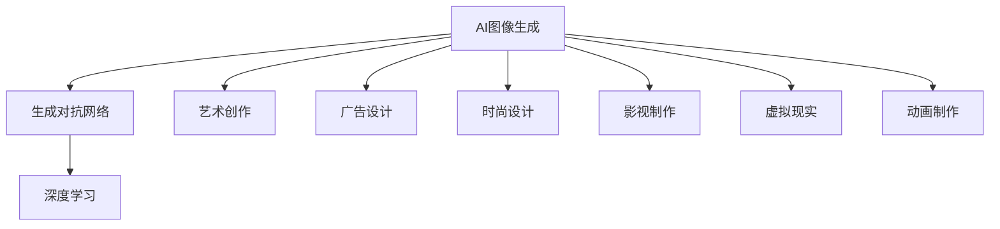

                 

# AI图像生成对创意产业的影响

> 关键词：AI图像生成,创意产业,深度学习,艺术创作,广告设计,时尚时尚设计,影视制作,虚拟现实,动画制作,定制化设计

## 1. 背景介绍

### 1.1 问题由来

在过去的十年中，人工智能(AI)技术迅速发展，尤其是深度学习算法，已经在图像生成、自然语言处理和语音识别等领域取得了突破性的进展。这些技术的发展，不仅推动了AI技术的进步，也为创意产业带来了深刻的影响和变革。

AI图像生成，特别是基于深度学习的生成对抗网络（GANs）技术，已经能够创造出几乎无法与人类手工创作区分的图像。这一技术在广告设计、时尚设计、影视制作、虚拟现实和动画制作等领域的应用，正在改变创意产业的生态系统。

### 1.2 问题核心关键点

AI图像生成对创意产业的影响主要体现在以下几个方面：

- **艺术创作**：AI可以生成高度逼真的艺术品，拓展了艺术创作的边界，同时也引发了对艺术本质的思考。
- **广告设计**：通过自动生成图像，广告设计能够更加快速、高效地完成创意设计，同时也带来了设计同质化的问题。
- **时尚设计**：AI可以生成服饰设计和配饰设计，推动了时尚产业的创新。
- **影视制作**：AI能够生成高质量的背景和特效，为电影和电视制作提供了新的工具。
- **虚拟现实**：AI生成的图像和场景，为虚拟现实提供了更多元、逼真的内容。
- **动画制作**：AI可以自动生成动画角色和背景，减少了人工工作量。

这些影响不仅改变了创意产业的生产方式，还引发了对版权、伦理和就业等社会问题的思考。

### 1.3 问题研究意义

研究AI图像生成对创意产业的影响，对于了解AI技术如何改变传统行业、推动创新以及应对相关挑战具有重要意义。同时，这一研究还可以为创意产业从业者提供新的工具和方法，帮助他们在竞争激烈的市场中获得优势。

## 2. 核心概念与联系

### 2.1 核心概念概述

为更好地理解AI图像生成对创意产业的影响，本节将介绍几个密切相关的核心概念：

- **AI图像生成**：通过深度学习算法，自动生成具有一定质量要求的图像，包括但不限于人脸、风景、动物、艺术作品等。
- **生成对抗网络(GANs)**：一种基于博弈论的深度学习模型，由生成器和判别器组成，通过不断博弈，生成高质量的图像。
- **深度学习**：一种通过多层神经网络进行复杂模式识别的算法，广泛应用于图像识别、自然语言处理和语音识别等领域。
- **艺术创作**：利用各种媒介和技术手段进行的创造性表达，包括绘画、雕塑、音乐、舞蹈等。
- **广告设计**：为商业目的，通过视觉、听觉等媒介进行创意设计的过程，旨在吸引消费者注意力。
- **时尚设计**：利用设计技巧和材料，创造出新颖的服饰和配饰，以适应时尚趋势和市场需求。
- **影视制作**：通过摄影、录音、剪辑等技术手段，制作电影、电视、纪录片等视听作品的过程。
- **虚拟现实**：通过计算机技术，模拟和再现现实世界的场景和体验，为用户提供沉浸式体验。
- **动画制作**：通过绘制、建模、动画等技术手段，创作动画作品的过程。

这些核心概念之间的逻辑关系可以通过以下Mermaid流程图来展示：



这个流程图展示了大语言模型的核心概念及其之间的关系：

1. AI图像生成依赖深度学习技术，特别是生成对抗网络。
2. 深度学习通过多层神经网络进行复杂模式识别。
3. AI图像生成可以应用于艺术创作、广告设计、时尚设计、影视制作、虚拟现实和动画制作等多个领域。

## 3. 核心算法原理 & 具体操作步骤
### 3.1 算法原理概述

AI图像生成的核心算法是生成对抗网络（GANs）。GANs由生成器（Generator）和判别器（Discriminator）两部分组成，通过不断博弈，生成高质量的图像。

生成器的作用是生成逼真的图像，而判别器的作用是判断图像的真实性。训练过程中，生成器和判别器不断对抗，生成器试图生成更逼真的图像以欺骗判别器，而判别器则试图区分真实图像和生成图像。这种对抗博弈使得生成器最终生成高质量的图像，逼真度甚至超越真实图像。

### 3.2 算法步骤详解

AI图像生成的算法步骤主要包括以下几个关键步骤：

**Step 1: 准备数据集**
- 收集并预处理用于训练的数据集。数据集可以是高清照片、艺术作品、自然风景等。
- 将数据集分为训练集、验证集和测试集。

**Step 2: 初始化生成器和判别器**
- 使用卷积神经网络（CNN）等深度学习模型作为生成器和判别器的基础结构。
- 随机初始化生成器和判别器的权重。

**Step 3: 训练生成器和判别器**
- 交替训练生成器和判别器。在每一步中，生成器先产生一批图像，判别器判断这些图像的真实性。
- 生成器根据判别器的反馈，优化生成图像的质量。
- 判别器根据生成图像的质量，优化判别能力。

**Step 4: 生成新图像**
- 训练完成后，使用生成器生成高质量的新图像。
- 可以根据不同的应用场景，调整生成器的参数，生成不同风格或质量的图像。

**Step 5: 应用和评估**
- 将生成的图像应用于创意产业的不同领域，如艺术创作、广告设计、时尚设计等。
- 评估生成图像的质量和应用效果，调整生成器的参数以优化输出。

### 3.3 算法优缺点

AI图像生成技术具有以下优点：

- **效率高**：生成大量高质量图像，省去了手工创作的时间和成本。
- **创意丰富**：生成多样化的图像，拓展了创作的可能性。
- **应用广泛**：适用于广告设计、时尚设计、影视制作等多个领域。

同时，该技术也存在一些缺点：

- **缺乏人类情感**：生成的图像可能缺乏人类情感和独特性。
- **版权问题**：生成的图像可能涉及版权纠纷。
- **技术门槛高**：需要具备一定的深度学习知识和硬件资源。

### 3.4 算法应用领域

AI图像生成技术已经广泛应用于以下几个领域：

- **广告设计**：生成广告海报、视频广告等创意内容，提高广告设计的效率和质量。
- **时尚设计**：生成服饰设计、配饰设计等，推动时尚产业的创新。
- **影视制作**：生成影视场景、背景和特效，提升电影和电视的视觉体验。
- **虚拟现实**：生成虚拟场景和角色，提供沉浸式体验。
- **动画制作**：生成动画角色和背景，提高动画制作的效率。
- **艺术创作**：生成艺术作品和艺术装置，拓展艺术创作的边界。

## 4. 数学模型和公式 & 详细讲解 & 举例说明
### 4.1 数学模型构建

GANs的数学模型主要包括以下几个关键组件：

- **生成器**：将随机噪声 $z$ 映射为图像 $G(z)$。
- **判别器**：判断图像 $x$ 是否为真实图像 $y$，输出概率 $D(x)$。
- **目标函数**：生成器损失 $L_G$ 和判别器损失 $L_D$。

### 4.2 公式推导过程

GANs的目标函数可以表示为：

$$
L_G = \mathbb{E}_{z \sim p(z)}[\log D(G(z))]
$$

$$
L_D = \mathbb{E}_{x \sim p(x)}[\log D(x)] + \mathbb{E}_{z \sim p(z)}[\log(1 - D(G(z)))]
$$

其中，$z$ 为随机噪声，$x$ 为真实图像。

**生成器损失**：

$$
L_G = \frac{1}{N} \sum_{i=1}^N \log D(G(z_i))
$$

**判别器损失**：

$$
L_D = \frac{1}{N} \sum_{i=1}^N \log D(x_i) + \frac{1}{N} \sum_{i=1}^N \log(1 - D(G(z_i)))
$$

通过最大化生成器损失 $L_G$ 和判别器损失 $L_D$，生成器能够生成逼真的图像，判别器能够准确判断图像的真实性。

### 4.3 案例分析与讲解

以生成逼真的艺术作品为例，我们可以使用GANs生成多样化的艺术风格，如抽象画、写实画等。具体步骤如下：

1. **数据准备**：收集不同的艺术风格图像，如抽象画、写实画等，作为训练数据集。
2. **模型构建**：使用CNN等深度学习模型作为生成器和判别器的基础结构。
3. **模型训练**：交替训练生成器和判别器，优化生成器和判别器的参数。
4. **生成新图像**：使用训练好的生成器，生成新的艺术作品。
5. **评估和应用**：评估生成的艺术作品的质量，应用于艺术创作、展览展示等场景。

## 5. 项目实践：代码实例和详细解释说明
### 5.1 开发环境搭建

在进行AI图像生成实践前，我们需要准备好开发环境。以下是使用Python进行TensorFlow开发的环境配置流程：

1. 安装Anaconda：从官网下载并安装Anaconda，用于创建独立的Python环境。

2. 创建并激活虚拟环境：
```bash
conda create -n tf-env python=3.8 
conda activate tf-env
```

3. 安装TensorFlow：根据CUDA版本，从官网获取对应的安装命令。例如：
```bash
conda install tensorflow tensorflow-gpu -c conda-forge
```

4. 安装图像生成库：
```bash
pip install imageio numpy scipy matplotlib
```

完成上述步骤后，即可在`tf-env`环境中开始图像生成实践。

### 5.2 源代码详细实现

以下是使用TensorFlow实现GANs的代码实现：

```python
import tensorflow as tf
from tensorflow.keras.layers import Input, Dense, Reshape, Flatten
from tensorflow.keras.models import Model
from tensorflow.keras.optimizers import Adam

# 定义生成器和判别器的模型
def make_generator_model():
    model = tf.keras.Sequential()
    model.add(Dense(256, input_dim=100))
    model.add(LeakyReLU(alpha=0.2))
    model.add(Dense(512))
    model.add(LeakyReLU(alpha=0.2))
    model.add(Dense(1024))
    model.add(LeakyReLU(alpha=0.2))
    model.add(Dense(784, activation='tanh'))
    return model

def make_discriminator_model():
    model = tf.keras.Sequential()
    model.add(Flatten(input_shape=(28, 28)))
    model.add(Dense(256))
    model.add(LeakyReLU(alpha=0.2))
    model.add(Dense(128))
    model.add(LeakyReLU(alpha=0.2))
    model.add(Dense(1, activation='sigmoid'))
    return model

# 生成器和判别器的模型定义
generator = make_generator_model()
discriminator = make_discriminator_model()

# 定义生成器和判别器之间的对抗损失
def generator_loss(discriminator, gen_samples):
    validity = discriminator(gen_samples)
    return tf.reduce_mean(tf.nn.sigmoid_cross_entropy_with_logits(labels=tf.ones_like(validity), logits=validity))

def discriminator_loss(discriminator, real_samples, fake_samples):
    real_validity = discriminator(real_samples)
    fake_validity = discriminator(fake_samples)
    real_loss = tf.reduce_mean(tf.nn.sigmoid_cross_entropy_with_logits(labels=tf.ones_like(real_validity), logits=real_validity))
    fake_loss = tf.reduce_mean(tf.nn.sigmoid_cross_entropy_with_logits(labels=tf.zeros_like(fake_validity), logits=fake_validity))
    return real_loss + fake_loss

# 定义生成器和判别器的联合损失函数
def combined_loss(discriminator, generator, real_samples, fake_samples):
    gen_loss = generator_loss(discriminator, generator(fake_samples))
    disc_loss = discriminator_loss(discriminator, real_samples, generator(fake_samples))
    return gen_loss + disc_loss

# 定义优化器和损失函数
generator_optimizer = Adam(1e-4)
discriminator_optimizer = Adam(1e-4)
combined_optimizer = Adam(1e-4)

# 定义训练步骤
@tf.function
def train_step(images):
    noise = tf.random.normal([BATCH_SIZE, 100])
    with tf.GradientTape() as gen_tape, tf.GradientTape() as disc_tape:
        generated_images = generator(noise, training=True)
        real_output = discriminator(images, training=True)
        fake_output = discriminator(generated_images, training=True)
        gen_loss = generator_loss(discriminator, generated_images)
        disc_loss = discriminator_loss(discriminator, images, generated_images)
    gradients_of_generator = gen_tape.gradient(gen_loss, generator.trainable_variables)
    gradients_of_discriminator = disc_tape.gradient(disc_loss, discriminator.trainable_variables)
    generator_optimizer.apply_gradients(zip(gradients_of_generator, generator.trainable_variables))
    discriminator_optimizer.apply_gradients(zip(gradients_of_discriminator, discriminator.trainable_variables))
```

### 5.3 代码解读与分析

让我们再详细解读一下关键代码的实现细节：

**make_generator_model和make_discriminator_model函数**：
- `make_generator_model`函数定义了生成器的模型结构，使用全连接层和激活函数构成神经网络。
- `make_discriminator_model`函数定义了判别器的模型结构，同样使用全连接层和激活函数构成神经网络。

**generator_loss和discriminator_loss函数**：
- `generator_loss`函数计算生成器生成的图像通过判别器输出的损失，使用了 sigmoid 交叉熵损失函数。
- `discriminator_loss`函数计算判别器对真实图像和生成图像的判断损失，同样使用了 sigmoid 交叉熵损失函数。

**combined_loss函数**：
- `combined_loss`函数定义了生成器和判别器的联合损失函数，用于训练整个模型。

**训练步骤**：
- `train_step`函数定义了训练步骤，包括生成器输入随机噪声，判别器对真实图像和生成图像的判断，计算损失函数，以及使用优化器更新生成器和判别器的参数。

以上代码实现了一个基本的GANs模型，可以用于生成逼真的图像。在实际应用中，还需要根据具体任务调整模型结构、损失函数和优化器等参数。

## 6. 实际应用场景
### 6.1 广告设计

在广告设计中，使用AI图像生成技术可以大幅提升广告创意的效率和多样性。传统的手工设计需要设计师花费大量时间，而AI生成广告图像可以在几分钟内完成。例如，可以使用GANs生成高质量的广告海报、视频广告等，帮助广告主快速推出新的广告活动。

### 6.2 时尚设计

时尚设计需要设计师不断创新，以应对市场趋势的变化。AI图像生成技术可以生成多样化的时尚设计，帮助设计师快速获取灵感。例如，可以使用GANs生成时尚服饰设计和配饰设计，快速设计新的服装款式和配饰。

### 6.3 影视制作

在影视制作中，AI图像生成技术可以用于生成影视场景和特效。例如，可以使用GANs生成逼真的背景和角色，提高影视制作的质量和效率。例如，可以使用GANs生成电影场景和特效，减少人工绘制的工作量。

### 6.4 虚拟现实

在虚拟现实中，AI图像生成技术可以用于生成逼真的虚拟场景和角色，提供沉浸式体验。例如，可以使用GANs生成虚拟城市和虚拟角色，提供更逼真的虚拟现实体验。

### 6.5 动画制作

在动画制作中，AI图像生成技术可以用于生成动画角色和背景。例如，可以使用GANs生成动画角色的面部表情和身体动作，提高动画制作的效率。例如，可以使用GANs生成动画场景和背景，提高动画制作的效率。

### 6.6 艺术创作

在艺术创作中，AI图像生成技术可以生成多样化的艺术作品，拓展艺术创作的边界。例如，可以使用GANs生成抽象画和写实画，帮助艺术家快速获取灵感。例如，可以使用GANs生成艺术装置和展览展示，提供更丰富多样的艺术展示方式。

## 7. 工具和资源推荐
### 7.1 学习资源推荐

为了帮助开发者系统掌握AI图像生成理论基础和实践技巧，这里推荐一些优质的学习资源：

1. 《Deep Learning with Python》书籍：介绍深度学习的基本原理和TensorFlow的使用方法，适合初学者入门。
2. 《Hands-On Machine Learning with Scikit-Learn and TensorFlow》书籍：介绍使用Scikit-Learn和TensorFlow进行机器学习项目开发的方法。
3. 《Generative Adversarial Networks with TensorFlow》博客：介绍使用TensorFlow实现GANs的方法和技巧。
4. 《TensorFlow官方文档》：提供TensorFlow的详细使用方法和示例代码。
5. 《GAN Zoo》网站：提供各种GANs模型和实现的集合，帮助用户选择和应用不同的模型。

通过对这些资源的学习实践，相信你一定能够快速掌握AI图像生成技术的精髓，并用于解决实际的创意产业问题。

### 7.2 开发工具推荐

高效的开发离不开优秀的工具支持。以下是几款用于AI图像生成开发的常用工具：

1. TensorFlow：基于Python的开源深度学习框架，适合构建和训练深度学习模型。
2. Keras：提供高层API，方便快速构建深度学习模型，适合初学者和研究人员。
3. PyTorch：基于Python的开源深度学习框架，适合动态计算图和模型调试。
4. OpenAI Gym：提供各种环境模拟器，用于训练和测试强化学习算法。
5. Matplotlib：提供丰富的图表绘制功能，用于可视化模型训练结果。

合理利用这些工具，可以显著提升AI图像生成任务的开发效率，加快创新迭代的步伐。

### 7.3 相关论文推荐

AI图像生成技术的发展源于学界的持续研究。以下是几篇奠基性的相关论文，推荐阅读：

1. Generative Adversarial Nets（GANs论文）：提出GANs的概念和算法，奠定了GANs在图像生成领域的基础。
2. Progressive Growing of GANs for Improved Quality, Stability, and Variation（PG-GANs论文）：提出PG-GANs算法，提高了GANs的生成质量、稳定性和多样性。
3. Wasserstein GAN：提出使用Wasserstein距离度量GANs生成图像的质量，提高了GANs的生成效果。
4. CycleGAN：提出使用生成对抗网络进行图像转换和生成，拓展了GANs的应用场景。
5. DCGAN：提出使用卷积神经网络生成高质量的图像，推动了GANs在图像生成领域的发展。

这些论文代表了大语言模型微调技术的发展脉络。通过学习这些前沿成果，可以帮助研究者把握学科前进方向，激发更多的创新灵感。

## 8. 总结：未来发展趋势与挑战
### 8.1 总结

本文对AI图像生成对创意产业的影响进行了全面系统的介绍。首先阐述了AI图像生成技术的研究背景和意义，明确了AI技术如何改变传统行业、推动创新以及应对相关挑战。其次，从原理到实践，详细讲解了AI图像生成的数学原理和关键步骤，给出了图像生成任务开发的完整代码实例。同时，本文还广泛探讨了AI图像生成技术在广告设计、时尚设计、影视制作、虚拟现实和动画制作等多个领域的应用前景，展示了AI图像生成技术的巨大潜力。最后，本文精选了AI图像生成技术的各类学习资源，力求为读者提供全方位的技术指引。

通过本文的系统梳理，可以看到，AI图像生成技术正在成为创意产业的重要工具，极大地拓展了创意产业的生产方式，提升了创意设计的效率和质量。未来，伴随AI技术的不断演进，AI图像生成技术还将迎来更多的创新和发展，进一步推动创意产业的变革和进步。

### 8.2 未来发展趋势

展望未来，AI图像生成技术将呈现以下几个发展趋势：

1. **生成质量提升**：随着生成模型的不断发展，生成的图像质量将进一步提升，生成效果将更加逼真。
2. **多模态融合**：将视觉、听觉、文本等多种模态信息结合，生成更加丰富多样的图像和场景。
3. **自动化设计**：使用AI技术自动设计图像和场景，提升设计效率和创新性。
4. **个性化定制**：根据用户偏好和需求，生成个性化的图像和场景，满足用户的个性化需求。
5. **跨领域应用**：将AI图像生成技术应用于更多领域，如医疗、教育、科学等，拓展AI技术的应用范围。

以上趋势凸显了AI图像生成技术的广阔前景。这些方向的探索发展，必将进一步提升创意产业的生产效率和创新能力，为创意产业带来更多的机遇和挑战。

### 8.3 面临的挑战

尽管AI图像生成技术已经取得了瞩目成就，但在迈向更加智能化、普适化应用的过程中，它仍面临着诸多挑战：

1. **数据依赖**：生成高质量图像需要大量的高质量数据，数据的获取和标注成本较高。
2. **模型复杂性**：生成模型往往结构复杂，训练和优化过程较为耗时。
3. **版权问题**：生成的图像可能涉及版权纠纷，需要关注版权问题。
4. **伦理和隐私**：生成的图像可能包含敏感信息，需要关注伦理和隐私问题。
5. **技术门槛**：需要具备一定的深度学习知识和硬件资源，技术门槛较高。

### 8.4 研究展望

面对AI图像生成面临的挑战，未来的研究需要在以下几个方面寻求新的突破：

1. **数据增强**：探索更多的数据增强方法，提升数据集的多样性和数量，减少数据依赖。
2. **模型优化**：优化生成模型的结构，减少训练和优化过程的耗时。
3. **版权保护**：研究版权保护技术，避免生成的图像涉及版权纠纷。
4. **伦理和隐私保护**：研究伦理和隐私保护技术，确保生成的图像不包含敏感信息。
5. **技术普及**：降低技术门槛，提高AI图像生成技术的普及率。

这些研究方向的探索，必将引领AI图像生成技术迈向更高的台阶，为创意产业带来更多的机遇和挑战。相信随着学界和产业界的共同努力，这些挑战终将一一被克服，AI图像生成技术必将在创意产业中发挥更大的作用。

## 9. 附录：常见问题与解答
**Q1：AI图像生成技术是否会取代人类设计师？**

A: AI图像生成技术可以大幅提升设计效率和质量，但无法完全取代人类设计师。人类设计师具备创造力和审美判断，可以带来独特的创意和情感表达，这是AI难以替代的。AI技术更多地作为设计师的工具，辅助设计师完成创意工作。

**Q2：AI图像生成技术的应用范围有哪些？**

A: AI图像生成技术可以应用于广告设计、时尚设计、影视制作、虚拟现实、动画制作、艺术创作等多个领域，帮助创意产业提升效率和创新性。随着技术的不断进步，其应用范围还将进一步拓展。

**Q3：AI图像生成技术是否存在版权问题？**

A: 生成的图像可能涉及版权问题，需要关注生成数据和模型的版权归属。为避免版权纠纷，应使用开源数据集和模型，或在使用商业数据集和模型时获取相应的授权。

**Q4：AI图像生成技术的伦理和隐私问题有哪些？**

A: 生成的图像可能包含敏感信息，需要关注伦理和隐私问题。例如，生成的图像可能包含不适当的色情内容或暴力内容，需要确保生成的图像不包含此类内容。

**Q5：AI图像生成技术的未来发展方向有哪些？**

A: AI图像生成技术的未来发展方向包括提高生成图像的质量和多样性、多模态融合、自动化设计、个性化定制、跨领域应用等。随着技术的不断演进，AI图像生成技术将在创意产业中发挥更大的作用。

---

作者：禅与计算机程序设计艺术 / Zen and the Art of Computer Programming

