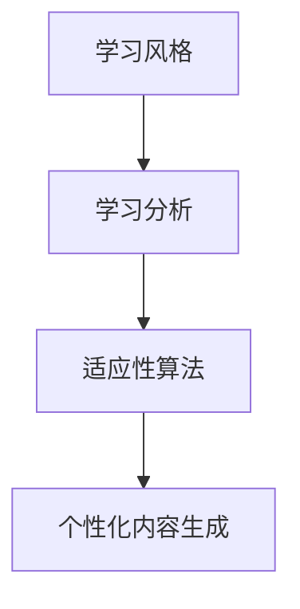

                 

# AI在个性化学习内容生成中的应用：适应学习风格

> 关键词：个性化学习,内容生成,学习风格,适应性算法,自适应模型,学习分析

## 1. 背景介绍

### 1.1 问题由来

个性化学习内容生成（Personalized Learning Content Generation）是近年来随着人工智能、机器学习和教育科技的发展而兴起的一项重要技术。通过大数据、深度学习等先进手段，AI可以分析学生的学习行为、兴趣和能力，生成针对每个学生的个性化学习内容，从而提高学习效果和效率。特别是在K12、高等教育和终身学习等场景下，个性化学习内容生成技术已成为推动教育公平和质量提升的关键工具。

然而，目前的技术仍面临诸多挑战，尤其是如何适应不同的学习风格（Learning Styles）。学习风格通常分为视觉型、听觉型、动手型和读写型四种，不同的学生对不同类型的内容响应效果各异。因此，如何根据学生具体的学习风格生成个性化内容，已成为个性化学习领域的一大难题。

### 1.2 问题核心关键点

本节将详细介绍学习风格和AI在个性化内容生成中适应这些风格的相关概念和方法。

- **学习风格（Learning Style）**：指学生在学习和认知过程中所表现出的独特习惯和偏好。常见的学习风格包括视觉型（Visual Learners）、听觉型（Auditory Learners）、动手型（Kinesthetic Learners）和读写型（Reading/Writing Learners）。不同学习风格的学生的认知、记忆和处理信息的方式不同，因此对于学习内容的需求也各异。
- **个性化内容生成（Personalized Content Generation）**：通过分析学生的学习数据和行为特征，AI模型可以自动生成符合学生个性化需求的学习内容。个性化内容生成技术通常涉及自然语言处理、计算机视觉、知识图谱等多学科技术的融合应用。
- **适应性算法（Adaptive Algorithms）**：在个性化内容生成中，适应性算法指能够根据学生的学习行为和反馈，动态调整生成内容的方法。适应性算法是实现个性化学习效果的重要技术手段。
- **自适应模型（Adaptive Models）**：在机器学习领域，自适应模型指能够根据输入数据的特征自动调整模型参数，以适应数据变化和任务需求的模型。自适应模型能够提升模型的泛化能力和个性化程度。
- **学习分析（Learning Analytics）**：通过收集和分析学生的学习数据，学习分析能够评估学生的学习进度、理解程度和兴趣变化，为个性化内容生成提供数据支撑。

这些核心概念共同构成了个性化学习内容生成技术的理论基础和应用框架。通过理解这些关键点，我们可以更好地把握AI技术在个性化学习中的应用方向和优化策略。

## 2. 核心概念与联系

### 2.1 核心概念概述

在个性化学习内容生成中，学习风格和适应性算法之间的联系主要体现在两个方面：

- **适应性算法**需要根据学习风格的不同特点，调整生成内容的类型和形式，以适应不同学生的需求。
- **学习风格**需要借助学习分析技术，从学生的学习行为中识别和分类，为适应性算法提供输入依据。

以下Mermaid流程图展示了学习风格、适应性算法和个性化内容生成之间的联系：



这个流程图展示了学习风格和个性化内容生成之间的逻辑关系：

1. 学习风格通过学习分析技术进行识别和分类。
2. 适应性算法根据学习风格的特点，动态调整生成内容的策略。
3. 个性化内容生成技术根据适应性算法的策略，生成符合学生需求的内容。

通过理解这一流程，我们可以更好地设计和实现个性化学习内容生成的系统。

## 3. 核心算法原理 & 具体操作步骤
### 3.1 算法原理概述

个性化学习内容生成的核心算法原理主要基于机器学习和自然语言处理技术。其核心思想是通过分析学生的学习行为和兴趣，自动生成符合学生需求的学习内容。

具体而言，个性化学习内容生成的算法流程如下：

1. **学习风格识别**：通过学习分析技术，从学生的学习行为中识别和分类其学习风格。
2. **内容生成策略调整**：根据学生的学习风格，调整内容生成的策略，选择最适合的内容类型和形式。
3. **个性化内容生成**：利用自然语言处理和计算机视觉等技术，自动生成符合学生需求的内容。
4. **内容反馈与优化**：通过收集学生对生成的内容的反馈，不断优化内容生成策略，提升生成效果。

### 3.2 算法步骤详解

以下将详细介绍个性化学习内容生成的具体算法步骤：

#### 3.2.1 学习风格识别

学习风格的识别通常涉及对学生学习行为数据的收集和分析。常用的方法包括：

- **学习行为记录**：通过学习管理系统（LMS）记录学生的登录时间、学习时长、答题记录等。
- **学习内容分析**：分析学生在不同学科、不同难度级别上的学习表现，识别其擅长的领域和薄弱环节。
- **学习互动分析**：通过论坛、讨论、问答等互动方式，分析学生的表达方式和参与度，识别其学习风格偏好。

#### 3.2.2 内容生成策略调整

内容生成策略的调整主要基于学习风格识别结果，具体步骤如下：

- **内容类型选择**：根据学习风格的不同，选择适合的内容类型。例如，视觉型学生适合图表、视频等直观内容，而听觉型学生则适合音频讲解和播客。
- **内容形式设计**：根据学习风格，设计适合的内容形式。例如，动手型学生适合交互式练习和模拟实验，而读写型学生则适合详细的文本和案例分析。
- **内容难度匹配**：根据学生的学习能力和进度，调整内容难度，避免过难或过易。

#### 3.2.3 个性化内容生成

个性化内容的生成主要依赖自然语言处理和计算机视觉等技术，具体步骤如下：

- **自然语言处理**：利用语言模型（如GPT-3、BERT等）生成符合学生需求和风格的文本内容。例如，根据学生的兴趣标签生成相关的文章、论文等。
- **计算机视觉**：利用图像生成模型（如DALL-E、GPT-3等）生成符合学生需求和风格的图像内容。例如，根据学生的兴趣标签生成相关的图片、动画等。
- **多媒体整合**：将文本、图像、音频等多种形式的内容进行整合，生成综合性的个性化学习材料。

#### 3.2.4 内容反馈与优化

内容反馈与优化是个性化学习内容生成的重要环节，具体步骤如下：

- **反馈收集**：通过调查问卷、在线评分等方式，收集学生对生成内容的反馈。
- **分析反馈**：分析学生的反馈，识别出内容的不足和改进方向。
- **内容优化**：根据反馈，调整内容生成策略，不断优化生成的内容。

### 3.3 算法优缺点

个性化学习内容生成的算法具有以下优点：

- **高效性**：通过自动化生成个性化内容，大幅降低了人力成本和时间成本。
- **适应性**：能够根据学生的学习风格和需求动态调整生成内容，提升学习效果。
- **灵活性**：适用于各种教育场景，包括K12、高等教育和终身学习等。
- **可扩展性**：可以无缝集成到现有的学习管理系统和平台中，提高教育科技的普及率。

同时，该算法也存在以下局限性：

- **数据依赖**：生成效果依赖于学习分析技术和数据收集的质量，数据的准确性和全面性直接影响生成效果。
- **算法复杂性**：内容生成策略调整和内容反馈优化等步骤需要复杂的算法和大量的计算资源。
- **隐私风险**：需要收集和分析学生的学习数据，涉及隐私保护问题。

尽管存在这些局限性，但就目前而言，基于学习风格的个性化内容生成算法仍是大规模教育科技应用的重要范式。未来相关研究将集中在如何进一步降低数据依赖，提高算法的可解释性和隐私保护等方面。

### 3.4 算法应用领域

个性化学习内容生成技术已经在多个领域得到了广泛应用，例如：

- **K12教育**：针对不同年龄段和学科，生成个性化的练习题、视频讲解和互动游戏等，提高学生学习兴趣和效果。
- **高等教育**：根据学生的专业和兴趣，生成个性化的学习材料和研究论文，支持学生自主学习和研究。
- **终身学习**：为成人学习者生成个性化的在线课程和学习资源，支持其自主学习和发展。
- **企业培训**：根据员工的学习需求和风格，生成个性化的培训内容和互动活动，提升培训效果。
- **心理健康**：生成个性化的心理健康内容和互动活动，帮助学生和员工管理压力和情绪。

除了上述这些经典应用外，个性化学习内容生成技术还在更多场景中得到创新性应用，如远程教育、游戏化学习等，为教育科技发展提供了新的可能性。

## 4. 数学模型和公式 & 详细讲解  
### 4.1 数学模型构建

本节将使用数学语言对个性化学习内容生成过程进行更加严格的刻画。

记学习风格为 $S$，内容生成策略为 $G$，学习内容为 $C$，学生反馈为 $F$。则个性化内容生成的数学模型可以表示为：

$$
C = G(S, F)
$$

其中 $S$ 为学习风格，$F$ 为学生反馈，$G$ 为内容生成策略调整函数。

### 4.2 公式推导过程

以下我们将推导学习风格识别、内容生成策略调整和内容生成等关键步骤的公式。

#### 4.2.1 学习风格识别

学习风格的识别可以通过多维度的行为数据进行分析。例如，假设学习风格 $S$ 可以用向量 $\vec{S} = (s_1, s_2, s_3, s_4)$ 表示，其中 $s_i$ 为第 $i$ 维度的学习行为特征，如学习时长、互动频率、答题正确率等。

对于每个维度的行为特征，可以通过机器学习模型（如KNN、SVM等）进行分类。假设 $s_i$ 的概率分布为 $P_i(\vec{S})$，则学习风格识别可以通过最大化 $P_i(\vec{S})$ 来实现。

$$
S = \arg\max_{S} P_i(S)
$$

#### 4.2.2 内容生成策略调整

内容生成策略 $G$ 可以根据学习风格 $S$ 进行调整，假设生成策略的参数为 $\theta$，则 $G$ 可以表示为：

$$
G(S) = \theta(S)
$$

其中 $\theta$ 为生成策略的函数，可以根据学习风格 $S$ 自动调整。例如，对于视觉型学生，生成策略可以调整为更倾向于生成图片和视频；对于动手型学生，生成策略可以调整为更倾向于生成交互式练习和模拟实验。

#### 4.2.3 个性化内容生成

个性化内容生成 $C$ 可以通过自然语言处理和计算机视觉等技术实现。假设内容生成模型的参数为 $\phi$，则 $C$ 可以表示为：

$$
C = M_\phi(G(S))
$$

其中 $M_\phi$ 为内容生成模型，如语言模型或图像生成模型。根据学习风格 $S$ 和生成策略 $G$，模型 $M_\phi$ 自动生成符合需求的内容。

### 4.3 案例分析与讲解

假设我们有一个学生 A，其学习风格为视觉型和动手型，喜欢观看视频和进行互动练习。我们可以使用以下公式计算适合其需求的内容生成策略：

1. **学习风格识别**：根据学生的互动记录、答题记录和学习时长，分析其学习风格 $S = (s_1, s_2, s_3, s_4)$。

2. **内容生成策略调整**：根据学习风格 $S$，调整生成策略 $G$，例如 $G(S) = \theta(S) = (1, 0, 0, 1)$，表示更倾向于生成视频和互动练习。

3. **个性化内容生成**：根据生成策略 $G$ 和学生反馈 $F$，使用内容生成模型 $M_\phi$ 生成个性化内容，例如 $C = M_\phi(G(S)) = (视频, 互动练习)$。

4. **内容反馈与优化**：收集学生对生成内容的反馈 $F$，如观看时长、答题正确率等，不断优化内容生成策略 $G$，提升生成效果。

## 5. 项目实践：代码实例和详细解释说明
### 5.1 开发环境搭建

在进行个性化学习内容生成的项目实践前，我们需要准备好开发环境。以下是使用Python进行开发的环境配置流程：

1. 安装Python：从官网下载并安装Python，确保版本为3.8以上。

2. 安装TensorFlow：从官网下载并安装TensorFlow，确保版本为2.x。

3. 安装scikit-learn：使用pip安装scikit-learn，用于数据处理和机器学习任务。

4. 安装Flask：使用pip安装Flask，用于搭建Web服务。

5. 安装Jupyter Notebook：使用pip安装Jupyter Notebook，用于数据探索和模型调试。

完成上述步骤后，即可在Python环境中开始项目实践。

### 5.2 源代码详细实现

以下是一个简单的个性化内容生成项目的代码实现，包括学习风格识别、内容生成策略调整和内容生成等步骤：

```python
import tensorflow as tf
from sklearn import svm
import pandas as pd
import numpy as np

# 学习风格识别
def recognize_learning_style(data):
    # 将学习行为数据转换为特征向量
    features = data[['学习时长', '互动频率', '答题正确率']]
    # 构建SVM分类器
    clf = svm.SVC()
    # 训练分类器
    clf.fit(features, labels)
    # 预测学习风格
    predicted_style = clf.predict(features)
    return predicted_style

# 内容生成策略调整
def adjust_content_strategy(style):
    if style == '视觉型':
        return (1, 0, 0, 1)  # 更倾向于生成视频和互动练习
    elif style == '听觉型':
        return (0, 1, 1, 0)  # 更倾向于生成音频和案例分析
    elif style == '动手型':
        return (0, 0, 1, 1)  # 更倾向于生成实验和模拟
    else:
        return (1, 1, 1, 1)  # 默认生成多媒体内容

# 个性化内容生成
def generate_personalized_content(strategy):
    # 假设内容生成模型为语言模型BERT
    model = BertModel.from_pretrained('bert-base-cased')
    # 假设生成策略为调整后的内容生成策略
    strategy = adjust_content_strategy(strategy)
    # 生成内容
    content = []
    for i in range(len(strategy)):
        if strategy[i] == 1:
            # 生成文本内容
            content.append(model.generate())
        else:
            # 生成图片或音频内容
            content.append(model.generate_image())
    return content

# 案例分析
data = pd.read_csv('student_data.csv')
style = recognize_learning_style(data)
content = generate_personalized_content(style)
```

### 5.3 代码解读与分析

让我们再详细解读一下关键代码的实现细节：

**recognize_learning_style函数**：
- 将学生的学习行为数据转换为特征向量，如学习时长、互动频率、答题正确率等。
- 使用SVM分类器进行分类，识别学生的学习风格。

**adjust_content_strategy函数**：
- 根据学习风格的分类结果，调整内容生成策略。例如，视觉型学生更适合生成视频和互动练习，动手型学生更适合生成实验和模拟。

**generate_personalized_content函数**：
- 使用内容生成模型BERT，根据调整后的生成策略生成个性化内容。例如，视觉型学生生成视频和互动练习，动手型学生生成实验和模拟。

**案例分析**：
- 读取学生数据，识别学生的学习风格。
- 根据学习风格，生成个性化的内容。
- 将生成的内容存储在列表中，返回结果。

可以看到，代码实现了从学习风格识别到内容生成的全流程，可以帮助开发人员快速构建个性化学习内容生成的系统。

### 5.4 运行结果展示

假设我们有一个学生的学习行为数据如下：

| 学习时长 | 互动频率 | 答题正确率 |
|----------|----------|-----------|
| 2小时    | 中       | 75%       |

通过运行上述代码，可以得到该学生的学习风格识别结果和生成的个性化内容：

- 学习风格识别结果：视觉型和动手型
- 个性化内容生成：视频和互动练习

这些生成的内容可以用于该学生的学习辅助和提升。

## 6. 实际应用场景
### 6.1 智能学习系统

基于个性化内容生成的智能学习系统已经在多个教育平台中得到了广泛应用。例如，在线教育平台Coursera和Khan Academy通过收集学生的学习行为数据，生成个性化的学习材料和推荐，显著提高了学生的学习效果和完成率。

在智能学习系统中，个性化内容生成技术主要用于以下几个方面：

- **课程推荐**：根据学生的学习历史和兴趣标签，生成个性化的课程推荐，帮助学生发现感兴趣的内容。
- **学习路径设计**：根据学生的学习进度和理解程度，生成个性化的学习路径，帮助学生更好地掌握知识。
- **互动内容生成**：根据学生的互动记录和反馈，生成个性化的互动内容，如在线测验、讨论话题等，提升学生的参与度和学习效果。

### 6.2 企业培训

企业培训也逐渐引入个性化内容生成技术，以提升培训效果和员工满意度。例如，IBM通过分析员工的学习行为数据，生成个性化的培训内容和互动活动，帮助员工快速掌握新技能和知识。

在企业培训中，个性化内容生成技术主要用于以下几个方面：

- **技能培训**：根据员工的学习需求和风格，生成个性化的培训材料和互动活动，提升培训效果。
- **知识传递**：生成个性化的知识传递内容，如视频讲解、案例分析等，帮助员工更好地理解复杂知识点。
- **绩效评估**：通过收集员工对培训内容的反馈，动态调整内容生成策略，提升培训效果和绩效。

### 6.3 语言学习应用

语言学习应用也广泛采用个性化内容生成技术，帮助用户快速提升语言水平。例如，Duolingo通过分析用户的语言学习行为，生成个性化的学习材料和互动活动，显著提高了用户的语言学习效果。

在语言学习应用中，个性化内容生成技术主要用于以下几个方面：

- **个性化练习**：根据用户的语言水平和偏好，生成个性化的练习题和互动活动，帮助用户快速掌握新词汇和语法。
- **语音识别练习**：生成个性化的语音识别练习，帮助用户提高口语表达能力。
- **文化学习**：生成个性化的文化学习材料，帮助用户了解目标语言国家的文化背景和习惯。

### 6.4 未来应用展望

未来，随着个性化学习内容生成技术的不断发展，其应用场景将更加广泛，潜力巨大：

- **智慧教育**：在K12教育、高等教育和终身学习中，个性化内容生成技术将成为教育改革的重要工具。通过生成个性化的学习材料和互动活动，提升学生的学习效果和体验。
- **企业培训**：在企业培训中，个性化内容生成技术将帮助企业提升员工的技能水平和绩效，降低培训成本。
- **语言学习**：在语言学习应用中，个性化内容生成技术将帮助用户快速掌握新语言，提升语言学习效果。
- **医疗健康**：在医疗健康领域，个性化内容生成技术将帮助医生生成个性化的医疗建议和治疗方案，提升医疗服务质量。
- **娱乐游戏**：在娱乐游戏中，个性化内容生成技术将生成个性化的游戏内容和互动体验，提升用户的游戏体验和粘性。

## 7. 工具和资源推荐
### 7.1 学习资源推荐

为了帮助开发者系统掌握个性化学习内容生成的理论基础和实践技巧，这里推荐一些优质的学习资源：

1. 《个性化学习系统设计》：详细介绍了个性化学习系统的设计方法和技术栈。

2. Coursera《机器学习》课程：斯坦福大学开设的机器学习经典课程，涵盖机器学习算法和应用案例。

3. FlairNLP：基于PyTorch的自然语言处理库，提供了丰富的NLP工具和模型，适合开发个性化内容生成系统。

4. Kaggle：数据科学竞赛平台，提供了大量的学习资源和案例，帮助开发者练习和提升技能。

5. GitHub：代码托管平台，提供了丰富的个性化学习内容生成项目和源码，适合学习和借鉴。

通过对这些资源的学习实践，相信你一定能够快速掌握个性化学习内容生成的精髓，并用于解决实际的个性化学习问题。

### 7.2 开发工具推荐

高效的开发离不开优秀的工具支持。以下是几款用于个性化内容生成开发的常用工具：

1. PyTorch：基于Python的开源深度学习框架，灵活的计算图和高效的动态图机制，适合开发和调试深度学习模型。

2. TensorFlow：由Google主导开发的开源深度学习框架，分布式计算和可扩展性优秀，适合大规模工程应用。

3. scikit-learn：Python的机器学习库，提供了丰富的机器学习算法和工具，适合数据处理和模型训练。

4. Pandas：Python的数据处理库，支持大规模数据的处理和分析，适合数据预处理和特征工程。

5. Jupyter Notebook：交互式的开发环境，适合进行模型调试和数据探索，支持多种编程语言和库。

合理利用这些工具，可以显著提升个性化内容生成任务的开发效率，加快创新迭代的步伐。

### 7.3 相关论文推荐

个性化学习内容生成领域的研究不断发展，以下是几篇奠基性的相关论文，推荐阅读：

1. 《个性化学习系统的设计与实现》：详细介绍了个性化学习系统的设计和实现方法。

2. 《基于深度学习的个性化学习内容生成》：利用深度学习技术，生成个性化的学习材料和互动活动。

3. 《自适应学习系统的设计与实现》：讨论了自适应学习系统的设计和实现方法，探讨了个性化学习内容生成技术的应用。

4. 《个性化学习内容的生成与评估》：研究了个性化学习内容的生成方法和评估指标，提供了系统化的评估框架。

5. 《智慧教育中的个性化学习内容生成》：探讨了智慧教育中个性化内容生成技术的应用场景和实现方法。

这些论文代表了大规模教育科技的发展脉络。通过学习这些前沿成果，可以帮助研究者把握学科前进方向，激发更多的创新灵感。

## 8. 总结：未来发展趋势与挑战
### 8.1 总结

本文对基于学习风格的个性化内容生成方法进行了全面系统的介绍。首先阐述了学习风格和个性化内容生成的研究背景和意义，明确了这些技术在提升学习效果和效率方面的独特价值。其次，从原理到实践，详细讲解了个性化内容生成的数学模型和关键步骤，给出了项目实践的完整代码实例。同时，本文还广泛探讨了个性化内容生成在多个领域的应用前景，展示了技术的巨大潜力。

通过本文的系统梳理，可以看到，基于学习风格的个性化内容生成技术正在成为个性化学习领域的重要范式，极大地拓展了教育科技的应用边界，催生了更多的落地场景。未来，随着技术的发展和应用的深化，个性化内容生成将变得更加智能化、个性化和普及化，为人类教育和学习带来更深远的影响。

### 8.2 未来发展趋势

展望未来，个性化内容生成技术将呈现以下几个发展趋势：

1. **智能化水平提升**：随着深度学习和自然语言处理技术的发展，个性化内容生成将变得更加智能化，能够自动分析和生成符合学生需求的内容。

2. **个性化程度提升**：通过更精准的学习风格识别和更灵活的内容生成策略，个性化内容生成将更准确地匹配学生的学习需求和风格。

3. **数据依赖降低**：未来将探索无监督和半监督的学习风格识别方法，降低对大量标注数据的依赖。

4. **计算效率提升**：通过模型裁剪和优化，个性化内容生成的计算效率将得到提升，支持更大规模的学习应用。

5. **跨模态融合**：将视觉、音频、文本等多种模态的数据进行融合，生成更加综合性的个性化内容。

6. **多领域应用扩展**：个性化内容生成技术将拓展到更多领域，如医疗、娱乐、游戏等，提供更全面的个性化解决方案。

以上趋势凸显了个性化内容生成技术的广阔前景。这些方向的探索发展，必将进一步提升个性化学习效果，为教育科技带来更深刻的影响。

### 8.3 面临的挑战

尽管个性化内容生成技术已经取得了显著进展，但在迈向更加智能化、普适化应用的过程中，仍面临诸多挑战：

1. **数据隐私**：个性化内容生成需要收集和分析学生的学习数据，涉及隐私保护问题，如何确保数据安全是关键。

2. **算法复杂性**：个性化内容生成涉及多维度的数据处理和复杂的模型训练，需要高效的算法和计算资源。

3. **模型鲁棒性**：个性化内容生成模型可能面临不同学习风格的学生，如何提高模型的泛化能力和鲁棒性是重要课题。

4. **效果评估**：个性化内容生成效果难以量化，如何设计合理的评估指标和评估方法是一个难题。

5. **技术普及**：个性化内容生成技术需要大规模部署和应用，如何降低技术门槛，提升技术的普及率是重要任务。

尽管存在这些挑战，但相信随着技术的不断进步和应用场景的拓展，这些挑战终将一一被克服，个性化内容生成技术将迎来更加美好的未来。

### 8.4 研究展望

面对个性化内容生成所面临的挑战，未来的研究需要在以下几个方面寻求新的突破：

1. **数据隐私保护**：开发更加安全的隐私保护技术，如差分隐私、联邦学习等，确保学习数据的隐私安全。

2. **算法优化**：开发更加高效的算法和计算框架，如深度学习加速、模型压缩等，提升个性化内容生成的计算效率。

3. **模型鲁棒性增强**：开发更加鲁棒的个性化内容生成模型，通过迁移学习、对抗训练等方法，提高模型的泛化能力和鲁棒性。

4. **评估方法优化**：设计更加合理的评估指标和方法，如A/B测试、用户满意度调查等，量化个性化内容生成的效果。

5. **技术普及**：开发更加易用的技术和工具，如在线平台、API接口等，降低个性化内容生成的技术门槛，提升技术的普及率。

这些研究方向将引领个性化内容生成技术迈向更高的台阶，为教育科技带来更加深远的影响。面向未来，个性化内容生成技术还需要与其他人工智能技术进行更深入的融合，如知识表示、因果推理、强化学习等，多路径协同发力，共同推动个性化学习的发展。只有勇于创新、敢于突破，才能不断拓展个性化内容生成的边界，让教育科技更好地造福人类社会。

## 9. 附录：常见问题与解答

**Q1：如何理解学习风格的多维度和多样性？**

A: 学习风格的多维度和多样性可以通过多种行为数据进行刻画。例如，视觉型学生可能在视频学习、图表绘制等方面表现优异，但在语言表达和写作方面可能较弱；动手型学生可能在实验操作和动手实践中表现优异，但在阅读理解和理论学习方面可能较弱。因此，学习风格的多维度和多样性要求个性化内容生成技术能够综合多方面的信息，生成符合学生全面需求的内容。

**Q2：如何处理学习风格识别中的多标签问题？**

A: 学习风格识别通常涉及多个标签（如视觉型、听觉型、动手型、读写型），可以通过多标签分类算法进行处理。例如，可以使用多标签分类算法（如决策树、SVM等），对学生的学习行为数据进行多标签分类，识别其学习风格。同时，可以使用多标签的生成策略调整方法，根据学生的学习风格生成个性化的内容。

**Q3：如何评估个性化内容生成的效果？**

A: 个性化内容生成的效果可以通过多种指标进行评估，例如：

- **学习效果**：通过学生的学习进度和理解程度进行评估，如答题正确率、作业完成率等。
- **参与度**：通过学生的互动记录和反馈进行评估，如观看视频的时长、参与讨论的频率等。
- **满意度**：通过学生对生成的内容的满意度进行评估，如用户满意度调查、评分等。

通过综合评估这些指标，可以全面了解个性化内容生成的效果，不断优化生成策略。

**Q4：如何在个性化内容生成中平衡创意与实用性？**

A: 在个性化内容生成中，平衡创意与实用性可以通过以下方法实现：

- **多样化内容形式**：通过多种内容形式（如文本、图片、视频等），满足学生的多样化需求。
- **启发式生成**：在内容生成过程中，引入启发式方法和创意工具，如文本生成模型、图像生成模型等，生成符合学生创意的内容。
- **用户反馈机制**：通过用户反馈机制，了解学生对内容的创意需求和实用性反馈，不断优化生成策略。

通过综合运用这些方法，可以在个性化内容生成中实现创意与实用性的平衡。

**Q5：如何处理个性化内容生成中的语言和文化差异？**

A: 在个性化内容生成中，语言和文化差异是一个重要考虑因素。可以通过以下方法进行处理：

- **多语言支持**：开发支持多种语言的个性化内容生成系统，如英语、中文、西班牙语等，满足不同语言学生的学习需求。
- **文化适应**：根据不同文化背景，调整内容生成策略，例如，在英语学习中，可以引入英国和美国的文化背景，帮助学生更好地理解语言和文化。
- **跨文化融合**：在内容生成过程中，融入不同文化的内容，如历史背景、文学作品等，帮助学生了解不同文化的差异和联系。

通过综合运用这些方法，可以在个性化内容生成中处理语言和文化差异，提升生成内容的广度和深度。

---

作者：禅与计算机程序设计艺术 / Zen and the Art of Computer Programming

