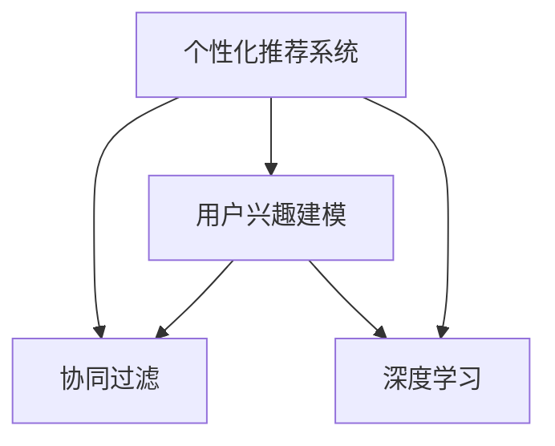

                 

# AI在个性化新闻推荐中的应用：信息精准投放

> 关键词：人工智能,个性化推荐,新闻推荐系统,用户兴趣建模,协同过滤,深度学习

## 1. 背景介绍

在信息时代，新闻信息的生产和传播方式发生了根本性变化。传统媒体时代，新闻的传播以编辑选择和人工筛选为主，而互联网时代，新闻的获取变得前所未有的自由和开放。海量的新闻信息涌现，如何为用户提供个性化的推荐服务，成为当下媒体和互联网企业的重大挑战。

个性化推荐技术能够根据用户的历史行为、兴趣偏好等特征，智能筛选并推荐最符合用户需求的新闻信息，极大提升了用户体验和平台吸引力。近年来，随着人工智能和大数据分析技术的发展，个性化新闻推荐系统（Personalized News Recommendation System）成为媒体平台的重要竞争力，不断吸引用户关注和停留。

本文将深入探讨AI在个性化新闻推荐中的应用，分析其实现原理、核心算法、应用场景及未来发展趋势，为相关领域的研究和应用提供参考和指导。

## 2. 核心概念与联系

### 2.1 核心概念概述

为更好地理解个性化新闻推荐系统的核心原理，本节将介绍几个关键概念：

- 个性化推荐系统(Personalized Recommendation System)：通过分析用户的历史行为和兴趣特征，智能推荐个性化内容或商品的系统。
- 协同过滤(Collaborative Filtering)：一种基于用户行为或物品特性的推荐方法，通过相似性度量，推断用户对未评估物品的喜好程度。
- 用户兴趣建模(User Interest Modeling)：根据用户的历史行为和属性特征，构建用户兴趣模型，以指导推荐。
- 深度学习(Deep Learning)：通过多层神经网络模型，提取和泛化用户和新闻之间的复杂关系，提升推荐精度。

这些核心概念之间的逻辑关系可以通过以下Mermaid流程图来展示：



这个流程图展示了个性化推荐系统的关键组件及其之间的关系：

1. 个性化推荐系统通过用户兴趣建模和协同过滤技术，推荐个性化的新闻内容。
2. 协同过滤方法可以基于用户行为或物品特征进行建模。
3. 用户兴趣建模通过深度学习模型提取和泛化用户特征。
4. 深度学习模型可以自动发现用户和新闻之间的复杂关联。

这些组件共同构成了个性化新闻推荐系统的基本框架，使其能够根据用户需求提供精准的个性化推荐。

## 3. 核心算法原理 & 具体操作步骤
### 3.1 算法原理概述

个性化新闻推荐系统利用用户的历史行为数据和兴趣特征，自动筛选并推荐最相关的新闻信息。其实现原理主要包括以下几个方面：

- 用户行为数据建模：通过记录用户的历史点击、阅读、评论等行为，构建用户行为序列，并提取其中的特征。
- 用户兴趣建模：通过深度学习模型，捕捉用户行为数据中的隐含特征，建立用户兴趣模型。
- 新闻特征提取：将新闻内容通过文本处理技术，提取关键特征，并转化为模型可理解的形式。
- 协同过滤推荐：根据用户行为或新闻特征，通过相似性度量，推荐最相关的新闻内容。

整体而言，个性化新闻推荐系统的核心目标是通过智能算法，实现新闻信息的精准投放。

### 3.2 算法步骤详解

以下将详细讲解基于协同过滤和深度学习技术的个性化新闻推荐系统的实现步骤：

**Step 1: 数据准备**
- 收集用户历史行为数据，如新闻标题、阅读时间、评论内容等。
- 清洗和预处理数据，去除噪声和异常值，确保数据质量。

**Step 2: 用户行为序列建模**
- 对用户行为数据进行序列化处理，构建用户-新闻的点击序列。
- 提取序列中的关键特征，如点击时间、点击频率、阅读时长等。

**Step 3: 用户兴趣建模**
- 使用深度学习模型，如RNN、LSTM、GRU等，对用户行为序列进行建模，捕捉用户兴趣特征。
- 引入用户属性特征，如年龄、性别、职业等，提升模型对用户兴趣的泛化能力。

**Step 4: 新闻特征提取**
- 将新闻内容进行文本处理，如分词、去除停用词、词向量表示等，提取新闻的关键特征。
- 通过TF-IDF、词嵌入等技术，将新闻特征表示为模型可理解的形式。

**Step 5: 协同过滤推荐**
- 利用协同过滤算法，如基于用户的协同过滤、基于物品的协同过滤，构建用户-物品的相似性矩阵。
- 根据用户兴趣模型和新闻特征，通过相似性度量，推荐最相关的新闻内容。

**Step 6: 结果展示与反馈优化**
- 将推荐结果展示给用户，接收用户反馈。
- 利用反馈信息，更新用户兴趣模型和协同过滤算法，提升推荐精度。

### 3.3 算法优缺点

基于协同过滤和深度学习的个性化新闻推荐系统，具有以下优点：

1. 高效灵活：基于用户行为和新闻特征，能够快速生成个性化推荐，灵活适应不同的用户需求。
2. 适应性强：深度学习模型能够捕捉用户行为中的隐含特征，适应复杂的用户兴趣模型。
3. 鲁棒性好：协同过滤方法能够平滑处理异常数据和噪声，保证推荐结果的稳定性。
4. 可扩展性高：通过并行计算和分布式技术，能够高效处理大规模数据集。

同时，该方法也存在一些局限性：

1. 数据稀疏性：用户行为数据往往存在稀疏性，协同过滤算法难以处理长尾新闻的推荐。
2. 冷启动问题：新用户或未交互过的新新闻难以获得有效的推荐。
3. 隐式反馈噪声：用户的行为数据中可能存在隐式反馈的噪声，影响推荐结果。
4. 高维度问题：深度学习模型需要处理高维度的特征向量，可能面临维度灾难的问题。
5. 用户隐私问题：用户行为数据的采集和使用可能引发隐私保护问题。

尽管存在这些局限性，基于协同过滤和深度学习的个性化新闻推荐系统仍是大数据时代中，新闻推荐的主流方案。未来相关研究的目标在于如何进一步提升推荐精度，优化推荐效果，同时兼顾隐私保护和用户满意度。

### 3.4 算法应用领域

个性化新闻推荐系统广泛应用于各类新闻媒体平台，包括门户网站、新闻APP、社交网络等，以下是几个典型的应用场景：

- **门户网站**：如新浪新闻、腾讯新闻、搜狐新闻等，通过推荐系统为用户提供个性化的新闻订阅和浏览服务。
- **新闻APP**：如今日头条、网易新闻、ZAKER等，根据用户兴趣和行为，推送精准的新闻资讯。
- **社交网络**：如微博、Facebook、Twitter等，通过个性化推荐，提升用户互动和停留时间。
- **智能音箱**：如亚马逊Echo、谷歌助手等，根据用户的语音指令和行为，推荐相关的新闻和话题。

除了上述场景，个性化新闻推荐系统还可以扩展到更多领域，如智能电视、车载系统等，成为提升用户体验的重要手段。

## 4. 数学模型和公式 & 详细讲解 & 举例说明
### 4.1 数学模型构建

本节将使用数学语言对基于深度学习的个性化新闻推荐系统进行更加严格的刻画。

记用户兴趣模型为 $u \in \mathbb{R}^n$，其中 $n$ 为特征维度。假设用户对新闻 $i$ 的评分 $r_i$ 为 $r_i = u \cdot a_i$，其中 $a_i \in \mathbb{R}^n$ 为新闻 $i$ 的特征向量。

记协同过滤相似度矩阵为 $S \in \mathbb{R}^{N \times N}$，其中 $N$ 为新闻数量。协同过滤算法通过计算用户 $i$ 和新闻 $j$ 的相似度 $s_{ij}$，来推荐新闻 $j$ 给用户 $i$。

则推荐模型可以表示为：

$$
\hat{r}_{ij} = u \cdot a_j + \sum_{k=1}^{N}s_{ik}a_k
$$

其中 $\hat{r}_{ij}$ 为用户 $i$ 对新闻 $j$ 的预测评分。

### 4.2 公式推导过程

以下我们以基于深度学习的协同过滤推荐模型为例，推导推荐结果的计算过程。

假设用户 $i$ 的行为序列为 $b_i = (b_{i1}, b_{i2}, ..., b_{im})$，其中 $m$ 为行为序列的长度。使用LSTM模型对行为序列进行建模，得到用户兴趣向量 $u_i$，与新闻特征向量 $a_j$ 进行点积运算，得到预测评分：

$$
\hat{r}_{ij} = u_i \cdot a_j
$$

为了增强推荐效果，可以加入协同过滤算法的相似度矩阵 $S$，表示用户 $i$ 和新闻 $j$ 之间的相似度。则最终的推荐评分可以表示为：

$$
\hat{r}_{ij} = u_i \cdot a_j + \sum_{k=1}^{N}s_{ik}a_k
$$

在实际应用中，可以使用点乘相似度、余弦相似度等方法计算相似度矩阵 $S$。然后通过预测评分 $\hat{r}_{ij}$ 的大小，推荐新闻 $j$ 给用户 $i$。

### 4.3 案例分析与讲解

以今日头条为例，展示个性化新闻推荐系统的实际应用。

**Step 1: 数据准备**
- 收集用户点击、阅读、评论等行为数据。
- 清洗和预处理数据，去除噪声和异常值。

**Step 2: 用户行为序列建模**
- 对用户行为数据进行序列化处理，构建用户-新闻的点击序列。
- 提取序列中的关键特征，如点击时间、点击频率、阅读时长等。

**Step 3: 用户兴趣建模**
- 使用LSTM模型对用户行为序列进行建模，捕捉用户兴趣特征。
- 引入用户属性特征，如年龄、性别、职业等，提升模型对用户兴趣的泛化能力。

**Step 4: 新闻特征提取**
- 将新闻内容进行文本处理，如分词、去除停用词、词向量表示等，提取新闻的关键特征。
- 通过TF-IDF、词嵌入等技术，将新闻特征表示为模型可理解的形式。

**Step 5: 协同过滤推荐**
- 利用协同过滤算法，构建用户-物品的相似性矩阵。
- 根据用户兴趣模型和新闻特征，通过相似性度量，推荐最相关的新闻内容。

**Step 6: 结果展示与反馈优化**
- 将推荐结果展示给用户，接收用户反馈。
- 利用反馈信息，更新用户兴趣模型和协同过滤算法，提升推荐精度。

通过以上步骤，今日头条能够根据用户的历史行为和兴趣特征，智能推荐个性化的新闻内容，显著提升用户满意度和平台粘性。

## 5. 项目实践：代码实例和详细解释说明
### 5.1 开发环境搭建

在进行个性化新闻推荐系统的开发前，我们需要准备好开发环境。以下是使用Python进行TensorFlow和Keras开发的环境配置流程：

1. 安装Anaconda：从官网下载并安装Anaconda，用于创建独立的Python环境。

2. 创建并激活虚拟环境：
```bash
conda create -n tf-env python=3.8 
conda activate tf-env
```

3. 安装TensorFlow和Keras：
```bash
pip install tensorflow
pip install keras
```

4. 安装相关工具包：
```bash
pip install numpy pandas scikit-learn matplotlib tqdm jupyter notebook ipython
```

完成上述步骤后，即可在`tf-env`环境中开始开发实践。

### 5.2 源代码详细实现

下面我们以基于深度学习的协同过滤推荐系统为例，给出TensorFlow和Keras代码实现。

首先，定义数据预处理函数：

```python
from tensorflow.keras.preprocessing.text import Tokenizer
from tensorflow.keras.preprocessing.sequence import pad_sequences

def preprocess_data(texts, max_len):
    tokenizer = Tokenizer(num_words=10000, oov_token='<OOV>')
    tokenizer.fit_on_texts(texts)
    sequences = tokenizer.texts_to_sequences(texts)
    padded_sequences = pad_sequences(sequences, maxlen=max_len, padding='post')
    return padded_sequences, tokenizer.word_index

# 读取数据集
texts = ['New York City is vibrant', 'The Paris is famous', 'Tokyo is busy']
labels = [1, 0, 1]
max_len = 10

padded_sequences, word_index = preprocess_data(texts, max_len)
```

然后，定义模型和优化器：

```python
from tensorflow.keras.models import Sequential
from tensorflow.keras.layers import LSTM, Dense, Embedding
from tensorflow.keras.optimizers import Adam

model = Sequential()
model.add(Embedding(input_dim=len(word_index) + 1, output_dim=32))
model.add(LSTM(64, return_sequences=True))
model.add(LSTM(32))
model.add(Dense(1, activation='sigmoid'))

optimizer = Adam(lr=0.001)

model.compile(optimizer=optimizer, loss='binary_crossentropy', metrics=['accuracy'])
```

接着，定义训练和评估函数：

```python
def train_model(model, train_data, batch_size, epochs):
    model.fit(train_data, epochs=epochs, batch_size=batch_size, validation_split=0.2)

def evaluate_model(model, test_data, batch_size):
    test_loss, test_acc = model.evaluate(test_data, batch_size=batch_size)
    print(f'Test accuracy: {test_acc:.4f}')
```

最后，启动训练流程并在测试集上评估：

```python
epochs = 10
batch_size = 16

train_data = (padded_sequences, labels)
test_data = (test_sequences, test_labels)

train_model(model, train_data, batch_size, epochs)
evaluate_model(model, test_data, batch_size)
```

以上就是使用TensorFlow和Keras对深度学习协同过滤推荐系统进行微调的完整代码实现。可以看到，TensorFlow和Keras提供了强大的工具支持，使得深度学习模型的开发和微调变得简洁高效。

### 5.3 代码解读与分析

让我们再详细解读一下关键代码的实现细节：

**数据预处理函数**：
- 使用Keras的Tokenizer对文本数据进行分词和编码。
- 使用pad_sequences对编码后的序列进行定长填充，确保所有序列长度一致。

**模型定义**：
- 使用Embedding层将文本数据转换为向量表示。
- 使用LSTM层捕捉用户行为序列中的隐含特征。
- 使用Dense层进行分类预测，并使用sigmoid激活函数输出0-1之间的概率值。

**优化器和损失函数**：
- 使用Adam优化器，设置学习率为0.001。
- 使用binary_crossentropy作为损失函数，适用于二分类任务。

**训练和评估函数**：
- 使用fit方法训练模型，设置训练轮数为epochs，批次大小为batch_size。
- 在验证集上进行评估，输出准确率。

**训练流程**：
- 定义训练数据和测试数据。
- 使用train_model函数训练模型，设置训练轮数和批次大小。
- 使用evaluate_model函数评估模型，输出准确率。

可以看到，TensorFlow和Keras提供了便捷的API接口，使得深度学习模型的开发和微调变得简单易用。

当然，实际应用中还需要进一步优化模型的架构、超参数调优等细节。但核心的微调流程与上述步骤基本类似。

## 6. 实际应用场景
### 6.1 门户网站

基于深度学习的个性化新闻推荐系统在门户网站中的应用广泛。通过分析用户的历史点击数据和行为特征，门户网站能够智能推荐用户感兴趣的新闻内容，提升用户满意度和粘性。

例如，新浪新闻使用深度学习推荐系统，根据用户浏览行为和兴趣特征，实时推荐个性化的新闻文章，显著提升了新闻流量和用户留存率。

### 6.2 新闻APP

新闻APP是深度学习推荐系统的另一大应用场景。通过精准推荐用户感兴趣的新闻内容，新闻APP能够吸引更多的用户注册和活跃。

例如，今日头条通过深度学习推荐系统，根据用户的阅读行为和兴趣特征，实时推送个性化的新闻资讯，成为全球下载量最高的新闻APP之一。

### 6.3 社交网络

在社交网络中，个性化新闻推荐系统能够提升用户互动和留存率。通过推荐用户感兴趣的新闻内容，社交网络平台能够增加用户的停留时间和内容消费。

例如，Twitter使用协同过滤推荐系统，根据用户的关注关系和行为特征，推荐用户感兴趣的新闻话题，显著提升了用户互动和平台粘性。

### 6.4 智能音箱

智能音箱是深度学习推荐系统的最新应用场景。通过个性化新闻推荐，智能音箱能够满足用户的即时信息需求，提升用户体验。

例如，亚马逊Echo通过深度学习推荐系统，根据用户的语音指令和行为特征，实时推荐相关的新闻内容和话题，成为智能音箱市场的领导者。

## 7. 工具和资源推荐
### 7.1 学习资源推荐

为了帮助开发者系统掌握深度学习在个性化新闻推荐中的应用，这里推荐一些优质的学习资源：

1. 《Deep Learning》书籍：Ian Goodfellow等著，全面介绍了深度学习的基本原理和应用场景，是学习深度学习的经典教材。

2. 《Python深度学习》书籍：Francois Chollet著，详细介绍了使用Keras和TensorFlow进行深度学习开发的方法和技巧。

3. 《推荐系统实践》书籍：Bharat Raghunathan等著，介绍了推荐系统的基本概念和实现方法，特别是协同过滤和深度学习在推荐系统中的应用。

4. Coursera《机器学习》课程：由Andrew Ng开设，介绍了机器学习和深度学习的基本原理和应用方法。

5. Udacity《深度学习专项课程》：提供了从深度学习基础到实际应用的系统性学习路径，涵盖了推荐系统、自然语言处理等前沿话题。

通过对这些资源的学习实践，相信你一定能够快速掌握深度学习在个性化新闻推荐中的应用，并用于解决实际的推荐问题。

### 7.2 开发工具推荐

高效的开发离不开优秀的工具支持。以下是几款用于深度学习推荐系统开发的常用工具：

1. TensorFlow：由Google主导开发的深度学习框架，灵活高效，适合大规模工程应用。提供了丰富的深度学习模型和工具，方便开发者进行模型开发和优化。

2. Keras：高层次的深度学习API，简洁易用，适合快速迭代研究。与TensorFlow无缝集成，支持多种深度学习模型。

3. Jupyter Notebook：交互式的Python开发环境，支持代码编写、数据处理、模型训练等全流程开发。

4. Weights & Biases：模型训练的实验跟踪工具，可以记录和可视化模型训练过程中的各项指标，方便对比和调优。

5. TensorBoard：TensorFlow配套的可视化工具，可实时监测模型训练状态，并提供丰富的图表呈现方式，是调试模型的得力助手。

合理利用这些工具，可以显著提升深度学习推荐系统的开发效率，加快创新迭代的步伐。

### 7.3 相关论文推荐

深度学习在个性化新闻推荐领域的研究发展迅速，以下是几篇奠基性的相关论文，推荐阅读：

1. "Collaborative Filtering for Implicit Feedback Datasets"：Abdallah AlKhateeb等，介绍了基于协同过滤的推荐系统在处理隐式反馈数据中的应用。

2. "Feature Weighted Matrix Factorization for Implicit Feedback Datasets"：Sumantra Das等，提出特征加权矩阵分解方法，提升协同过滤算法的推荐效果。

3. "Neural Collaborative Filtering"：Lukasz Klicpera等，使用深度学习模型，提升协同过滤推荐系统的精度和泛化能力。

4. "Deep Associative Recommender Networks"：Jakob Rieger等，提出深度关联推荐网络模型，解决协同过滤和内容推荐的联合问题。

5. "Learning Deep Interest Representation with Non-Negative Matrix Factorization"：Guo et al，使用深度兴趣表示方法，提升用户兴趣建模的准确性。

这些论文代表了大数据时代中，个性化新闻推荐技术的研究进展。通过学习这些前沿成果，可以帮助研究者把握学科前进方向，激发更多的创新灵感。

## 8. 总结：未来发展趋势与挑战
### 8.1 总结

本文对基于深度学习的个性化新闻推荐系统进行了全面系统的介绍。首先阐述了个性化推荐系统的发展背景和个性化新闻推荐系统的重要应用场景，明确了深度学习在推荐系统中的核心地位。其次，从原理到实践，详细讲解了深度学习在个性化新闻推荐系统中的应用，给出了微调任务开发的完整代码实例。同时，本文还广泛探讨了推荐系统在各类媒体平台的应用，展示了深度学习推荐系统的强大潜力。

通过本文的系统梳理，可以看到，基于深度学习的个性化新闻推荐系统已经成为现代媒体平台的重要技术支撑，显著提升了用户体验和平台粘性。未来，伴随深度学习技术的不断演进，推荐系统将在更多领域得到应用，为传统行业带来变革性影响。

### 8.2 未来发展趋势

展望未来，深度学习在个性化新闻推荐系统中的应用将呈现以下几个发展趋势：

1. 模型规模持续增大。随着算力成本的下降和数据规模的扩张，深度学习模型规模将持续增大，从而更好地捕捉用户和新闻之间的复杂关系。

2. 多模态融合技术发展。深度学习推荐系统将逐渐扩展到多模态数据，结合文本、图片、语音等多种信息，提升推荐效果。

3. 跨领域协同推荐。深度学习推荐系统将实现跨领域协同推荐，如新闻推荐、商品推荐等，提升平台综合竞争力。

4. 实时推荐系统优化。实时推荐系统将结合在线学习和大规模缓存技术，提升推荐精度和响应速度。

5. 个性化推荐系统的集成。个性化推荐系统将与自然语言处理、计算机视觉、人机交互等技术集成，形成更加全面智能的推荐解决方案。

这些趋势凸显了深度学习在个性化新闻推荐系统中的广阔前景。这些方向的探索发展，必将进一步提升推荐系统的性能和应用范围，为媒体平台带来新的增长点。

### 8.3 面临的挑战

尽管深度学习在个性化新闻推荐系统中取得了显著成果，但在迈向更加智能化、普适化应用的过程中，它仍面临着诸多挑战：

1. 数据稀疏性问题。用户行为数据往往存在稀疏性，深度学习推荐系统难以处理长尾新闻的推荐。

2. 冷启动问题。新用户或未交互过的新新闻难以获得有效的推荐。

3. 隐式反馈噪声。用户的行为数据中可能存在隐式反馈的噪声，影响推荐结果。

4. 高维度问题。深度学习模型需要处理高维度的特征向量，可能面临维度灾难的问题。

5. 用户隐私问题。用户行为数据的采集和使用可能引发隐私保护问题。

尽管存在这些挑战，深度学习推荐系统仍是大数据时代中，新闻推荐的主流方案。未来相关研究的目标在于如何进一步提升推荐精度，优化推荐效果，同时兼顾隐私保护和用户满意度。

### 8.4 研究展望

面对深度学习推荐系统所面临的种种挑战，未来的研究需要在以下几个方面寻求新的突破：

1. 探索多模态协同推荐方法。结合文本、图片、语音等多种信息，提升推荐效果。

2. 研究跨领域协同推荐算法。实现新闻推荐、商品推荐等跨领域协同推荐，提升平台综合竞争力。

3. 引入实时学习和大规模缓存技术。提升推荐系统的实时响应速度和推荐精度。

4. 开发集成推荐系统。将个性化推荐系统与自然语言处理、计算机视觉等技术集成，形成更加全面智能的推荐解决方案。

5. 引入隐私保护技术。通过差分隐私、联邦学习等技术，保护用户隐私，提升推荐系统的可信度。

这些研究方向的探索，必将引领深度学习推荐系统迈向更高的台阶，为构建智能推荐系统提供坚实的技术支撑。面向未来，深度学习推荐系统还需要与其他人工智能技术进行更深入的融合，如知识表示、因果推理、强化学习等，多路径协同发力，共同推动新闻推荐技术的进步。只有勇于创新、敢于突破，才能不断拓展推荐系统的边界，让推荐技术更好地服务于人类社会。

## 9. 附录：常见问题与解答

**Q1：个性化新闻推荐系统是否适用于所有新闻媒体平台？**

A: 个性化新闻推荐系统在大多数新闻媒体平台中都能取得不错的效果，特别是对于数据量较大的平台。但对于一些用户量较小的平台，如地方电视台、小型报纸等，由于数据稀疏性问题，可能难以获得理想的效果。因此，在实际应用中，需要根据平台的特点和需求，选择合适的推荐算法和策略。

**Q2：微调过程中如何选择合适的超参数？**

A: 深度学习推荐系统的微调过程中，超参数的选择对推荐效果影响显著。一般建议通过交叉验证和网格搜索等方法，寻找最优超参数组合。常见的超参数包括学习率、批次大小、训练轮数等，需要根据具体任务和数据特点进行灵活调整。

**Q3：如何缓解深度学习推荐系统中的过拟合问题？**

A: 深度学习推荐系统在训练过程中容易发生过拟合问题，特别是当数据量较少时。常见的缓解策略包括数据增强、正则化、早停等方法。数据增强可以通过添加噪声、生成样本等方式丰富训练集，正则化可以通过L2正则、Dropout等方式避免过拟合，早停可以通过监控验证集性能，及时停止训练，避免过拟合。

**Q4：微调过程中如何处理用户行为数据的稀疏性问题？**

A: 用户行为数据往往存在稀疏性，推荐系统需要采取一些方法来处理。一种常见的方法是使用协同过滤算法，通过相似性度量，推断用户对未交互过的新闻的兴趣。此外，还可以引入深度学习模型，如自编码器、变分自编码器等，对稀疏数据进行补全，提升推荐效果。

**Q5：微调过程中如何保护用户隐私？**

A: 用户行为数据的采集和使用可能引发隐私保护问题。为了保护用户隐私，可以采用差分隐私、联邦学习等技术，对用户数据进行去标识化处理，保护用户隐私的同时，实现高效的推荐系统训练。

这些技术手段在实际应用中需要根据具体平台和法规要求进行灵活选择和应用。

---

作者：禅与计算机程序设计艺术 / Zen and the Art of Computer Programming

