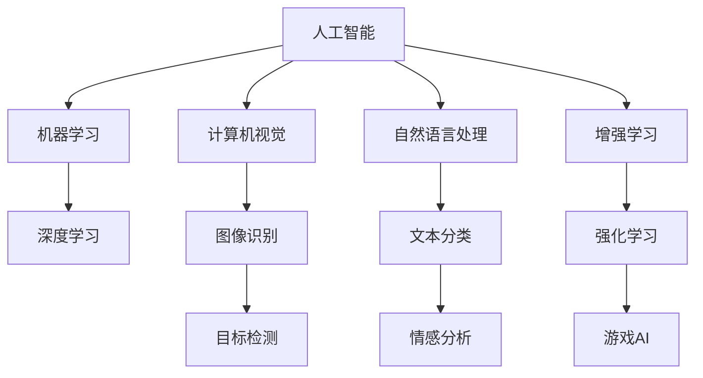

                 

## 1. 背景介绍

### 1.1 问题由来
人工智能（AI）技术在过去十年间取得了飞速发展，从深度学习到增强学习，从计算机视觉到自然语言处理，AI已经渗透到各个领域，并带来深刻变革。然而，相比于实验室里的模型，AI在现实世界中的应用场景还面临诸多挑战和不确定性。

**1.1.1 数据问题**
数据是AI的基础，但在现实中，数据获取往往成本高昂，且质量参差不齐。数据标注更是耗时耗力，需要大量人力资源。如何高效获取数据，确保数据质量，是AI在现实世界应用中的一个核心问题。

**1.1.2 模型选择**
不同场景下，AI模型的选择和设计也有很大差异。如何选择最适合特定场景的模型，如何在模型中选择合适的参数，是AI应用中需要慎重考虑的问题。

**1.1.3 部署和集成**
将AI模型部署到实际应用中，涉及模型优化、算法实现、软硬件集成等多方面工作。如何在实际环境中高效部署AI模型，使其与现有系统无缝集成，是另一个重大挑战。

### 1.2 问题核心关键点
AI在现实世界中的应用场景主要包括三大方面：数据获取、模型训练和部署集成。其核心关键点如下：
- 高效的数据获取和标注技术。
- 选择合适的模型和算法。
- 高效的模型部署和集成方法。

### 1.3 问题研究意义
AI技术的应用可以推动各行各业的数字化转型，提升生产力，优化决策过程。通过研究AI在现实世界中的应用场景，可以更好地理解AI技术的潜力和局限，为实际应用提供指导。

## 2. 核心概念与联系

### 2.1 核心概念概述

为更好地理解AI在现实世界中的应用场景，本节将介绍几个密切相关的核心概念：

- **人工智能（AI）**：涵盖机器学习、深度学习、自然语言处理等众多领域的计算机技术，旨在使计算机具有人类智能。
- **机器学习（ML）**：一种数据驱动的技术，通过模型训练让计算机从数据中学习规律。
- **深度学习（DL）**：一种特殊类型的机器学习，使用多层神经网络处理数据，广泛应用于图像识别、语音识别等任务。
- **计算机视觉（CV）**：使用AI技术让计算机“看懂”图像和视频。
- **自然语言处理（NLP）**：使计算机能够理解、处理和生成自然语言。
- **增强学习（RL）**：通过与环境交互，让机器学习最优策略。

这些核心概念之间的逻辑关系可以通过以下Mermaid流程图来展示：



这个流程图展示了AI技术的不同分支以及它们之间的相互关系。

## 3. 核心算法原理 & 具体操作步骤
### 3.1 算法原理概述

AI在现实世界中的应用场景，主要依赖于数据的获取、模型的训练和部署。其核心算法原理可概述如下：

1. **数据获取**：通过爬虫、API接口、传感器等方式获取数据，并进行数据清洗、标注等预处理。
2. **模型训练**：选择合适的算法和模型，如深度学习模型、决策树等，在标注数据上训练模型。
3. **模型部署**：将训练好的模型部署到实际应用中，并进行调优和优化。

### 3.2 算法步骤详解

以下是AI在现实世界应用场景中的核心算法步骤：

**Step 1: 数据获取**

- 选择数据源：从公开数据集、API接口、传感器等多种渠道获取数据。
- 数据预处理：清洗、去重、归一化等预处理步骤。
- 数据标注：根据任务需求进行数据标注，确保数据质量。

**Step 2: 模型训练**

- 选择算法：根据任务需求选择合适的算法，如卷积神经网络、循环神经网络、BERT等。
- 模型训练：在标注数据上训练模型，并使用交叉验证等技术评估模型性能。
- 超参数调优：调整学习率、批次大小等超参数，优化模型效果。

**Step 3: 模型部署**

- 模型保存：将训练好的模型保存为可用的格式，如TensorFlow SavedModel、PyTorch模型文件等。
- 部署集成：将模型集成到实际应用中，并使用HTTP接口、REST API等方式进行调用。
- 性能优化：在实际应用中对模型进行调优，如调整模型结构、优化推理速度等。

### 3.3 算法优缺点

AI在现实世界中的应用场景中，常见的算法优缺点如下：

**优点**：
- 高效处理大量数据。
- 自动化、智能化程度高。
- 能够处理复杂的非线性关系。

**缺点**：
- 数据获取成本高。
- 模型复杂，难以解释。
- 需要大量计算资源。

### 3.4 算法应用领域

AI技术在现实世界中的应用场景极为广泛，涉及多个领域：

- **医疗健康**：通过图像识别、自然语言处理等技术，提高疾病诊断和治疗效率。
- **金融保险**：使用机器学习算法进行风险评估、欺诈检测等。
- **制造业**：通过预测分析、质量控制等技术，优化生产流程。
- **物流运输**：使用计算机视觉、路径规划等技术，提升物流效率。
- **零售电商**：通过推荐系统、图像识别等技术，提升客户体验。
- **教育培训**：使用自然语言处理、语音识别等技术，个性化教学。

## 4. 数学模型和公式 & 详细讲解  
### 4.1 数学模型构建

AI在现实世界中的应用场景，主要依赖于数学模型来描述和解决问题。以下是对其中几个核心数学模型的构建：

**Step 1: 数据预处理**

- 标准化：将数据归一化到标准分布，如均值为0、标准差为1的正态分布。
- 归一化：将数据缩放到一个较小的范围内，如[0,1]。
- 特征提取：从原始数据中提取有用的特征，如图像中的边缘、纹理等。

**Step 2: 模型训练**

- 损失函数：选择适当的损失函数，如均方误差（MSE）、交叉熵（CE）等。
- 优化算法：选择适当的优化算法，如随机梯度下降（SGD）、Adam等。
- 模型评估：使用测试集对模型进行评估，如准确率、召回率、F1分数等。

**Step 3: 模型部署**

- 模型保存：将训练好的模型保存为文件或数据库。
- 推理计算：使用推理引擎对新数据进行计算和预测。
- 性能优化：对模型进行优化，如剪枝、量化、编译优化等。

### 4.2 公式推导过程

以下是AI在现实世界中的应用场景中的几个关键公式的推导：

**线性回归**：

$$
y = wx + b
$$

其中 $w$ 为权重，$x$ 为输入，$b$ 为偏置，$y$ 为输出。

**神经网络**：

$$
y = \sigma(\sum_{i=1}^{n}w_i x_i + b)
$$

其中 $\sigma$ 为激活函数，如Sigmoid、ReLU等。

**卷积神经网络**：

$$
y = \sum_{i=1}^{n}w_i \ast f(x)
$$

其中 $f$ 为卷积操作，$w_i$ 为卷积核，$x$ 为输入，$y$ 为输出。

### 4.3 案例分析与讲解

以图像识别任务为例，分析AI模型训练和部署的详细步骤：

**数据预处理**：
- 收集图像数据集。
- 数据增强：对图像进行旋转、缩放、裁剪等操作，扩充数据集。
- 数据清洗：去除低质量数据、去除噪声等。

**模型训练**：
- 选择卷积神经网络（CNN）作为模型架构。
- 定义损失函数：如交叉熵损失。
- 使用SGD优化算法，训练模型。

**模型部署**：
- 保存模型参数。
- 使用TensorFlow或PyTorch构建推理模型。
- 使用HTTP接口或REST API，部署模型。

## 5. 项目实践：代码实例和详细解释说明
### 5.1 开发环境搭建

在进行AI模型开发前，需要搭建开发环境。以下是使用Python进行TensorFlow开发的环境配置流程：

1. 安装Anaconda：从官网下载并安装Anaconda，用于创建独立的Python环境。

2. 创建并激活虚拟环境：
```bash
conda create -n tf-env python=3.8 
conda activate tf-env
```

3. 安装TensorFlow：根据CUDA版本，从官网获取对应的安装命令。例如：
```bash
pip install tensorflow
```

4. 安装各类工具包：
```bash
pip install numpy pandas scikit-learn matplotlib tqdm jupyter notebook ipython
```

完成上述步骤后，即可在`tf-env`环境中开始AI模型的开发。

### 5.2 源代码详细实现

下面我们以图像分类任务为例，给出使用TensorFlow对ResNet模型进行训练的Python代码实现。

```python
import tensorflow as tf
from tensorflow.keras import layers, models

# 构建模型
model = models.Sequential()
model.add(layers.Conv2D(64, (3,3), activation='relu', input_shape=(224,224,3)))
model.add(layers.MaxPooling2D((2,2)))
model.add(layers.Conv2D(128, (3,3), activation='relu'))
model.add(layers.MaxPooling2D((2,2)))
model.add(layers.Conv2D(256, (3,3), activation='relu'))
model.add(layers.MaxPooling2D((2,2)))
model.add(layers.Conv2D(512, (3,3), activation='relu'))
model.add(layers.MaxPooling2D((2,2)))
model.add(layers.Flatten())
model.add(layers.Dense(512, activation='relu'))
model.add(layers.Dense(10, activation='softmax'))

# 编译模型
model.compile(optimizer='adam',
              loss=tf.keras.losses.SparseCategoricalCrossentropy(from_logits=True),
              metrics=['accuracy'])

# 加载数据集
train_data = tf.keras.preprocessing.image_dataset_from_directory('train', image_size=(224,224), batch_size=32)
val_data = tf.keras.preprocessing.image_dataset_from_directory('val', image_size=(224,224), batch_size=32)

# 训练模型
history = model.fit(train_data, epochs=10, validation_data=val_data)
```

### 5.3 代码解读与分析

让我们再详细解读一下关键代码的实现细节：

**模型构建**：
- 定义了一个包含5个卷积层和2个全连接层的ResNet模型。
- 使用`Sequential`模型封装所有层，形成完整的模型结构。

**模型编译**：
- 选择Adam优化器，并定义交叉熵损失函数。
- 设置准确率作为评估指标。

**数据加载**：
- 使用`tf.keras.preprocessing.image_dataset_from_directory`函数，从指定目录加载图像数据集。
- 对数据进行预处理，将图像大小调整为224x224，并进行归一化处理。

**模型训练**：
- 使用`model.fit`函数对模型进行训练。
- 在训练过程中，每轮训练后计算损失和准确率，并在验证集上进行评估。

## 6. 实际应用场景
### 6.1 医疗健康

在医疗健康领域，AI技术可以用于疾病诊断、患者监护、药物研发等多个方面。通过图像识别、自然语言处理等技术，AI可以辅助医生进行疾病诊断，分析病历记录，预测疾病发展趋势，提升医疗服务的质量和效率。

在实际应用中，可以收集医院内的影像数据、电子病历等数据，进行数据标注和预处理。在此基础上，使用卷积神经网络（CNN）、循环神经网络（RNN）等模型进行训练，并部署到医生工作站或医疗系统中，实时辅助诊断和治疗。

### 6.2 金融保险

金融保险行业依赖于数据分析和风险评估，AI技术可以用于欺诈检测、信用评分、投资分析等多个方面。通过机器学习模型，AI可以分析大量历史数据，预测客户行为，检测异常交易，优化投资策略，降低风险损失。

在实际应用中，可以收集银行、保险公司等机构的数据，进行数据清洗和预处理。在此基础上，使用随机森林、梯度提升树等模型进行训练，并部署到银行或保险公司系统中，实时分析客户行为，预测风险事件，优化风险管理策略。

### 6.3 制造业

制造业需要大量的预测分析、质量控制和生产优化，AI技术可以用于预测维护、供应链管理、智能制造等多个方面。通过图像识别、自然语言处理等技术，AI可以分析生产数据，预测设备故障，优化供应链，提高生产效率。

在实际应用中，可以收集制造企业的设备数据、生产记录等数据，进行数据标注和预处理。在此基础上，使用深度学习模型进行训练，并部署到制造企业系统中，实时预测设备故障，优化生产流程，提升生产效率。

### 6.4 物流运输

物流运输需要高效的数据处理和路径规划，AI技术可以用于货物追踪、路径规划、运输优化等多个方面。通过计算机视觉、自然语言处理等技术，AI可以实时分析运输数据，优化运输路线，提高运输效率，降低运输成本。

在实际应用中，可以收集物流公司的货物数据、运输记录等数据，进行数据标注和预处理。在此基础上，使用图神经网络（GNN）、深度强化学习等模型进行训练，并部署到物流公司系统中，实时优化运输路线，提升运输效率。

### 6.5 零售电商

零售电商行业需要个性化的推荐系统和客户服务，AI技术可以用于推荐系统、客户分析、情感分析等多个方面。通过推荐系统，AI可以分析用户行为，推荐个性化商品，提升客户体验；通过情感分析，AI可以分析客户评论，改进产品和服务质量。

在实际应用中，可以收集零售电商公司的用户数据、商品数据等数据，进行数据标注和预处理。在此基础上，使用深度学习模型进行训练，并部署到电商系统中，实时推荐个性化商品，提升客户体验，分析客户评论，改进产品和服务质量。

## 7. 工具和资源推荐
### 7.1 学习资源推荐

为了帮助开发者系统掌握AI技术的应用场景，这里推荐一些优质的学习资源：

1. **Coursera《机器学习》**：由斯坦福大学Andrew Ng教授主讲的入门级机器学习课程，涵盖算法原理和应用场景。
2. **DeepLearning.AI《深度学习专项课程》**：由Andrew Ng主讲的深度学习专项课程，涵盖深度学习算法和应用场景。
3. **Udacity《深度学习工程师》**：Udacity的深度学习工程师课程，涵盖深度学习算法和实际项目开发。
4. **Kaggle**：数据科学竞赛平台，提供大量公开数据集和竞赛任务，帮助开发者实战训练。
5. **TensorFlow官方文档**：TensorFlow的官方文档，包含详细的使用指南和示例代码。
6. **PyTorch官方文档**：PyTorch的官方文档，涵盖深度学习算法和实际项目开发。

通过对这些资源的学习实践，相信你一定能够快速掌握AI技术的应用场景，并用于解决实际的NLP问题。

### 7.2 开发工具推荐

高效的开发离不开优秀的工具支持。以下是几款用于AI模型开发的常用工具：

1. **TensorFlow**：由Google主导开发的深度学习框架，生产部署方便，适合大规模工程应用。
2. **PyTorch**：由Facebook主导开发的深度学习框架，灵活动态，适合快速迭代研究。
3. **Jupyter Notebook**：数据科学和机器学习领域常用的交互式开发环境，支持代码编写和实时预览。
4. **Visual Studio Code**：轻量级的开发环境，支持多种编程语言和工具插件。
5. **Scikit-Learn**：Python数据科学和机器学习库，提供丰富的算法和工具。

合理利用这些工具，可以显著提升AI模型开发的效率，加快创新迭代的步伐。

### 7.3 相关论文推荐

AI技术在实际应用中不断创新，以下是几篇奠基性的相关论文，推荐阅读：

1. **ImageNet Large Scale Visual Recognition Challenge**：AlexNet论文，展示了大规模卷积神经网络在图像识别任务中的优越性能。
2. **Convolutional Neural Networks for Sentence Classification**：LSTM-RNN论文，展示了递归神经网络在自然语言处理任务中的应用。
3. **BERT: Pre-training of Deep Bidirectional Transformers for Language Understanding**：BERT论文，展示了预训练语言模型在NLP任务中的优越性能。
4. **Deep Q-Learning for Playing Atari 2048**：DeepMind的AlphaGo论文，展示了深度强化学习在复杂决策任务中的应用。
5. **Towards the Human Level for Image Recognition with Deep Neural Networks**：ImageNet论文，展示了深度神经网络在图像识别任务中的优越性能。

这些论文代表了大数据和AI技术的最新发展，通过学习这些前沿成果，可以帮助研究者把握学科前进方向，激发更多的创新灵感。

## 8. 总结：未来发展趋势与挑战

### 8.1 总结

本文对AI在现实世界中的应用场景进行了全面系统的介绍。首先阐述了AI技术的核心算法原理和操作步骤，详细讲解了数据获取、模型训练和部署集成的关键步骤。其次，从医疗健康、金融保险、制造业等多个领域展示了AI技术的实际应用。最后，推荐了一些优质的学习资源、开发工具和相关论文，为读者提供全面的技术指引。

通过本文的系统梳理，可以看到，AI技术在现实世界中的应用前景广阔，可以广泛应用于各个领域，提升生产力和决策效率。未来，伴随AI技术的不断进步，相信AI将在更多领域发挥其独特的价值，引领人类进入智能时代。

### 8.2 未来发展趋势

展望未来，AI技术在现实世界中的应用场景将呈现以下几个发展趋势：

1. **自监督学习**：越来越多的应用场景将利用自监督学习技术，在没有标注数据的情况下进行模型训练，提升数据获取效率和模型性能。
2. **联邦学习**：通过分布式训练，保护数据隐私，提升数据安全性和模型泛化能力。
3. **跨领域迁移学习**：将不同领域的数据进行迁移学习，提升模型在不同领域之间的迁移能力，降低标注成本。
4. **边缘计算**：将AI模型部署到边缘设备，如手机、物联网设备等，提升实时性和数据安全性。
5. **实时数据流处理**：利用实时数据流处理技术，对数据进行实时分析，提升决策效率。
6. **智能协同**：利用AI技术与人类进行协同工作，提升工作效率和决策质量。

以上趋势凸显了AI技术在现实世界应用的广阔前景，这些方向的探索发展，必将进一步推动AI技术的广泛应用和普及。

### 8.3 面临的挑战

尽管AI技术在现实世界中的应用场景不断扩展，但仍面临诸多挑战：

1. **数据获取和标注成本高**：数据获取和标注成本较高，尤其在医疗、金融等垂直领域。如何降低标注成本，提升数据获取效率，仍是重要课题。
2. **模型可解释性不足**：AI模型往往被视为“黑盒”系统，难以解释其内部工作机制和决策逻辑。如何在保障模型性能的同时，提升模型的可解释性，将是重要的研究方向。
3. **隐私和安全问题**：AI技术在应用过程中，如何保护数据隐私和安全，避免数据泄露和滥用，需要更多的技术手段和管理机制。
4. **模型公平性和偏见**：AI模型可能学习到数据中的偏见，导致不公平输出。如何确保AI模型的公平性，消除模型偏见，将是一个长期挑战。
5. **资源瓶颈**：大规模AI模型的训练和推理需要大量计算资源，如何优化模型结构，降低计算资源消耗，提升计算效率，仍需不断探索。

### 8.4 研究展望

未来，AI技术在现实世界中的应用场景将不断创新和突破。研究者需要从以下几个方向进行探索：

1. **无监督学习和半监督学习**：利用无监督和半监督学习方法，在没有大量标注数据的情况下，进行模型训练和优化。
2. **强化学习和跨领域迁移学习**：利用强化学习和跨领域迁移学习，提升模型在不同场景下的适应能力和泛化能力。
3. **跨模态学习和多任务学习**：将不同模态的数据进行融合，提升模型的多任务处理能力和迁移能力。
4. **多智能体系统和协作学习**：利用多智能体系统和协作学习，提升模型的协同工作能力和决策质量。
5. **智能协同和交互**：利用AI技术与人类进行协同工作，提升工作效率和决策质量。

只有勇于创新、敢于突破，才能不断拓展AI技术在现实世界中的应用场景，推动AI技术的广泛应用和普及。总之，AI技术在现实世界中的应用场景充满了无限可能，未来将继续引领人类进入智能时代。

## 9. 附录：常见问题与解答

**Q1：AI技术在医疗健康领域有哪些具体应用？**

A: AI技术在医疗健康领域的应用非常广泛，主要包括：
1. **疾病诊断**：利用图像识别技术，辅助医生进行疾病诊断，如乳腺癌、肺结节等。
2. **患者监护**：利用传感器和物联网设备，实时监测患者生理指标，如心率、血压等。
3. **药物研发**：利用深度学习技术，分析大量生物数据，加速新药研发过程。

**Q2：AI技术在金融保险领域有哪些具体应用？**

A: AI技术在金融保险领域的应用主要包括：
1. **欺诈检测**：利用机器学习模型，分析交易数据，检测异常交易行为，预防欺诈。
2. **信用评分**：利用深度学习模型，分析客户历史数据，预测客户信用风险。
3. **投资分析**：利用自然语言处理技术，分析新闻、社交媒体等数据，预测市场趋势。

**Q3：AI技术在制造业有哪些具体应用？**

A: AI技术在制造业的应用主要包括：
1. **预测维护**：利用机器学习模型，分析设备数据，预测设备故障，优化维护计划。
2. **供应链管理**：利用强化学习模型，优化供应链管理，提升物流效率。
3. **智能制造**：利用深度学习模型，分析生产数据，优化生产流程，提高生产效率。

**Q4：AI技术在物流运输有哪些具体应用？**

A: AI技术在物流运输的应用主要包括：
1. **货物追踪**：利用计算机视觉技术，实时监测货物状态，提高运输效率。
2. **路径规划**：利用深度学习模型，优化运输路线，降低运输成本。
3. **运输优化**：利用强化学习模型，优化运输计划，提升物流效率。

**Q5：AI技术在零售电商有哪些具体应用？**

A: AI技术在零售电商的应用主要包括：
1. **推荐系统**：利用深度学习模型，分析用户行为，推荐个性化商品，提升客户体验。
2. **客户分析**：利用自然语言处理技术，分析客户评论，改进产品和服务质量。
3. **情感分析**：利用深度学习模型，分析客户情感，优化客户服务。

总之，AI技术在现实世界中的应用场景广阔，可以广泛应用于医疗健康、金融保险、制造业、物流运输、零售电商等多个领域，提升生产力、决策效率和服务质量，推动各行业的数字化转型。

