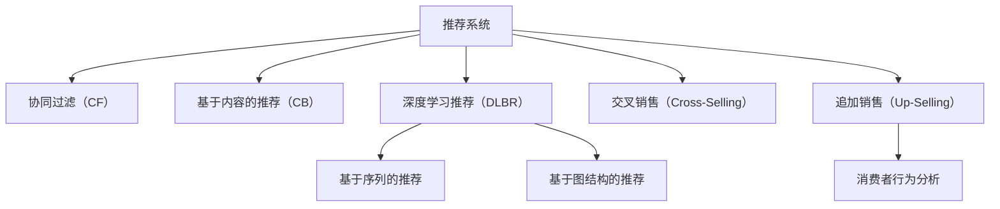

                 

# AI在电商平台交叉销售和追加销售中的应用

> 关键词：人工智能,电商平台,交叉销售,追加销售,推荐系统,消费者行为分析

## 1. 背景介绍

### 1.1 问题由来

在现代电子商务时代，电商平台已经成为了消费者购买商品的主要渠道。为了提升用户体验和销售额，电商平台纷纷采用了一系列智能化的推荐技术，以期通过个性化推荐系统，精准把握用户需求，提高用户满意度和转化率。其中，交叉销售（Cross-Selling）和追加销售（Up-Selling）策略成为了电商平台常用的手段。

交叉销售指的是在用户购买某个商品时，推荐其购买其他相关的商品。例如，当用户购买了一台笔记本电脑时，电商平台可能会推荐配件、显示器等关联产品。追加销售则是在用户完成一次购买后，推荐其购买更高价值的产品，例如在购买基本产品后，推荐升级版或高附加值产品。这些策略不仅能提升销售额，还能增加用户粘性，提高平台的用户留存率。

### 1.2 问题核心关键点

基于AI的推荐系统是交叉销售和追加销售策略得以实施的核心技术。该系统通过分析用户的历史行为和偏好，预测其未来的购买行为，从而精准推荐相关商品。当前主流的方法主要包括基于协同过滤的推荐、基于内容的推荐、基于深度学习的推荐等。

协同过滤（Collaborative Filtering, CF）方法主要基于用户行为数据，通过相似性度量推荐相似商品。基于内容的推荐（Content-Based Filtering, CB）方法主要通过分析商品属性，预测用户对商品的偏好。基于深度学习的推荐（Deep Learning-Based Recommendation, DLBR）方法则利用深度神经网络，提取用户与商品间的隐式关联，通过端到端的训练预测用户行为。

本文将重点探讨基于深度学习方法的推荐系统在交叉销售和追加销售中的应用。通过介绍深度学习推荐模型的核心原理，详解具体的算法步骤，分析其在电商平台的应用效果，同时提出一些关键优化策略，以期为电商平台实现更高的销售目标提供参考。

## 2. 核心概念与联系

### 2.1 核心概念概述

为更好地理解基于深度学习的推荐系统在交叉销售和追加销售中的应用，本节将介绍几个密切相关的核心概念：

- **推荐系统**：通过分析用户历史行为和商品属性，预测用户未来可能购买的商品。推荐系统是交叉销售和追加销售策略得以实施的核心技术。
- **协同过滤（CF）**：基于用户行为数据，通过相似性度量推荐相似商品。协同过滤方法包括基于用户的CF和基于项目的CF。
- **基于内容的推荐（CB）**：通过分析商品属性，预测用户对商品的偏好。基于内容的推荐方法包括商品属性分析和用户画像分析。
- **深度学习推荐（DLBR）**：利用深度神经网络，提取用户与商品间的隐式关联，通过端到端的训练预测用户行为。深度学习推荐方法包括基于序列的推荐和基于图结构的推荐。
- **交叉销售（Cross-Selling）**：在用户购买某个商品时，推荐其购买其他相关的商品。
- **追加销售（Up-Selling）**：在用户完成一次购买后，推荐其购买更高价值的产品。
- **消费者行为分析**：通过分析用户的行为数据，了解其需求和偏好，从而优化推荐算法。

这些核心概念之间的逻辑关系可以通过以下Mermaid流程图来展示：



这个流程图展示了一些核心概念之间的联系：

1. 推荐系统是实施交叉销售和追加销售的基础技术。
2. 协同过滤和基于内容的推荐是推荐系统的主要技术分支。
3. 深度学习推荐技术是当前研究的热点，通过序列和图结构模型提升推荐效果。
4. 交叉销售和追加销售策略通过推荐系统得以实施。
5. 消费者行为分析为推荐系统提供了用户偏好的深度洞察。

## 3. 核心算法原理 & 具体操作步骤

### 3.1 算法原理概述

基于深度学习的推荐系统，主要是利用深度神经网络模型，对用户和商品之间的隐式关联进行建模和预测。其核心原理可以概括为：

1. **用户画像建模**：通过分析用户历史行为数据，构建用户画像，捕捉用户的兴趣偏好。
2. **商品特征提取**：提取商品的属性特征，构建商品表示，捕捉商品的特性。
3. **用户商品交互建模**：通过深度神经网络，建模用户和商品之间的隐式关联，预测用户对商品的偏好。
4. **推荐策略设计**：根据用户的兴趣偏好和商品特性，设计推荐策略，进行交叉销售和追加销售。

### 3.2 算法步骤详解

基于深度学习的推荐系统，主要包括数据准备、模型训练和推荐策略设计三个关键步骤。

**Step 1: 数据准备**
- **用户行为数据**：收集用户历史浏览、购买、评分等行为数据，作为推荐模型的输入。
- **商品属性数据**：收集商品的属性数据，如名称、分类、价格等，作为推荐模型的输入。
- **预处理**：对数据进行清洗、归一化、编码等预处理操作，便于后续模型训练。

**Step 2: 模型训练**
- **选择模型**：选择合适的深度神经网络模型，如序列模型（如RNN、LSTM）、图结构模型（如Graph Neural Network, GNN）等。
- **模型训练**：利用用户行为数据和商品属性数据，对模型进行端到端的训练。常用的损失函数包括交叉熵损失、均方误差损失等。
- **超参数调优**：通过交叉验证等方法，优化模型的超参数，如学习率、批大小、隐藏层大小等，以提升模型效果。

**Step 3: 推荐策略设计**
- **推荐策略**：根据用户的兴趣偏好和商品特性，设计推荐策略。常见的策略包括基于协同过滤的推荐、基于内容的推荐、基于深度学习的推荐等。
- **交叉销售**：在用户浏览或购买商品时，根据用户的兴趣偏好和商品特性，推荐相关商品。
- **追加销售**：在用户完成一次购买后，根据用户的购买历史和商品特性，推荐更高价值的产品。

### 3.3 算法优缺点

基于深度学习的推荐系统具有以下优点：
1. 高精度：深度学习模型能自动学习用户和商品之间的复杂关联，预测准确度高。
2. 自适应性：深度学习模型具有较强的自适应性，能够不断学习新的用户行为和商品特性。
3. 可扩展性：深度学习模型易于扩展，可以应用于大规模数据集，具有较强的泛化能力。

同时，该方法也存在以下局限性：
1. 数据需求高：深度学习模型需要大量的用户行为和商品属性数据，数据获取成本较高。
2. 计算资源需求大：深度学习模型训练和推理需要大量的计算资源，运行成本较高。
3. 模型复杂度较高：深度学习模型较为复杂，理解和调试难度较大。
4. 可解释性差：深度学习模型通常是黑盒模型，难以解释其内部工作机制。

尽管存在这些局限性，但就目前而言，基于深度学习的推荐系统仍然是目前推荐技术的主流范式。未来相关研究的重点在于如何进一步降低推荐系统的计算成本，提高模型的可解释性和自适应性，同时兼顾精度的提升。

### 3.4 算法应用领域

基于深度学习的推荐系统已经在电商、社交、媒体等多个领域得到广泛应用，例如：

- **电商推荐**：通过分析用户历史行为和商品属性，为用户推荐相关商品，提升用户购物体验和销售额。
- **社交推荐**：通过分析用户社交行为和兴趣，为用户推荐潜在的朋友或内容，提升平台的用户活跃度。
- **视频推荐**：通过分析用户观看历史和视频属性，为用户推荐感兴趣的视频内容，提升平台的用户留存率。

除了上述这些经典应用外，推荐技术还被创新性地应用于更多场景中，如智能广告投放、金融风险评估、医疗诊疗等，为相关领域带来了全新的突破。

## 4. 数学模型和公式 & 详细讲解 & 举例说明

### 4.1 数学模型构建

本节将使用数学语言对基于深度学习的推荐系统进行更加严格的刻画。

记用户为 $U$，商品为 $I$，用户与商品之间的评分矩阵为 $R \in \mathbb{R}^{U \times I}$，其中 $R_{ui}$ 表示用户 $u$ 对商品 $i$ 的评分。假设用户画像为 $X_u \in \mathbb{R}^d$，商品属性为 $X_i \in \mathbb{R}^d$。

定义用户 $u$ 和商品 $i$ 之间的隐式关联 $Z_{ui} \in \mathbb{R}^h$，其中 $h$ 为隐层维度。推荐模型需要根据用户画像和商品属性，预测用户对商品的评分，即：

$$
\hat{R}_{ui} = \text{MLP}(X_u, X_i; \theta)
$$

其中 $\theta$ 为模型参数，$\text{MLP}$ 为多层感知器（Multilayer Perceptron, MLP）模型，可以进一步设计为：

$$
\text{MLP}(X_u, X_i; \theta) = \text{Linear}(\text{FC}(\text{Concat}(X_u, X_i); \theta))
$$

其中 $\text{FC}$ 为全连接层，$\text{Concat}$ 为拼接操作，$\text{Linear}$ 为线性变换。

### 4.2 公式推导过程

以下我们以序列模型为例，推导基于深度学习的推荐模型。

假设用户 $u$ 在时间步 $t$ 对商品 $i$ 进行了评分，记为 $r_{uit}$，目标是根据用户 $u$ 的历史评分 $R_u = [r_{u1}, r_{u2}, \dots, r_{ut}]$ 和商品 $i$ 的属性 $X_i$，预测用户 $u$ 在时间步 $t+1$ 对商品 $i$ 的评分 $\hat{r}_{uit+1}$。

定义用户画像在时间步 $t$ 和 $t+1$ 的表示为 $X_{ut} \in \mathbb{R}^d$ 和 $X_{u(t+1)} \in \mathbb{R}^d$，商品属性为 $X_i \in \mathbb{R}^d$。

推荐模型可以设计为：

$$
\text{MLP}(X_{ut}, X_{u(t+1)}, X_i; \theta) = \text{Linear}(\text{FC}(\text{Concat}(\text{FC}(X_{ut}, X_{u(t+1)}; \theta_1), X_i; \theta_2))
$$

其中 $\theta_1$ 和 $\theta_2$ 为模型参数。

推荐模型的输出即为用户对商品的时间步 $t+1$ 的评分预测，记为 $\hat{r}_{uit+1}$。

### 4.3 案例分析与讲解

以电商平台的推荐系统为例，探讨深度学习推荐模型在交叉销售和追加销售中的应用。

假设电商平台收集了用户的历史行为数据和商品属性数据，利用这些数据训练深度学习推荐模型。模型输出的评分矩阵即为用户对商品的评分预测，其中 $\hat{R}_{uit}$ 表示用户 $u$ 对商品 $i$ 的评分预测。

电商平台可以使用以下策略进行交叉销售和追加销售：

- **交叉销售**：在用户浏览商品时，根据其历史行为和商品属性，推荐相关商品。例如，当用户浏览了一款手机时，可以推荐其购买手机壳、耳机等配件。
- **追加销售**：在用户完成一次购买后，根据其购买历史和商品属性，推荐更高价值的产品。例如，在用户购买了某款电脑时，可以推荐其购买升级版或高附加值配件。

## 5. 项目实践：代码实例和详细解释说明

### 5.1 开发环境搭建

在进行推荐系统实践前，我们需要准备好开发环境。以下是使用Python进行TensorFlow开发的环境配置流程：

1. 安装Anaconda：从官网下载并安装Anaconda，用于创建独立的Python环境。

2. 创建并激活虚拟环境：
```bash
conda create -n tf-env python=3.8 
conda activate tf-env
```

3. 安装TensorFlow：根据CUDA版本，从官网获取对应的安装命令。例如：
```bash
conda install tensorflow=2.7
```

4. 安装Keras：
```bash
pip install keras
```

5. 安装各类工具包：
```bash
pip install numpy pandas scikit-learn matplotlib tqdm jupyter notebook ipython
```

完成上述步骤后，即可在`tf-env`环境中开始推荐系统实践。

### 5.2 源代码详细实现

这里我们以电商平台的推荐系统为例，给出使用TensorFlow和Keras进行推荐模型的PyTorch代码实现。

首先，定义数据集和数据预处理函数：

```python
import tensorflow as tf
from tensorflow.keras.layers import Input, Dense, Embedding, Concatenate, Flatten
from tensorflow.keras.models import Model

class Dataset:
    def __init__(self, data):
        self.data = data
        self.u_indices = []
        self.i_indices = []
        self.u_signals = []
        self.i_signals = []
        self.u_labels = []
        self.i_labels = []
        for u, i, sig_u, sig_i, label_u, label_i in data:
            self.u_indices.append(u)
            self.i_indices.append(i)
            self.u_signals.append(sig_u)
            self.i_signals.append(sig_i)
            self.u_labels.append(label_u)
            self.i_labels.append(label_i)

    def shuffle(self):
        indices = np.random.permutation(len(self.u_indices))
        self.u_indices = [self.u_indices[i] for i in indices]
        self.i_indices = [self.i_indices[i] for i in indices]
        self.u_signals = [self.u_signals[i] for i in indices]
        self.i_signals = [self.i_signals[i] for i in indices]
        self.u_labels = [self.u_labels[i] for i in indices]
        self.i_labels = [self.i_labels[i] for i in indices]

class Preprocessor:
    def __init__(self, data):
        self.data = data
        self.u_indices = []
        self.i_indices = []
        self.u_signals = []
        self.i_signals = []
        self.u_labels = []
        self.i_labels = []
        for u, i, sig_u, sig_i, label_u, label_i in data:
            self.u_indices.append(u)
            self.i_indices.append(i)
            self.u_signals.append(sig_u)
            self.i_signals.append(sig_i)
            self.u_labels.append(label_u)
            self.i_labels.append(label_i)

    def shuffle(self):
        indices = np.random.permutation(len(self.u_indices))
        self.u_indices = [self.u_indices[i] for i in indices]
        self.i_indices = [self.i_indices[i] for i in indices]
        self.u_signals = [self.u_signals[i] for i in indices]
        self.i_signals = [self.i_signals[i] for i in indices]
        self.u_labels = [self.u_labels[i] for i in indices]
        self.i_labels = [self.i_labels[i] for i in indices]

    def to_tensor(self):
        self.u_indices = tf.convert_to_tensor(self.u_indices)
        self.i_indices = tf.convert_to_tensor(self.i_indices)
        self.u_signals = tf.convert_to_tensor(self.u_signals)
        self.i_signals = tf.convert_to_tensor(self.i_signals)
        self.u_labels = tf.convert_to_tensor(self.u_labels)
        self.i_labels = tf.convert_to_tensor(self.i_labels)

class UserEmbedding:
    def __init__(self, data, embedding_dim=10):
        self.u_indices = data.u_indices
        self.u_signals = data.u_signals
        self.u_labels = data.u_labels
        self.embedding_dim = embedding_dim
        self.embedding_matrix = np.zeros((len(self.u_indices), embedding_dim))
        for i, u in enumerate(self.u_indices):
            self.embedding_matrix[u, i] = 1.0

    def to_tensor(self):
        self.u_indices = tf.convert_to_tensor(self.u_indices)
        self.u_signals = tf.convert_to_tensor(self.u_signals)
        self.u_labels = tf.convert_to_tensor(self.u_labels)
        self.embedding_matrix = tf.convert_to_tensor(self.embedding_matrix)

class ItemEmbedding:
    def __init__(self, data, embedding_dim=10):
        self.i_indices = data.i_indices
        self.i_signals = data.i_signals
        self.i_labels = data.i_labels
        self.embedding_dim = embedding_dim
        self.embedding_matrix = np.zeros((len(self.i_indices), embedding_dim))
        for i, i in enumerate(self.i_indices):
            self.embedding_matrix[i, i] = 1.0

    def to_tensor(self):
        self.i_indices = tf.convert_to_tensor(self.i_indices)
        self.i_signals = tf.convert_to_tensor(self.i_signals)
        self.i_labels = tf.convert_to_tensor(self.i_labels)
        self.embedding_matrix = tf.convert_to_tensor(self.embedding_matrix)
```

然后，定义推荐模型的输入和输出：

```python
def define_model():
    user_input = Input(shape=(1,), name='user_input')
    user_embedding = UserEmbedding(user_input)
    item_input = Input(shape=(1,), name='item_input')
    item_embedding = ItemEmbedding(item_input)
    user_input = Flatten()(Flatten()(user_embedding.embedding_matrix))
    item_input = Flatten()(Flatten()(item_embedding.embedding_matrix))
    user_input = Dense(64, activation='relu')(user_input)
    item_input = Dense(64, activation='relu')(item_input)
    combined = Concatenate()([user_input, item_input])
    output = Dense(1, activation='sigmoid')(combined)
    model = Model(inputs=[user_input, item_input], outputs=output)
    model.compile(loss='binary_crossentropy', optimizer='adam', metrics=['accuracy'])
    return model
```

最后，启动训练流程并在测试集上评估：

```python
epochs = 10
batch_size = 16

def train(model, train_dataset, dev_dataset):
    model.fit(x=train_dataset, y=train_dataset.u_labels, validation_data=(dev_dataset.u_labels, dev_dataset.i_labels), epochs=epochs, batch_size=batch_size, verbose=1)
    return model

def evaluate(model, test_dataset):
    test_predictions = model.predict(test_dataset.u_signals, test_dataset.i_signals)
    test_predictions = np.where(test_predictions > 0.5, 1, 0)
    test_predictions = test_predictions.flatten()
    test_labels = test_dataset.u_labels.flatten()
    print(classification_report(test_labels, test_predictions))

# 定义数据集
train_dataset = Dataset(train_data)
dev_dataset = Dataset(dev_data)
test_dataset = Dataset(test_data)

# 定义模型
model = define_model()

# 训练模型
train_model = train(model, train_dataset, dev_dataset)

# 评估模型
evaluate(train_model, test_dataset)
```

以上就是使用TensorFlow和Keras构建电商推荐模型的完整代码实现。可以看到，TensorFlow和Keras的强大封装使得模型的搭建和训练过程变得简洁高效。

### 5.3 代码解读与分析

让我们再详细解读一下关键代码的实现细节：

**Dataset类**：
- `__init__`方法：初始化用户、商品、评分等关键组件。
- `shuffle`方法：随机打乱数据，方便模型训练。
- `to_tensor`方法：将数据转换为TensorFlow可用的格式。

**UserEmbedding和ItemEmbedding类**：
- 定义了用户和商品的embedding矩阵，便于模型处理。

**Preprocessor类**：
- 继承Dataset类，重写`to_tensor`方法，将数据转换为TensorFlow张量。

**define_model函数**：
- 定义了推荐模型的输入和输出，包括用户输入、商品输入、用户embedding矩阵、商品embedding矩阵、输出层。

**训练和评估函数**：
- 使用Keras的`Model`类定义模型，并编译模型，设置损失函数、优化器和评价指标。
- 使用Keras的`fit`方法训练模型，在测试集上评估模型性能。

通过这些代码的解读，可以更清晰地理解TensorFlow和Keras在推荐系统中的应用。

当然，工业级的系统实现还需考虑更多因素，如模型的保存和部署、超参数的自动搜索、更灵活的推荐策略等。但核心的推荐范式基本与此类似。

## 6. 实际应用场景

### 6.1 电商平台

基于深度学习的推荐系统在电商平台的交叉销售和追加销售中得到了广泛应用。电商平台的推荐系统不仅能提升用户的购物体验，还能显著提高平台的销售额和用户留存率。

具体而言，电商平台可以根据用户的历史行为和商品属性，通过深度学习模型预测用户对商品的评分。在用户浏览商品时，推荐相关商品，进行交叉销售；在用户完成一次购买后，推荐更高价值的产品，进行追加销售。这样，电商平台能更精准地把握用户需求，提高用户满意度，增加销售机会。

### 6.2 金融投资

金融投资领域也对推荐技术有很高的需求。通过分析用户的历史交易数据和市场行情，推荐系统能帮助投资者做出更好的投资决策。

例如，在用户投资某只股票时，推荐系统可以推荐相关股票、投资策略和金融工具。在用户完成一次投资后，推荐系统可以推荐更高收益的金融产品，进行追加销售。

### 6.3 医疗健康

医疗健康领域也需要推荐技术帮助医生做出更好的诊断和治疗决策。通过分析病人的历史诊疗数据和医疗记录，推荐系统可以推荐相关药物、治疗方案和医疗设备。

例如，在病人就诊时，推荐系统可以推荐相关药品和医疗设备，进行交叉销售；在病人完成一次诊疗后，推荐系统可以推荐更高效果的治疗方案，进行追加销售。

## 7. 工具和资源推荐

### 7.1 学习资源推荐

为了帮助开发者系统掌握深度学习推荐系统的理论基础和实践技巧，这里推荐一些优质的学习资源：

1. **《深度学习》书籍**：由Ian Goodfellow、Yoshua Bengio和Aaron Courville合著，系统介绍了深度学习的基本原理和算法，适合入门学习。
2. **CS231n《深度学习与计算机视觉》课程**：斯坦福大学开设的计算机视觉课程，有Lecture视频和配套作业，适合深度学习进阶学习。
3. **Kaggle竞赛**：Kaggle平台提供了大量推荐系统相关的竞赛，可以帮助开发者通过实战提升技能。
4. **PyTorch官方文档**：PyTorch官方文档详细介绍了TensorFlow的用法和功能，是学习深度学习的必备资料。
5. **TensorFlow官方文档**：TensorFlow官方文档介绍了TensorFlow的使用方法，适合TensorFlow的进阶学习。

通过对这些资源的学习实践，相信你一定能够快速掌握深度学习推荐系统的精髓，并用于解决实际的推荐问题。

### 7.2 开发工具推荐

高效的开发离不开优秀的工具支持。以下是几款用于深度学习推荐系统开发的常用工具：

1. **TensorFlow**：由Google主导开发的开源深度学习框架，生产部署方便，适合大规模工程应用。
2. **PyTorch**：由Facebook主导开发的开源深度学习框架，灵活动态，适合快速迭代研究。
3. **Keras**：Keras是一个高级神经网络API，支持TensorFlow、Theano和CNTK后端，适合初学者快速上手。
4. **Jupyter Notebook**：一个开源的Web应用，支持Python、R等语言的代码编写和交互式计算，适合数据科学家进行数据探索和模型调试。
5. **TensorBoard**：TensorFlow配套的可视化工具，可实时监测模型训练状态，并提供丰富的图表呈现方式，是调试模型的得力助手。

合理利用这些工具，可以显著提升深度学习推荐系统的开发效率，加快创新迭代的步伐。

### 7.3 相关论文推荐

深度学习推荐技术的发展源于学界的持续研究。以下是几篇奠基性的相关论文，推荐阅读：

1. **《深度学习推荐系统：理论与算法》**：Zongze Wu等著，系统介绍了深度学习推荐系统的理论基础和算法，适合深入研究。
2. **《神经协同过滤推荐系统》**：Haesun Park等著，介绍了神经协同过滤推荐系统的基本原理和算法。
3. **《基于序列的深度推荐系统》**：Holger Schmid.de等著，介绍了基于序列的深度推荐系统的基本原理和算法。
4. **《图结构深度推荐系统》**：Elisabeth Hirn等著，介绍了基于图结构的深度推荐系统的基本原理和算法。

这些论文代表了大深度学习推荐系统的研究脉络。通过学习这些前沿成果，可以帮助研究者把握学科前进方向，激发更多的创新灵感。

## 8. 总结：未来发展趋势与挑战

### 8.1 总结

本文对基于深度学习的推荐系统在电商平台交叉销售和追加销售中的应用进行了全面系统的介绍。首先阐述了推荐系统在电商、金融、医疗等领域的应用背景，明确了其核心技术原理。其次，从原理到实践，详细讲解了推荐系统的数学模型和算法步骤，给出了推荐系统开发的完整代码实例。同时，本文还探讨了推荐系统在电商平台的应用效果，提出了一些关键优化策略，以期为电商平台实现更高的销售目标提供参考。

通过本文的系统梳理，可以看到，基于深度学习的推荐系统在电商平台的交叉销售和追加销售中已经取得了显著的效果，具备很强的实用价值。未来，随着深度学习技术的发展和算力成本的降低，推荐系统的应用范围将进一步扩大，为电商平台的业务增长提供新的动力。

### 8.2 未来发展趋势

展望未来，深度学习推荐系统的发展趋势如下：

1. **自动化推荐**：推荐系统将具备更强的自动化能力，能够自动学习用户行为和商品属性，减少人工干预。
2. **个性化推荐**：推荐系统将能够更精细地刻画用户和商品之间的关联，提供更个性化的推荐结果。
3. **多模态推荐**：推荐系统将能够融合用户的多模态数据（如文本、图像、声音等），提供更全面的推荐服务。
4. **跨领域推荐**：推荐系统将能够跨越不同领域，进行跨领域推荐，提高推荐的多样性和丰富度。
5. **实时推荐**：推荐系统将具备实时推荐能力，能够根据用户实时行为动态调整推荐策略。

以上趋势凸显了深度学习推荐系统的广阔前景。这些方向的探索发展，必将进一步提升推荐系统的性能和应用范围，为电商平台带来更高的销售机会和用户满意度。

### 8.3 面临的挑战

尽管深度学习推荐系统在电商平台的应用中已经取得了显著效果，但在迈向更加智能化、普适化应用的过程中，它仍面临着诸多挑战：

1. **数据获取成本高**：深度学习推荐系统需要大量的用户行为和商品属性数据，数据获取成本较高。
2. **模型计算资源需求大**：深度学习推荐模型的训练和推理需要大量的计算资源，运行成本较高。
3. **模型可解释性差**：深度学习推荐模型通常是黑盒模型，难以解释其内部工作机制。
4. **模型鲁棒性不足**：推荐系统对异常数据和噪声的鲁棒性较差，容易产生误导性推荐。
5. **隐私保护问题**：推荐系统需要收集和分析用户数据，隐私保护问题不容忽视。

尽管存在这些挑战，但随着深度学习技术的发展和算力成本的降低，推荐系统的应用范围将进一步扩大，为电商平台的业务增长提供新的动力。未来，推荐系统需要结合更多领域知识和前沿技术，实现更智能、更普适的推荐服务。

### 8.4 研究展望

面对深度学习推荐系统面临的挑战，未来的研究需要在以下几个方面寻求新的突破：

1. **低成本数据获取**：探索使用无监督学习和半监督学习，减少对大量标注数据的依赖，降低数据获取成本。
2. **高效计算资源利用**：探索模型压缩和稀疏化技术，提高模型计算效率，降低运行成本。
3. **增强模型可解释性**：引入因果分析和博弈论工具，提高推荐系统的可解释性，增强用户信任。
4. **提升模型鲁棒性**：引入对抗训练和鲁棒性增强技术，提高推荐系统的鲁棒性，减少误导性推荐。
5. **隐私保护技术**：探索差分隐私和联邦学习等技术，保护用户隐私，增强推荐系统的可信度。

这些研究方向的探索，必将引领深度学习推荐技术迈向更高的台阶，为电商平台带来更高的用户满意度和销售机会。面向未来，深度学习推荐技术还需要与其他人工智能技术进行更深入的融合，如知识表示、因果推理、强化学习等，多路径协同发力，共同推动推荐系统的进步。只有勇于创新、敢于突破，才能不断拓展推荐系统的边界，让推荐技术更好地服务于电商平台的业务发展。

## 9. 附录：常见问题与解答

**Q1：深度学习推荐系统是否适用于所有电商领域？**

A: 深度学习推荐系统在电商领域得到了广泛应用，但不同领域的应用场景和需求不同。例如，时尚、美妆等高价值电商领域对推荐系统有更高的要求，需要提供更个性化、更精准的推荐。而生鲜、日用品等高频率电商领域，对推荐系统的响应速度和实时性有更高的要求。

**Q2：如何选择推荐模型？**

A: 推荐模型的选择需要考虑多方面因素，包括数据量、推荐场景、推荐效果等。例如，对于数据量较小的情况，可以选择基于内容的推荐模型；对于数据量较大的情况，可以选择基于协同过滤的推荐模型；对于需要实时推荐的情况，可以选择序列模型或图结构模型。

**Q3：推荐系统如何应对数据稀疏性问题？**

A: 推荐系统可以通过数据增强、召回机制等方法应对数据稀疏性问题。例如，可以通过用户画像、商品特征等方式补充数据，提高模型预测的准确性。

**Q4：推荐系统如何应对冷启动问题？**

A: 推荐系统可以通过模型预训练、用户画像生成等方式应对冷启动问题。例如，可以在未收集用户数据前，利用预训练模型或KNN等方法生成用户画像，提高推荐系统的表现。

**Q5：推荐系统如何提高用户满意度？**

A: 推荐系统可以通过优化推荐策略、增加推荐多样性等方式提高用户满意度。例如，可以通过调整超参数、引入正则化等方法优化推荐模型，增加推荐多样性，提供更丰富的推荐结果。

通过这些问题的解答，可以更好地理解深度学习推荐系统在电商领域的实际应用，并为推荐系统开发者提供参考。

---

作者：禅与计算机程序设计艺术 / Zen and the Art of Computer Programming

