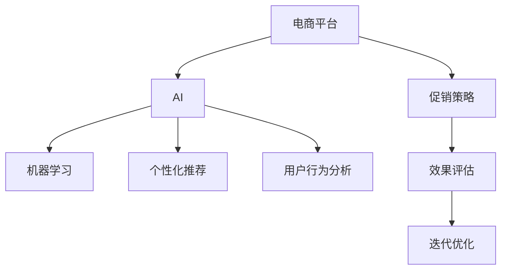

                 

# AI在电商平台促销策略中的应用

## 1. 背景介绍

### 1.1 问题由来
在当今的数字化时代，电商平台已经成为了消费者购物的主要渠道。为了吸引更多用户并提升销售额，平台纷纷采取各种促销策略，包括折扣、满减、赠品等。然而，传统的促销策略往往缺乏个性化和精准度，导致资源浪费和效果不佳。为此，电商平台开始引入AI技术，通过数据驱动的方式，实现更为精准和高效的促销策略制定。

### 1.2 问题核心关键点
AI在电商平台促销策略中的应用，核心在于利用数据挖掘、机器学习等技术手段，对用户行为进行分析和预测，从而制定个性化的促销策略。这种基于AI的促销策略能够提高转化率、提升用户体验、降低运营成本，是电商平台竞争力的重要体现。

### 1.3 问题研究意义
研究AI在电商平台促销策略中的应用，对于提升电商平台的用户粘性、优化营销效果、促进销售增长，具有重要意义。AI技术的引入，可以大幅提升促销策略的精准度和有效性，帮助电商平台在激烈的市场竞争中脱颖而出。

## 2. 核心概念与联系

### 2.1 核心概念概述

为更好地理解AI在电商平台促销策略中的应用，本节将介绍几个关键概念：

- AI：人工智能（Artificial Intelligence），是使计算机能够模拟人类智能行为的技术。
- 电商平台：通过互联网销售商品的电子平台，如淘宝、京东等。
- 促销策略：为提升销售和吸引用户，电商平台采取的各种策略，包括折扣、满减、赠品等。
- 机器学习：通过对数据的学习，使计算机系统能够改进自身性能，提高决策准确性的技术。
- 个性化推荐：根据用户的历史行为和兴趣，为其推荐符合其需求的商品和服务。
- 用户行为分析：通过分析用户的行为数据，了解其需求和偏好，从而制定更加精准的促销策略。

这些核心概念之间的逻辑关系可以通过以下Mermaid流程图来展示：



这个流程图展示了几者之间的内在联系：

1. 电商平台利用AI技术，通过机器学习和用户行为分析，制定个性化的促销策略。
2. 促销策略的实施效果通过效果评估得到反馈。
3. 根据评估结果，进行迭代优化，进一步提升促销策略的精准度和效果。

## 3. 核心算法原理 & 具体操作步骤
### 3.1 算法原理概述

AI在电商平台促销策略中的应用，本质上是一个有监督学习过程。其核心思想是：通过对用户行为数据的分析，挖掘用户需求和购买偏好，然后基于这些洞察，制定个性化的促销策略，并使用机器学习模型进行策略效果的预测和优化。

形式化地，假设电商平台的数据集为 $D=\{(x_i,y_i)\}_{i=1}^N$，其中 $x_i$ 为用户行为数据，如浏览记录、购物车商品、购买历史等，$y_i$ 为促销策略的效果，如点击率、转化率、销售额等。AI的目标是找到最优的促销策略 $p$，使得策略效果最大化：

$$
\mathop{\arg\max}_{p} \sum_{i=1}^N y_i \cdot \pi(x_i)
$$

其中 $\pi$ 为模型预测策略效果的概率分布。

### 3.2 算法步骤详解

AI在电商平台促销策略中的应用，一般包括以下几个关键步骤：

**Step 1: 数据收集与预处理**
- 收集用户的历史行为数据，如浏览、点击、购买等记录。
- 将数据进行清洗和标注，去除噪声和异常值，生成有意义的特征。

**Step 2: 用户行为分析**
- 通过聚类、分类等方法，对用户行为进行建模，提取用户的购买意向和需求。
- 使用协同过滤、内容推荐等技术，预测用户的购买行为。

**Step 3: 策略制定与评估**
- 基于用户行为分析的结果，制定个性化的促销策略，如针对高价值用户的折扣、针对低价值用户的满减等。
- 使用A/B测试等方法，评估促销策略的效果，对比不同策略的性能。

**Step 4: 迭代优化**
- 根据策略评估结果，调整和优化促销策略，如改变折扣幅度、修改满减条件等。
- 使用机器学习模型，对策略效果进行预测，并自动选择最佳策略。

**Step 5: 部署与监控**
- 将优化后的促销策略部署到电商平台中，实施效果监控。
- 定期更新模型参数，适应用户行为的变化，保持促销策略的持续优化。

### 3.3 算法优缺点

AI在电商平台促销策略中的应用，具有以下优点：
1. 提高促销精准度。通过用户行为分析，制定个性化的促销策略，提升转化率和销售额。
2. 提升用户体验。个性化推荐和动态调整策略，使得用户能够获得更好的购物体验。
3. 降低运营成本。精准的促销策略可以避免无效的资源浪费，提升运营效率。

同时，该方法也存在一些局限性：
1. 数据依赖性强。策略效果高度依赖于用户行为数据的准确性和完整性。
2. 模型复杂度高。需要构建和训练复杂的机器学习模型，成本较高。
3. 动态适应性差。用户的兴趣和需求会随时间变化，策略需要频繁调整，导致成本增加。

尽管存在这些局限性，但AI在电商平台促销策略中的应用，已经展示了其在提升销售和用户体验方面的巨大潜力。未来，相关技术的持续演进和优化，将进一步提升促销策略的精准度和效果。

### 3.4 算法应用领域

AI在电商平台促销策略中的应用，已经在多个领域得到了广泛的应用，例如：

- 个性化推荐：基于用户历史行为数据，推荐符合其需求的商品，提高用户购买意愿。
- 折扣策略：根据用户行为和价值，制定个性化的折扣优惠，吸引高价值用户。
- 满减条件：根据用户购买记录，动态调整满减门槛，提升用户消费积极性。
- 促销效果评估：使用机器学习模型，预测促销策略的效果，优化策略参数。
- 动态定价：根据市场供需和用户需求，实时调整商品价格，提升销售额。

除了上述这些经典应用外，AI技术还广泛应用于电商平台的库存管理、供应链优化、用户满意度分析等多个环节，为电商平台的运营提供了全面的技术支持。

## 4. 数学模型和公式 & 详细讲解 & 举例说明
### 4.1 数学模型构建

本节将使用数学语言对AI在电商平台促销策略中的应用进行更加严格的刻画。

假设用户行为数据为 $x \in \mathcal{X}$，促销策略为 $p \in \mathcal{P}$。模型预测策略效果的概率分布为 $P(y|x,p)$，则损失函数定义为：

$$
\mathcal{L}(p) = \mathbb{E}[\log P(y|x,p)]
$$

其中 $\mathbb{E}$ 为期望值，即平均损失。模型训练的目标是最小化损失函数，即：

$$
\mathop{\arg\min}_{p} \mathcal{L}(p)
$$

### 4.2 公式推导过程

以点击率预测为例，假设用户的点击行为可以用二元变量 $y$ 表示，模型的预测概率为 $p(y=1|x,p)$。点击率的损失函数可以表示为：

$$
\mathcal{L}(p) = -\frac{1}{N}\sum_{i=1}^N [y_i\log p(y_i=1|x_i,p)+(1-y_i)\log(1-p(y_i=1|x_i,p))]
$$

其中 $y_i \in \{0,1\}$ 为用户的实际点击行为。

为了得到最优的策略 $p$，需要对损失函数求导，并设置导数等于0：

$$
\frac{\partial \mathcal{L}(p)}{\partial p} = \frac{1}{N}\sum_{i=1}^N \frac{y_i}{p(y_i=1|x_i,p)} - \frac{1-y_i}{1-p(y_i=1|x_i,p)} = 0
$$

求解上述方程，可以得到最优策略的概率分布 $p$。

### 4.3 案例分析与讲解

假设某电商平台的历史数据如下：

- 用户行为数据：$x = (浏览记录, 购买历史, 点击行为)$
- 促销策略：$p = (折扣, 满减, 赠品)$
- 促销效果：$y = (点击率, 转化率, 销售额)$

对于一位用户 $u$，其行为数据 $x_u$ 和对应的促销策略 $p_u$，模型的预测概率为：

$$
P(y_u=1|x_u,p_u) = f(x_u;p_u)
$$

其中 $f$ 为模型函数，如线性回归、逻辑回归等。

根据预测概率，电商平台可以计算出每位用户的点击率、转化率等指标，然后基于这些指标，进行个性化的促销策略调整。例如，对于高点击率的商品，可以适当增加折扣幅度；对于低点击率的商品，可以优化其展示位置和策略。

## 5. 项目实践：代码实例和详细解释说明
### 5.1 开发环境搭建

在进行促销策略应用实践前，我们需要准备好开发环境。以下是使用Python进行项目开发的环境配置流程：

1. 安装Anaconda：从官网下载并安装Anaconda，用于创建独立的Python环境。

2. 创建并激活虚拟环境：
```bash
conda create -n promo-env python=3.8 
conda activate promo-env
```

3. 安装PyTorch：根据CUDA版本，从官网获取对应的安装命令。例如：
```bash
conda install pytorch torchvision torchaudio cudatoolkit=11.1 -c pytorch -c conda-forge
```

4. 安装TensorFlow：由Google主导开发的开源深度学习框架，生产部署方便，适合大规模工程应用。同样有丰富的预训练语言模型资源。

5. 安装相关库：
```bash
pip install pandas numpy sklearn tqdm jupyter notebook
```

完成上述步骤后，即可在`promo-env`环境中开始促销策略的实践。

### 5.2 源代码详细实现

下面我们以点击率预测为例，给出使用PyTorch进行促销策略优化的PyTorch代码实现。

首先，定义点击率预测的模型：

```python
import torch
import torch.nn as nn
import torch.optim as optim

class ClickRateModel(nn.Module):
    def __init__(self, input_size, hidden_size, output_size):
        super(ClickRateModel, self).__init__()
        self.fc1 = nn.Linear(input_size, hidden_size)
        self.fc2 = nn.Linear(hidden_size, output_size)
        self.sigmoid = nn.Sigmoid()

    def forward(self, x):
        x = self.fc1(x)
        x = torch.relu(x)
        x = self.fc2(x)
        x = self.sigmoid(x)
        return x
```

然后，定义损失函数和优化器：

```python
criterion = nn.BCELoss()
optimizer = optim.Adam(model.parameters(), lr=0.001)
```

接着，定义训练和评估函数：

```python
def train_epoch(model, data_loader, optimizer, criterion):
    model.train()
    running_loss = 0.0
    for batch_idx, (inputs, labels) in enumerate(data_loader):
        optimizer.zero_grad()
        inputs, labels = inputs.to(device), labels.to(device)
        outputs = model(inputs)
        loss = criterion(outputs, labels)
        loss.backward()
        optimizer.step()
        running_loss += loss.item()
    return running_loss / len(data_loader)

def evaluate(model, data_loader, criterion):
    model.eval()
    running_loss = 0.0
    for batch_idx, (inputs, labels) in enumerate(data_loader):
        inputs, labels = inputs.to(device), labels.to(device)
        outputs = model(inputs)
        loss = criterion(outputs, labels)
        running_loss += loss.item()
    return running_loss / len(data_loader)
```

最后，启动训练流程并在测试集上评估：

```python
epochs = 10
batch_size = 64

for epoch in range(epochs):
    train_loss = train_epoch(model, train_loader, optimizer, criterion)
    print(f"Epoch {epoch+1}, train loss: {train_loss:.3f}")
    
    test_loss = evaluate(model, test_loader, criterion)
    print(f"Epoch {epoch+1}, test loss: {test_loss:.3f}")
    
print("Training complete.")
```

以上就是使用PyTorch进行点击率预测的完整代码实现。可以看到，通过定义模型、损失函数、优化器等基本组件，并配合训练和评估函数，可以快速构建一个简单的点击率预测模型。

### 5.3 代码解读与分析

让我们再详细解读一下关键代码的实现细节：

**ClickRateModel类**：
- `__init__`方法：定义模型的网络结构，包括两个线性层和一个激活函数。
- `forward`方法：实现模型的前向传播过程，返回预测概率。

**criterion和optimizer**：
- `criterion`：定义交叉熵损失函数，用于计算预测概率与真实标签之间的差异。
- `optimizer`：定义Adam优化器，用于更新模型参数，以最小化损失函数。

**train_epoch和evaluate函数**：
- `train_epoch`函数：在训练集上，使用Adam优化器更新模型参数，最小化损失函数。
- `evaluate`函数：在测试集上，评估模型的预测效果，计算平均损失。

**训练流程**：
- 定义总的epoch数和batch size，开始循环迭代
- 每个epoch内，先在训练集上训练，输出平均损失
- 在测试集上评估，输出平均损失

可以看到，PyTorch框架提供了非常灵活和高效的模型构建和训练机制，开发者可以方便地实现各种深度学习模型和算法。

当然，工业级的系统实现还需考虑更多因素，如模型的保存和部署、超参数的自动搜索、更灵活的任务适配层等。但核心的促销策略优化方法基本与此类似。

## 6. 实际应用场景
### 6.1 智能推荐系统

基于AI的促销策略，可以广泛应用于智能推荐系统中。推荐系统通过分析用户的历史行为和兴趣，推荐符合其需求的商品，从而提高用户的点击率和购买率。

在技术实现上，可以收集用户的历史浏览、点击、购买等行为数据，使用协同过滤、内容推荐等技术，预测用户的购买行为。然后将预测结果输入到促销策略模型中，根据策略效果预测结果，调整和优化促销策略，使得推荐效果更加精准和有效。

### 6.2 动态定价策略

动态定价策略是指根据市场需求和用户行为，实时调整商品价格，提升销售额。AI技术可以实时分析市场供需情况和用户行为数据，预测价格调整对销售的影响，从而制定最优的价格策略。

具体而言，可以收集商品的历史销售数据、市场价格波动、竞争对手价格等信息，使用机器学习模型，预测不同价格区间对销售的响应效果。然后根据预测结果，动态调整商品价格，实现最优销售策略。

### 6.3 个性化营销活动

AI技术还可以用于设计个性化的营销活动，提升用户参与度和互动效果。例如，根据用户的年龄、性别、地域等特征，设计针对性的促销活动，使用个性化推荐技术，推送符合用户兴趣的广告和活动。

在技术实现上，可以收集用户的基本信息、历史行为、社交网络数据等，使用聚类和分类技术，划分用户群体。然后针对不同群体，设计个性化的营销活动，如优惠券、限时折扣等，并使用推荐系统，推送给目标用户。

### 6.4 未来应用展望

随着AI技术的不断进步，基于促销策略的智能推荐、动态定价、个性化营销等应用将进一步深化，带来更多的业务价值。

在智慧零售领域，智能推荐和动态定价技术将帮助电商平台提升用户体验和销售效率，实现更高的运营利润。

在智慧营销领域，AI技术将助力品牌商设计更精准、更高效的营销策略，提升广告投放的ROI，实现更强的市场竞争力。

此外，在智慧金融、智慧教育、智慧医疗等众多领域，AI技术也将得到广泛应用，为各行各业带来新的增长点和发展机会。相信随着技术的日益成熟，AI在电商平台促销策略中的应用将更加深入和广泛。

## 7. 工具和资源推荐
### 7.1 学习资源推荐

为了帮助开发者系统掌握AI在电商平台促销策略中的应用，这里推荐一些优质的学习资源：

1. 《深度学习与推荐系统》系列博文：深入浅出地介绍了深度学习在推荐系统中的应用，涵盖协同过滤、内容推荐、深度学习等前沿技术。

2. 《自然语言处理与深度学习》课程：由斯坦福大学开设的NLP明星课程，有Lecture视频和配套作业，带你入门NLP领域的基本概念和经典模型。

3. 《推荐系统实战》书籍：详细介绍了推荐系统的算法实现和应用案例，涵盖了协同过滤、矩阵分解、深度学习等技术。

4. TensorFlow官方文档：提供了丰富的机器学习模型和算法，并附有详细的API文档和使用示例，是学习深度学习的重要资源。

5. 《Python深度学习》书籍：由知名AI专家撰写，系统介绍了深度学习框架PyTorch和TensorFlow的实现和应用。

通过对这些资源的学习实践，相信你一定能够快速掌握AI在电商平台促销策略的应用方法，并用于解决实际的推荐和营销问题。

### 7.2 开发工具推荐

高效的开发离不开优秀的工具支持。以下是几款用于促销策略应用的常用工具：

1. PyTorch：基于Python的开源深度学习框架，灵活动态的计算图，适合快速迭代研究。大部分机器学习模型都有PyTorch版本的实现。

2. TensorFlow：由Google主导开发的开源深度学习框架，生产部署方便，适合大规模工程应用。同样有丰富的预训练语言模型资源。

3. Scikit-learn：基于Python的机器学习库，提供了简单易用的API和丰富的算法实现，是进行数据预处理和特征工程的重要工具。

4. Pandas：基于Python的数据处理库，支持高效的数据清洗、转换和分析，是数据科学和机器学习中的必备工具。

5. Jupyter Notebook：开源的交互式编程环境，支持代码编辑、运行和结果展示，是数据科学和机器学习项目开发的常用工具。

合理利用这些工具，可以显著提升促销策略应用的开发效率，加快创新迭代的步伐。

### 7.3 相关论文推荐

AI在电商平台促销策略的应用，已经在学术界和工业界得到了广泛的研究。以下是几篇奠基性的相关论文，推荐阅读：

1. Predicting Click-Through Rates in Recommendation Engines（点击率预测）：提出了基于深度学习的点击率预测模型，使用多层感知器等方法，提高了预测的准确性。

2. A Systematic Comparison of Collaborative Filtering Recommendation Systems（协同过滤推荐系统）：比较了基于协同过滤和内容推荐的推荐系统，并提出了改进的算法，提高了推荐的精度和多样性。

3. Multi-task Learning for Personalized Recommendation（个性化推荐中的多任务学习）：提出了多任务学习的方法，通过共享用户表示，提升了推荐系统的效果。

4. Interest-Aware Advertisement Prediction with Deep Learning（基于深度学习的广告预测）：使用深度学习模型，预测用户对广告的点击行为，实现了个性化的广告推荐。

5. Online Learning for Recommender Systems（在线学习推荐系统）：介绍了在线学习的方法，实时更新推荐模型，提升了推荐系统的鲁棒性和适应性。

这些论文代表了AI在电商平台促销策略应用的最新进展，通过学习这些前沿成果，可以帮助研究者把握学科前进方向，激发更多的创新灵感。

## 8. 总结：未来发展趋势与挑战
### 8.1 总结

本文对AI在电商平台促销策略中的应用进行了全面系统的介绍。首先阐述了AI在电商平台促销策略中的核心思想和关键技术，明确了其在提高促销精准度、提升用户体验、降低运营成本等方面的独特价值。其次，从原理到实践，详细讲解了促销策略的构建过程，包括数据收集、行为分析、策略制定、评估和优化等环节，给出了促销策略优化的完整代码实现。同时，本文还广泛探讨了AI技术在智能推荐、动态定价、个性化营销等电商应用场景中的广泛应用前景，展示了AI技术的强大潜力。

通过本文的系统梳理，可以看到，AI技术在电商平台促销策略中的应用已经逐步走向成熟，极大地提升了电商平台的运营效率和市场竞争力。未来，伴随AI技术的不断进步和优化，基于促销策略的智能推荐、动态定价、个性化营销等应用将更加深入和广泛，为电商平台的持续创新和优化提供强劲动力。

### 8.2 未来发展趋势

展望未来，AI在电商平台促销策略中的应用将呈现以下几个发展趋势：

1. 智能推荐系统：基于AI技术的智能推荐系统将进一步优化，能够更好地理解用户需求和偏好，提供更加精准的商品推荐。

2. 动态定价策略：实时分析市场供需和用户行为，制定最优的价格策略，提升销售效果。

3. 个性化营销活动：通过用户行为分析和聚类，设计个性化营销活动，提升用户参与度和互动效果。

4. 多模态数据融合：结合文本、图像、视频等多模态数据，提升推荐和定价的精准度。

5. 实时分析和预测：使用流式计算和大数据技术，实时分析用户行为和市场变化，快速调整促销策略。

6. 跨平台协作：不同平台间的协同推荐和定价，提升整体的用户体验和销售效果。

以上趋势凸显了AI在电商平台促销策略应用的广阔前景。这些方向的探索发展，将进一步提升推荐、定价和营销的精准度和效果，为电商平台的运营提供更加智能和高效的技术支撑。

### 8.3 面临的挑战

尽管AI在电商平台促销策略中的应用已经取得了显著成效，但在迈向更加智能化、普适化应用的过程中，仍面临诸多挑战：

1. 数据隐私和安全性：用户的购物行为数据涉及隐私问题，如何在保护用户隐私的前提下，实现数据的高效利用，是一个重要挑战。

2. 模型复杂性和效率：AI模型需要大量数据和计算资源进行训练和优化，如何平衡模型复杂性和计算效率，是一个长期的问题。

3. 动态适应性和稳定性：用户的兴趣和需求会随时间变化，如何设计动态调整的策略，保持系统的稳定性和持续优化，是一个重要挑战。

4. 算法的公平性和透明性：AI算法可能会存在偏见和歧视，如何设计和评估公平和透明的算法，确保推荐和定价的公正性，是一个重要挑战。

5. 跨平台协同问题：不同平台间的协同推荐和定价，可能会存在算法和数据不一致的问题，如何实现跨平台协同，是一个重要挑战。

这些挑战需要业界和学术界共同努力，持续探索和创新，才能使AI在电商平台促销策略中的应用真正落地并产生更大的价值。

### 8.4 研究展望

面对AI在电商平台促销策略应用中的诸多挑战，未来的研究需要在以下几个方面寻求新的突破：

1. 数据隐私保护技术：开发更加隐私友好的数据利用技术，如差分隐私、联邦学习等，保护用户隐私的同时，实现高效的数据分析。

2. 轻量化模型和高效计算：开发更加轻量化的模型，提高计算效率，如量化加速、模型压缩等技术，使得AI技术能够快速部署到移动端和边缘计算设备。

3. 动态自适应模型：设计能够动态调整的模型，适应用户兴趣和需求的变化，如强化学习、自适应模型等，保持系统的稳定性和持续优化。

4. 公平和透明的算法：开发更加公平和透明的算法，减少偏见和歧视，如可解释性算法、公平学习等技术，确保推荐和定价的公正性。

5. 跨平台协同推荐：设计跨平台协同的推荐和定价算法，实现不同平台间的协同推荐和定价，提升整体的用户体验和销售效果。

这些研究方向将引领AI在电商平台促销策略应用的进一步发展，为电商平台的持续创新和优化提供更加坚实的基础。总之，AI在电商平台促销策略中的应用，需要从数据、算法、工程、业务等多个维度协同发力，才能真正实现智能化、普适化的应用，为电商平台的运营带来更大的价值。

