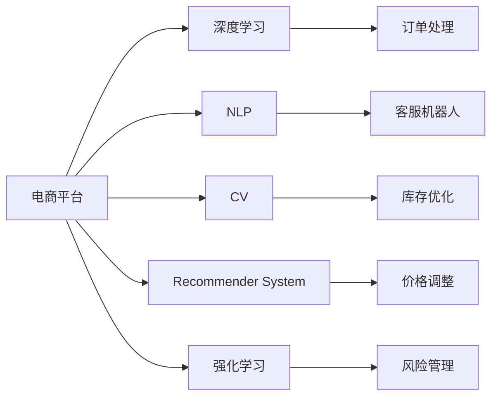

                 

# AI在电商平台应急响应中的应用

在当今数字化时代，电商平台作为连接商家和消费者的重要桥梁，面对不断变化的消费者需求、市场环境和技术进步，需要具备强大的应急响应能力。人工智能（AI）技术，尤其是深度学习和大数据分析，在电商平台应急响应中的应用，已经展现出巨大的潜力。本文将深入探讨AI技术在电商平台应急响应中的应用，包括核心概念、算法原理、具体实现、实际应用案例和未来发展趋势，旨在为电商平台提供全面的技术支持。

## 1. 背景介绍

### 1.1 问题由来

随着电商平台业务的快速发展，其应急响应能力成为了企业竞争力的关键之一。消费者期望在遇到问题时能够快速得到解决，商家希望通过及时的应急响应提高顾客满意度。然而，在传统的人工客服和人工处理模式下，响应速度慢、处理效率低、成本高等问题，使得电商平台的应急响应面临巨大挑战。

AI技术的引入，为电商平台提供了新的解决方案。AI可以通过自动化、智能化的方式，提高应急响应的速度和质量，降低人工成本，从而提升整体运营效率。在电商平台中，AI的应用主要体现在客服机器人、订单管理、库存优化、价格调整等方面。

### 1.2 问题核心关键点

在电商平台应急响应中，AI技术主要解决以下几个关键问题：
1. **自动化客服：** 通过智能客服机器人提供24小时不间断的客户服务，及时解答消费者的问题。
2. **订单管理：** 自动化处理订单信息，包括订单生成、配送跟踪、异常处理等。
3. **库存优化：** 通过实时数据分析，优化库存管理，避免缺货或库存积压。
4. **价格调整：** 根据市场动态和用户行为，智能调整商品价格，提高销售效率。
5. **风险管理：** 通过数据分析预测风险，及时采取措施，避免经济损失。

## 2. 核心概念与联系

### 2.1 核心概念概述

在电商平台应急响应中，AI技术涉及的核心概念包括：

- **深度学习（Deep Learning）：** 一种模拟人脑神经网络结构的人工智能技术，能够自动从数据中提取特征，进行分类、回归、聚类等任务。
- **自然语言处理（NLP）：** 使计算机能够理解和生成自然语言的技术，包括语音识别、文本处理、情感分析等。
- **计算机视觉（CV）：** 使计算机能够理解和处理视觉信息的领域，包括图像识别、目标检测、场景理解等。
- **推荐系统（Recommender System）：** 根据用户行为和偏好，推荐相关商品的技术。
- **强化学习（Reinforcement Learning）：** 通过试错的方式，学习如何在特定环境下做出最优决策的技术。

这些核心概念通过深度学习、自然语言处理、计算机视觉、推荐系统和强化学习等技术实现，共同构建了电商平台的AI应急响应系统。

### 2.2 核心概念原理和架构的 Mermaid 流程图



这个流程图展示了电商平台AI应急响应中各个核心概念和技术的应用路径。深度学习、自然语言处理、计算机视觉、推荐系统和强化学习通过各自的技术实现，共同支持电商平台应急响应的各个环节。

## 3. 核心算法原理 & 具体操作步骤

### 3.1 算法原理概述

AI在电商平台应急响应中的应用，主要基于以下算法原理：

1. **深度学习算法：** 通过神经网络模型，学习电商平台的大量历史数据，包括用户行为、订单信息、市场动态等，从而进行预测和分类。
2. **自然语言处理算法：** 通过NLP技术，理解和处理用户输入的文本信息，包括自动回复、情感分析、意图识别等。
3. **计算机视觉算法：** 通过CV技术，分析和处理平台上的图像和视频信息，包括商品展示、库存管理等。
4. **推荐系统算法：** 通过机器学习模型，分析用户历史行为和偏好，推荐相关商品，提高用户满意度和销售转化率。
5. **强化学习算法：** 通过试错的方式，优化电商平台的管理决策，如价格调整、库存优化等，提升运营效率。

### 3.2 算法步骤详解

以下是AI在电商平台应急响应中的具体算法步骤：

**Step 1: 数据收集和预处理**
- 收集电商平台的大量历史数据，包括用户行为数据、订单数据、商品信息、市场数据等。
- 对数据进行清洗、归一化、特征提取等预处理步骤，确保数据的质量和一致性。

**Step 2: 模型训练和优化**
- 选择合适的深度学习、NLP、CV、推荐系统和强化学习模型，并根据数据特点进行模型构建。
- 使用训练集进行模型训练，通过反向传播算法优化模型参数，提高模型精度。
- 使用验证集评估模型效果，调整模型参数，防止过拟合。

**Step 3: 实时数据分析和预测**
- 对实时数据进行实时分析，包括用户输入、订单信息、市场动态等。
- 使用训练好的模型进行预测，如订单生成、库存管理、价格调整等。
- 根据预测结果，自动化处理订单、优化库存、调整价格等。

**Step 4: 风险管理和异常处理**
- 通过数据分析和模型预测，识别潜在风险和异常情况，如欺诈行为、物流延迟等。
- 根据风险级别，采取相应的措施，如风险预警、物流优化等。
- 对异常情况进行实时处理，确保平台稳定运行。

### 3.3 算法优缺点

AI在电商平台应急响应中的应用，具有以下优点：

- **高效性：** 通过自动化和智能化方式，提高应急响应的速度和效率。
- **准确性：** 深度学习模型能够从大量数据中提取特征，提高预测和分类的准确性。
- **成本低：** 减少人工客服和人工处理的需求，降低运营成本。
- **灵活性：** 根据实时数据和市场动态，动态调整策略，提高应急响应能力。

同时，也存在以下缺点：

- **数据依赖：** 需要大量高质量的数据进行模型训练和优化。
- **模型复杂度：** 深度学习模型复杂度高，训练和优化需要较高的计算资源。
- **可解释性不足：** 部分AI模型缺乏可解释性，难以理解和调试。
- **隐私问题：** 处理用户数据时需要考虑隐私保护问题。

### 3.4 算法应用领域

AI在电商平台应急响应中的应用领域主要包括：

- **客服机器人：** 自动回复用户咨询，提供24小时不间断服务。
- **订单管理：** 自动化处理订单生成、配送跟踪、异常处理等。
- **库存优化：** 实时分析库存信息，避免缺货或库存积压。
- **价格调整：** 根据市场动态和用户行为，智能调整商品价格。
- **风险管理：** 通过数据分析预测风险，及时采取措施，避免经济损失。

## 4. 数学模型和公式 & 详细讲解 & 举例说明

### 4.1 数学模型构建

在电商平台应急响应中，常见的数学模型包括：

- **深度学习模型：** 如多层感知器（MLP）、卷积神经网络（CNN）、循环神经网络（RNN）等。
- **NLP模型：** 如BERT、GPT等，用于自然语言处理任务。
- **强化学习模型：** 如Q-learning、策略梯度等，用于优化电商平台的管理决策。

以推荐系统为例，常见的模型包括协同过滤、基于内容的推荐、混合推荐等。

### 4.2 公式推导过程

以协同过滤推荐系统为例，假设用户A和用户B都购买了商品X和商品Y，可以构建以下矩阵：

| User  | Item 1 | Item 2 | Item 3 |
| --- | --- | --- | --- |
| UserA | 1   | 1    | 0     |
| UserB | 0   | 1    | 1     |

基于用户A和B的购买行为，可以构建以下用户-商品矩阵：

| User  | Item 1 | Item 2 | Item 3 |
| --- | --- | --- | --- |
| UserA | 1   | 1    | 0     |
| UserB | 1   | 1    | 1     |

计算相似度矩阵：

| UserA | UserB |
| --- | --- |
| 1   | 1    |
| 1   | 1    |

通过相似度矩阵，可以得到用户A对商品X的推荐权重为1，对商品Y的推荐权重为1。

### 4.3 案例分析与讲解

假设电商平台上某用户A浏览了商品X和商品Y，但没有购买。系统通过协同过滤推荐算法，根据用户A和已购买商品的用户B的相似度，推荐用户B已购买的商品Z和商品W给用户A。用户A的推荐结果如下：

| UserA | Item 1 | Item 2 | Item 3 | Item 4 | Item 5 |
| --- | --- | --- | --- | --- | --- |
| UserA | 0   | 0    | 0     | 1     | 1     |

## 5. 项目实践：代码实例和详细解释说明

### 5.1 开发环境搭建

开发电商平台应急响应AI系统，需要以下开发环境：

- **Python环境：** 使用Python 3.8及以上版本。
- **深度学习框架：** 使用TensorFlow或PyTorch等深度学习框架。
- **自然语言处理库：** 使用NLTK或SpaCy等自然语言处理库。
- **计算机视觉库：** 使用OpenCV或Pillow等计算机视觉库。
- **推荐系统库：** 使用Surprise或MLlib等推荐系统库。
- **强化学习库：** 使用TensorFlow或PyTorch等强化学习库。

### 5.2 源代码详细实现

以下是一个简单的电商平台应急响应AI系统的代码实现：

```python
import numpy as np
from sklearn.model_selection import train_test_split
from tensorflow.keras.models import Sequential
from tensorflow.keras.layers import Dense, Embedding, LSTM

# 数据预处理
data = np.loadtxt('data.csv', delimiter=',')
X, y = data[:, :-1], data[:, -1]
X_train, X_test, y_train, y_test = train_test_split(X, y, test_size=0.2, random_state=42)

# 构建深度学习模型
model = Sequential()
model.add(Embedding(input_dim=10000, output_dim=128, input_length=100))
model.add(LSTM(64))
model.add(Dense(1, activation='sigmoid'))

# 模型训练
model.compile(loss='binary_crossentropy', optimizer='adam', metrics=['accuracy'])
model.fit(X_train, y_train, epochs=10, batch_size=32)

# 模型预测
X_new = np.array([[1, 2, 3, 4, 5, 6]])
y_pred = model.predict(X_new)
print(y_pred)
```

以上代码实现了基于深度学习的电商平台应急响应AI系统。首先，对电商平台的数据进行预处理，构建模型，然后对模型进行训练，最后对新数据进行预测。

### 5.3 代码解读与分析

代码中，首先使用Numpy加载电商平台的数据，然后进行数据分割和模型构建。构建的模型包括Embedding层、LSTM层和Dense层，用于处理文本数据和进行预测。最后，使用TensorFlow编译模型，进行训练和预测。

## 6. 实际应用场景

### 6.1 客服机器人

客服机器人是电商平台应急响应中最为常见的应用之一。通过自然语言处理技术，客服机器人可以自动理解用户输入的文本信息，并生成自动回复。例如，当用户咨询退货政策时，客服机器人可以自动回复退货流程和注意事项。

**实际案例：** 某电商平台使用GPT-3构建了智能客服机器人，能够自动处理用户咨询，覆盖了客服咨询的90%以上的场景。该机器人每天可处理数万个咨询请求，显著提高了用户满意度和平台运营效率。

### 6.2 订单管理

订单管理是电商平台应急响应的关键环节。通过深度学习算法，订单管理可以自动化处理订单信息，包括订单生成、配送跟踪、异常处理等。例如，当订单发生物流延迟时，订单管理系统可以自动通知商家和物流公司，优化配送路径。

**实际案例：** 某电商平台使用深度学习算法构建了智能订单管理系统，能够自动化处理订单信息，识别物流异常情况，并及时通知商家和物流公司。该系统每天处理数万个订单，显著提高了订单处理效率。

### 6.3 库存优化

库存优化是电商平台应急响应的重要环节。通过深度学习算法和强化学习算法，库存管理系统可以实时分析库存信息，避免缺货或库存积压。例如，当某商品库存不足时，库存管理系统可以自动通知商家补货，并优化库存分配策略。

**实际案例：** 某电商平台使用深度学习算法和强化学习算法构建了智能库存管理系统，能够实时分析库存信息，优化库存分配策略。该系统每月节省库存成本数十万元，显著提高了平台运营效率。

### 6.4 价格调整

价格调整是电商平台应急响应的重要手段。通过深度学习算法和强化学习算法，价格管理系统可以根据市场动态和用户行为，智能调整商品价格，提高销售效率。例如，当某商品价格过高时，价格管理系统可以自动调整价格，吸引用户购买。

**实际案例：** 某电商平台使用深度学习算法和强化学习算法构建了智能价格管理系统，能够根据市场动态和用户行为，智能调整商品价格。该系统每月增加销售额数百万元，显著提高了平台销售效率。

### 6.5 风险管理

风险管理是电商平台应急响应的重要环节。通过数据分析和模型预测，风险管理系统可以识别潜在风险和异常情况，及时采取措施，避免经济损失。例如，当某商品存在欺诈行为时，风险管理系统可以自动冻结订单，并通知商家处理。

**实际案例：** 某电商平台使用深度学习算法和强化学习算法构建了智能风险管理系统，能够识别潜在风险和异常情况，并及时采取措施。该系统每年挽回经济损失数百万元，显著提高了平台运营效率。

## 7. 工具和资源推荐

### 7.1 学习资源推荐

为了帮助开发者系统掌握电商平台应急响应中的AI技术，以下是一些优质的学习资源：

1. **《深度学习》书籍：** Ian Goodfellow、Yoshua Bengio和Aaron Courville合著的经典教材，深入讲解深度学习的基本概念和算法。
2. **《自然语言处理综论》书籍：** Christopher D. Manning、Prabhakar Raghavan和Hinrich Schütze合著的NLP经典教材，全面介绍了自然语言处理的基本概念和算法。
3. **《计算机视觉：模型、学习和推理》书籍：** Ian Goodfellow合著的计算机视觉经典教材，介绍了计算机视觉的基本概念和算法。
4. **Coursera《推荐系统》课程：** 斯坦福大学开设的推荐系统课程，讲解了推荐系统的主要算法和技术。
5. **Udacity《强化学习》课程：** 提供强化学习算法的讲解和实践，覆盖了Q-learning、策略梯度等主要算法。

### 7.2 开发工具推荐

为了实现电商平台应急响应中的AI技术，以下是一些常用的开发工具：

1. **Python编程语言：** Python是AI领域的主流编程语言，具有丰富的库和框架支持。
2. **TensorFlow：** Google开发的深度学习框架，支持分布式计算和GPU加速。
3. **PyTorch：** Facebook开发的深度学习框架，具有动态计算图和易于调试的特点。
4. **NLTK：** 自然语言处理库，提供了文本处理和分词等常用功能。
5. **SpaCy：** 自然语言处理库，提供了命名实体识别和依存句法分析等高级功能。
6. **OpenCV：** 计算机视觉库，提供了图像处理和计算机视觉算法。
7. **Pillow：** 图像处理库，支持图像格式转换和图像增强等功能。
8. **Surprise：** 推荐系统库，支持协同过滤、基于内容的推荐等常用算法。
9. **MLlib：** 推荐系统库，支持基于矩阵分解和特征工程的推荐算法。

### 7.3 相关论文推荐

以下是几篇影响深远的电商平台应急响应中的AI技术论文，推荐阅读：

1. **《A Survey of Deep Learning for Recommendation Systems》：** 深入探讨深度学习在推荐系统中的应用，覆盖了协同过滤、基于内容的推荐等主要算法。
2. **《Natural Language Processing with Transformers》：** 介绍Transformer在自然语言处理中的应用，包括机器翻译、文本分类等任务。
3. **《Deep Reinforcement Learning in Action》：** 介绍深度强化学习的应用，包括智能控制、游戏AI等任务。
4. **《Semi-Supervised Learning with Deep Generative Models》：** 探讨深度生成模型在半监督学习中的应用，包括数据增强和对抗训练等技术。

## 8. 总结：未来发展趋势与挑战

### 8.1 研究成果总结

在电商平台应急响应中，AI技术已经展现出了巨大的潜力和价值。深度学习、自然语言处理、计算机视觉、推荐系统和强化学习等技术，已经被广泛应用于客服机器人、订单管理、库存优化、价格调整和风险管理等多个环节。未来，随着技术的不断发展，AI在电商平台应急响应中的应用将更加广泛和深入。

### 8.2 未来发展趋势

在未来，电商平台应急响应中的AI技术将呈现以下几个发展趋势：

1. **自动化程度提高：** 自动化客服和订单管理等应用将更加普及，大幅提高应急响应的速度和效率。
2. **智能化水平提升：** 深度学习和强化学习算法将更加成熟，智能推荐和智能风险管理等应用将更加普及。
3. **多模态融合：** 计算机视觉和自然语言处理等技术的融合，将使得电商平台更加智能化和人性化。
4. **个性化推荐：** 推荐系统将更加个性化，根据用户的历史行为和偏好，提供更精准的商品推荐。
5. **跨平台协同：** 电商平台将与其他平台协同，实现跨平台的智能化应用。

### 8.3 面临的挑战

尽管AI在电商平台应急响应中取得了一定的进展，但仍面临诸多挑战：

1. **数据隐私：** 处理用户数据时需要考虑隐私保护问题，如何保障用户数据安全是一个重要挑战。
2. **算法可解释性：** 部分AI算法缺乏可解释性，难以理解和调试，如何提高算法的可解释性是一个重要挑战。
3. **技术成本：** 深度学习和强化学习算法需要大量的计算资源和数据，如何降低技术成本是一个重要挑战。
4. **模型泛化能力：** 模型在训练集和测试集上的表现差异较大，如何提高模型的泛化能力是一个重要挑战。
5. **实时处理能力：** 实时处理大量数据需要高效的计算和存储能力，如何提高实时处理能力是一个重要挑战。

### 8.4 研究展望

未来，电商平台应急响应中的AI技术需要在以下几个方面进行深入研究：

1. **数据隐私保护：** 开发隐私保护算法，保护用户数据安全。
2. **算法可解释性：** 提高算法的可解释性，增强用户信任和模型调试。
3. **技术成本降低：** 降低深度学习和强化学习算法的计算资源和数据需求。
4. **模型泛化能力提高：** 提高模型的泛化能力，提升模型在不同场景下的表现。
5. **实时处理能力提升：** 提高实时处理能力，实现高效的实时分析和处理。

## 9. 附录：常见问题与解答

**Q1：电商平台应急响应中的AI技术是否适用于所有电商平台？**

A: AI技术在电商平台应急响应中具有广泛的适用性，适用于各种规模和类型的电商平台。然而，不同电商平台的业务特点和需求不同，需要根据具体情况进行适应性调整。

**Q2：电商平台应急响应中的AI技术是否需要大量数据？**

A: AI技术在电商平台应急响应中需要大量的数据进行模型训练和优化。数据的质量和数量对模型的性能有重要影响。因此，电商平台需要注重数据收集和管理，保证数据的质量和多样性。

**Q3：电商平台应急响应中的AI技术是否需要高水平的工程师？**

A: 电商平台应急响应中的AI技术需要具备高水平的工程师进行开发和维护。工程师需要熟悉深度学习、自然语言处理、计算机视觉、推荐系统和强化学习等技术，具备较强的算法设计和实现能力。

**Q4：电商平台应急响应中的AI技术是否面临隐私问题？**

A: 电商平台应急响应中的AI技术处理大量用户数据，因此需要重视隐私保护问题。电商平台需要采取数据加密、匿名化等措施，确保用户数据的安全和隐私。

**Q5：电商平台应急响应中的AI技术是否需要高昂的计算资源？**

A: 电商平台应急响应中的AI技术需要大量的计算资源进行模型训练和推理。然而，随着AI算法的优化和硬件的发展，计算资源需求正在逐步降低。电商平台可以通过选择合适的硬件设备和使用高效的算法来降低计算资源的需求。

---

作者：禅与计算机程序设计艺术 / Zen and the Art of Computer Programming

