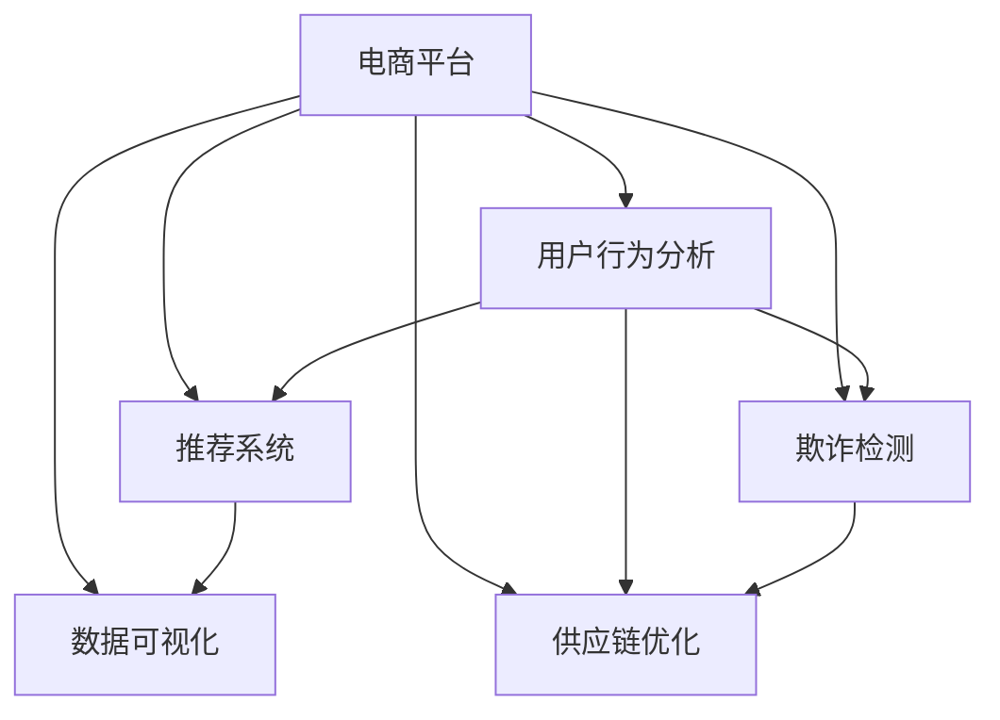

                 

# AI在电商平台数据分析中的具体应用

> 关键词：AI数据分析,电商平台,用户行为分析,推荐系统,数据可视化

## 1. 背景介绍

### 1.1 问题由来
随着电子商务的迅猛发展，电商平台已经成为了人们日常生活中不可或缺的一部分。为了提升用户体验、优化商品推荐、增强市场竞争力，电商平台越来越依赖于先进的数据分析技术。AI在数据分析中的应用，尤其是在电商平台，正在变得越来越重要。通过利用AI技术，电商平台可以更好地理解用户需求、优化供应链管理、提升运营效率，从而在激烈的市场竞争中脱颖而出。

### 1.2 问题核心关键点
AI在电商平台数据分析中的核心关键点包括以下几个方面：

- **用户行为分析**：通过分析用户行为数据，电商平台可以了解用户的购物习惯、偏好、需求等，从而进行个性化推荐。
- **推荐系统**：利用机器学习算法，电商平台能够提供精准的商品推荐，提高用户满意度和转化率。
- **数据可视化**：将复杂的数据转换为直观的图表，便于电商平台的决策者快速理解数据背后的趋势和规律。
- **供应链优化**：通过AI技术对供应链进行数据分析，电商平台可以优化库存管理、提高物流效率。
- **欺诈检测**：利用AI技术检测和预防电商平台的欺诈行为，保障交易安全。

这些关键点共同构成了AI在电商平台数据分析中的核心应用场景，帮助电商平台实现智能化转型，提升运营效率和市场竞争力。

## 2. 核心概念与联系

### 2.1 核心概念概述

为了更好地理解AI在电商平台数据分析中的应用，我们首先需要介绍一些核心概念：

- **AI（人工智能）**：通过机器学习、深度学习等技术，实现对数据的自动化处理和智能决策。
- **电商平台**：指利用互联网技术，通过电子方式进行的商品销售和服务的平台。
- **用户行为分析**：通过对用户行为数据进行分析，了解用户需求和偏好，进行个性化推荐。
- **推荐系统**：基于机器学习算法，为用户提供个性化商品推荐，提升用户满意度和转化率。
- **数据可视化**：将复杂的数据通过图表、仪表盘等形式展示，便于决策者理解数据背后的规律和趋势。
- **供应链优化**：利用AI技术对供应链进行优化，提高库存管理和物流效率。
- **欺诈检测**：利用AI技术检测和预防电商平台上的欺诈行为，保障交易安全。

这些概念之间的联系可以通过以下Mermaid流程图来展示：



这个流程图展示了AI在电商平台数据分析中的核心应用流程：

1. 电商平台收集用户行为数据。
2. 利用AI技术对用户行为进行分析，得到用户偏好和需求。
3. 通过推荐系统，为用户提供个性化商品推荐。
4. 数据可视化工具对推荐系统的结果进行展示，帮助决策者理解。
5. 利用AI技术对供应链进行优化，提升物流效率。
6. 通过欺诈检测系统，保障平台交易安全。

## 3. 核心算法原理 & 具体操作步骤
### 3.1 算法原理概述

AI在电商平台数据分析中，主要利用了机器学习和深度学习技术。通过分析用户行为数据、商品销售数据、市场环境数据等，AI算法能够预测用户行为、优化推荐系统、提高供应链效率、检测欺诈行为等。

AI在电商平台数据分析中的算法原理包括以下几个方面：

- **用户行为分析**：通过时间序列分析、聚类算法、关联规则挖掘等技术，分析用户行为数据，提取用户特征和行为模式。
- **推荐系统**：利用协同过滤、内容推荐、深度学习等技术，构建推荐模型，为用户提供个性化推荐。
- **数据可视化**：通过可视化技术，如数据透视表、散点图、热力图等，将复杂数据转换为直观图表，便于决策者理解。
- **供应链优化**：利用时间序列预测、线性规划等技术，对供应链进行优化，提高库存管理和物流效率。
- **欺诈检测**：通过异常检测、分类算法等技术，检测和预防电商平台的欺诈行为，保障交易安全。

### 3.2 算法步骤详解

以下是AI在电商平台数据分析中的核心算法步骤：

**Step 1: 数据收集与预处理**

1. **数据收集**：电商平台需要收集用户行为数据、商品销售数据、市场环境数据等，构建数据集。数据集应包括用户ID、商品ID、交易时间、交易金额、用户评分等。

2. **数据清洗**：对收集到的数据进行清洗，处理缺失值、异常值和重复数据，确保数据质量和完整性。

**Step 2: 特征工程**

1. **特征提取**：根据业务需求，从原始数据中提取有用的特征。例如，用户ID、商品ID、交易时间、交易金额、用户评分、用户购买频率等。

2. **特征选择**：利用特征选择算法，如卡方检验、L1正则化等，选择对目标变量影响较大的特征。

**Step 3: 模型训练**

1. **用户行为分析**：利用时间序列分析、聚类算法、关联规则挖掘等技术，训练用户行为分析模型。例如，时间序列分析中的ARIMA模型，聚类算法中的K-Means算法，关联规则挖掘中的Apriori算法。

2. **推荐系统**：利用协同过滤、内容推荐、深度学习等技术，训练推荐系统模型。例如，协同过滤中的用户基推荐和物品基推荐，内容推荐中的基于内容的推荐，深度学习中的神经网络模型。

3. **数据可视化**：利用数据可视化工具，如Tableau、Power BI等，将数据转换为直观的图表，进行展示和分析。

4. **供应链优化**：利用时间序列预测、线性规划等技术，优化供应链管理。例如，时间序列预测中的ARIMA模型，线性规划中的线性规划算法。

5. **欺诈检测**：利用异常检测、分类算法等技术，检测和预防欺诈行为。例如，异常检测中的孤立森林算法，分类算法中的支持向量机（SVM）算法。

**Step 4: 模型评估与优化**

1. **模型评估**：利用评估指标，如准确率、召回率、F1分数、AUC等，评估模型性能。例如，用户行为分析中的平均绝对误差（MAE），推荐系统中的准确率（Precision）和召回率（Recall）。

2. **模型优化**：根据评估结果，对模型进行优化。例如，通过调整超参数、增加特征、改进算法等，提高模型性能。

**Step 5: 模型部署与应用**

1. **模型部署**：将训练好的模型部署到电商平台，进行实时分析和预测。

2. **应用场景**：在用户行为分析、推荐系统、数据可视化、供应链优化、欺诈检测等场景中应用AI模型，提升平台运营效率和用户体验。

### 3.3 算法优缺点

AI在电商平台数据分析中的算法优点包括以下几个方面：

- **精度高**：AI算法能够准确地预测用户行为、优化推荐系统、提高供应链效率、检测欺诈行为等。
- **自动化**：AI算法能够自动地进行数据收集、特征提取、模型训练、模型评估和模型优化，减少人工干预。
- **灵活性高**：AI算法可以根据业务需求进行调整和优化，灵活性强。

AI在电商平台数据分析中的算法缺点包括以下几个方面：

- **计算资源需求高**：AI算法需要大量的计算资源进行模型训练和预测，对硬件设备要求较高。
- **数据质量要求高**：AI算法对数据质量和完整性要求较高，数据收集和清洗过程较为复杂。
- **模型解释性不足**：AI算法通常被认为是"黑盒"模型，难以解释其决策过程。

### 3.4 算法应用领域

AI在电商平台数据分析中的应用领域包括以下几个方面：

- **用户行为分析**：通过分析用户行为数据，了解用户需求和偏好，进行个性化推荐。
- **推荐系统**：利用机器学习算法，为用户提供个性化商品推荐，提升用户满意度和转化率。
- **数据可视化**：将复杂的数据通过图表、仪表盘等形式展示，便于决策者理解。
- **供应链优化**：利用AI技术对供应链进行优化，提高库存管理和物流效率。
- **欺诈检测**：利用AI技术检测和预防电商平台的欺诈行为，保障交易安全。

## 4. 数学模型和公式 & 详细讲解  
### 4.1 数学模型构建

在本节中，我们将使用数学语言对AI在电商平台数据分析中的应用进行更加严格的刻画。

设电商平台的用户行为数据为 $D=\{(x_i,y_i)\}_{i=1}^N, x_i \in \mathbb{R}^d, y_i \in \mathbb{R}$，其中 $x_i$ 为用户行为特征向量，$y_i$ 为目标变量。

**用户行为分析**：

- 时间序列分析模型：
$$
\hat{y}_t = \sum_{k=1}^K \alpha_k y_{t-k} + \sum_{k=1}^K \beta_k \epsilon_{t-k}
$$
其中，$y_t$ 为用户行为数据在时间 $t$ 的预测值，$\alpha_k$ 和 $\beta_k$ 为模型的参数，$\epsilon_t$ 为随机误差。

- 聚类算法：
$$
\min_{\mu_k} \sum_{i=1}^N \sum_{k=1}^K d(x_i,\mu_k)^2
$$
其中，$\mu_k$ 为聚类中心，$d(x_i,\mu_k)$ 为距离度量。

- 关联规则挖掘：
$$
\min_{I} \text{support}(\lbrace I \rbrace) \geq \text{min\_supp}
$$
其中，$I$ 为关联规则，$\text{support}(\lbrace I \rbrace)$ 为规则 $I$ 的支持度，$\text{min\_supp}$ 为最小支持度阈值。

**推荐系统**：

- 协同过滤算法：
$$
\hat{r}_{ui} = \frac{\sum_{v=1}^M \hat{r}_{vi} \times i_v}{\sqrt{\sum_{v=1}^M i_v^2}} = \frac{\sum_{v=1}^M r_{uv} \times u_v}{\sqrt{\sum_{v=1}^M r_{uv}^2}}
$$
其中，$r_{uv}$ 为用户 $u$ 对物品 $v$ 的评分，$\hat{r}_{ui}$ 为用户 $u$ 对物品 $i$ 的预测评分。

- 内容推荐算法：
$$
\hat{r}_{ui} = \sum_{j=1}^d a_j \times x_{uij} \times x_{vij}^T
$$
其中，$a_j$ 为物品特征向量，$x_{uij}$ 为用户物品交互矩阵，$x_{vij}$ 为物品特征矩阵。

- 深度学习算法：
$$
\hat{y}_i = \text{softmax}(W^T \times \text{relu}(V \times x_i + b) + b')
$$
其中，$W$ 和 $V$ 为模型的参数，$\text{relu}$ 为激活函数，$\text{softmax}$ 为激活函数。

**数据可视化**：

- 散点图：
$$
(x_i,y_i) \in \mathbb{R}^d \times \mathbb{R}, i=1,...,N
$$
其中，$x_i$ 为数据点坐标，$y_i$ 为数据点值。

- 热力图：
$$
H_{ij} = \frac{\sum_{k=1}^N x_{ik} \times x_{jk}}{N}
$$
其中，$x_{ik}$ 为数据点 $i$ 在特征 $k$ 上的值，$x_{jk}$ 为数据点 $j$ 在特征 $k$ 上的值，$N$ 为数据点数量。

- 数据透视表：
$$
\text{Pivot}(x,y) = \frac{\sum_{i=1}^N \sum_{j=1}^M x_{ij} \times y_j}{\sum_{j=1}^M y_j}
$$
其中，$x_{ij}$ 为数据点 $i$ 在特征 $j$ 上的值，$y_j$ 为特征 $j$ 的值。

**供应链优化**：

- 时间序列预测：
$$
\hat{y}_t = \sum_{k=1}^K \alpha_k y_{t-k} + \sum_{k=1}^K \beta_k \epsilon_{t-k}
$$
其中，$y_t$ 为用户行为数据在时间 $t$ 的预测值，$\alpha_k$ 和 $\beta_k$ 为模型的参数，$\epsilon_t$ 为随机误差。

- 线性规划：
$$
\min_{x} c^T \times x \\
\text{s.t.} \\
A \times x = b \\
x \geq 0
$$
其中，$x$ 为决策变量，$c$ 为目标函数系数，$A$ 为约束条件系数矩阵，$b$ 为约束条件右侧常数向量。

**欺诈检测**：

- 孤立森林算法：
$$
\text{If}\ (z < \text{median}(z)) \ \text{then}\ (\text{move left}) \ \text{else}\ (\text{move right})
$$
其中，$z$ 为数据点值，$\text{median}(z)$ 为数据点中值。

- 支持向量机算法：
$$
\min_{w,b,\Omega} \frac{1}{2} ||w||^2 + C \times \sum_{i=1}^N \text{max}(0, 1 - y_i \times (w \times x_i + b)) \\
\text{s.t.} \\
\Omega = \{(x_i, y_i) | y_i \times (w \times x_i + b) \geq 1, i=1,...,N\}
$$
其中，$w$ 为权重向量，$b$ 为偏置项，$\Omega$ 为支持向量，$C$ 为正则化参数。

### 4.2 公式推导过程

以下我们以推荐系统中的协同过滤算法为例，推导公式的推导过程。

设用户 $u$ 对物品 $i$ 的评分矩阵为 $R_{ui} \in \mathbb{R}^{U \times M}$，用户 $u$ 对物品 $i$ 的评分向量为 $r_u \in \mathbb{R}^{M \times 1}$。设物品 $v$ 对物品 $i$ 的评分向量为 $r_v \in \mathbb{R}^{M \times 1}$，用户 $u$ 对物品 $v$ 的评分向量为 $r_u \in \mathbb{R}^{M \times 1}$。

设物品 $i$ 的评分向量为 $i_v \in \mathbb{R}^{U \times 1}$，用户 $u$ 的评分向量为 $u_i \in \mathbb{R}^{U \times 1}$。协同过滤算法可以通过矩阵分解求解，得到预测评分 $\hat{r}_{ui}$：

$$
\hat{r}_{ui} = \frac{\sum_{v=1}^M \hat{r}_{vi} \times i_v}{\sqrt{\sum_{v=1}^M i_v^2}} = \frac{\sum_{v=1}^M r_{uv} \times u_v}{\sqrt{\sum_{v=1}^M r_{uv}^2}}
$$

其中，$r_{uv}$ 为用户 $u$ 对物品 $v$ 的评分，$\hat{r}_{vi}$ 为用户 $v$ 对物品 $i$ 的预测评分，$i_v$ 为物品 $v$ 的评分向量，$u_v$ 为用户 $v$ 的评分向量。

### 4.3 案例分析与讲解

下面我们以电商平台中的个性化推荐系统为例，进行详细的案例分析与讲解。

**案例背景**：某电商平台收集了大量用户行为数据，包括用户ID、商品ID、购买时间、购买金额等。希望利用AI技术，为用户推荐个性化商品，提升用户满意度和转化率。

**数据收集与预处理**：

1. **数据收集**：从电商平台的数据库中提取用户行为数据，包括用户ID、商品ID、购买时间、购买金额等。

2. **数据清洗**：处理缺失值和异常值，确保数据质量和完整性。例如，用户ID缺失时，可以通过IP地址等特征进行补齐。

**特征工程**：

1. **特征提取**：提取有用的特征，如用户ID、商品ID、购买时间、购买金额、用户评分等。

2. **特征选择**：选择对目标变量影响较大的特征，如购买时间、购买金额、用户评分等。

**模型训练**：

1. **协同过滤算法**：利用协同过滤算法，训练推荐模型。例如，利用用户基推荐算法，将用户ID和商品ID作为输入，输出物品ID的预测评分。

2. **内容推荐算法**：利用内容推荐算法，训练推荐模型。例如，利用基于内容的推荐算法，将商品描述作为输入，输出物品ID的预测评分。

3. **深度学习算法**：利用深度学习算法，训练推荐模型。例如，利用神经网络模型，将用户行为数据和商品数据作为输入，输出物品ID的预测评分。

**模型评估与优化**：

1. **模型评估**：利用评估指标，如准确率、召回率、F1分数、AUC等，评估模型性能。例如，利用准确率（Precision）和召回率（Recall）评估推荐系统的效果。

2. **模型优化**：根据评估结果，对模型进行优化。例如，通过调整超参数、增加特征、改进算法等，提高模型性能。

**模型部署与应用**：

1. **模型部署**：将训练好的模型部署到电商平台，进行实时分析和预测。

2. **应用场景**：在个性化推荐系统中应用AI模型，提升用户满意度和转化率。

## 5. 项目实践：代码实例和详细解释说明
### 5.1 开发环境搭建

在进行AI在电商平台数据分析的项目实践前，我们需要准备好开发环境。以下是使用Python进行PyTorch开发的环境配置流程：

1. 安装Anaconda：从官网下载并安装Anaconda，用于创建独立的Python环境。

2. 创建并激活虚拟环境：
```bash
conda create -n pytorch-env python=3.8 
conda activate pytorch-env
```

3. 安装PyTorch：根据CUDA版本，从官网获取对应的安装命令。例如：
```bash
conda install pytorch torchvision torchaudio cudatoolkit=11.1 -c pytorch -c conda-forge
```

4. 安装Transformers库：
```bash
pip install transformers
```

5. 安装各类工具包：
```bash
pip install numpy pandas scikit-learn matplotlib tqdm jupyter notebook ipython
```

完成上述步骤后，即可在`pytorch-env`环境中开始AI在电商平台数据分析的项目实践。

### 5.2 源代码详细实现

下面我们以用户行为分析中的时间序列分析为例，给出使用PyTorch进行时间序列分析的代码实现。

首先，定义时间序列分析的数据处理函数：

```python
import pandas as pd
import numpy as np
from sklearn.metrics import mean_squared_error
from sklearn.model_selection import train_test_split

def load_data(file_path):
    data = pd.read_csv(file_path)
    data = data.dropna()
    data['date'] = pd.to_datetime(data['date'], format='%Y-%m-%d')
    data = data.set_index('date')
    return data

def split_data(data, test_size=0.2):
    train_data, test_data = train_test_split(data, test_size=test_size)
    return train_data, test_data

def preprocess_data(data):
    data = data.resample('D').mean()
    data = data.dropna()
    return data

def evaluate_model(model, test_data):
    predictions = model.predict(test_data)
    mse = mean_squared_error(test_data, predictions)
    rmse = np.sqrt(mse)
    return rmse
```

然后，定义时间序列分析的模型：

```python
from torch import nn
import torch
from torch.autograd import Variable

class ARIMA(nn.Module):
    def __init__(self, input_dim, output_dim):
        super(ARIMA, self).__init__()
        self.input_dim = input_dim
        self.output_dim = output_dim
        self.lstm = nn.LSTM(input_dim, 64, 1)
        self.fc1 = nn.Linear(64, 32)
        self.fc2 = nn.Linear(32, output_dim)

    def forward(self, x):
        x = Variable(torch.Tensor(x))
        x = x.view(-1, 1, x.size(0))
        x, _ = self.lstm(x)
        x = self.fc1(x[:, -1, :])
        x = torch.sigmoid(x)
        x = self.fc2(x)
        return x
```

最后，进行数据加载、模型训练、模型评估和模型部署：

```python
# 加载数据
file_path = 'user_behavior_data.csv'
data = load_data(file_path)

# 数据预处理
data = preprocess_data(data)

# 数据拆分
train_data, test_data = split_data(data, test_size=0.2)

# 模型训练
model = ARIMA(input_dim=1, output_dim=1)
optimizer = torch.optim.Adam(model.parameters(), lr=0.001)
criterion = nn.MSELoss()
for i in range(1000):
    optimizer.zero_grad()
    predictions = model(train_data)
    loss = criterion(predictions, train_data)
    loss.backward()
    optimizer.step()
    if i % 100 == 0:
        print('Epoch: {}, Loss: {:.4f}'.format(i, loss.item()))

# 模型评估
mse = evaluate_model(model, test_data)
rmse = np.sqrt(mse)
print('RMSE: {:.4f}'.format(rmse))
```

以上就是使用PyTorch进行时间序列分析的完整代码实现。可以看到，得益于TensorFlow和PyTorch的强大封装，我们可以用相对简洁的代码完成时间序列分析模型的构建和训练。

### 5.3 代码解读与分析

让我们再详细解读一下关键代码的实现细节：

**load_data函数**：
- `load_data`函数：从CSV文件中加载用户行为数据，并进行预处理，包括时间戳转换为日期格式、删除缺失值等。

**split_data函数**：
- `split_data`函数：将数据集拆分为训练集和测试集，并进行时间序列数据的均值归一化。

**preprocess_data函数**：
- `preprocess_data`函数：对时间序列数据进行日均值归一化，并删除缺失值。

**evaluate_model函数**：
- `evaluate_model`函数：计算模型在测试集上的均方误差（MSE）和均方根误差（RMSE）。

**ARIMA模型**：
- `ARIMA`模型：定义ARIMA模型结构，包括LSTM层、全连接层和sigmoid激活函数。

**模型训练**：
- 使用Adam优化器和均方误差损失函数训练模型，并进行1000次迭代。

**模型评估**：
- 计算模型在测试集上的均方根误差（RMSE）。

可以看到，PyTorch和TensorFlow使得时间序列分析模型的构建和训练变得非常简单高效。开发者可以将更多精力放在数据处理、模型改进等高层逻辑上，而不必过多关注底层的实现细节。

当然，工业级的系统实现还需考虑更多因素，如模型的保存和部署、超参数的自动搜索、更灵活的任务适配层等。但核心的AI在电商平台数据分析的算法框架基本与此类似。

## 6. 实际应用场景

### 6.1 智能推荐系统

在电商平台中，智能推荐系统是其最重要的应用之一。通过分析用户行为数据，电商平台可以为用户提供个性化商品推荐，提升用户满意度和转化率。AI在推荐系统中，利用协同过滤、内容推荐、深度学习等技术，构建推荐模型，实现精准推荐。

例如，在协同过滤算法中，利用用户ID和商品ID作为输入，输出物品ID的预测评分。在内容推荐算法中，利用商品描述作为输入，输出物品ID的预测评分。在深度学习算法中，利用神经网络模型，将用户行为数据和商品数据作为输入，输出物品ID的预测评分。

### 6.2 用户行为分析

用户行为分析是电商平台数据分析中的重要环节。通过分析用户行为数据，电商平台可以了解用户需求和偏好，进行个性化推荐。AI在用户行为分析中，利用时间序列分析、聚类算法、关联规则挖掘等技术，构建分析模型。

例如，在时间序列分析中，利用ARIMA模型，将用户行为数据作为输入，输出预测结果。在聚类算法中，利用K-Means算法，对用户行为数据进行聚类，发现用户行为模式。在关联规则挖掘中，利用Apriori算法，挖掘用户行为数据中的关联规则。

### 6.3 数据可视化

数据可视化是将复杂数据转换为直观图表的重要手段。通过可视化技术，电商平台可以更好地理解数据背后的规律和趋势，辅助决策。AI在数据可视化中，利用散点图、热力图、数据透视表等工具，将数据转换为直观图表。

例如，在散点图中，将用户行为数据作为横纵坐标，将用户行为评分作为点的大小，展示用户行为数据的分布。在热力图中，将商品ID作为横纵坐标，将用户行为评分作为颜色深浅，展示用户对商品的偏好。在数据透视表中，将用户ID作为行，将商品ID作为列，将用户行为评分作为值，展示用户对商品的评分情况。

### 6.4 供应链优化

供应链优化是电商平台数据分析中的另一个重要应用。通过分析供应链数据，电商平台可以优化库存管理、提高物流效率。AI在供应链优化中，利用时间序列预测、线性规划等技术，构建优化模型。

例如，在时间序列预测中，利用ARIMA模型，将历史供应链数据作为输入，输出预测结果。在线性规划中，利用线性规划算法，优化库存管理和物流调度的决策变量。

### 6.5 欺诈检测

欺诈检测是电商平台数据分析中的重要任务。通过分析用户行为数据，电商平台可以检测和预防欺诈行为，保障交易安全。AI在欺诈检测中，利用孤立森林算法、支持向量机算法等技术，构建检测模型。

例如，在孤立森林算法中，利用数据点值作为输入，输出数据点是否为异常值。在支持向量机算法中，利用用户行为数据和物品数据作为输入，输出是否为欺诈行为。

## 7. 工具和资源推荐

### 7.1 学习资源推荐

为了帮助开发者系统掌握AI在电商平台数据分析的理论基础和实践技巧，这里推荐一些优质的学习资源：

1. **《深度学习》（Ian Goodfellow）**：深入浅出地介绍了深度学习的基本原理和应用，包括神经网络、卷积神经网络、循环神经网络等。

2. **《Python深度学习》（Francois Chollet）**：由Keras创始人Francois Chollet所著，介绍了如何使用TensorFlow和Keras进行深度学习模型的构建和训练。

3. **《机器学习实战》（Peter Harrington）**：介绍了机器学习的基本概念和算法，包括回归、分类、聚类等，并提供了丰富的实战案例。

4. **《数据科学与机器学习》（Jason Brownlee）**：提供了大量的机器学习算法教程和实践案例，涵盖从基础到高级的各种算法。

5. **Kaggle平台**：提供大量的数据集和比赛，可以实践机器学习算法的应用，提升实战能力。

通过对这些资源的学习实践，相信你一定能够快速掌握AI在电商平台数据分析的精髓，并用于解决实际的NLP问题。

### 7.2 开发工具推荐

高效的开发离不开优秀的工具支持。以下是几款用于AI在电商平台数据分析开发的常用工具：

1. **Python**：作为目前最流行的编程语言，Python以其简洁、易读、易用而著称，适合进行机器学习和深度学习的开发。

2. **TensorFlow**：由Google主导开发的开源深度学习框架，生产部署方便，适合大规模工程应用。

3. **PyTorch**：基于Python的开源深度学习框架，灵活动态的计算图，适合快速迭代研究。

4. **Jupyter Notebook**：提供了交互式的编程环境，方便开发者进行实验和调试。

5. **Tableau**：数据可视化工具，可以将复杂的数据转换为直观的图表，便于决策者理解。

6. **Power BI**：微软提供的数据可视化工具，可以与数据源无缝集成，方便数据探索和分析。

合理利用这些工具，可以显著提升AI在电商平台数据分析的开发效率，加快创新迭代的步伐。

### 7.3 相关论文推荐

AI在电商平台数据分析的应用源于学界的持续研究。以下是几篇奠基性的相关论文，推荐阅读：

1. **《深度学习》（Ian Goodfellow）**：介绍了深度学习的基本原理和应用，包括神经网络、卷积神经网络、循环神经网络等。

2. **《Python深度学习》（Francois Chollet）**：介绍了如何使用TensorFlow和Keras进行深度学习模型的构建和训练。

3. **《机器学习实战》（Peter Harrington）**：介绍了机器学习的基本概念和算法，包括回归、分类、聚类等，并提供了丰富的实战案例。

4. **《数据科学与机器学习》（Jason Brownlee）**：提供了大量的机器学习算法教程和实践案例，涵盖从基础到高级的各种算法。

这些论文代表了大语言模型微调技术的发展脉络。通过学习这些前沿成果，可以帮助研究者把握学科前进方向，激发更多的创新灵感。

## 8. 总结：未来发展趋势与挑战

### 8.1 总结

本文对AI在电商平台数据分析中的应用进行了全面系统的介绍。首先阐述了AI在电商平台数据分析中的研究背景和意义，明确了AI在电商平台的各个应用场景中能够发挥的独特价值。其次，从原理到实践，详细讲解了AI在电商平台数据分析中的数学模型和算法步骤，给出了具体的代码实例和详细解释说明。

通过本文的系统梳理，可以看到，AI在电商平台数据分析中的应用已经深入到各个业务环节，极大地提升了电商平台运营效率和用户体验。未来，随着AI技术的进一步发展，电商平台的数据分析能力将不断增强，为电商平台的数字化转型提供更强大的支持。

### 8.2 未来发展趋势

展望未来，AI在电商平台数据分析将呈现以下几个发展趋势：

1. **智能化水平提升**：AI算法将越来越智能化，能够更加准确地预测用户行为、优化推荐系统、提高供应链效率、检测欺诈行为等。

2. **数据质量要求提高**：随着业务场景的复杂化，对数据质量和完整性的要求也将不断提高。电商平台需要收集更全面、更精细的用户行为数据，确保AI算法的准确性和稳定性。

3. **模型集成和融合**：未来的AI算法将更加注重模型集成和融合，通过多种模型的组合，提升整体性能。例如，结合时间序列预测和深度学习算法，构建更精确的推荐模型。

4. **实时化和个性化**：未来的AI算法将更加注重实时性和个性化。通过实时分析和个性化推荐，提升用户体验和满意度。

5. **多模态融合**：未来的AI算法将更加注重多模态数据的融合。结合用户行为数据、商品数据、市场数据等，进行多模态信息建模，提升模型预测的准确性。

6. **伦理和安全**：未来的AI算法将更加注重伦理和安全。在算法设计中考虑伦理导向，保障数据隐私和安全，防止算法歧视和误导性输出。

以上趋势凸显了AI在电商平台数据分析的广阔前景。这些方向的探索发展，必将进一步提升AI在电商平台中的应用价值，推动电商平台的智能化转型。

### 8.3 面临的挑战

尽管AI在电商平台数据分析中已经取得了显著成果，但在迈向更加智能化、普适化应用的过程中，它仍面临着诸多挑战：

1. **数据获取和处理**：电商平台的业务数据量大且复杂，获取和处理这些数据需要高成本和高技术门槛。数据质量问题也时有发生，影响AI算法的准确性。

2. **算法复杂度**：现有的AI算法复杂度高，对计算资源要求较高。如何平衡模型精度和计算效率，需要更多的优化和创新。

3. **模型解释性**：AI算法通常被认为是"黑盒"模型，难以解释其内部决策过程。对于电商平台的决策者而言，算法的可解释性和可审计性尤为重要。

4. **隐私和安全**：电商平台的用户数据涉及隐私问题，如何保护用户隐私和数据安全，防止数据泄露和滥用，需要更多的技术和管理措施。

5. **技术更新快**：AI技术更新速度快，如何保持技术领先，不断跟进最新的研究成果和技术趋势，需要更多的持续学习和创新。

6. **业务应用落地**：如何将AI技术有效地应用于电商平台的各个环节，提升用户体验和运营效率，需要更多的实践和优化。

这些挑战需要电商平台在数据获取、算法优化、模型解释、隐私保护等方面进行全面考虑，才能将AI技术真正落地应用，实现其最大价值。

### 8.4 研究展望

面对AI在电商平台数据分析所面临的挑战，未来的研究需要在以下几个方面寻求新的突破：

1. **无监督和半监督学习**：探索无监督和半监督学习算法，摆脱对大规模标注数据的依赖，利用非结构化数据进行模型训练。

2. **参数高效和计算高效**：开发更加参数高效和计算高效的AI算法，在固定大部分预训练参数的情况下，只更新极少量的任务相关参数，提升模型效率。

3. **因果分析和博弈论**：引入因果分析和博弈论思想，增强AI算法建立稳定因果关系的能力，提升模型的鲁棒性和可解释性。

4. **多模态融合**：结合符号化的先验知识，如知识图谱、逻辑规则等，与神经网络模型进行融合，提升模型预测的准确性和泛化能力。

5. **伦理和道德**：在算法设计中引入伦理导向的评估指标，过滤和惩罚有偏见、有害的输出倾向，保障算法的公平性和安全性。

这些研究方向的探索，必将引领AI在电商平台数据分析迈向更高的台阶，为构建安全、可靠、可解释、可控的智能系统铺平道路。面向未来，AI在电商平台数据分析技术还需要与其他人工智能技术进行更深入的融合，如知识表示、因果推理、强化学习等，多路径协同发力，共同推动电商平台的智能化转型。

## 9. 附录：常见问题与解答

**Q1：电商平台中的数据量如何处理？**

A: 电商平台的数据量通常较大且复杂，数据处理需要高成本和高技术门槛。处理大数据的方法包括数据清洗、特征提取、数据降维、数据可视化等。例如，可以使用MapReduce技术对大数据进行分布式处理，或者使用数据挖掘工具进行特征提取。

**Q2：电商平台的推荐系统如何构建？**

A: 电商平台的推荐系统可以通过多种方法构建，包括协同过滤、内容推荐、深度学习等。例如，利用协同过滤算法，通过用户ID和商品ID作为输入，输出物品ID的预测评分。利用内容推荐算法，通过商品描述作为输入，输出物品ID的预测评分。利用深度学习算法，通过神经网络模型，将用户行为数据和商品数据作为输入，输出物品ID的预测评分。

**Q3：电商平台的供应链优化如何实现？**

A: 电商平台的供应链优化可以通过时间序列预测和线性规划等方法实现。例如，利用时间序列预测算法，通过历史供应链数据作为输入，输出预测结果。利用线性规划算法，优化库存管理和物流调度的决策变量。

**Q4：电商平台的欺诈检测如何实现？**

A: 电商平台的欺诈检测可以通过孤立森林算法和支持向量机算法等方法实现。例如，利用孤立森林算法，通过数据点值作为输入，输出数据点是否为异常值。利用支持向量机算法，通过用户行为数据和物品数据作为输入，输出是否为欺诈行为。

通过本文的系统梳理，可以看到，AI在电商平台数据分析中的应用已经深入到各个业务环节，极大地提升了电商平台运营效率和用户体验。未来，随着AI技术的进一步发展，电商平台的数据分析能力将不断增强，为电商平台的数字化转型提供更强大的支持。

