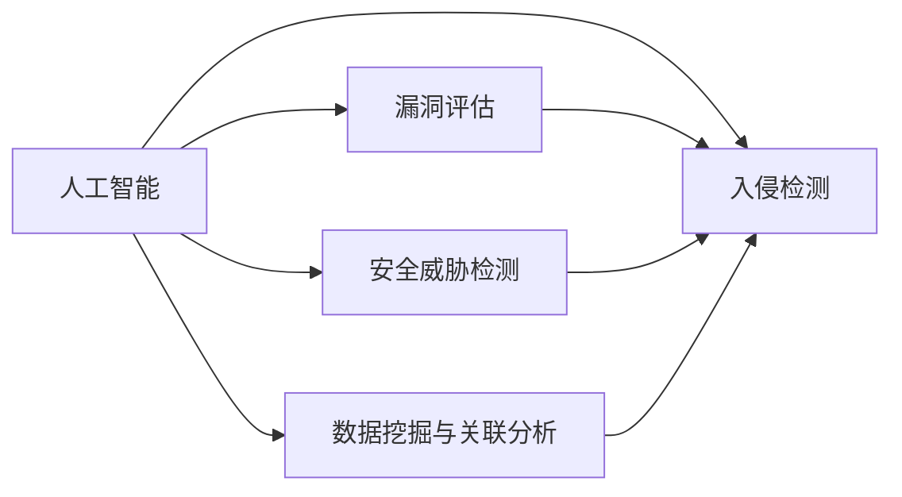

                 

# AI在网络安全中的应用:主动防御的新范式

> 关键词：网络安全,人工智能,主动防御,安全威胁检测,漏洞评估,入侵检测,数据挖掘

## 1. 背景介绍

在数字化时代，信息网络安全已成为各行各业的基础需求。随着互联网技术的迅猛发展，网络攻击形式日益复杂多样，防护手段需要不断升级以应对新的威胁。人工智能(AI)技术的兴起为网络安全领域带来了新的视角和方法。本文将探讨AI在网络安全中的主动防御应用，旨在展示其如何重塑传统的网络安全防护范式，提升网络安全防御的效率和效果。

### 1.1 问题由来

传统的网络安全防护主要依赖于被动防御策略，如防火墙、入侵检测系统(IDS)、入侵防御系统(IPS)等。这些策略虽然能够对已知威胁进行有效阻断，但面对未知威胁时，防护能力有限。在数据爆炸的时代，实时分析和快速响应成为防御的关键，而AI技术为解决这一问题提供了有力支撑。

### 1.2 问题核心关键点

AI在网络安全中的应用主要体现在以下几个方面：

1. **主动威胁检测**：AI能够通过分析大量网络流量数据，预测潜在的安全威胁，从而提前采取防御措施。
2. **自动化漏洞评估**：AI可以自动化地扫描系统漏洞，快速发现并修复安全隐患。
3. **入侵行为识别**：通过分析用户行为和系统活动，AI能够识别出异常行为，防止潜在的入侵攻击。
4. **数据挖掘与关联分析**：AI技术能够从海量数据中挖掘出关联关系，发现未知的威胁模式，提高防御效果。

### 1.3 问题研究意义

AI技术在网络安全中的应用，可以显著提升安全防护的效率和准确性。通过自动化、智能化的分析，AI能够快速响应安全事件，识别和应对新型威胁，从而构建更为坚固的网络安全防线。AI的引入也使得网络安全防护策略更加动态和适应性更强，能够应对不断变化的网络安全环境。

## 2. 核心概念与联系

### 2.1 核心概念概述

在探讨AI在网络安全中的应用时，我们需要首先明确几个核心概念：

1. **人工智能(AI)**：一种模拟人类智能过程的技术，能够通过学习、推理、自我优化等机制实现复杂的任务。
2. **主动防御**：不同于传统的被动防御策略，主动防御通过主动识别和响应潜在威胁，实现更高效的防御效果。
3. **安全威胁检测**：通过分析网络流量和系统日志等数据，检测并识别出安全威胁。
4. **漏洞评估**：对系统进行安全扫描，识别并评估潜在的漏洞。
5. **入侵检测**：实时监测网络流量，识别并响应入侵行为。
6. **数据挖掘与关联分析**：从海量数据中提取有用的信息，发现潜在的关联和模式。

这些概念之间的联系紧密，共同构成了AI在网络安全中的主动防御框架。通过AI技术的应用，可以实现自动化、智能化的威胁检测和响应，从而提升网络安全防护的效率和效果。

### 2.2 核心概念原理和架构的 Mermaid 流程图

以下是这些核心概念之间的联系和流图：



这个流程图示意了AI在网络安全中的核心作用。人工智能通过分析威胁检测、漏洞评估和入侵检测等环节的数据，进行数据挖掘和关联分析，最终实现主动防御的效果。

## 3. 核心算法原理 & 具体操作步骤

### 3.1 算法原理概述

AI在网络安全中的应用主要基于机器学习、深度学习和自然语言处理等技术。机器学习通过对大量历史数据的分析，训练出能够识别安全威胁、漏洞和入侵行为的模型。深度学习则通过神经网络等模型，从复杂数据中提取特征，提升识别精度。自然语言处理技术则能够处理和分析文本数据，进行威胁情报的识别和分析。

### 3.2 算法步骤详解

AI在网络安全中的具体应用步骤如下：

1. **数据收集与预处理**：收集网络流量、系统日志、威胁情报等数据，并进行清洗和预处理，为后续分析做准备。
2. **特征提取与建模**：使用机器学习或深度学习技术，对数据进行特征提取和建模，训练出安全威胁检测、漏洞评估和入侵检测等模型。
3. **模型部署与应用**：将训练好的模型部署到网络中，实时监测网络流量和系统活动，进行安全威胁检测和响应。
4. **结果分析和反馈**：对模型检测结果进行分析，反馈到模型中进行优化，提高模型的准确性和鲁棒性。

### 3.3 算法优缺点

AI在网络安全中的应用具有以下优点：

1. **高效性**：AI能够实时处理大量数据，快速识别和响应安全威胁，提高防护效率。
2. **智能化**：通过学习历史数据和威胁情报，AI能够自我优化，识别出新型威胁和漏洞。
3. **广泛适用性**：AI技术可以应用于多种网络环境，如企业内网、互联网等。

同时，也存在一些缺点：

1. **依赖高质量数据**：AI模型的训练和优化需要大量的高质量数据，数据不足可能影响模型效果。
2. **模型复杂性**：深度学习等复杂模型可能需要较高的计算资源和算法理解能力，应用门槛较高。
3. **安全风险**：AI模型可能被恶意利用，进行攻击和欺骗。
4. **误报率**：AI模型在识别真实威胁时可能存在误报，影响用户体验。

### 3.4 算法应用领域

AI在网络安全中的应用领域非常广泛，包括但不限于：

- **安全威胁检测**：实时监测网络流量，识别潜在的安全威胁。
- **漏洞评估**：自动化扫描系统漏洞，快速发现并修复安全隐患。
- **入侵检测**：实时监测用户行为和系统活动，识别并响应入侵行为。
- **威胁情报分析**：从海量数据中提取有用信息，发现潜在的威胁模式。
- **异常行为分析**：分析用户行为数据，识别异常行为和潜在威胁。

这些应用领域展示了AI在网络安全中的巨大潜力，推动了网络安全防护向智能化、自动化方向发展。

## 4. 数学模型和公式 & 详细讲解 & 举例说明

### 4.1 数学模型构建

AI在网络安全中的应用可以通过以下数学模型来描述：

设网络流量数据为 $X=\{x_i\}_{i=1}^N$，其中 $x_i$ 表示网络流量在时间 $i$ 的采样数据。网络安全威胁检测的目标是通过模型 $f$ 将 $X$ 映射到威胁概率 $y_i$，即 $y_i=f(x_i)$。

模型 $f$ 可以是线性回归、逻辑回归、支持向量机等传统机器学习模型，也可以是深度神经网络、卷积神经网络等深度学习模型。

### 4.2 公式推导过程

以深度学习模型为例，网络安全威胁检测模型的推导过程如下：

设模型 $f$ 的输出为 $\hat{y}_i$，则模型损失函数可以定义为：

$$
L(f) = \frac{1}{N}\sum_{i=1}^N \ell(\hat{y}_i, y_i)
$$

其中 $\ell$ 表示损失函数，如交叉熵损失、均方误差损失等。

通过反向传播算法，求解模型的参数 $\theta$，使得模型预测的威胁概率与真实概率尽可能接近：

$$
\theta = \mathop{\arg\min}_{\theta} L(f)
$$

### 4.3 案例分析与讲解

以DDoS攻击检测为例，假设网络流量数据 $X=\{x_i\}_{i=1}^N$，其中 $x_i$ 表示网络流量在时间 $i$ 的采样数据。假设模型的输出为 $\hat{y}_i$，表示当前时间的网络流量是否为异常流量。模型的损失函数为交叉熵损失：

$$
L(f) = \frac{1}{N}\sum_{i=1}^N -y_i\log \hat{y}_i - (1-y_i)\log(1-\hat{y}_i)
$$

模型的输出 $\hat{y}_i$ 可以通过一个简单神经网络计算得到，神经网络的输入为 $x_i$，输出为 $\hat{y}_i$。

## 5. 项目实践：代码实例和详细解释说明

### 5.1 开发环境搭建

在项目实践中，我们需要搭建合适的开发环境。以下是一个基于Python和TensorFlow的开发环境配置示例：

1. 安装Python和pip：
```
sudo apt-get update
sudo apt-get install python3-pip python3-dev
```

2. 安装TensorFlow：
```
pip install tensorflow
```

3. 安装Keras：
```
pip install keras
```

4. 安装其他依赖包：
```
pip install numpy scipy pandas sklearn matplotlib
```

完成环境配置后，可以使用以下命令测试环境：
```
python -c "import tensorflow as tf; print(tf.__version__)"
```

### 5.2 源代码详细实现

下面是一个简单的DDoS攻击检测模型的Python代码实现：

```python
import tensorflow as tf
from tensorflow.keras import layers

# 定义模型
model = tf.keras.Sequential([
    layers.Dense(128, activation='relu', input_shape=(None,)),
    layers.Dense(1, activation='sigmoid')
])

# 编译模型
model.compile(optimizer=tf.keras.optimizers.Adam(learning_rate=0.001),
              loss=tf.keras.losses.BinaryCrossentropy(from_logits=True),
              metrics=[tf.keras.metrics.AUC()])

# 加载数据
X_train, y_train = # 加载训练数据
X_test, y_test = # 加载测试数据

# 训练模型
model.fit(X_train, y_train, epochs=10, batch_size=32, validation_data=(X_test, y_test))

# 测试模型
loss, accuracy = model.evaluate(X_test, y_test)
print(f"Test Loss: {loss}, Test Accuracy: {accuracy}")
```

### 5.3 代码解读与分析

上述代码实现了一个简单的神经网络模型，用于DDoS攻击检测。模型的输入为网络流量数据 $X$，输出为攻击概率 $y$。模型的结构包括两个全连接层，第一个层有128个神经元，激活函数为ReLU；第二个层只有一个神经元，激活函数为Sigmoid。模型的损失函数为二元交叉熵损失，优化器为Adam。

在模型训练过程中，使用了随机梯度下降(SGD)优化器，并使用了AUC作为评价指标。模型的训练数据和测试数据可以从公共数据集中获取。

### 5.4 运行结果展示

在训练完成后，可以使用以下代码进行模型测试：

```python
# 测试模型
test_loss, test_accuracy = model.evaluate(X_test, y_test)
print(f"Test Loss: {test_loss}, Test Accuracy: {test_accuracy}")
```

运行结果将显示模型在测试集上的损失和准确率。如果模型训练得当，测试准确率应该接近于1。

## 6. 实际应用场景

### 6.1 智能监控与响应

AI在网络安全中的应用可以提升网络监控的智能化水平，实现对潜在威胁的实时检测和响应。通过AI技术，网络监控系统能够自动识别异常流量和入侵行为，快速采取应对措施，保障网络安全。

### 6.2 威胁情报分析

AI可以从海量网络数据中提取威胁情报，发现和分析新型威胁，为安全决策提供重要依据。通过深度学习等技术，AI能够从复杂数据中提取特征，进行模式识别和关联分析，生成威胁报告。

### 6.3 自动化漏洞评估

AI可以自动化地进行漏洞评估，快速发现并修复系统中的安全隐患。通过机器学习等技术，AI能够分析系统的运行状态和行为数据，识别出潜在的漏洞，并生成修复建议。

### 6.4 未来应用展望

未来，AI在网络安全中的应用将更加广泛和深入。随着技术的不断进步，AI将能够实现更加智能化、自动化的网络安全防护，提升网络安全防护的效率和效果。

## 7. 工具和资源推荐

### 7.1 学习资源推荐

为了帮助开发者更好地掌握AI在网络安全中的应用，这里推荐一些优质的学习资源：

1. Coursera《深度学习》课程：由斯坦福大学教授Andrew Ng主讲，系统介绍深度学习的基本概念和应用。
2. Udacity《人工智能与安全》课程：结合实际案例，介绍AI在网络安全中的应用。
3. TensorFlow官方文档：提供了详细的API文档和教程，帮助开发者快速上手AI应用。
4. Keras官方文档：提供了简单易用的API，适合初学者使用。
5. PyTorch官方文档：提供了丰富的模型和工具，适合深度学习开发。

通过这些学习资源，开发者可以系统掌握AI在网络安全中的应用技术，实现高效、智能化的安全防护。

### 7.2 开发工具推荐

以下是几款常用的AI开发工具，适合用于网络安全领域的开发：

1. TensorFlow：基于Google的深度学习框架，支持多种模型和算法，适合复杂的网络安全任务。
2. Keras：基于TensorFlow的高级API，易于上手，适合初学者和快速原型开发。
3. PyTorch：基于Python的深度学习框架，灵活性高，适合科研和学术应用。
4. scikit-learn：基于Python的机器学习库，提供了多种经典算法，适合处理结构化数据。
5. matplotlib：基于Python的数据可视化库，适合生成图表和可视化结果。

这些工具能够显著提升AI在网络安全中的开发效率和效果。

### 7.3 相关论文推荐

以下是几篇代表性论文，介绍AI在网络安全中的应用：

1. "Anomaly Detection in Network Traffic using Deep Learning"：介绍深度学习在网络流量异常检测中的应用。
2. "A Survey on Machine Learning-based Intrusion Detection System"：综述了机器学习在入侵检测系统中的应用。
3. "Deep Learning for Threat Intelligence: A Survey"：综述了深度学习在威胁情报分析中的应用。
4. "Neural Network based Vulnerability Scanning for Software"：介绍神经网络在软件漏洞评估中的应用。
5. "AutoML: A Survey of Automatic Machine Learning"：综述了自动化机器学习在网络安全中的应用。

这些论文提供了丰富的理论和实践经验，帮助开发者深入理解AI在网络安全中的应用。

## 8. 总结：未来发展趋势与挑战

### 8.1 研究成果总结

本文介绍了AI在网络安全中的应用，展示了其通过主动防御提升网络安全防护效率和效果的潜力。AI技术在网络安全中的应用已经取得了显著成效，通过自动化、智能化的分析，能够快速识别和响应安全威胁，提高防护效率。

### 8.2 未来发展趋势

未来，AI在网络安全中的应用将呈现以下发展趋势：

1. **自适应性增强**：AI将能够更加智能地识别和适应新型威胁，提升防护的灵活性和适应性。
2. **多模态融合**：AI将结合多种数据源，如网络流量、系统日志、用户行为等，进行综合分析和防御。
3. **自动化和智能化**：AI将实现更高效的自动化和智能化分析，提升安全防护的效率和效果。
4. **跨领域应用**：AI将在更多领域实现应用，如金融、医疗等，提升整体安全防护水平。

### 8.3 面临的挑战

尽管AI在网络安全中的应用前景广阔，但也面临以下挑战：

1. **数据隐私和安全**：在处理大量敏感数据时，需要考虑数据隐私和安全问题。
2. **模型复杂性**：复杂的AI模型需要较高的计算资源和算法理解能力，应用门槛较高。
3. **误报率**：AI模型在识别真实威胁时可能存在误报，影响用户体验。
4. **模型泛化性**：AI模型需要具备良好的泛化性，以应对不断变化的网络安全环境。

### 8.4 研究展望

未来的研究应在以下方面进行突破：

1. **提升模型的自适应性**：通过更加智能化的算法设计，提升AI模型的自适应能力，能够更好地应对新型威胁。
2. **优化模型的计算效率**：通过优化算法和硬件，提升AI模型的计算效率，实现更加高效的防护。
3. **引入更多先验知识**：结合符号化的先验知识，如威胁情报、规则库等，提升AI模型的准确性和鲁棒性。
4. **加强模型的可解释性**：通过可解释性算法，提升AI模型的可解释性，帮助用户理解模型的决策过程。

这些研究方向的探索将推动AI在网络安全中的应用更加广泛和深入，提升网络安全防护的效率和效果。

## 9. 附录：常见问题与解答

**Q1: 什么是网络安全中的主动防御？**

A: 主动防御是指在网络安全中，通过智能化的技术手段，主动识别和响应潜在的安全威胁，而不是被动地等待攻击发生后才采取措施。

**Q2: 如何处理数据隐私和安全问题？**

A: 在处理大量敏感数据时，需要采取严格的数据保护措施，如数据脱敏、加密等。同时，需要对AI模型进行训练和测试，以确保其不会泄漏敏感信息。

**Q3: 如何优化AI模型的计算效率？**

A: 可以通过模型压缩、剪枝、量化等技术，减少模型的计算复杂度。同时，可以采用分布式计算和并行计算，提高模型的训练和推理效率。

**Q4: 如何提升AI模型的自适应性？**

A: 可以通过引入更多的训练数据和先验知识，提升模型的泛化能力。同时，可以通过引入动态调整的算法，如贝叶斯优化，提升模型的自适应能力。

**Q5: 如何增强AI模型的可解释性？**

A: 可以通过引入可解释性算法，如LIME、SHAP等，帮助用户理解模型的决策过程。同时，可以通过人工干预和审核，提升模型的透明度和可靠性。

这些问题的解答为开发者提供了实际应用中的关键指导，帮助他们在网络安全防护中更好地利用AI技术。

---

作者：禅与计算机程序设计艺术 / Zen and the Art of Computer Programming

