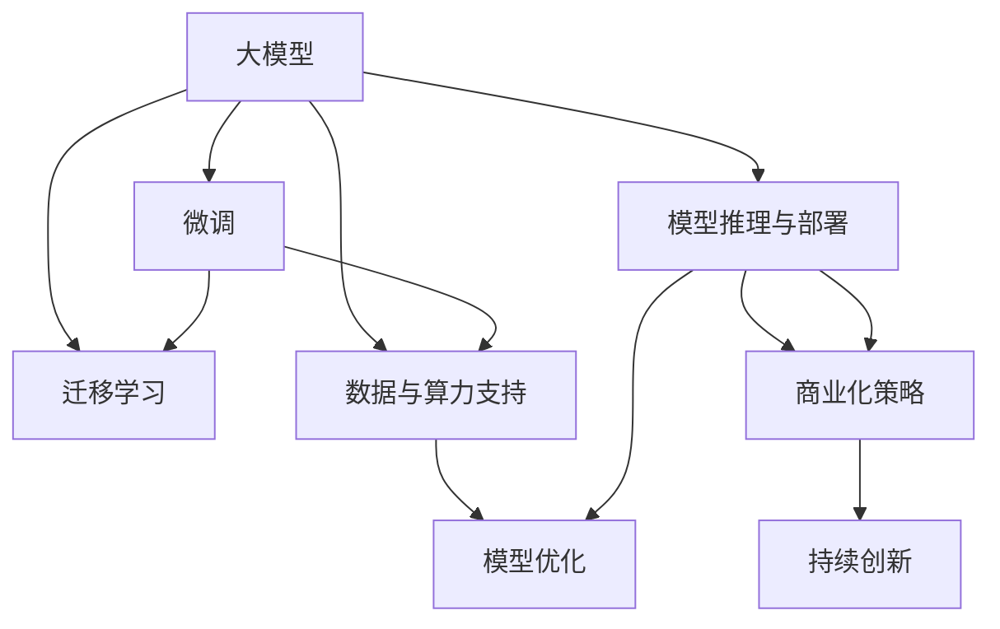

                 

# AI大模型创业战：挑战与机遇并存的趋势分析

## 1. 背景介绍

近年来，人工智能(AI)大模型在自然语言处理(NLP)、计算机视觉(CV)、语音识别(SR)等领域的显著进展，推动了AI技术向更广泛应用场景的深入，为AI创业公司带来了前所未有的机遇和挑战。尤其在大模型训练与优化、模型应用与部署、商业化策略与运营模式等方面，涌现出众多创业公司，以期在激烈的市场竞争中占据有利位置。

大模型创业公司主要集中在以下几个方向：
- **模型训练与优化**：基于大模型进行微调、迁移学习、推理优化等研究，提升模型性能和计算效率。
- **模型应用与部署**：开发基于大模型的实时应用系统，如NLP聊天机器人、图像识别系统等。
- **商业化策略与运营模式**：制定AI大模型的商业模式，包括API服务、SaaS平台、定制解决方案等，实现商业变现。
- **数据与算力支持**：建设大规模数据存储与计算平台，支持AI大模型的高效训练与推理。

这些方向的公司，既需要具备深厚的AI技术积累，也需要敏锐的市场洞察力，以在快速变化的市场环境中站稳脚跟。本文将系统梳理大模型创业公司在模型训练与优化、模型应用与部署、商业化策略与运营模式等领域的挑战与机遇，并为未来发展趋势进行预测。

## 2. 核心概念与联系

### 2.1 核心概念概述

为更好地理解AI大模型创业公司的运营模式和发展路径，我们需要清晰定义一些核心概念：

- **大模型**：指基于Transformer、BERT等架构，具有数十亿甚至上百亿参数规模的模型，如GPT-4、GPT-5、DALL·E、DETR等。
- **微调(Fine-tuning)**：指在大模型基础上，通过特定任务的少量标注数据，进行有监督的参数更新，提升模型在该任务上的性能。
- **迁移学习(Transfer Learning)**：将一个领域学到的知识迁移到另一个领域，减少新领域从头训练所需的数据和时间。
- **模型推理与部署**：将训练好的模型部署到生产环境，通过API服务或SaaS平台提供实时推理服务。
- **商业化策略**：通过产品设计、市场定位、客户服务、营销渠道等手段，实现AI技术的商业落地。
- **数据与算力支持**：建设大规模数据存储与计算平台，支持大模型的训练与推理。

这些概念之间的联系可以通过以下Mermaid流程图来展示：



这个流程图展示了大模型创业公司从模型训练到商业落地的整个生命周期流程，每个环节都需要在技术、业务、运营等多方面进行协调合作。

## 3. 核心算法原理 & 具体操作步骤

### 3.1 算法原理概述

AI大模型创业公司涉及的算法原理主要包括：

- **模型训练与优化**：基于自监督学习、强化学习等技术，训练大模型，并在小样本数据上进行微调，优化模型性能。
- **模型应用与部署**：通过API服务、SaaS平台等形式，将模型部署到生产环境中，提供实时推理服务。
- **商业化策略**：制定基于模型能力的收费策略，如按API调用次数、按模型版本等，实现商业变现。
- **数据与算力支持**：建设大规模数据存储与计算平台，支持大模型的训练与推理，降低计算成本。

### 3.2 算法步骤详解

AI大模型创业公司进行模型训练与优化的主要步骤如下：

**Step 1: 数据准备**
- 收集和预处理数据集，包括标注数据、无标签数据等。
- 选择合适的数据集，根据业务需求进行数据增强、数据清洗等预处理。

**Step 2: 模型训练**
- 选择合适的模型架构和训练策略，如Transformer、BERT等。
- 进行自监督预训练，如掩码语言模型(Masked Language Model)、自回归语言模型(Autoregressive Language Model)等。
- 在大规模数据上进行微调，使用正则化技术、学习率调整等策略，优化模型性能。

**Step 3: 模型部署**
- 将训练好的模型部署到服务器或云平台。
- 设计API接口，提供模型推理服务。
- 使用容器化技术，如Docker，提升部署效率。

**Step 4: 商业化策略**
- 根据模型性能和市场需求，制定收费策略，如按API调用次数、按模型版本等。
- 制定市场推广策略，通过广告、展会、合作伙伴等手段，提升市场知名度。
- 提供售后服务和技术支持，增强客户满意度。

**Step 5: 数据与算力支持**
- 建设大规模数据存储与计算平台，如Hadoop、Spark等。
- 优化计算资源，如使用GPU、TPU等硬件加速。
- 使用混合精度训练、分布式训练等技术，提升训练和推理效率。

### 3.3 算法优缺点

AI大模型创业公司在模型训练与优化、模型应用与部署、商业化策略与运营模式等方面，具备以下优点：

**优点**：
1. **广泛应用场景**：大模型可以应用于多个领域，如NLP、CV、SR等，具有广泛的应用前景。
2. **高计算效率**：基于深度学习框架，如TensorFlow、PyTorch，可以实现高效的并行计算，提升训练和推理速度。
3. **丰富数据资源**：互联网、社交媒体等平台提供了丰富的数据资源，为模型训练提供了数据基础。
4. **多样商业模式**：可以选择API服务、SaaS平台、定制解决方案等多种商业模式，实现商业变现。

**缺点**：
1. **高昂计算成本**：大模型训练需要大量的计算资源和电力成本，导致训练和推理成本较高。
2. **数据隐私风险**：模型训练需要大量数据，可能涉及用户隐私，存在数据泄露风险。
3. **技术复杂性**：大模型训练与优化、模型应用与部署、商业化策略与运营模式等环节涉及复杂技术，需要专业知识。
4. **模型泛化能力不足**：大模型可能在特定领域或任务上表现优异，但在泛化能力上存在不足，存在过拟合风险。

### 3.4 算法应用领域

AI大模型创业公司在多个领域都有广泛的应用，包括但不限于：

- **NLP**：如智能客服、机器翻译、文本摘要、情感分析等。
- **CV**：如图像分类、目标检测、人脸识别、图像生成等。
- **SR**：如语音识别、语音合成、情感识别、语音情感增强等。
- **医疗**：如医学影像分析、病理图像分析、疾病预测等。
- **金融**：如金融舆情监测、交易风险评估、反欺诈检测等。
- **智能制造**：如质量检测、设备维护、供应链优化等。
- **智慧城市**：如城市安防、交通管理、环境监测等。

## 4. 数学模型和公式 & 详细讲解 & 举例说明

### 4.1 数学模型构建

大模型创业公司涉及的数学模型主要包括以下几种：

- **自监督学习**：如掩码语言模型(Masked Language Model, MLM)，通过掩码部分单词进行预测，学习语言表示。
- **自回归学习**：如自回归语言模型(Autoregressive Language Model, ALM)，通过当前单词预测后续单词，学习语言顺序。
- **迁移学习**：通过预训练模型在小样本数据上进行微调，优化模型性能。

### 4.2 公式推导过程

以掩码语言模型为例，其公式推导过程如下：

假设序列长度为$T$，序列中的单词数为$V$，令$P(w_t|w_{<t})$表示单词$w_t$的条件概率，则掩码语言模型的优化目标为：

$$
\min_{\theta} \frac{1}{N}\sum_{i=1}^N\sum_{t=1}^T \ell(w_i^t, M_{\theta}(w_i^t))
$$

其中$M_{\theta}$为预训练模型，$\ell$为损失函数，$w_i^t$表示序列中第$i$个单词，$t$表示掩码位置。

在训练过程中，通过掩码部分单词进行预测，优化模型参数$\theta$，使得模型能够准确预测出每个单词的条件概率。

### 4.3 案例分析与讲解

以图像分类为例，其模型构建和训练过程如下：

1. **数据准备**：收集和预处理图像数据集，如CIFAR-10、ImageNet等。
2. **模型训练**：选择VGG、ResNet等模型架构，进行自监督预训练，如ImageNet大规模数据集上的自监督学习。
3. **微调**：在特定任务（如物体检测、人脸识别）上，使用少量标注数据进行微调，优化模型性能。
4. **部署**：将训练好的模型部署到服务器或云平台，通过API服务提供实时推理。

## 5. 项目实践：代码实例和详细解释说明

### 5.1 开发环境搭建

在进行AI大模型创业项目开发前，需要准备好开发环境。以下是使用Python进行PyTorch开发的环境配置流程：

1. 安装Anaconda：从官网下载并安装Anaconda，用于创建独立的Python环境。
2. 创建并激活虚拟环境：
```bash
conda create -n pytorch-env python=3.8 
conda activate pytorch-env
```

3. 安装PyTorch：根据CUDA版本，从官网获取对应的安装命令。例如：
```bash
conda install pytorch torchvision torchaudio cudatoolkit=11.1 -c pytorch -c conda-forge
```

4. 安装Transformer库：
```bash
pip install transformers
```

5. 安装各类工具包：
```bash
pip install numpy pandas scikit-learn matplotlib tqdm jupyter notebook ipython
```

完成上述步骤后，即可在`pytorch-env`环境中开始项目开发。

### 5.2 源代码详细实现

下面我们以图像分类任务为例，给出使用Transformers库对BERT模型进行微调的PyTorch代码实现。

首先，定义图像分类任务的数据处理函数：

```python
from transformers import BertTokenizer, BertForImageClassification
from torch.utils.data import Dataset
import torch

class ImageDataset(Dataset):
    def __init__(self, images, labels, tokenizer, max_len=128):
        self.images = images
        self.labels = labels
        self.tokenizer = tokenizer
        self.max_len = max_len
        
    def __len__(self):
        return len(self.images)
    
    def __getitem__(self, item):
        image = self.images[item]
        label = self.labels[item]
        
        # 对图像进行编码
        encoding = self.tokenizer(image, return_tensors='pt', max_length=self.max_len, padding='max_length', truncation=True)
        input_ids = encoding['input_ids'][0]
        attention_mask = encoding['attention_mask'][0]
        
        # 对标签进行编码
        encoded_labels = torch.tensor([label], dtype=torch.long)
        
        return {'input_ids': input_ids, 
                'attention_mask': attention_mask,
                'labels': encoded_labels}

# 加载预训练模型和分词器
tokenizer = BertTokenizer.from_pretrained('bert-base-uncased')
model = BertForImageClassification.from_pretrained('bert-base-uncased', num_labels=num_classes)

# 准备数据集
train_dataset = ImageDataset(train_images, train_labels, tokenizer)
dev_dataset = ImageDataset(dev_images, dev_labels, tokenizer)
test_dataset = ImageDataset(test_images, test_labels, tokenizer)
```

然后，定义模型和优化器：

```python
from transformers import AdamW

optimizer = AdamW(model.parameters(), lr=2e-5)
```

接着，定义训练和评估函数：

```python
from torch.utils.data import DataLoader
from tqdm import tqdm
from sklearn.metrics import classification_report

device = torch.device('cuda') if torch.cuda.is_available() else torch.device('cpu')
model.to(device)

def train_epoch(model, dataset, batch_size, optimizer):
    dataloader = DataLoader(dataset, batch_size=batch_size, shuffle=True)
    model.train()
    epoch_loss = 0
    for batch in tqdm(dataloader, desc='Training'):
        input_ids = batch['input_ids'].to(device)
        attention_mask = batch['attention_mask'].to(device)
        labels = batch['labels'].to(device)
        model.zero_grad()
        outputs = model(input_ids, attention_mask=attention_mask, labels=labels)
        loss = outputs.loss
        epoch_loss += loss.item()
        loss.backward()
        optimizer.step()
    return epoch_loss / len(dataloader)

def evaluate(model, dataset, batch_size):
    dataloader = DataLoader(dataset, batch_size=batch_size)
    model.eval()
    preds, labels = [], []
    with torch.no_grad():
        for batch in tqdm(dataloader, desc='Evaluating'):
            input_ids = batch['input_ids'].to(device)
            attention_mask = batch['attention_mask'].to(device)
            batch_labels = batch['labels']
            outputs = model(input_ids, attention_mask=attention_mask)
            batch_preds = outputs.logits.argmax(dim=1).to('cpu').tolist()
            batch_labels = batch_labels.to('cpu').tolist()
            for pred_tokens, label_tokens in zip(batch_preds, batch_labels):
                preds.append(pred_tokens)
                labels.append(label_tokens)
                
    print(classification_report(labels, preds))
```

最后，启动训练流程并在测试集上评估：

```python
epochs = 5
batch_size = 16

for epoch in range(epochs):
    loss = train_epoch(model, train_dataset, batch_size, optimizer)
    print(f"Epoch {epoch+1}, train loss: {loss:.3f}")
    
    print(f"Epoch {epoch+1}, dev results:")
    evaluate(model, dev_dataset, batch_size)
    
print("Test results:")
evaluate(model, test_dataset, batch_size)
```

以上就是使用PyTorch对BERT进行图像分类任务微调的完整代码实现。可以看到，得益于Transformers库的强大封装，我们可以用相对简洁的代码完成BERT模型的加载和微调。

### 5.3 代码解读与分析

让我们再详细解读一下关键代码的实现细节：

**ImageDataset类**：
- `__init__`方法：初始化图像、标签、分词器等关键组件。
- `__len__`方法：返回数据集的样本数量。
- `__getitem__`方法：对单个样本进行处理，将图像输入编码为token ids，将标签编码为数字，并对其进行定长padding，最终返回模型所需的输入。

**模型和优化器**：
- 使用BertForImageClassification模型和AdamW优化器，选择合适的学习率。

**训练和评估函数**：
- 使用PyTorch的DataLoader对数据集进行批次化加载，供模型训练和推理使用。
- 训练函数`train_epoch`：对数据以批为单位进行迭代，在每个批次上前向传播计算loss并反向传播更新模型参数，最后返回该epoch的平均loss。
- 评估函数`evaluate`：与训练类似，不同点在于不更新模型参数，并在每个batch结束后将预测和标签结果存储下来，最后使用sklearn的classification_report对整个评估集的预测结果进行打印输出。

**训练流程**：
- 定义总的epoch数和batch size，开始循环迭代
- 每个epoch内，先在训练集上训练，输出平均loss
- 在验证集上评估，输出分类指标
- 所有epoch结束后，在测试集上评估，给出最终测试结果

可以看到，PyTorch配合Transformers库使得BERT微调的代码实现变得简洁高效。开发者可以将更多精力放在数据处理、模型改进等高层逻辑上，而不必过多关注底层的实现细节。

当然，工业级的系统实现还需考虑更多因素，如模型的保存和部署、超参数的自动搜索、更灵活的任务适配层等。但核心的微调范式基本与此类似。

## 6. 实际应用场景

### 6.1 智能客服系统

基于大模型微调的对话技术，可以广泛应用于智能客服系统的构建。传统客服往往需要配备大量人力，高峰期响应缓慢，且一致性和专业性难以保证。而使用微调后的对话模型，可以7x24小时不间断服务，快速响应客户咨询，用自然流畅的语言解答各类常见问题。

在技术实现上，可以收集企业内部的历史客服对话记录，将问题和最佳答复构建成监督数据，在此基础上对预训练对话模型进行微调。微调后的对话模型能够自动理解用户意图，匹配最合适的答案模板进行回复。对于客户提出的新问题，还可以接入检索系统实时搜索相关内容，动态组织生成回答。如此构建的智能客服系统，能大幅提升客户咨询体验和问题解决效率。

### 6.2 金融舆情监测

金融机构需要实时监测市场舆论动向，以便及时应对负面信息传播，规避金融风险。传统的人工监测方式成本高、效率低，难以应对网络时代海量信息爆发的挑战。基于大语言模型微调的文本分类和情感分析技术，为金融舆情监测提供了新的解决方案。

具体而言，可以收集金融领域相关的新闻、报道、评论等文本数据，并对其进行主题标注和情感标注。在此基础上对预训练语言模型进行微调，使其能够自动判断文本属于何种主题，情感倾向是正面、中性还是负面。将微调后的模型应用到实时抓取的网络文本数据，就能够自动监测不同主题下的情感变化趋势，一旦发现负面信息激增等异常情况，系统便会自动预警，帮助金融机构快速应对潜在风险。

### 6.3 个性化推荐系统

当前的推荐系统往往只依赖用户的历史行为数据进行物品推荐，无法深入理解用户的真实兴趣偏好。基于大语言模型微调技术，个性化推荐系统可以更好地挖掘用户行为背后的语义信息，从而提供更精准、多样的推荐内容。

在实践中，可以收集用户浏览、点击、评论、分享等行为数据，提取和用户交互的物品标题、描述、标签等文本内容。将文本内容作为模型输入，用户的后续行为（如是否点击、购买等）作为监督信号，在此基础上微调预训练语言模型。微调后的模型能够从文本内容中准确把握用户的兴趣点。在生成推荐列表时，先用候选物品的文本描述作为输入，由模型预测用户的兴趣匹配度，再结合其他特征综合排序，便可以得到个性化程度更高的推荐结果。

### 6.4 未来应用展望

随着大模型和微调方法的不断发展，基于微调范式将在更多领域得到应用，为传统行业带来变革性影响。

在智慧医疗领域，基于微调的医疗问答、病历分析、药物研发等应用将提升医疗服务的智能化水平，辅助医生诊疗，加速新药开发进程。

在智能教育领域，微调技术可应用于作业批改、学情分析、知识推荐等方面，因材施教，促进教育公平，提高教学质量。

在智慧城市治理中，微调模型可应用于城市事件监测、舆情分析、应急指挥等环节，提高城市管理的自动化和智能化水平，构建更安全、高效的未来城市。

此外，在企业生产、社会治理、文娱传媒等众多领域，基于大模型微调的人工智能应用也将不断涌现，为NLP技术带来了全新的突破。相信随着预训练模型和微调方法的不断进步，NLP技术将在更广阔的应用领域大放异彩，深刻影响人类的生产生活方式。

## 7. 工具和资源推荐

### 7.1 学习资源推荐

为了帮助开发者系统掌握大模型微调的理论基础和实践技巧，这里推荐一些优质的学习资源：

1. 《Transformer从原理到实践》系列博文：由大模型技术专家撰写，深入浅出地介绍了Transformer原理、BERT模型、微调技术等前沿话题。

2. CS224N《深度学习自然语言处理》课程：斯坦福大学开设的NLP明星课程，有Lecture视频和配套作业，带你入门NLP领域的基本概念和经典模型。

3. 《Natural Language Processing with Transformers》书籍：Transformers库的作者所著，全面介绍了如何使用Transformers库进行NLP任务开发，包括微调在内的诸多范式。

4. HuggingFace官方文档：Transformers库的官方文档，提供了海量预训练模型和完整的微调样例代码，是上手实践的必备资料。

5. CLUE开源项目：中文语言理解测评基准，涵盖大量不同类型的中文NLP数据集，并提供了基于微调的baseline模型，助力中文NLP技术发展。

通过对这些资源的学习实践，相信你一定能够快速掌握大模型微调的精髓，并用于解决实际的NLP问题。

### 7.2 开发工具推荐

高效的开发离不开优秀的工具支持。以下是几款用于大模型微调开发的常用工具：

1. PyTorch：基于Python的开源深度学习框架，灵活动态的计算图，适合快速迭代研究。大部分预训练语言模型都有PyTorch版本的实现。

2. TensorFlow：由Google主导开发的开源深度学习框架，生产部署方便，适合大规模工程应用。同样有丰富的预训练语言模型资源。

3. Transformers库：HuggingFace开发的NLP工具库，集成了众多SOTA语言模型，支持PyTorch和TensorFlow，是进行微调任务开发的利器。

4. Weights & Biases：模型训练的实验跟踪工具，可以记录和可视化模型训练过程中的各项指标，方便对比和调优。与主流深度学习框架无缝集成。

5. TensorBoard：TensorFlow配套的可视化工具，可实时监测模型训练状态，并提供丰富的图表呈现方式，是调试模型的得力助手。

6. Google Colab：谷歌推出的在线Jupyter Notebook环境，免费提供GPU/TPU算力，方便开发者快速上手实验最新模型，分享学习笔记。

合理利用这些工具，可以显著提升大模型微调任务的开发效率，加快创新迭代的步伐。

### 7.3 相关论文推荐

大模型和微调技术的发展源于学界的持续研究。以下是几篇奠基性的相关论文，推荐阅读：

1. Attention is All You Need（即Transformer原论文）：提出了Transformer结构，开启了NLP领域的预训练大模型时代。

2. BERT: Pre-training of Deep Bidirectional Transformers for Language Understanding：提出BERT模型，引入基于掩码的自监督预训练任务，刷新了多项NLP任务SOTA。

3. Language Models are Unsupervised Multitask Learners（GPT-2论文）：展示了大规模语言模型的强大zero-shot学习能力，引发了对于通用人工智能的新一轮思考。

4. Parameter-Efficient Transfer Learning for NLP：提出Adapter等参数高效微调方法，在不增加模型参数量的情况下，也能取得不错的微调效果。

5. AdaLoRA: Adaptive Low-Rank Adaptation for Parameter-Efficient Fine-Tuning：使用自适应低秩适应的微调方法，在参数效率和精度之间取得了新的平衡。

这些论文代表了大模型微调技术的发展脉络。通过学习这些前沿成果，可以帮助研究者把握学科前进方向，激发更多的创新灵感。

## 8. 总结：未来发展趋势与挑战

### 8.1 总结

本文对AI大模型创业公司在模型训练与优化、模型应用与部署、商业化策略与运营模式等领域的挑战与机遇进行了系统梳理。首先阐述了大模型创业公司涉及的模型训练与优化、模型应用与部署、商业化策略与运营模式等核心概念及其间的联系，并展示了其在多个实际应用场景中的成功实践。其次，通过Mermaid流程图展示了AI大模型创业公司从模型训练到商业落地的整个生命周期流程。

通过本文的系统梳理，可以看到，AI大模型微调技术在模型训练与优化、模型应用与部署、商业化策略与运营模式等环节，既面临诸多挑战，又具备广阔的发展机遇。未来，AI大模型创业公司需要不断提升技术能力，优化商业模式，完善运营体系，才能在激烈的市场竞争中站稳脚跟，实现可持续发展。

### 8.2 未来发展趋势

展望未来，AI大模型创业公司将呈现以下几个发展趋势：

1. **技术能力提升**：随着深度学习、强化学习等技术的发展，AI大模型创业公司将逐步提升模型的训练效率和性能，开发更多高质量的预训练模型。
2. **算法优化与创新**：AI大模型创业公司将不断优化模型训练与优化算法，如自适应学习率、混合精度训练等，提升算法的效率与精度。
3. **模型应用多样化**：AI大模型创业公司将不断拓展模型的应用场景，如金融、医疗、智能制造等，提升模型在实际场景中的落地价值。
4. **商业模式创新**：AI大模型创业公司将不断探索新的商业模式，如API服务、SaaS平台、定制解决方案等，增强客户粘性，提升市场竞争力。
5. **数据与算力支持强化**：AI大模型创业公司将进一步建设数据与算力基础设施，提升模型的训练与推理效率，降低计算成本。

### 8.3 面临的挑战

尽管AI大模型微调技术已经取得了显著进展，但在迈向更加智能化、普适化应用的过程中，它仍面临诸多挑战：

1. **技术复杂性**：AI大模型微调技术涉及深度学习、自然语言处理、分布式计算等多个领域，需要深厚的技术积累。
2. **计算资源成本高**：大模型训练与推理需要大量的计算资源，如GPU、TPU等，导致成本较高。
3. **数据隐私风险**：模型训练需要大量数据，可能涉及用户隐私，存在数据泄露风险。
4. **模型泛化能力不足**：大模型可能在特定领域或任务上表现优异，但在泛化能力上存在不足，存在过拟合风险。
5. **商业化挑战**：AI大模型创业公司需要将技术成果转化为商业价值，面临市场推广、客户服务、定价策略等多方面挑战。

### 8.4 研究展望

面对AI大模型微调技术所面临的挑战，未来的研究需要在以下几个方面寻求新的突破：

1. **技术能力提升**：提升模型训练与优化算法，优化模型架构，提高模型性能与效率。
2. **数据与算力支持强化**：建设大规模数据存储与计算平台，优化计算资源，降低计算成本。
3. **商业化策略创新**：探索新的商业模式，如API服务、SaaS平台、定制解决方案等，增强客户粘性，提升市场竞争力。
4. **伦理与安全保障**：加强算法可解释性，确保模型决策的透明性与公正性，保障用户隐私与安全。
5. **模型泛化能力提升**：开发更多高质量的预训练模型，提升模型泛化能力，应对不同领域与任务的需求。

这些研究方向的探索，必将引领AI大模型微调技术迈向更高的台阶，为构建安全、可靠、可解释、可控的智能系统铺平道路。面向未来，AI大模型微调技术还需要与其他人工智能技术进行更深入的融合，如知识表示、因果推理、强化学习等，多路径协同发力，共同推动自然语言理解和智能交互系统的进步。只有勇于创新、敢于突破，才能不断拓展语言模型的边界，让智能技术更好地造福人类社会。

## 9. 附录：常见问题与解答

**Q1：AI大模型微调是否适用于所有NLP任务？**

A: AI大模型微调在大多数NLP任务上都能取得不错的效果，特别是对于数据量较小的任务。但对于一些特定领域的任务，如医学、法律等，仅仅依靠通用语料预训练的模型可能难以很好地适应。此时需要在特定领域语料上进一步预训练，再进行微调，才能获得理想效果。此外，对于一些需要时效性、个性化很强的任务，如对话、推荐等，微调方法也需要针对性的改进优化。

**Q2：AI大模型微调过程中如何选择合适的学习率？**

A: AI大模型微调的学习率一般要比预训练时小1-2个数量级，如果使用过大的学习率，容易破坏预训练权重，导致过拟合。一般建议从1e-5开始调参，逐步减小学习率，直至收敛。也可以使用warmup策略，在开始阶段使用较小的学习率，再逐渐过渡到预设值。需要注意的是，不同的优化器(如AdamW、Adafactor等)以及不同的学习率调度策略，可能需要设置不同的学习率阈值。

**Q3：AI大模型微调时需要注意哪些资源瓶颈？**

A: 目前主流的预训练大模型动辄以亿计的参数规模，对算力、内存、存储都提出了很高的要求。GPU/TPU等高性能设备是必不可少的，但即便如此，超大批次的训练和推理也可能遇到显存不足的问题。因此需要采用一些资源优化技术，如梯度积累、混合精度训练、模型并行等，来突破硬件瓶颈。同时，模型的存储和读取也可能占用大量时间和空间，需要采用模型压缩、稀疏化存储等方法进行优化。

**Q4：AI大模型微调模型在落地部署时需要注意哪些问题？**

A: 将AI大模型微调模型转化为实际应用，还需要考虑以下因素：
1. 模型裁剪：去除不必要的层和参数，减小模型尺寸，加快推理速度
2. 量化加速：将浮点模型转为定点模型，压缩存储空间，提高计算效率
3. 服务化封装：将模型封装为标准化服务接口，便于集成调用
4. 弹性伸缩：根据请求流量动态调整资源配置，平衡服务质量和成本
5. 监控告警：实时采集系统指标，设置异常告警阈值，确保服务稳定性
6. 安全防护：采用访问鉴权、数据脱敏等措施，保障数据和模型安全

AI大模型微调为NLP应用开启了广阔的想象空间，但如何将强大的性能转化为稳定、高效、安全的业务价值，还需要工程实践的不断打磨。唯有从数据、算法、工程、业务等多个维度协同发力，才能真正实现人工智能技术在垂直行业的规模化落地。总之，微调需要开发者根据具体任务，不断迭代和优化模型、数据和算法，方能得到理想的效果。

---

作者：禅与计算机程序设计艺术 / Zen and the Art of Computer Programming

