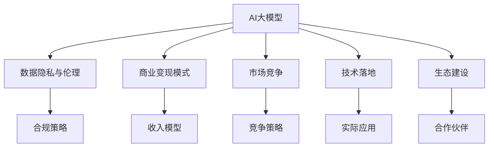

                 

# AI大模型创业：如何应对未来市场挑战？

> 关键词：AI大模型,创业,市场挑战,战略规划,技术架构,市场定位,商业化路径,生态建设

## 1. 背景介绍

### 1.1 问题由来

人工智能（AI）技术正以前所未有的速度改变着各行各业。特别是在自然语言处理（NLP）和计算机视觉（CV）等领域的深度学习大模型（Large Language Models, LLMs）和生成对抗网络（Generative Adversarial Networks, GANs），这些模型展现出了强大的数据建模和生成能力，推动了AI技术的快速发展。然而，尽管AI大模型在技术上取得了巨大突破，其在商业化应用和市场推广上面临的挑战依然严峻。

在过去的几年中，众多创业公司涌现出来，试图将AI大模型应用于市场，但从市场反馈和项目失败案例来看，大模型商业化面临诸多挑战，包括但不限于数据隐私、用户需求匹配、商业变现模式、市场竞争、技术落地等。本文将通过分析AI大模型创业的市场挑战，探讨如何制定科学的战略规划，构建有效的技术架构，明确市场定位，找到可行的商业化路径，从而推动AI大模型在市场上的成功应用。

### 1.2 问题核心关键点

AI大模型在商业化应用中面临的核心问题主要有以下几点：

1. **数据隐私与伦理问题**：大模型训练需要大量数据，如何保证用户数据隐私和安全，避免侵犯用户权益是首要问题。
2. **用户需求匹配**：并非所有行业和企业都能快速识别出大模型应用的潜在价值，如何匹配用户需求是关键。
3. **商业变现模式**：如何构建稳定的商业变现模式，持续获得收入回报是公司生存和发展的核心。
4. **市场竞争**：AI大模型领域竞争激烈，如何制定有效的市场竞争策略是公司发展的关键。
5. **技术落地**：如何将先进的技术成果转化为实际应用，解决具体业务问题是关键。
6. **生态建设**：如何构建生态系统，吸引更多合作伙伴和用户，共同推动AI大模型应用发展。

## 2. 核心概念与联系

### 2.1 核心概念概述

在讨论AI大模型创业时，我们需要理解以下几个关键概念：

1. **AI大模型（LLMs, GANs）**：指的是基于深度学习的，能够处理大规模、复杂数据集的模型，如BERT、GPT、GAN等。
2. **数据隐私与伦理**：指的是在数据采集和使用过程中，如何保护用户隐私和遵守伦理规范。
3. **商业变现模式**：指公司如何通过产品或服务获取收入，包括订阅制、按需付费、广告收入等。
4. **市场竞争**：指公司在市场中的竞争策略，包括产品定位、市场份额、差异化竞争等。
5. **技术落地**：指如何将技术成果转化为具体的应用和产品，解决实际业务问题。
6. **生态建设**：指如何构建良好的合作伙伴关系和用户社区，共同推动技术发展。

这些概念之间的逻辑关系可以通过以下Mermaid流程图来展示：



这个流程图展示了AI大模型与多个核心概念之间的联系和相互作用。

## 3. 核心算法原理 & 具体操作步骤
### 3.1 算法原理概述

AI大模型的商业化应用，本质上是利用大模型的算法优势和数据处理能力，在目标市场中找到应用场景并实现收益。其核心算法原理主要包括以下几个方面：

1. **数据预处理**：清洗、标注和准备数据，确保数据质量。
2. **模型训练**：使用大模型进行模型训练，调整参数，优化算法。
3. **算法优化**：采用不同的算法优化策略，如正则化、梯度裁剪、混合精度等。
4. **模型评估**：在验证集上评估模型性能，调整参数，优化算法。
5. **实际应用**：将模型应用到具体业务场景中，解决实际问题。

### 3.2 算法步骤详解

以下是AI大模型商业化应用的详细算法步骤：

**Step 1: 数据准备**
- 收集、清洗和标注数据，确保数据质量。
- 根据模型要求，划分训练集、验证集和测试集。

**Step 2: 模型训练**
- 选择合适的模型架构和训练框架，如TensorFlow、PyTorch等。
- 设定合适的超参数，如学习率、批大小、迭代次数等。
- 使用大模型进行训练，记录训练日志。

**Step 3: 算法优化**
- 采用不同的算法优化策略，如正则化、梯度裁剪、混合精度等。
- 在验证集上评估模型性能，调整超参数，优化算法。

**Step 4: 模型评估**
- 使用测试集评估模型性能，确认模型效果。
- 根据业务需求，调整模型参数，优化算法。

**Step 5: 实际应用**
- 将模型应用到具体业务场景中，解决实际问题。
- 记录业务数据，进行反馈和调整。

### 3.3 算法优缺点

AI大模型商业化应用的算法有如下优点和缺点：

**优点：**
- 数据处理能力强，可以处理大规模数据集。
- 算法灵活，适应性强，适用于多种应用场景。
- 算法复杂度高，但效果显著，能够解决复杂问题。

**缺点：**
- 数据准备和标注工作量大，需要大量人力和财力。
- 模型训练和优化需要大量计算资源，成本高。
- 模型应用需要高度专业化的技术支持，推广难度大。

### 3.4 算法应用领域

AI大模型在商业化应用中主要应用于以下几个领域：

1. **医疗**：利用大模型进行医学影像分析、病历分析和健康管理。
2. **金融**：使用大模型进行金融数据分析、信用评分和反欺诈检测。
3. **零售**：应用大模型进行客户行为分析、推荐系统和市场预测。
4. **制造**：利用大模型进行质量检测、故障诊断和生产优化。
5. **教育**：采用大模型进行个性化学习、智能辅导和内容推荐。

## 4. 数学模型和公式 & 详细讲解 & 举例说明

### 4.1 数学模型构建

在大模型应用中，数学模型主要包含以下几个部分：

1. **损失函数（Loss Function）**：用于衡量模型输出与实际结果的差异，如均方误差（MSE）、交叉熵（Cross Entropy）等。
2. **优化器（Optimizer）**：用于更新模型参数，如梯度下降（SGD）、Adam等。
3. **正则化（Regularization）**：用于防止过拟合，如L2正则、Dropout等。
4. **激活函数（Activation Function）**：用于增加模型非线性特性，如ReLU、Sigmoid等。

### 4.2 公式推导过程

以简单的线性回归模型为例，推导一下常见的损失函数和优化器公式：

**损失函数（MSE）**
$$
L = \frac{1}{n} \sum_{i=1}^n (y_i - \hat{y}_i)^2
$$

**梯度下降（SGD）**
$$
\theta \leftarrow \theta - \eta \nabla_{\theta} L
$$

其中 $\theta$ 为模型参数，$y_i$ 为实际输出，$\hat{y}_i$ 为模型预测输出，$n$ 为样本数量，$\eta$ 为学习率，$\nabla_{\theta} L$ 为损失函数对参数的梯度。

### 4.3 案例分析与讲解

假设我们要使用大模型进行金融信用评分，需要构建一个损失函数来衡量模型输出和实际评分之间的差异。

1. **损失函数设计**：
   - 选择交叉熵损失函数，用于衡量模型输出与实际评分的差异。
   - 设计合适的评估指标，如准确率、召回率、F1分数等。

2. **模型优化**：
   - 使用Adam优化器进行模型参数更新。
   - 采用L2正则化，防止模型过拟合。
   - 设定合适的学习率和迭代次数。

3. **模型评估**：
   - 使用测试集评估模型性能，记录评估指标。
   - 根据业务需求，调整模型参数，优化算法。

## 5. 项目实践：代码实例和详细解释说明

### 5.1 开发环境搭建

在进行大模型应用开发前，需要准备以下开发环境：

1. 安装Python：从官网下载Python安装程序，安装最新版本。
2. 安装TensorFlow或PyTorch：使用pip安装TensorFlow或PyTorch，根据个人需求选择。
3. 安装相关依赖：安装需要的库，如numpy、pandas、scikit-learn等。

### 5.2 源代码详细实现

以TensorFlow为例，展示一个简单的信用评分模型的实现：

```python
import tensorflow as tf
import numpy as np

# 构建模型
def build_model(input_shape):
    inputs = tf.keras.Input(shape=input_shape)
    x = tf.keras.layers.Dense(32, activation='relu')(inputs)
    x = tf.keras.layers.Dense(16, activation='relu')(x)
    outputs = tf.keras.layers.Dense(1, activation='sigmoid')(x)
    model = tf.keras.Model(inputs=inputs, outputs=outputs)
    return model

# 准备数据
def prepare_data():
    X_train = np.random.rand(1000, 10)
    y_train = np.random.randint(0, 2, size=(1000, 1))
    return X_train, y_train

# 模型训练
def train_model(model, X_train, y_train):
    model.compile(optimizer=tf.keras.optimizers.Adam(learning_rate=0.001),
                  loss=tf.keras.losses.BinaryCrossentropy(from_logits=True),
                  metrics=['accuracy'])
    model.fit(X_train, y_train, epochs=10, batch_size=32)

# 测试模型
def evaluate_model(model, X_test, y_test):
    y_pred = model.predict(X_test)
    y_pred = (y_pred > 0.5).astype(int)
    y_true = y_test
    accuracy = np.mean(y_pred == y_true)
    return accuracy

# 主函数
if __name__ == '__main__':
    X_train, y_train = prepare_data()
    X_test, y_test = prepare_data()
    model = build_model(X_train.shape[1:])
    train_model(model, X_train, y_train)
    accuracy = evaluate_model(model, X_test, y_test)
    print(f'Test accuracy: {accuracy:.4f}')
```

### 5.3 代码解读与分析

上述代码展示了使用TensorFlow构建一个简单的信用评分模型，包括数据准备、模型构建、训练和评估等步骤。

**数据准备**：通过numpy生成随机数据，用于训练和测试模型。

**模型构建**：定义了一个包含两个全连接层的神经网络模型，输出为二分类结果。

**模型训练**：使用Adam优化器和二分类交叉熵损失函数进行模型训练，设置合适的学习率。

**模型评估**：使用测试集评估模型性能，计算准确率。

## 6. 实际应用场景

### 6.1 医疗影像分析

大模型在医疗影像分析中的应用主要体现在以下几个方面：

1. **疾病诊断**：利用大模型对医疗影像进行分类，识别出不同疾病。
2. **病历分析**：对电子病历进行文本分析，提取关键信息。
3. **健康管理**：根据用户的健康数据，提供个性化的健康建议。

### 6.2 金融数据分析

大模型在金融数据分析中的应用主要包括以下几个方面：

1. **信用评分**：对用户数据进行分析，进行信用评分。
2. **市场预测**：预测股票、债券等金融产品的价格走势。
3. **风险评估**：评估金融交易的风险，进行反欺诈检测。

### 6.3 零售推荐系统

大模型在零售推荐系统中的应用主要包括以下几个方面：

1. **客户行为分析**：分析客户购买行为，进行客户细分。
2. **推荐系统**：根据客户行为和历史数据，推荐商品或服务。
3. **市场预测**：预测商品销售情况，进行库存管理。

### 6.4 未来应用展望

未来，AI大模型在各个领域的应用前景广阔，将推动人工智能技术进一步发展。

1. **医疗**：将大模型应用于医疗影像分析、病历分析和健康管理，提升医疗服务水平。
2. **金融**：使用大模型进行金融数据分析、信用评分和反欺诈检测，降低金融风险。
3. **零售**：应用大模型进行客户行为分析、推荐系统和市场预测，提升零售业务效率。
4. **制造**：利用大模型进行质量检测、故障诊断和生产优化，提升制造企业竞争力。
5. **教育**：采用大模型进行个性化学习、智能辅导和内容推荐，提升教育质量。

## 7. 工具和资源推荐

### 7.1 学习资源推荐

为了帮助AI大模型创业公司快速掌握相关技术，以下是一些推荐的学习资源：

1. **Deep Learning Specialization（深度学习专项课程）**：由斯坦福大学Andrew Ng教授主讲，系统介绍了深度学习理论和实践。
2. **TensorFlow官方文档**：TensorFlow官方提供的详细文档，包括教程、API和示例代码。
3. **PyTorch官方文档**：PyTorch官方提供的详细文档，包括教程、API和示例代码。
4. **Kaggle数据集和竞赛**：Kaggle提供了大量数据集和机器学习竞赛，可以用于学习和实践。
5. **NIPS和ICML论文集**：这两个顶级会议的论文集，涵盖了最新的研究成果和前沿技术。

### 7.2 开发工具推荐

以下是一些常用的AI大模型开发工具：

1. **TensorFlow**：由Google开发的深度学习框架，支持分布式计算，适合大规模模型训练。
2. **PyTorch**：由Facebook开发的深度学习框架，支持动态图和静态图，灵活高效。
3. **Jupyter Notebook**：开源的交互式开发环境，支持Python、R等多种编程语言。
4. **Colab**：由Google提供的在线开发环境，支持GPU和TPU计算，免费使用。
5. **Weights & Biases**：用于模型实验跟踪和可视化，支持多种框架。

### 7.3 相关论文推荐

以下是一些推荐的相关论文：

1. **Deep Residual Learning for Image Recognition**：He等，提出ResNet，开创了深度残差网络时代。
2. **Imagenet Classification with Deep Convolutional Neural Networks**：Krizhevsky等，提出CNN，推动了计算机视觉领域的快速发展。
3. **Attention is All You Need**：Vaswani等，提出Transformer，开启了NLP领域的预训练大模型时代。
4. **BERT: Pre-training of Deep Bidirectional Transformers for Language Understanding**：Devlin等，提出BERT，刷新了多项NLP任务SOTA。
5. **ADAM: A Method for Stochastic Optimization**：Kingma等，提出Adam优化器，广泛应用于深度学习模型训练。

## 8. 总结：未来发展趋势与挑战

### 8.1 研究成果总结

AI大模型在商业化应用中取得了显著进展，但在实际落地过程中仍面临诸多挑战，需要在多个方面进行改进和创新。

### 8.2 未来发展趋势

未来AI大模型的发展趋势主要包括以下几个方面：

1. **技术进步**：随着算法和硬件的进步，AI大模型的效果将进一步提升。
2. **应用拓展**：AI大模型将应用于更多领域，推动各行业的数字化转型。
3. **生态建设**：建立完善的生态系统，吸引更多合作伙伴和用户，共同推动AI大模型发展。
4. **商业变现**：探索更多商业变现模式，实现可持续收入。

### 8.3 面临的挑战

尽管AI大模型在商业化应用中取得了一定进展，但仍然面临以下挑战：

1. **数据隐私与伦理**：数据隐私和安全问题需要进一步解决。
2. **用户需求匹配**：如何精准匹配用户需求，是公司发展的关键。
3. **市场竞争**：如何在激烈的市场竞争中脱颖而出，需要制定有效的竞争策略。
4. **技术落地**：如何将先进技术转化为实际应用，解决具体业务问题是关键。
5. **生态建设**：如何构建良好的合作伙伴关系和用户社区，共同推动AI大模型应用发展。

### 8.4 研究展望

未来，AI大模型需要进一步探索和创新，解决以下问题：

1. **数据隐私与伦理**：制定严格的数据隐私和伦理规范，保护用户权益。
2. **用户需求匹配**：通过智能推荐和个性化服务，精准匹配用户需求。
3. **市场竞争**：制定有效的市场竞争策略，提高市场份额。
4. **技术落地**：将先进技术转化为实际应用，解决具体业务问题。
5. **生态建设**：构建良好的合作伙伴关系和用户社区，共同推动AI大模型应用发展。

## 9. 附录：常见问题与解答

**Q1: 数据隐私与伦理问题如何解决？**

A: 数据隐私与伦理问题可以通过以下方法解决：
1. 匿名化处理：对用户数据进行匿名化处理，保护用户隐私。
2. 数据去标识化：对数据进行去标识化处理，防止数据泄露。
3. 合规性审查：定期进行合规性审查，确保数据处理符合法律法规。

**Q2: 如何匹配用户需求？**

A: 匹配用户需求可以通过以下方法实现：
1. 用户调研：通过问卷、访谈等方式了解用户需求。
2. 数据分析：通过数据分析，发现用户潜在需求。
3. 用户反馈：通过用户反馈，及时调整产品和服务。

**Q3: 如何构建稳定的商业变现模式？**

A: 构建稳定的商业变现模式可以通过以下方法实现：
1. 订阅制：提供订阅制服务，获取稳定的收入。
2. 按需付费：提供按需付费服务，根据用户使用情况收费。
3. 广告收入：通过广告收入，获取一定的收入。

**Q4: 如何在激烈的市场竞争中脱颖而出？**

A: 在激烈的市场竞争中脱颖而出，可以通过以下方法实现：
1. 差异化竞争：通过产品和服务差异化，吸引用户。
2. 价格策略：制定合理的价格策略，获取市场份额。
3. 创新技术：通过技术创新，提升竞争力。

**Q5: 如何将先进技术转化为实际应用？**

A: 将先进技术转化为实际应用，可以通过以下方法实现：
1. 需求分析：明确业务需求，设计技术方案。
2. 技术选型：选择合适的技术和工具，实现技术落地。
3. 持续优化：根据业务反馈，持续优化技术方案。

---

作者：禅与计算机程序设计艺术 / Zen and the Art of Computer Programming

