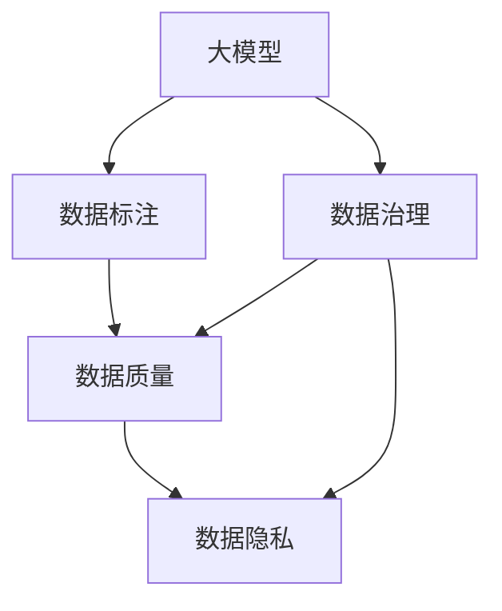

                 

# AI大模型创业：如何应对未来数据挑战？

> 关键词：大模型创业,数据挑战,数据收集,数据标注,数据安全,数据治理,数据质量

## 1. 背景介绍

### 1.1 问题由来

在当今数据驱动的时代，数据质量、数据安全和数据治理已经成为AI创业公司的核心挑战。特别是在使用大模型进行NLP、推荐系统、图像识别等任务时，数据的获取、清洗、标注、存储和处理都显得尤为重要。数据挑战不仅影响模型的性能，还可能带来伦理风险和合规问题。如何高效、可控地处理数据，成为制约AI大模型创业的关键因素。

### 1.2 问题核心关键点

大模型创业面临的数据挑战主要包括以下几个方面：

- **数据收集**：从何种渠道收集高质量数据？数据来源和质量的保证。
- **数据标注**：如何高效地生成和标注数据？标注成本和精度的平衡。
- **数据安全**：数据存储和传输中的隐私保护和合规要求。
- **数据治理**：如何构建数据流水线，提升数据管理效率？
- **数据质量**：数据噪声、偏差和重复问题如何解决？

这些关键点共同构成了AI大模型创业的数据管理框架，对于确保数据的高效、安全、合规使用至关重要。本文将详细介绍如何应对这些挑战，以期为AI大模型创业提供全面的指导。

## 2. 核心概念与联系

### 2.1 核心概念概述

为更好地理解AI大模型创业中的数据挑战，本节将介绍几个密切相关的核心概念：

- **大模型**：以Transformer等深度学习架构为代表的预训练语言模型。这些模型通过在海量数据上进行自监督预训练，学习到通用的语言和视觉表示，具备强大的特征提取能力。

- **数据标注**：将原始数据转换为标注数据，为模型训练提供监督信号的过程。标注数据通常由专家或自动化工具生成，标注质量直接影响模型的效果。

- **数据治理**：数据收集、存储、处理和应用的全生命周期管理。涵盖数据质量、数据安全、数据合规等多个方面，是确保数据可靠性和可控性的重要手段。

- **数据质量**：数据的准确性、完整性、一致性和时效性等特性，直接影响模型训练和应用的效果。

- **数据隐私**：保护个人隐私，避免数据泄露和滥用，遵循相关法律法规，如GDPR、CCPA等。

这些核心概念之间的逻辑关系可以通过以下Mermaid流程图来展示：



这个流程图展示了大模型创业中数据管理的核心概念及其之间的关系：

1. 大模型通过数据标注获得监督信号，用于训练和优化。
2. 数据治理确保数据的高效、安全、合规使用。
3. 数据质量是数据标注和数据治理的共同目标，影响大模型的性能。
4. 数据隐私是大模型应用中必须遵守的法律法规要求。

## 3. 核心算法原理 & 具体操作步骤

### 3.1 算法原理概述

AI大模型创业的数据挑战处理，本质上是一个数据工程和数据治理的过程。其核心思想是通过数据收集、标注、清洗、存储、治理等技术手段，确保数据的高效、可靠和安全使用。

形式化地，假设数据集为 $D=\{(x_i,y_i)\}_{i=1}^N$，其中 $x_i$ 为输入特征，$y_i$ 为标注数据。数据挑战处理的目标是最小化数据标注成本，同时提升数据质量和安全水平，即：

$$
\hat{D} = \mathop{\arg\min}_{D} (\text{cost}(D) + \text{error}(D))
$$

其中 $\text{cost}(D)$ 为数据标注和治理的成本，$\text{error}(D)$ 为数据噪声、偏差等错误的影响。

### 3.2 算法步骤详解

AI大模型创业中，数据挑战处理一般包括以下几个关键步骤：

**Step 1: 数据收集**

- 确定数据来源：根据任务需求，选择合适的数据源，如公开数据集、互联网爬虫、第三方API等。
- 数据预处理：清洗和格式化原始数据，去除噪声和冗余信息。

**Step 2: 数据标注**

- 定义标注框架：设计数据标注的标准、格式和规范，确保标注的一致性和可解释性。
- 标注工具选择：选择合适的标注工具和平台，如Labelbox、Prodigy等。
- 标注团队管理：组建标注团队，培训标注人员，确保标注质量。

**Step 3: 数据清洗**

- 数据去重：去除重复的数据记录，减少标注工作量。
- 数据修正：纠正标注错误和噪声数据，提升数据质量。

**Step 4: 数据存储**

- 数据格式选择：根据任务需求，选择合适的数据存储格式，如CSV、JSON、Parquet等。
- 数据分区和索引：根据数据访问模式，合理分区和索引数据，提高查询效率。

**Step 5: 数据治理**

- 数据访问控制：设置数据访问权限，确保数据安全和隐私。
- 数据生命周期管理：定义数据生命周期，定期评估和清理数据，保持数据时效性。

**Step 6: 数据质量评估**

- 数据噪声检测：使用统计和机器学习技术检测数据噪声和异常值。
- 数据偏差检测：评估数据偏差，确保模型不偏向任何特定的数据群体。

### 3.3 算法优缺点

基于数据挑战处理的方法具有以下优点：

1. 提高模型性能：高质量的数据标注和治理能显著提升模型在特定任务上的效果。
2. 降低开发成本：数据处理自动化和模型优化可以减少人工干预，节省成本。
3. 增强合规性：符合数据隐私和安全法规，降低法律风险。
4. 提升数据质量：数据清洗和质量评估能保证数据的一致性和可靠性。

同时，该方法也存在一定的局限性：

1. 依赖高质量数据源：数据收集和标注成本高，需要高质量的标注团队和数据源。
2. 数据隐私保护：如何在数据收集和标注过程中保护个人隐私，是一大挑战。
3. 数据治理复杂：数据治理涉及多方面因素，需要综合考虑。
4. 数据偏差风险：数据偏差可能导致模型产生不公平或有害的输出。
5. 数据生命周期管理：数据的生命周期管理需要持续的维护和监控，成本较高。

尽管存在这些局限性，但就目前而言，数据挑战处理仍然是AI大模型创业中的主流方法。未来相关研究的重点在于如何进一步降低数据标注成本，提高数据处理效率，同时兼顾数据质量和隐私保护等因素。

### 3.4 算法应用领域

基于数据挑战处理的方法，在AI大模型的多个应用领域中得到了广泛的应用，例如：

- 自然语言处理(NLP)：如情感分析、命名实体识别、文本分类等任务。需要大量的标注数据进行训练，并使用数据治理手段确保数据质量。
- 推荐系统：如个性化推荐、协同过滤等任务。需要收集用户行为数据，进行数据清洗和治理，以提升推荐效果。
- 计算机视觉(CV)：如图像识别、物体检测等任务。需要收集和标注大量的图像数据，并使用数据治理手段保证数据安全。
- 语音识别(SR)：如语音命令识别、语音情感分析等任务。需要收集和标注语音数据，并使用数据治理手段确保数据隐私。
- 智能运维：如异常检测、故障预测等任务。需要收集系统日志和监控数据，进行数据清洗和治理，以提升运维效率。

除了上述这些经典应用外，数据挑战处理技术还在更多场景中得到创新性应用，如数据增强、对抗训练、提示学习等，为AI大模型带来新的突破。随着数据处理和治理技术的不断进步，相信AI大模型将在更广泛的领域得到应用，带来更深远的变革。

## 4. 数学模型和公式 & 详细讲解 & 举例说明

### 4.1 数学模型构建

本节将使用数学语言对AI大模型创业中的数据挑战处理过程进行更加严格的刻画。

假设数据集为 $D=\{(x_i,y_i)\}_{i=1}^N$，其中 $x_i$ 为输入特征，$y_i$ 为标注数据。定义标注和治理的成本为 $C$，数据噪声和偏差的误差为 $E$。则目标函数为：

$$
\hat{D} = \mathop{\arg\min}_{D} (C + E)
$$

在实践中，通常使用基于梯度的优化算法（如SGD、Adam等）来近似求解上述最优化问题。设 $\eta$ 为学习率，$\lambda$ 为正则化系数，则参数的更新公式为：

$$
D \leftarrow D - \eta \nabla_{D}\mathcal{L}(D) - \eta\lambda D
$$

其中 $\nabla_{D}\mathcal{L}(D)$ 为损失函数对数据集的梯度，可通过反向传播算法高效计算。

### 4.2 公式推导过程

以下我们以自然语言处理任务为例，推导数据挑战处理中的损失函数及其梯度的计算公式。

假设标注任务为文本分类，输入为文本 $x$，输出为标签 $y \in \{0,1\}$。模型 $M$ 的输出为 $M(x)$，假设为概率分布，则交叉熵损失函数定义为：

$$
\ell(M(x),y) = -y\log M(x) + (1-y)\log (1-M(x))
$$

将其代入经验风险公式，得：

$$
\mathcal{L}(D) = -\frac{1}{N}\sum_{i=1}^N \ell(M(x_i),y_i)
$$

根据链式法则，损失函数对数据集 $D$ 的梯度为：

$$
\frac{\partial \mathcal{L}(D)}{\partial D} = -\frac{1}{N}\sum_{i=1}^N (\frac{y_i}{M(x_i)}-\frac{1-y_i}{1-M(x_i)}) \frac{\partial M(x_i)}{\partial D}
$$

其中 $\frac{\partial M(x_i)}{\partial D}$ 可进一步递归展开，利用自动微分技术完成计算。

在得到损失函数的梯度后，即可带入参数更新公式，完成数据的优化过程。重复上述过程直至收敛，最终得到优化后的数据集 $D^*$。

## 5. 项目实践：代码实例和详细解释说明

### 5.1 开发环境搭建

在进行数据挑战处理实践前，我们需要准备好开发环境。以下是使用Python进行PyTorch开发的环境配置流程：

1. 安装Anaconda：从官网下载并安装Anaconda，用于创建独立的Python环境。

2. 创建并激活虚拟环境：
```bash
conda create -n data-env python=3.8 
conda activate data-env
```

3. 安装PyTorch：根据CUDA版本，从官网获取对应的安装命令。例如：
```bash
conda install pytorch torchvision torchaudio cudatoolkit=11.1 -c pytorch -c conda-forge
```

4. 安装Pandas：
```bash
pip install pandas
```

5. 安装scikit-learn：
```bash
pip install scikit-learn
```

6. 安装scikit-image：
```bash
pip install scikit-image
```

完成上述步骤后，即可在`data-env`环境中开始数据处理实践。

### 5.2 源代码详细实现

下面我们以文本分类任务为例，给出使用Pandas库对数据进行清洗和标注的PyTorch代码实现。

首先，定义数据处理函数：

```python
import pandas as pd
from sklearn.model_selection import train_test_split

def load_data(filename):
    df = pd.read_csv(filename)
    return df

def preprocess_data(df):
    # 去除重复数据
    df = df.drop_duplicates()
    # 特征处理
    df['text'] = df['text'].apply(lambda x: x.lower())
    df['text'] = df['text'].apply(lambda x: x.replace('\n', ' '))
    df['text'] = df['text'].apply(lambda x: x.replace('\t', ' '))
    # 标注处理
    df['label'] = df['label'].astype('category').cat.codes
    return df

def split_data(df, test_size=0.2):
    train_df, test_df = train_test_split(df, test_size=test_size, random_state=42)
    return train_df, test_df
```

然后，使用函数加载和预处理数据：

```python
filename = 'data.csv'
df = load_data(filename)
df = preprocess_data(df)
train_df, test_df = split_data(df, test_size=0.2)
```

最后，输出预处理后的数据信息：

```python
print(train_df.head())
print(test_df.head())
print(df['text'].nunique())
print(df['label'].nunique())
```

以上就是使用Pandas库对数据进行清洗和标注的完整代码实现。可以看到，通过Pandas库，我们可以轻松地进行数据加载、清洗、标注和分割等操作，极大地简化了数据处理流程。

### 5.3 代码解读与分析

让我们再详细解读一下关键代码的实现细节：

**load_data函数**：
- 使用Pandas库读取CSV文件，返回DataFrame对象。

**preprocess_data函数**：
- 对重复数据进行去重处理，提高数据效率。
- 对文本进行小写化、去除特殊字符和空白符等特征处理。
- 将标签转换为整数编码，便于模型训练。

**split_data函数**：
- 使用sklearn库对数据进行train_test_split，将数据分为训练集和测试集。
- 设置测试集大小为20%，使用随机种子确保数据分割的一致性。

**训练数据信息输出**：
- 使用head方法输出训练集和测试集的前几行，检查数据处理效果。
- 使用nunique方法统计文本和标签的唯一值数量，确保数据的多样性和准确性。

可以看到，Pandas库在数据处理中扮演了重要角色，大大提高了数据处理的效率和准确性。通过上述函数，我们可以快速完成数据清洗、标注和分割等操作，为后续模型训练和应用打下坚实基础。

## 6. 实际应用场景

### 6.1 智能客服系统

在智能客服系统中，数据收集和标注是不可或缺的环节。智能客服系统需要收集大量的客户对话数据，进行标注和清洗，然后用于训练和优化对话模型。

具体而言，可以收集客户来电记录、在线聊天记录、社交媒体评论等数据，标注对话的意图和上下文。然后使用数据清洗和治理手段，去除噪声和重复信息，保证数据质量。最后，将标注好的数据用于模型训练，提升对话模型的自然流畅性和准确性。

### 6.2 金融舆情监测

金融舆情监测系统需要实时监控社交媒体、新闻、论坛等渠道的舆情动态，及时发现负面信息并进行预警。数据收集和标注在这一过程中起着关键作用。

可以收集新闻文章、社交媒体评论、金融报告等数据，标注其中的情绪和内容。然后使用数据清洗和治理手段，去除不相关和重复数据，保证数据的时效性和准确性。最后，将标注好的数据用于模型训练，提升舆情监测的实时性和准确性。

### 6.3 个性化推荐系统

个性化推荐系统需要收集用户的历史行为数据，进行标注和清洗，然后用于训练和优化推荐模型。

具体而言，可以收集用户的浏览记录、点击记录、购买记录等数据，标注其中的行为意图和偏好。然后使用数据清洗和治理手段，去除噪声和重复信息，保证数据的质量。最后，将标注好的数据用于模型训练，提升推荐系统的个性化和精准性。

### 6.4 未来应用展望

随着数据收集和标注技术的不断发展，AI大模型将在更多领域得到应用，为传统行业带来变革性影响。

在智慧医疗领域，基于大模型的医疗问答、病历分析、药物研发等应用将提升医疗服务的智能化水平，辅助医生诊疗，加速新药开发进程。

在智能教育领域，微调技术可应用于作业批改、学情分析、知识推荐等方面，因材施教，促进教育公平，提高教学质量。

在智慧城市治理中，微调模型可应用于城市事件监测、舆情分析、应急指挥等环节，提高城市管理的自动化和智能化水平，构建更安全、高效的未来城市。

此外，在企业生产、社会治理、文娱传媒等众多领域，基于大模型微调的人工智能应用也将不断涌现，为经济社会发展注入新的动力。

## 7. 工具和资源推荐

### 7.1 学习资源推荐

为了帮助开发者系统掌握大模型创业中的数据挑战处理理论基础和实践技巧，这里推荐一些优质的学习资源：

1. 《数据科学导论》系列博文：由数据科学领域专家撰写，深入浅出地介绍了数据清洗、标注、治理等核心概念和实用技巧。

2. CS229《机器学习》课程：斯坦福大学开设的机器学习明星课程，有Lecture视频和配套作业，带你入门机器学习的基本原理和算法。

3. 《数据科学与人工智能实践》书籍：详细介绍了数据收集、处理、分析和应用的全流程，适合数据科学初学者阅读。

4. Labelbox官方文档： leading in data labeling，提供高质量的数据标注工具和平台，助力数据标注任务的高效完成。

5. AI数据治理工具白皮书：汇集了各类数据治理工具和方法，是构建数据治理体系的重要参考。

通过对这些资源的学习实践，相信你一定能够快速掌握大模型创业中的数据处理技巧，并用于解决实际的数据挑战。

### 7.2 开发工具推荐

高效的开发离不开优秀的工具支持。以下是几款用于大模型创业中数据挑战处理开发的常用工具：

1. Python：广泛应用的语言，适合快速迭代研究。

2. Pandas：数据处理和分析的利器，提供了丰富的数据清洗和转换功能。

3. NumPy：高效的多维数组计算库，适合大规模数据的处理和优化。

4. PyTorch：基于Python的开源深度学习框架，适合快速迭代研究。

5. TensorFlow：由Google主导开发的开源深度学习框架，适合大规模工程应用。

6. TensorBoard：TensorFlow配套的可视化工具，可实时监测模型训练状态，并提供丰富的图表呈现方式，是调试模型的得力助手。

7. Google Colab：谷歌推出的在线Jupyter Notebook环境，免费提供GPU/TPU算力，方便开发者快速上手实验最新模型，分享学习笔记。

合理利用这些工具，可以显著提升数据挑战处理的开发效率，加快创新迭代的步伐。

### 7.3 相关论文推荐

大模型创业中的数据挑战处理源于学界的持续研究。以下是几篇奠基性的相关论文，推荐阅读：

1. "Data Preprocessing for Machine Learning"：介绍了数据清洗、特征工程等核心概念，是数据科学领域的经典教材。

2. "Data Labeling in Natural Language Processing"：讨论了数据标注在NLP任务中的重要性和挑战，提出了多种标注方法和技术。

3. "Data Governance Framework for AI"：构建了数据治理的全面框架，提出了数据质量、数据安全和数据隐私的管理方法。

4. "Practical Data Quality Assessment in AI"：介绍了数据质量评估的方法和工具，讨论了如何保证数据的多样性和准确性。

5. "Scalable Data Storage and Management in AI"：探讨了大数据存储和管理的技术和策略，提出了多种优化方法。

这些论文代表了大模型创业中数据挑战处理技术的发展脉络。通过学习这些前沿成果，可以帮助研究者把握学科前进方向，激发更多的创新灵感。

## 8. 总结：未来发展趋势与挑战

### 8.1 总结

本文对AI大模型创业中如何应对数据挑战进行了全面系统的介绍。首先阐述了数据挑战在AI大模型创业中的重要性，明确了数据收集、标注、治理和质量控制的核心目标。其次，从原理到实践，详细讲解了数据挑战处理的基本方法和关键步骤，给出了数据处理任务开发的完整代码实例。同时，本文还广泛探讨了数据挑战处理技术在智能客服、金融舆情、个性化推荐等多个行业领域的应用前景，展示了数据处理范式的巨大潜力。最后，本文精选了数据处理技术的各类学习资源，力求为读者提供全方位的技术指引。

通过本文的系统梳理，可以看到，数据挑战处理是大模型创业中的重要组成部分，对确保数据的高效、安全、合规使用至关重要。未来，伴随数据处理和治理技术的不断进步，AI大模型必将在更广泛的领域得到应用，带来更深远的变革。

### 8.2 未来发展趋势

展望未来，AI大模型创业中的数据挑战处理将呈现以下几个发展趋势：

1. 数据收集自动化：利用爬虫、API等自动化手段，快速获取高质量数据，降低人工标注成本。
2. 数据标注智能化：引入自动化标注工具和半监督学习，提升标注效率和精度。
3. 数据治理体系化：构建统一的数据治理平台，提升数据管理效率。
4. 数据质量持续优化：引入数据质量持续评估和改进机制，提升数据可靠性。
5. 数据隐私保护加强：遵循GDPR、CCPA等法规，确保数据隐私安全。

以上趋势凸显了数据挑战处理技术的广阔前景。这些方向的探索发展，必将进一步提升数据处理和治理的效率，确保数据的高效、可靠和安全使用。

### 8.3 面临的挑战

尽管数据挑战处理技术已经取得了瞩目成就，但在迈向更加智能化、普适化应用的过程中，它仍面临诸多挑战：

1. 数据源稀缺：高质量数据源的获取成本高，尤其是特定领域的语料库和标注资源。
2. 标注成本高昂：自动化标注虽然降低了人工干预，但初始标注仍需大量人力和时间。
3. 数据治理复杂：数据治理涉及多方面因素，需要综合考虑，如数据生命周期管理、数据隐私保护等。
4. 数据质量波动：数据清洗和标注过程可能存在误差，导致数据质量不稳定。
5. 数据治理成本高：构建和维护数据治理平台需要大量资源和人力。

尽管存在这些挑战，但通过不断优化数据挑战处理技术，我们相信未来的大模型创业将能更好地应对数据挑战，确保数据的高效、安全、合规使用，推动AI技术的普及和应用。

### 8.4 研究展望

面对数据挑战处理技术所面临的种种挑战，未来的研究需要在以下几个方面寻求新的突破：

1. 探索无监督和半监督数据挑战处理方法。摆脱对大规模标注数据的依赖，利用自监督学习、主动学习等无监督和半监督范式，最大限度利用非结构化数据，实现更加灵活高效的数据处理。

2. 研究参数高效和计算高效的数据处理范式。开发更加参数高效和计算高效的数据处理方法，在固定大部分预训练参数的同时，只更新极少量的任务相关参数。同时优化数据处理模型的计算图，减少前向传播和反向传播的资源消耗，实现更加轻量级、实时性的部署。

3. 融合因果和对比学习范式。通过引入因果推断和对比学习思想，增强数据处理模型建立稳定因果关系的能力，学习更加普适、鲁棒的数据表征，从而提升模型泛化性和抗干扰能力。

4. 引入更多先验知识。将符号化的先验知识，如知识图谱、逻辑规则等，与神经网络模型进行巧妙融合，引导数据处理过程学习更准确、合理的语言模型。同时加强不同模态数据的整合，实现视觉、语音等多模态信息与文本信息的协同建模。

5. 结合因果分析和博弈论工具。将因果分析方法引入数据处理模型，识别出模型决策的关键特征，增强输出解释的因果性和逻辑性。借助博弈论工具刻画人机交互过程，主动探索并规避模型的脆弱点，提高系统稳定性。

6. 纳入伦理道德约束。在数据处理目标中引入伦理导向的评估指标，过滤和惩罚有偏见、有害的输出倾向。同时加强人工干预和审核，建立数据处理行为的监管机制，确保输出符合人类价值观和伦理道德。

这些研究方向的探索，必将引领数据挑战处理技术迈向更高的台阶，为构建安全、可靠、可解释、可控的智能系统铺平道路。面向未来，数据挑战处理技术还需要与其他人工智能技术进行更深入的融合，如知识表示、因果推理、强化学习等，多路径协同发力，共同推动自然语言理解和智能交互系统的进步。只有勇于创新、敢于突破，才能不断拓展数据处理技术的边界，让智能技术更好地造福人类社会。

## 9. 附录：常见问题与解答

**Q1：数据标注是否必须手动进行？**

A: 数据标注可以采用手动标注、半自动标注和自动标注相结合的方式。手动标注适用于质量要求高、规模小的数据集；半自动标注结合了标注人员和机器学习算法，适用于中等规模的数据集；自动标注使用机器学习算法自动标注数据，适用于大规模的数据集。

**Q2：如何处理数据噪声和偏差？**

A: 数据噪声和偏差可以通过以下方法进行处理：
1. 数据清洗：去除重复数据、不完整数据和错误数据。
2. 数据平衡：对于不平衡数据集，可以通过过采样、欠采样或生成样本等方法进行平衡。
3. 特征工程：引入新的特征，减少噪声数据的影响。
4. 模型优化：使用鲁棒性强的模型，减少偏差数据的影响。

**Q3：如何保护数据隐私？**

A: 数据隐私保护可以通过以下方法进行：
1. 数据脱敏：使用数据脱敏技术，隐藏敏感信息。
2. 数据加密：对数据进行加密存储和传输，防止泄露。
3. 数据访问控制：设置数据访问权限，限制数据访问范围。
4. 数据审计：记录和监控数据访问日志，发现异常行为。

**Q4：如何确保数据质量？**

A: 数据质量可以通过以下方法进行确保：
1. 数据清洗：去除噪声和冗余数据。
2. 数据标准化：统一数据格式和标准，减少数据不一致。
3. 数据验证：使用数据验证技术，检测数据错误和偏差。
4. 数据监控：实时监控数据质量，及时发现和纠正问题。

**Q5：如何提升数据处理效率？**

A: 数据处理效率可以通过以下方法进行提升：
1. 自动化标注：使用自动标注工具，减少人工标注工作量。
2. 数据并行处理：使用分布式计算技术，提升数据处理速度。
3. 数据压缩：使用数据压缩技术，减少数据存储和传输的资源消耗。
4. 数据流水线：构建数据流水线，提高数据处理流程的自动化程度。

这些问题的解答，希望能为你提供全面的数据挑战处理指南，帮助你在AI大模型创业中应对数据挑战，确保数据的高效、安全、合规使用，推动AI技术的普及和应用。

---

作者：禅与计算机程序设计艺术 / Zen and the Art of Computer Programming

