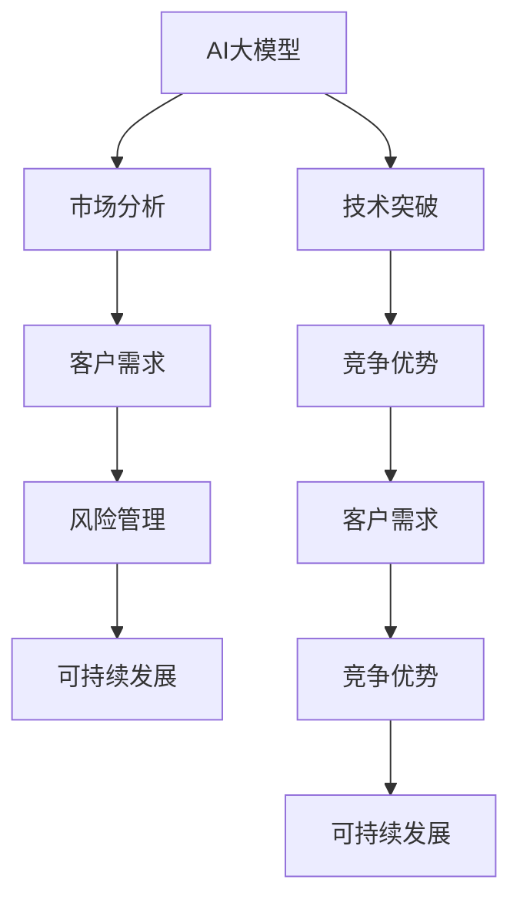

                 

# AI大模型创业：如何应对未来竞争对手？

> 关键词：AI大模型，创业策略，竞争优势，市场分析，技术突破，客户需求，风险管理，可持续发展

## 1. 背景介绍

### 1.1 问题由来
近年来，人工智能（AI）大模型在各行各业的应用日益广泛，带来了显著的商业价值。例如，GPT-3等大模型在自然语言处理（NLP）领域的广泛应用，不仅提升了文本生成、问答等任务的效率和精度，也催生了一波新创业公司的诞生，如OpenAI、Google AI等。这些大模型的成功应用，激发了更多企业对AI大模型技术的关注和投入。

然而，随着市场竞争的加剧，大模型技术的发展也面临着前所未有的挑战。如何构建具有核心竞争力的AI大模型创业公司，成为当下创业者关注的焦点。本文将从核心概念、算法原理、操作步骤、实际应用场景等多个角度，探讨如何在AI大模型领域构建竞争优势，应对未来竞争对手。

## 2. 核心概念与联系

### 2.1 核心概念概述

为更好地理解如何在AI大模型领域构建竞争优势，本节将介绍几个关键概念：

- **AI大模型**：指基于深度学习模型，通过大规模无监督学习（如自监督学习）或监督学习（如微调）构建的大规模预训练模型，具备强大的泛化能力和通用性，可以应用于各种NLP任务。

- **竞争优势**：指企业通过提供独特的价值主张（如技术、产品、服务、品牌等），相较于竞争对手，在市场上获得更多份额的能力。

- **市场分析**：指通过收集和分析市场数据，了解目标市场的需求、竞争状况、趋势等，为制定战略提供依据。

- **技术突破**：指在AI大模型领域不断创新，实现算法、模型架构、应用场景等的突破，形成独特的技术壁垒。

- **客户需求**：指目标市场的用户和客户的具体需求和痛点，产品和服务需符合这些需求，才能获得用户的认可和市场份额。

- **风险管理**：指企业识别和评估潜在的市场和经营风险，采取措施降低或规避风险，确保长期稳定的发展。

- **可持续发展**：指企业采取可持续的发展模式，平衡经济效益和社会、环境效益，实现长期稳定的发展。

这些核心概念共同构成了AI大模型创业的基石，帮助企业构建竞争优势，应对未来竞争对手。

### 2.2 核心概念原理和架构的 Mermaid 流程图



这个流程图展示了AI大模型创业中各个核心概念之间的关系：

1. AI大模型通过大规模预训练获得通用能力，为市场分析、技术突破、竞争优势、客户需求、风险管理和可持续发展提供基础。
2. 市场分析帮助企业了解市场需求和竞争状况，指导技术突破和竞争优势的构建。
3. 技术突破通过算法和模型创新，提升AI大模型的性能和应用广度。
4. 竞争优势通过独特的技术、产品、服务和品牌，在市场上占据有利地位。
5. 客户需求通过分析目标市场的具体需求，指导产品设计和市场定位。
6. 风险管理通过识别和评估潜在风险，采取措施降低风险，确保企业的长期稳定发展。
7. 可持续发展通过平衡经济效益和社会、环境效益，实现企业的长期可持续发展。

## 3. 核心算法原理 & 具体操作步骤

### 3.1 算法原理概述

构建具有竞争优势的AI大模型，首先需要理解大模型的算法原理。AI大模型通常基于自监督学习或监督学习构建，其核心思想是通过大规模数据预训练，学习到通用的语言表示和模式，然后在特定任务上进行微调或迁移学习，从而提升模型在特定任务上的性能。

具体而言，AI大模型的预训练过程通常包括自监督任务，如掩码语言模型、下一句预测等，通过这些任务学习到语言的统计规律和语义关系。在预训练完成后，模型通过微调或迁移学习，适应特定任务的需求，提升性能。

### 3.2 算法步骤详解

构建AI大模型的具体操作步骤如下：

**Step 1: 数据准备**
- 收集和清洗大规模无标签或标注数据集，用于模型的预训练。
- 根据特定任务需求，准备少量的标注数据，用于模型的微调或迁移学习。

**Step 2: 模型选择和预训练**
- 选择合适的预训练模型架构，如BERT、GPT、T5等。
- 在预训练模型基础上，通过自监督学习任务进行预训练，学习通用的语言表示。

**Step 3: 模型微调或迁移学习**
- 根据特定任务需求，设计任务适配层和损失函数。
- 在微调或迁移学习阶段，通过有监督学习优化模型，提升模型在特定任务上的性能。

**Step 4: 评估和部署**
- 在测试集上评估模型性能，对比微调前后的效果。
- 将模型部署到实际应用场景中，进行业务集成和优化。

### 3.3 算法优缺点

构建AI大模型具有以下优点：

1. **通用性强**：AI大模型在预训练阶段学习到通用的语言表示，可以应用于各种NLP任务，降低定制化开发成本。
2. **性能优越**：通过微调或迁移学习，AI大模型能够在特定任务上获得优异的效果，提升业务效率和准确性。
3. **易于扩展**：AI大模型架构灵活，支持多种扩展方式，如模型并行、混合精度训练等，可以适应不同规模的计算需求。

同时，AI大模型也存在一些局限：

1. **数据依赖**：模型的性能很大程度上依赖于训练数据的质量和数量，数据获取成本较高。
2. **过拟合风险**：在微调或迁移学习阶段，如果训练数据量较小，模型可能出现过拟合，影响泛化性能。
3. **计算成本高**：大规模预训练和微调需要高算力支持，初期投入较大。

### 3.4 算法应用领域

AI大模型在多个领域都有广泛应用，例如：

- 自然语言处理：文本分类、信息抽取、机器翻译、问答系统等。
- 计算机视觉：图像分类、目标检测、图像生成等。
- 语音识别：语音转文本、语音合成等。
- 推荐系统：个性化推荐、广告推荐等。
- 游戏AI：游戏策略、智能决策等。

## 4. 数学模型和公式 & 详细讲解 & 举例说明

### 4.1 数学模型构建

以自然语言处理任务为例，AI大模型的数学模型构建包括以下几个关键步骤：

1. **输入表示**：将输入文本转化为模型能够处理的向量表示，通常使用Word2Vec、GloVe等词向量表示方法。
2. **模型结构**：选择合适的模型架构，如Transformer、CNN、RNN等，定义模型的编码器和解码器。
3. **预训练任务**：通过自监督学习任务，如掩码语言模型、下一句预测等，训练模型参数，学习通用的语言表示。
4. **微调或迁移学习**：通过有监督学习任务，如文本分类、信息抽取等，微调模型参数，提升模型在特定任务上的性能。

### 4.2 公式推导过程

以Transformer模型为例，其自监督预训练过程的数学模型如下：

$$
\mathcal{L} = \frac{1}{N} \sum_{i=1}^N \ell(M_{\theta}(x_i),y_i)
$$

其中，$M_{\theta}$为预训练模型的参数表示，$x_i$为输入的文本，$y_i$为预训练任务的目标输出。$\ell$为损失函数，通常使用交叉熵损失。

### 4.3 案例分析与讲解

以BERT模型为例，其在预训练和微调过程中的数学模型如下：

**预训练任务**：
- 掩码语言模型（Masked Language Modeling, MLM）：
  $$
  \ell_{\text{mlm}} = -\sum_{i=1}^{n} \log P(w_i | W_{MLM})
  $$
  其中，$w_i$为掩码后的单词，$W_{MLM}$为掩码语言模型参数。

**微调任务**：
- 文本分类（Text Classification）：
  $$
  \ell_{\text{cls}} = -\sum_{i=1}^{n} y_i \log P(label_i | W_{cls})
  $$
  其中，$y_i$为文本分类的标签，$W_{cls}$为分类器的参数。

## 5. 项目实践：代码实例和详细解释说明

### 5.1 开发环境搭建

构建AI大模型的开发环境通常需要以下工具：

1. **深度学习框架**：如PyTorch、TensorFlow等，用于构建和训练模型。
2. **数据处理工具**：如Pandas、Scikit-learn等，用于数据清洗和预处理。
3. **模型评估工具**：如TensorBoard、Weights & Biases等，用于监控模型训练和评估性能。
4. **容器化工具**：如Docker、Kubernetes等，用于模型部署和管理。

### 5.2 源代码详细实现

以下是一个使用PyTorch框架构建BERT模型的示例代码：

```python
import torch
from transformers import BertModel, BertTokenizer

# 初始化预训练模型和分词器
model = BertModel.from_pretrained('bert-base-uncased')
tokenizer = BertTokenizer.from_pretrained('bert-base-uncased')

# 加载训练数据
train_data = load_train_data()

# 定义训练函数
def train_epoch(model, data, optimizer):
    model.train()
    for batch in data:
        input_ids = batch['input_ids']
        attention_mask = batch['attention_mask']
        labels = batch['labels']
        optimizer.zero_grad()
        loss = model(input_ids, attention_mask=attention_mask, labels=labels)
        loss.backward()
        optimizer.step()

# 定义评估函数
def evaluate(model, data):
    model.eval()
    eval_loss = 0
    eval_acc = 0
    for batch in data:
        input_ids = batch['input_ids']
        attention_mask = batch['attention_mask']
        labels = batch['labels']
        with torch.no_grad():
            logits = model(input_ids, attention_mask=attention_mask)
            logits = logits[:, 0, :]
            probs = torch.softmax(logits, dim=-1)
            eval_loss += loss.log_prob(labels).mean()
            eval_acc += (probs.argmax(dim=-1) == labels).float().mean()
    return eval_loss, eval_acc

# 训练模型
optimizer = torch.optim.AdamW(model.parameters(), lr=2e-5)
epochs = 5
for epoch in range(epochs):
    train_epoch(model, train_data, optimizer)
    eval_loss, eval_acc = evaluate(model, val_data)
    print(f'Epoch {epoch+1}, loss: {eval_loss:.4f}, acc: {eval_acc:.4f}')

# 模型保存
model.save_pretrained('bert_model')
tokenizer.save_pretrained('bert_model')
```

### 5.3 代码解读与分析

这段代码实现了使用PyTorch框架构建和训练BERT模型的基本流程：

1. **模型加载**：通过`from_pretrained`方法加载预训练的BERT模型和分词器，节省训练时间。
2. **数据加载**：定义训练集和验证集的数据处理函数，将文本数据转化为模型能够处理的输入。
3. **训练函数**：定义训练循环，每次迭代输入数据，计算损失函数并反向传播更新模型参数。
4. **评估函数**：定义评估循环，计算模型在验证集上的损失和准确率，监控模型性能。
5. **模型保存**：训练完成后，将模型和分词器保存到本地文件，便于后续使用和部署。

### 5.4 运行结果展示

通过上述代码，可以训练得到模型并保存，通过调用`BertModel`的`__call__`方法进行推理，输出预测结果。

## 6. 实际应用场景

### 6.1 智能客服系统

智能客服系统可以采用基于预训练大模型的微调方法，提升客服响应速度和质量。具体而言，可以收集企业内部客服对话记录，将对话和回复构建成监督数据，用于微调预训练大模型。微调后的模型能够自动理解客户意图，匹配最合适的回答模板进行回复，从而提升客户满意度。

### 6.2 金融舆情监测

金融机构需要实时监测市场舆情，以规避金融风险。通过收集金融领域的新闻、评论等文本数据，并进行情感分析和主题分类，可以构建基于预训练大模型的舆情监测系统。微调后的模型能够自动监测不同主题下的情感变化趋势，及时预警负面信息，帮助金融机构进行风险管理。

### 6.3 个性化推荐系统

个性化推荐系统可以通过基于预训练大模型的微调方法，提升推荐效果。通过收集用户浏览、点击、评价等行为数据，提取和用户交互的物品描述和标签等文本信息，并微调预训练大模型。微调后的模型能够从文本信息中准确把握用户的兴趣点，生成个性化推荐列表。

## 7. 工具和资源推荐

### 7.1 学习资源推荐

1. **《Transformer from the Inside Out》**：深度介绍Transformer模型的构建和训练，适合深入理解模型原理。
2. **CS224N《Deep Learning for Natural Language Processing》**：斯坦福大学开设的NLP课程，涵盖了NLP领域的核心概念和算法。
3. **《NLP with Transformers》**：介绍如何使用HuggingFace库构建NLP应用，包含微调模型的详细流程。

### 7.2 开发工具推荐

1. **PyTorch**：灵活的深度学习框架，支持动态图和静态图计算，适合研究和实验。
2. **TensorFlow**：生产化的深度学习框架，支持多种部署方式，适合大规模工程应用。
3. **Weights & Biases**：模型训练和实验跟踪工具，提供丰富的图表和分析功能，帮助优化模型性能。

### 7.3 相关论文推荐

1. **Attention is All You Need**：Transformer模型的原始论文，提出自注意力机制，推动了NLP预训练大模型的发展。
2. **BERT: Pre-training of Deep Bidirectional Transformers for Language Understanding**：提出BERT模型，展示了预训练大模型的强大性能。
3. **AdaLoRA: Adaptive Low-Rank Adaptation for Parameter-Efficient Fine-Tuning**：提出AdaLoRA方法，进一步优化了参数高效微调技术。

## 8. 总结：未来发展趋势与挑战

### 8.1 总结

本文从核心概念、算法原理、操作步骤等角度，探讨了如何在AI大模型领域构建竞争优势，应对未来竞争对手。通过系统梳理大模型的构建流程、算法原理和实际应用，我们了解到构建高性能、通用性强的AI大模型，需要深入理解数据准备、模型选择、预训练、微调等关键步骤，并在技术、市场、客户需求、风险管理、可持续发展等多个方面综合考虑，才能在激烈的市场竞争中脱颖而出。

### 8.2 未来发展趋势

1. **模型规模扩大**：随着算力提升和数据获取能力的增强，预训练大模型的规模将继续扩大，推动NLP任务的进一步突破。
2. **多模态融合**：未来的大模型将融合视觉、语音等多种模态信息，提升综合理解和推理能力。
3. **少样本学习和自监督学习**：通过少样本学习、自监督学习等方法，降低对标注数据的依赖，提升模型泛化能力。
4. **可解释性增强**：随着模型规模扩大，可解释性成为重要研究方向，未来大模型将更好地解释其决策过程。
5. **跨领域迁移**：未来的大模型将具备更强的跨领域迁移能力，适应更多实际应用场景。

### 8.3 面临的挑战

1. **数据获取成本高**：高质量标注数据获取成本较高，限制了模型的泛化能力和性能提升。
2. **计算资源消耗大**：大规模预训练和微调需要高算力支持，初期投入较大。
3. **模型鲁棒性不足**：模型对新数据和新领域的泛化性能有待提升，风险较大。
4. **技术壁垒低**：随着开源工具和框架的普及，技术壁垒降低，竞争更加激烈。
5. **伦理和安全问题**：大模型可能存在偏见和有害信息，需要进行严格的伦理和安全审查。

### 8.4 研究展望

未来，需要在以下几个方面进行深入研究：

1. **自监督学习**：通过大规模无监督学习，获取更多的语言知识和常识，提升模型的泛化能力。
2. **少样本学习**：通过少样本学习，利用预训练知识，在更少的标注数据下提升模型性能。
3. **跨领域迁移**：通过跨领域迁移学习，提升模型在多种任务和领域的泛化性能。
4. **可解释性**：通过可解释性研究，提升模型的透明度和可信度。
5. **伦理和安全**：建立伦理和安全审查机制，确保模型的公平性和安全性。

## 9. 附录：常见问题与解答

**Q1: 如何构建具有竞争优势的AI大模型？**

A: 构建具有竞争优势的AI大模型，需要从数据准备、模型选择、预训练、微调等多个环节进行综合考虑。具体步骤包括：
1. **数据准备**：收集和清洗大规模无标签或标注数据集。
2. **模型选择**：选择合适的预训练模型架构，如BERT、GPT等。
3. **预训练**：在预训练模型基础上，通过自监督学习任务进行预训练，学习通用的语言表示。
4. **微调**：在特定任务需求下，设计任务适配层和损失函数，进行微调或迁移学习，提升模型在特定任务上的性能。

**Q2: 如何降低AI大模型对标注数据的依赖？**

A: 通过少样本学习和自监督学习等方法，可以降低AI大模型对标注数据的依赖。具体方法包括：
1. **少样本学习**：通过提供少量标注数据，利用预训练知识，提升模型性能。
2. **自监督学习**：通过大规模无监督学习任务，学习通用的语言表示，降低对标注数据的依赖。

**Q3: 如何提升AI大模型的鲁棒性？**

A: 提升AI大模型的鲁棒性，需要在预训练和微调过程中加入正则化技术，如L2正则、Dropout等，避免过拟合。同时，引入对抗样本训练，提高模型鲁棒性。

**Q4: 如何提升AI大模型的可解释性？**

A: 提升AI大模型的可解释性，可以通过模型可视化、特征重要性分析等方法，帮助理解模型的决策过程。同时，引入可解释性增强方法，如Attention机制，提升模型透明度和可信度。

---

作者：禅与计算机程序设计艺术 / Zen and the Art of Computer Programming

