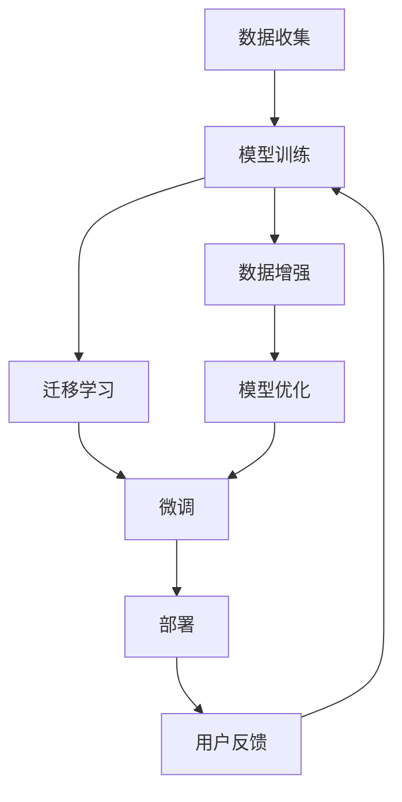

                 

# AI大模型创业：如何应对未来行业发展趋势？

随着人工智能技术的快速发展，大模型在众多行业中的应用越来越广泛。本文将深入探讨AI大模型创业面临的未来行业发展趋势，并提供应对策略。

## 1. 背景介绍

### 1.1 问题由来
近年来，AI大模型在各个领域的应用逐渐普及，从自然语言处理（NLP）到计算机视觉（CV），再到推荐系统和智能游戏，大模型已经成为许多公司技术栈的重要组成部分。然而，AI大模型的开发和维护并非易事，需要大量的计算资源和专业知识。同时，市场竞争加剧，如何在众多公司中脱颖而出，获得商业成功，成为一个重要问题。

### 1.2 问题核心关键点
AI大模型创业面临的核心挑战包括：

- 高昂的开发和维护成本
- 数据的获取和处理问题
- 模型的可解释性和可靠性
- 技术的快速迭代和升级

## 2. 核心概念与联系

### 2.1 核心概念概述

- **AI大模型**：指通过大规模数据训练获得的具有强大计算能力和通用性的大规模预训练模型，如BERT、GPT-3等。

- **迁移学习**：指将在大规模数据集上预训练的模型应用于特定领域或任务的过程，以提高模型在特定场景下的性能。

- **可解释性**：指模型的决策过程可以被理解和解释，以增加模型可信度和用户接受度。

- **可靠性**：指模型在各种数据和环境下都能保持一致的性能和行为。

- **持续学习**：指模型能够随着新数据的到来不断学习和更新，保持模型的时效性。

### 2.2 核心概念原理和架构的 Mermaid 流程图



## 3. 核心算法原理 & 具体操作步骤

### 3.1 算法原理概述

AI大模型的核心算法基于深度学习和迁移学习。在大规模数据上预训练的模型可以捕捉到丰富的语义和模式，然后通过迁移学习将这些知识应用到特定任务上，以提高模型的性能。同时，通过微调可以进一步优化模型，使其更适应特定领域的数据。

### 3.2 算法步骤详解

1. **数据收集和预处理**：收集大量的数据，并对其进行预处理，包括清洗、标注和归一化。

2. **模型训练**：在预处理后的数据上训练模型，通常使用Transformer等架构，以获得具有强大计算能力的模型。

3. **迁移学习**：将训练好的模型应用于特定领域或任务，以提高模型在该领域的性能。

4. **微调**：在特定任务的数据上微调模型，以进一步提高模型的性能。

5. **部署和监控**：将微调后的模型部署到生产环境中，并对其进行监控和优化。

### 3.3 算法优缺点

**优点**：

- 通过大规模数据训练，模型具有强大的计算能力和通用性。
- 迁移学习可以节省大量时间和计算资源。
- 微调可以进一步提高模型在特定任务上的性能。

**缺点**：

- 数据获取和处理成本高。
- 模型可解释性不足，难以解释其决策过程。
- 模型可靠性依赖于数据的质量和多样性。
- 持续学习需要不断获取新数据，以保持模型时效性。

### 3.4 算法应用领域

AI大模型在多个领域有广泛的应用，包括但不限于：

- 自然语言处理：如文本分类、情感分析、机器翻译等。
- 计算机视觉：如图像识别、目标检测、图像生成等。
- 推荐系统：如商品推荐、内容推荐等。
- 智能游戏：如自动博弈、虚拟现实等。

## 4. 数学模型和公式 & 详细讲解

### 4.1 数学模型构建

假设我们有一个大规模预训练模型 $M$，和一个特定任务 $T$，我们将 $M$ 应用到 $T$ 上，得到一个新的模型 $M_T$。通过迁移学习，我们可以将 $M_T$ 微调到特定任务的数据集 $D$ 上，得到最终模型 $M^*$。

### 4.2 公式推导过程

设 $M_T(x)$ 为模型 $M$ 在任务 $T$ 上的输出，$M^*(x)$ 为微调后的模型输出，$L(T, M^*)$ 为任务 $T$ 的损失函数，则微调过程的目标是最小化损失函数：

$$
\min_{\theta} L(T, M^*) = \min_{\theta} \frac{1}{N} \sum_{i=1}^{N} l(T(x_i), M^*(x_i))
$$

其中 $l$ 为损失函数，$N$ 为样本数量。

### 4.3 案例分析与讲解

以文本分类任务为例，我们可以使用BERT模型作为预训练模型，在特定领域的文本数据上进行微调，以提高模型在分类任务上的性能。在微调过程中，我们需要选择适当的损失函数，如交叉熵损失，并在训练过程中采用适当的正则化技术，如Dropout，以防止过拟合。

## 5. 项目实践：代码实例和详细解释说明

### 5.1 开发环境搭建

为了搭建一个AI大模型创业项目，我们需要安装以下环境：

1. 安装Python和PyTorch。
2. 安装相关库，如TensorFlow、Keras等。
3. 配置GPU或TPU，以便进行高效的模型训练。
4. 安装数据处理工具，如Pandas、NumPy等。

### 5.2 源代码详细实现

以下是使用PyTorch进行BERT模型微调的代码实现：

```python
import torch
import torch.nn as nn
import torch.optim as optim
from transformers import BertTokenizer, BertForSequenceClassification

# 定义模型
tokenizer = BertTokenizer.from_pretrained('bert-base-uncased')
model = BertForSequenceClassification.from_pretrained('bert-base-uncased', num_labels=2)

# 加载数据
train_dataset = ...
train_loader = ...

# 定义训练函数
def train_epoch(model, data_loader, optimizer, criterion):
    model.train()
    total_loss = 0
    for batch in data_loader:
        optimizer.zero_grad()
        input_ids = batch.input_ids.to(device)
        attention_mask = batch.attention_mask.to(device)
        labels = batch.labels.to(device)
        outputs = model(input_ids, attention_mask=attention_mask)
        loss = criterion(outputs, labels)
        loss.backward()
        optimizer.step()
        total_loss += loss.item()
    return total_loss / len(data_loader)

# 训练模型
optimizer = optim.AdamW(model.parameters(), lr=0.001)
criterion = nn.CrossEntropyLoss()
for epoch in range(num_epochs):
    train_loss = train_epoch(model, train_loader, optimizer, criterion)
    val_loss = evaluate(model, val_loader, criterion)
    print(f"Epoch {epoch+1}/{num_epochs}, Train Loss: {train_loss:.4f}, Val Loss: {val_loss:.4f}")
```

### 5.3 代码解读与分析

- **数据加载**：我们使用PyTorch的`DataLoader`来加载训练数据和验证数据。
- **模型定义**：我们使用`BertTokenizer`和`BertForSequenceClassification`来定义BERT模型和分类器。
- **训练函数**：在每个epoch中，我们进行前向传播和反向传播，更新模型参数。
- **模型优化**：我们使用AdamW优化器，并设置适当的学习率。
- **模型评估**：在每个epoch中，我们在验证集上进行评估，并记录损失值。

## 6. 实际应用场景

### 6.1 自然语言处理

在自然语言处理领域，AI大模型可以用于文本分类、情感分析、命名实体识别等任务。以情感分析为例，我们可以使用BERT模型在特定的情感分类数据集上进行微调，以提高模型在情感分类任务上的性能。

### 6.2 计算机视觉

在计算机视觉领域，AI大模型可以用于图像分类、目标检测、图像生成等任务。以图像分类为例，我们可以使用ResNet模型在特定的图像分类数据集上进行微调，以提高模型在图像分类任务上的性能。

### 6.3 推荐系统

在推荐系统领域，AI大模型可以用于商品推荐、内容推荐等任务。以商品推荐为例，我们可以使用BERT模型在特定的商品推荐数据集上进行微调，以提高模型在商品推荐任务上的性能。

## 7. 工具和资源推荐

### 7.1 学习资源推荐

为了帮助开发者掌握AI大模型的开发和应用，以下是一些推荐的学习资源：

1. 《深度学习》课程（Coursera）
2. 《TensorFlow官方文档》
3. 《PyTorch官方文档》
4. 《自然语言处理与深度学习》（Ian Goodfellow等著）

### 7.2 开发工具推荐

以下是一些常用的开发工具：

1. PyTorch：用于深度学习模型训练和推理。
2. TensorFlow：用于深度学习模型训练和推理。
3. Keras：用于快速搭建和训练深度学习模型。
4. Jupyter Notebook：用于数据探索和模型训练。
5. Google Colab：用于快速搭建和训练深度学习模型。

### 7.3 相关论文推荐

以下是一些重要的相关论文：

1. 《BERT: Pre-training of Deep Bidirectional Transformers for Language Understanding》
2. 《Attention is All You Need》
3. 《Language Models are Unsupervised Multitask Learners》

## 8. 总结：未来发展趋势与挑战

### 8.1 研究成果总结

AI大模型已经在自然语言处理、计算机视觉、推荐系统等多个领域取得了显著进展，其应用前景广阔。未来，AI大模型的应用将更加普及和深入，将成为各行各业的重要技术基础。

### 8.2 未来发展趋势

1. 模型规模继续增大：未来AI大模型的参数量将继续增加，以获得更丰富的语义和模式。
2. 迁移学习和微调技术的不断进步：迁移学习和微调技术将不断改进，以提高模型的性能和泛化能力。
3. 模型可解释性和可靠性提升：未来将会有更多研究致力于提高模型的可解释性和可靠性，增加用户接受度。
4. 持续学习和在线优化：未来模型将能够持续学习和在线优化，保持模型时效性。

### 8.3 面临的挑战

1. 高昂的开发和维护成本：AI大模型的开发和维护需要大量的计算资源和专业知识。
2. 数据获取和处理问题：获取和处理高质量的数据需要大量的投入。
3. 模型的可解释性和可靠性：模型的决策过程难以解释，且在复杂环境中表现不稳定。
4. 持续学习需要不断获取新数据：模型需要不断获取新数据，以保持模型时效性。

### 8.4 研究展望

未来研究需要从以下几个方面进行突破：

1. 探索更多的迁移学习和微调方法，以提高模型的性能和泛化能力。
2. 提高模型的可解释性和可靠性，增加用户接受度。
3. 探索新的数据获取和处理技术，降低开发和维护成本。
4. 研究新的持续学习和在线优化技术，保持模型时效性。

## 9. 附录：常见问题与解答

**Q1：AI大模型的开发和维护成本高，如何解决？**

A: 可以通过采用开源模型、云计算等技术降低开发成本。同时，可以通过数据增强、模型压缩等技术降低维护成本。

**Q2：如何提高AI大模型的可解释性？**

A: 可以通过引入可解释性模型、特征可视化等技术提高模型的可解释性。同时，可以通过增加模型训练数据的多样性，提高模型在复杂环境下的表现。

**Q3：AI大模型在复杂环境中表现不稳定，如何解决？**

A: 可以通过增加数据的多样性和数量，提高模型的泛化能力。同时，可以通过引入因果推理、对抗训练等技术，提高模型的稳定性和鲁棒性。

**Q4：AI大模型的迁移学习和微调效果不佳，如何解决？**

A: 可以通过选择更合适的损失函数、正则化技术等改进迁移学习和微调方法。同时，可以通过增加训练数据的多样性和数量，提高模型的泛化能力。

**Q5：AI大模型的持续学习和在线优化效果不佳，如何解决？**

A: 可以通过引入增量学习、在线优化等技术改进模型的持续学习性能。同时，可以通过增加模型训练数据的多样性和数量，提高模型的泛化能力。

---

作者：禅与计算机程序设计艺术 / Zen and the Art of Computer Programming

