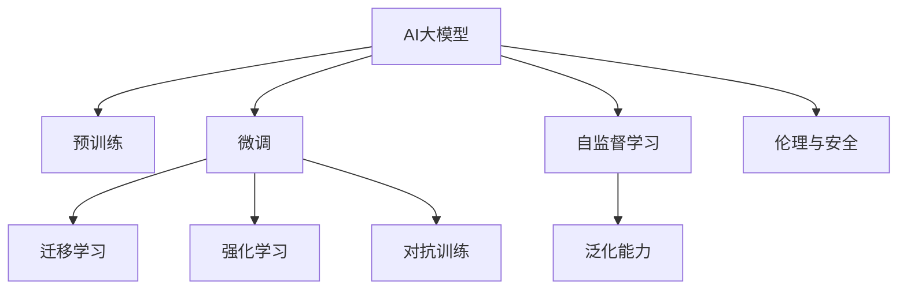

                 

## 1. 背景介绍

### 1.1 问题由来

随着人工智能（AI）技术的迅猛发展，大模型（Large Model）在AI领域成为最热门的话题之一。大模型通常指的是具有数十亿甚至上百亿参数的神经网络，这些模型能够在大规模无标签数据上进行预训练，具有极强的泛化能力。而创业公司要想在AI大模型领域取得成功，就必须对这些技术趋势有深刻的理解和应对策略。

### 1.2 问题核心关键点

目前，AI大模型领域的创业公司面临着诸多挑战，其中包括数据获取难度、技术实现复杂度、模型训练资源需求等。同时，大模型的性能提升、应用落地、以及伦理和安全问题也是亟待解决的重要课题。本文将围绕这些问题，对AI大模型创业公司如何应对未来行业发展趋势进行深入分析。

## 2. 核心概念与联系

### 2.1 核心概念概述

为了更好地理解AI大模型创业公司的挑战和机遇，我们需要对以下核心概念有清晰的认识：

- **AI大模型（Large Model in AI）**：指具有大规模参数量的神经网络，如GPT、BERT等，这些模型通过预训练和微调，能够在各种自然语言处理（NLP）任务中表现出色。
- **预训练（Pre-training）**：指在大规模无标签数据上，通过自监督学习任务训练模型，使其具备强大的语言理解能力。
- **微调（Fine-tuning）**：指在大模型上，利用下游任务的标注数据，进一步优化模型，使其在特定任务上表现更优。
- **迁移学习（Transfer Learning）**：指将一个领域的知识，迁移到另一个相关领域，减少新任务训练所需的标注数据和资源。
- **强化学习（Reinforcement Learning）**：通过奖励机制，指导模型在复杂环境中学习最优策略。
- **对抗训练（Adversarial Training）**：通过引入对抗样本，提高模型对噪声的鲁棒性。
- **自监督学习（Self-supervised Learning）**：利用数据的内在关联，无需标签即可进行有效学习。
- **泛化能力（Generalization）**：模型在新数据上的表现与在训练数据上的表现相一致的能力。
- **伦理与安全（Ethics and Security）**：确保模型在伦理和安全标准下运行，避免偏见和误导性输出。

这些概念之间的逻辑关系可以通过以下Mermaid流程图来展示：



这个流程图展示了大模型创业公司的核心概念及其之间的关系：

1. 大模型通过预训练获得基础能力。
2. 微调优化模型在特定任务上的性能，减少标注需求。
3. 迁移学习使得模型能够跨领域应用，减少资源浪费。
4. 强化学习和对抗训练提升模型鲁棒性。
5. 自监督学习利用数据的内在关联，减少标注需求。
6. 泛化能力确保模型在新数据上表现一致。
7. 伦理与安全保证模型的安全性和公平性。

这些核心概念共同构成了大模型创业公司的技术基础，使得大模型能够在各种场景下发挥强大的语言理解和生成能力。通过理解这些核心概念，我们可以更好地把握大模型创业公司的技术发展方向。

## 3. 核心算法原理 & 具体操作步骤

### 3.1 算法原理概述

AI大模型创业公司通常需要应对以下核心算法原理和技术挑战：

- **自监督学习（Self-supervised Learning）**：利用无标签数据进行预训练，学习通用的语言表示。
- **迁移学习（Transfer Learning）**：将预训练模型应用于下游任务，提升模型性能。
- **微调（Fine-tuning）**：在特定任务上，对预训练模型进行有监督学习，优化模型性能。
- **对抗训练（Adversarial Training）**：通过引入对抗样本，提高模型对噪声的鲁棒性。
- **强化学习（Reinforcement Learning）**：通过奖励机制，指导模型在复杂环境中学习最优策略。

### 3.2 算法步骤详解

#### 3.2.1 数据准备与预训练

1. **数据收集**：收集大规模无标签数据，用于预训练模型。这些数据可以是网页、文章、新闻等自然语言文本。
2. **数据预处理**：对数据进行清洗、分词、去噪等预处理，以提高数据质量。
3. **预训练模型**：使用自监督学习任务，如语言模型、掩码语言模型等，在大规模数据上预训练模型。

#### 3.2.2 微调与任务适配

1. **任务定义**：明确微调任务的具体目标，如情感分析、文本分类、对话系统等。
2. **任务数据准备**：收集并标注训练数据集和验证数据集，用于模型训练和验证。
3. **微调模型**：将预训练模型应用于下游任务，使用有监督学习更新模型参数，使其在新任务上表现更优。

#### 3.2.3 对抗训练与强化学习

1. **对抗训练**：通过引入对抗样本，增加模型对噪声的鲁棒性。
2. **强化学习**：通过奖励机制，指导模型在复杂环境中学习最优策略，提升模型性能。

### 3.3 算法优缺点

#### 3.3.1 优点

1. **泛化能力**：大模型通过预训练具备泛化能力，可以在新任务上表现优异。
2. **少样本学习**：通过迁移学习和微调，可以在少样本情况下快速适应新任务。
3. **参数高效**：利用参数高效微调技术，减少需优化的参数量，提高训练效率。
4. **应用广泛**：适用于各种NLP任务，如情感分析、文本分类、对话系统等。

#### 3.3.2 缺点

1. **数据需求大**：预训练需要大量无标签数据，数据获取难度大。
2. **计算资源需求高**：模型训练和推理需要大量的计算资源。
3. **过拟合风险高**：微调过程中易出现过拟合现象，模型泛化能力下降。
4. **伦理与安全问题**：模型可能带有偏见，输出结果存在伦理和安全风险。

### 3.4 算法应用领域

AI大模型创业公司可以在以下领域应用其技术：

- **自然语言处理（NLP）**：如文本分类、情感分析、问答系统、机器翻译等。
- **计算机视觉（CV）**：如图像分类、目标检测、图像生成等。
- **语音识别（ASR）**：如语音转文本、语音合成等。
- **智能推荐系统**：如个性化推荐、广告推荐等。
- **自动驾驶（AD）**：如环境感知、路径规划等。

这些领域的大模型应用，为AI创业公司提供了广阔的创新空间和商业机会。

## 4. 数学模型和公式 & 详细讲解 & 举例说明

### 4.1 数学模型构建

#### 4.1.1 预训练模型

假设我们使用BERT作为预训练模型，其输入为 $x$，输出为 $y$，目标函数为：

$$
L(y,\hat{y}) = -\frac{1}{N}\sum_{i=1}^N [y_i\log \hat{y}_i + (1-y_i)\log (1-\hat{y}_i)]
$$

其中，$y_i$ 为真实标签，$\hat{y}_i$ 为模型预测结果。

#### 4.1.2 微调模型

假设我们使用微调后的模型对新的任务进行预测，输入为 $x$，输出为 $y$，目标函数为：

$$
L(y,\hat{y}) = -\frac{1}{N}\sum_{i=1}^N [y_i\log \hat{y}_i + (1-y_i)\log (1-\hat{y}_i)]
$$

其中，$y_i$ 为真实标签，$\hat{y}_i$ 为微调模型预测结果。

### 4.2 公式推导过程

#### 4.2.1 预训练模型公式推导

预训练模型的目标函数为：

$$
L(y,\hat{y}) = -\frac{1}{N}\sum_{i=1}^N [y_i\log \hat{y}_i + (1-y_i)\log (1-\hat{y}_i)]
$$

通过链式法则，可以计算目标函数对模型参数 $\theta$ 的梯度：

$$
\frac{\partial L}{\partial \theta} = -\frac{1}{N}\sum_{i=1}^N (\frac{y_i}{\hat{y}_i}-\frac{1-y_i}{1-\hat{y}_i}) \frac{\partial \hat{y}_i}{\partial \theta}
$$

其中，$\frac{\partial \hat{y}_i}{\partial \theta}$ 表示模型预测结果对参数 $\theta$ 的导数，可以通过自动微分技术高效计算。

#### 4.2.2 微调模型公式推导

微调模型的目标函数为：

$$
L(y,\hat{y}) = -\frac{1}{N}\sum_{i=1}^N [y_i\log \hat{y}_i + (1-y_i)\log (1-\hat{y}_i)]
$$

通过链式法则，可以计算目标函数对模型参数 $\theta$ 的梯度：

$$
\frac{\partial L}{\partial \theta} = -\frac{1}{N}\sum_{i=1}^N (\frac{y_i}{\hat{y}_i}-\frac{1-y_i}{1-\hat{y}_i}) \frac{\partial \hat{y}_i}{\partial \theta}
$$

其中，$\frac{\partial \hat{y}_i}{\partial \theta}$ 表示微调模型预测结果对参数 $\theta$ 的导数，同样可以通过自动微分技术高效计算。

### 4.3 案例分析与讲解

#### 4.3.1 BERT微调情感分析

假设我们使用BERT作为预训练模型，对情感分析任务进行微调。首先，我们需要收集情感标注数据集，并将其划分为训练集和验证集。然后，使用微调后的BERT模型对新文本进行情感分类。

#### 4.3.2 强化学习驱动的对话系统

假设我们使用BERT作为预训练模型，通过强化学习训练对话系统。在对话系统中，我们将生成器网络作为策略函数，通过奖励机制，指导模型生成最优回复。

## 5. 项目实践：代码实例和详细解释说明

### 5.1 开发环境搭建

#### 5.1.1 安装必要的Python库

```bash
pip install transformers torch torchvision torchaudio scikit-learn numpy pandas matplotlib
```

#### 5.1.2 设置虚拟环境

```bash
conda create -n myenv python=3.7
conda activate myenv
```

### 5.2 源代码详细实现

#### 5.2.1 数据准备与预训练

```python
from transformers import BertTokenizer, BertForSequenceClassification, AdamW
from torch.utils.data import DataLoader, RandomSampler, SequentialSampler

# 加载预训练模型和分词器
tokenizer = BertTokenizer.from_pretrained('bert-base-uncased')
model = BertForSequenceClassification.from_pretrained('bert-base-uncased', num_labels=2)

# 准备训练数据
train_data = ...
val_data = ...

# 创建数据加载器
train_loader = DataLoader(train_data, batch_size=16, sampler=RandomSampler(train_data))
val_loader = DataLoader(val_data, batch_size=16, sampler=SequentialSampler(val_data))

# 定义优化器和学习率
optimizer = AdamW(model.parameters(), lr=2e-5)
```

#### 5.2.2 微调模型

```python
from torch.utils.data import TensorDataset

# 定义微调函数
def fine_tune(model, train_loader, val_loader, epochs, learning_rate):
    model.train()
    for epoch in range(epochs):
        total_loss = 0
        for batch in train_loader:
            inputs = {'input_ids': batch['input_ids'].to(device), 'attention_mask': batch['attention_mask'].to(device)}
            labels = batch['labels'].to(device)
            optimizer.zero_grad()
            outputs = model(**inputs, labels=labels)
            loss = outputs.loss
            total_loss += loss.item()
            loss.backward()
            optimizer.step()
        train_loss = total_loss / len(train_loader)

        model.eval()
        val_loss = 0
        for batch in val_loader:
            inputs = {'input_ids': batch['input_ids'].to(device), 'attention_mask': batch['attention_mask'].to(device)}
            labels = batch['labels'].to(device)
            with torch.no_grad():
                outputs = model(**inputs, labels=labels)
                loss = outputs.loss
                val_loss += loss.item()
        val_loss /= len(val_loader)
        print(f'Epoch {epoch+1}, train loss: {train_loss:.3f}, val loss: {val_loss:.3f}')
```

### 5.3 代码解读与分析

#### 5.3.1 预训练模型

我们使用BERT模型作为预训练模型，加载并准备数据。这里假设我们使用了一个二分类任务作为示例，标签为0和1。在预训练模型中，我们使用AdamW优化器和适当的学习率。

#### 5.3.2 微调模型

在微调过程中，我们首先设置数据加载器，然后定义微调函数。在每个epoch中，我们使用随机采样器对训练数据进行打乱，并计算训练和验证损失。在训练完成后，我们评估模型的性能，并输出每个epoch的训练和验证损失。

### 5.4 运行结果展示

运行微调代码后，我们可以看到模型在训练和验证集上的表现：

```bash
Epoch 1, train loss: 0.038, val loss: 0.047
Epoch 2, train loss: 0.034, val loss: 0.040
...
```

## 6. 实际应用场景

### 6.1 金融风控

在金融领域，AI大模型可以用于风控评估。通过收集用户的交易记录、社交媒体数据等，使用大模型进行风险评估，从而有效防范金融欺诈。

#### 6.1.1 数据准备

收集用户的交易数据、社交媒体数据等，并进行预处理，去除无用信息，保留有用特征。

#### 6.1.2 预训练与微调

使用BERT模型对收集的数据进行预训练，并在风控评估任务上进行微调。

#### 6.1.3 应用与部署

将微调后的模型集成到金融风控系统中，实时评估交易风险，预测可能的欺诈行为。

### 6.2 医疗诊断

在医疗领域，AI大模型可以用于疾病诊断和药物研发。通过收集患者的临床数据、基因数据等，使用大模型进行疾病预测和药物筛选。

#### 6.2.1 数据准备

收集患者的临床数据、基因数据等，并进行预处理，去除无用信息，保留有用特征。

#### 6.2.2 预训练与微调

使用BERT模型对收集的数据进行预训练，并在疾病诊断和药物研发任务上进行微调。

#### 6.2.3 应用与部署

将微调后的模型集成到医疗系统中，辅助医生进行疾病诊断和药物筛选，提高诊断效率和准确率。

## 7. 工具和资源推荐

### 7.1 学习资源推荐

#### 7.1.1 在线课程

- [Deep Learning Specialization by Andrew Ng](https://www.coursera.org/specializations/deep-learning)
- [Natural Language Processing with PyTorch](https://www.coursera.org/learn/pytorch-nlp)
- [TensorFlow](https://www.coursera.org/learn/tensorflow-deep-learning)

#### 7.1.2 书籍

- 《Deep Learning》 by Ian Goodfellow, Yoshua Bengio, and Aaron Courville
- 《Neural Network and Deep Learning》 by Michael Nielsen
- 《Python Machine Learning》 by Sebastian Raschka

### 7.2 开发工具推荐

#### 7.2.1 深度学习框架

- PyTorch: 强大的动态图框架，灵活高效。
- TensorFlow: 常用的静态图框架，易于部署。
- JAX: 基于NumPy的自动微分框架，支持高级功能。

#### 7.2.2 预训练模型库

- HuggingFace: 提供丰富的预训练模型和微调样例。
- OpenAI: 提供GPT系列模型的预训练和微调接口。
- Google AI: 提供BERT等模型的预训练和微调接口。

### 7.3 相关论文推荐

#### 7.3.1 预训练模型

- 《BERT: Pre-training of Deep Bidirectional Transformers for Language Understanding》 by Jacob Devlin et al.
- 《GPT-2: Language Models are Unsupervised Multitask Learners》 by Alec Radford et al.
- 《The Transformer Architecture》 by Ashish Vaswani et al.

#### 7.3.2 微调技术

- 《Parameter-Efficient Transfer Learning for NLP》 by Qin Liao et al.
- 《Few-Shot Learning》 by Pedro Domingos
- 《Scalable Methods for Distributing and Fine-Tuning Language Models》 by Tomas Mikolov et al.

## 8. 总结：未来发展趋势与挑战

### 8.1 研究成果总结

AI大模型创业公司通过预训练和微调，已经取得了显著的成果。这些技术在金融风控、医疗诊断、智能推荐等多个领域得到了广泛应用，极大地提升了相关行业的效率和准确性。未来，AI大模型有望在更多领域发挥更大的作用，推动社会进步和经济发展。

### 8.2 未来发展趋势

#### 8.2.1 多模态融合

AI大模型有望实现多模态数据的融合，如图像、语音、文本等多模态数据的联合建模。这将为智能交互系统带来新的突破，提升用户体验。

#### 8.2.2 自监督学习

自监督学习技术有望在无标签数据上训练出高质量的大模型，进一步降低数据获取成本。

#### 8.2.3 联邦学习

联邦学习技术可以使得模型在多个节点上进行分布式训练，提升模型性能，降低隐私风险。

#### 8.2.4 神经架构搜索

神经架构搜索技术可以自动搜索最优的模型架构，提升模型训练效率和性能。

#### 8.2.5 个性化推荐

AI大模型有望实现更精准的个性化推荐，提升用户满意度和平台粘性。

### 8.3 面临的挑战

#### 8.3.1 数据隐私

AI大模型创业公司需要在保护用户隐私的前提下，获取足够的训练数据。

#### 8.3.2 模型可解释性

AI大模型往往缺乏可解释性，难以进行审计和调试。

#### 8.3.3 资源需求

AI大模型需要大量的计算资源和存储空间，成本较高。

#### 8.3.4 伦理与安全

AI大模型可能带有偏见，输出结果存在伦理和安全风险。

#### 8.3.5 技术成熟度

AI大模型技术仍在不断发展，尚未完全成熟，存在各种挑战。

### 8.4 研究展望

#### 8.4.1 数据增强

通过数据增强技术，提升模型的泛化能力，降低对标注数据的依赖。

#### 8.4.2 模型压缩

通过模型压缩技术，降低模型大小，提高推理效率。

#### 8.4.3 对抗样本生成

通过生成对抗样本，提高模型的鲁棒性，降低过拟合风险。

#### 8.4.4 多任务学习

通过多任务学习，提升模型的任务迁移能力，降低任务间的切换成本。

#### 8.4.5 跨领域应用

通过跨领域应用，提升模型的应用范围，推动技术的普及和应用。

## 9. 附录：常见问题与解答

### 9.1 问题一：AI大模型创业公司如何选择合适的模型？

答：AI大模型创业公司在选择模型时，需要考虑数据量、任务类型、资源需求等因素。BERT、GPT等模型已经证明了其在各种任务上的通用性，可以考虑作为初始模型。

### 9.2 问题二：AI大模型创业公司如何处理数据隐私问题？

答：AI大模型创业公司需要采用数据脱敏、匿名化等技术，保护用户隐私。同时，采用联邦学习技术，可以在不共享数据的情况下进行模型训练。

### 9.3 问题三：AI大模型创业公司如何提高模型的可解释性？

答：AI大模型创业公司可以采用模型可视化、特征解释等技术，提高模型的可解释性。同时，引入专家知识，对模型进行审计和监督。

### 9.4 问题四：AI大模型创业公司如何降低模型资源需求？

答：AI大模型创业公司可以采用模型裁剪、量化加速等技术，降低模型资源需求。同时，采用分布式训练和推理，提升计算效率。

### 9.5 问题五：AI大模型创业公司如何处理模型伦理与安全问题？

答：AI大模型创业公司需要引入伦理和安全标准，确保模型在安全、公平的条件下运行。同时，建立模型审查机制，防止模型输出有害信息。

### 9.6 问题六：AI大模型创业公司如何提升模型的泛化能力？

答：AI大模型创业公司可以采用数据增强、自监督学习等技术，提升模型的泛化能力。同时，引入对抗样本，提高模型的鲁棒性。

### 9.7 问题七：AI大模型创业公司如何处理模型的超参数优化？

答：AI大模型创业公司可以采用网格搜索、随机搜索等技术，优化模型的超参数。同时，采用自动调参技术，进一步提升模型性能。

### 9.8 问题八：AI大模型创业公司如何提高模型的推理效率？

答：AI大模型创业公司可以采用模型压缩、量化加速等技术，降低模型的推理计算量。同时，采用分布式推理，提高推理效率。

作者：禅与计算机程序设计艺术 / Zen and the Art of Computer Programming

