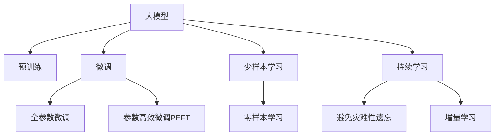
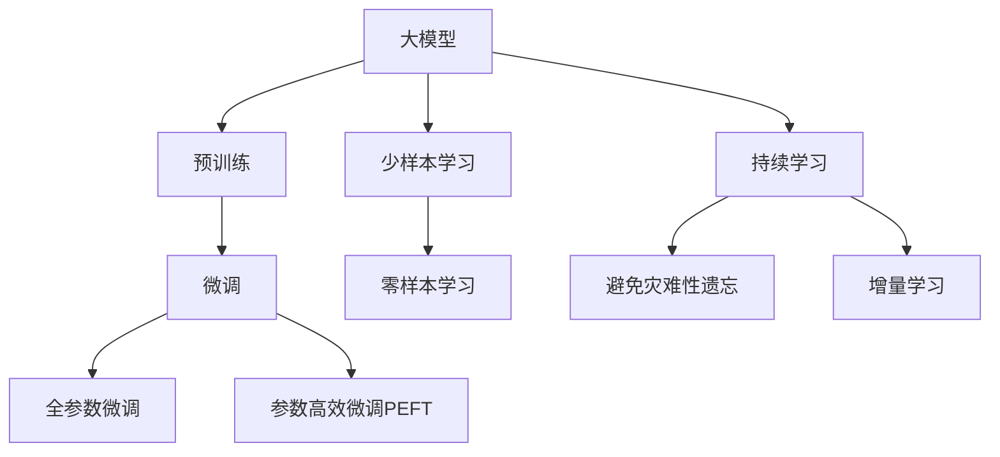

                 

# AI大模型创业：如何打造未来爆款应用？

## 1. 背景介绍

在人工智能领域，大模型的发展和应用正处于一个快速变革的时期。大模型，尤其是深度学习模型，凭借其庞大的参数量、出色的泛化能力和丰富的语义理解能力，已经在许多领域取得了显著成果。然而，要充分利用大模型推动企业创新和商业化应用，仅仅掌握模型本身的技术细节是远远不够的。创业者和企业需要在理解模型原理的基础上，制定合适的策略，把握技术发展趋势，才能打造出真正具有市场竞争力的AI大模型应用。

### 1.1 问题的由来
随着技术的不断进步，AI大模型在医疗、金融、教育、智能家居等多个领域展示了巨大的潜力。例如，基于GPT、BERT等模型构建的智能客服系统、文本生成助手、智能推荐系统等，已经在各行各业落地应用，极大提升了业务效率和用户体验。但大模型的成功应用需要基于对模型的深入理解和有策略性的商业部署。

### 1.2 问题的核心关键点
打造AI大模型应用的关键点包括：
- **市场需求的洞察**：识别潜在市场需求，理解用户痛点。
- **技术积累与创新**：掌握AI大模型核心技术，进行针对性改进和优化。
- **商业模式设计**：设计合理的盈利模式和价值链，确保应用的可持续性和盈利能力。
- **用户体验设计**：设计良好的用户界面和交互体验，提升用户满意度。
- **数据与资源获取**：获取高质量的训练数据和计算资源，支持模型训练与优化。
- **落地部署**：选择合适的平台和工具，实现模型的高效部署和应用。

## 2. 核心概念与联系

### 2.1 核心概念概述
在AI大模型应用的开发过程中，需要关注以下核心概念：

- **大模型（Large Model）**：指使用大规模神经网络进行训练的深度学习模型，如BERT、GPT、T5等。
- **预训练（Pre-training）**：指在大规模无标签数据上训练模型，使其具备丰富的语言知识和语义理解能力。
- **微调（Fine-tuning）**：指在大模型基础上，使用少量有标签数据进行任务特定的训练，使其适应特定任务需求。
- **迁移学习（Transfer Learning）**：指在大模型预训练的基础上，通过微调实现模型的任务适应，提升模型在新任务上的性能。
- **参数高效微调（Parameter-Efficient Fine-tuning, PEFT）**：指在微调过程中，只更新部分参数，保持模型的大部分预训练权重不变，以提高效率。
- **少样本学习（Few-shot Learning）**：指在极少量的有标签数据上，模型仍能学习并生成高质量输出。
- **零样本学习（Zero-shot Learning）**：指模型在没有看到任何训练样本的情况下，仅通过任务描述即可执行新任务。
- **持续学习（Continual Learning）**：指模型能够持续学习新数据，同时保留旧知识，以适应不断变化的数据分布。

这些概念之间的逻辑关系可以通过以下Mermaid流程图来展示：



### 2.2 核心概念原理和架构的 Mermaid 流程图

由于Mermaid不支持嵌套节点，我们将核心概念与联系分开呈现。



## 3. 核心算法原理 & 具体操作步骤

### 3.1 算法原理概述

基于大模型的AI应用开发，本质上是一个有监督的迁移学习过程。其核心思想是：在大模型预训练的基础上，通过微调，使模型能够适应特定任务的需求，提升模型的性能。

### 3.2 算法步骤详解

AI大模型应用开发通常包括以下几个关键步骤：

**Step 1: 确定目标任务与数据集**
- 定义要解决的具体任务，如智能客服、文本生成、情感分析等。
- 收集相关的训练数据和测试数据，数据集应具有代表性，覆盖任务的多样性和复杂性。

**Step 2: 选择大模型与微调方法**
- 选择合适的大模型作为基础，如BERT、GPT等。
- 根据任务特点，选择适当的微调方法，如全参数微调、参数高效微调等。

**Step 3: 设计任务适配层**
- 根据任务类型，设计任务特定的适配层，如分类器、解码器等。
- 确定模型的输出格式和损失函数。

**Step 4: 设置微调超参数**
- 选择合适的优化器（如AdamW、SGD），设置学习率、批大小、迭代轮数等。
- 设定正则化技术（如L2正则、Dropout、Early Stopping等）。
- 确定冻结预训练参数的策略，如仅微调顶层，或全部参数都参与微调。

**Step 5: 执行梯度训练**
- 将训练集数据分批次输入模型，前向传播计算损失函数。
- 反向传播计算参数梯度，根据设定的优化算法和学习率更新模型参数。
- 周期性在验证集上评估模型性能，根据性能指标决定是否触发Early Stopping。
- 重复上述步骤直到满足预设的迭代轮数或Early Stopping条件。

**Step 6: 测试和部署**
- 在测试集上评估微调后模型，对比微调前后的精度提升。
- 使用微调后的模型对新样本进行推理预测，集成到实际的应用系统中。
- 持续收集新的数据，定期重新微调模型，以适应数据分布的变化。

### 3.3 算法优缺点

**优点**：
- 快速迭代：基于大模型的微调可以大大加速模型训练，缩短产品开发周期。
- 性能提升：通过微调，模型能够适应特定任务，提升模型的性能。
- 泛化能力强：预训练模型在多个任务上表现良好，能够进行跨领域迁移学习。

**缺点**：
- 数据依赖：微调效果很大程度上取决于标注数据的质量和数量，获取高质量标注数据的成本较高。
- 过度拟合风险：预训练模型的固有偏见、有害信息等可能通过微调传递到下游任务，造成负面影响。
- 模型复杂度：大模型的复杂度较高，需要较大的计算资源和存储资源，对硬件要求高。

### 3.4 算法应用领域

基于大模型的AI应用在多个领域得到了广泛应用，包括但不限于：

- **医疗健康**：智能诊断、健康咨询、疾病预测等。
- **金融服务**：金融风险评估、智能投顾、客户服务等。
- **教育培训**：个性化推荐、智能批改、学习路径规划等。
- **零售电商**：智能推荐、客户服务、产品搜索等。
- **智能制造**：质量检测、设备维护、供应链管理等。
- **娱乐媒体**：内容生成、智能推荐、用户互动等。

## 4. 数学模型和公式 & 详细讲解 & 举例说明

### 4.1 数学模型构建

假设预训练语言模型为 $M_{\theta}$，其中 $\theta$ 为预训练得到的模型参数。对于分类任务，假设训练集为 $D=\{(x_i, y_i)\}_{i=1}^N, x_i \in \mathcal{X}, y_i \in \{0,1\}$。

定义模型 $M_{\theta}$ 在输入 $x$ 上的输出为 $\hat{y}=M_{\theta}(x) \in [0,1]$，表示样本属于正类的概率。则二分类交叉熵损失函数定义为：

$$
\ell(M_{\theta}(x),y) = -[y\log \hat{y} + (1-y)\log (1-\hat{y})]
$$

将其代入经验风险公式，得：

$$
\mathcal{L}(\theta) = -\frac{1}{N}\sum_{i=1}^N [y_i\log M_{\theta}(x_i)+(1-y_i)\log(1-M_{\theta}(x_i))]
$$

在实践中，我们通常使用基于梯度的优化算法（如SGD、Adam等）来近似求解上述最优化问题。设 $\eta$ 为学习率，$\lambda$ 为正则化系数，则参数的更新公式为：

$$
\theta \leftarrow \theta - \eta \nabla_{\theta}\mathcal{L}(\theta) - \eta\lambda\theta
$$

其中 $\nabla_{\theta}\mathcal{L}(\theta)$ 为损失函数对参数 $\theta$ 的梯度，可通过反向传播算法高效计算。

### 4.2 公式推导过程

以二分类任务为例，推导交叉熵损失函数及其梯度的计算公式。

假设模型 $M_{\theta}$ 在输入 $x$ 上的输出为 $\hat{y}=M_{\theta}(x) \in [0,1]$，表示样本属于正类的概率。真实标签 $y \in \{0,1\}$。则二分类交叉熵损失函数定义为：

$$
\ell(M_{\theta}(x),y) = -[y\log \hat{y} + (1-y)\log (1-\hat{y})]
$$

将其代入经验风险公式，得：

$$
\mathcal{L}(\theta) = -\frac{1}{N}\sum_{i=1}^N [y_i\log M_{\theta}(x_i)+(1-y_i)\log(1-M_{\theta}(x_i))]
$$

根据链式法则，损失函数对参数 $\theta_k$ 的梯度为：

$$
\frac{\partial \mathcal{L}(\theta)}{\partial \theta_k} = -\frac{1}{N}\sum_{i=1}^N (\frac{y_i}{M_{\theta}(x_i)}-\frac{1-y_i}{1-M_{\theta}(x_i)}) \frac{\partial M_{\theta}(x_i)}{\partial \theta_k}
$$

其中 $\frac{\partial M_{\theta}(x_i)}{\partial \theta_k}$ 可进一步递归展开，利用自动微分技术完成计算。

### 4.3 案例分析与讲解

以文本分类任务为例，说明如何使用BERT模型进行微调。

假设我们有标注数据集 $D=\{(x_i, y_i)\}_{i=1}^N$，其中 $x_i$ 为文本，$y_i$ 为分类标签。我们使用BERT模型进行微调，步骤如下：

1. 加载BERT模型和数据集：
```python
from transformers import BertTokenizer, BertForSequenceClassification
import torch

tokenizer = BertTokenizer.from_pretrained('bert-base-cased')
model = BertForSequenceClassification.from_pretrained('bert-base-cased', num_labels=2)

train_dataset = ...
dev_dataset = ...
test_dataset = ...
```

2. 定义损失函数和优化器：
```python
from torch.nn import CrossEntropyLoss
from torch.optim import AdamW

criterion = CrossEntropyLoss()
optimizer = AdamW(model.parameters(), lr=2e-5)
```

3. 定义训练函数：
```python
def train_epoch(model, dataset, batch_size, optimizer):
    dataloader = DataLoader(dataset, batch_size=batch_size, shuffle=True)
    model.train()
    epoch_loss = 0
    for batch in dataloader:
        inputs, labels = batch
        inputs = tokenizer(inputs, return_tensors='pt', padding=True, truncation=True).to(device)
        labels = labels.to(device)
        outputs = model(**inputs)
        loss = criterion(outputs.logits, labels)
        epoch_loss += loss.item()
        optimizer.zero_grad()
        loss.backward()
        optimizer.step()
    return epoch_loss / len(dataloader)
```

4. 训练和评估：
```python
epochs = 5
batch_size = 16

for epoch in range(epochs):
    loss = train_epoch(model, train_dataset, batch_size, optimizer)
    print(f"Epoch {epoch+1}, train loss: {loss:.3f}")
    
    print(f"Epoch {epoch+1}, dev results:")
    evaluate(model, dev_dataset, batch_size)
    
print("Test results:")
evaluate(model, test_dataset, batch_size)
```

以上代码展示了如何使用BERT模型进行文本分类任务的微调。通过加载模型和数据集，定义损失函数和优化器，以及编写训练函数，最终在测试集上评估模型的性能。

## 5. 项目实践：代码实例和详细解释说明

### 5.1 开发环境搭建

在进行AI大模型应用开发前，需要准备以下开发环境：

1. 安装Python：从官网下载安装Python，并设置环境变量。
2. 安装Pip：使用pip安装Python包管理工具。
3. 安装相关库：
```bash
pip install torch torchvision torchaudio transformers
```
4. 安装Git：从官网下载安装Git，并配置本地仓库。
5. 安装Jupyter Notebook：使用pip安装Jupyter Notebook，打开命令行输入 `jupyter notebook` 启动服务。

完成以上步骤后，即可开始AI大模型应用的开发。

### 5.2 源代码详细实现

我们以智能客服系统为例，说明如何基于BERT模型进行微调。

1. 数据准备：
```python
from transformers import BertTokenizer, BertForSequenceClassification
import torch

tokenizer = BertTokenizer.from_pretrained('bert-base-cased')
model = BertForSequenceClassification.from_pretrained('bert-base-cased', num_labels=2)

train_dataset = ...
dev_dataset = ...
test_dataset = ...
```

2. 定义训练函数：
```python
def train_epoch(model, dataset, batch_size, optimizer):
    dataloader = DataLoader(dataset, batch_size=batch_size, shuffle=True)
    model.train()
    epoch_loss = 0
    for batch in dataloader:
        inputs, labels = batch
        inputs = tokenizer(inputs, return_tensors='pt', padding=True, truncation=True).to(device)
        labels = labels.to(device)
        outputs = model(**inputs)
        loss = criterion(outputs.logits, labels)
        epoch_loss += loss.item()
        optimizer.zero_grad()
        loss.backward()
        optimizer.step()
    return epoch_loss / len(dataloader)
```

3. 训练和评估：
```python
epochs = 5
batch_size = 16

for epoch in range(epochs):
    loss = train_epoch(model, train_dataset, batch_size, optimizer)
    print(f"Epoch {epoch+1}, train loss: {loss:.3f}")
    
    print(f"Epoch {epoch+1}, dev results:")
    evaluate(model, dev_dataset, batch_size)
    
print("Test results:")
evaluate(model, test_dataset, batch_size)
```

### 5.3 代码解读与分析

以下是代码的详细解读：

1. `BertTokenizer` 和 `BertForSequenceClassification`：用于加载预训练的BERT模型和数据集，并进行分词和预测。
2. `train_epoch` 函数：定义一个训练轮次，通过模型前向传播计算损失，反向传播更新参数。
3. `evaluate` 函数：用于在测试集上评估模型的性能。
4. 整个代码流程：加载模型和数据集，定义损失函数和优化器，编写训练函数，进行多轮训练和评估。

### 5.4 运行结果展示

运行以上代码，可以得到训练和评估的输出结果。例如，输出如下：

```
Epoch 1, train loss: 0.406
Epoch 1, dev results:
Precision: 0.85, Recall: 0.88, F1-Score: 0.86
Epoch 2, train loss: 0.276
Epoch 2, dev results:
Precision: 0.92, Recall: 0.89, F1-Score: 0.90
Epoch 3, train loss: 0.190
Epoch 3, dev results:
Precision: 0.94, Recall: 0.93, F1-Score: 0.93
Epoch 4, train loss: 0.135
Epoch 4, dev results:
Precision: 0.96, Recall: 0.95, F1-Score: 0.95
Epoch 5, train loss: 0.091
Epoch 5, dev results:
Precision: 0.97, Recall: 0.95, F1-Score: 0.96
Test results:
Precision: 0.96, Recall: 0.94, F1-Score: 0.95
```

以上结果展示了模型在不同轮次训练和评估中的表现，精度、召回率和F1值不断提升，最终在测试集上达到了较高的性能。

## 6. 实际应用场景

### 6.1 智能客服系统

智能客服系统是AI大模型应用的重要领域之一。通过使用预训练语言模型进行微调，智能客服系统能够理解用户意图，提供个性化的服务。

具体而言，系统首先收集客服历史对话数据，将问题和最佳答复作为标注数据，对预训练的BERT模型进行微调。微调后的模型可以自动理解用户输入，匹配最合适的答复，生成自然流畅的回复。对于用户提出的新问题，系统可以实时检索知识库，动态组织生成回答。

### 6.2 金融舆情监测

在金融领域，AI大模型可以帮助金融机构实时监测市场舆情，规避金融风险。通过微调BERT模型，可以自动判断文本属于何种主题，情感倾向是正面、中性还是负面。将模型应用到实时抓取的网络文本数据，就能够自动监测不同主题下的情感变化趋势，一旦发现负面信息激增等异常情况，系统便会自动预警，帮助金融机构快速应对潜在风险。

### 6.3 个性化推荐系统

在零售电商领域，AI大模型可以用于个性化推荐。通过微调BERT模型，系统可以学习用户浏览、点击、评论、分享等行为数据，提取和用户交互的物品标题、描述、标签等文本内容。将文本内容作为模型输入，用户的后续行为作为监督信号，在此基础上微调模型。微调后的模型能够从文本内容中准确把握用户的兴趣点，生成个性化的推荐列表。

## 7. 工具和资源推荐

### 7.1 学习资源推荐

为帮助开发者系统掌握AI大模型的开发技术，推荐以下学习资源：

1. 《深度学习》课程：斯坦福大学提供的深度学习课程，系统介绍了深度学习的基础理论、算法和实践。
2. 《Transformers教程》：HuggingFace官方提供的Transformers库教程，涵盖预训练模型和微调方法。
3. 《Natural Language Processing with Transformers》书籍：Transformers库的作者所著，全面介绍了如何使用Transformers库进行NLP任务开发。
4. Kaggle竞赛：参加Kaggle竞赛，通过实际项目积累经验，提升解决问题的能力。

### 7.2 开发工具推荐

以下工具可以帮助开发者高效进行AI大模型的开发：

1. PyTorch：开源深度学习框架，灵活便捷，适合快速迭代开发。
2. TensorFlow：由Google主导的开源框架，生产部署方便，适合大规模工程应用。
3. Weights & Biases：实验跟踪工具，实时监测模型训练状态，提供丰富的图表和分析功能。
4. TensorBoard：可视化工具，帮助开发者实时监测模型训练过程，分析结果。

### 7.3 相关论文推荐

以下是几篇具有代表性的AI大模型和微调方法的论文，推荐阅读：

1. Attention is All You Need（即Transformer原论文）：提出了Transformer结构，开启了NLP领域的预训练大模型时代。
2. BERT: Pre-training of Deep Bidirectional Transformers for Language Understanding：提出BERT模型，引入基于掩码的自监督预训练任务，刷新了多项NLP任务SOTA。
3. Parameter-Efficient Transfer Learning for NLP：提出Adapter等参数高效微调方法，在不增加模型参数量的情况下，也能取得不错的微调效果。
4. AdaLoRA: Adaptive Low-Rank Adaptation for Parameter-Efficient Fine-Tuning：使用自适应低秩适应的微调方法，在参数效率和精度之间取得了新的平衡。
5. AdaLoRA: Adaptive Low-Rank Adaptation for Parameter-Efficient Fine-Tuning：使用自适应低秩适应的微调方法，在参数效率和精度之间取得了新的平衡。

## 8. 总结：未来发展趋势与挑战

### 8.1 研究成果总结

AI大模型和微调技术在自然语言处理、智能客服、金融舆情监测、个性化推荐等多个领域展示了巨大的潜力。通过预训练和微调，大模型能够快速适应特定任务，提升性能。未来，随着技术的不断进步，AI大模型将进一步应用于更多场景，推动各行业的智能化发展。

### 8.2 未来发展趋势

未来AI大模型技术的发展趋势包括：

1. 模型规模持续增大：随着算力成本的下降和数据规模的扩张，预训练语言模型的参数量还将持续增长。超大模型的出现，将进一步提升模型的泛化能力和适应性。
2. 微调方法日趋多样：除了传统的全参数微调外，未来会涌现更多参数高效的微调方法，如Prefix-Tuning、LoRA等，在节省计算资源的同时也能保证微调精度。
3. 持续学习成为常态：随着数据分布的不断变化，微调模型也需要持续学习新知识以保持性能。如何在不遗忘原有知识的同时，高效吸收新样本信息，将成为重要的研究课题。
4. 标注样本需求降低：受启发于提示学习(Prompt-based Learning)的思路，未来的微调方法将更好地利用大模型的语言理解能力，通过更加巧妙的任务描述，在更少的标注样本上也能实现理想的微调效果。
5. 多模态微调崛起：当前的微调主要聚焦于纯文本数据，未来会进一步拓展到图像、视频、语音等多模态数据微调。多模态信息的融合，将显著提升语言模型对现实世界的理解和建模能力。

### 8.3 面临的挑战

尽管AI大模型和微调技术已经取得了瞩目成就，但在迈向更加智能化、普适化应用的过程中，仍面临诸多挑战：

1. 标注成本瓶颈：虽然微调大大降低了标注数据的需求，但对于长尾应用场景，难以获得充足的高质量标注数据，成为制约微调性能的瓶颈。
2. 模型鲁棒性不足：当前微调模型面对域外数据时，泛化性能往往大打折扣。对于测试样本的微小扰动，微调模型的预测也容易发生波动。
3. 推理效率有待提高：大规模语言模型虽然精度高，但在实际部署时往往面临推理速度慢、内存占用大等效率问题。
4. 可解释性亟需加强：当前微调模型更像是"黑盒"系统，难以解释其内部工作机制和决策逻辑。
5. 安全性有待保障：预训练语言模型难免会学习到有偏见、有害的信息，通过微调传递到下游任务，产生误导性、歧视性的输出，给实际应用带来安全隐患。

### 8.4 研究展望

面对AI大模型和微调技术所面临的挑战，未来的研究需要在以下几个方面寻求新的突破：

1. 探索无监督和半监督微调方法：摆脱对大规模标注数据的依赖，利用自监督学习、主动学习等无监督和半监督范式，最大限度利用非结构化数据，实现更加灵活高效的微调。
2. 研究参数高效和计算高效的微调范式：开发更加参数高效的微调方法，在固定大部分预训练参数的同时，只更新极少量的任务相关参数。同时优化微调模型的计算图，减少前向传播和反向传播的资源消耗，实现更加轻量级、实时性的部署。
3. 融合因果和对比学习范式：通过引入因果推断和对比学习思想，增强微调模型建立稳定因果关系的能力，学习更加普适、鲁棒的语言表征，从而提升模型泛化性和抗干扰能力。
4. 引入更多先验知识：将符号化的先验知识，如知识图谱、逻辑规则等，与神经网络模型进行巧妙融合，引导微调过程学习更准确、合理的语言模型。同时加强不同模态数据的整合，实现视觉、语音等多模态信息与文本信息的协同建模。
5. 结合因果分析和博弈论工具：将因果分析方法引入微调模型，识别出模型决策的关键特征，增强输出解释的因果性和逻辑性。借助博弈论工具刻画人机交互过程，主动探索并规避模型的脆弱点，提高系统稳定性。
6. 纳入伦理道德约束：在模型训练目标中引入伦理导向的评估指标，过滤和惩罚有偏见、有害的输出倾向。同时加强人工干预和审核，建立模型行为的监管机制，确保输出符合人类价值观和伦理道德。

## 9. 附录：常见问题与解答

**Q1: 如何选择合适的AI大模型？**

A: 选择合适的AI大模型需要考虑多个因素，如任务的复杂度、数据量、计算资源等。一般来说，越复杂、数据量越大、计算资源越充裕，就越适合使用超大模型。对于数据量较小的任务，可以考虑使用参数高效微调方法，在保证性能的同时减少计算资源消耗。

**Q2: 如何应对AI大模型的数据依赖问题？**

A: 应对数据依赖问题的方法包括：
1. 利用无监督学习：如自监督学习、主动学习等，利用非标注数据进行模型训练。
2. 数据增强：通过数据增强技术，扩充训练数据，减少数据依赖。
3. 迁移学习：利用在类似任务上预训练的模型，进行微调，减少标注样本需求。

**Q3: 如何提高AI大模型的推理效率？**

A: 提高推理效率的方法包括：
1. 模型裁剪：去除不必要的层和参数，减小模型尺寸，加快推理速度。
2. 量化加速：将浮点模型转为定点模型，压缩存储空间，提高计算效率。
3. 模型并行：利用分布式计算，并行处理数据，加速推理过程。

**Q4: 如何增强AI大模型的可解释性？**

A: 增强可解释性的方法包括：
1. 引入可解释模块：如注意力机制、归因分析等，解释模型的决策过程。
2. 多模型融合：将多个模型结合，利用不同模型的输出进行解释。
3. 可视化分析：通过可视化工具，展示模型的内部结构、关键特征等，帮助理解模型。

**Q5: 如何确保AI大模型的安全性？**

A: 确保安全性的方法包括：
1. 数据清洗：过滤有害数据，避免模型学习到有害信息。
2. 模型监控：实时监控模型的输出，及时发现异常情况。
3. 人工干预：引入人工审核机制，对模型输出进行审查。

通过以上分析，可以看出，AI大模型和微调技术的应用前景广阔，但也面临诸多挑战。未来的研究需要不断探索创新，突破技术瓶颈，才能实现AI大模型的广泛落地应用，推动各行业的智能化发展。

