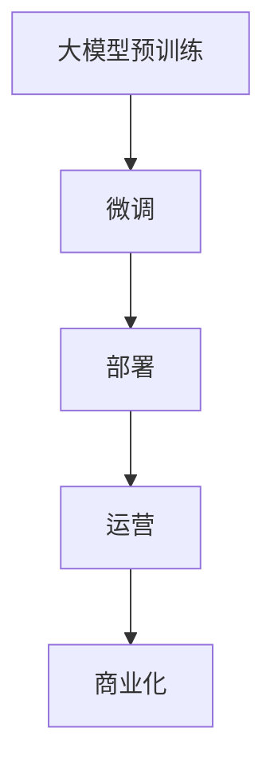

                 

# AI大模型创业：如何打造未来爆款应用？

## 1. 背景介绍

随着AI技术的快速发展，大模型应用领域正迎来爆发式增长。近年来，ChatGPT、DALL-E等大模型的成功，让业界看到AI的巨大潜力，也激发了无数创业者的热情。然而，大模型的研发和应用并非易事，如何高效构建并成功商业化大模型，打造爆款应用，成为摆在每个AI创业者面前的难题。本文将系统介绍大模型创业的全过程，从概念理解到实际操作，涵盖从选型、开发、部署到运营的各个环节，为AI创业者提供全方位的技术指引。

## 2. 核心概念与联系

### 2.1 核心概念概述

为了更好地理解大模型创业的各个环节，首先需要介绍几个核心概念：

- **大模型（Big Model）**：指具有海量参数、广泛知识、强大推理能力的预训练模型，如GPT、BERT等。大模型通过大规模数据预训练获得丰富的语言或图像表示，具备在特定任务上进行微调的能力。

- **微调（Fine-Tuning）**：指在大模型基础上，针对特定任务进行有监督的参数优化，提升模型在该任务上的表现。微调通常通过梯度下降等优化算法进行，需选择合适的学习率和正则化策略。

- **部署（Deployment）**：将训练好的模型迁移到服务器、云端等平台，供用户调用和使用。部署阶段需要考虑算力成本、扩展性和可用性等因素。

- **运营（Operation）**：指部署后模型的持续维护和使用，包括用户反馈、版本更新、监控告警等。运营的目的是保障服务的稳定性和高效性。

- **商业化（Commercialization）**：将模型和相关技术转化为商业产品或服务，获取收入和用户。商业化是AI技术落地应用的重要一环。

这些核心概念之间相互联系，构成了大模型创业的全过程。大模型通过预训练获得基础能力，通过微调针对特定任务进行优化，部署到生产环境中供用户调用，运营过程中收集反馈并持续改进，最终实现商业化价值。

### 2.2 核心概念原理和架构的 Mermaid 流程图



## 3. 核心算法原理 & 具体操作步骤

### 3.1 算法原理概述

大模型创业的核心算法包括大模型的预训练、微调、部署和运营。预训练是大模型的基础，微调则是针对特定任务进行优化，部署和运营则是将模型推向实际应用的重要环节。

1. **预训练（Pre-training）**：指在大量无标签数据上，使用自监督学习任务训练大模型，学习语言的通用表示。如BERT使用掩码语言模型进行预训练，GPT使用自回归模型进行预训练。

2. **微调（Fine-Tuning）**：在预训练的基础上，使用小规模有标签数据对模型进行微调，提升模型在特定任务上的表现。如在分类任务中使用交叉熵损失函数，在生成任务中使用负对数似然损失函数。

3. **部署（Deployment）**：将训练好的模型部署到生产环境，如AWS、Google Cloud等云平台，或本地服务器上。需要考虑算力成本、扩展性、可维护性等因素。

4. **运营（Operation）**：持续监控模型性能，收集用户反馈，进行模型更新和优化。使用A/B测试、灰度发布等方法，确保模型性能和稳定性。

### 3.2 算法步骤详解

#### 3.2.1 大模型选型

在创业初期，选择合适的预训练模型至关重要。目前主流的预训练模型包括BERT、GPT、T5等。BERT适合做分类任务，GPT适合做生成任务，T5适合做文本摘要和问答等任务。选择合适的模型，有助于在特定任务上获得更好的效果。

#### 3.2.2 数据准备

收集和准备数据是微调的基础。数据需包含丰富的样本，覆盖任务的全范围。标注数据越多，微调效果越好。可以使用众包平台如Amazon Mechanical Turk收集标注数据。

#### 3.2.3 微调模型训练

使用微调算法，如AdamW、SGD等，在大模型基础上进行微调。选择合适的超参数，如学习率、批大小、迭代轮数等。使用正则化技术，如L2正则、Dropout等，防止过拟合。

#### 3.2.4 模型部署

将训练好的模型部署到云端或本地服务器，使用容器化技术如Docker、Kubernetes等，确保模型的可扩展性和可维护性。使用负载均衡技术如Nginx、Load Balancer等，提升模型的可用性。

#### 3.2.5 模型运营

持续监控模型性能，收集用户反馈，进行模型更新和优化。使用A/B测试、灰度发布等方法，确保模型性能和稳定性。定期备份模型，防止数据丢失。

### 3.3 算法优缺点

#### 3.3.1 优点

1. **高效性**：大模型通过预训练获得了丰富的语言或图像知识，微调时所需的标注数据较少，训练速度快。
2. **通用性**：大模型可以用于多种NLP任务，如分类、匹配、生成等，具有较强的泛化能力。
3. **可扩展性**：大模型可以部署到云端或本地，支持大规模分布式训练和推理。
4. **可靠性**：大模型经过大规模预训练，具有较强的泛化能力，在特定任务上表现稳定。

#### 3.3.2 缺点

1. **计算成本高**：大模型的预训练和微调需要大量的计算资源，如GPU、TPU等。
2. **过拟合风险**：微调时需使用少量标注数据，可能会出现过拟合现象。
3. **部署复杂**：将大模型部署到生产环境需考虑算力成本、扩展性等因素。
4. **可解释性不足**：大模型通常被视为"黑盒"，其内部工作机制难以解释。

### 3.4 算法应用领域

大模型创业可以应用于多个领域，如自然语言处理、计算机视觉、智能推荐、智能客服等。以下是几个典型的应用场景：

- **自然语言处理**：如情感分析、问答系统、文本摘要等。
- **计算机视觉**：如图像分类、目标检测、图像生成等。
- **智能推荐**：如商品推荐、内容推荐、广告推荐等。
- **智能客服**：如智能客服对话系统、自动化客户分析等。

## 4. 数学模型和公式 & 详细讲解 & 举例说明

### 4.1 数学模型构建

假设大模型为 $M_{\theta}$，其中 $\theta$ 为模型参数。给定微调任务的训练集 $D=\{(x_i,y_i)\}_{i=1}^N$，其中 $x_i$ 为输入，$y_i$ 为标签。微调的目标是最小化损失函数 $\mathcal{L}$，即：

$$
\mathcal{L}(\theta) = \frac{1}{N} \sum_{i=1}^N \ell(M_{\theta}(x_i),y_i)
$$

其中 $\ell$ 为损失函数，如交叉熵损失、均方误差损失等。

### 4.2 公式推导过程

以分类任务为例，假设模型输出为 $M_{\theta}(x)$，真实标签为 $y$。交叉熵损失函数定义为：

$$
\ell(M_{\theta}(x),y) = -[y\log M_{\theta}(x) + (1-y)\log (1-M_{\theta}(x))]
$$

将上式代入经验风险公式，得：

$$
\mathcal{L}(\theta) = -\frac{1}{N}\sum_{i=1}^N [y_i\log M_{\theta}(x_i)+(1-y_i)\log(1-M_{\theta}(x_i))]
$$

通过链式法则，损失函数对参数 $\theta_k$ 的梯度为：

$$
\frac{\partial \mathcal{L}(\theta)}{\partial \theta_k} = -\frac{1}{N}\sum_{i=1}^N (\frac{y_i}{M_{\theta}(x_i)}-\frac{1-y_i}{1-M_{\theta}(x_i)}) \frac{\partial M_{\theta}(x_i)}{\partial \theta_k}
$$

其中 $\frac{\partial M_{\theta}(x_i)}{\partial \theta_k}$ 为模型对输入 $x_i$ 的梯度，通常使用反向传播算法计算。

### 4.3 案例分析与讲解

以情感分析任务为例，假设使用BERT模型进行微调。首先，将原始文本进行token化、编码，得到输入向量 $x$。然后，将输入向量 $x$ 作为BERT模型的输入，得到分类向量 $y$。最后，使用交叉熵损失函数 $\ell$，计算损失函数 $\mathcal{L}$，并通过梯度下降等优化算法更新模型参数 $\theta$。

## 5. 项目实践：代码实例和详细解释说明

### 5.1 开发环境搭建

以下是使用Python和PyTorch进行大模型微调实践的开发环境配置流程：

1. 安装Anaconda：从官网下载并安装Anaconda，用于创建独立的Python环境。
2. 创建并激活虚拟环境：
```bash
conda create -n pytorch-env python=3.8 
conda activate pytorch-env
```
3. 安装PyTorch：根据CUDA版本，从官网获取对应的安装命令。例如：
```bash
conda install pytorch torchvision torchaudio cudatoolkit=11.1 -c pytorch -c conda-forge
```
4. 安装Transformers库：
```bash
pip install transformers
```
5. 安装各类工具包：
```bash
pip install numpy pandas scikit-learn matplotlib tqdm jupyter notebook ipython
```

### 5.2 源代码详细实现

以下是一个使用BERT模型进行情感分析任务的微调代码示例：

```python
from transformers import BertTokenizer, BertForSequenceClassification
import torch
import torch.nn as nn

# 初始化BERT模型和tokenizer
model = BertForSequenceClassification.from_pretrained('bert-base-cased', num_labels=2)
tokenizer = BertTokenizer.from_pretrained('bert-base-cased')

# 准备训练数据
train_dataset = ...
val_dataset = ...
test_dataset = ...

# 定义损失函数和优化器
criterion = nn.CrossEntropyLoss()
optimizer = torch.optim.Adam(model.parameters(), lr=2e-5)

# 微调模型
device = torch.device('cuda') if torch.cuda.is_available() else torch.device('cpu')
model.to(device)

for epoch in range(epochs):
    model.train()
    for batch in train_loader:
        input_ids = batch['input_ids'].to(device)
        attention_mask = batch['attention_mask'].to(device)
        labels = batch['labels'].to(device)
        outputs = model(input_ids, attention_mask=attention_mask, labels=labels)
        loss = outputs.loss
        optimizer.zero_grad()
        loss.backward()
        optimizer.step()

    model.eval()
    val_loss = 0
    for batch in val_loader:
        input_ids = batch['input_ids'].to(device)
        attention_mask = batch['attention_mask'].to(device)
        labels = batch['labels'].to(device)
        outputs = model(input_ids, attention_mask=attention_mask, labels=labels)
        val_loss += outputs.loss.item()
    val_loss /= len(val_loader)
    print(f'Epoch {epoch+1}, val loss: {val_loss:.3f}')

# 测试模型
test_loss = 0
for batch in test_loader:
    input_ids = batch['input_ids'].to(device)
    attention_mask = batch['attention_mask'].to(device)
    labels = batch['labels'].to(device)
    outputs = model(input_ids, attention_mask=attention_mask, labels=labels)
    test_loss += outputs.loss.item()
test_loss /= len(test_loader)
print(f'Test loss: {test_loss:.3f}')
```

### 5.3 代码解读与分析

以上代码实现了使用BERT模型进行情感分析任务的微调过程。具体步骤如下：

1. 初始化BERT模型和tokenizer。
2. 准备训练数据，划分训练集、验证集和测试集。
3. 定义损失函数和优化器，使用Adam算法。
4. 微调模型，每个epoch在训练集上进行前向传播和反向传播，更新模型参数。
5. 在验证集上评估模型性能，输出验证集损失。
6. 在测试集上评估模型性能，输出测试集损失。

### 5.4 运行结果展示

运行以上代码后，将得到模型在不同epoch上的验证集和测试集损失。随着epoch的增加，验证集和测试集损失会逐渐下降，说明模型在情感分析任务上的性能不断提升。

## 6. 实际应用场景

### 6.1 智能客服系统

大模型微调可以用于构建智能客服系统，解决传统客服面临的响应速度慢、成本高、服务不个性化等问题。通过微调，智能客服系统可以自动理解客户意图，匹配最佳答复，提升客户满意度。

### 6.2 金融舆情监测

金融机构需要实时监测舆情动向，及时应对负面信息传播。大模型微调可以帮助金融机构自动化监测网络文本，识别负面舆情，提前采取应对措施。

### 6.3 个性化推荐系统

个性化推荐系统需要了解用户的兴趣和偏好。大模型微调可以帮助系统从文本数据中提取用户兴趣特征，生成推荐内容，提升用户粘性。

### 6.4 未来应用展望

未来，大模型微调将在更多领域得到应用，带来新的机遇和挑战。以下是几个可能的发展方向：

- **多模态微调**：将文本、图像、视频等数据结合，提升模型的综合理解和推理能力。
- **联邦学习**：在数据隐私保护的要求下，将模型微调任务分布到多个设备上进行联合优化，提升模型的泛化能力。
- **零样本学习**：通过设计合理的输入模板，使得模型能够零样本学习新任务，减少标注成本。
- **跨领域迁移**：将模型应用于不同领域，提升模型在不同任务上的表现。

## 7. 工具和资源推荐

### 7.1 学习资源推荐

为了帮助开发者系统掌握大模型微调的理论基础和实践技巧，以下是一些优质的学习资源：

1. 《Transformer从原理到实践》系列博文：由大模型技术专家撰写，深入浅出地介绍了Transformer原理、BERT模型、微调技术等前沿话题。
2. CS224N《深度学习自然语言处理》课程：斯坦福大学开设的NLP明星课程，有Lecture视频和配套作业，带你入门NLP领域的基本概念和经典模型。
3. 《Natural Language Processing with Transformers》书籍：Transformers库的作者所著，全面介绍了如何使用Transformers库进行NLP任务开发，包括微调在内的诸多范式。
4. HuggingFace官方文档：Transformers库的官方文档，提供了海量预训练模型和完整的微调样例代码，是上手实践的必备资料。
5. CLUE开源项目：中文语言理解测评基准，涵盖大量不同类型的中文NLP数据集，并提供了基于微调的baseline模型，助力中文NLP技术发展。

### 7.2 开发工具推荐

高效的开发离不开优秀的工具支持。以下是几款用于大模型微调开发的常用工具：

1. PyTorch：基于Python的开源深度学习框架，灵活动态的计算图，适合快速迭代研究。大部分预训练语言模型都有PyTorch版本的实现。
2. TensorFlow：由Google主导开发的开源深度学习框架，生产部署方便，适合大规模工程应用。同样有丰富的预训练语言模型资源。
3. Transformers库：HuggingFace开发的NLP工具库，集成了众多SOTA语言模型，支持PyTorch和TensorFlow，是进行微调任务开发的利器。
4. Weights & Biases：模型训练的实验跟踪工具，可以记录和可视化模型训练过程中的各项指标，方便对比和调优。与主流深度学习框架无缝集成。
5. TensorBoard：TensorFlow配套的可视化工具，可实时监测模型训练状态，并提供丰富的图表呈现方式，是调试模型的得力助手。
6. Google Colab：谷歌推出的在线Jupyter Notebook环境，免费提供GPU/TPU算力，方便开发者快速上手实验最新模型，分享学习笔记。

### 7.3 相关论文推荐

大模型和微调技术的发展源于学界的持续研究。以下是几篇奠基性的相关论文，推荐阅读：

1. Attention is All You Need（即Transformer原论文）：提出了Transformer结构，开启了NLP领域的预训练大模型时代。
2. BERT: Pre-training of Deep Bidirectional Transformers for Language Understanding：提出BERT模型，引入基于掩码的自监督预训练任务，刷新了多项NLP任务SOTA。
3. Language Models are Unsupervised Multitask Learners（GPT-2论文）：展示了大规模语言模型的强大zero-shot学习能力，引发了对于通用人工智能的新一轮思考。
4. Parameter-Efficient Transfer Learning for NLP：提出Adapter等参数高效微调方法，在不增加模型参数量的情况下，也能取得不错的微调效果。
5. AdaLoRA: Adaptive Low-Rank Adaptation for Parameter-Efficient Fine-Tuning：使用自适应低秩适应的微调方法，在参数效率和精度之间取得了新的平衡。

这些论文代表了大模型微调技术的发展脉络。通过学习这些前沿成果，可以帮助研究者把握学科前进方向，激发更多的创新灵感。

## 8. 总结：未来发展趋势与挑战

### 8.1 总结

本文系统介绍了大模型创业的全过程，包括大模型选型、数据准备、微调训练、部署、运营和商业化等环节。通过实际案例和代码示例，深入讲解了每个步骤的技术细节和实施要点。文章还讨论了大模型微调在多个行业中的应用，展望了未来发展的趋势和挑战。

大模型创业具有广阔的发展前景，但也面临诸多挑战。合理应用技术工具，持续优化模型和算法，提升运营效率，才能在大模型创业中脱颖而出，打造未来爆款应用。

### 8.2 未来发展趋势

展望未来，大模型微调技术将呈现以下几个发展趋势：

1. **多模态融合**：大模型将更加注重多模态数据的整合，提升综合理解和推理能力。
2. **联邦学习**：分布式联合优化将成为大模型微调的重要方向，提升模型泛化能力和数据隐私保护。
3. **少样本学习**：通过巧妙的输入设计，使大模型能够少样本学习新任务，减少标注成本。
4. **持续学习**：大模型需要具备持续学习的能力，适应数据分布的变化，提升模型效果和稳定性。
5. **跨领域迁移**：大模型将在更多领域得到应用，提升模型在不同任务上的表现。

### 8.3 面临的挑战

尽管大模型微调技术已经取得了显著成果，但在实际应用中，仍面临诸多挑战：

1. **标注数据成本高**：高质量标注数据获取成本高，数据量和质量不足会影响模型效果。
2. **模型过拟合风险**：微调时需使用少量标注数据，容易出现过拟合现象。
3. **计算成本高**：大模型预训练和微调需要大量计算资源，成本高昂。
4. **可解释性不足**：大模型通常被视为"黑盒"，其内部工作机制难以解释。
5. **安全性问题**：大模型可能学习到有害信息，使用不当可能带来安全风险。

### 8.4 研究展望

未来，大模型微调技术需要在以下几个方面进行深入研究：

1. **低成本标注**：研究如何通过少样本学习和弱监督学习，降低对标注数据的依赖。
2. **鲁棒性和泛化能力**：提升模型对域外数据的鲁棒性，降低过拟合风险。
3. **可解释性和可控性**：研究如何使大模型具有更高的可解释性，提升模型的可控性和可信度。
4. **隐私保护**：研究联邦学习等分布式优化方法，保护用户数据隐私。

只有不断突破技术瓶颈，提升模型性能，才能在大模型创业中取得成功，打造未来爆款应用。

## 9. 附录：常见问题与解答

**Q1：大模型创业是否需要大量的标注数据？**

A: 大模型创业确实需要一定的标注数据，但可以通过少样本学习和弱监督学习等技术，降低对标注数据的依赖。在数据量较少的情况下，通过巧妙的输入设计，也能获得不错的微调效果。

**Q2：大模型微调时如何避免过拟合？**

A: 避免过拟合的方法包括数据增强、正则化、对抗训练等。数据增强可以通过回译、近义替换等方式扩充训练集。正则化可以使用L2正则、Dropout等。对抗训练可以引入对抗样本，提升模型鲁棒性。

**Q3：大模型微调时如何选择合适的学习率？**

A: 学习率一般要比预训练时小1-2个数量级，建议在1e-5到1e-3之间调参。可以使用warmup策略，在开始阶段使用较小的学习率，再逐渐过渡到预设值。

**Q4：大模型微调时需要注意哪些问题？**

A: 大模型微调需注意以下问题：标注数据质量、过拟合风险、计算成本、可解释性不足、安全性问题等。需选择合适的模型和算法，合理设计输入和输出，进行全面的优化和测试。

**Q5：大模型微调时需要考虑哪些运营问题？**

A: 大模型微调需考虑模型部署、监控告警、版本更新、数据备份、安全性等运营问题。需使用容器化技术、负载均衡技术、安全防护措施等，保障系统的稳定性和安全性。

---

作者：禅与计算机程序设计艺术 / Zen and the Art of Computer Programming

