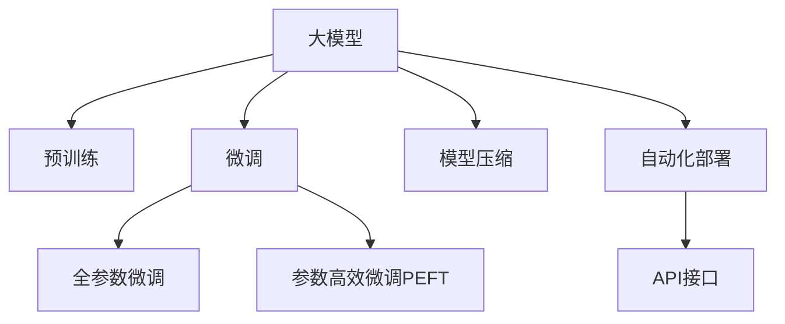

                 

# AI大模型创业：如何抓住未来机遇？

> 关键词：AI大模型,创业,AI应用,行业趋势,技术创新,商业模式,市场机遇

## 1. 背景介绍

### 1.1 问题由来
近年来，人工智能(AI)技术发展迅猛，尤其是大模型(如GPT-3、BERT等)在自然语言处理(NLP)、计算机视觉、语音识别等领域取得了突破性进展。大模型的强大能力吸引了众多创业者和投资者的关注，AI创业热潮方兴未艾。

大模型的出现，为创业公司提供了新的机会。它不仅能够帮助企业快速构建高性能的AI系统，还能在特定领域进行定制化微调，解决业务痛点，推动企业数字化转型升级。然而，大模型技术的复杂性也带来了不小的挑战，创业公司在切入该领域时，需要充分理解其核心原理和应用场景，才能抓住机遇。

### 1.2 问题核心关键点
创业公司切入AI大模型领域的关键点包括：
1. **技术选型**：选择适合自身业务需求的大模型，并对其进行优化和微调。
2. **数据准备**：收集和清洗高质量的数据，作为模型训练的基础。
3. **模型部署**：将训练好的模型部署到生产环境中，实现高性能推理。
4. **业务应用**：将AI模型与业务场景深度结合，解决实际问题。
5. **市场推广**：通过有效的市场推广策略，将AI解决方案引入市场。

## 2. 核心概念与联系

### 2.1 核心概念概述

为了更好地理解AI大模型的创业机会，本节将介绍几个核心概念及其之间的联系：

- **大模型(Large Model)**：指具有数亿甚至数十亿参数的深度学习模型，如GPT-3、BERT等。这些模型通常通过大规模预训练学习通用的语言知识，能够进行复杂的推理和生成。

- **预训练(Pre-training)**：指在大规模无标签数据上进行自监督学习，学习通用的语言表示，如BERT中的掩码语言模型。

- **微调(Fine-tuning)**：指在大模型上进行下游任务特定的小规模有监督学习，调整模型的参数以匹配特定任务。

- **迁移学习(Transfer Learning)**：指将一个任务学到的知识迁移到另一个相关任务上，大模型可以通过微调实现迁移学习。

- **参数高效微调(Parameter-Efficient Fine-tuning, PEFT)**：指在微调过程中只更新少量模型参数，以提高微调效率和性能。

- **模型压缩(Compression)**：指通过剪枝、量化、压缩等技术，减少模型参数和计算量，提高推理效率。

- **自动化部署(Automatic Deployment)**：指将模型自动部署到生产环境中，支持高性能推理和调用。

- **API接口(APIs)**：指通过标准化的API接口，方便外部系统调用AI模型，实现模型集成和应用。

这些概念之间的联系通过以下Mermaid流程图来展示：



这个流程图展示了大模型的核心概念及其之间的逻辑关系：

1. 大模型通过预训练获得基础能力。
2. 微调是对预训练模型进行任务特定的优化，可以分为全参数微调和参数高效微调。
3. 模型压缩可以优化模型结构，提升推理效率。
4. 自动化部署支持模型在生产环境中的高效运行。
5. API接口实现模型集成和调用，方便业务系统使用。

## 3. 核心算法原理 & 具体操作步骤

### 3.1 算法原理概述

AI大模型的创业，关键在于如何高效地构建、优化和部署模型，以解决特定业务问题。以下将介绍基于监督学习的大模型微调方法，这是创业公司最常见的技术途径。

### 3.2 算法步骤详解

基于监督学习的大模型微调一般包括以下几个关键步骤：

**Step 1: 准备预训练模型和数据集**
- 选择合适的预训练模型，如BERT、GPT-3等。
- 准备下游任务的数据集，并划分为训练集、验证集和测试集。

**Step 2: 微调超参数设置**
- 选择合适的优化算法，如AdamW、SGD等，设置学习率、批大小、迭代轮数等超参数。
- 设置正则化技术，如L2正则、Dropout、Early Stopping等，避免过拟合。

**Step 3: 模型微调**
- 将训练集数据分批次输入模型，计算损失函数。
- 反向传播计算参数梯度，更新模型参数。
- 周期性在验证集上评估模型性能，根据性能指标决定是否停止训练。
- 重复上述步骤，直至达到预设的迭代轮数或性能提升满足要求。

**Step 4: 模型部署**
- 将训练好的模型部署到生产环境，实现高性能推理。
- 通过API接口，方便业务系统调用AI模型。
- 进行性能监控和调优，保证模型在实际环境中的稳定性和准确性。

**Step 5: 模型优化**
- 根据业务需求和反馈，进行参数调整、模型压缩和优化。
- 定期重新训练模型，保持模型的最新状态。

### 3.3 算法优缺点

基于监督学习的大模型微调方法具有以下优点：
1. **高效快速**：适合数据量较小、计算资源有限的中小型创业公司。
2. **性能提升显著**：在少量标注数据上，仍能获得显著的性能提升。
3. **易于实现**：借助现有开源工具库，如PyTorch、Transformers等，实现简单高效。

然而，该方法也存在以下缺点：
1. **数据依赖**：微调效果依赖标注数据的质量和数量。
2. **模型泛化能力有限**：模型可能过度拟合训练数据，泛化能力不足。
3. **资源消耗大**：微调过程需要较大的计算资源和时间成本。

## 4. 数学模型和公式 & 详细讲解 & 举例说明

### 4.1 数学模型构建

假设预训练模型为 $M_{\theta}$，下游任务为分类任务，输入数据为 $x$，标签为 $y$，损失函数为 $\ell$。则微调的目标是最小化损失函数：

$$
\hat{\theta} = \mathop{\arg\min}_{\theta} \mathcal{L}(M_{\theta}, \{(x_i, y_i)\}_{i=1}^N)
$$

### 4.2 公式推导过程

以二分类任务为例，微调的损失函数为交叉熵损失：

$$
\ell(M_{\theta}(x), y) = -[y\log M_{\theta}(x) + (1-y)\log(1-M_{\theta}(x))]
$$

在微调过程中，模型参数 $\theta$ 的更新公式为：

$$
\theta \leftarrow \theta - \eta \nabla_{\theta}\mathcal{L}(\theta)
$$

其中 $\eta$ 为学习率，$\nabla_{\theta}\mathcal{L}(\theta)$ 为损失函数对模型参数的梯度，可通过反向传播计算。

### 4.3 案例分析与讲解

假设我们的目标是训练一个文本分类模型，识别电影评论是正面还是负面。我们将收集一些电影评论及其对应的标签，作为训练数据。使用BERT作为预训练模型，将其在影评数据集上进行微调，得到新的分类模型。

## 5. 项目实践：代码实例和详细解释说明

### 5.1 开发环境搭建

1. 安装Anaconda和Python环境。
2. 安装PyTorch、Transformers等库。
3. 准备数据集。

### 5.2 源代码详细实现

以下是一个基于PyTorch的文本分类微调示例代码：

```python
import torch
import torch.nn as nn
import torch.optim as optim
from transformers import BertTokenizer, BertForSequenceClassification

# 准备数据集
tokenizer = BertTokenizer.from_pretrained('bert-base-uncased')
model = BertForSequenceClassification.from_pretrained('bert-base-uncased', num_labels=2)

# 定义模型结构
class SentimentClassifier(nn.Module):
    def __init__(self, model):
        super(SentimentClassifier, self).__init__()
        self.model = model
        self.dropout = nn.Dropout(0.1)
        self.fc = nn.Linear(model.config.hidden_size, 2)
        self.softmax = nn.Softmax(dim=1)
        
    def forward(self, input_ids, attention_mask, labels):
        output = self.model(input_ids, attention_mask=attention_mask)[0]
        output = self.dropout(output)
        output = self.fc(output)
        logits = output
        logits = self.softmax(logits)
        loss_fct = nn.CrossEntropyLoss()
        if labels is not None:
            loss = loss_fct(logits.view(-1, logits.size(-1)), labels.view(-1))
        else:
            loss = None
        return loss, logits

# 定义训练函数
def train_epoch(model, data_loader, optimizer):
    model.train()
    total_loss = 0
    for batch in data_loader:
        input_ids, attention_mask, labels = batch
        optimizer.zero_grad()
        loss, logits = model(input_ids, attention_mask, labels)
        total_loss += loss.item()
        loss.backward()
        optimizer.step()
    return total_loss / len(data_loader)

# 定义评估函数
def evaluate(model, data_loader):
    model.eval()
    total_loss = 0
    correct = 0
    with torch.no_grad():
        for batch in data_loader:
            input_ids, attention_mask, labels = batch
            loss, logits = model(input_ids, attention_mask, labels)
            total_loss += loss.item()
            logits = logits.argmax(dim=1)
            correct += (logits == labels).sum().item()
    return total_loss / len(data_loader), correct / len(data_loader)

# 训练和评估
device = torch.device('cuda' if torch.cuda.is_available() else 'cpu')
model.to(device)
train_loader = torch.utils.data.DataLoader(train_dataset, batch_size=16, shuffle=True)
val_loader = torch.utils.data.DataLoader(val_dataset, batch_size=16, shuffle=False)
test_loader = torch.utils.data.DataLoader(test_dataset, batch_size=16, shuffle=False)
optimizer = optim.AdamW(model.parameters(), lr=2e-5)
num_epochs = 5
for epoch in range(num_epochs):
    train_loss, val_loss, val_acc = train_and_evaluate(model, train_loader, val_loader)
    print(f'Epoch {epoch+1}, train loss: {train_loss:.3f}, val loss: {val_loss:.3f}, val acc: {val_acc:.3f}')
```

### 5.3 代码解读与分析

该代码实现了一个基于BERT的情感分类模型，其中包含了模型定义、训练函数和评估函数。具体分析如下：

- **模型定义**：
  - 使用BertForSequenceClassification预训练模型。
  - 定义了一个简单的分类器，包含Dropout和线性层。

- **训练函数**：
  - 使用AdamW优化器，设置学习率为2e-5。
  - 迭代训练数据，计算损失和梯度，更新模型参数。

- **评估函数**：
  - 使用无梯度的模式进行评估，计算损失和准确率。

## 6. 实际应用场景

### 6.1 医疗领域

AI大模型在医疗领域有广泛的应用前景，如疾病诊断、个性化治疗方案推荐、患者情感分析等。

- **疾病诊断**：利用AI大模型对病人的病历和检查结果进行分析，快速准确地诊断疾病。
- **治疗方案推荐**：根据病人的病情和基因信息，推荐个性化的治疗方案。
- **患者情感分析**：分析患者的情绪变化，及时调整治疗方案，提高治疗效果。

### 6.2 金融领域

AI大模型在金融领域可以用于风险评估、金融舆情监测、投资决策支持等。

- **风险评估**：通过分析历史交易数据和市场动态，预测金融风险，制定风险应对策略。
- **金融舆情监测**：实时监测金融市场的舆情动态，及时调整投资策略。
- **投资决策支持**：利用AI大模型分析市场数据和公司财报，辅助投资决策。

### 6.3 教育领域

AI大模型在教育领域可以用于智能教育、个性化学习推荐、作业批改等。

- **智能教育**：利用AI大模型分析学生的学习行为，提供个性化的学习方案。
- **个性化学习推荐**：根据学生的学习偏好和知识水平，推荐合适的学习内容和资源。
- **作业批改**：通过AI大模型对学生的作业进行自动批改，提高批改效率。

## 7. 工具和资源推荐

### 7.1 学习资源推荐

1. **Deep Learning Specialization**：由Andrew Ng教授讲授的深度学习课程，涵盖深度学习基础和应用。
2. **Natural Language Processing with Transformers**：由HuggingFace开发的书籍，详细介绍了使用Transformers进行NLP任务开发的技术。
3. **Transformers for NLP**：HuggingFace社区推出的深度学习模型，提供了大量预训练模型和微调范式。
4. **AI for Everyone**：由Andrew Ng教授讲授的人工智能入门课程，涵盖AI的基本概念和应用。

### 7.2 开发工具推荐

1. **PyTorch**：强大的深度学习框架，支持动态图和静态图。
2. **TensorFlow**：由Google开发的深度学习框架，支持分布式训练和生产部署。
3. **Jupyter Notebook**：支持Python和R等编程语言，方便数据分析和模型开发。
4. **Weights & Biases**：模型实验跟踪工具，实时监控模型训练过程。

### 7.3 相关论文推荐

1. **Attention is All You Need**：Transformer的原始论文，介绍了Transformer的原理和应用。
2. **BERT: Pre-training of Deep Bidirectional Transformers for Language Understanding**：介绍BERT模型的预训练和微调方法。
3. **Parameter-Efficient Transfer Learning for NLP**：提出Adapter等参数高效微调方法，优化微调过程。

## 8. 总结：未来发展趋势与挑战

### 8.1 研究成果总结

基于监督学习的大模型微调技术已经在多个领域取得了显著的成果，但仍有诸多挑战需要克服：

- **数据依赖**：标注数据的高成本和数据分布的变化是微调面临的主要挑战。
- **模型泛化能力**：小样本情况下的泛化能力不足，模型可能过度拟合训练数据。
- **资源消耗**：大规模模型的推理计算资源消耗大，需要优化模型结构和推理效率。
- **可解释性**：大模型的决策过程缺乏可解释性，难以解释模型输出。

### 8.2 未来发展趋势

未来AI大模型微调技术将呈现以下发展趋势：

1. **模型规模扩大**：随着算力提升和数据积累，预训练模型的参数规模将进一步扩大。
2. **微调方法多样**：参数高效微调、无监督和半监督微调等方法将不断涌现。
3. **持续学习**：AI大模型需要持续学习新知识，以适应数据分布的变化。
4. **多模态融合**：融合视觉、语音等多模态信息，提升模型的理解和生成能力。
5. **知识图谱**：引入知识图谱和规则库，增强模型的常识推理能力。
6. **自动化部署**：实现模型的高效自动化部署，支持高性能推理和调用。

### 8.3 面临的挑战

尽管AI大模型微调技术取得了一系列进展，但面临的挑战仍不容忽视：

1. **标注成本**：高质量标注数据获取成本高，制约了微调技术的应用。
2. **模型鲁棒性**：在大规模数据外泛化能力不足，模型易受干扰。
3. **推理效率**：大规模模型推理计算资源消耗大，需要优化模型结构。
4. **可解释性**：大模型的决策过程缺乏可解释性，难以调试和审计。
5. **安全性**：模型可能学习有害信息，需要加强安全和伦理约束。
6. **知识整合**：模型难以灵活吸收和整合外部知识，需要引入先验知识。

### 8.4 研究展望

未来研究需要在以下几个方向取得突破：

1. **无监督和半监督微调**：开发更多无监督和半监督微调方法，降低对标注数据的依赖。
2. **参数高效微调**：开发参数高效的微调方法，减少计算资源消耗。
3. **因果推理**：引入因果推理方法，增强模型的决策合理性和鲁棒性。
4. **知识图谱融合**：融合知识图谱和规则库，增强模型的常识推理能力。
5. **多模态融合**：融合视觉、语音等多模态信息，提升模型的理解和生成能力。
6. **自动化部署**：实现模型的高效自动化部署，支持高性能推理和调用。
7. **可解释性增强**：加强模型的可解释性和可审计性，提升模型可信度。
8. **安全性保障**：引入伦理和安全约束，保障模型输出符合人类价值观和伦理道德。

## 9. 附录：常见问题与解答

### Q1: 如何选择合适的AI大模型？

A: 选择适合自身业务需求的大模型，需要考虑以下几个因素：
1. **任务类型**：选择合适的预训练模型，如BERT、GPT-3等。
2. **数据规模**：考虑模型参数规模和计算资源，选择合适的模型大小。
3. **应用场景**：根据具体业务场景，选择预训练模型。

### Q2: 微调过程中如何避免过拟合？

A: 避免过拟合的方法包括：
1. **数据增强**：通过数据增强技术扩充训练数据。
2. **正则化**：使用L2正则、Dropout等正则化技术，避免过拟合。
3. **早停**：在验证集上监测模型性能，及时停止训练。

### Q3: 微调模型的部署需要注意哪些问题？

A: 微调模型的部署需要注意以下问题：
1. **模型压缩**：进行模型剪枝和量化，减少计算资源消耗。
2. **自动化部署**：实现模型的高效自动化部署，支持高性能推理。
3. **监控和调优**：实时监控模型性能，及时进行调优。

### Q4: 如何提升模型的推理效率？

A: 提升模型推理效率的方法包括：
1. **模型压缩**：进行模型剪枝和量化，减少计算资源消耗。
2. **模型并行**：利用分布式计算，提高推理效率。
3. **推理优化**：优化推理算法和模型结构，提高推理速度。

### Q5: 如何增强模型的可解释性？

A: 增强模型可解释性的方法包括：
1. **模型解释技术**：使用模型解释技术，解释模型的决策过程。
2. **可视化工具**：使用可视化工具，展示模型的内部状态。

---

作者：禅与计算机程序设计艺术 / Zen and the Art of Computer Programming

