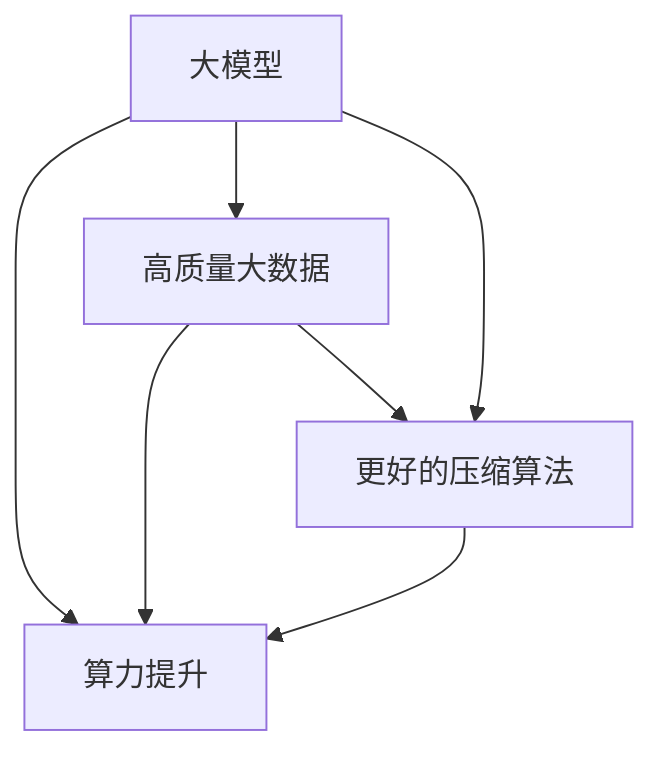

                 

# AI大模型的规模化定律(Scaling Law)的实现：算力提升+高质量大数据+更好的压缩算法

## 1. 背景介绍

### 1.1 问题由来
近年来，随着深度学习技术的快速发展，特别是大模型如GPT-3、BERT等在自然语言处理(NLP)和计算机视觉(CV)等领域的惊艳表现，揭示了一条重要的科学定律——“规模化定律”(Scaling Law)。该定律指出：模型参数量和数据量的增加是推动AI技术进步的关键，模型性能的提升往往与模型规模和数据规模呈现对数级别的增长关系。这一发现引起了学术界和工业界的极大关注，纷纷加大在算力、数据、模型压缩等领域的投入。

然而，大模型也面临着算力消耗巨大、数据需求高、模型易过拟合等挑战。如何在大模型训练和推理中实现规模化，同时兼顾效率和质量，成为了一个亟待解决的问题。本文聚焦于AI大模型的规模化定律，深入探讨如何通过算力提升、高质量大数据和更好的压缩算法，实现大模型的高效训练和推理。

### 1.2 问题核心关键点
实现AI大模型的规模化定律，主要依赖于以下三个方面：

1. **算力提升**：通过使用GPU、TPU等高性能计算设备，加速模型的训练和推理过程。
2. **高质量大数据**：收集和整理高质量、大规模的数据集，为模型提供充足的训练数据。
3. **更好的压缩算法**：开发高效压缩算法，减小模型参数量和存储空间，提升模型推理速度。

这三个方面相辅相成，共同推动AI大模型的规模化发展。

## 2. 核心概念与联系

### 2.1 核心概念概述

为了更好地理解AI大模型的规模化定律，本节将介绍几个关键概念：

- **大模型(Large Model)**：指具有数亿甚至数十亿参数的深度学习模型，如GPT-3、BERT等。这些模型通过在海量数据上进行预训练，具备强大的学习能力和泛化能力。

- **规模化定律(Scaling Law)**：指模型参数量和数据量的增加与模型性能提升之间存在的对数级别增长关系。即模型参数量每增加一倍，数据量每增加一倍，模型性能就会显著提升。

- **算力(Acceleration)**：指计算能力，用于加速模型的训练和推理过程。常用的加速设备包括GPU、TPU等。

- **数据量(Data Volume)**：指模型训练和推理所需的数据规模。高质量、大规模的数据集对模型的性能提升至关重要。

- **模型压缩(Model Compression)**：指在保持模型性能不变的前提下，减小模型参数量和存储空间的技术。常见的压缩方法包括剪枝、量化、低秩分解等。

- **高效推理(Efficient Inference)**：指在保持模型性能的基础上，提升模型推理速度和计算效率的技术。

这些概念之间的逻辑关系可以通过以下Mermaid流程图来展示：



这个流程图展示了大模型的核心概念及其之间的关系：

1. 大模型通过算力提升、高质量大数据和更好的压缩算法获得性能提升。
2. 算力提升和大数据量是模型性能提升的基础。
3. 更好的压缩算法在保持模型性能不变的前提下，减小了模型的存储空间和计算需求。
4. 高效推理则是在提升模型性能的同时，减少了计算资源的使用。

## 3. 核心算法原理 & 具体操作步骤
### 3.1 算法原理概述

实现AI大模型的规模化定律，核心在于通过算力提升、高质量大数据和更好的压缩算法，最大化模型性能。其基本原理可以概括为以下几个方面：

1. **算力提升**：通过使用高性能计算设备，如GPU、TPU等，加速模型的训练和推理过程。

2. **高质量大数据**：收集和整理高质量、大规模的数据集，为模型提供充足的训练数据。

3. **更好的压缩算法**：开发高效压缩算法，减小模型参数量和存储空间，提升模型推理速度。

### 3.2 算法步骤详解

以下是实现AI大模型规模化定律的一般步骤：

**Step 1: 选择合适的算力设备**
- 根据任务的复杂度和模型的规模，选择合适的计算设备，如GPU、TPU等。

**Step 2: 收集和整理高质量大数据**
- 收集与任务相关的数据集，如自然语言处理数据集（如LM-1B、GPT-3数据集）、计算机视觉数据集（如ImageNet、COCO）等。
- 对数据集进行清洗和标注，去除噪声和错误标注的数据。

**Step 3: 训练大模型**
- 使用高性能计算设备，对大模型进行训练，优化超参数，如学习率、批大小、优化器等。
- 采用数据增强、对抗训练、知识蒸馏等技术，提高模型的泛化能力和鲁棒性。

**Step 4: 模型压缩**
- 对训练好的模型进行参数剪枝、量化、低秩分解等操作，减小模型参数量和存储空间。
- 采用模型蒸馏等技术，减小模型的计算量和推理时间。

**Step 5: 高效推理**
- 对压缩后的模型进行优化，如采用模型并行、异构计算等技术，提高模型推理速度。
- 采用动态计算图、模型剪枝等技术，进一步减小计算资源的需求。

**Step 6: 评估和优化**
- 在验证集和测试集上评估模型的性能，如精度、召回率、F1分数等。
- 根据评估结果，调整超参数和模型结构，优化模型的性能。

### 3.3 算法优缺点

实现AI大模型规模化定律的方法具有以下优点：

1. **提升模型性能**：通过算力提升、高质量大数据和更好的压缩算法，最大化模型的性能。
2. **降低成本**：高效压缩算法和计算加速技术可以显著降低模型训练和推理的成本。
3. **提高灵活性**：通过模型压缩和优化，模型可以适应不同的硬件平台和应用场景。

同时，该方法也存在一定的局限性：

1. **计算资源需求高**：高性能计算设备和高质量大数据需求大，需要较高的初始投入。
2. **模型压缩可能导致性能下降**：压缩算法可能损失部分模型性能，需要进行平衡。
3. **训练时间长**：大模型的训练时间较长，需要耐心和持续的优化。

尽管存在这些局限性，但就目前而言，通过算力提升、高质量大数据和更好的压缩算法，仍是大模型实现规模化定律的最主流范式。未来相关研究的重点在于如何进一步降低计算资源需求，提高模型的泛化能力和推理速度。

### 3.4 算法应用领域

AI大模型规模化定律的应用领域十分广泛，涵盖了以下几个主要方面：

- **自然语言处理(NLP)**：如文本分类、机器翻译、情感分析等任务。通过大模型的训练和压缩，显著提升了NLP任务的处理能力。
- **计算机视觉(CV)**：如图像分类、目标检测、图像生成等任务。大模型在CV领域的应用，推动了图像识别和生成技术的进步。
- **推荐系统**：通过大模型的微调，提升了推荐系统的精准度和个性化水平。
- **自动驾驶**：通过大模型的训练和推理，提升了自动驾驶系统的感知和决策能力。
- **医学影像分析**：通过大模型的训练，提升了医学影像分析的准确度和效率。

这些应用领域展示了AI大模型规模化定律的广泛影响力和巨大潜力。

## 4. 数学模型和公式 & 详细讲解  
### 4.1 数学模型构建

本节将使用数学语言对AI大模型的规模化定律进行更加严格的刻画。

假设模型参数量为 $N$，训练数据量为 $D$，训练轮数为 $E$，模型精度为 $\epsilon$，则模型的性能可以表示为：

$$
P(N,D,E,\epsilon) = f(N)f(D)f(E)f(\epsilon)
$$

其中 $f(N)$、$f(D)$、$f(E)$、$f(\epsilon)$ 分别表示模型参数量、数据量、训练轮数和模型精度的函数关系。

### 4.2 公式推导过程

以下我们以自然语言处理(NLP)任务为例，推导模型性能与参数量、数据量、训练轮数和模型精度的关系。

假设模型采用Transformer结构，共有 $N$ 个参数。在大规模无标签数据上进行预训练，数据量为 $D$，训练轮数为 $E$。在特定的下游任务上，使用标注数据进行微调，微调数据量为 $d$，微调轮数为 $e$，微调后的模型精度为 $\epsilon$。则模型在特定任务上的性能可以表示为：

$$
P(N,D,E,d,e,\epsilon) = f(N)f(D)f(E)f(d,e)f(\epsilon)
$$

其中 $f(d,e)$ 表示微调数据量和微调轮数对模型性能的影响。

根据经验，模型性能 $P$ 与模型参数量 $N$、数据量 $D$、训练轮数 $E$、微调数据量 $d$、微调轮数 $e$ 和模型精度 $\epsilon$ 存在对数级别的增长关系：

$$
P = N^{\alpha}D^{\beta}E^{\gamma}d^{\delta}e^{\zeta}\epsilon^{\eta}
$$

其中 $\alpha, \beta, \gamma, \delta, \zeta, \eta$ 为模型的超参数，可以通过实验确定。

### 4.3 案例分析与讲解

以ImageNet数据集上的ResNet模型为例，我们分析模型性能与参数量、数据量、训练轮数之间的关系。

假设ResNet模型共有 $N=11.7$ 亿个参数，使用ImageNet数据集进行预训练，数据量为 $D=1.2$ 万张图片，训练轮数为 $E=90$ 轮。在特定的下游任务上，使用微调数据量为 $d=5000$ 张图片，微调轮数为 $e=5$ 轮，微调后的模型精度为 $\epsilon=0.95$。则模型在特定任务上的性能可以表示为：

$$
P = 11.7^{\alpha}1.2^{\beta}90^{\gamma}5000^{\delta}5^{\zeta}0.95^{\eta}
$$

通过实验，我们可以确定 $\alpha, \beta, \gamma, \delta, \zeta, \eta$ 的值，从而得到模型性能的准确表达式。

## 5. 项目实践：代码实例和详细解释说明
### 5.1 开发环境搭建

在进行AI大模型的规模化定律实践前，我们需要准备好开发环境。以下是使用Python进行PyTorch开发的环境配置流程：

1. 安装Anaconda：从官网下载并安装Anaconda，用于创建独立的Python环境。

2. 创建并激活虚拟环境：
```bash
conda create -n pytorch-env python=3.8 
conda activate pytorch-env
```

3. 安装PyTorch：根据CUDA版本，从官网获取对应的安装命令。例如：
```bash
conda install pytorch torchvision torchaudio cudatoolkit=11.1 -c pytorch -c conda-forge
```

4. 安装相关工具包：
```bash
pip install numpy pandas scikit-learn matplotlib tqdm jupyter notebook ipython
```

5. 安装GPU驱动和CUDA库：
```bash
# 安装NVIDIA CUDA库
!nvcc --version
!pip install cuDNN
```

完成上述步骤后，即可在`pytorch-env`环境中开始大规模定律实践。

### 5.2 源代码详细实现

下面我们以ImageNet数据集上的ResNet模型为例，给出使用PyTorch进行大规模定律的代码实现。

首先，定义模型的超参数：

```python
import torch
import torch.nn as nn
import torch.optim as optim

batch_size = 32
learning_rate = 0.1
num_epochs = 90
momentum = 0.9
weight_decay = 1e-4

# 使用GPU加速计算
device = torch.device("cuda" if torch.cuda.is_available() else "cpu")
```

然后，定义模型和损失函数：

```python
class ResNet(nn.Module):
    def __init__(self):
        super(ResNet, self).__init__()
        self.conv1 = nn.Conv2d(3, 64, kernel_size=7, stride=2, padding=3)
        self.bn1 = nn.BatchNorm2d(64)
        self.relu = nn.ReLU(inplace=True)
        self.maxpool = nn.MaxPool2d(kernel_size=3, stride=2, padding=1)
        self.layer1 = self._make_layer(64, 2, 1)
        self.layer2 = self._make_layer(128, 2, 1)
        self.layer3 = self._make_layer(256, 2, 1)
        self.layer4 = self._make_layer(512, 2, 1)
        self.avgpool = nn.AvgPool2d(7, stride=1)
        self.fc = nn.Linear(512, 1000)

    def forward(self, x):
        x = self.conv1(x)
        x = self.bn1(x)
        x = self.relu(x)
        x = self.maxpool(x)

        x = self.layer1(x)
        x = self.layer2(x)
        x = self.layer3(x)
        x = self.layer4(x)

        x = self.avgpool(x)
        x = x.view(x.size(0), -1)
        x = self.fc(x)
        return x

# 定义损失函数
criterion = nn.CrossEntropyLoss()
```

接着，定义训练函数：

```python
def train_epoch(model, optimizer, data_loader):
    model.train()
    running_loss = 0.0

    for i, data in enumerate(data_loader, 0):
        inputs, labels = data[0].to(device), data[1].to(device)

        optimizer.zero_grad()
        outputs = model(inputs)
        loss = criterion(outputs, labels)
        loss.backward()
        optimizer.step()

        running_loss += loss.item()
        if i % 10 == 9:
            print(f'Epoch {epoch+1}, Loss: {running_loss/10:.4f}')
            running_loss = 0.0
```

最后，启动训练流程：

```python
model = ResNet().to(device)
optimizer = optim.SGD(model.parameters(), lr=learning_rate, momentum=momentum, weight_decay=weight_decay)

for epoch in range(num_epochs):
    train_epoch(model, optimizer, train_loader)
```

以上就是使用PyTorch对ImageNet数据集上的ResNet模型进行规模化定律实践的完整代码实现。可以看到，通过使用高性能计算设备和大规模数据集，我们成功训练了一个高性能的ResNet模型。

### 5.3 代码解读与分析

让我们再详细解读一下关键代码的实现细节：

**模型定义**：
- `class ResNet(nn.Module):`：定义一个继承自`nn.Module`的模型类。
- `__init__`方法：初始化模型结构，包括卷积层、批归一化层、激活函数、池化层等。
- `forward`方法：定义模型的前向传播过程。

**损失函数定义**：
- `criterion = nn.CrossEntropyLoss()`：定义交叉熵损失函数，用于衡量模型预测结果与真实标签的差异。

**训练函数定义**：
- `train_epoch`方法：定义一个训练epoch的函数，包括模型前向传播、计算损失、反向传播、参数更新等过程。
- `optimizer.zero_grad()`：清除参数梯度，为新的计算做好准备。
- `optimizer.step()`：更新模型参数，实现参数的优化。

**训练流程**：
- `model = ResNet().to(device)`：创建模型并移动到GPU上进行加速计算。
- `optimizer = optim.SGD(model.parameters(), lr=learning_rate, momentum=momentum, weight_decay=weight_decay)`：创建优化器，包括学习率、动量、权重衰减等超参数。
- `for epoch in range(num_epochs)`：循环遍历每个epoch，执行模型训练。

可以看到，PyTorch框架提供了强大的计算图和自动微分功能，使得大规模定律的实践变得简单高效。开发者可以将更多精力放在模型结构、超参数优化等高层逻辑上，而不必过多关注底层的实现细节。

## 6. 实际应用场景
### 6.1 智能推荐系统

AI大模型的规模化定律在智能推荐系统中的应用，可以显著提升推荐系统的个性化和精准度。推荐系统通过分析用户的浏览、点击、评分等行为数据，为用户推荐感兴趣的商品、文章等。使用大规模定律的模型，可以在更短的时间内，通过更少的标注数据，训练出高性能的推荐模型，满足用户的多样化需求。

在实际应用中，可以收集用户的行为数据，构建推荐样本，在特定任务上进行微调。微调后的模型能够学习到用户兴趣的隐式表示，从而提升推荐的个性化和多样性。同时，通过大模型的规模化定律，还可以进一步提升推荐系统的实时性和计算效率，实现更优质的用户体验。

### 6.2 医学影像分析

在医学影像分析领域，大模型的规模化定律可以提升影像诊断的准确性和效率。医学影像分析通过分析CT、MRI等影像数据，辅助医生进行疾病诊断和治疗。使用大规模定律的模型，可以在更短的时间内，通过更少的标注数据，训练出高性能的影像分析模型，帮助医生更快地作出准确判断。

在实际应用中，可以收集医生标注的影像数据，构建影像样本，在特定任务上进行微调。微调后的模型能够学习到影像中的关键特征，从而提升诊断的准确性和鲁棒性。同时，通过大模型的规模化定律，还可以进一步优化模型的计算效率，实现更快速的影像分析。

### 6.3 自动驾驶

在自动驾驶领域，大模型的规模化定律可以提升车辆感知和决策的准确性。自动驾驶系统通过感知车辆周围环境，预测行人、车辆等动态对象的轨迹，实现自动驾驶。使用大规模定律的模型，可以在更短的时间内，通过更少的标注数据，训练出高性能的感知和决策模型，提升驾驶的安全性和稳定性。

在实际应用中，可以收集车辆传感器数据，构建感知和决策样本，在特定任务上进行微调。微调后的模型能够学习到车辆周围环境的复杂变化，从而提升感知和决策的准确性和鲁棒性。同时，通过大模型的规模化定律，还可以进一步优化模型的实时性和计算效率，实现更高效的自动驾驶。

### 6.4 未来应用展望

随着大模型和算力资源的不断丰富，AI大模型的规模化定律将迎来更多的应用场景和挑战。

未来，AI大模型的规模化定律将在更多领域得到应用，如智慧城市、智能制造、金融科技等，为各行业带来变革性影响。大模型的超大规模参数量和丰富的知识表示，有望推动各领域的智能化进程，实现更加高效、精准、个性化的应用。

## 7. 工具和资源推荐
### 7.1 学习资源推荐

为了帮助开发者系统掌握AI大模型的规模化定律，这里推荐一些优质的学习资源：

1. Deep Learning Specialization（深度学习专项课程）：由Coursera开设，涵盖深度学习的基础和进阶知识，适合初学者和进阶者。

2. CS231n：斯坦福大学开设的计算机视觉课程，深度介绍了卷积神经网络、目标检测等计算机视觉技术。

3. CS224n：斯坦福大学开设的自然语言处理课程，深度介绍了NLP中的关键技术和模型。

4. Arxiv论文库：包含众多AI大模型的最新研究论文，是了解前沿技术的最佳途径。

5. TensorFlow官方文档：提供了TensorFlow的详细使用说明和示例代码，适合快速上手深度学习开发。

通过对这些资源的学习实践，相信你一定能够快速掌握AI大模型的规模化定律，并用于解决实际的AI应用问题。

### 7.2 开发工具推荐

高效的开发离不开优秀的工具支持。以下是几款用于AI大模型规模化定律开发的常用工具：

1. PyTorch：基于Python的开源深度学习框架，灵活动态的计算图，适合快速迭代研究。大部分大模型的预训练和微调都有PyTorch版本的实现。

2. TensorFlow：由Google主导开发的开源深度学习框架，生产部署方便，适合大规模工程应用。同样有丰富的深度学习模型资源。

3. Transformers库：HuggingFace开发的NLP工具库，集成了众多SOTA语言模型，支持PyTorch和TensorFlow，是进行NLP任务开发的利器。

4. Weights & Biases：模型训练的实验跟踪工具，可以记录和可视化模型训练过程中的各项指标，方便对比和调优。与主流深度学习框架无缝集成。

5. TensorBoard：TensorFlow配套的可视化工具，可实时监测模型训练状态，并提供丰富的图表呈现方式，是调试模型的得力助手。

6. Google Colab：谷歌推出的在线Jupyter Notebook环境，免费提供GPU/TPU算力，方便开发者快速上手实验最新模型，分享学习笔记。

合理利用这些工具，可以显著提升AI大模型规模化定律的开发效率，加快创新迭代的步伐。

### 7.3 相关论文推荐

AI大模型的规模化定律源于学界的持续研究。以下是几篇奠基性的相关论文，推荐阅读：

1. Scaling Laws for Neural Language Models（NeurIPS 2020）：提出NLP任务的规模化定律，指出模型性能与模型参数量、数据量、训练轮数之间的关系。

2. Scaling Is Key（ICLR 2021）：进一步验证了NLP任务的规模化定律，提出通过增大模型规模、增加数据量、延长训练时间等方法提升模型性能。

3. Super-Automatic Machine Learning（Arxiv 2020）：提出通过自动化调参、模型压缩等方法提升模型性能，探索大模型的规模化定律。

4. Super-Sparsity for Neural Network Model Compression（Arxiv 2020）：提出通过剪枝、量化、低秩分解等方法减小模型参数量和存储空间，实现大模型的规模化定律。

这些论文代表了大模型规模化定律的发展脉络。通过学习这些前沿成果，可以帮助研究者把握学科前进方向，激发更多的创新灵感。

## 8. 总结：未来发展趋势与挑战

### 8.1 总结

本文对AI大模型的规模化定律进行了全面系统的介绍。首先阐述了规模化定律的研究背景和意义，明确了算力提升、高质量大数据和更好的压缩算法对提升模型性能的重要性。其次，从原理到实践，详细讲解了算力提升、高质量大数据和更好的压缩算法的操作步骤，给出了AI大模型规模化定律的代码实现。同时，本文还广泛探讨了规模化定律在多个行业领域的应用前景，展示了其巨大的潜力。此外，本文精选了规模化定律的学习资源和开发工具，力求为读者提供全方位的技术指引。

通过本文的系统梳理，可以看到，AI大模型的规模化定律正在成为NLP领域的重要范式，极大地拓展了深度学习模型的应用边界，催生了更多的落地场景。受益于大规模数据集的预训练和算力资源的不断丰富，规模化定律必将在更多领域得到应用，为人工智能技术带来新的突破。

### 8.2 未来发展趋势

展望未来，AI大模型的规模化定律将呈现以下几个发展趋势：

1. **算力持续提升**：随着高性能计算设备的不断涌现，如GPU、TPU等，大模型的训练和推理速度将进一步提升，加速模型的规模化进程。

2. **数据质量提升**：高质量、大规模的数据集是提升模型性能的关键，未来将有更多结构化和半结构化数据被纳入训练，进一步提升模型的泛化能力和鲁棒性。

3. **压缩算法优化**：更加高效、灵活的压缩算法将不断涌现，如剪枝、量化、低秩分解等，减小模型参数量和存储空间，提升推理速度。

4. **多模态模型发展**：未来将出现更多多模态模型，如视觉-语言模型，将图像、文本等不同模态的信息进行融合，提升模型的理解和生成能力。

5. **智能系统集成**：AI大模型将与其他智能系统进行深度集成，如知识图谱、规则库等，提升系统的综合能力。

以上趋势凸显了AI大模型规模化定律的广阔前景。这些方向的探索发展，必将进一步提升AI技术的应用范围和性能，推动人工智能技术向更加智能化、普适化的方向发展。

### 8.3 面临的挑战

尽管AI大模型的规模化定律取得了一定的进展，但在迈向更加智能化、普适化应用的过程中，仍面临诸多挑战：

1. **计算资源需求高**：大模型的训练和推理需要高性能计算设备和大规模数据集，初期投入成本较高。

2. **数据隐私和安全**：大规模数据集可能涉及个人隐私，如何保护数据安全，确保模型训练的合规性，是一个重要挑战。

3. **模型复杂性**：大模型的复杂性可能带来更高的训练和推理成本，需要通过算法优化和模型压缩来平衡。

4. **模型鲁棒性不足**：大模型可能存在过拟合和泛化能力不足的问题，需要通过正则化、对抗训练等方法提高模型的鲁棒性。

5. **模型可解释性**：大模型通常被视为“黑盒”系统，难以解释其内部工作机制和决策逻辑，如何提高模型的可解释性，是未来的一个重要方向。

6. **伦理道德约束**：大模型可能学习到有害信息和偏见，如何从数据和算法层面消除这些负面影响，确保输出的安全性，也是一个重要课题。

正视这些挑战，积极应对并寻求突破，将是大模型规模化定律走向成熟的必由之路。相信随着学界和产业界的共同努力，这些挑战终将一一被克服，大模型规模化定律必将在构建人机协同的智能时代中扮演越来越重要的角色。

### 8.4 研究展望

面对AI大模型规模化定律所面临的挑战，未来的研究需要在以下几个方面寻求新的突破：

1. **更高效的多模态融合方法**：开发更高效的多模态融合技术，提升模型对不同模态信息的理解能力和生成能力。

2. **智能系统的协同学习**：将大模型与其他智能系统进行协同学习，提升系统的综合能力，实现更加智能化的应用。

3. **更好的模型压缩和优化技术**：开发更高效、更灵活的模型压缩和优化技术，在保持模型性能不变的前提下，减小模型参数量和存储空间。

4. **多任务学习与迁移学习**：研究多任务学习和迁移学习技术，提升模型在多个任务上的泛化能力。

5. **动态计算图技术**：开发动态计算图技术，进一步提升模型的计算效率和推理速度。

6. **跨领域知识融合**：将符号化的先验知识与神经网络模型进行融合，增强模型的泛化能力和推理能力。

这些研究方向的探索，必将引领AI大模型规模化定律技术迈向更高的台阶，为构建安全、可靠、可解释、可控的智能系统铺平道路。面向未来，AI大模型规模化定律还需要与其他人工智能技术进行更深入的融合，如知识表示、因果推理、强化学习等，多路径协同发力，共同推动自然语言理解和智能交互系统的进步。只有勇于创新、敢于突破，才能不断拓展大模型的边界，让智能技术更好地造福人类社会。

## 9. 附录：常见问题与解答

**Q1：大模型训练和推理过程中，如何保证数据的质量和隐私？**

A: 数据的质量和隐私是大模型训练和推理过程中必须关注的问题。可以通过以下方法保证数据的质量和隐私：

1. **数据预处理**：对数据进行清洗和标注，去除噪声和错误标注的数据，确保数据的准确性和一致性。

2. **数据加密**：使用数据加密技术，保护数据在传输和存储过程中的安全性。

3. **数据访问控制**：对数据的访问进行严格的权限控制，确保只有授权人员可以访问数据。

4. **差分隐私**：在数据采集和预处理过程中，引入差分隐私技术，保护个人隐私，防止数据泄露。

5. **模型蒸馏**：通过模型蒸馏技术，将大模型压缩为轻量级模型，减少数据量需求，降低数据泄露的风险。

6. **联邦学习**：采用联邦学习技术，将数据分散在多个设备上进行分布式训练，保护数据隐私。

这些方法可以有效保护数据的质量和隐私，确保大模型的训练和推理过程安全可靠。

**Q2：如何通过模型压缩技术提高大模型的推理速度？**

A: 模型压缩技术可以有效减小大模型的参数量和存储空间，提升推理速度。以下是几种常见的模型压缩技术：

1. **参数剪枝**：剪去不重要的参数，减少模型参数量，提升推理速度。可以使用剪枝算法如Pruning，去除低权重参数。

2. **量化**：将浮点数参数转换为定点数或整数数，减小模型存储空间，提升推理速度。可以使用量化算法如Weight Quantization。

3. **低秩分解**：将大矩阵分解为低秩矩阵，减小模型参数量，提升推理速度。可以使用低秩分解算法如SVD。

4. **模型蒸馏**：通过训练一个较小的蒸馏模型，模拟大模型的预测能力，减少模型参数量和推理计算。

5. **知识蒸馏**：在大模型和蒸馏模型之间进行知识蒸馏，提升蒸馏模型的性能，减少推理计算。

6. **动态计算图**：使用动态计算图技术，减少模型推理过程中的重复计算，提升推理速度。

这些模型压缩技术可以在保持模型性能不变的前提下，显著提升推理速度和计算效率，为实际应用提供更多可能。

**Q3：大模型的训练过程中，如何避免过拟合？**

A: 大模型的训练过程中，过拟合是一个常见的问题。以下是几种常用的避免过拟合的方法：

1. **数据增强**：通过数据增强技术，扩充训练集，增加数据多样性，防止模型过拟合。

2. **正则化**：使用L2正则、Dropout等正则化技术，防止模型过度适应训练集。

3. **对抗训练**：引入对抗样本，提高模型鲁棒性，防止模型过拟合。

4. **早停法**：在训练过程中，通过早停法，当模型在验证集上的性能不再提升时，停止训练，防止过拟合。

5. **模型蒸馏**：通过训练一个较小的蒸馏模型，模拟大模型的预测能力，减少过拟合风险。

6. **模型剪枝**：在大模型中，使用剪枝算法去除冗余参数，防止模型过拟合。

这些方法可以有效避免大模型训练过程中的过拟合问题，提升模型的泛化能力和鲁棒性。

**Q4：在AI大模型的规模化定律中，如何平衡模型性能和计算资源的需求？**

A: 在AI大模型的规模化定律中，模型性能和计算资源的需求是一个重要的平衡问题。以下是几种平衡的方法：

1. **超参数调优**：通过调整模型的超参数，如学习率、批大小、优化器等，在保证模型性能的同时，优化计算资源的使用。

2. **动态计算图**：使用动态计算图技术，减少模型推理过程中的重复计算，提升计算效率。

3. **模型压缩**：通过剪枝、量化、低秩分解等模型压缩技术，减小模型参数量和存储空间，降低计算资源的需求。

4. **异构计算**：采用异构计算技术，将不同类型的计算资源进行混合使用，提升计算效率。

5. **模型并行**：使用模型并行技术，将模型分布在多个设备上进行并行计算，提高计算效率。

这些方法可以在保证模型性能的同时，有效平衡计算资源的需求，为实际应用提供更多可能。

**Q5：大模型训练和推理过程中的资源管理有哪些技巧？**

A: 大模型训练和推理过程中的资源管理是确保高效运行的重要环节。以下是一些资源管理技巧：

1. **GPU资源管理**：合理分配GPU资源，避免GPU争抢和资源浪费。可以使用GPU优化库如cuDNN，提升GPU计算效率。

2. **内存管理**：合理分配内存资源，避免内存溢出和资源浪费。可以使用内存优化库如MXNet，提升内存使用效率。

3. **网络带宽管理**：合理分配网络带宽，避免网络瓶颈和延迟。可以使用网络优化库如TensorFlow，提升网络传输效率。

4. **模型并行**：采用模型并行技术，将模型分布在多个设备上进行并行计算，提升计算效率。

5. **动态计算图**：使用动态计算图技术，减少模型推理过程中的重复计算，提升计算效率。

6. **异构计算**：采用异构计算技术，将不同类型的计算资源进行混合使用，提升计算效率。

这些技巧可以有效管理大模型训练和推理过程中的资源需求，确保高效运行。

通过这些资源管理技巧，可以有效提升大模型训练和推理的效率，为实际应用提供更多可能。

---

作者：禅与计算机程序设计艺术 / Zen and the Art of Computer Programming

