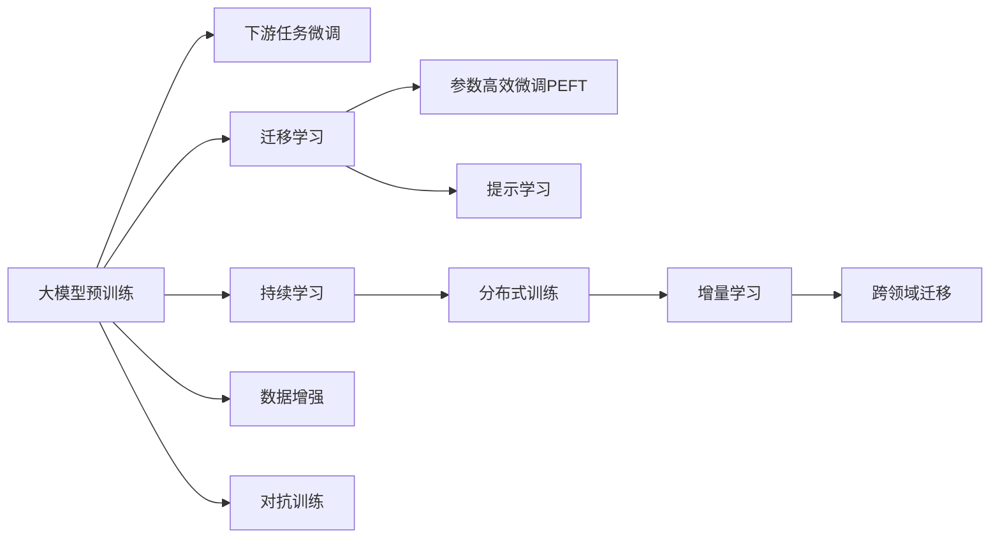

                 

# AI大模型题材的追捧潮

近年来，人工智能大模型（AI Large Models）在全球范围内掀起了一股追捧潮，从学术界到工业界，从科技公司到创业企业，都在纷纷投入巨大资源，竞相开发和部署大模型。那么，为何大模型会受到如此青睐？其核心原理和操作步骤是什么？本文将从背景介绍、核心概念与联系、核心算法原理及操作步骤、数学模型和公式的详细讲解、项目实践案例、实际应用场景、工具和资源推荐、未来发展趋势与挑战等方面，全面解析AI大模型的相关技术和应用。

## 1. 背景介绍

### 1.1 问题由来
人工智能大模型指的是具有庞大参数量和强大计算能力的深度学习模型。这些模型通过在大量数据上进行的深度学习训练，可以学习到非常复杂的知识表示，并在特定任务上表现出色。近年来，随着计算能力的提升和数据量的爆炸式增长，大模型在自然语言处理（NLP）、计算机视觉（CV）、语音识别（ASR）等领域的性能有了显著提升，成为推动人工智能技术进步的重要驱动力。

### 1.2 问题核心关键点
大模型的流行，主要得益于其在解决实际问题上的强大能力。相比传统的浅层模型，大模型通过自动学习数据分布，能够适应更复杂、更多变的任务需求。其核心原理和操作步骤主要包括：

1. **参数量**：大模型的参数量通常超过十亿个，能够承载丰富的知识表示，进行复杂的特征提取和表示学习。
2. **计算资源**：大模型的训练和推理需要强大的计算资源支持，包括GPU、TPU等高性能硬件。
3. **预训练与微调**：大模型通常首先在大量无标签数据上进行预训练，然后在特定任务上进行微调，以适应具体的应用需求。

## 2. 核心概念与联系

### 2.1 核心概念概述
大模型的开发和应用涉及多个关键概念，包括预训练、微调、迁移学习、参数高效微调、提示学习等。

- **预训练**：在大规模无标签数据上，通过自监督学习任务训练模型，学习到通用的知识表示。
- **微调**：在预训练模型的基础上，使用下游任务的少量标注数据，通过有监督学习优化模型在该任务上的性能。
- **迁移学习**：将预训练模型的知识迁移到下游任务中，减少训练时间和标注成本。
- **参数高效微调（PEFT）**：只更新模型中部分参数，固定大部分预训练参数，提高微调效率。
- **提示学习**：通过设计特定的输入模板，引导大模型进行特定任务的推理和生成，无需更新模型参数。

### 2.2 核心概念原理和架构的 Mermaid 流程图


## 3. 核心算法原理 & 具体操作步骤

### 3.1 算法原理概述

大模型的核心算法原理主要包括预训练、微调和迁移学习。以下是对这些步骤的详细解释：

- **预训练**：在大规模无标签数据集上进行自监督学习，学习到通用的知识表示。预训练的过程通常包括掩码语言模型（MLM）、下一句预测（NSP）等自监督任务。
- **微调**：在预训练模型的基础上，使用下游任务的少量标注数据进行有监督学习，优化模型在该任务上的性能。微调通常包括选择合适的网络结构、定义损失函数、设置超参数等步骤。
- **迁移学习**：通过将预训练模型的知识迁移到下游任务中，减少标注数据的数量和质量要求，提高模型泛化能力。

### 3.2 算法步骤详解

以下是使用Transformer模型进行NLP任务微调的详细步骤：

1. **准备预训练模型和数据集**：选择合适的预训练模型（如BERT、GPT-2等）和下游任务的标注数据集，划分为训练集、验证集和测试集。
2. **添加任务适配层**：根据任务类型，在预训练模型顶层设计合适的输出层和损失函数。例如，对于分类任务，通常在顶层添加线性分类器和交叉熵损失函数。
3. **设置微调超参数**：选择合适的优化器（如AdamW）及其参数，设置学习率、批大小、迭代轮数等。
4. **执行梯度训练**：将训练集数据分批次输入模型，前向传播计算损失函数，反向传播计算参数梯度，根据优化算法更新模型参数。
5. **测试和部署**：在测试集上评估微调后模型，集成到实际的应用系统中，持续收集新数据，定期重新微调模型。

### 3.3 算法优缺点

大模型的优点包括：

- **高效性**：在少量标注数据的情况下，可以显著提升模型性能，缩短开发周期。
- **泛化能力**：通过预训练和迁移学习，模型能够学习到通用的知识表示，适应多种任务。
- **可扩展性**：在大规模数据集上进行预训练，可以逐步提升模型能力，适应更复杂的应用需求。

缺点包括：

- **计算资源需求高**：大模型的训练和推理需要强大的计算资源支持。
- **过拟合风险**：在大规模数据集上进行微调时，可能会出现过拟合的风险。
- **可解释性不足**：大模型通常被视为"黑盒"模型，其决策过程难以解释。

### 3.4 算法应用领域

大模型广泛应用于自然语言处理（NLP）、计算机视觉（CV）、语音识别（ASR）等多个领域，具体包括：

- **NLP**：文本分类、情感分析、机器翻译、问答系统等。
- **CV**：图像分类、目标检测、图像生成等。
- **ASR**：语音识别、语音合成、语音情感分析等。

## 4. 数学模型和公式 & 详细讲解 & 举例说明

### 4.1 数学模型构建

大模型的数学模型通常基于深度神经网络，包括卷积神经网络（CNN）、循环神经网络（RNN）、变分自编码器（VAE）、自回归模型（如GPT）等。

以BERT为例，其数学模型可以表示为：

$$
H(x) = M(x)W_{\text{cls}} \cdot \left[ \tanh (W_{h}H(x) + b_{h}) \right]
$$

其中，$x$为输入文本，$M$为Transformer编码器，$W_{\text{cls}}$为分类器权重，$W_{h}$和$b_{h}$为隐藏层权重和偏置。

### 4.2 公式推导过程

以BERT的掩码语言模型（MLM）为例，其损失函数可以表示为：

$$
\mathcal{L} = -\frac{1}{N}\sum_{i=1}^N \sum_{j=1}^N \log\left( \frac{e^{W_{h}^{[j]} \cdot \tanh (W_{h}H(x_j) + b_{h})} }{\sum_{k=1}^K e^{W_{h}^{[k]} \cdot \tanh (W_{h}H(x_j) + b_{h})} } \right)
$$

其中，$N$为样本数，$K$为词汇表大小。

### 4.3 案例分析与讲解

以图像分类任务为例，使用大模型进行微调的过程包括：

1. **准备数据集**：收集包含分类标签的图像数据集，如ImageNet。
2. **加载预训练模型**：选择适合的预训练模型（如ResNet），加载模型权重。
3. **添加任务适配层**：在模型顶层添加全连接层和分类器，用于输出类别概率。
4. **定义损失函数**：使用交叉熵损失函数，计算模型预测与真实标签之间的差异。
5. **执行微调**：在标注数据上进行微调，优化模型权重，使模型更好地适应分类任务。
6. **测试和部署**：在测试集上评估微调后模型的性能，部署到实际应用中。

## 5. 项目实践：代码实例和详细解释说明

### 5.1 开发环境搭建

以下是使用Python进行PyTorch开发的环境配置流程：

1. 安装Anaconda：从官网下载并安装Anaconda，用于创建独立的Python环境。
2. 创建并激活虚拟环境：
```bash
conda create -n pytorch-env python=3.8 
conda activate pytorch-env
```
3. 安装PyTorch：根据CUDA版本，从官网获取对应的安装命令。例如：
```bash
conda install pytorch torchvision torchaudio cudatoolkit=11.1 -c pytorch -c conda-forge
```
4. 安装Transformers库：
```bash
pip install transformers
```
5. 安装各类工具包：
```bash
pip install numpy pandas scikit-learn matplotlib tqdm jupyter notebook ipython
```

完成上述步骤后，即可在`pytorch-env`环境中开始项目实践。

### 5.2 源代码详细实现

以下是使用PyTorch对BERT进行图像分类任务微调的PyTorch代码实现：

```python
from transformers import BertForImageClassification, BertModel
from torch.utils.data import DataLoader
from torchvision import datasets, transforms

# 准备数据集
train_dataset = datasets.CIFAR10(root='./data', train=True, download=True, transform=transforms.ToTensor())
test_dataset = datasets.CIFAR10(root='./data', train=False, download=True, transform=transforms.ToTensor())

# 加载预训练模型
model = BertForImageClassification.from_pretrained('bert-base-uncased')
model.load_state_dict(torch.load('pretrained_model_weights.pth'))

# 添加任务适配层
model.classifier = nn.Linear(768, 10)

# 定义损失函数和优化器
criterion = nn.CrossEntropyLoss()
optimizer = AdamW(model.parameters(), lr=2e-5)

# 执行微调
device = torch.device('cuda' if torch.cuda.is_available() else 'cpu')
model.to(device)
for epoch in range(10):
    model.train()
    for images, labels in train_loader:
        images = images.to(device)
        labels = labels.to(device)
        optimizer.zero_grad()
        outputs = model(images)
        loss = criterion(outputs, labels)
        loss.backward()
        optimizer.step()
    model.eval()
    with torch.no_grad():
        correct = 0
        total = 0
        for images, labels in test_loader:
            images = images.to(device)
            labels = labels.to(device)
            outputs = model(images)
            _, predicted = torch.max(outputs.data, 1)
            total += labels.size(0)
            correct += (predicted == labels).sum().item()
        print(f'Accuracy: {100 * correct / total:.2f}%')
```

### 5.3 代码解读与分析

以下是关键代码的实现细节：

**数据处理**：
- `datasets.CIFAR10`：用于加载CIFAR-10数据集。
- `transforms.ToTensor()`：将图像数据转换为Tensor格式。

**模型加载**：
- `BertForImageClassification`：加载预训练的图像分类模型。
- `load_state_dict`：加载模型权重文件。

**任务适配层**：
- `nn.Linear`：添加全连接层，用于输出分类概率。

**损失函数和优化器**：
- `nn.CrossEntropyLoss`：交叉熵损失函数。
- `AdamW`：优化器，用于更新模型参数。

**微调过程**：
- `device`：设置计算设备。
- `model.train()`：进入训练模式。
- `model.eval()`：进入评估模式。
- `optimizer.zero_grad()`：清零梯度。
- `loss.backward()`：反向传播。
- `optimizer.step()`：更新模型参数。

**评估过程**：
- `correct`：计算正确预测的样本数。
- `total`：总样本数。
- `print`：输出准确率。

## 6. 实际应用场景

### 6.1 智能推荐系统

大模型在智能推荐系统中的应用，可以显著提升推荐效果。传统的推荐系统通常依赖于用户的历史行为数据，难以捕捉用户的深层次兴趣和潜在需求。通过大模型的预训练和微调，可以学习到更丰富的用户画像和商品特征，从而生成更加个性化和精准的推荐结果。

### 6.2 医学影像诊断

大模型在医学影像诊断中的应用，可以大幅提升诊断的准确性和效率。通过在大规模医学影像数据集上进行预训练和微调，大模型可以学习到复杂的医学特征，识别出微小的病灶和异常。结合医生的知识和经验，大模型可以辅助医生进行快速诊断，提高医疗服务水平。

### 6.3 自动驾驶

大模型在自动驾驶中的应用，可以实现车辆环境的感知和决策。通过在大规模交通数据集上进行预训练和微调，大模型可以学习到交通规则、路标标识、行人行为等知识，辅助车辆做出合理决策，提高驾驶安全性。

## 7. 工具和资源推荐

### 7.1 学习资源推荐

为了帮助开发者掌握大模型的相关技术，以下是一些推荐的学习资源：

1. 《深度学习入门：基于Python的理论与实现》：适合初学者入门，全面介绍了深度学习的理论基础和实践技术。
2. 《深度学习与TensorFlow 2.0实践》：由TensorFlow官方作者编写，详细讲解了TensorFlow的用法和最佳实践。
3. 《Transformers库教程》：由HuggingFace官方提供，介绍了Transformer模型和微调范式。
4. CS231n《卷积神经网络》课程：斯坦福大学开设的计算机视觉课程，涵盖了CNN的理论与实践。
5. Kaggle竞赛：参加Kaggle的深度学习竞赛，积累实战经验，提升技术水平。

### 7.2 开发工具推荐

以下是几款常用的大模型开发工具：

1. PyTorch：基于Python的开源深度学习框架，灵活高效的计算图，适合快速迭代研究。
2. TensorFlow：由Google主导开发的深度学习框架，生产部署方便，适合大规模工程应用。
3. Weights & Biases：模型训练的实验跟踪工具，可以记录和可视化模型训练过程中的各项指标。
4. TensorBoard：TensorFlow配套的可视化工具，实时监测模型训练状态。
5. Google Colab：谷歌推出的在线Jupyter Notebook环境，免费提供GPU/TPU算力。

### 7.3 相关论文推荐

大模型的研究涉及多个前沿方向，以下是几篇奠基性的相关论文：

1. Attention is All You Need：提出了Transformer结构，开启了NLP领域的预训练大模型时代。
2. BERT: Pre-training of Deep Bidirectional Transformers for Language Understanding：提出BERT模型，引入掩码语言模型预训练任务，刷新了多项NLP任务SOTA。
3. ImageNet Classification with Deep Convolutional Neural Networks：提出了卷积神经网络（CNN），奠定了计算机视觉领域的基础。

## 8. 总结：未来发展趋势与挑战

### 8.1 总结

本文对大模型的相关技术进行了全面系统的介绍，涵盖背景介绍、核心概念与联系、核心算法原理及具体操作步骤、数学模型和公式的详细讲解、项目实践案例、实际应用场景、工具和资源推荐、未来发展趋势与挑战等方面。通过本文的系统梳理，可以看到，大模型在NLP、CV、ASR等多个领域都展现出了强大的应用潜力，为人工智能技术的进一步发展提供了重要的驱动力。

### 8.2 未来发展趋势

未来，大模型的发展将呈现以下几个趋势：

1. **模型规模更大**：随着计算能力的提升和数据量的增加，大模型的参数量将持续增大，能够承载更多的知识表示和复杂的特征提取。
2. **应用范围更广**：大模型在NLP、CV、ASR等领域的落地应用将更加广泛，推动各行业的智能化转型。
3. **模型可解释性增强**：大模型的决策过程将更加透明和可解释，有助于增强用户信任和使用体验。
4. **跨领域迁移能力提升**：大模型将具备更强的跨领域迁移能力，能够在多个领域进行知识迁移和任务适配。
5. **模型优化方法更多样**：将引入更多优化算法和技术，提高大模型的训练效率和效果。

### 8.3 面临的挑战

尽管大模型具有巨大的应用潜力，但也面临许多挑战：

1. **计算资源需求高**：大模型的训练和推理需要强大的计算资源支持，可能会带来高昂的成本。
2. **数据隐私和安全**：大模型在处理敏感数据时，需要注意数据隐私和安全问题，防止数据泄露和滥用。
3. **模型泛化能力**：大模型在不同领域和数据分布上的泛化能力仍需提升，避免模型过拟合或泛化不足。
4. **模型可解释性不足**：大模型的决策过程难以解释，可能会带来伦理和法律问题。
5. **模型鲁棒性不足**：大模型在面对新数据和干扰时，需要具备更强的鲁棒性和抗干扰能力。

### 8.4 研究展望

面对这些挑战，未来的研究需要在以下几个方面进行突破：

1. **模型压缩和优化**：通过模型压缩、量化等技术，降低计算资源需求，提高模型效率。
2. **数据隐私保护**：引入隐私保护技术，保护用户数据隐私。
3. **跨领域迁移学习**：研究更加灵活和高效的知识迁移方法，提升模型泛化能力。
4. **模型可解释性增强**：引入可解释性技术，提高大模型的透明性和可解释性。
5. **模型鲁棒性提升**：引入对抗训练、鲁棒性评估等方法，提升大模型的鲁棒性。

## 9. 附录：常见问题与解答

**Q1: 大模型是否适用于所有任务？**

A: 大模型在大多数NLP、CV、ASR等任务上都能够取得较好的效果，但在某些特定领域，如金融、医疗等，需要根据具体应用场景进行进一步的预训练和微调。

**Q2: 大模型训练需要哪些资源？**

A: 大模型的训练和推理需要强大的计算资源，包括GPU、TPU等高性能硬件，同时还需要大量的标注数据和标注工具。

**Q3: 大模型训练过程中如何避免过拟合？**

A: 大模型训练过程中，可以通过数据增强、正则化、对抗训练等方法避免过拟合。

**Q4: 大模型在实际应用中需要注意哪些问题？**

A: 大模型在实际应用中，需要注意模型优化、数据隐私保护、模型部署等问题。

---

作者：禅与计算机程序设计艺术 / Zen and the Art of Computer Programming

