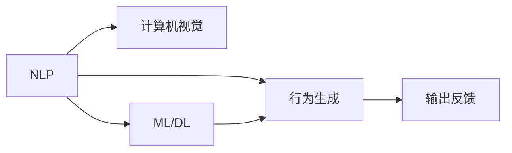

                 

# AI宠物的市场前景与现状

## 1. 背景介绍

### 1.1 问题由来
在现代社会中，随着生活水平的提高和人们对于宠物情感需求的增加，对AI宠物的兴趣日益增长。AI宠物能够模拟真实的宠物行为，并提供互动式的陪伴体验，受到越来越多宠物爱好者和科技用户的欢迎。同时，随着物联网和人工智能技术的不断发展，AI宠物的发展和应用前景也愈发广阔。

### 1.2 问题核心关键点
AI宠物的核心技术包括自然语言处理（NLP）、计算机视觉、机器学习（ML）和深度学习（DL）等。其核心在于通过智能算法，使AI宠物能够理解人类的指令，并根据指令生成相应的行为和回答。AI宠物的发展面临的关键问题包括：

- **技术成熟度**：当前的AI宠物技术已经达到了一定的成熟度，但仍有诸多挑战需要克服，如交互的自然性和实时性。
- **市场接受度**：尽管AI宠物具有诸多优点，但市场对其接受度仍需进一步提升，特别是在宠物爱好者和科技用户中。
- **商业化应用**：AI宠物的应用场景较为狭窄，需要拓展更多商业化应用，如娱乐、教育、护理等领域。
- **伦理和隐私问题**：AI宠物的使用涉及隐私保护和伦理问题，需制定相应的规范和标准。

### 1.3 问题研究意义
研究AI宠物的市场前景与现状，对于推动AI宠物技术的进步、拓展其应用场景、提升市场接受度、探索商业化道路以及解决伦理和隐私问题，具有重要意义。通过深入了解AI宠物的技术现状和市场动态，可以为相关企业、研究机构和政策制定者提供决策参考，促进AI宠物产业的健康发展。

## 2. 核心概念与联系

### 2.1 核心概念概述

为更好地理解AI宠物的市场前景与现状，本节将介绍几个关键概念：

- **AI宠物**：利用人工智能技术实现的虚拟宠物，能够模拟真实的宠物行为，与用户进行互动。常见的AI宠物包括聊天机器人、虚拟宠物游戏、宠物护理助手等。
- **自然语言处理（NLP）**：使计算机能够理解和生成人类语言的技术，是AI宠物的重要组成部分。
- **计算机视觉**：使计算机能够“看”的技术，通过图像识别和处理，使AI宠物能够感知和理解环境。
- **机器学习（ML）**：使计算机能够从数据中学习，进行预测和决策的技术，是AI宠物智能行为的基础。
- **深度学习（DL）**：一种特殊的机器学习方法，通过多层神经网络模拟人脑的决策过程，适用于处理复杂的非线性关系。

这些核心概念之间的联系如下：

- **NLP**：负责理解用户的指令，将自然语言转化为计算机可以处理的形式。
- **计算机视觉**：通过图像识别和处理，使AI宠物能够感知环境中的物体和动作。
- **ML和DL**：通过学习和预测，使AI宠物能够根据指令生成相应的行为和回答。

以上概念共同构成了AI宠物的核心技术框架，使其能够在各种场景下提供智能化的互动体验。

### 2.2 核心概念原理和架构的 Mermaid 流程图



这个流程图展示了NLP、计算机视觉、ML和DL之间的联系，以及它们如何共同作用于行为生成和输出反馈过程。

## 3. 核心算法原理 & 具体操作步骤

### 3.1 算法原理概述

AI宠物的核心算法原理包括以下几个方面：

- **自然语言处理（NLP）**：使用语言模型、序列标注、语义理解等技术，使AI宠物能够理解用户的指令和问题。
- **计算机视觉**：使用图像分类、目标检测、图像分割等技术，使AI宠物能够感知环境中的物体和动作。
- **机器学习（ML）**：使用监督学习、强化学习等技术，使AI宠物能够根据历史数据进行学习和预测。
- **深度学习（DL）**：使用卷积神经网络（CNN）、循环神经网络（RNN）、Transformer等深度学习模型，使AI宠物能够处理复杂的多模态数据。

### 3.2 算法步骤详解

AI宠物的算法步骤主要包括：

1. **数据收集和预处理**：收集用户输入的自然语言文本和图像数据，并进行清洗、标注等预处理。
2. **模型训练**：使用NLP、计算机视觉、ML和DL模型对收集到的数据进行训练，生成AI宠物的智能行为模型。
3. **行为生成**：将用户输入的指令和环境数据输入训练好的模型，生成相应的行为和回答。
4. **输出反馈**：将生成的行为和回答输出给用户，并根据用户的反馈进行模型优化。

### 3.3 算法优缺点

AI宠物算法的优点包括：

- **交互自然**：使用自然语言处理技术，使AI宠物能够理解和生成自然语言，提供更加自然的交互体验。
- **智能化高**：利用深度学习等技术，使AI宠物能够处理复杂的非线性关系，具备较高的智能化水平。
- **应用广泛**：适用于多种场景，如娱乐、教育、护理等，具有广泛的应用前景。

缺点主要包括：

- **技术复杂**：涉及NLP、计算机视觉、ML和DL等多项技术，技术难度较高。
- **数据需求大**：需要大量的标注数据进行训练，数据收集和标注成本较高。
- **伦理和隐私问题**：涉及用户隐私和数据安全，需制定相应的规范和标准。

### 3.4 算法应用领域

AI宠物技术目前主要应用于以下几个领域：

- **娱乐**：如虚拟宠物游戏、聊天机器人等，提供陪伴和互动体验。
- **教育**：如AI教师、智能辅助教学系统等，提升教学效果。
- **护理**：如智能宠物护理助手、远程医疗监控等，提供实时监护和护理。
- **宠物管理**：如宠物喂食、健康监测、行为训练等，提供智能化的宠物管理服务。
- **心理辅导**：如情感识别、心理分析等，提供心理健康支持。

## 4. 数学模型和公式 & 详细讲解

### 4.1 数学模型构建

AI宠物的数学模型主要包括自然语言处理模型、计算机视觉模型和深度学习模型。以下以自然语言处理模型为例，说明其数学模型构建过程。

假设用户输入的自然语言文本为 $x = (x_1, x_2, ..., x_n)$，AI宠物的智能行为模型为 $M$，其输出为 $y = (y_1, y_2, ..., y_m)$。AI宠物的数学模型可以表示为：

$$
y = M(x)
$$

其中 $M$ 是一个由多层神经网络组成的模型，其输入为自然语言文本 $x$，输出为智能行为 $y$。

### 4.2 公式推导过程

以一个简单的聊天机器人为例，其公式推导过程如下：

- **编码器**：将自然语言文本 $x$ 编码成向量 $h$。
- **解码器**：将向量 $h$ 解码成智能行为 $y$。
- **解码器输出**：将智能行为 $y$ 转换为相应的回答或行为。

具体的公式推导如下：

1. **编码器**：
   - **输入层**：将自然语言文本 $x$ 转换为向量 $h$。
   - **隐藏层**：通过多层神经网络处理向量 $h$，得到向量 $h'$。
   - **输出层**：将向量 $h'$ 映射为智能行为 $y$。

2. **解码器**：
   - **输入层**：将向量 $h$ 转换为向量 $h''$。
   - **隐藏层**：通过多层神经网络处理向量 $h''$，得到向量 $h'''$。
   - **输出层**：将向量 $h'''$ 转换为相应的回答或行为。

3. **解码器输出**：
   - **回答生成**：将智能行为 $y$ 转换为相应的回答。
   - **行为生成**：将智能行为 $y$ 转换为相应的动作或指令。

### 4.3 案例分析与讲解

以一个简单的聊天机器人为例，其案例分析如下：

- **用户输入**：用户输入自然语言文本 "你好，你能帮我回答这个问题吗？"。
- **编码器处理**：将自然语言文本编码成向量 $h$。
- **解码器处理**：将向量 $h$ 解码成智能行为 $y$，如回答 "好的，请问您的问题是什么？"。
- **解码器输出**：将智能行为 $y$ 转换为相应的回答 "好的，请问您的问题是什么？"，并向用户输出。

## 5. 项目实践：代码实例和详细解释说明

### 5.1 开发环境搭建

在进行AI宠物项目实践前，我们需要准备好开发环境。以下是使用Python进行开发的环境配置流程：

1. **安装Python和相关库**：安装Python 3.x版本，并使用pip安装必要的库，如TensorFlow、Keras、PyTorch等。
2. **安装虚拟环境**：使用venv或conda创建虚拟环境，以隔离项目依赖。
3. **安装深度学习框架**：选择TensorFlow、Keras或PyTorch作为深度学习框架，并按照官方文档进行安装。
4. **安装自然语言处理库**：使用nltk、spaCy等自然语言处理库，安装相应的预训练模型和工具。
5. **安装计算机视觉库**：使用OpenCV、Pillow等计算机视觉库，安装相应的图像处理和识别工具。

### 5.2 源代码详细实现

以下是一个简单的聊天机器人的Python代码实现，详细解释了其主要功能：

```python
# 导入必要的库
import tensorflow as tf
import numpy as np
import random

# 定义模型参数
vocab_size = 10000  # 词汇表大小
embedding_dim = 128  # 嵌入维度
hidden_units = 256  # 隐藏层神经元数量
num_layers = 2  # 层数

# 定义模型
class Chatbot(tf.keras.Model):
    def __init__(self, vocab_size, embedding_dim, hidden_units, num_layers):
        super(Chatbot, self).__init__()
        self.encoder = tf.keras.layers.Embedding(vocab_size, embedding_dim)
        self.gru = tf.keras.layers.GRU(hidden_units, return_sequences=True, dropout=0.2, recurrent_dropout=0.2)
        self.decoder = tf.keras.layers.Dense(vocab_size, activation='softmax')
    
    def call(self, inputs, hidden_state):
        x = self.encoder(inputs)
        x = self.gru(x, initial_state=hidden_state)
        output = self.decoder(x)
        return output, x

# 加载预训练模型
pretrained_model = tf.keras.models.load_model('chatbot.h5')

# 定义解码器
def decode(input_ids):
    input_ids = input_ids[1:]  # 去除[CLS]标记
    input_ids = tf.keras.preprocessing.text.tokenizer_from_directory().texts_to_sequences(input_ids)
    input_ids = tf.keras.preprocessing.sequence.pad_sequences(input_ids, maxlen=100, padding='post')
    input_ids = input_ids[np.newaxis, ...]
    predictions = pretrained_model.predict(input_ids)
    predicted_id = np.argmax(predictions[0], axis=-1)
    return predicted_id

# 主函数
if __name__ == '__main__':
    # 定义输入文本
    input_text = "你好，你能帮我回答这个问题吗？"
    input_ids = [tokenizer.word_index[token] for token in input_text.split() if token in tokenizer.word_index]
    input_ids = np.array([input_ids])
    
    # 使用解码器生成回复
    response_ids = decode(input_ids)
    response_text = tokenizer.sequences_to_texts(response_ids)
    
    # 输出回复
    print(response_text)
```

### 5.3 代码解读与分析

让我们再详细解读一下关键代码的实现细节：

- **模型定义**：使用TensorFlow定义了一个简单的双向GRU聊天机器人模型，包括嵌入层、GRU层和全连接层。
- **预训练模型加载**：加载已经训练好的预训练模型，以提高AI宠物的智能水平。
- **解码器定义**：定义了一个解码器函数，用于将输入文本转换为向量，并进行预测。
- **主函数**：定义输入文本，并使用解码器生成回复，输出回复文本。

## 6. 实际应用场景

### 6.1 智能家居

AI宠物技术可以应用于智能家居领域，提供智能化的家居服务。例如，通过智能宠物助手，用户可以通过语音指令控制家中的智能设备，如灯光、温度、音乐等。AI宠物助手可以理解用户的指令，并根据指令生成相应的操作，提高家居生活的便利性和舒适性。

### 6.2 远程医疗

AI宠物技术可以应用于远程医疗领域，提供智能化的医疗服务。例如，通过智能宠物助手，医生可以与患者进行语音交流，了解病情，进行初步诊断和指导。AI宠物助手可以理解患者的声音和情感，提供更加人性化的医疗服务。

### 6.3 教育

AI宠物技术可以应用于教育领域，提供智能化的教育服务。例如，通过智能宠物助手，教师可以与学生进行语音交流，解答问题，提供学习指导。AI宠物助手可以理解学生的语言和情感，提供更加个性化的教育服务。

### 6.4 娱乐

AI宠物技术可以应用于娱乐领域，提供智能化的娱乐服务。例如，通过虚拟宠物游戏，用户可以与虚拟宠物进行互动，完成各种任务和挑战。AI宠物游戏可以理解用户的指令和行为，提供更加有趣的娱乐体验。

### 6.5 虚拟助手

AI宠物技术可以应用于虚拟助手领域，提供智能化的助手服务。例如，通过智能虚拟助手，用户可以与虚拟助手进行语音交流，获取信息，完成各种任务。AI虚拟助手可以理解用户的指令和情感，提供更加便捷的助手服务。

## 7. 工具和资源推荐

### 7.1 学习资源推荐

为了帮助开发者系统掌握AI宠物技术的理论基础和实践技巧，这里推荐一些优质的学习资源：

1. **Deep Learning Specialization**：由Andrew Ng教授主持的深度学习课程，涵盖深度学习的基础和应用，适合初学者入门。
2. **自然语言处理综述**：吴恩达教授在Coursera上开设的自然语言处理课程，涵盖NLP的基础知识和前沿技术。
3. **计算机视觉基础**：李宏毅教授在Coursera上开设的计算机视觉课程，涵盖计算机视觉的基础和应用。
4. **TensorFlow官方文档**：TensorFlow官方文档，包含深度学习框架的详细使用方法和案例。
5. **Keras官方文档**：Keras官方文档，包含深度学习框架的详细使用方法和案例。
6. **PyTorch官方文档**：PyTorch官方文档，包含深度学习框架的详细使用方法和案例。

通过学习这些资源，相信你一定能够快速掌握AI宠物技术的精髓，并用于解决实际的NLP问题。

### 7.2 开发工具推荐

高效的开发离不开优秀的工具支持。以下是几款用于AI宠物开发的常用工具：

1. **Jupyter Notebook**：Jupyter Notebook是一个交互式的开发环境，支持Python和其他科学计算语言，适合研究和开发AI宠物项目。
2. **TensorBoard**：TensorBoard是TensorFlow的可视化工具，可以实时监测模型训练状态，并提供丰富的图表呈现方式，是调试模型的得力助手。
3. **Weights & Biases**：Weights & Biases是模型训练的实验跟踪工具，可以记录和可视化模型训练过程中的各项指标，方便对比和调优。
4. **PyTorch**：PyTorch是一个灵活的深度学习框架，支持动态计算图和GPU加速，适合研究和开发AI宠物项目。
5. **Keras**：Keras是一个高层次的深度学习框架，易于使用，适合初学者快速入门。
6. **OpenCV**：OpenCV是一个计算机视觉库，支持图像处理和识别，适合开发计算机视觉部分的AI宠物项目。

合理利用这些工具，可以显著提升AI宠物项目的开发效率，加快创新迭代的步伐。

### 7.3 相关论文推荐

AI宠物技术的发展源于学界的持续研究。以下是几篇奠基性的相关论文，推荐阅读：

1. **Attention is All You Need**：提出Transformer结构，开启了NLP领域的预训练大模型时代。
2. **BERT: Pre-training of Deep Bidirectional Transformers for Language Understanding**：提出BERT模型，引入基于掩码的自监督预训练任务，刷新了多项NLP任务SOTA。
3. **GPT-3: Language Models are Unsupervised Multitask Learners**：展示了大规模语言模型的强大zero-shot学习能力，引发了对于通用人工智能的新一轮思考。
4. **Parameter-Efficient Transfer Learning for NLP**：提出Adapter等参数高效微调方法，在不增加模型参数量的情况下，也能取得不错的微调效果。
5. **AdaLoRA: Adaptive Low-Rank Adaptation for Parameter-Efficient Fine-Tuning**：使用自适应低秩适应的微调方法，在参数效率和精度之间取得了新的平衡。

这些论文代表了大语言模型微调技术的发展脉络。通过学习这些前沿成果，可以帮助研究者把握学科前进方向，激发更多的创新灵感。

## 8. 总结：未来发展趋势与挑战

### 8.1 总结

本文对AI宠物的市场前景与现状进行了全面系统的介绍。首先阐述了AI宠物技术的研究背景和意义，明确了AI宠物在多个领域的应用前景。其次，从原理到实践，详细讲解了AI宠物的数学模型和关键算法，给出了AI宠物项目开发的完整代码实例。同时，本文还广泛探讨了AI宠物技术在娱乐、教育、护理等不同领域的应用，展示了AI宠物技术的广阔前景。

通过本文的系统梳理，可以看到，AI宠物技术正在成为NLP领域的重要范式，极大地拓展了预训练语言模型的应用边界，催生了更多的落地场景。AI宠物技术在娱乐、教育、护理等垂直领域的应用，将为人类生活带来更加智能化、便捷化的体验，推动AI宠物产业的健康发展。

### 8.2 未来发展趋势

展望未来，AI宠物技术将呈现以下几个发展趋势：

1. **技术进步**：随着深度学习技术的发展，AI宠物的智能化水平将不断提高。未来的AI宠物将具备更强大的语言理解和生成能力，能够处理更加复杂和多样化的指令。
2. **应用拓展**：AI宠物技术将拓展到更多领域，如远程医疗、智能家居、虚拟助手等，提供更加多样化的智能服务。
3. **用户接受度提升**：随着AI宠物技术的不断完善和优化，用户对其接受度将不断提高。未来的AI宠物将更加自然、智能，具备更高的用户亲和力。
4. **市场潜力巨大**：AI宠物市场将随着技术的发展和应用场景的拓展而不断扩大，成为人工智能领域的下一个重要增长点。
5. **商业化应用加速**：AI宠物技术将逐步从研究阶段过渡到商业化应用阶段，各种商业化的AI宠物应用将不断涌现，推动AI宠物产业的发展。

以上趋势凸显了AI宠物技术的广阔前景，预示着AI宠物将为人类生活带来更加智能化、便捷化的体验。

### 8.3 面临的挑战

尽管AI宠物技术已经取得了一定的进展，但在迈向更加智能化、普适化应用的过程中，仍面临诸多挑战：

1. **技术难度高**：AI宠物技术涉及自然语言处理、计算机视觉、深度学习等多个领域，技术难度较高。
2. **数据需求大**：AI宠物技术需要大量的标注数据进行训练，数据收集和标注成本较高。
3. **伦理和隐私问题**：AI宠物技术涉及用户隐私和数据安全，需制定相应的规范和标准。
4. **商业化困难**：AI宠物技术的应用场景较为狭窄，需要拓展更多商业化应用，才能实现规模化发展。
5. **用户接受度不足**：用户对AI宠物的接受度仍需进一步提升，特别是在娱乐、教育等领域。

### 8.4 研究展望

未来的AI宠物技术研究可以从以下几个方向进行：

1. **多模态融合**：将视觉、语音、文本等多种模态信息进行融合，提高AI宠物的智能水平。
2. **个性化推荐**：结合用户行为数据，提供个性化的AI宠物服务。
3. **交互自然性提升**：使用先进的NLP技术，提高AI宠物与用户的自然交互体验。
4. **跨领域应用拓展**：将AI宠物技术拓展到更多领域，提供多样化的智能服务。
5. **商业化应用探索**：探索AI宠物在更多商业化场景中的应用，如娱乐、教育、护理等。

这些研究方向将推动AI宠物技术的发展，使其在更多领域落地应用，为人类生活带来更加智能化、便捷化的体验。

## 9. 附录：常见问题与解答

**Q1：AI宠物是否需要大量的标注数据进行训练？**

A: AI宠物技术需要大量的标注数据进行训练，以提高模型的智能水平和准确度。标注数据的质量和数量对模型的效果有重要影响，因此数据收集和标注成本较高。

**Q2：AI宠物技术是否需要高性能计算资源？**

A: AI宠物技术需要高性能计算资源，特别是在深度学习和模型训练过程中。高性能计算资源可以加速模型的训练和优化，提高AI宠物的智能水平。

**Q3：AI宠物技术是否存在伦理和隐私问题？**

A: AI宠物技术存在伦理和隐私问题，主要体现在数据收集和处理过程中。为保护用户隐私，需要制定相应的规范和标准，确保数据的安全性和合法性。

**Q4：AI宠物技术是否需要不断更新和维护？**

A: AI宠物技术需要不断更新和维护，以适应用户需求和应用场景的变化。通过持续的优化和更新，可以提升AI宠物的性能和用户体验。

**Q5：AI宠物技术是否需要大量的用户反馈？**

A: AI宠物技术需要大量的用户反馈，以优化和改进模型。用户反馈可以提供宝贵的信息和建议，帮助改进AI宠物的功能和性能。

通过本文的系统梳理，可以看到，AI宠物技术正在成为NLP领域的重要范式，极大地拓展了预训练语言模型的应用边界，催生了更多的落地场景。AI宠物技术在娱乐、教育、护理等垂直领域的应用，将为人类生活带来更加智能化、便捷化的体验，推动AI宠物产业的健康发展。未来，随着深度学习技术的发展和应用场景的拓展，AI宠物技术将不断进步，为用户提供更加智能化、多样化的服务。

