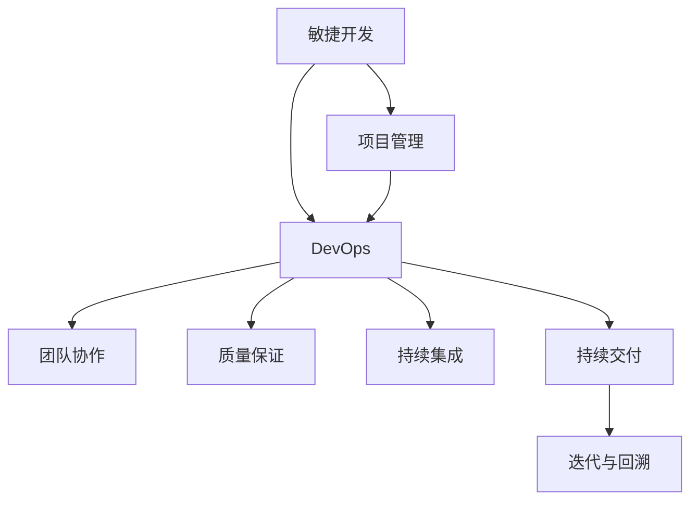

                 

# AI开发的敏捷方法论：Lepton AI的项目管理

> 关键词：敏捷开发,项目管理,Lepton AI,DevOps,团队协作,质量保证,持续集成,持续交付

## 1. 背景介绍

### 1.1 问题由来
随着人工智能技术的快速发展，越来越多的企业希望借助AI技术实现业务创新和效率提升。然而，AI项目往往涉及跨部门协作、大量数据处理和复杂模型训练，其开发周期长、风险高、投资大。传统的一次性研发流程已难以满足日益增长的AI需求，因此，敏捷开发和项目管理方法在AI开发中显得尤为重要。

### 1.2 问题核心关键点
AI项目的敏捷开发和项目管理，需要聚焦以下几个关键点：
- 快速响应业务需求，灵活调整开发计划。
- 确保项目质量和进度，降低开发风险。
- 促进跨部门协作，提升团队协作效率。
- 实现高效资源利用，提升项目产出效益。
- 保持技术栈稳定，减少开发和部署成本。

## 2. 核心概念与联系

### 2.1 核心概念概述

为更好地理解Lepton AI的敏捷项目管理方法，本节将介绍几个密切相关的核心概念：

- 敏捷开发(Agile Development)：一种迭代、增量式、用户为中心的开发方法，强调快速响应变化，持续交付价值。
- 项目管理(Project Management)：通过计划、执行、监控、收尾等活动，确保项目按时、按质、按预算完成。
- Lepton AI：一种基于敏捷开发原则的AI项目管理框架，强调通过代码即配置、代码即文档、代码即测试，实现高效、可控的AI开发。
- DevOps：一种将开发、测试、运维紧密结合的持续集成(CI)和持续交付(CD)流程，提升软件的开发和部署效率。
- 团队协作(Collaboration)：通过有效的沟通和协作工具，促进不同背景和技术水平的人员之间高效交流，确保项目顺利进行。
- 质量保证(Quality Assurance)：通过严格的测试流程和质量控制，确保交付的软件质量和用户满意度。
- 持续集成(CI)：通过自动化构建和测试流程，及时发现和解决代码冲突，提升开发效率。
- 持续交付(CD)：通过自动化部署流程，快速将软件交付到生产环境，实现业务价值。
- 迭代与回溯(Iteration & Retrospective)：通过快速迭代和定期回溯总结，不断改进开发过程，提升项目质量。

这些核心概念之间的逻辑关系可以通过以下Mermaid流程图来展示：



这个流程图展示了的核心概念及其之间的关系：

1. 敏捷开发是项目管理的基础，强调快速响应变化。
2. DevOps通过自动化流程，支持敏捷开发和项目管理。
3. 团队协作和质量保证是敏捷开发的核心要素。
4. 持续集成和持续交付通过自动化构建和部署，加速敏捷开发。
5. 迭代与回溯机制确保敏捷开发的持续改进。

## 3. 核心算法原理 & 具体操作步骤
### 3.1 算法原理概述

Lepton AI的敏捷项目管理方法，本质上是一种基于敏捷开发原则的AI项目管理框架。其核心思想是：通过敏捷开发流程和DevOps工具链，将AI开发项目拆分为多个可管理的迭代周期，每个周期内进行需求分析、模型构建、测试验证和交付部署，持续迭代优化，以适应业务需求的变化。

具体来说，Lepton AI方法包括以下关键步骤：

1. 需求分析：通过用户访谈、需求文档等方式，明确项目目标和功能需求。
2. 迭代计划：将需求拆分为多个小任务，制定每个迭代周期的计划。
3. 模型构建：在迭代周期内，进行数据预处理、模型训练、评估验证等步骤。
4. 测试验证：通过单元测试、集成测试、性能测试等流程，确保模型质量和稳定性。
5. 交付部署：将模型部署到生产环境，提供API服务或集成到业务系统中。
6. 迭代回溯：在每个迭代周期结束时，进行项目回顾和改进总结，迭代优化。

### 3.2 算法步骤详解

下面详细讲解Lepton AI项目管理的具体步骤：

**Step 1: 需求分析**

- 组织用户访谈和需求讨论会，与业务方和项目干系人共同确认需求和目标。
- 编写需求文档，详细描述项目的功能要求、性能指标、数据需求等。
- 根据需求文档，制定项目的里程碑和时间表，确保各阶段的按时交付。

**Step 2: 迭代计划**

- 将需求拆分为多个小任务，每个任务包含明确的目标和交付物。
- 定义迭代的周期和频率，一般建议每个迭代周期为2-4周。
- 确定每个迭代周期的目标和任务清单，制定详细的工作计划。
- 分配任务给团队成员，明确每个成员的职责和交付物。

**Step 3: 模型构建**

- 收集、清洗和标注数据，准备好模型训练所需的数据集。
- 选择合适的模型架构和超参数，进行预训练或微调。
- 设计合适的损失函数和优化器，进行模型训练和验证。
- 定期在验证集上评估模型性能，进行必要的调整和优化。
- 将模型保存为模型文件和配置文件，供后续部署使用。

**Step 4: 测试验证**

- 编写单元测试、集成测试和性能测试用例，覆盖模型的各个模块和组件。
- 使用测试框架运行测试用例，及时发现和修复代码和模型问题。
- 定期进行功能测试和回归测试，确保模型在新数据上的表现稳定。
- 在测试环境中部署模型，进行集成测试和性能测试，验证模型的生产环境兼容性。

**Step 5: 交付部署**

- 将模型和相关配置文件打包为容器镜像，上传到Docker仓库。
- 使用CI工具（如Jenkins、GitLab CI）自动化构建和测试模型，确保代码和模型的一致性。
- 使用CD工具（如Kubernetes、Docker Compose）自动化部署模型，提供API服务或集成到业务系统中。
- 定期进行模型更新和升级，保持系统的高可用性和稳定性。

**Step 6: 迭代回溯**

- 在每个迭代周期结束时，组织团队回顾会议，总结成功经验和问题。
- 分析项目进度和质量，调整下一步的计划和策略。
- 根据反馈和问题，优化工作流程和工具链，提升项目效率和质量。
- 持续改进和迭代，不断提升项目的产出效益。

### 3.3 算法优缺点

Lepton AI的敏捷项目管理方法具有以下优点：

- 灵活响应变化。通过迭代开发和快速交付，能快速适应业务需求的变化。
- 质量保证。通过严格的测试和质量控制，确保交付的模型质量可靠。
- 高效资源利用。通过自动化流程和工具链，提升开发和部署效率。
- 团队协作。通过敏捷开发和项目管理工具，促进团队协作和沟通。

同时，该方法也存在一定的局限性：

- 开发周期长。每个迭代周期需要完整的计划、执行、测试和部署流程，时间相对较长。
- 技术栈复杂。涉及多种开发工具和框架，学习成本相对较高。
- 协调成本高。需要协调多部门和团队，解决冲突和协同问题。
- 风险控制难度大。面对多变的业务需求和复杂的技术实现，风险控制难度大。

尽管存在这些局限性，但Lepton AI方法仍然是目前最成熟的AI项目管理框架之一，其灵活性和可控性在AI开发中得到了广泛的应用。

### 3.4 算法应用领域

Lepton AI的敏捷项目管理方法，已经在多个AI项目中得到成功应用，例如：

- 医疗AI项目：利用机器学习模型进行疾病诊断和医疗影像分析，通过敏捷开发提升模型精度和可靠性。
- 金融AI项目：构建智能投研平台，利用NLP模型进行情感分析、舆情监测等，通过敏捷开发提升服务性能和用户满意度。
- 自动驾驶AI项目：开发感知、决策和控制算法，通过敏捷开发提升系统安全性和稳定性。
- 电商AI项目：构建推荐和广告系统，利用机器学习模型进行个性化推荐和广告投放，通过敏捷开发提升用户转化率和广告效果。

除了这些典型的应用领域外，Lepton AI方法也适用于更多类型的AI项目，如智能客服、智能制造、智能家居等，为各行各业提供了高效、可控的AI开发方案。

## 4. 数学模型和公式 & 详细讲解 & 举例说明
### 4.1 数学模型构建

Lepton AI方法中的数学模型，主要关注模型的构建和测试过程。以机器学习模型为例，其数学模型构建如下：

**输入**：训练集 $D=\{(x_i, y_i)\}_{i=1}^N$，其中 $x_i$ 为输入样本， $y_i$ 为标签。

**输出**：模型 $M_{\theta}(x)$，其中 $\theta$ 为模型参数。

**目标**：最小化损失函数 $L(\theta)$，使得模型 $M_{\theta}(x)$ 在训练集上表现良好。

### 4.2 公式推导过程

以下是机器学习模型在Lepton AI方法中的损失函数推导：

$$
L(\theta) = \frac{1}{N} \sum_{i=1}^N \ell(M_{\theta}(x_i),y_i)
$$

其中 $\ell$ 为损失函数，常用的包括交叉熵损失、均方误差损失等。

以交叉熵损失为例，假设模型 $M_{\theta}(x)$ 输出概率分布 $p(y|x)$，则交叉熵损失函数为：

$$
\ell(\hat{y},y) = -\sum_{i=1}^C y_i \log \hat{y}_i
$$

其中 $C$ 为类别数。将上式带入总体损失函数，得：

$$
L(\theta) = -\frac{1}{N} \sum_{i=1}^N \sum_{j=1}^C y_j \log \hat{y}_{ij}
$$

在实际应用中，为了提升训练效率，通常使用随机梯度下降(SGD)或其变种优化算法，更新模型参数 $\theta$：

$$
\theta \leftarrow \theta - \eta \nabla_{\theta}L(\theta)
$$

其中 $\eta$ 为学习率，$\nabla_{\theta}L(\theta)$ 为损失函数对模型参数的梯度，可通过反向传播算法高效计算。

### 4.3 案例分析与讲解

以情感分析模型为例，假设训练集 $D=\{(x_i, y_i)\}_{i=1}^N$，其中 $x_i$ 为电影评论， $y_i$ 为评论情感标签（正负向）。

- 定义模型 $M_{\theta}(x)$ 为BERT模型，其输出为概率分布 $p(y|x)$。
- 使用交叉熵损失函数进行训练，即：
  $$
  L(\theta) = -\frac{1}{N} \sum_{i=1}^N \sum_{j=1}^2 y_j \log \hat{y}_{ij}
  $$
  其中 $j=1,2$ 分别表示正向和负向情感。
- 使用随机梯度下降算法进行参数更新，学习率 $\eta=2e-5$，训练轮数 $T=10$。
- 在验证集上评估模型性能，计算准确率、召回率和F1值等指标。

## 5. 项目实践：代码实例和详细解释说明
### 5.1 开发环境搭建

在进行Lepton AI项目实践前，我们需要准备好开发环境。以下是使用Python进行TensorFlow开发的环境配置流程：

1. 安装Anaconda：从官网下载并安装Anaconda，用于创建独立的Python环境。

2. 创建并激活虚拟环境：
```bash
conda create -n tensorflow-env python=3.8 
conda activate tensorflow-env
```

3. 安装TensorFlow：根据CUDA版本，从官网获取对应的安装命令。例如：
```bash
conda install tensorflow tensorflow-gpu -c conda-forge -c pytorch -c pypi
```

4. 安装TensorBoard：
```bash
pip install tensorboard
```

5. 安装TensorFlow Addons：
```bash
pip install tensorflow-addons
```

6. 安装TensorFlow Extended(TFE)：
```bash
pip install tensorflow-extended
```

完成上述步骤后，即可在`tensorflow-env`环境中开始Lepton AI项目实践。

### 5.2 源代码详细实现

这里我们以情感分析模型为例，给出使用TensorFlow进行Lepton AI项目开发的PyTorch代码实现。

首先，定义数据预处理函数：

```python
import tensorflow as tf
import tensorflow_addons as addons
import tensorflow_extended as tfe
import tensorflow_hub as hub

def preprocess(text):
    tokenizer = hub.load("https://tfhub.dev/google/universal-sentence-encoder/4")
    embedding = tokenizer(text)
    return embedding
```

然后，定义模型和损失函数：

```python
import tensorflow as tf
import tensorflow_hub as hub

class SentimentModel(tf.keras.Model):
    def __init__(self, vocab_size, embedding_dim, num_classes):
        super(SentimentModel, self).__init__()
        self.embedding = hub.KerasLayer(vocab_size=vocab_size, output_dim=embedding_dim)
        self.fc1 = tf.keras.layers.Dense(64, activation='relu')
        self.fc2 = tf.keras.layers.Dense(num_classes, activation='softmax')

    def call(self, inputs):
        embedding = self.embedding(inputs)
        x = tf.keras.layers.GlobalAveragePooling1D()(embedding)
        x = self.fc1(x)
        return self.fc2(x)

model = SentimentModel(vocab_size=10000, embedding_dim=64, num_classes=2)

loss_fn = tf.keras.losses.CategoricalCrossentropy(from_logits=True)
```

接着，定义训练和评估函数：

```python
def train_step(inputs, labels):
    with tf.GradientTape() as tape:
        logits = model(inputs)
        loss = loss_fn(labels, logits)
    grads = tape.gradient(loss, model.trainable_variables)
    optimizer.apply_gradients(zip(grads, model.trainable_variables))

def evaluate_step(inputs, labels):
    logits = model(inputs)
    predictions = tf.argmax(logits, axis=1)
    accuracy = tf.reduce_mean(tf.cast(tf.equal(predictions, labels), tf.float32))
    return accuracy
```

最后，启动训练流程并在测试集上评估：

```python
epochs = 10
batch_size = 32

for epoch in range(epochs):
    total_loss = 0
    for inputs, labels in train_dataset:
        train_step(inputs, labels)
        total_loss += loss_fn(labels, model(inputs)).numpy()
    train_loss = total_loss / len(train_dataset)

    print("Epoch %d, train loss: %f" % (epoch+1, train_loss))

    accuracy = evaluate_step(dev_dataset)
    print("Epoch %d, dev accuracy: %f" % (epoch+1, accuracy))

print("Test accuracy: %f" % evaluate_step(test_dataset))
```

以上就是使用TensorFlow进行Lepton AI项目开发的完整代码实现。可以看到，得益于TensorFlow的强大封装，我们可以用相对简洁的代码完成模型的构建和训练。

### 5.3 代码解读与分析

让我们再详细解读一下关键代码的实现细节：

**preprocess函数**：
- 使用TensorFlow Hub加载预训练的句子编码器，将输入文本转换为向量表示。

**SentimentModel类**：
- 定义模型结构，包括嵌入层、全连接层和输出层。
- 使用KerasLayer封装预训练的嵌入层，以便直接加载和应用。

**train_step和evaluate_step函数**：
- 定义训练和评估的步骤，包括计算损失和梯度、更新模型参数、计算准确率等。

**训练流程**：
- 定义总的epoch数和batch size，开始循环迭代
- 每个epoch内，先训练，再评估验证集
- 所有epoch结束后，在测试集上评估，给出最终结果

可以看到，TensorFlow配合TensorBoard使得Lepton AI项目的开发实现变得简洁高效。开发者可以将更多精力放在数据处理、模型改进等高层逻辑上，而不必过多关注底层的实现细节。

当然，工业级的系统实现还需考虑更多因素，如模型的保存和部署、超参数的自动搜索、更灵活的任务适配层等。但核心的敏捷开发和项目管理流程基本与此类似。

## 6. 实际应用场景
### 6.1 智能客服系统

基于Lepton AI的敏捷开发和项目管理方法，智能客服系统可以实现快速响应客户需求，提供优质的在线服务。

具体而言，可以收集企业内部的历史客服对话记录，将问题和最佳答复构建成监督数据，在此基础上对预训练模型进行敏捷迭代和微调。微调后的模型能够自动理解用户意图，匹配最合适的答案模板进行回复。对于客户提出的新问题，还可以接入检索系统实时搜索相关内容，动态组织生成回答。如此构建的智能客服系统，能大幅提升客户咨询体验和问题解决效率。

### 6.2 金融舆情监测

金融机构需要实时监测市场舆论动向，以便及时应对负面信息传播，规避金融风险。传统的人工监测方式成本高、效率低，难以应对网络时代海量信息爆发的挑战。基于Lepton AI的敏捷开发和项目管理方法，金融舆情监测系统可以实现快速部署和迭代优化。

具体而言，可以收集金融领域相关的新闻、报道、评论等文本数据，并对其进行主题标注和情感标注。在敏捷开发过程中，及时构建和优化舆情监测模型，通过模型预测金融舆情情感倾向和主题，自动报警，帮助金融机构快速应对潜在风险。

### 6.3 个性化推荐系统

当前的推荐系统往往只依赖用户的历史行为数据进行物品推荐，无法深入理解用户的真实兴趣偏好。基于Lepton AI的敏捷开发和项目管理方法，个性化推荐系统可以更好地挖掘用户行为背后的语义信息，从而提供更精准、多样的推荐内容。

在敏捷开发过程中，收集用户浏览、点击、评论、分享等行为数据，提取和用户交互的物品标题、描述、标签等文本内容。通过敏捷迭代和微调，构建推荐模型，从文本内容中准确把握用户的兴趣点。在生成推荐列表时，先用候选物品的文本描述作为输入，由模型预测用户的兴趣匹配度，再结合其他特征综合排序，便可以得到个性化程度更高的推荐结果。

### 6.4 未来应用展望

随着Lepton AI方法和技术的不断演进，敏捷开发和项目管理在AI开发中的应用将更加广泛。

在智慧医疗领域，基于Lepton AI的敏捷项目管理方法，构建的AI项目可以实现快速迭代和微调，提升模型的诊断精度和可靠性。

在智能教育领域，敏捷开发和项目管理方法可以应用于作业批改、学情分析、知识推荐等方面，因材施教，促进教育公平，提高教学质量。

在智慧城市治理中，敏捷项目管理方法可以应用于城市事件监测、舆情分析、应急指挥等环节，提高城市管理的自动化和智能化水平，构建更安全、高效的未来城市。

此外，在企业生产、社会治理、文娱传媒等众多领域，基于Lepton AI的敏捷项目管理方法，也将不断拓展其应用范围，为各行各业提供高效、可控的AI开发方案。

## 7. 工具和资源推荐
### 7.1 学习资源推荐

为了帮助开发者系统掌握Lepton AI方法的原理和实践，这里推荐一些优质的学习资源：

1. 《敏捷软件开发：原则、模式与实践》：通过讲解敏捷开发的原理和实践，帮助开发者理解和应用Lepton AI方法。

2. 《Scrum敏捷项目管理实战》：详细介绍了Scrum敏捷项目管理的方法论和工具链，提供实战经验。

3. 《TensorFlow实战》：讲解TensorFlow的基本概念和实际应用，帮助开发者掌握TensorFlow的开发技巧。

4. 《TensorFlow Extended: A Library of Extra Ops for TensorFlow》：介绍TensorFlow Extended库提供的额外操作，增强TensorFlow的开发能力。

5. 《Kubernetes权威指南》：讲解Kubernetes容器编排和部署的方法，帮助开发者构建高效的生产环境。

6. 《DevOps实践指南》：介绍DevOps的理念和实践，提升开发和运维的效率。

通过对这些资源的学习实践，相信你一定能够快速掌握Lepton AI方法的精髓，并用于解决实际的AI项目问题。

### 7.2 开发工具推荐

高效的开发离不开优秀的工具支持。以下是几款用于Lepton AI项目开发的常用工具：

1. JIRA：敏捷项目管理工具，支持任务追踪、进度跟踪、报表生成等功能，方便项目管理和团队协作。

2. Jenkins：持续集成工具，支持自动化构建、测试和部署流程，提升开发效率。

3. GitLab：代码托管和协作工具，支持CI/CD集成，提供高效的代码管理和开发环境。

4. TensorBoard：TensorFlow的可视化工具，实时监测模型训练状态，提供丰富的图表呈现方式，是调试模型的得力助手。

5. Kubernetes：容器编排和部署工具，提供高效的生产环境，支持自动化扩展和缩容。

6. Docker：容器化技术，提升模型的封装和部署效率，确保模型的一致性和稳定性。

合理利用这些工具，可以显著提升Lepton AI项目的开发效率，加快创新迭代的步伐。

### 7.3 相关论文推荐

Lepton AI方法的发展源于学界的持续研究。以下是几篇奠基性的相关论文，推荐阅读：

1. Agile Software Development: Principles, Patterns, and Practices：介绍敏捷开发的核心理念和方法论，奠定Lepton AI方法的理论基础。

2. Scrum: The Art of Doing Twice the Work in Half the Time：详细介绍Scrum敏捷项目管理的方法论和工具链，为Lepton AI项目提供指导。

3. TensorFlow: A System for Large-Scale Machine Learning：介绍TensorFlow的基本概念和实际应用，提供开发和部署的实用建议。

4. TensorFlow Extended: A Library of Extra Ops for TensorFlow：介绍TensorFlow Extended库提供的额外操作，增强TensorFlow的开发能力。

5. Kubernetes: Distributed Systems for Humans：介绍Kubernetes容器编排和部署的方法，提供高效的生产环境。

6. DevOps: The Culture and Practice of Sharing Insight Across the Value Chain：介绍DevOps的理念和实践，提升开发和运维的效率。

这些论文代表了大语言模型微调技术的发展脉络。通过学习这些前沿成果，可以帮助研究者把握学科前进方向，激发更多的创新灵感。

## 8. 总结：未来发展趋势与挑战

### 8.1 总结

本文对Lepton AI的敏捷项目管理方法进行了全面系统的介绍。首先阐述了敏捷开发和项目管理在AI项目中的重要性，明确了敏捷开发在提升项目效率和质量方面的独特价值。其次，从原理到实践，详细讲解了Lepton AI项目管理的具体步骤，给出了完整代码实例。同时，本文还广泛探讨了Lepton AI方法在智能客服、金融舆情、个性化推荐等多个行业领域的应用前景，展示了敏捷开发方法论的广泛适用性。此外，本文精选了Lepton AI方法的各类学习资源，力求为读者提供全方位的技术指引。

通过本文的系统梳理，可以看到，Lepton AI方法的敏捷开发和项目管理范式，已经在大规模AI项目中得到了成功应用，极大地提升了开发效率和项目产出效益。未来，伴随Lepton AI方法和技术的不断演进，敏捷开发方法论必将在更多AI项目中得到广泛应用，为各行各业带来更多的变革性影响。

### 8.2 未来发展趋势

展望未来，Lepton AI方法的发展趋势主要包括以下几个方面：

1. 敏捷开发工具链的不断丰富。随着DevOps、CI/CD等技术的成熟，敏捷开发工具链将更加丰富和多样化，为Lepton AI项目提供更高效、更灵活的开发环境。

2. 微服务架构的普及。微服务架构能够提高系统的可扩展性和可维护性，适合大规模AI项目的开发和部署。

3. 自动化测试和持续集成技术的进步。测试驱动开发(TDD)和持续集成(CI)能够显著提升软件开发质量和效率，是Lepton AI方法的重要组成部分。

4. 容器化和云原生技术的推广。容器化和云原生技术能够提高系统的部署和扩展效率，支持高效的敏捷开发和项目管理。

5. 数据驱动和模型驱动的结合。数据驱动和模型驱动的结合能够提供更加灵活和可控的开发方式，适合复杂的AI项目需求。

6. 敏捷开发和项目管理的协同。敏捷开发和项目管理需要进一步融合，通过协作工具和流程优化，提升项目的协同效率。

这些趋势凸显了Lepton AI方法的广阔前景。这些方向的探索发展，必将进一步提升Lepton AI项目的开发效率，提升项目的产出效益，推动人工智能技术的广泛应用。

### 8.3 面临的挑战

尽管Lepton AI方法已经取得了显著的成功，但在其发展和应用过程中，仍面临以下挑战：

1. 技术栈复杂。Lepton AI方法涉及多种技术栈和工具链，学习成本相对较高。

2. 协作难度大。涉及多个部门和团队，协作和沟通成本较高，需要有效的管理工具和机制。

3. 风险控制难度大。面对多变的业务需求和复杂的技术实现，风险控制难度大。

4. 持续学习和适应能力不足。面对快速变化的市场和技术环境，Lepton AI项目需要不断学习和适应，才能保持竞争力。

5. 跨领域协同难度大。跨领域的协同需要解决知识共享、角色匹配等问题，难度较大。

6. 质量保证难度大。需要综合考虑代码、模型、数据等多方面的质量保证，难度较大。

尽管存在这些挑战，但通过不断优化和改进，Lepton AI方法仍然有巨大的发展潜力。相信随着Lepton AI方法和技术的不断演进，其在AI开发中的应用将更加广泛，为各行各业带来更多的变革性影响。

### 8.4 研究展望

面对Lepton AI方法所面临的挑战，未来的研究需要在以下几个方面寻求新的突破：

1. 敏捷开发工具链的优化。进一步丰富敏捷开发工具链，提升开发效率和项目产出效益。

2. 微服务架构的优化。通过微服务架构的优化，提升系统的可扩展性和可维护性，支持复杂的AI项目需求。

3. 自动化测试和持续集成技术的进步。进一步提升测试驱动开发和持续集成技术，提升软件开发质量和效率。

4. 容器化和云原生技术的推广。进一步推广容器化和云原生技术，提升系统的部署和扩展效率。

5. 敏捷开发和项目管理的协同。进一步优化协作工具和流程，提升项目的协同效率和质量保证能力。

6. 数据驱动和模型驱动的结合。进一步结合数据驱动和模型驱动的开发方式，提供更加灵活和可控的开发方式。

这些研究方向的探索，必将引领Lepton AI方法的不断演进，为Lepton AI项目提供更高效、更灵活、更可控的开发环境，推动人工智能技术的广泛应用。

## 9. 附录：常见问题与解答

**Q1：敏捷开发和项目管理有什么区别？**

A: 敏捷开发是一种迭代、增量式、用户为中心的开发方法，强调快速响应变化，持续交付价值。而项目管理是通过计划、执行、监控、收尾等活动，确保项目按时、按质、按预算完成。敏捷开发注重快速交付和持续改进，项目管理注重全面管理项目的各个方面。

**Q2：Lepton AI方法的优势和局限性是什么？**

A: 优势：
1. 灵活响应变化，快速迭代优化。
2. 质量保证，提升模型性能。
3. 高效资源利用，提升项目产出效益。
4. 团队协作，提升项目协同效率。

局限性：
1. 技术栈复杂，学习成本高。
2. 协作难度大，需要有效的管理工具和机制。
3. 风险控制难度大，需要严格的质量控制。
4. 持续学习和适应能力不足，需要不断学习和适应。

尽管存在这些局限性，Lepton AI方法仍然是目前最成熟的敏捷项目管理框架之一，其灵活性和可控性在AI开发中得到了广泛的应用。

**Q3：如何优化Lepton AI项目的质量保证？**

A: 质量保证是Lepton AI项目管理中的关键环节，需要从多个方面进行优化：
1. 单元测试：编写高质量的单元测试，确保代码的正确性和稳定性。
2. 集成测试：通过自动化集成测试，验证不同模块之间的接口和数据传递。
3. 性能测试：通过压力测试和负载测试，确保模型的性能稳定性和可扩展性。
4. 功能测试：通过回归测试和自动化功能测试，确保模型的功能正确性。
5. 持续集成和持续部署：通过自动化构建和部署流程，确保模型的一致性和稳定性。

通过多方面的质量控制，可以有效提升Lepton AI项目的质量保证，确保模型的高效、稳定和可靠。

**Q4：Lepton AI方法在实际应用中如何优化资源利用？**

A: 优化资源利用是Lepton AI项目管理的重要目标，需要从多个方面进行优化：
1. 微服务架构：通过微服务架构，提升系统的可扩展性和可维护性。
2. 容器化和云原生技术：通过容器化和云原生技术，提升系统的部署和扩展效率。
3. 自动化测试和持续集成：通过自动化测试和持续集成，提高开发和部署效率，减少人工干预。
4. 数据驱动和模型驱动：通过数据驱动和模型驱动，提供更加灵活和可控的开发方式。
5. 持续学习和适应：通过持续学习和适应，提升系统的适应能力和创新能力。

通过这些优化措施，可以有效提升Lepton AI项目的资源利用效率，实现高效、可控的开发和交付。

**Q5：Lepton AI方法在多领域应用中的关键点是什么？**

A: 在多领域应用中，Lepton AI方法的关键点包括：
1. 敏捷开发工具链：选择合适的敏捷开发工具链，提升开发效率和项目产出效益。
2. 项目管理工具：选择合适的项目管理工具，提升项目的协同效率和质量保证能力。
3. 数据驱动和模型驱动：通过数据驱动和模型驱动，提供更加灵活和可控的开发方式。
4. 持续学习和适应：通过持续学习和适应，提升系统的适应能力和创新能力。
5. 协作和沟通：通过有效的协作和沟通工具，提升项目的协同效率和质量保证能力。

通过这些关键点的优化，可以有效提升Lepton AI方法在多领域应用中的效果，实现高效、可控的AI项目开发和交付。

---

作者：禅与计算机程序设计艺术 / Zen and the Art of Computer Programming

