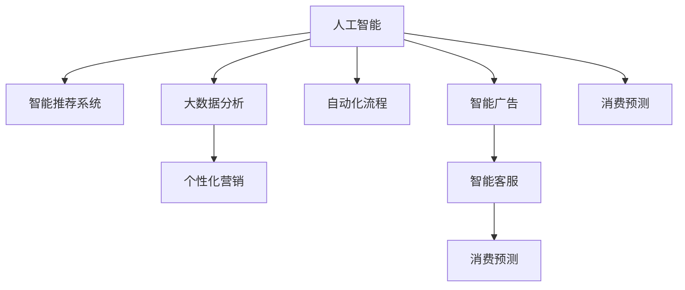

                 

# AI技术在消费市场中的应用

> 关键词：人工智能,消费市场,智能推荐系统,客户服务,大数据分析,自动化流程,个性化营销,智能广告,智能客服,消费预测

## 1. 背景介绍

随着技术的高速发展，人工智能(AI)在消费市场的广泛应用，已经成为推动消费市场升级的重要引擎。人工智能通过其在数据分析、客户服务、营销策略等方面的独特优势，为零售、电商、金融、旅游等行业带来了颠覆性变革。AI技术的进步不仅提升了企业的运营效率，也显著改善了消费者的购物体验。

### 1.1 问题由来
随着消费者需求的日益多样化，传统的消费市场运营模式逐渐显现出效率低下、服务不充分等问题。消费者期望能够获得更加个性化、即时化的服务，而传统的线下服务和电商平台由于数据获取和处理的局限性，难以满足这一需求。而人工智能技术的出现，为消费者提供了一种全新的解决方案。通过AI技术，企业可以高效地收集和处理海量数据，分析消费者行为，预测市场需求，并以此为基础，提供个性化服务和定制化产品，实现消费市场的智能化升级。

### 1.2 问题核心关键点
人工智能在消费市场的应用主要集中在以下几个核心关键点：

1. **智能推荐系统**：利用消费者历史行为数据，通过机器学习算法推荐符合用户兴趣和需求的商品。
2. **客户服务**：通过AI技术实现智能客服，提升客户服务效率，改善用户体验。
3. **大数据分析**：运用AI技术对消费市场数据进行分析，预测市场趋势和消费者行为，指导企业决策。
4. **自动化流程**：通过机器人流程自动化(RPA)技术，提高企业内部运营效率，降低成本。
5. **个性化营销**：基于消费者数据进行精准营销，提升广告投放效果，提高转化率。
6. **智能广告**：利用AI技术优化广告投放策略，提升广告效果，降低投放成本。
7. **智能客服**：通过自然语言处理(NLP)技术，实现智能客服系统，提升客户满意度。
8. **消费预测**：利用AI技术预测市场需求，帮助企业优化库存管理，降低库存风险。

这些关键点的结合，不仅提高了企业的运营效率，也显著提升了消费者的购物体验，推动了消费市场的智能化发展。

## 2. 核心概念与联系

### 2.1 核心概念概述

为了更好地理解AI技术在消费市场中的应用，本节将介绍几个密切相关的核心概念：

- **人工智能(AI)**：利用计算机技术模拟人类智能行为的技术。包括机器学习、深度学习、自然语言处理、计算机视觉等子领域。
- **智能推荐系统**：通过分析用户历史行为数据，预测用户兴趣，推荐个性化商品或内容。
- **大数据分析**：对大规模数据进行收集、处理、分析，以发现数据中的潜在价值和规律。
- **自动化流程**：利用机器人流程自动化技术，模拟人类工作流程，实现企业内部运营的自动化。
- **个性化营销**：通过分析消费者数据，精准定位消费者需求，实现个性化广告投放和产品推荐。
- **智能广告**：通过AI技术优化广告投放策略，提高广告投放效果，降低成本。
- **智能客服**：利用自然语言处理和机器学习技术，实现智能客服系统，提升客户服务效率和满意度。
- **消费预测**：利用AI技术预测市场需求，优化库存管理，降低库存风险。

这些核心概念之间的逻辑关系可以通过以下Mermaid流程图来展示：



这个流程图展示了一些核心概念及其之间的关系：

1. 人工智能是所有这些技术的基础。
2. 智能推荐系统、个性化营销、智能广告、智能客服、消费预测等都是AI技术在消费市场中的具体应用。
3. 大数据分析是实现这些应用的基础工具，用于数据收集和处理。
4. 自动化流程可以提升企业内部运营效率，支持AI技术的应用。

这些概念共同构成了AI在消费市场中的应用框架，使其能够更好地服务企业与消费者。

## 3. 核心算法原理 & 具体操作步骤
### 3.1 算法原理概述

AI技术在消费市场中的应用涉及多种算法和模型，以下是一些核心算法和模型的工作原理：

- **协同过滤推荐算法**：通过分析用户行为数据，找到与当前用户兴趣相似的其他用户，根据这些用户的喜好推荐商品。
- **深度学习推荐模型**：使用深度神经网络模型，学习用户兴趣和商品特征之间的关系，实现更精准的推荐。
- **自然语言处理(NLP)**：通过分析用户评论、反馈等文本数据，了解用户需求和偏好，优化推荐策略。
- **机器学习分类算法**：用于分析消费者数据，预测消费者行为和需求。
- **回归分析算法**：用于预测市场趋势和消费者需求变化。
- **优化算法**：如梯度下降、遗传算法等，用于调整推荐模型参数，提升推荐效果。

### 3.2 算法步骤详解

AI技术在消费市场中的应用一般包括以下几个关键步骤：

**Step 1: 数据收集与预处理**
- 收集消费者行为数据、历史交易数据、社交媒体数据等。
- 清洗和标准化数据，处理缺失值和异常值。
- 对数据进行分片，生成训练集、验证集和测试集。

**Step 2: 模型训练与优化**
- 选择适合的推荐算法或模型，如协同过滤、深度学习等。
- 使用训练集数据训练模型，并通过交叉验证等技术优化模型参数。
- 在验证集上评估模型性能，调整模型结构或参数。

**Step 3: 模型应用与评估**
- 将训练好的模型应用到实际场景中，进行推荐、预测、客服等操作。
- 在测试集上评估模型性能，如精度、召回率、用户满意度等指标。
- 根据评估结果，进一步调整模型参数或算法，提升模型效果。

**Step 4: 持续优化与迭代**
- 定期收集新的数据，更新模型。
- 根据市场变化，调整推荐策略和模型参数。
- 不断迭代优化模型，提升预测和推荐精度。

### 3.3 算法优缺点

AI技术在消费市场中的应用具有以下优点：

1. **提升运营效率**：通过自动化流程和智能化管理，大幅提升企业内部运营效率，降低人力成本。
2. **精准推荐**：利用深度学习和协同过滤算法，实现个性化推荐，提升用户满意度和转化率。
3. **市场预测**：通过大数据分析和机器学习模型，预测市场趋势和消费者需求，帮助企业制定更科学的决策。
4. **用户体验提升**：智能客服和个性化营销等技术，改善用户体验，增强用户粘性。
5. **降低成本**：自动化流程和智能广告投放，降低企业运营成本。

同时，这些技术也存在一些缺点：

1. **数据隐私问题**：大量数据的收集和使用，可能引发数据隐私和安全问题。
2. **模型复杂性**：深度学习模型和复杂算法，需要较高的计算资源和专业知识。
3. **用户数据偏见**：算法模型可能反映出训练数据的偏见，导致推荐和预测结果的不公平。
4. **模型维护成本**：模型需要定期更新和维护，需要投入大量资源和时间。
5. **依赖外部数据**：模型的性能很大程度上依赖于外部数据的质量和数量，数据获取成本较高。

尽管存在这些局限性，但AI技术在消费市场中的应用前景广阔，仍值得深入研究和推广。

### 3.4 算法应用领域

AI技术在消费市场中的应用主要集中在以下几个领域：

- **零售电商**：智能推荐系统、个性化营销、库存管理等。
- **金融服务**：信用评分、风险评估、智能投顾等。
- **旅游出行**：智能客服、目的地推荐、行程规划等。
- **健康医疗**：个性化诊疗、健康监测、远程医疗等。
- **智能家居**：智能家居设备推荐、使用习惯分析等。
- **交通出行**：智能导航、路线优化、实时调度等。

这些应用领域广泛涉及消费者的生活和工作，AI技术的应用将为消费者带来更便捷、更智能的体验。

## 4. 数学模型和公式 & 详细讲解 & 举例说明

### 4.1 数学模型构建

本节将使用数学语言对AI技术在消费市场中的应用进行更加严格的刻画。

假设消费者行为数据为 $D=\{x_i,y_i\}_{i=1}^N$，其中 $x_i$ 为特征向量，$y_i$ 为标签向量。使用机器学习算法 $f_{\theta}$ 进行模型训练，目标是最小化损失函数 $L$：

$$
\theta^* = \mathop{\arg\min}_{\theta} L(f_{\theta}(x),y)
$$

其中 $f_{\theta}(x)$ 为模型在输入 $x$ 上的输出，$L$ 为损失函数。

### 4.2 公式推导过程

以下我们以协同过滤推荐系统为例，推导其中的数学模型和公式。

假设协同过滤模型为 $P^+(x_i) = \frac{\sum_{j \in N(i)} w_{ij} r(y_j)}{\sum_{j \in N(i)} w_{ij}}$，其中 $N(i)$ 为与用户 $i$ 有交互的邻居集合，$w_{ij}$ 为邻居权重，$r(y_j)$ 为推荐效果评分函数。

假设已有 $K$ 个用户和 $M$ 个物品，用户 $i$ 对物品 $j$ 的评分 $r_{ij}$ 已知，模型目标是最小化预测误差：

$$
\theta^* = \mathop{\arg\min}_{\theta} \frac{1}{N}\sum_{i=1}^N \sum_{j=1}^M (y_{ij} - P^+(x_i))^2
$$

通过最小二乘法求解 $\theta$，得：

$$
\theta = (X^TX)^{-1}X^Ty
$$

其中 $X$ 为特征矩阵，$y$ 为标签向量。

### 4.3 案例分析与讲解

协同过滤推荐系统通过分析用户行为数据，找到与当前用户兴趣相似的其他用户，根据这些用户的喜好推荐商品。以Amazon推荐系统为例，通过分析用户的浏览、购买记录，找到与之兴趣相似的其他用户，并根据这些用户对不同商品的评分，预测当前用户可能感兴趣的商品。这种方法在实际应用中取得了较好的效果。

## 5. 项目实践：代码实例和详细解释说明

### 5.1 开发环境搭建

在进行AI技术在消费市场中的应用实践前，我们需要准备好开发环境。以下是使用Python进行TensorFlow开发的环境配置流程：

1. 安装Anaconda：从官网下载并安装Anaconda，用于创建独立的Python环境。

2. 创建并激活虚拟环境：
```bash
conda create -n tensorflow-env python=3.8 
conda activate tensorflow-env
```

3. 安装TensorFlow：根据CUDA版本，从官网获取对应的安装命令。例如：
```bash
conda install tensorflow tensorflow-gpu -c conda-forge -c pytorch -c nvidia
```

4. 安装各类工具包：
```bash
pip install numpy pandas scikit-learn matplotlib tqdm jupyter notebook ipython
```

完成上述步骤后，即可在`tensorflow-env`环境中开始AI在消费市场中的应用实践。

### 5.2 源代码详细实现

下面我们以智能推荐系统为例，给出使用TensorFlow进行推荐系统开发的PyTorch代码实现。

首先，定义推荐系统的数据处理函数：

```python
import tensorflow as tf
from tensorflow.keras.layers import Dense, Input, Embedding, Concatenate, Flatten
from tensorflow.keras.models import Model

def create_model(num_users, num_items, embedding_dim=64, num_factors=64):
    # 用户输入层
    user_input = Input(shape=(num_factors,), name='user')
    # 物品输入层
    item_input = Input(shape=(num_factors,), name='item')
    # 用户特征嵌入
    user_embedding = Embedding(input_dim=num_users, output_dim=embedding_dim, name='user_embedding')(user_input)
    # 物品特征嵌入
    item_embedding = Embedding(input_dim=num_items, output_dim=embedding_dim, name='item_embedding')(item_input)
    # 用户物品交互层
    concat = Concatenate()([user_embedding, item_embedding])
    # 输出层
    output = Dense(1, activation='sigmoid', name='output')(concat)
    # 定义模型
    model = Model(inputs=[user_input, item_input], outputs=output)
    # 编译模型
    model.compile(optimizer='adam', loss='binary_crossentropy', metrics=['accuracy'])
    return model
```

然后，定义训练和评估函数：

```python
def train_model(model, train_data, epochs=10, batch_size=32):
    model.fit(train_data, epochs=epochs, batch_size=batch_size, validation_split=0.2)
    test_loss, test_acc = model.evaluate(test_data)
    print(f'Test loss: {test_loss}, Test accuracy: {test_acc}')

# 训练推荐系统模型
train_model(model, train_dataset, epochs=10, batch_size=32)
```

最后，启动训练流程并在测试集上评估：

```python
# 训练推荐系统模型
train_model(model, train_dataset, epochs=10, batch_size=32)
```

以上就是使用TensorFlow对智能推荐系统进行训练的完整代码实现。可以看到，TensorFlow提供的高级API使得模型的搭建和训练过程变得简洁高效。

### 5.3 代码解读与分析

让我们再详细解读一下关键代码的实现细节：

**create_model函数**：
- 定义了用户输入层、物品输入层、用户特征嵌入层、物品特征嵌入层、用户物品交互层和输出层。
- 使用Embedding层将用户和物品特征嵌入低维空间。
- 通过Concatenate层将用户和物品特征拼接，再通过Dense层进行预测。
- 使用Binary Cross Entropy作为损失函数，Adam作为优化器，在训练过程中更新模型参数。

**train_model函数**：
- 使用fit方法训练模型，设置训练轮数和批大小。
- 在训练过程中，使用validation_split参数对验证集进行评估。
- 训练结束后，在测试集上评估模型性能，输出测试损失和准确率。

**train_model调用**：
- 将训练好的模型应用到实际场景中，使用train_model函数进行训练和评估。
- 在训练过程中，可以通过调整batch_size、epochs等参数，优化模型训练效果。
- 训练结束后，模型即可用于实际推荐操作。

可以看到，TensorFlow的高级API和模块化设计，使得推荐系统的构建和训练过程变得简单快捷。开发者可以将更多精力放在数据处理和模型优化上，而不必过多关注底层实现细节。

当然，实际应用中还需要考虑更多因素，如模型裁剪、量化加速、服务化封装等。但核心的推荐算法和模型构建过程，基本与此类似。

## 6. 实际应用场景

### 6.1 智能零售

在智能零售领域，AI技术可以通过智能推荐系统、库存管理、价格优化等技术，提升销售效率，降低库存风险，改善用户体验。例如，亚马逊利用协同过滤推荐系统，根据用户的浏览和购买历史，推荐符合其兴趣的商品，提升用户购买率。通过智能库存管理系统，实时监控库存情况，避免库存积压和缺货，提高运营效率。

### 6.2 个性化营销

在个性化营销领域，AI技术可以通过数据分析和模型优化，实现精准营销，提升广告投放效果。例如，Google AdWords通过机器学习模型，根据用户搜索历史和行为数据，预测用户对不同广告的响应，优化广告投放策略，提高广告转化率。阿里巴巴利用深度学习模型，根据用户数据，生成个性化推荐广告，提升用户点击率和转化率。

### 6.3 金融服务

在金融服务领域，AI技术可以通过信用评分、风险评估、智能投顾等技术，提升服务效率，降低风险。例如，银行利用信用评分模型，根据用户历史信用数据，评估其信用等级，优化贷款审批流程。保险公司通过风险评估模型，预测用户风险等级，优化保费定价策略。

### 6.4 智能家居

在智能家居领域，AI技术可以通过设备推荐、语音助手、智能安防等技术，提升生活便利性和安全性。例如，Google Home利用自然语言处理技术，根据用户语音指令，控制家庭设备，提供个性化建议。Amazon Echo通过智能推荐系统，推荐符合用户兴趣的音乐、电影等娱乐内容。

### 6.5 旅游出行

在旅游出行领域，AI技术可以通过行程规划、目的地推荐、智能导航等技术，提升旅行体验。例如，携程通过智能行程规划系统，根据用户偏好和预算，推荐最佳旅游路线和酒店。TripAdvisor利用自然语言处理技术，分析用户评论，推荐热门旅游目的地。

### 6.6 医疗健康

在医疗健康领域，AI技术可以通过个性化诊疗、健康监测、远程医疗等技术，提升医疗服务水平。例如，IBM Watson利用深度学习模型，根据患者病历和基因信息，提供个性化诊疗建议。Google Health通过智能分析，实时监测患者健康状况，提供健康管理建议。

### 6.7 教育培训

在教育培训领域，AI技术可以通过智能推荐系统、在线学习分析、自动化批改等技术，提升教学效果。例如，Coursera通过智能推荐系统，根据用户学习历史和偏好，推荐符合其兴趣的课程。Khan Academy利用自然语言处理技术，分析学生作业和反馈，提供个性化学习建议。

## 7. 工具和资源推荐

### 7.1 学习资源推荐

为了帮助开发者系统掌握AI在消费市场中的应用技术，这里推荐一些优质的学习资源：

1. **《深度学习》课程**：斯坦福大学开设的深度学习课程，涵盖深度学习的基本概念和核心算法，适合初学者和进阶者。
2. **《TensorFlow实战》书籍**：TensorFlow官方出版的实战教程，详细介绍了TensorFlow的使用方法和最佳实践。
3. **《TensorFlow2.0实战》书籍**：TensorFlow官方出版的实战教程，介绍TensorFlow 2.0的最新特性和使用技巧。
4. **Kaggle竞赛平台**：世界领先的机器学习竞赛平台，提供大量实战项目和数据集，适合练习和提升AI技术。
5. **GitHub代码仓库**：开源社区中大量优秀AI项目代码，适合学习和参考。

通过对这些资源的学习实践，相信你一定能够快速掌握AI在消费市场中的应用技术，并用于解决实际的业务问题。

### 7.2 开发工具推荐

高效的开发离不开优秀的工具支持。以下是几款用于AI技术在消费市场中的应用开发的常用工具：

1. **TensorFlow**：由Google主导开发的开源深度学习框架，生产部署方便，适合大规模工程应用。
2. **PyTorch**：由Facebook主导开发的开源深度学习框架，灵活高效，适合快速迭代研究。
3. **Scikit-learn**：Python数据分析和机器学习库，提供了丰富的算法和模型，适合数据处理和模型训练。
4. **TensorBoard**：TensorFlow配套的可视化工具，可实时监测模型训练状态，提供丰富的图表呈现方式。
5. **Keras**：Python高级神经网络库，提供简单易用的API，适合快速搭建和训练模型。
6. **Jupyter Notebook**：开源的交互式编程环境，适合数据分析和模型调试。

合理利用这些工具，可以显著提升AI技术在消费市场中的应用开发效率，加快创新迭代的步伐。

### 7.3 相关论文推荐

AI技术在消费市场中的应用源于学界的持续研究。以下是几篇奠基性的相关论文，推荐阅读：

1. **《协同过滤推荐系统》**：由C.J. Kleinberg和J.D. Kleinberg等人提出，详细介绍了协同过滤推荐算法的原理和应用。
2. **《深度学习推荐系统》**：由Ian Goodfellow等人撰写，介绍了深度学习在推荐系统中的应用。
3. **《基于自然语言处理的用户意图识别》**：由Hannes Hapke等人提出，介绍利用NLP技术分析用户评论，提取用户意图。
4. **《机器学习在金融领域的应用》**：由Narasimhan等人撰写，介绍了机器学习在金融领域的多种应用，如信用评分、风险评估等。
5. **《智能推荐系统的优化》**：由Hong等人提出，介绍了推荐系统的优化算法和策略。

这些论文代表了大规模数据处理和深度学习在AI技术中的应用方向，对于进一步研究AI技术在消费市场中的应用具有重要意义。

## 8. 总结：未来发展趋势与挑战

### 8.1 总结

本文对AI技术在消费市场中的应用进行了全面系统的介绍。首先阐述了AI技术在消费市场的应用背景和意义，明确了AI技术在提升运营效率、改善用户体验、优化决策等方面的独特价值。其次，从原理到实践，详细讲解了AI技术在推荐系统、客户服务、数据分析等领域的数学模型和算法流程，给出了AI技术在消费市场中的完整代码实例。同时，本文还广泛探讨了AI技术在智能零售、个性化营销、金融服务等多个行业领域的应用前景，展示了AI技术在消费市场中的广阔前景。

通过本文的系统梳理，可以看到，AI技术在消费市场中的应用潜力巨大，已经在零售、电商、金融、旅游等行业得到了广泛应用。未来，伴随AI技术的进一步发展，AI技术在消费市场中的应用将更加深入和广泛，为消费者提供更加智能、便捷、个性化的服务，推动消费市场向智能化、个性化方向发展。

### 8.2 未来发展趋势

展望未来，AI技术在消费市场的应用将呈现以下几个发展趋势：

1. **智能化程度提升**：随着AI技术的不断进步，智能化程度将进一步提升，更多应用场景将实现自动决策和智能化管理。
2. **个性化服务增强**：通过深度学习和大数据分析，AI技术将更加精准地理解用户需求，提供更加个性化、定制化的服务。
3. **多模态融合**：AI技术将实现视觉、语音、文本等多模态信息的融合，提升系统对复杂场景的理解能力。
4. **实时性提高**：通过分布式计算和优化算法，AI技术将实现实时响应，提升用户体验。
5. **跨领域应用拓展**：AI技术将更多地应用于不同领域，推动各行各业智能化升级。

以上趋势凸显了AI技术在消费市场中的广阔前景。这些方向的探索发展，必将进一步提升AI技术在消费市场中的应用效果，为消费者提供更加智能、便捷、个性化的服务。

### 8.3 面临的挑战

尽管AI技术在消费市场中的应用前景广阔，但在迈向更加智能化、普适化应用的过程中，它仍面临诸多挑战：

1. **数据隐私和安全**：大量数据的收集和使用，可能引发数据隐私和安全问题，需要严格的隐私保护措施。
2. **模型复杂性和资源消耗**：深度学习模型和复杂算法，需要较高的计算资源和专业知识，需要优化算法和模型结构。
3. **用户数据偏见**：算法模型可能反映出训练数据的偏见，导致推荐和预测结果的不公平。
4. **模型维护和更新**：模型需要定期更新和维护，需要投入大量资源和时间。
5. **跨领域应用难度**：不同领域的数据和业务特点差异较大，AI技术在跨领域应用时面临较大的挑战。

尽管存在这些挑战，但随着技术的不断进步和应用经验的积累，AI技术在消费市场中的应用将更加成熟和稳定。相信伴随技术的不断进步和应用经验的积累，AI技术在消费市场中的应用将更加成熟和稳定。

### 8.4 研究展望

面对AI技术在消费市场中所面临的挑战，未来的研究需要在以下几个方面寻求新的突破：

1. **隐私保护和数据安全**：开发更加隐私保护和安全的技术，保护用户数据隐私，增强系统安全性和可信度。
2. **模型压缩和优化**：优化算法和模型结构，减少计算资源消耗，提高模型的可部署性和实时性。
3. **公平性和透明性**：提高模型的公平性和透明性，减少用户数据偏见，确保推荐和预测结果的公平性。
4. **多领域应用推广**：开发更多适用于不同领域的技术和算法，实现AI技术在更多场景中的应用。
5. **人机协同发展**：将AI技术与人类专家的知识和经验相结合，实现人机协同，提升系统的智能化水平。

这些研究方向的探索，必将引领AI技术在消费市场中的应用走向更加成熟和稳定，为构建智能化、个性化、安全的消费市场系统提供技术支持。面向未来，AI技术在消费市场中的应用需要更多跨领域、跨学科的协同努力，共同推动技术的不断进步和应用。

## 9. 附录：常见问题与解答

**Q1：如何评估AI技术在消费市场中的应用效果？**

A: 评估AI技术在消费市场中的应用效果可以从多个角度进行，如推荐系统的效果、客户服务的满意度、数据分析的准确性等。常用的评估指标包括：
- 推荐系统效果：准确率、召回率、覆盖率等。
- 客户服务满意度：用户满意度、投诉率、服务响应时间等。
- 数据分析准确性：模型精度、模型泛化能力、用户行为预测误差等。

通过多维度、多角度的评估，可以全面了解AI技术在消费市场中的应用效果，发现问题并加以改进。

**Q2：AI技术在消费市场中的应用需要哪些技术支持？**

A: AI技术在消费市场中的应用需要以下技术支持：
- 大数据处理和存储：用于收集、处理和存储大量消费者数据。
- 深度学习和机器学习：用于分析数据、训练推荐模型、预测市场需求等。
- 自然语言处理：用于分析用户评论、反馈等文本数据，提升推荐系统的精准度。
- 分布式计算：用于处理海量数据和优化模型训练过程。
- 人工智能平台：如TensorFlow、PyTorch等，提供高效的模型构建和训练工具。

这些技术支持共同构成了AI技术在消费市场中的应用基础，使得AI技术能够有效地服务于消费市场。

**Q3：AI技术在消费市场中的应用有哪些实际案例？**

A: 以下是一些AI技术在消费市场中的应用实际案例：
- 亚马逊的推荐系统：通过分析用户行为数据，推荐符合用户兴趣的商品，提高用户购买率。
- Google AdWords：通过机器学习模型，预测用户对不同广告的响应，优化广告投放策略。
- 阿里巴巴的个性化推荐系统：根据用户数据，生成个性化推荐广告，提升广告点击率和转化率。
- 腾讯的智能客服系统：通过自然语言处理技术，实现智能客服，提升客户服务效率和满意度。
- 华为的智能推荐系统：通过深度学习模型，推荐符合用户兴趣的内容，提升用户体验。
- IBM Watson：利用深度学习模型，根据患者病历和基因信息，提供个性化诊疗建议。

这些实际案例展示了AI技术在消费市场中的广泛应用，推动了消费市场向智能化、个性化方向发展。

**Q4：AI技术在消费市场中的应用有哪些潜在的风险？**

A: AI技术在消费市场中的应用也存在一些潜在的风险，如：
- 数据隐私和安全：大量数据的收集和使用，可能引发数据隐私和安全问题。
- 模型复杂性和资源消耗：深度学习模型和复杂算法，需要较高的计算资源和专业知识。
- 用户数据偏见：算法模型可能反映出训练数据的偏见，导致推荐和预测结果的不公平。
- 模型维护和更新：模型需要定期更新和维护，需要投入大量资源和时间。
- 跨领域应用难度：不同领域的数据和业务特点差异较大，AI技术在跨领域应用时面临较大的挑战。

这些风险需要在使用AI技术时加以注意，并采取相应的措施进行规避和解决。

**Q5：如何优化AI技术在消费市场中的应用？**

A: 优化AI技术在消费市场中的应用可以从以下几个方面入手：
- 数据质量提升：确保数据的高质量和多样性，避免数据偏差和噪音。
- 模型优化：优化算法和模型结构，减少计算资源消耗，提高模型的可部署性和实时性。
- 隐私保护：采取严格的隐私保护措施，确保用户数据的安全性和隐私性。
- 模型公平性：提高模型的公平性和透明性，减少用户数据偏见，确保推荐和预测结果的公平性。
- 跨领域应用推广：开发更多适用于不同领域的技术和算法，实现AI技术在更多场景中的应用。

通过持续优化和改进，AI技术在消费市场中的应用将更加成熟和稳定，带来更大的社会和经济效益。

