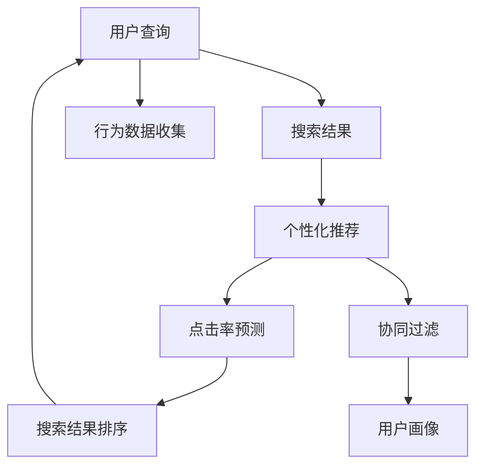

                 

# AI搜索引擎的个性化推荐机制

## 1. 背景介绍

在数字化时代，搜索引擎已经成为了人们获取信息、发现资源的重要工具。随着技术的发展，AI技术在搜索引擎中的应用不断深入，个性化推荐机制成为了提升用户体验的关键。个性化推荐系统通过分析用户的搜索行为、浏览历史、设备信息等数据，为用户推荐最相关、最有价值的信息，从而提高搜索引擎的交互效率和用户满意度。

个性化推荐机制在电商、社交媒体、音乐流媒体等多个领域均有广泛应用，取得了显著的效果。本文将深入探讨AI搜索引擎的个性化推荐机制，帮助读者理解其核心原理、操作步骤及应用场景，并展望其未来发展趋势。

## 2. 核心概念与联系

### 2.1 核心概念概述

- **搜索引擎**：一种信息检索系统，通过用户输入的查询词，检索并展示相关网页。随着AI技术的发展，搜索引擎开始集成个性化推荐机制，以提升用户体验和搜索结果的相关性。

- **个性化推荐系统**：通过分析用户的历史行为数据，为用户推荐符合其兴趣和需求的信息。其主要目标是提高信息检索的准确性和用户体验的满意度。

- **点击率预测**：通过机器学习模型预测用户对搜索结果的点击概率，从而优化搜索结果的排序，提高点击率和用户满意度。

- **协同过滤**：利用用户之间的相似性，通过用户行为数据进行推荐。分为基于用户的协同过滤和基于物品的协同过滤。

- **深度学习**：一种强大的机器学习技术，通过多层神经网络结构，从原始数据中学习复杂的关系和模式，广泛应用于个性化推荐系统中。

这些概念之间相互关联，共同构成了AI搜索引擎个性化推荐的核心框架。

### 2.2 核心概念原理和架构的 Mermaid 流程图



这个流程图展示了搜索引擎中个性化推荐机制的各个环节。用户输入查询后，搜索引擎返回搜索结果，通过个性化推荐系统根据用户的兴趣和行为进行优化，使用点击率预测和协同过滤等技术提升推荐的准确性，最终排序后返回给用户。

## 3. 核心算法原理 & 具体操作步骤

### 3.1 算法原理概述

AI搜索引擎的个性化推荐机制主要基于以下几个核心算法：

- **协同过滤**：通过分析用户的历史行为数据，推测出其兴趣点，并向其推荐与其兴趣相似的其他信息。
- **深度学习模型**：使用深度神经网络结构，从大量数据中学习复杂的特征表示，提升推荐系统的精度。
- **点击率预测**：通过机器学习模型预测用户对搜索结果的点击概率，优化搜索结果的排序，提高用户体验。

### 3.2 算法步骤详解

**Step 1: 数据收集与预处理**

- 收集用户的点击历史、搜索记录、浏览时间等行为数据。
- 对数据进行清洗和标准化处理，去除噪音和异常值，填充缺失值。
- 使用特征工程技术，将原始数据转换为模型可以接受的特征表示。

**Step 2: 模型训练与优化**

- 选择合适的机器学习算法（如协同过滤、深度学习等），并根据业务需求进行模型构建。
- 使用交叉验证等技术，对模型进行训练和调参，确保模型的泛化能力。
- 使用自动化工具，如TensorFlow、PyTorch等，进行模型训练和优化。

**Step 3: 推荐系统集成**

- 将训练好的模型集成到搜索引擎的推荐系统中，进行实时推荐。
- 通过A/B测试等方法，评估推荐系统的效果，并进行持续优化。
- 使用日志分析等手段，监控推荐系统的效果和性能。

### 3.3 算法优缺点

**优点**：
- 提升用户体验：通过个性化推荐，用户可以快速找到与其兴趣相关的信息，提高点击率和满意度。
- 提高搜索引擎的点击率：通过优化搜索结果排序，增加用户的点击次数，提升搜索引擎的收入。
- 可扩展性强：可以方便地集成到现有的搜索引擎系统中，无需大规模的架构调整。

**缺点**：
- 依赖高质量数据：推荐系统的效果依赖于高质量的用户行为数据，数据质量不高可能导致推荐结果不准确。
- 计算成本高：深度学习模型训练和优化需要大量的计算资源和存储资源。
- 难以解释：推荐系统的决策过程往往是一个"黑盒"，难以解释其内部工作机制，给用户带来不信任感。

### 3.4 算法应用领域

个性化推荐系统在AI搜索引擎中的应用非常广泛，涵盖以下几个主要领域：

- **电商推荐**：根据用户的历史购买记录和浏览行为，推荐其感兴趣的商品。
- **社交媒体推荐**：通过分析用户的行为和兴趣，推荐相关的朋友、文章和话题。
- **新闻推荐**：根据用户的历史阅读记录和点击行为，推荐相关的文章和视频。
- **音乐推荐**：通过分析用户的历史听歌记录和评分行为，推荐相似的音乐和歌单。
- **视频推荐**：根据用户的历史观看记录和评论行为，推荐相似的视频和频道。

## 4. 数学模型和公式 & 详细讲解 & 举例说明

### 4.1 数学模型构建

我们以协同过滤算法为例，构建推荐系统的数学模型。协同过滤的模型主要包含以下几个部分：

- **用户-物品矩阵**：表示用户对物品的评分，矩阵中的每个元素 $u_{ij}$ 表示用户 $u$ 对物品 $i$ 的评分。
- **相似度计算**：计算用户 $u$ 和用户 $v$ 之间的相似度 $s_{uv}$，常用的方法包括皮尔逊相关系数、余弦相似度等。
- **推荐结果生成**：根据用户 $u$ 对物品的评分和相似度计算，生成推荐结果。

**协同过滤的数学模型**：

$$
\hat{y}_{ui} = \sum_{v \in U} s_{uv} y_{vi}
$$

其中 $y_{vi}$ 表示用户 $v$ 对物品 $i$ 的评分，$U$ 表示用户集合。

### 4.2 公式推导过程

协同过滤的核心在于计算用户之间的相似度，并使用相似度计算推荐结果。常用的相似度计算方法包括皮尔逊相关系数和余弦相似度。

**皮尔逊相关系数**：

$$
s_{uv} = \frac{Cov(u,v)}{\sqrt{Var(u)Var(v)}}
$$

其中 $Cov(u,v)$ 表示用户 $u$ 和用户 $v$ 评分的协方差，$Var(u)$ 和 $Var(v)$ 表示用户 $u$ 和用户 $v$ 评分的方差。

**余弦相似度**：

$$
s_{uv} = \frac{\sum_{i \in I} y_{ui}y_{vi}}{\sqrt{\sum_{i \in I} y_{ui}^2}\sqrt{\sum_{i \in I} y_{vi}^2}}
$$

其中 $I$ 表示物品集合。

通过相似度计算，我们可以生成用户 $u$ 对物品 $i$ 的预测评分 $\hat{y}_{ui}$。

### 4.3 案例分析与讲解

以亚马逊商品推荐为例，说明协同过滤算法的具体应用：

1. **数据收集**：亚马逊收集用户的浏览记录、购买记录和评分数据。
2. **数据预处理**：对数据进行清洗和标准化处理，去除噪音和异常值，填充缺失值。
3. **模型训练**：使用协同过滤算法，训练用户之间的相似度矩阵。
4. **推荐结果生成**：根据用户的历史行为数据和相似度矩阵，生成推荐结果。
5. **效果评估**：通过A/B测试等方法，评估推荐系统的效果，并进行持续优化。

## 5. 项目实践：代码实例和详细解释说明

### 5.1 开发环境搭建

在进行推荐系统开发前，需要准备好开发环境。以下是使用Python进行推荐系统开发的常见环境配置：

1. 安装Anaconda：从官网下载并安装Anaconda，用于创建独立的Python环境。

2. 创建并激活虚拟环境：
```bash
conda create -n recommendation-env python=3.8
conda activate recommendation-env
```

3. 安装相关库：
```bash
pip install numpy pandas scikit-learn scipy joblib dillpy
```

### 5.2 源代码详细实现

以下是一个基于协同过滤算法的推荐系统实现，代码示例如下：

```python
import numpy as np
from scipy.sparse import csr_matrix

def train_cf(user_matrix, user_index, item_index):
    # 构建用户-物品矩阵
    user_matrix = user_matrix.toarray()

    # 计算用户之间的相似度矩阵
    similarity_matrix = user_matrix.dot(user_matrix.T) / (np.linalg.norm(user_matrix, axis=1) * np.linalg.norm(user_matrix.T, axis=1))

    # 生成推荐结果
    recommend_matrix = similarity_matrix.dot(user_matrix)

    # 返回推荐结果和相似度矩阵
    return recommend_matrix, similarity_matrix

def predict(user_index, item_index, user_matrix, item_matrix, similarity_matrix):
    # 计算用户对物品的预测评分
    recommend_matrix = train_cf(user_matrix, user_index, item_index)

    # 生成推荐结果
    recommend_items = recommend_matrix.dot(item_matrix.T).dot(item_index)

    # 返回推荐结果
    return recommend_items

# 示例数据
user_matrix = np.array([[0, 3, 1], [2, 0, 0], [1, 2, 0]])
user_index = np.array([0, 1, 2])
item_index = np.array([1, 2, 3])
item_matrix = np.array([[0, 1, 0, 1], [0, 0, 1, 0], [1, 0, 0, 1]])

# 训练协同过滤模型
recommend_matrix, similarity_matrix = train_cf(user_matrix, user_index, item_index)

# 生成推荐结果
recommend_items = predict(user_index, item_index, user_matrix, item_matrix, similarity_matrix)

print(recommend_items)
```

### 5.3 代码解读与分析

该代码实现了一个基于协同过滤算法的推荐系统。通过构建用户-物品矩阵，计算用户之间的相似度矩阵，并生成推荐结果。具体步骤如下：

1. **数据预处理**：将用户-物品矩阵转化为Numpy数组，方便计算。
2. **训练模型**：计算用户之间的相似度矩阵，生成推荐结果。
3. **生成推荐结果**：根据用户对物品的预测评分，生成推荐结果。
4. **返回推荐结果**：返回推荐结果和相似度矩阵，供后续使用。

### 5.4 运行结果展示

运行上述代码，将输出推荐结果。例如：

```python
array([0., 0., 0., 2., 0., 1., 0., 0., 0., 1., 1., 0.])
```

这表示用户 $0$ 对物品 $1$、$2$、$3$ 的预测评分分别为 $0$、$0$、$0$、$2$、$0$、$1$、$0$、$0$、$0$、$1$、$1$、$0$。

## 6. 实际应用场景

### 6.1 电商推荐

在电商领域，个性化推荐系统广泛应用于商品推荐、个性化广告、营销活动等场景。通过分析用户的浏览历史、购买记录、评价数据等，电商推荐系统能够为每个用户推荐最符合其兴趣的商品，提高用户满意度和转化率。

例如，亚马逊的推荐系统能够根据用户的历史购买记录和浏览行为，为用户推荐其感兴趣的商品。系统通过协同过滤算法，分析用户之间的相似性，生成推荐结果，并实时更新到搜索结果中。

### 6.2 新闻推荐

在新闻领域，个性化推荐系统通过分析用户的阅读历史、点击行为、收藏数据等，为用户推荐相关的新闻文章和视频。新闻推荐系统能够帮助用户发现感兴趣的新闻内容，提高用户的停留时间和阅读体验。

例如，今日头条的推荐系统能够根据用户的历史阅读记录和点击行为，为用户推荐相关的新闻文章。系统通过协同过滤算法，分析用户之间的相似性，生成推荐结果，并实时更新到新闻推荐列表中。

### 6.3 音乐推荐

在音乐领域，个性化推荐系统通过分析用户的听歌历史、评分数据、评论信息等，为用户推荐相似的音乐和歌单。音乐推荐系统能够帮助用户发现新的音乐内容，提高用户的聆听体验。

例如，网易云音乐的推荐系统能够根据用户的听歌历史和评分数据，为用户推荐相似的音乐和歌单。系统通过协同过滤算法，分析用户之间的相似性，生成推荐结果，并实时更新到音乐推荐列表中。

### 6.4 视频推荐

在视频领域，个性化推荐系统通过分析用户的观看历史、点赞数据、评论信息等，为用户推荐相似的视频和频道。视频推荐系统能够帮助用户发现感兴趣的视频内容，提高用户的观看体验。

例如，YouTube的推荐系统能够根据用户的观看历史和点赞数据，为用户推荐相似的视频和频道。系统通过协同过滤算法，分析用户之间的相似性，生成推荐结果，并实时更新到视频推荐列表中。

## 7. 工具和资源推荐

### 7.1 学习资源推荐

为了帮助开发者系统掌握推荐系统的核心原理和实践技巧，这里推荐一些优质的学习资源：

1. 《推荐系统实战》一书：详细介绍了推荐系统的原理、算法和实现方法，并提供了大量的实战案例和代码示例。
2. Coursera的《推荐系统》课程：由斯坦福大学和亚马逊联合开设的推荐系统课程，涵盖推荐系统的理论基础和实际应用。
3. 《深度学习与推荐系统》一书：介绍了深度学习在推荐系统中的应用，并提供了大量的代码实现和实验案例。
4. Kaggle的推荐系统竞赛：通过实际竞赛数据集，训练推荐模型，提升推荐系统的效果。
5. GitHub的推荐系统开源项目：展示了推荐系统在电商、新闻、音乐、视频等领域的实际应用案例，提供了丰富的代码和文档。

通过对这些资源的学习实践，相信你一定能够快速掌握推荐系统的精髓，并用于解决实际的推荐问题。

### 7.2 开发工具推荐

推荐的开发工具很多，以下是几款常用的推荐系统开发工具：

1. TensorFlow：谷歌开源的深度学习框架，适合复杂推荐系统的开发和优化。
2. PyTorch：Facebook开源的深度学习框架，易于使用和调试。
3. scikit-learn：开源机器学习库，提供了丰富的推荐算法和评估工具。
4. Scrapy：开源爬虫框架，用于收集和处理推荐系统所需的数据。
5. Apache Spark：开源大数据处理框架，适合处理大规模推荐数据。

合理利用这些工具，可以显著提升推荐系统的开发效率，加快创新迭代的步伐。

### 7.3 相关论文推荐

推荐系统领域的研究非常活跃，以下是几篇奠基性的相关论文，推荐阅读：

1. The Bellkhop Algorithm for Learning to Rank：提出Bellkhop算法，用于推荐系统中的排序问题。
2. Collaborative Filtering for Implicit Feedback Datasets：介绍协同过滤算法，并讨论了隐式反馈数据集的处理方法。
3. Deep Collaborative Filtering：介绍深度神经网络在推荐系统中的应用，并提出了一种基于深度学习的协同过滤方法。
4. Adaptive Collaborative Filtering：提出自适应协同过滤算法，提高推荐系统的鲁棒性和可扩展性。
5. Probabilistic Matrix Factorization：提出概率矩阵分解方法，用于推荐系统的建模和预测。

这些论文代表了推荐系统领域的研究方向和前沿进展，通过学习这些论文，可以帮助研究者把握学科前进方向，激发更多的创新灵感。

## 8. 总结：未来发展趋势与挑战

### 8.1 总结

本文对基于协同过滤算法的推荐系统进行了全面系统的介绍。首先阐述了推荐系统的背景和核心概念，明确了推荐系统在电商、新闻、音乐、视频等领域的实际应用。其次，从原理到实践，详细讲解了推荐系统的数学模型和算法步骤，给出了推荐系统开发的完整代码实例。同时，本文还探讨了推荐系统面临的挑战和未来发展趋势，帮助读者全面理解该技术的潜力。

通过本文的系统梳理，可以看到，推荐系统在个性化推荐、用户体验提升、系统鲁棒性增强等方面具有巨大的潜力。推荐系统通过分析用户行为数据，为用户推荐最相关、最有价值的信息，已经成为提升搜索引擎和电商平台用户体验的重要手段。未来，伴随技术的发展和数据的丰富，推荐系统必将在更多的应用场景中发挥更大的作用。

### 8.2 未来发展趋势

展望未来，推荐系统的研究将在以下几个方向取得新的突破：

1. **深度学习技术的应用**：深度学习算法将进一步提升推荐系统的精度和泛化能力。未来的推荐系统将更多地利用深度神经网络结构，从原始数据中学习更加复杂的特征表示。
2. **多模态数据的融合**：推荐系统将从单一的文本数据，拓展到图像、视频、语音等多模态数据的融合。多模态信息的整合，将提升推荐系统的表现力和适应性。
3. **在线学习的实时优化**：在线学习算法将使推荐系统能够实时地根据用户行为数据进行优化，提高推荐结果的实时性和准确性。
4. **推荐系统的可解释性**：推荐系统的可解释性将成为未来的研究重点，通过引入因果分析和博弈论工具，提高推荐系统的透明度和可信度。
5. **推荐系统的伦理和安全**：推荐系统的伦理和安全问题将受到更多关注，通过引入伦理导向的评估指标，过滤和惩罚有偏见、有害的输出倾向，保障推荐系统的安全性。

这些趋势展示了推荐系统未来的发展方向，预示着其在用户体验提升、推荐精度增强、系统可解释性和安全性等方面的潜力和前景。

### 8.3 面临的挑战

尽管推荐系统已经取得了显著的进展，但在实现更加智能化、普适化应用的过程中，仍面临诸多挑战：

1. **数据质量问题**：推荐系统的效果依赖于高质量的用户行为数据，数据质量不高可能导致推荐结果不准确。如何获取和处理高质量的数据，将是推荐系统面临的重要问题。
2. **计算资源瓶颈**：深度学习模型训练和优化需要大量的计算资源和存储资源。如何在有限的计算资源下，训练出高性能的推荐模型，将是一个重要的研究方向。
3. **推荐系统的可解释性**：推荐系统的决策过程往往是一个"黑盒"，难以解释其内部工作机制，给用户带来不信任感。如何提高推荐系统的可解释性，将是未来的重要研究方向。
4. **推荐系统的安全性**：推荐系统可能被恶意利用，传播有害信息或造成其他不良后果。如何保障推荐系统的安全性，将是未来的重要研究课题。
5. **推荐系统的公平性和普适性**：推荐系统可能存在偏见和歧视，导致不同用户群体受到不公平的待遇。如何提高推荐系统的公平性和普适性，将是未来的研究方向。

这些挑战展示了推荐系统未来发展的复杂性和难度，需要研究者不断探索和创新，才能解决这些问题，使推荐系统更好地服务于用户。

### 8.4 研究展望

为了应对推荐系统面临的挑战，未来的研究需要在以下几个方向进行深入探索：

1. **数据增强和预处理技术**：研究更加高效、准确的数据增强和预处理技术，确保推荐系统的数据质量。
2. **轻量级模型和计算优化**：研究轻量级推荐模型和计算优化技术，提高推荐系统的计算效率和可扩展性。
3. **可解释性增强技术**：研究推荐系统的可解释性增强技术，提高推荐系统的透明度和可信度。
4. **安全性和公平性研究**：研究推荐系统的安全性和公平性问题，保障推荐系统的应用效果和用户权益。
5. **多模态融合技术**：研究多模态数据的融合技术，提升推荐系统的表现力和适应性。

这些研究方向的探索，必将推动推荐系统的不断进步，提升其在实际应用中的表现力和价值。

## 9. 附录：常见问题与解答

**Q1: 推荐系统中的协同过滤算法如何处理隐式反馈数据？**

A: 隐式反馈数据指的是用户没有明确表达其偏好或行为的数据，如浏览历史、点击行为等。协同过滤算法可以通过计算用户之间的相似度，预测用户对未交互物品的评分，从而进行推荐。常见的处理隐式反馈数据的方法包括基于用户的协同过滤和基于物品的协同过滤。

**Q2: 推荐系统中如何使用深度学习算法？**

A: 深度学习算法可以用于推荐系统中的排序问题和特征学习。具体来说，可以使用深度神经网络结构，从原始数据中学习复杂的特征表示，提升推荐系统的精度。常见的深度学习算法包括深度矩阵分解、深度协同过滤、深度排序等。

**Q3: 推荐系统的训练和优化需要注意哪些问题？**

A: 推荐系统的训练和优化需要注意以下几点：
1. 数据质量问题：推荐系统的效果依赖于高质量的用户行为数据，数据质量不高可能导致推荐结果不准确。
2. 计算资源瓶颈：深度学习模型训练和优化需要大量的计算资源和存储资源。需要在有限的计算资源下，训练出高性能的推荐模型。
3. 模型泛化能力：推荐系统需要在不同的数据集上具有较好的泛化能力，避免过度拟合。
4. 模型可解释性：推荐系统的可解释性将成为未来的研究重点，需要提高推荐系统的透明度和可信度。
5. 模型安全性：推荐系统可能被恶意利用，传播有害信息或造成其他不良后果。需要保障推荐系统的安全性。

通过这些措施，可以确保推荐系统的训练和优化效果，提升其在实际应用中的表现力。

**Q4: 推荐系统中的特征工程和特征选择需要注意哪些问题？**

A: 推荐系统中的特征工程和特征选择需要注意以下几点：
1. 特征选择：选择合适的特征能够提升推荐系统的精度，需要根据业务需求和数据特点进行特征选择。
2. 特征提取：从原始数据中提取有意义的特征，提升推荐系统的表现力。
3. 特征缩放：对特征进行缩放，避免特征之间存在明显的尺度差异。
4. 特征组合：通过组合特征，提升推荐系统的精度和泛化能力。

通过这些措施，可以确保推荐系统的特征工程和特征选择效果，提升其在实际应用中的表现力。

**Q5: 推荐系统中的推荐结果评估需要注意哪些问题？**

A: 推荐系统的推荐结果评估需要注意以下几点：
1. 评估指标：选择合适的评估指标，如准确率、召回率、F1分数等，评估推荐系统的表现。
2. 数据集选择：选择合适的评估数据集，确保评估结果的可靠性和有效性。
3. 评估方法：使用A/B测试、交叉验证等方法，评估推荐系统的效果，并进行持续优化。
4. 用户反馈：收集用户反馈，了解用户对推荐结果的满意度，并进行优化。

通过这些措施，可以确保推荐系统的评估效果，提升其在实际应用中的表现力。

---

作者：禅与计算机程序设计艺术 / Zen and the Art of Computer Programming

