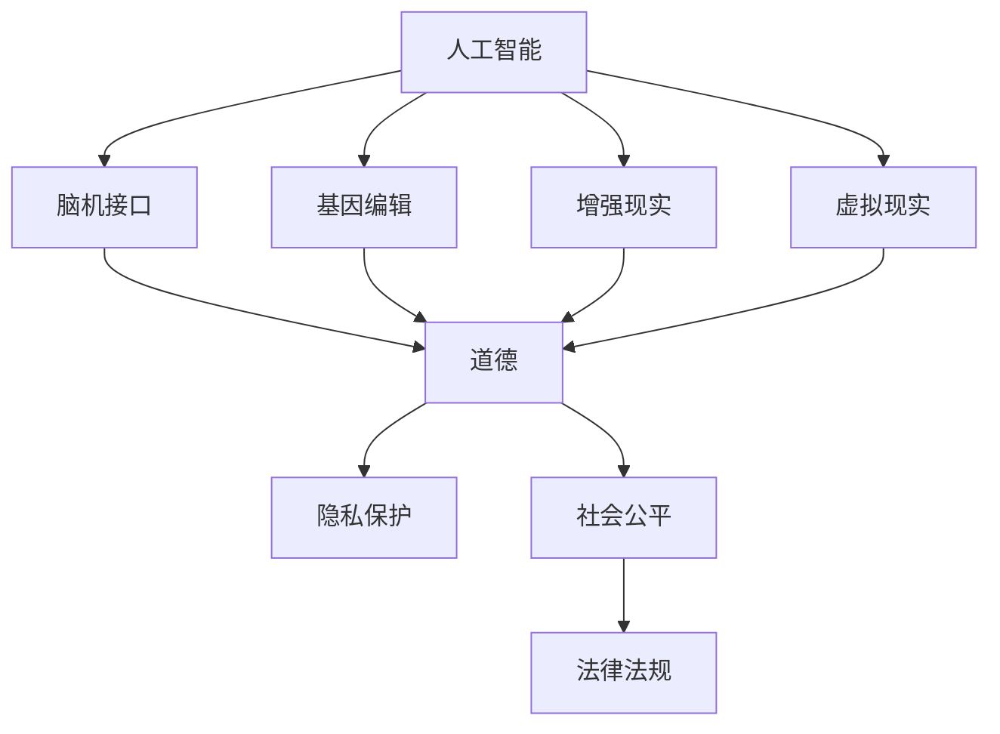

                 

## 1. 背景介绍

### 1.1 问题由来
随着科技的飞速发展，人工智能（AI）、基因编辑等新兴技术正在开启人类增强（Human Augmentation）的新纪元。AI时代的人类增强技术，以智能脑机接口、基因编辑技术等为主要手段，旨在提升人类智能、体能、感知等多方面的能力。例如，脑机接口技术的进步使得人们可以通过思维直接操控计算机和机械装置，基因编辑技术则能够修改人体DNA，改善遗传特性。这些技术有望将人类带向一个全新的未来，但同时也带来了一系列复杂的伦理和道德问题。

### 1.2 问题核心关键点
1. **技术进展**：AI时代的人类增强技术，包括脑机接口、基因编辑、增强现实（AR）、虚拟现实（VR）等。
2. **伦理争议**：如何确保技术的发展不超越道德底线，避免造成社会不公和个人隐私侵害。
3. **法律框架**：制定合适的法律法规，规范技术应用，保障人类权益。
4. **社会影响**：分析技术进步对就业、教育、社会结构等方面的影响。
5. **未来展望**：探讨技术的发展趋势和潜在机遇。

### 1.3 问题研究意义
探讨AI时代人类增强技术的道德考虑，不仅有助于避免技术滥用，还能促进技术的健康发展。通过对技术的伦理审视，可以更好地指导实践应用，防范技术风险，确保技术创新造福人类。

## 2. 核心概念与联系

### 2.1 核心概念概述

为更好地理解AI时代人类增强技术的道德考虑，本节将介绍几个关键概念：

1. **人工智能（AI）**：一种通过算法和计算模拟人类智能的技术，涵盖机器学习、深度学习、自然语言处理等众多领域。
2. **脑机接口（BCI）**：一种将人脑信号转化为计算机可理解的指令的技术，实现人机交互。
3. **基因编辑**：利用CRISPR-Cas9等技术，修改人类DNA，改善遗传疾病、提升个体能力。
4. **增强现实（AR）与虚拟现实（VR）**：利用计算机视觉和图形技术，增强或模拟现实环境。
5. **道德（Ethics）**：指导行为的标准，确保技术应用符合社会公义、个人权利和责任。
6. **隐私保护**：保护个人数据和信息，防止未经授权的访问和使用。
7. **社会公平**：确保技术创新惠及所有人，避免技术鸿沟加剧社会不公。
8. **法律法规**：规范技术应用的法律框架，保护人类权益，预防滥用。

这些核心概念之间的逻辑关系可以通过以下Mermaid流程图来展示：



这个流程图展示了大语言模型的核心概念及其之间的关系：

1. AI技术支撑人类增强的各项技术实现。
2. 道德、隐私保护、社会公平和法律法规是AI时代人类增强技术应用的基础。
3. 脑机接口、基因编辑、增强现实、虚拟现实等技术均需考虑道德约束和法律法规的规范。

## 3. 核心算法原理 & 具体操作步骤
### 3.1 算法原理概述

AI时代人类增强技术的核心算法包括深度学习、基因编辑、脑机接口等。以深度学习为例，其原理是通过大量数据训练模型，提取特征，实现对复杂问题的建模和预测。基因编辑技术则基于CRISPR-Cas9等技术，精确修改DNA序列。脑机接口则通过电极、传感器等设备，将人脑信号转化为计算机可理解的指令。

### 3.2 算法步骤详解

以脑机接口技术为例，其一般包括以下关键步骤：

1. **数据采集**：使用电极、传感器等设备，采集人脑信号。
2. **信号预处理**：对采集到的信号进行滤波、降噪等预处理。
3. **特征提取**：利用深度学习等算法，提取脑电信号的特征。
4. **模型训练**：基于提取的特征，训练神经网络模型，实现对用户意图的识别。
5. **指令生成**：将用户意图转化为计算机可理解的指令，如控制机械臂、计算机等。
6. **反馈优化**：根据用户反馈，调整模型参数，优化识别精度。

### 3.3 算法优缺点

AI时代人类增强技术的优点包括：

1. **提升能力**：通过脑机接口等技术，可以增强人类的智能、体能、感知能力，提高生产力和生活质量。
2. **创新驱动**：技术创新推动各行各业的进步，如医疗、教育、军事等。
3. **社会福利**：改善残障人士的生活质量，实现无障碍社会。

但同时，这些技术也存在一些局限性：

1. **技术复杂**：脑机接口、基因编辑等技术实现复杂，成本高。
2. **道德风险**：技术滥用可能引发隐私泄露、伦理争议等问题。
3. **法律空白**：当前法律框架尚未完全覆盖新兴技术的应用，存在监管真空。
4. **社会不公**：技术鸿沟可能加剧社会不公，加大贫富差距。
5. **技术风险**：存在误操作、数据泄露等潜在风险。

### 3.4 算法应用领域

AI时代人类增强技术已广泛应用于多个领域：

1. **医疗**：基因编辑技术用于治疗遗传疾病，脑机接口用于帮助残障人士重获生活自理能力。
2. **教育**：AR、VR技术用于虚拟实验室、在线教育，提升教育质量和效率。
3. **军事**：增强现实、虚拟现实技术用于模拟训练，提高作战效率。
4. **工业**：脑机接口用于操控机器人，提升工业生产自动化水平。
5. **娱乐**：增强现实、虚拟现实技术用于游戏、影视等娱乐行业，提升用户体验。

## 4. 数学模型和公式 & 详细讲解 & 举例说明（备注：数学公式请使用latex格式，latex嵌入文中独立段落使用 $$，段落内使用 $)
### 4.1 数学模型构建

脑机接口技术中，模型的构建通常涉及以下步骤：

1. **数据集构建**：将采集到的脑电信号进行标注，构建训练数据集。
2. **特征提取**：使用傅里叶变换、小波变换等算法，提取脑电信号的频域、时域特征。
3. **模型训练**：利用深度学习算法，训练神经网络模型，如卷积神经网络（CNN）、长短期记忆网络（LSTM）等。
4. **性能评估**：使用准确率、召回率等指标评估模型性能。

以LSTM模型为例，其输入为提取的脑电信号，输出为对应指令的分类结果。模型的损失函数通常为交叉熵损失，用于衡量模型预测与真实标签之间的差异。

### 4.2 公式推导过程

假设脑电信号的输入为 $x_i$，指令的输出为 $y_i$，LSTM模型的预测结果为 $\hat{y}_i$，则交叉熵损失函数为：

$$
\mathcal{L}(x_i, y_i) = -\frac{1}{N} \sum_{i=1}^N y_i \log \hat{y}_i + (1-y_i) \log (1-\hat{y}_i)
$$

其中 $N$ 为样本数。利用梯度下降等优化算法，不断调整模型参数 $\theta$，使得损失函数 $\mathcal{L}$ 最小化。

### 4.3 案例分析与讲解

以脑机接口用于控制计算机为例，其步骤如下：

1. **数据采集**：使用脑电信号采集设备，如EEG头套，采集大脑活动信号。
2. **信号预处理**：对采集到的信号进行滤波、降噪等预处理，去除干扰噪声。
3. **特征提取**：使用小波变换等算法，提取脑电信号的频率特征。
4. **模型训练**：利用LSTM模型，训练分类器，将脑电信号映射为计算机指令。
5. **指令生成**：根据模型预测结果，生成对应的计算机指令，如打开网页、输入文本等。

## 5. 项目实践：代码实例和详细解释说明
### 5.1 开发环境搭建

要进行脑机接口的开发，需要先搭建好相应的开发环境。以下是Python环境下脑机接口开发的常用工具：

1. **Python**：首选编程语言，支持多种数据处理和机器学习库。
2. **EEG信号采集设备**：如OpenBCI、MNE-Python等，用于采集大脑活动信号。
3. **数据预处理库**：如MNE-Python、PyEEGLab等，用于信号滤波、降噪等预处理。
4. **机器学习库**：如scikit-learn、TensorFlow等，用于特征提取和模型训练。
5. **可视化工具**：如matplotlib、seaborn等，用于数据可视化和模型评估。

### 5.2 源代码详细实现

以下是一个简单的脑机接口实现示例，用于控制计算机光标移动：

```python
import mne
import numpy as np
from sklearn.model_selection import train_test_split
from tensorflow.keras.models import Sequential
from tensorflow.keras.layers import Dense, LSTM, Dropout

# 数据预处理
data = mne.preprocessing.read_raw_fif('data.fif')
data.filter(l_freq=1, h_freq=40, method='iir')  # 滤波
epochs = mne.preprocessing.split_events(data, events='stimulus')
X = np.vstack(epochs[0].data.T).T
y = epochs[0].events[:, 1]

# 数据划分
X_train, X_test, y_train, y_test = train_test_split(X, y, test_size=0.2)

# 模型构建
model = Sequential([
    LSTM(128, return_sequences=True, input_shape=(X_train.shape[1], 1)),
    Dropout(0.2),
    LSTM(64),
    Dropout(0.2),
    Dense(2, activation='softmax')
])

# 模型训练
model.compile(loss='categorical_crossentropy', optimizer='adam', metrics=['accuracy'])
model.fit(X_train, y_train, epochs=10, batch_size=16)

# 模型评估
loss, acc = model.evaluate(X_test, y_test)
print(f'Test loss: {loss:.4f}, Test accuracy: {acc:.4f}')
```

### 5.3 代码解读与分析

1. **数据预处理**：使用MNE-Python库读取原始EEG数据，并进行滤波等预处理。
2. **数据划分**：将数据分为训练集和测试集，用于模型评估。
3. **模型构建**：构建LSTM模型，包含两个LSTM层和两个全连接层。
4. **模型训练**：使用交叉熵损失函数和Adam优化器，训练模型。
5. **模型评估**：在测试集上评估模型性能。

## 6. 实际应用场景
### 6.1 智能助残

脑机接口技术可以用于帮助残障人士重获生活自理能力。例如，通过脑电信号控制机械臂，实现自主进食、穿衣、书写等日常活动，提高生活质量。

### 6.2 虚拟实验室

增强现实和虚拟现实技术可以用于虚拟实验室，模拟实验环境，进行教学和研究。学生可以在虚拟实验室中体验各类实验，提高学习兴趣和效率。

### 6.3 军事训练

增强现实和虚拟现实技术可以用于军事训练，模拟战场环境，提高士兵的实战能力。士兵可以在虚拟环境中进行模拟作战、战术演练，增强实战技能。

### 6.4 未来应用展望

未来，AI时代人类增强技术将进一步发展，带来更多应用场景：

1. **医疗健康**：基因编辑技术用于治疗遗传疾病，脑机接口技术用于监测脑部活动，帮助心理健康。
2. **教育培训**：增强现实、虚拟现实技术用于虚拟课堂、模拟实验，提升教学效果。
3. **工业制造**：脑机接口技术用于操控机器人，提升工业自动化水平。
4. **娱乐体验**：增强现实、虚拟现实技术用于游戏、影视等娱乐行业，提升用户体验。

## 7. 工具和资源推荐
### 7.1 学习资源推荐

为了帮助开发者系统掌握AI时代人类增强技术的道德考虑，这里推荐一些优质的学习资源：

1. **《人工智能伦理》书籍**：介绍AI技术的伦理和道德问题，帮助理解技术应用的社会影响。
2. **CS229《机器学习》课程**：斯坦福大学开设的机器学习明星课程，涵盖深度学习、神经网络等核心内容。
3. **《脑机接口技术》书籍**：详细介绍脑机接口技术的原理、实现方法和应用场景。
4. **MNE-Python官方文档**：用于EEG信号处理和脑机接口开发的官方文档，提供丰富的教程和样例代码。
5. **IEEE《机器人与自动化》期刊**：提供机器人技术、自动控制等领域的最新研究成果和应用案例。

通过对这些资源的学习实践，相信你一定能够全面掌握AI时代人类增强技术的道德考虑，并用于解决实际的伦理和道德问题。

### 7.2 开发工具推荐

高效的开发离不开优秀的工具支持。以下是几款用于脑机接口和AI开发的工具：

1. **Python**：首选编程语言，支持多种数据处理和机器学习库。
2. **MNE-Python**：用于EEG信号处理和脑机接口开发的强大工具库。
3. **TensorFlow**：开源深度学习框架，支持多种深度学习模型的实现。
4. **scikit-learn**：开源机器学习库，支持多种数据处理和模型训练算法。
5. **PyEEGLab**：用于EEG信号处理和分析的开源软件包。
6. **OpenBCI**：开源的脑电信号采集设备，支持多种数据格式和处理工具。

合理利用这些工具，可以显著提升AI时代人类增强技术的开发效率，加快创新迭代的步伐。

### 7.3 相关论文推荐

AI时代人类增强技术的发展源于学界的持续研究。以下是几篇奠基性的相关论文，推荐阅读：

1. **《深度学习在脑机接口中的应用》**：介绍深度学习在脑电信号处理和分类中的应用。
2. **《CRISPR-Cas9基因编辑技术》**：介绍CRISPR-Cas9技术的基本原理和应用案例。
3. **《脑机接口技术的现状与未来》**：综述脑机接口技术的发展现状和未来展望。
4. **《增强现实和虚拟现实技术》**：介绍增强现实和虚拟现实技术的基本原理和应用场景。
5. **《人工智能伦理和道德问题》**：讨论AI技术的伦理和道德问题，提出相关解决方案。

这些论文代表了大语言模型微调技术的发展脉络。通过学习这些前沿成果，可以帮助研究者把握学科前进方向，激发更多的创新灵感。

## 8. 总结：未来发展趋势与挑战
### 8.1 总结

本文对AI时代人类增强技术的道德考虑进行了全面系统的介绍。首先阐述了人类增强技术的背景和意义，明确了技术应用带来的伦理和道德问题。其次，从原理到实践，详细讲解了脑机接口、基因编辑、增强现实等技术的核心算法和操作步骤，给出了脑机接口技术实现的完整代码实例。同时，本文还广泛探讨了技术在智能助残、虚拟实验室、军事训练等诸多领域的应用前景，展示了技术的广泛应用。最后，本文精选了相关学习资源和开发工具，力求为开发者提供全方位的技术指引。

通过本文的系统梳理，可以看到，AI时代人类增强技术正在开启人类新一轮的进化，但也面临着诸多伦理和道德挑战。正确把握技术发展方向，积极应对和防范潜在风险，才能实现技术的健康发展，造福全人类。

### 8.2 未来发展趋势

展望未来，AI时代人类增强技术将呈现以下几个发展趋势：

1. **技术复杂性增加**：技术将更加复杂和精细，涉及神经网络、基因编辑等多个领域，需要跨学科的协同合作。
2. **应用场景扩大**：技术将在医疗、教育、军事等领域得到广泛应用，带来深远的社会影响。
3. **伦理道德重视**：社会对技术的伦理道德问题将更加重视，制定相关的法律法规，确保技术应用符合公义。
4. **法律框架完善**：随着技术的发展，法律法规将逐步完善，规范技术应用，保障人类权益。
5. **技术创新加速**：技术的不断突破将推动各行各业的进步，带来新的经济增长点。

### 8.3 面临的挑战

尽管AI时代人类增强技术已经取得了瞩目成就，但在迈向更加智能化、普适化应用的过程中，仍面临诸多挑战：

1. **技术成本高**：脑机接口、基因编辑等技术实现复杂，成本高昂，限制了技术的普及。
2. **伦理争议多**：技术应用涉及隐私、公平性等伦理问题，引发广泛争议。
3. **法律法规不足**：当前法律框架尚未完全覆盖新兴技术的应用，存在监管空白。
4. **社会不公加剧**：技术鸿沟可能加剧社会不公，加大贫富差距。
5. **技术风险高**：存在误操作、数据泄露等潜在风险，需要严格的安全措施。

### 8.4 研究展望

面对AI时代人类增强技术所面临的挑战，未来的研究需要在以下几个方面寻求新的突破：

1. **降低技术成本**：开发更加廉价和易于操作的设备，推动技术普及。
2. **加强伦理研究**：开展伦理道德问题的深入研究，制定相关的法律法规，确保技术应用符合公义。
3. **提升技术安全性**：开发更加安全可靠的技术系统，防范技术滥用和误操作。
4. **推进技术普及**：加强技术推广和应用，缩小技术鸿沟，实现普惠发展。
5. **促进跨学科合作**：加强不同学科之间的合作，推动技术的全面进步。

这些研究方向的探索，必将引领AI时代人类增强技术迈向更高的台阶，为构建安全、可靠、可解释、可控的智能系统铺平道路。面向未来，大语言模型微调技术还需要与其他人工智能技术进行更深入的融合，多路径协同发力，共同推动自然语言理解和智能交互系统的进步。只有勇于创新、敢于突破，才能不断拓展语言模型的边界，让智能技术更好地造福人类社会。

## 9. 附录：常见问题与解答

**Q1：AI时代人类增强技术有哪些潜在的伦理风险？**

A: AI时代人类增强技术可能带来的伦理风险包括：
1. **隐私泄露**：脑机接口等技术可能会泄露用户的思维信息，侵犯个人隐私。
2. **技术滥用**：技术可能被用于非法目的，如窃听、监控等。
3. **社会不公**：技术普及可能加剧社会不公，加大贫富差距。
4. **道德争议**：如基因编辑技术引发的基因歧视问题，脑机接口技术引发的身心分离问题。

**Q2：如何确保AI时代人类增强技术的伦理和道德规范？**

A: 确保AI时代人类增强技术的伦理和道德规范，需要从以下几个方面着手：
1. **伦理审查**：成立专门的伦理委员会，对技术应用进行审查，确保符合伦理道德标准。
2. **法律法规**：制定相关的法律法规，规范技术应用，保障人类权益。
3. **公众参与**：广泛听取公众意见，确保技术应用透明公正。
4. **技术评估**：对技术应用进行全面的伦理道德评估，确保技术安全可靠。

**Q3：AI时代人类增强技术的未来发展趋势是什么？**

A: AI时代人类增强技术的未来发展趋势包括：
1. **技术复杂性增加**：技术将更加复杂和精细，涉及神经网络、基因编辑等多个领域。
2. **应用场景扩大**：技术将在医疗、教育、军事等领域得到广泛应用，带来深远的社会影响。
3. **伦理道德重视**：社会对技术的伦理道德问题将更加重视，制定相关的法律法规，确保技术应用符合公义。
4. **法律法规完善**：随着技术的发展，法律法规将逐步完善，规范技术应用，保障人类权益。
5. **技术创新加速**：技术的不断突破将推动各行各业的进步，带来新的经济增长点。

**Q4：如何进行脑机接口技术的开发？**

A: 脑机接口技术的开发包括以下几个步骤：
1. **数据采集**：使用EEG信号采集设备，如OpenBCI、MNE-Python等，采集大脑活动信号。
2. **信号预处理**：对采集到的信号进行滤波、降噪等预处理，去除干扰噪声。
3. **特征提取**：使用小波变换等算法，提取脑电信号的频率特征。
4. **模型构建**：利用深度学习算法，构建LSTM模型，训练分类器。
5. **模型训练**：使用交叉熵损失函数和Adam优化器，训练模型。
6. **模型评估**：在测试集上评估模型性能。

**Q5：AI时代人类增强技术在实际应用中需要注意哪些问题？**

A: AI时代人类增强技术在实际应用中需要注意以下问题：
1. **技术安全性**：确保技术系统的安全可靠，防范技术滥用和误操作。
2. **用户隐私**：保护用户数据和隐私，防止未经授权的访问和使用。
3. **伦理道德**：确保技术应用符合伦理道德标准，避免技术滥用和误操作。
4. **法律法规**：遵守相关的法律法规，规范技术应用，保障人类权益。
5. **社会公平**：确保技术应用惠及所有人，避免技术鸿沟加剧社会不公。

这些研究方向的探索，必将引领AI时代人类增强技术迈向更高的台阶，为构建安全、可靠、可解释、可控的智能系统铺平道路。面向未来，大语言模型微调技术还需要与其他人工智能技术进行更深入的融合，多路径协同发力，共同推动自然语言理解和智能交互系统的进步。只有勇于创新、敢于突破，才能不断拓展语言模型的边界，让智能技术更好地造福人类社会。

