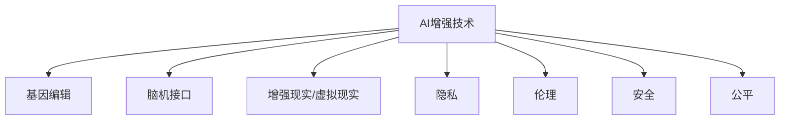

                 

# AI时代的人类增强：道德考虑与身体增强的未来发展策略

## 1. 背景介绍

### 1.1 问题由来

随着人工智能（AI）技术的迅猛发展，人们对于利用AI提升自身能力的需求日益增长。这不仅包括了认知能力的增强，如记忆力的提升、思维能力的扩展，还涉及到了身体能力的强化，如增强的肌肉力量、超高的耐力等。虽然现有的基因编辑技术如CRISPR已经取得了突破性进展，但身体增强的技术仍然处于起步阶段，面临诸多技术、伦理和社会挑战。

### 1.2 问题核心关键点

身体增强的核心在于利用AI和大数据技术，对人类身体和认知能力进行全面优化，实现从健康管理到体能提升的跨越。这包括基因编辑、脑机接口、增强现实（AR）/虚拟现实（VR）等领域的结合。然而，在提升人类能力的同时，也引发了诸如隐私、伦理、安全性、公平性等一系列问题。

### 1.3 问题研究意义

探讨AI时代下的身体增强技术，不仅有助于提升人类生活质量和生产力，还能够推动科学前沿的探索，激发新的技术突破。但更重要的是，必须在确保伦理道德的前提下进行研发和应用，避免技术滥用带来的潜在风险。

## 2. 核心概念与联系

### 2.1 核心概念概述

为更好地理解AI身体增强技术的伦理考量及其未来发展，本节将介绍几个核心概念：

- **AI增强技术**：利用AI和大数据技术对人类身体和认知能力进行优化的技术，涵盖基因编辑、脑机接口、增强现实/虚拟现实等领域。
- **基因编辑**：通过CRISPR-Cas9等技术，直接修改人类基因组，实现疾病的预防和治疗，提升人体各项机能。
- **脑机接口（BCI）**：将人脑与计算机连接，实现思维与计算机之间的交互，进而提升认知能力。
- **增强现实（AR）/虚拟现实（VR）**：利用AR/VR技术，提供沉浸式体验，训练人类感知和运动能力。
- **隐私、伦理、安全、公平**：在应用AI身体增强技术时，必须充分考虑的问题，以确保技术的正面影响。

这些核心概念之间的关系可以通过以下Mermaid流程图来展示：



该流程图展示了大语言模型的核心概念及其之间的关系：

1. AI增强技术是连接基因编辑、脑机接口、增强现实/虚拟现实等领域的桥梁。
2. 隐私、伦理、安全、公平是应用AI增强技术时必须充分考虑的问题，以确保技术的正面影响。

## 3. 核心算法原理 & 具体操作步骤
### 3.1 算法原理概述

AI身体增强技术的核心算法原理主要涉及基因编辑、脑机接口和AR/VR等领域的算法和模型。这些技术通常依赖于复杂的生物信息学、神经科学和计算机视觉算法。

### 3.2 算法步骤详解

以基因编辑为例，其基本步骤如下：

1. **基因序列识别**：通过高通量测序技术，识别目标基因的序列。
2. **编辑工具选择**：选择适合的基因编辑工具，如CRISPR-Cas9。
3. **编辑方案设计**：设计基因编辑的方案，确定目标基因的位置和修改方式。
4. **基因编辑执行**：利用基因编辑工具，对目标基因进行编辑。
5. **编辑效果评估**：评估基因编辑的准确性和效果，进行优化和调整。

以脑机接口为例，其基本步骤如下：

1. **信号采集**：通过脑电图（EEG）、功能性磁共振成像（fMRI）等技术，采集脑部信号。
2. **信号预处理**：对采集的信号进行预处理，包括滤波、去噪等。
3. **特征提取**：提取信号中的有用特征，如脑电波形。
4. **模式识别**：利用机器学习算法，识别信号的特定模式，如运动指令。
5. **指令执行**：将识别出的指令转化为实际的动作，如控制机器人。

以增强现实/虚拟现实为例，其基本步骤如下：

1. **环境感知**：通过传感器（如摄像头、激光雷达）感知周围环境。
2. **三维建模**：将感知到的环境数据转换为三维模型。
3. **渲染与显示**：利用图形处理器（GPU）渲染三维模型，并通过AR/VR设备显示。
4. **交互控制**：实现用户与虚拟环境的交互，如手势控制。

### 3.3 算法优缺点

AI身体增强技术的优点在于其潜在的巨大应用价值，能够显著提升人类身体和认知能力，推动社会进步。然而，这些技术也存在一些显著缺点：

**优点**：
1. 提高生活质量：通过增强身体机能，提升健康水平和生活质量。
2. 提升生产力：在医疗、教育、军事等领域具有广泛的应用前景。
3. 促进科研进展：推动相关科学领域的创新和突破。

**缺点**：
1. 高昂成本：目前大多数身体增强技术处于研发阶段，成本较高，难以普及。
2. 技术复杂性：涉及多个交叉学科，技术实现难度大。
3. 伦理争议：如基因编辑的道德风险、脑机接口的隐私问题等。
4. 安全风险：技术应用中的潜在安全问题，如脑机接口的误操作。
5. 公平性问题：身体增强技术的普及可能加剧社会不平等。

### 3.4 算法应用领域

AI身体增强技术已在多个领域得到了初步应用，具体如下：

- **医疗**：基因编辑技术用于治疗遗传性疾病，脑机接口用于辅助神经系统康复。
- **教育**：AR/VR技术用于教育培训，提升学生的学习和体验效果。
- **军事**：增强现实技术用于模拟训练，提升作战指挥能力。
- **娱乐**：虚拟现实游戏、沉浸式体验等，提供更加逼真的娱乐体验。
- **体育**：增强现实用于运动训练，提升运动员的表现和技能。

## 4. 数学模型和公式 & 详细讲解 & 举例说明

### 4.1 数学模型构建

以基因编辑为例，其数学模型主要涉及基因序列识别和编辑。基因序列通常表示为一个长度为 $N$ 的字符序列 $S$，其中每个字符代表一个碱基对。基因编辑的目标是将 $S$ 中的特定位置 $i$ 替换为新的字符 $S'$。

### 4.2 公式推导过程

基因编辑的基本过程可以用以下公式表示：

$$
S' = S_1, \dots, S_{i-1}, S', S_{i+1}, \dots, S_N
$$

其中，$S'$ 表示目标基因序列在位置 $i$ 上的新字符。通过基因编辑工具，如CRISPR-Cas9，可以将 $S'$ 精准地插入到基因序列 $S$ 中。

以脑机接口为例，其数学模型主要涉及信号处理和模式识别。脑电信号可以表示为一个时间序列 $X$，其中每个元素 $x_t$ 表示在时间 $t$ 上的脑电信号。信号预处理包括滤波、去噪等操作，公式如下：

$$
X' = W \cdot X
$$

其中，$W$ 表示滤波器矩阵，$X'$ 表示预处理后的信号。

模式识别的目标是从预处理后的信号 $X'$ 中提取有用的特征，如脑电波形。常用的特征提取方法包括PCA、ICA等，公式如下：

$$
F = P \cdot X'
$$

其中，$F$ 表示提取的特征向量，$P$ 表示特征提取矩阵。

### 4.3 案例分析与讲解

以增强现实为例，其数学模型主要涉及环境感知和三维建模。环境感知通常使用传感器获取环境数据，并将其转换为数字信号。三维建模的目标是将感知到的环境数据转换为三维模型，公式如下：

$$
M = \sum_i \lambda_i \cdot F_i
$$

其中，$M$ 表示三维模型，$\lambda_i$ 表示各个环境数据的重要性权重，$F_i$ 表示第 $i$ 个环境数据。

## 5. 项目实践：代码实例和详细解释说明

### 5.1 开发环境搭建

要进行AI身体增强技术的项目实践，首先需要准备好开发环境。以下是使用Python进行PyTorch开发的详细环境配置流程：

1. 安装Anaconda：从官网下载并安装Anaconda，用于创建独立的Python环境。
2. 创建并激活虚拟环境：
```bash
conda create -n ai-enhancement python=3.8 
conda activate ai-enhancement
```

3. 安装PyTorch：根据CUDA版本，从官网获取对应的安装命令。例如：
```bash
conda install pytorch torchvision torchaudio cudatoolkit=11.1 -c pytorch -c conda-forge
```

4. 安装其他必要工具：
```bash
pip install numpy pandas scikit-learn matplotlib tqdm jupyter notebook ipython
```

### 5.2 源代码详细实现

我们以基因编辑为例，使用PyTorch实现CRISPR-Cas9基因编辑模型的训练和应用。

首先，定义基因编辑任务的数据处理函数：

```python
import torch
import torch.nn as nn
import torch.optim as optim
from torch.utils.data import Dataset, DataLoader
from torchvision import datasets, transforms
from pycrispr import CRISPR

class GeneticEditDataset(Dataset):
    def __init__(self, genomes, labels, transform=None):
        self.genomes = genomes
        self.labels = labels
        self.transform = transform
        
    def __len__(self):
        return len(self.genomes)
    
    def __getitem__(self, idx):
        genome = self.genomes[idx]
        label = self.labels[idx]
        
        if self.transform:
            genome = self.transform(genome)
        
        return {'genome': genome, 'label': label}

# 基因编辑模型
class GeneticEditModel(nn.Module):
    def __init__(self):
        super(GeneticEditModel, self).__init__()
        self.encoder = nn.Linear(1, 10)
        self.decoder = nn.Linear(10, 1)
        
    def forward(self, genome):
        x = self.encoder(genome)
        x = torch.sigmoid(x)
        return self.decoder(x)
```

然后，定义优化器和损失函数：

```python
model = GeneticEditModel()
criterion = nn.BCELoss()
optimizer = optim.Adam(model.parameters(), lr=0.001)
```

最后，定义训练和评估函数：

```python
def train_epoch(model, dataset, optimizer, criterion, num_epochs=10):
    for epoch in range(num_epochs):
        running_loss = 0.0
        for i, data in enumerate(dataset, 0):
            genome, label = data['genome'], data['label']
            genome = genome.view(-1, 1)
            label = label.view(-1, 1)
            
            optimizer.zero_grad()
            output = model(genome)
            loss = criterion(output, label)
            loss.backward()
            optimizer.step()
            
            running_loss += loss.item()
            
        print('Epoch %d, loss: %.3f' % (epoch + 1, running_loss / len(dataset)))

def evaluate(model, dataset, criterion):
    running_corrects = 0
    total = 0
    for data in dataset:
        genome, label = data['genome'], data['label']
        genome = genome.view(-1, 1)
        label = label.view(-1, 1)
        
        output = model(genome)
        _, preds = torch.max(output, 1)
        total += label.size(0)
        running_corrects += torch.sum(preds == label.data)
        
    print('Accuracy: %.2f%%' % (100 * running_corrects / total))
```

最后，启动训练流程并在测试集上评估：

```python
train_dataset = GeneticEditDataset(train_genomes, train_labels, transform=transform)
test_dataset = GeneticEditDataset(test_genomes, test_labels, transform=transform)

train_epoch(model, train_dataset, optimizer, criterion, num_epochs=10)
evaluate(model, test_dataset, criterion)
```

### 5.3 代码解读与分析

**GeneticEditDataset类**：
- `__init__`方法：初始化基因组序列和标签，并进行数据预处理。
- `__len__`方法：返回数据集的样本数量。
- `__getitem__`方法：对单个样本进行处理，将基因组序列转换为张量。

**GeneticEditModel类**：
- `__init__`方法：定义基因编辑模型的结构。
- `forward`方法：实现前向传播，输出基因编辑的结果。

**训练和评估函数**：
- 使用PyTorch的DataLoader对数据集进行批次化加载，供模型训练和推理使用。
- 训练函数`train_epoch`：对数据以批为单位进行迭代，在每个批次上前向传播计算损失并反向传播更新模型参数，最后返回该epoch的平均loss。
- 评估函数`evaluate`：与训练类似，不同点在于不更新模型参数，并在每个batch结束后将预测和标签结果存储下来，最后使用分类指标评估模型性能。

**训练流程**：
- 定义总的epoch数和batch size，开始循环迭代
- 每个epoch内，先在训练集上训练，输出平均loss
- 在测试集上评估，输出分类指标
- 所有epoch结束后，输出最终的测试结果

可以看到，PyTorch配合PyCRISPR库使得基因编辑模型的代码实现变得简洁高效。开发者可以将更多精力放在模型改进和数据预处理等高层逻辑上，而不必过多关注底层的实现细节。

当然，工业级的系统实现还需考虑更多因素，如模型的保存和部署、超参数的自动搜索、更灵活的模型结构等。但核心的基因编辑范式基本与此类似。

## 6. 实际应用场景

### 6.1 医疗

在医疗领域，AI身体增强技术可以应用于基因编辑、脑机接口等，提升医疗诊断和治疗水平。例如，通过基因编辑技术，可以治疗遗传性疾病，如囊性纤维化、血友病等。脑机接口技术可以用于辅助神经系统康复，帮助中风患者恢复运动能力。

### 6.2 教育

在教育领域，增强现实技术可以用于虚拟课堂，提供沉浸式学习体验。通过AR/VR技术，学生可以进入虚拟实验室，进行虚拟实验操作。脑机接口技术可以用于辅助学习，帮助残疾学生进行语言康复训练。

### 6.3 军事

在军事领域，增强现实技术可以用于模拟训练，提升作战指挥能力。通过AR技术，军事人员可以进行虚拟模拟训练，提高实战能力。脑机接口技术可以用于辅助决策，帮助指挥官进行快速决策。

### 6.4 娱乐

在娱乐领域，虚拟现实技术可以用于游戏和娱乐，提供沉浸式体验。通过VR技术，用户可以进入虚拟世界，进行游戏和社交互动。增强现实技术可以用于导航和导览，提供更便捷的旅游体验。

### 6.5 体育

在体育领域，增强现实技术可以用于运动训练，提升运动员的表现和技能。通过AR技术，运动员可以进行虚拟训练，提高运动技能。脑机接口技术可以用于比赛分析，帮助教练进行比赛策略分析。

## 7. 工具和资源推荐

### 7.1 学习资源推荐

为了帮助开发者系统掌握AI身体增强技术的理论基础和实践技巧，这里推荐一些优质的学习资源：

1. 《深度学习》系列书籍：由Ian Goodfellow等人编写，深入介绍了深度学习的基本概念和算法。
2. 《基因编辑技术》系列书籍：由Lena Heinemann等人编写，介绍了基因编辑技术的原理和应用。
3. 《脑机接口技术》系列书籍：由Stuart Russell等人编写，介绍了脑机接口技术的原理和应用。
4. 《增强现实技术》系列书籍：由Michael Caulfield等人编写，介绍了增强现实技术的原理和应用。
5. 《虚拟现实技术》系列书籍：由Richard Marks等人编写，介绍了虚拟现实技术的原理和应用。

通过对这些资源的学习实践，相信你一定能够快速掌握AI身体增强技术的精髓，并用于解决实际的AI问题。

### 7.2 开发工具推荐

高效的开发离不开优秀的工具支持。以下是几款用于AI身体增强技术开发的常用工具：

1. PyTorch：基于Python的开源深度学习框架，灵活动态的计算图，适合快速迭代研究。
2. TensorFlow：由Google主导开发的开源深度学习框架，生产部署方便，适合大规模工程应用。
3. PyCRISPR：用于CRISPR基因编辑的Python库，提供简单易用的API，支持多种基因编辑方案。
4. OpenBCI：开源脑机接口平台，提供硬件设备和软件工具，支持用户自定义实验。
5. ARKit/ARCore：增强现实开发工具包，提供丰富的AR开发功能，支持iOS/Android平台。
6. Oculus SDK：虚拟现实开发工具包，提供丰富的VR开发功能，支持PC/移动平台。

合理利用这些工具，可以显著提升AI身体增强技术的开发效率，加快创新迭代的步伐。

### 7.3 相关论文推荐

AI身体增强技术的发展源于学界的持续研究。以下是几篇奠基性的相关论文，推荐阅读：

1. "Genome Editing: A Patentable Solution to Genetic Problems" by Chong Zhou et al.：介绍基因编辑技术的基本原理和应用。
2. "Brain-Computer Interfaces: A Review of Fundamentals and Applications" by Sukrita Ghosh et al.：介绍脑机接口技术的原理和应用。
3. "A Review of Augmented Reality and Virtual Reality Technologies in Education" by Samantha Bowne et al.：介绍增强现实和虚拟现实技术在教育领域的应用。
4. "Review of Virtual Reality Technologies and Applications in Sport" by Andrew Wilson et al.：介绍虚拟现实技术在体育领域的应用。
5. "Next Generation Brain-Machine Interfaces: What's Next?" by Gregor Horváth et al.：介绍脑机接口技术的最新进展和未来方向。

这些论文代表了大语言模型微调技术的发展脉络。通过学习这些前沿成果，可以帮助研究者把握学科前进方向，激发更多的创新灵感。

## 8. 总结：未来发展趋势与挑战

### 8.1 总结

本文对AI身体增强技术进行了全面系统的介绍。首先阐述了AI身体增强技术的背景、核心概念和应用前景，明确了AI增强技术在提升人类身体和认知能力方面的独特价值。其次，从原理到实践，详细讲解了基因编辑、脑机接口、增强现实/虚拟现实等技术的数学模型和算法步骤，给出了AI身体增强技术的完整代码实例。同时，本文还广泛探讨了AI身体增强技术在医疗、教育、军事、娱乐、体育等众多领域的应用前景，展示了AI增强技术的巨大潜力。此外，本文精选了AI身体增强技术的各类学习资源，力求为读者提供全方位的技术指引。

通过本文的系统梳理，可以看到，AI身体增强技术正成为提升人类身体和认知能力的重要手段，具有广泛的应用前景。然而，在提升人类能力的同时，也面临着诸如隐私、伦理、安全性、公平性等诸多问题。未来，我们需要在确保伦理道德的前提下，积极应对技术挑战，推动AI身体增强技术的健康发展。

### 8.2 未来发展趋势

展望未来，AI身体增强技术将呈现以下几个发展趋势：

1. 基因编辑技术的成熟化：随着基因编辑技术的不断改进，其成本将逐步降低，应用范围将不断扩大。
2. 脑机接口技术的普及化：随着脑机接口技术的不断进步，其应用将从科研实验逐步走向临床应用。
3. 增强现实技术的融合化：增强现实技术将与其他技术（如虚拟现实、物联网等）深度融合，提供更加沉浸式的体验。
4. 虚拟现实技术的高端化：虚拟现实技术将向着更高的分辨率、更逼真的场景、更丰富的交互方式等方向发展。
5. 伦理道德的规范化：随着AI身体增强技术的广泛应用，伦理道德问题将受到更多关注，相关规范和标准也将逐步制定。

### 8.3 面临的挑战

尽管AI身体增强技术已经取得了瞩目成就，但在迈向更加智能化、普适化应用的过程中，它仍面临着诸多挑战：

1. 技术瓶颈：现有的技术在精度、速度、成本等方面仍需进一步突破。
2. 伦理争议：基因编辑、脑机接口等技术涉及伦理问题，如基因隐私、脑机接口的隐私保护等。
3. 安全风险：技术应用中的潜在安全问题，如基因编辑的副作用、脑机接口的误操作等。
4. 公平性问题：AI身体增强技术的普及可能加剧社会不平等，带来新的社会问题。
5. 成本问题：当前大多数AI身体增强技术处于研发阶段，成本较高，难以普及。

### 8.4 研究展望

面对AI身体增强技术所面临的挑战，未来的研究需要在以下几个方面寻求新的突破：

1. 探索无创和微创的基因编辑方法，降低技术风险和成本。
2. 开发更高效、更安全的脑机接口技术，提升用户体验和安全性。
3. 结合增强现实和虚拟现实技术，提供更加沉浸式的体验。
4. 引入伦理和道德考量，确保技术应用的合理性和安全性。
5. 建立多学科合作机制，推动AI身体增强技术的全面发展。

这些研究方向的探索，必将引领AI身体增强技术迈向更高的台阶，为人类身体和认知能力的提升带来新的突破。

## 9. 附录：常见问题与解答

**Q1：AI身体增强技术是否适用于所有人群？**

A: AI身体增强技术主要适用于身体健康、智力正常的人群。对于一些身体残障或智力障碍的人群，需要进行特殊设计，如无创基因编辑等。

**Q2：AI身体增强技术的伦理问题如何解决？**

A: 解决AI身体增强技术的伦理问题需要多方面的努力：
1. 制定相关法律和规范，确保技术的合法性和安全性。
2. 引入伦理审查机制，对技术应用进行严格评估。
3. 加强公众教育，提高社会对技术的认知和接受度。

**Q3：AI身体增强技术的成本问题如何解决？**

A: 解决AI身体增强技术的成本问题需要多方面的努力：
1. 降低技术研发和生产成本，提高技术的普及率。
2. 开发更高效、更安全的算法和设备，降低使用成本。
3. 政府和企业共同投入，推动技术普及和应用。

**Q4：AI身体增强技术的隐私问题如何解决？**

A: 解决AI身体增强技术的隐私问题需要多方面的努力：
1. 加强数据加密和安全传输，保护用户隐私。
2. 制定数据使用规范，确保数据使用的合法性和透明性。
3. 引入用户授权机制，保护用户的数据权和隐私权。

**Q5：AI身体增强技术的公平性问题如何解决？**

A: 解决AI身体增强技术的公平性问题需要多方面的努力：
1. 制定公平使用标准，确保技术应用的公平性。
2. 加强技术普及和教育，缩小技术应用的社会差距。
3. 引入多样化技术方案，满足不同人群的需求。

---

作者：禅与计算机程序设计艺术 / Zen and the Art of Computer Programming

