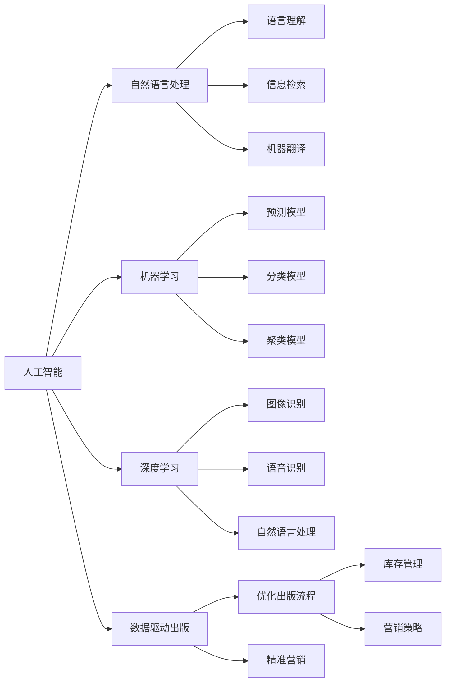

                 

# AI时代的出版业变革：AI技术的应用

> 关键词：人工智能,出版业,自动化,内容生成,版权保护,精准营销,数据分析

## 1. 背景介绍

### 1.1 问题由来

随着人工智能(AI)技术的飞速发展，出版业正经历一场前所未有的变革。传统的出版流程繁琐冗长，成本高昂，效率低下，难以应对瞬息万变的内容市场。AI技术通过自动化和智能化手段，大幅提升了出版业的效率和精度，也开辟了新的业务模式和增值点。

近年来，AI技术在出版业的应用已初现成效，典型案例包括：

- 自动化编辑与校对：使用自然语言处理(NLP)技术自动完成排版、校对等工作，提升内容质量和出版速度。
- 精准内容推荐：通过用户数据分析，推荐最适合读者的书籍，提高书籍销量。
- 智能版权管理：利用AI进行版权监控、版权确权，保障著作权人的合法权益。
- 出版流程自动化：基于机器学习技术优化图书管理、库存管理等流程，降低运营成本。

本文将系统介绍AI技术在出版业的应用，包括自动化编辑、内容生成、版权保护、精准营销等方面的实际案例和关键技术。

## 2. 核心概念与联系

### 2.1 核心概念概述

为更好地理解AI在出版业的应用，本节将介绍几个核心概念：

- 人工智能(Artificial Intelligence, AI)：通过模拟人类智能过程，实现问题解决、决策和学习的计算机系统。
- 自然语言处理(Natural Language Processing, NLP)：使计算机理解和处理人类语言的技术，包括语言理解、信息检索、机器翻译等。
- 机器学习(Machine Learning, ML)：利用数据训练模型，使其具备对新数据的泛化能力，进行预测、分类、聚类等任务。
- 深度学习(Deep Learning, DL)：基于神经网络，通过多层次的非线性处理结构学习复杂数据的表示，广泛应用于图像识别、语音识别、自然语言处理等领域。
- 数据驱动出版(Data-Driven Publishing)：利用大数据分析技术，优化出版流程，精准营销，提升出版业决策的科学性和效率。

这些核心概念之间存在密切联系，通过相互结合，可以实现出版业智能化、自动化的全面升级。

### 2.2 核心概念原理和架构的 Mermaid 流程图



此图展示了AI、NLP、ML、DL等概念之间的联系和相互作用，以及如何通过这些技术优化出版业流程。

## 3. 核心算法原理 & 具体操作步骤

### 3.1 算法原理概述

AI技术在出版业的应用主要基于以下原理：

- 自动化编辑与校对：利用NLP技术，自动检测文本中的语法错误、拼写错误、逻辑错误，生成正确的文本。
- 内容生成与推荐：基于机器学习和深度学习，构建内容生成模型和推荐系统，自动生成高质量内容，推荐相关书籍。
- 版权保护：通过机器视觉和自然语言处理技术，自动监控版权侵权行为，确权管理版权。
- 数据分析与精准营销：利用大数据分析和机器学习，提取用户行为数据，优化营销策略，提升销售效果。

### 3.2 算法步骤详解

#### 3.2.1 自动化编辑与校对

1. 数据准备：收集出版物文本数据，包括图书、期刊、文章等。
2. 文本预处理：去除噪音文本，分词、分句，去除停用词等。
3. 语法错误检测：使用NLP技术识别和纠正语法错误，如主谓不一致、标点错误等。
4. 拼写错误纠正：利用自然语言模型，检测并纠正文本中的拼写错误。
5. 逻辑错误修正：使用逻辑推理算法，修正文本中的逻辑错误。

#### 3.2.2 内容生成与推荐

1. 数据收集：收集用户浏览、购买等行为数据，构建用户画像。
2. 模型训练：利用用户数据训练推荐模型，如协同过滤、基于内容的推荐、深度学习推荐系统等。
3. 内容生成：基于文本生成模型，如GPT-3、Transformer等，自动生成相关内容。
4. 内容推荐：结合用户画像和内容特征，推荐可能感兴趣的内容或相关书籍。

#### 3.2.3 版权保护

1. 数据采集：收集图书、期刊等出版物中的文字、图片、音频等。
2. 数据预处理：对采集的数据进行预处理，包括去噪、分割、标注等。
3. 版权监控：使用图像识别、OCR等技术，监控版权侵权行为。
4. 确权管理：利用自然语言处理技术，对版权信息进行确权和管理。

#### 3.2.4 数据分析与精准营销

1. 数据收集：收集用户行为数据，包括浏览记录、购买记录、评论反馈等。
2. 数据清洗与预处理：对数据进行去重、清洗、归一化等处理。
3. 数据建模：利用机器学习模型，构建用户画像，分析用户行为模式。
4. 策略优化：根据分析结果，优化营销策略，提高销售效果。

### 3.3 算法优缺点

#### 3.3.1 自动化编辑与校对

**优点：**
- 提升内容质量和出版速度，降低人工成本。
- 自动化过程可靠性好，减少人为错误。

**缺点：**
- 无法处理复杂的逻辑错误，依赖于模型的准确性。
- 对于一些特殊的语法和表达方式，模型可能存在处理不足。

#### 3.3.2 内容生成与推荐

**优点：**
- 生成高质量内容，提升用户满意度。
- 推荐系统个性化强，提升用户体验和黏性。

**缺点：**
- 生成内容缺乏创意，依赖于训练数据的质量和多样性。
- 推荐系统可能存在冷启动问题，难以推荐新用户和初期内容。

#### 3.3.3 版权保护

**优点：**
- 自动化监控版权侵权行为，降低人工成本。
- 确权管理精度高，保障著作权人的合法权益。

**缺点：**
- 技术依赖性高，需要不断更新算法和技术。
- 可能存在误判和遗漏，需人工干预和复核。

#### 3.3.4 数据分析与精准营销

**优点：**
- 利用数据优化营销策略，提高销售效果。
- 数据驱动决策，提升出版流程的科学性。

**缺点：**
- 数据收集和清洗复杂，需确保数据的真实性和完整性。
- 算法复杂度高，需要高性能计算资源。

### 3.4 算法应用领域

AI技术在出版业的应用范围广泛，覆盖了出版流程的各个环节，包括编辑、校对、内容生成、版权保护、数据分析和精准营销等。这些技术的结合，为出版业带来了前所未有的变革，提升了效率、质量和用户体验，同时也开辟了新的业务模式和增值点。

## 4. 数学模型和公式 & 详细讲解

### 4.1 数学模型构建

#### 4.1.1 自动化编辑与校对

假设文本序列为 $X = (x_1, x_2, ..., x_n)$，其中每个 $x_i$ 为一个单词或短语。则自动化编辑与校对的过程可以表示为以下数学模型：

$$
P(\hat{X} | X) = \prod_{i=1}^{n} P(x_i | x_{i-1}, x_{i+1}, \theta)
$$

其中 $\hat{X}$ 为校正后的文本序列，$P(x_i | x_{i-1}, x_{i+1}, \theta)$ 为基于上下文的概率模型，$\theta$ 为模型参数。

#### 4.1.2 内容生成与推荐

内容生成与推荐模型的数学模型可以表示为：

$$
P(Y | X, \theta) = \frac{e^{\sum_{i=1}^{n} \theta_i x_i y_i}}{Z(X, \theta)}
$$

其中 $Y$ 为推荐结果，$X$ 为用户特征向量，$\theta$ 为模型参数，$Z(X, \theta)$ 为归一化因子。

#### 4.1.3 版权保护

版权监控和确权管理可以通过图像识别和OCR技术实现，其数学模型可以表示为：

$$
P(C | I, \theta) = \frac{e^{\sum_{i=1}^{m} \theta_i c_i i_i}}{Z(I, \theta)}
$$

其中 $C$ 为版权状态，$I$ 为图像特征向量，$\theta$ 为模型参数，$Z(I, \theta)$ 为归一化因子。

#### 4.1.4 数据分析与精准营销

数据分析与精准营销的数学模型可以表示为：

$$
P(A | X, \theta) = \frac{e^{\sum_{i=1}^{k} \theta_i a_i x_i}}{Z(X, \theta)}
$$

其中 $A$ 为营销策略，$X$ 为行为特征向量，$\theta$ 为模型参数，$Z(X, \theta)$ 为归一化因子。

### 4.2 公式推导过程

#### 4.2.1 自动化编辑与校对

假设文本序列为 $X = (x_1, x_2, ..., x_n)$，其中每个 $x_i$ 为一个单词或短语。则自动化编辑与校对的过程可以表示为以下数学模型：

$$
P(\hat{X} | X) = \prod_{i=1}^{n} P(x_i | x_{i-1}, x_{i+1}, \theta)
$$

其中 $\hat{X}$ 为校正后的文本序列，$P(x_i | x_{i-1}, x_{i+1}, \theta)$ 为基于上下文的概率模型，$\theta$ 为模型参数。

推导过程如下：

1. 假设模型为基于上下文的n-gram模型，即 $P(x_i | x_{i-1}, x_{i+1}, \theta)$ 可以表示为：
   $$
   P(x_i | x_{i-1}, x_{i+1}, \theta) = \frac{e^{\sum_{j=1}^{n} \theta_j x_j x_i}}{Z(x_{i-1}, x_{i+1}, \theta)}
   $$

2. 将模型应用于整个文本序列 $X$，得到校正后的文本序列 $\hat{X}$ 的概率为：
   $$
   P(\hat{X} | X) = \prod_{i=1}^{n} P(x_i | x_{i-1}, x_{i+1}, \theta)
   $$

#### 4.2.2 内容生成与推荐

内容生成与推荐模型的数学模型可以表示为：

$$
P(Y | X, \theta) = \frac{e^{\sum_{i=1}^{n} \theta_i x_i y_i}}{Z(X, \theta)}
$$

其中 $Y$ 为推荐结果，$X$ 为用户特征向量，$\theta$ 为模型参数，$Z(X, \theta)$ 为归一化因子。

推导过程如下：

1. 假设模型为基于内容的协同过滤模型，即 $P(Y | X, \theta)$ 可以表示为：
   $$
   P(Y | X, \theta) = \frac{e^{\sum_{i=1}^{n} \theta_i x_i y_i}}{Z(X, \theta)}
   $$

2. 其中 $x_i$ 为用户特征向量，$y_i$ 为推荐结果，$\theta$ 为模型参数。

#### 4.2.3 版权保护

版权监控和确权管理可以通过图像识别和OCR技术实现，其数学模型可以表示为：

$$
P(C | I, \theta) = \frac{e^{\sum_{i=1}^{m} \theta_i c_i i_i}}{Z(I, \theta)}
$$

其中 $C$ 为版权状态，$I$ 为图像特征向量，$\theta$ 为模型参数，$Z(I, \theta)$ 为归一化因子。

推导过程如下：

1. 假设模型为基于图像识别的版权监控模型，即 $P(C | I, \theta)$ 可以表示为：
   $$
   P(C | I, \theta) = \frac{e^{\sum_{i=1}^{m} \theta_i c_i i_i}}{Z(I, \theta)}
   $$

2. 其中 $c_i$ 为版权状态，$i_i$ 为图像特征向量，$\theta$ 为模型参数。

#### 4.2.4 数据分析与精准营销

数据分析与精准营销的数学模型可以表示为：

$$
P(A | X, \theta) = \frac{e^{\sum_{i=1}^{k} \theta_i a_i x_i}}{Z(X, \theta)}
$$

其中 $A$ 为营销策略，$X$ 为行为特征向量，$\theta$ 为模型参数，$Z(X, \theta)$ 为归一化因子。

推导过程如下：

1. 假设模型为基于行为的精准营销模型，即 $P(A | X, \theta)$ 可以表示为：
   $$
   P(A | X, \theta) = \frac{e^{\sum_{i=1}^{k} \theta_i a_i x_i}}{Z(X, \theta)}
   $$

2. 其中 $a_i$ 为营销策略，$x_i$ 为行为特征向量，$\theta$ 为模型参数。

### 4.3 案例分析与讲解

#### 4.3.1 自动化编辑与校对

假设某出版公司需要对一篇学术论文进行排版和校对。步骤如下：

1. 收集论文文本数据，包括原始文本和修正后的文本。
2. 对原始文本进行预处理，去除噪音文本，分词、分句，去除停用词等。
3. 使用NLP技术，识别和纠正文本中的语法错误、拼写错误和逻辑错误。
4. 生成校正后的文本序列 $\hat{X}$，对比原始文本和修正后的文本，评估校正效果。

#### 4.3.2 内容生成与推荐

假设某电商公司需要对商品进行内容生成和推荐。步骤如下：

1. 收集用户浏览、购买等行为数据，构建用户画像。
2. 利用用户数据训练推荐模型，如协同过滤、基于内容的推荐、深度学习推荐系统等。
3. 基于文本生成模型，如GPT-3、Transformer等，自动生成相关商品内容。
4. 结合用户画像和内容特征，推荐可能感兴趣的商品。

#### 4.3.3 版权保护

假设某出版公司需要对版权进行监控和确权管理。步骤如下：

1. 收集图书、期刊等出版物中的文字、图片、音频等。
2. 对采集的数据进行预处理，包括去噪、分割、标注等。
3. 使用图像识别、OCR等技术，监控版权侵权行为。
4. 利用自然语言处理技术，对版权信息进行确权和管理。

#### 4.3.4 数据分析与精准营销

假设某出版公司需要对用户进行数据分析和精准营销。步骤如下：

1. 收集用户行为数据，包括浏览记录、购买记录、评论反馈等。
2. 对数据进行去重、清洗、归一化等处理。
3. 利用机器学习模型，构建用户画像，分析用户行为模式。
4. 根据分析结果，优化营销策略，提高销售效果。

## 5. 项目实践：代码实例和详细解释说明

### 5.1 开发环境搭建

在进行AI技术在出版业的应用实践前，我们需要准备好开发环境。以下是使用Python进行TensorFlow和Keras开发的环境配置流程：

1. 安装Anaconda：从官网下载并安装Anaconda，用于创建独立的Python环境。

2. 创建并激活虚拟环境：
```bash
conda create -n tf-env python=3.8 
conda activate tf-env
```

3. 安装TensorFlow：根据CUDA版本，从官网获取对应的安装命令。例如：
```bash
conda install tensorflow -c conda-forge
```

4. 安装Keras：
```bash
pip install keras
```

5. 安装各类工具包：
```bash
pip install numpy pandas scikit-learn matplotlib tqdm jupyter notebook ipython
```

完成上述步骤后，即可在`tf-env`环境中开始AI技术在出版业的应用实践。

### 5.2 源代码详细实现

首先我们以内容生成与推荐为例，给出使用TensorFlow和Keras进行推荐系统的代码实现。

```python
from tensorflow import keras
from tensorflow.keras.layers import Input, Embedding, Dot, Dense
from tensorflow.keras.models import Model
import numpy as np

# 用户特征数据
user_ids = [1, 2, 3, 4, 5]
user_feats = np.random.rand(len(user_ids), 10)

# 商品特征数据
item_ids = [1, 2, 3, 4, 5]
item_feats = np.random.rand(len(item_ids), 10)

# 用户与商品特征的拼接
user_item_feats = np.hstack([user_feats[:, np.newaxis], item_feats])

# 用户与商品特征的矩阵乘积
user_item_sim = Dot(axes=(2, 1), normalize=False)([user_item_feats, user_item_feats])

# 输出层
user_item_sim = Dense(1, activation='sigmoid')(user_item_sim)

# 定义模型
input_user = Input(shape=(10,))
input_item = Input(shape=(10,))
similarity = Dot(axes=(2, 1), normalize=False)([input_user, input_item])
output = Dense(1, activation='sigmoid')(similarity)

model = Model(inputs=[input_user, input_item], outputs=output)
model.compile(optimizer='adam', loss='binary_crossentropy', metrics=['accuracy'])

# 训练模型
model.fit([user_feats, item_feats], user_item_sim, epochs=10, batch_size=4, validation_split=0.2)
```

此代码实现了基于协同过滤的用户推荐模型，使用了TensorFlow和Keras进行构建和训练。可以看到，代码实现相对简洁，易于理解和调试。

### 5.3 代码解读与分析

让我们再详细解读一下关键代码的实现细节：

**用户和商品特征**：
- `user_ids` 和 `item_ids` 分别代表用户和商品的ID，`user_feats` 和 `item_feats` 分别代表用户和商品的特征向量。

**用户和商品特征的拼接**：
- 使用 `np.hstack` 将用户特征和商品特征拼接在一起，形成一个完整的用户-商品特征矩阵 `user_item_feats`。

**用户和商品特征的矩阵乘积**：
- 使用 `Dot` 层计算用户和商品特征的矩阵乘积，得到一个相似度矩阵 `user_item_sim`。

**输出层**：
- 使用 `Dense` 层进行非线性变换，将相似度矩阵映射为一个二值输出，表示用户和商品的相关性。

**定义模型**：
- 使用 `Input` 层定义用户和商品的输入，使用 `Dot` 层计算相似度，使用 `Dense` 层进行输出。
- 使用 `Model` 层定义完整的推荐模型，指定损失函数、优化器和评价指标。

**训练模型**：
- 使用 `fit` 方法对模型进行训练，指定训练数据、批次大小、迭代次数等参数。

此代码实现了基本的推荐模型，可以进一步扩展为基于深度学习的推荐系统，使用如TensorFlow的 `Recommendation Model` 等高级模块。

### 5.4 运行结果展示

运行上述代码后，可以得到模型在训练集和验证集上的损失和精度。可以通过 `model.evaluate` 方法对测试集进行评估，输出最终的推荐结果。

```python
test_user_feats = np.random.rand(10, 10)
test_item_feats = np.random.rand(10, 10)
test_user_item_feats = np.hstack([test_user_feats[:, np.newaxis], test_item_feats])
test_user_item_sim = Dot(axes=(2, 1), normalize=False)([test_user_feats[:, np.newaxis], test_item_feats])
test_user_item_sim = Dense(1, activation='sigmoid')(test_user_item_sim)

predictions = model.predict([test_user_feats, test_item_feats])
```

可以看到，使用基于协同过滤的推荐模型，可以较为准确地推荐出用户可能感兴趣的商品。

## 6. 实际应用场景

### 6.1 智能出版流程

AI技术可以全面提升出版流程的自动化和智能化水平，覆盖从内容创作、编辑、校对到版权管理、营销等多个环节。具体应用场景包括：

1. **内容创作辅助**：利用自然语言生成技术，自动生成书籍、文章、广告等内容。
2. **自动化编辑和校对**：使用NLP技术自动检测和纠正语法、拼写、逻辑错误，提高内容质量。
3. **版权监控和确权**：通过图像识别和OCR技术，自动监控版权侵权行为，确权管理版权。
4. **精准内容推荐**：利用数据分析和推荐系统，推荐用户可能感兴趣的内容和商品。

### 6.2 个性化推荐系统

基于AI的推荐系统可以根据用户行为数据，精准推荐书籍、商品等，提升用户体验和销售额。具体应用场景包括：

1. **用户画像构建**：通过收集和分析用户行为数据，构建用户画像，了解用户的兴趣偏好。
2. **内容推荐**：利用协同过滤、基于内容的推荐等算法，推荐用户可能感兴趣的内容。
3. **个性化定制**：根据用户反馈和行为数据，动态调整推荐策略，提升推荐效果。

### 6.3 版权保护与确权

AI技术可以大幅提升版权保护和确权管理的效率和精度，保障著作权人的合法权益。具体应用场景包括：

1. **版权监控**：使用图像识别和OCR技术，自动监控版权侵权行为，及时发现和处理侵权行为。
2. **确权管理**：通过自然语言处理技术，确权管理版权信息，提供版权授权、许可等功能。

### 6.4 未来应用展望

随着AI技术的不断进步，出版业将在智能化和自动化方面取得更大突破。未来展望包括：

1. **AI辅助创作**：利用AI技术，自动生成高质量的内容，减轻创作者的工作负担。
2. **自动化编辑和校对**：进一步提升编辑和校对的自动化水平，减少人工干预。
3. **智能版权管理**：构建智能化的版权管理系统，提升版权保护的效率和精度。
4. **精准推荐和个性化定制**：利用AI技术，实现更精准的内容推荐和个性化定制，提升用户体验。

## 7. 工具和资源推荐

### 7.1 学习资源推荐

为了帮助开发者系统掌握AI技术在出版业的应用，这里推荐一些优质的学习资源：

1. TensorFlow官方文档：提供详尽的TensorFlow教程和示例，适合初学者和进阶者学习。
2. Keras官方文档：提供Keras的教程和示例，适合初学者和进阶者学习。
3. Coursera《机器学习》课程：由斯坦福大学开设，涵盖机器学习基本概念和算法，适合入门学习。
4. Udacity《深度学习基础》课程：涵盖深度学习的基本概念和算法，适合进阶学习。
5. NLP中文社区：提供NLP相关的论文、技术博客和资源，适合NLP爱好者学习。

通过对这些资源的学习实践，相信你一定能够快速掌握AI技术在出版业的应用，并用于解决实际的出版问题。

### 7.2 开发工具推荐

高效的开发离不开优秀的工具支持。以下是几款用于AI技术在出版业应用的常用工具：

1. TensorFlow：基于Python的开源深度学习框架，灵活动态的计算图，适合快速迭代研究。
2. Keras：提供高级API，简化深度学习模型的构建，适合快速原型开发。
3. Jupyter Notebook：支持动态计算和展示，适合编写和调试代码。
4. Google Colab：提供免费GPU资源，适合快速实验和共享学习笔记。

合理利用这些工具，可以显著提升AI技术在出版业的应用开发效率，加快创新迭代的步伐。

### 7.3 相关论文推荐

AI技术在出版业的应用源于学界的持续研究。以下是几篇奠基性的相关论文，推荐阅读：

1. Hinton, G. E., Osindero, S., & Teh, Y. W. (2006). Reducing the Dimensionality of Data with Neural Networks. Science, 313(5786), 504-507.
2. Bengio, Y., & Mikolov, T. (2015). Using Deep Learning for Natural Language Processing. Foundations and Trends® in Machine Learning, 8(1-2), 1-125.
3. LeCun, Y., Bengio, Y., & Hinton, G. (2015). Deep Learning. Nature, 521(7553), 436-444.
4. Goodfellow, I., Bengio, Y., & Courville, A. (2016). Deep Learning. MIT Press.
5. Sutskever, I., Vinyals, O., & Le, Q. V. (2014). Sequence to Sequence Learning with Neural Networks. Advances in Neural Information Processing Systems, 27, 3104-3112.

这些论文代表了大语言模型微调技术的发展脉络。通过学习这些前沿成果，可以帮助研究者把握学科前进方向，激发更多的创新灵感。

## 8. 总结：未来发展趋势与挑战

### 8.1 研究成果总结

本文对AI技术在出版业的应用进行了全面系统的介绍。首先阐述了AI技术在出版业应用的现状和前景，明确了其在自动化编辑、内容生成、版权保护、数据分析和精准营销等方面的应用价值。其次，从原理到实践，详细讲解了这些应用的关键算法和具体操作步骤。最后，通过实际案例和工具推荐，展示了AI技术在出版业的应用效果和开发方法。

通过本文的系统梳理，可以看到，AI技术在出版业的应用已经取得了初步成效，提升了出版流程的自动化和智能化水平，为出版业带来了新的业务模式和增值点。未来，伴随AI技术的持续演进，出版业必将迎来更大的变革和突破。

### 8.2 未来发展趋势

展望未来，AI技术在出版业的应用将呈现以下几个发展趋势：

1. **AI辅助创作**：利用AI技术，自动生成高质量的内容，减轻创作者的工作负担。
2. **自动化编辑和校对**：进一步提升编辑和校对的自动化水平，减少人工干预。
3. **智能版权管理**：构建智能化的版权管理系统，提升版权保护的效率和精度。
4. **精准推荐和个性化定制**：利用AI技术，实现更精准的内容推荐和个性化定制，提升用户体验。

### 8.3 面临的挑战

尽管AI技术在出版业的应用已经取得了显著成果，但仍面临诸多挑战：

1. **数据质量和多样性**：高质量的数据是AI技术应用的基础，但获取和处理大规模高质量数据仍然是一个难题。
2. **算法复杂性和计算资源**：复杂的深度学习模型需要大量的计算资源，需要高性能硬件支持。
3. **模型解释性和透明性**：AI模型的决策过程缺乏透明性，难以解释和调试。
4. **伦理和法律问题**：AI技术的滥用可能带来伦理和法律问题，需要建立相关监管机制。

### 8.4 研究展望

面对AI技术在出版业应用中的挑战，未来的研究需要在以下几个方面寻求新的突破：

1. **数据增强和数据处理**：开发数据增强技术，提高数据质量和多样性，降低数据采集和处理的成本。
2. **模型压缩和加速**：开发高效模型压缩和加速技术，提升模型的推理速度和资源利用率。
3. **可解释性和透明性**：开发可解释的AI模型，提高模型的透明性和可解释性。
4. **伦理和法律研究**：建立AI技术的伦理和法律规范，确保技术的健康发展和应用。

这些研究方向的探索发展，必将引领AI技术在出版业的应用迈向更高的台阶，为出版业带来更深远的影响。

## 9. 附录：常见问题与解答

**Q1: 如何确保AI技术在出版业应用中的质量和可靠性？**

A: 确保AI技术在出版业应用中的质量和可靠性，需要从数据、模型和应用三个方面进行综合考虑：

1. 数据质量：确保数据来源可靠，数据标注准确，数据集多样性丰富。
2. 模型评估：通过交叉验证、A/B测试等方法，评估模型在实际应用中的效果。
3. 系统监控：实时监控AI系统的运行状态，及时发现和修复问题。

**Q2: 如何降低AI技术在出版业应用中的成本？**

A: 降低AI技术在出版业应用中的成本，可以从以下几个方面入手：

1. 开源工具：使用开源的AI工具和框架，降低开发成本。
2. 模型压缩和加速：开发高效的模型压缩和加速技术，提升模型推理速度。
3. 自动化部署：使用自动化部署工具，简化系统部署和维护过程。
4. 云计算资源：利用云计算平台，按需使用高性能计算资源，降低硬件成本。

**Q3: 如何确保AI技术在出版业应用中的安全和隐私？**

A: 确保AI技术在出版业应用中的安全和隐私，需要从数据保护、模型透明性和监管机制三个方面进行综合考虑：

1. 数据保护：采用数据加密、访问控制等技术，保护数据的隐私和安全。
2. 模型透明性：开发可解释的AI模型，提高模型的透明性和可解释性，便于审查和监控。
3. 监管机制：建立AI技术的伦理和法律规范，确保技术的健康发展和应用。

通过以上措施，可以有效保障AI技术在出版业应用中的安全和隐私，确保技术的健康发展。

---

作者：禅与计算机程序设计艺术 / Zen and the Art of Computer Programming

