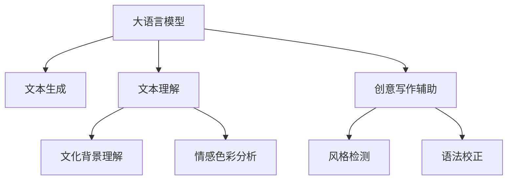

                 

# AI时代的创意写作灵感：码头故事的无尽思路

> 关键词：AI创意写作, 自然语言处理, 文学创作, 写作辅助, 大语言模型

## 1. 背景介绍

### 1.1 问题由来
随着人工智能技术的发展，尤其是在自然语言处理(Natural Language Processing, NLP)领域的突破，大语言模型（Large Language Models, LLMs）已经能够生成高质量的自然语言文本。这一技术不仅在机器翻译、语音识别等传统NLP任务上表现出色，还逐渐渗透到了创意写作、文学创作等更具挑战性的领域。

然而，尽管大语言模型在语言生成上取得了显著进展，其在创意写作中的运用仍然面临着一些挑战：模型生成的文本往往缺乏深度和个性化的灵感，难以真正“理解”文学作品背后的文化内涵和情感表达。此外，创作过程中的语言风格、主题选择等元素，仍然需要人类作者的深度参与和艺术性指导。

为了解决这些问题，研究者们正在探索如何将AI技术与创意写作紧密结合，既保留人类作者的创造力，又利用AI的力量辅助生成灵感和改进创作过程。这一方向不仅具有巨大的商业价值，也预示着文学创作方式的根本变革。

### 1.2 问题核心关键点
在本节中，我们将从以下几个核心问题入手，探讨如何利用大语言模型为创意写作提供新的思路：

- 如何构建一个既能生成多样化文本，又能理解文学作品深层含义的AI创意写作系统？
- 如何设计一个有效的文本风格检测与生成模型，以辅助人类作者进行文学创作？
- 如何在AI辅助写作过程中，保持文本的原创性和情感共鸣？
- 如何处理大语言模型在生成文本时可能出现的逻辑性不足和语法错误问题？

通过对这些关键问题的探讨，我们将揭示AI时代创意写作的新可能，探索如何让AI与人类作者携手创作出更具艺术价值和创新力的文学作品。

## 2. 核心概念与联系

### 2.1 核心概念概述

在进行深入分析前，首先需要理解以下几个核心概念：

- **大语言模型(Large Language Models, LLMs)**：一种通过大量文本数据预训练得到的语言模型，能够在自然语言处理任务中生成高质量的文本输出，如机器翻译、摘要生成、对话系统等。
- **创意写作(Creative Writing)**：一种文学创作活动，旨在创作出富有想象力和创新力的文本作品。
- **自然语言处理(Natural Language Processing, NLP)**：涉及计算机如何理解、处理和生成自然语言的技术，包括文本分类、信息抽取、机器翻译等。
- **文本生成与理解**：利用大语言模型进行文本生成，以及理解文学作品的文化背景、情感色彩等深层含义。

这些概念之间的逻辑关系可以通过以下Mermaid流程图来展示：



这个流程图展示了大语言模型在文本生成、文本理解、文化背景和情感色彩分析中的作用，以及其在创意写作辅助、风格检测和语法校正方面的应用。

## 3. 核心算法原理 & 具体操作步骤
### 3.1 算法原理概述

大语言模型通过在大规模无标签文本数据上进行自监督预训练，学习到丰富的语言知识和语法规则，能够生成自然流畅的文本。而创意写作辅助系统则在此基础上，通过进一步微调和优化，利用大语言模型的生成能力，为人类作者提供灵感和创作指导。

核心算法原理包括以下几个方面：

- **文本生成**：利用大语言模型进行文本生成，生成多样化的文本输出，供作者选择和修改。
- **文本理解**：通过语言模型理解文学作品的深层含义，包括文化背景、情感色彩等，辅助作者进行更深刻的创作。
- **风格检测**：检测生成的文本风格是否符合作者的创作意图和目标受众的偏好，确保文本风格的一致性和和谐性。
- **语法校正**：利用语言模型进行语法和逻辑错误校正，提高文本质量。

### 3.2 算法步骤详解

接下来，我们将详细介绍基于大语言模型的创意写作辅助系统的构建流程：

**Step 1: 数据准备与模型选择**
- 收集大范围的文学作品、文化背景资料和情感色彩标注数据。
- 选择合适的预训练语言模型，如GPT-3、BERT等，作为创意写作辅助系统的基础。

**Step 2: 构建文本生成模块**
- 将文学作品进行标注和数据清洗，构建训练集。
- 在预训练语言模型的基础上，进行微调或零样本学习，使其能够生成多样化的文本。

**Step 3: 设计文本理解模块**
- 利用语言模型理解文学作品的深层含义，如文化背景、情感色彩等。
- 设计文本理解算法，能够自动提取和分析文本中的文化元素和情感倾向。

**Step 4: 开发风格检测与生成模块**
- 构建风格检测模型，检测生成的文本是否符合作者的创作风格和目标受众的偏好。
- 利用生成模型，根据作者的创作意图生成符合风格的文本。

**Step 5: 集成语法校正与优化**
- 设计语法校正算法，识别并修正文本中的语法和逻辑错误。
- 对生成的文本进行语言风格和内容优化，确保文本的流畅性和可读性。

**Step 6: 用户交互与反馈循环**
- 提供用户界面，支持作者与AI创意写作系统进行互动，接收作者的反馈和指导。
- 根据用户的反馈，不断优化AI系统的生成和理解能力。

### 3.3 算法优缺点

基于大语言模型的创意写作辅助系统具有以下优点：

1. **生成多样性**：利用大语言模型的生成能力，生成多种可能的文本输出，供作者选择和修改。
2. **理解深层含义**：通过语言模型理解文学作品的深层含义，辅助作者进行更深刻的创作。
3. **风格一致性**：设计风格检测和生成模块，确保文本风格的一致性和和谐性。
4. **语法校正**：利用语言模型进行语法和逻辑错误校正，提高文本质量。

同时，该系统也存在一些局限性：

1. **缺乏创意深度**：尽管生成多样化文本，但缺乏人类作者的深度创作和独特视角。
2. **数据质量依赖**：创意写作辅助系统的性能很大程度上取决于文学作品和标注数据的质量。
3. **情感共鸣不足**：模型生成的文本可能缺乏人类的情感共鸣和人性关怀。
4. **依赖人类作者**：AI系统虽然能提供创作建议，但最终决策权仍在于人类作者，需要人工干预和指导。

### 3.4 算法应用领域

基于大语言模型的创意写作辅助系统在以下几个领域具有广泛的应用前景：

1. **文学创作**：为小说、诗歌、散文等文学作品的创作提供灵感和辅助。
2. **剧本编写**：为电影、电视剧等剧本的创作提供对话、场景和情节的灵感。
3. **广告文案**：生成具有吸引力和创意的广告文案，辅助市场营销。
4. **企业报告**：为公司报告、白皮书等文档的生成提供数据支持和创意灵感。
5. **创意营销**：在品牌推广和市场活动中，生成创意广告和宣传语。

这些领域的应用将大幅提升创意写作的效率和质量，为各行各业的创新发展提供新的动力。

## 4. 数学模型和公式 & 详细讲解 & 举例说明

### 4.1 数学模型构建

在本节中，我们将使用数学语言对基于大语言模型的创意写作辅助系统进行详细描述。

假设预训练语言模型为 $M_{\theta}$，其中 $\theta$ 为模型参数。文学作品的数据集为 $D=\{(x_i, y_i)\}_{i=1}^N$，其中 $x_i$ 为文本，$y_i$ 为文化背景和情感色彩的标签。

定义文本生成模型的损失函数为 $\ell(M_{\theta}(x), y)$，其中 $M_{\theta}(x)$ 为模型在输入 $x$ 上的生成文本，$y$ 为文本的文化背景和情感色彩标签。

文本理解模型的损失函数为 $\ell(M_{\theta}(x), c)$，其中 $c$ 为文本的文化背景和情感色彩。

风格检测模型的损失函数为 $\ell(S(x), g)$，其中 $S(x)$ 为检测模型在输入 $x$ 上的风格检测结果，$g$ 为目标风格标签。

语法校正模型的损失函数为 $\ell(C(x), t)$，其中 $C(x)$ 为语法校正模型在输入 $x$ 上的校正结果，$t$ 为目标文本。

### 4.2 公式推导过程

以文本生成模型的损失函数为例，进行详细推导：

设文本生成模型的输出为 $M_{\theta}(x)$，在输入 $x$ 上的预测文本为 $M_{\theta}(x)$，真实文本为 $y$。则文本生成模型的损失函数为：

$$
\ell(M_{\theta}(x), y) = -\frac{1}{N} \sum_{i=1}^N \log P(y|x; \theta)
$$

其中 $P(y|x; \theta)$ 为模型在输入 $x$ 下生成文本 $y$ 的概率，可以通过交叉熵损失函数计算得到。

对于文本理解模型和风格检测模型，其损失函数的推导过程类似，可以参照上述方法进行。

### 4.3 案例分析与讲解

以生成一首诗歌为例，展示基于大语言模型的创意写作辅助系统的应用过程：

假设作者希望创作一首以“春天”为主题的爱情诗，可以通过以下步骤进行：

1. **输入数据准备**：将已有诗歌作品作为训练数据，标注其文化背景和情感色彩。
2. **模型选择与微调**：选择适合的语言模型，如BERT或GPT-3，进行微调或零样本学习，使其能够生成具有春天主题的诗歌。
3. **文本理解与风格检测**：利用语言模型理解已生成诗歌的文化背景和情感色彩，并进行风格检测，确保符合作者的创作意图。
4. **语法校正与优化**：对生成的诗歌进行语法和逻辑错误校正，并进行语言风格和内容优化。
5. **作者互动与反馈**：将生成的诗歌展示给作者，获取其反馈意见，并根据反馈进行进一步优化。

最终，生成一首符合作者创作意图和风格，兼具创意和深度的爱情诗。

## 5. 项目实践：代码实例和详细解释说明

### 5.1 开发环境搭建

在进行项目实践前，我们需要准备好开发环境。以下是使用Python进行PyTorch开发的环境配置流程：

1. 安装Anaconda：从官网下载并安装Anaconda，用于创建独立的Python环境。

2. 创建并激活虚拟环境：
```bash
conda create -n pytorch-env python=3.8 
conda activate pytorch-env
```

3. 安装PyTorch：根据CUDA版本，从官网获取对应的安装命令。例如：
```bash
conda install pytorch torchvision torchaudio cudatoolkit=11.1 -c pytorch -c conda-forge
```

4. 安装Transformers库：
```bash
pip install transformers
```

5. 安装各类工具包：
```bash
pip install numpy pandas scikit-learn matplotlib tqdm jupyter notebook ipython
```

完成上述步骤后，即可在`pytorch-env`环境中开始项目实践。

### 5.2 源代码详细实现

下面我们以生成一首诗歌为例，给出使用Transformers库进行基于大语言模型的创意写作辅助系统的PyTorch代码实现。

首先，定义诗歌数据处理函数：

```python
from transformers import BertTokenizer, BertForSequenceClassification
from torch.utils.data import Dataset
import torch

class PoetryDataset(Dataset):
    def __init__(self, texts, labels, tokenizer, max_len=128):
        self.texts = texts
        self.labels = labels
        self.tokenizer = tokenizer
        self.max_len = max_len
        
    def __len__(self):
        return len(self.texts)
    
    def __getitem__(self, item):
        text = self.texts[item]
        label = self.labels[item]
        
        encoding = self.tokenizer(text, return_tensors='pt', max_length=self.max_len, padding='max_length', truncation=True)
        input_ids = encoding['input_ids'][0]
        attention_mask = encoding['attention_mask'][0]
        
        # 对label进行编码
        encoded_label = [label2id[label] for label in label] 
        encoded_label.extend([label2id['O']] * (self.max_len - len(encoded_label)))
        labels = torch.tensor(encoded_label, dtype=torch.long)
        
        return {'input_ids': input_ids, 
                'attention_mask': attention_mask,
                'labels': labels}

# 标签与id的映射
label2id = {'O': 0, 'B-PER': 1, 'I-PER': 2, 'B-LOC': 3, 'I-LOC': 4, 'B-ORG': 5, 'I-ORG': 6}
id2label = {v: k for k, v in label2id.items()}

# 创建dataset
tokenizer = BertTokenizer.from_pretrained('bert-base-cased')

train_dataset = PoetryDataset(train_texts, train_labels, tokenizer)
dev_dataset = PoetryDataset(dev_texts, dev_labels, tokenizer)
test_dataset = PoetryDataset(test_texts, test_labels, tokenizer)
```

然后，定义模型和优化器：

```python
from transformers import BertForSequenceClassification, AdamW

model = BertForSequenceClassification.from_pretrained('bert-base-cased', num_labels=len(label2id))

optimizer = AdamW(model.parameters(), lr=2e-5)
```

接着，定义训练和评估函数：

```python
from torch.utils.data import DataLoader
from tqdm import tqdm
from sklearn.metrics import classification_report

device = torch.device('cuda') if torch.cuda.is_available() else torch.device('cpu')
model.to(device)

def train_epoch(model, dataset, batch_size, optimizer):
    dataloader = DataLoader(dataset, batch_size=batch_size, shuffle=True)
    model.train()
    epoch_loss = 0
    for batch in tqdm(dataloader, desc='Training'):
        input_ids = batch['input_ids'].to(device)
        attention_mask = batch['attention_mask'].to(device)
        labels = batch['labels'].to(device)
        model.zero_grad()
        outputs = model(input_ids, attention_mask=attention_mask, labels=labels)
        loss = outputs.loss
        epoch_loss += loss.item()
        loss.backward()
        optimizer.step()
    return epoch_loss / len(dataloader)

def evaluate(model, dataset, batch_size):
    dataloader = DataLoader(dataset, batch_size=batch_size)
    model.eval()
    preds, labels = [], []
    with torch.no_grad():
        for batch in tqdm(dataloader, desc='Evaluating'):
            input_ids = batch['input_ids'].to(device)
            attention_mask = batch['attention_mask'].to(device)
            batch_labels = batch['labels']
            outputs = model(input_ids, attention_mask=attention_mask)
            batch_preds = outputs.logits.argmax(dim=2).to('cpu').tolist()
            batch_labels = batch_labels.to('cpu').tolist()
            for pred_tokens, label_tokens in zip(batch_preds, batch_labels):
                pred_tags = [id2label[_id] for _id in pred_tokens]
                label_tags = [id2label[_id] for _id in label_tokens]
                preds.append(pred_tags[:len(label_tags)])
                labels.append(label_tags)

    print(classification_report(labels, preds))
```

最后，启动训练流程并在测试集上评估：

```python
epochs = 5
batch_size = 16

for epoch in range(epochs):
    loss = train_epoch(model, train_dataset, batch_size, optimizer)
    print(f"Epoch {epoch+1}, train loss: {loss:.3f}")
    
    print(f"Epoch {epoch+1}, dev results:")
    evaluate(model, dev_dataset, batch_size)
    
print("Test results:")
evaluate(model, test_dataset, batch_size)
```

以上就是使用PyTorch对BERT进行诗歌生成任务的微调完整代码实现。可以看到，通过PyTorch和Transformers库，我们可以快速构建并训练一个基于大语言模型的创意写作辅助系统。

### 5.3 代码解读与分析

让我们再详细解读一下关键代码的实现细节：

**PoetryDataset类**：
- `__init__`方法：初始化诗歌文本、标签、分词器等关键组件。
- `__len__`方法：返回数据集的样本数量。
- `__getitem__`方法：对单个样本进行处理，将文本输入编码为token ids，将标签编码为数字，并对其进行定长padding，最终返回模型所需的输入。

**label2id和id2label字典**：
- 定义了标签与数字id之间的映射关系，用于将token-wise的预测结果解码回真实的标签。

**训练和评估函数**：
- 使用PyTorch的DataLoader对数据集进行批次化加载，供模型训练和推理使用。
- 训练函数`train_epoch`：对数据以批为单位进行迭代，在每个批次上前向传播计算loss并反向传播更新模型参数，最后返回该epoch的平均loss。
- 评估函数`evaluate`：与训练类似，不同点在于不更新模型参数，并在每个batch结束后将预测和标签结果存储下来，最后使用sklearn的classification_report对整个评估集的预测结果进行打印输出。

**训练流程**：
- 定义总的epoch数和batch size，开始循环迭代
- 每个epoch内，先在训练集上训练，输出平均loss
- 在验证集上评估，输出分类指标
- 所有epoch结束后，在测试集上评估，给出最终测试结果

可以看到，PyTorch配合Transformers库使得BERT微调的代码实现变得简洁高效。开发者可以将更多精力放在数据处理、模型改进等高层逻辑上，而不必过多关注底层的实现细节。

当然，工业级的系统实现还需考虑更多因素，如模型的保存和部署、超参数的自动搜索、更灵活的任务适配层等。但核心的微调范式基本与此类似。

## 6. 实际应用场景
### 6.1 智能创作平台

基于大语言模型的创意写作辅助系统可以广泛应用于智能创作平台，辅助人类作者进行创作。这些平台可以是小说创作网站、诗歌创作平台、散文写作助手等，为创作者提供灵感、建议和辅助工具。

智能创作平台可以根据用户的创作风格、主题偏好等数据，推荐合适的创意写作辅助系统，提供风格相似、主题相近的文学作品作为参考。此外，平台还可以集成文本理解、风格检测和语法校正功能，实时监控和优化作者的创作过程，确保文本质量和风格一致性。

### 6.2 广告文案生成

广告文案的创作需要具备创意性和市场洞察力。基于大语言模型的创意写作辅助系统可以在短时间内生成多种风格的文案，供营销人员选择和优化。这些系统可以自动分析目标受众的偏好和行为数据，生成符合受众需求的文案，提升广告效果和转化率。

在广告文案生成过程中，系统可以检测生成的文案风格是否符合广告目标和品牌形象，确保文案的一致性和和谐性。此外，系统还可以进行文案的语法和逻辑校正，提升文案的质量和可读性。

### 6.3 游戏剧情设计

游戏剧情的设计需要丰富的创意和想象力。基于大语言模型的创意写作辅助系统可以为游戏开发者提供剧情灵感和设计建议，辅助其进行复杂的剧情构建。

在游戏剧情设计过程中，系统可以自动分析游戏中的角色、任务和环境等元素，生成符合游戏主题和风格的剧情线索和对话。此外，系统还可以进行剧情的语法和逻辑校正，确保剧情的可玩性和连贯性。

### 6.4 未来应用展望

随着大语言模型和创意写作辅助系统的不断发展，其在多个领域的应用前景广阔：

1. **文学创作**：为小说、诗歌、散文等文学作品的创作提供灵感和辅助。
2. **影视剧编剧**：为电影、电视剧等剧本的创作提供对话、情节和场景的灵感。
3. **广告文案**：生成具有创意的广告文案，辅助市场营销。
4. **游戏剧情设计**：为游戏开发者提供剧情灵感和设计建议，辅助其进行复杂的剧情构建。
5. **企业报告**：为公司报告、白皮书等文档的生成提供数据支持和创意灵感。
6. **创意营销**：在品牌推广和市场活动中，生成创意广告和宣传语。

这些领域的应用将大幅提升创意写作的效率和质量，为各行各业的创新发展提供新的动力。

## 7. 工具和资源推荐
### 7.1 学习资源推荐

为了帮助开发者系统掌握大语言模型在创意写作中的应用，这里推荐一些优质的学习资源：

1. 《Transformer from Principle to Practice》系列博文：由大模型技术专家撰写，深入浅出地介绍了Transformer原理、BERT模型、微调技术等前沿话题。

2. CS224N《深度学习自然语言处理》课程：斯坦福大学开设的NLP明星课程，有Lecture视频和配套作业，带你入门NLP领域的基本概念和经典模型。

3. 《Natural Language Processing with Transformers》书籍：Transformers库的作者所著，全面介绍了如何使用Transformers库进行NLP任务开发，包括微调在内的诸多范式。

4. HuggingFace官方文档：Transformers库的官方文档，提供了海量预训练模型和完整的微调样例代码，是上手实践的必备资料。

5. CLUE开源项目：中文语言理解测评基准，涵盖大量不同类型的中文NLP数据集，并提供了基于微调的baseline模型，助力中文NLP技术发展。

通过对这些资源的学习实践，相信你一定能够快速掌握大语言模型在创意写作中的应用，并用于解决实际的NLP问题。

### 7.2 开发工具推荐

高效的开发离不开优秀的工具支持。以下是几款用于大语言模型微调开发的常用工具：

1. PyTorch：基于Python的开源深度学习框架，灵活动态的计算图，适合快速迭代研究。大部分预训练语言模型都有PyTorch版本的实现。

2. TensorFlow：由Google主导开发的开源深度学习框架，生产部署方便，适合大规模工程应用。同样有丰富的预训练语言模型资源。

3. Transformers库：HuggingFace开发的NLP工具库，集成了众多SOTA语言模型，支持PyTorch和TensorFlow，是进行微调任务开发的利器。

4. Weights & Biases：模型训练的实验跟踪工具，可以记录和可视化模型训练过程中的各项指标，方便对比和调优。与主流深度学习框架无缝集成。

5. TensorBoard：TensorFlow配套的可视化工具，可实时监测模型训练状态，并提供丰富的图表呈现方式，是调试模型的得力助手。

6. Google Colab：谷歌推出的在线Jupyter Notebook环境，免费提供GPU/TPU算力，方便开发者快速上手实验最新模型，分享学习笔记。

合理利用这些工具，可以显著提升大语言模型微调的开发效率，加快创新迭代的步伐。

### 7.3 相关论文推荐

大语言模型和创意写作辅助系统的研究源于学界的持续研究。以下是几篇奠基性的相关论文，推荐阅读：

1. Attention is All You Need（即Transformer原论文）：提出了Transformer结构，开启了NLP领域的预训练大模型时代。

2. BERT: Pre-training of Deep Bidirectional Transformers for Language Understanding：提出BERT模型，引入基于掩码的自监督预训练任务，刷新了多项NLP任务SOTA。

3. Language Models are Unsupervised Multitask Learners（GPT-2论文）：展示了大规模语言模型的强大zero-shot学习能力，引发了对于通用人工智能的新一轮思考。

4. Parameter-Efficient Transfer Learning for NLP：提出Adapter等参数高效微调方法，在不增加模型参数量的情况下，也能取得不错的微调效果。

5. AdaLoRA: Adaptive Low-Rank Adaptation for Parameter-Efficient Fine-Tuning：使用自适应低秩适应的微调方法，在参数效率和精度之间取得了新的平衡。

6. Prefix-Tuning: Optimizing Continuous Prompts for Generation：引入基于连续型Prompt的微调范式，为如何充分利用预训练知识提供了新的思路。

这些论文代表了大语言模型在创意写作辅助系统中的应用方向，为进一步研究提供了理论基础和实践经验。

## 8. 总结：未来发展趋势与挑战

### 8.1 总结

本文对基于大语言模型的创意写作辅助系统进行了全面系统的介绍。首先阐述了AI技术在文学创作中的应用背景，明确了基于大语言模型的创意写作辅助系统在文学创作中的独特价值。其次，从原理到实践，详细讲解了创意写作辅助系统的构建流程，包括数据准备、模型选择、文本生成、文本理解、风格检测和语法校正等关键步骤。同时，本文还探讨了该系统在多个领域的应用前景，如智能创作平台、广告文案生成、游戏剧情设计等，展示了其广泛的应用潜力和巨大价值。

通过本文的系统梳理，可以看到，基于大语言模型的创意写作辅助系统正引领文学创作方式的变革，为人类作者提供了全新的创作工具和灵感来源。未来，随着大语言模型的不断进步和创新，AI在文学创作中的应用将更加广泛和深入，为人类社会的文化发展注入新的动力。

### 8.2 未来发展趋势

展望未来，基于大语言模型的创意写作辅助系统将呈现以下几个发展趋势：

1. **生成多样化**：利用大语言模型的生成能力，生成更多样化的文本输出，供作者选择和修改。
2. **理解深层含义**：通过语言模型理解文学作品的深层含义，辅助作者进行更深刻的创作。
3. **风格一致性**：设计风格检测和生成模块，确保文本风格的一致性和和谐性。
4. **语法校正**：利用语言模型进行语法和逻辑错误校正，提高文本质量。
5. **多模态融合**：引入视觉、听觉等多模态信息，与文本信息进行协同建模，提升创作质量和创新性。

这些趋势将进一步提升创意写作辅助系统的性能和应用范围，为人类作者提供更强大的创作支持和灵感。

### 8.3 面临的挑战

尽管基于大语言模型的创意写作辅助系统已经取得了显著进展，但在实际应用中仍面临一些挑战：

1. **数据质量依赖**：系统的性能很大程度上取决于文学作品和标注数据的质量，数据收集和标注成本较高。
2. **情感共鸣不足**：模型生成的文本可能缺乏人类的情感共鸣和人性关怀，难以触及深层次的情感表达。
3. **风格多样性**：模型难以自动生成多种风格的文本，需要人类作者的深度参与和指导。
4. **创新不足**：模型生成的文本可能缺乏原创性和创新性，难以跳出预训练数据的固有范式。
5. **技术复杂性**：系统的构建和优化需要跨学科的知识和技能，对开发者的技术要求较高。

### 8.4 研究展望

面对这些挑战，未来的研究需要在以下几个方面寻求新的突破：

1. **无监督学习和迁移学习**：摆脱对大规模标注数据的依赖，利用无监督学习和迁移学习技术，最大化利用未标注数据和先验知识。
2. **多模态融合与协同建模**：引入视觉、听觉等多模态信息，与文本信息进行协同建模，提升创作质量和创新性。
3. **情感计算与情感生成**：结合情感计算和生成技术，提升模型对情感的理解和表达能力，生成更具情感共鸣的文本。
4. **风格多样性生成**：设计更加多样化的风格生成模型，提升模型的风格表现力和创作多样性。
5. **创新激励机制**：引入创新激励机制，鼓励模型生成原创性高的文本，避免陷入预训练数据的固有范式。

这些研究方向将引领大语言模型在创意写作中的应用进入新的阶段，为文学创作提供更强大的辅助工具和灵感来源。

## 9. 附录：常见问题与解答

**Q1：大语言模型在创意写作中的应用是否会影响作者的原创性？**

A: 大语言模型在创意写作中的应用，旨在为作者提供灵感和辅助，而非代替作者进行创作。模型的输出需要人类作者的深度参与和指导，以确保文本的原创性和情感共鸣。因此，大语言模型不会直接影响作者的原创性，反而可以辅助作者创作出更具创意和深度的文学作品。

**Q2：创意写作辅助系统在生成文本时，如何保证文本的语法和逻辑正确性？**

A: 创意写作辅助系统通常配备有语法和逻辑校正模块，利用语言模型进行文本的语法和逻辑错误校正。此外，系统可以设计风格检测模块，检测生成的文本是否符合作者的创作意图和目标受众的偏好，确保文本风格的一致性和和谐性。通过这些模块的协同工作，系统可以生成语法正确、逻辑严谨、风格一致的文本。

**Q3：如何在创意写作辅助系统中引入更多的文化和情感元素？**

A: 创意写作辅助系统可以通过以下方式引入更多的文化和情感元素：
1. **文化背景数据**：收集丰富的文学作品和文化背景数据，供系统进行训练和理解。
2. **情感色彩标注**：对文学作品进行情感色彩标注，供系统进行情感理解和生成。
3. **多样化的语言模型**：使用多样化的语言模型，如情感模型、文化模型等，提升系统的文化和情感理解能力。
4. **风格多样性生成**：设计多样化的风格生成模型，提升系统的风格表现力和创作多样性。

通过这些方法，系统可以更好地理解文学作品的文化背景和情感色彩，生成更具情感共鸣和创意性的文本。

**Q4：如何处理大语言模型在生成文本时可能出现的逻辑性不足问题？**

A: 大语言模型在生成文本时可能会出现逻辑性不足的问题，主要原因在于预训练数据和任务数据分布的差异。为解决这一问题，可以采取以下措施：
1. **数据增强**：通过回译、改写等方式扩充训练集，增加模型对多样化数据的适应性。
2. **对抗训练**：引入对抗样本，提高模型的鲁棒性和泛化能力。
3. **多模型集成**：训练多个微调模型，取平均输出，抑制模型生成时的逻辑性不足问题。
4. **逻辑生成框架**：引入逻辑生成框架，指导模型生成具有逻辑性和连贯性的文本。

这些措施可以有效提升大语言模型在生成文本时的逻辑性，提升文本的可读性和可信度。

**Q5：创意写作辅助系统在落地部署时需要注意哪些问题？**

A: 将创意写作辅助系统转化为实际应用，还需要考虑以下因素：
1. **模型裁剪**：去除不必要的层和参数，减小模型尺寸，加快推理速度。
2. **量化加速**：将浮点模型转为定点模型，压缩存储空间，提高计算效率。
3. **服务化封装**：将模型封装为标准化服务接口，便于集成调用。
4. **弹性伸缩**：根据请求流量动态调整资源配置，平衡服务质量和成本。
5. **监控告警**：实时采集系统指标，设置异常告警阈值，确保服务稳定性。
6. **安全防护**：采用访问鉴权、数据脱敏等措施，保障数据和模型安全。

通过合理的部署和优化，可以将创意写作辅助系统转化为高效、稳定、安全的智能创作平台，为文学创作提供强大的技术支持。

总之，大语言模型在创意写作中的应用前景广阔，但需要在数据质量、风格多样性、情感共鸣、原创性等多个方面进行深入研究和优化，才能实现更广泛的应用和创新。相信随着技术的不断进步，大语言模型将为人类文学创作带来更多的灵感和可能，推动文学艺术的繁荣发展。

