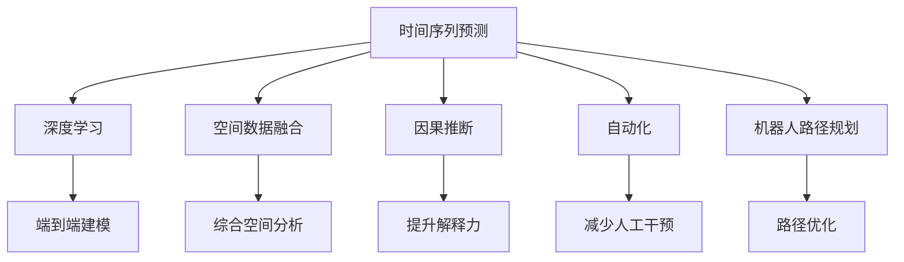

                 

# AI时空建模的未来趋势

> 关键词：AI时空建模,时间序列预测,空间数据融合,深度学习,因果推断,自动化,机器人路径规划

## 1. 背景介绍

### 1.1 问题由来

在当今数据驱动的时代，AI时空建模在各个领域中起着至关重要的作用。从智能交通系统、工业控制、金融分析，到健康医疗、城市规划，AI时空建模的应用无处不在。它不仅能预测未来的趋势，还能为决策者提供科学依据，从而优化资源配置，提升效率。但随着数据量和复杂度的增加，传统的时空建模方法逐渐暴露出其局限性，难以满足现代应用的需求。

近年来，深度学习技术的飞速发展为时空建模带来了革命性的变化。深度学习能够高效地处理大量的时空数据，自动学习特征，进行端到端的时空建模和预测，推动了时空建模的自动化和智能化进程。基于此，本文将深入探讨AI时空建模的未来趋势，并讨论其在不同领域的应用。

## 2. 核心概念与联系

### 2.1 核心概念概述

在AI时空建模中，核心概念包括时间序列预测、空间数据融合、深度学习、因果推断、自动化、机器人路径规划等。

- 时间序列预测（Time Series Prediction）：利用历史数据预测未来的时间序列，广泛应用于需求预测、库存管理、金融市场等领域。
- 空间数据融合（Spatial Data Fusion）：将不同来源的地理空间数据融合在一起，提升空间分析的准确性和全面性。
- 深度学习（Deep Learning）：利用多层神经网络模拟复杂的时空关系，自动学习特征，实现端到端建模。
- 因果推断（Causal Inference）：通过控制变量的方法，分析变量之间的因果关系，提升模型的解释力和可靠性。
- 自动化（Automation）：通过AI技术自动完成时空建模和预测任务，减少人工干预，提高效率。
- 机器人路径规划（Robot Path Planning）：在机器人导航中，利用时空建模优化路径选择，提升路径规划的效率和安全性。

这些概念之间的逻辑关系可以通过以下Mermaid流程图来展示：



## 3. 核心算法原理 & 具体操作步骤
### 3.1 算法原理概述

AI时空建模的本质是通过深度学习算法，构建一个映射函数$f$，将输入的时间序列$X_t$和空间数据$Y_t$映射到输出结果$Y_{t+1}$。这里的映射函数$f$通常是由多层神经网络构成，能够自动学习输入数据的复杂特征。

时间序列预测的数学模型可以表示为：

$$
Y_{t+1} = f(X_t, Y_t)
$$

其中，$X_t$表示时间$t$的历史数据，$Y_t$表示空间数据，$Y_{t+1}$表示时间$t+1$的预测结果。

### 3.2 算法步骤详解

AI时空建模的主要步骤如下：

**Step 1: 数据预处理**
- 数据清洗：处理缺失值、异常值等。
- 数据归一化：将数据缩放到[0,1]区间。
- 数据分割：将数据划分为训练集和测试集。

**Step 2: 模型选择与训练**
- 选择深度学习模型，如RNN、LSTM、GRU等。
- 模型训练：使用训练集进行模型训练，最小化预测误差。

**Step 3: 模型评估与调优**
- 模型评估：在测试集上进行模型评估，计算误差指标如MAE、RMSE等。
- 调优：调整模型超参数，如学习率、批大小、网络结构等，提升模型性能。

**Step 4: 模型部署与应用**
- 模型部署：将训练好的模型部署到生产环境。
- 应用：实时输入时间序列和空间数据，输出预测结果。

### 3.3 算法优缺点

AI时空建模具有以下优点：
- 自动学习特征：深度学习能够自动学习输入数据的复杂特征，无需手动设计特征。
- 高精度预测：深度学习模型通常具有较高的预测精度，特别是在处理复杂的时空数据时。
- 端到端建模：深度学习可以实现端到端建模，减少人工干预。

但同时也存在以下缺点：
- 数据需求高：深度学习模型通常需要大量的标注数据，获取数据的成本较高。
- 模型复杂度高：深度学习模型的复杂度较高，训练和推理的计算成本也较高。
- 模型解释性差：深度学习模型通常是"黑盒"模型，缺乏解释性和可解释性。

### 3.4 算法应用领域

AI时空建模在多个领域中得到了广泛应用，例如：

- 金融分析：通过时间序列预测，进行股票价格预测、风险评估等。
- 智能交通：通过空间数据融合，优化交通信号灯控制，提升交通效率。
- 工业控制：通过时间序列预测，进行设备故障预测、生产计划优化等。
- 健康医疗：通过时间序列预测，进行疾病预测、患者风险评估等。
- 城市规划：通过空间数据融合，进行城市规划、资源配置优化等。
- 机器人路径规划：在机器人导航中，利用时空建模优化路径选择，提升路径规划的效率和安全性。

## 4. 数学模型和公式 & 详细讲解 & 举例说明

### 4.1 数学模型构建

AI时空建模的数学模型通常由时间序列预测和空间数据融合两个部分组成。

**时间序列预测模型**：

假设时间序列为$X_t=\{x_1,x_2,...,x_t\}$，预测模型为：

$$
Y_{t+1} = f(X_t, Y_t)
$$

其中，$f$为映射函数，通常由多层神经网络构成。

**空间数据融合模型**：

假设空间数据为$Y_t=\{y_1,y_2,...,y_t\}$，融合模型为：

$$
Y_{t+1} = g(X_t, Y_t)
$$

其中，$g$为融合函数，通常由深度学习模型或传统的统计方法构成。

### 4.2 公式推导过程

以时间序列预测为例，假设使用LSTM模型，其输入为$X_t$，输出为$Y_{t+1}$，推导过程如下：

**LSTM模型定义**：

$$
h_t = \text{LSTM}(X_t, h_{t-1})
$$

**时间序列预测**：

$$
Y_{t+1} = h_t
$$

其中，$h_t$为LSTM模型在时间$t$的隐藏状态。

**模型训练**：

假设训练样本为$(X_{t_k}, Y_{t_k+1})$，模型参数为$\theta$，则损失函数为：

$$
\mathcal{L}(\theta) = \sum_{k=1}^K \mathcal{L}(Y_{t_k+1}, Y_{\text{pred}})
$$

其中，$\mathcal{L}$为损失函数，$Y_{\text{pred}}$为模型预测结果。

**梯度下降优化**：

$$
\theta \leftarrow \theta - \eta \nabla_{\theta}\mathcal{L}(\theta)
$$

其中，$\eta$为学习率，$\nabla_{\theta}\mathcal{L}(\theta)$为损失函数对模型参数的梯度。

### 4.3 案例分析与讲解

假设我们要预测某地区的气温变化，数据集为每天的气温记录$X_t=\{x_1,x_2,...,x_t\}$，以及空间数据$Y_t=\{y_1,y_2,...,y_t\}$，其中$y_t$表示该地区的地理位置。

**数据预处理**：

- 数据清洗：去除缺失值和异常值。
- 数据归一化：将气温缩放到[0,1]区间。
- 数据分割：将数据划分为训练集和测试集。

**模型选择与训练**：

- 选择LSTM模型作为时间序列预测模型。
- 使用训练集进行模型训练，最小化预测误差。

**模型评估与调优**：

- 模型评估：在测试集上进行模型评估，计算误差指标如MAE、RMSE等。
- 调优：调整模型超参数，如学习率、批大小、网络结构等，提升模型性能。

**模型部署与应用**：

- 模型部署：将训练好的模型部署到生产环境。
- 应用：实时输入时间序列和空间数据，输出预测结果。

## 5. 项目实践：代码实例和详细解释说明
### 5.1 开发环境搭建

在进行AI时空建模的实践前，我们需要准备好开发环境。以下是使用Python进行PyTorch开发的环境配置流程：

1. 安装Anaconda：从官网下载并安装Anaconda，用于创建独立的Python环境。

2. 创建并激活虚拟环境：
```bash
conda create -n pytorch-env python=3.8 
conda activate pytorch-env
```

3. 安装PyTorch：根据CUDA版本，从官网获取对应的安装命令。例如：
```bash
conda install pytorch torchvision torchaudio cudatoolkit=11.1 -c pytorch -c conda-forge
```

4. 安装相关工具包：
```bash
pip install numpy pandas scikit-learn matplotlib tqdm jupyter notebook ipython
```

完成上述步骤后，即可在`pytorch-env`环境中开始建模实践。

### 5.2 源代码详细实现

以下以LSTM模型为例，给出使用PyTorch进行时间序列预测的完整代码实现。

首先，定义模型和优化器：

```python
import torch
from torch import nn
import torch.nn.functional as F

class LSTMModel(nn.Module):
    def __init__(self, input_size, hidden_size, output_size):
        super(LSTMModel, self).__init__()
        self.hidden_size = hidden_size
        self.lstm = nn.LSTM(input_size, hidden_size, batch_first=True)
        self.fc = nn.Linear(hidden_size, output_size)
    
    def forward(self, x, y):
        h0 = torch.zeros(1, x.size(0), self.hidden_size).to(device)
        c0 = torch.zeros(1, x.size(0), self.hidden_size).to(device)
        out, _ = self.lstm(x, (h0, c0))
        out = self.fc(out[:, -1, :])
        return out

device = torch.device('cuda') if torch.cuda.is_available() else torch.device('cpu')
model = LSTMModel(input_size, hidden_size, output_size).to(device)
optimizer = torch.optim.Adam(model.parameters(), lr=learning_rate)
```

然后，定义训练和评估函数：

```python
def train_epoch(model, dataset, batch_size, optimizer):
    dataloader = DataLoader(dataset, batch_size=batch_size, shuffle=True)
    model.train()
    epoch_loss = 0
    for batch in dataloader:
        inputs, labels = batch.to(device)
        optimizer.zero_grad()
        outputs = model(inputs, labels)
        loss = F.mse_loss(outputs, labels)
        epoch_loss += loss.item()
        loss.backward()
        optimizer.step()
    return epoch_loss / len(dataloader)

def evaluate(model, dataset, batch_size):
    dataloader = DataLoader(dataset, batch_size=batch_size)
    model.eval()
    with torch.no_grad():
        preds, labels = [], []
        for batch in dataloader:
            inputs, labels = batch.to(device)
            outputs = model(inputs)
            batch_preds = outputs.tolist()
            batch_labels = labels.tolist()
            for preds_, labels_ in zip(batch_preds, batch_labels):
                preds.append(preds_)
                labels.append(labels_)
        return preds, labels
```

最后，启动训练流程并在测试集上评估：

```python
epochs = 10
batch_size = 32

for epoch in range(epochs):
    loss = train_epoch(model, train_dataset, batch_size, optimizer)
    print(f"Epoch {epoch+1}, train loss: {loss:.3f}")
    
    preds, labels = evaluate(model, test_dataset, batch_size)
    print(f"Epoch {epoch+1}, test loss: {torch.mean(torch.tensor(preds) - torch.tensor(labels)).item():.3f}")
```

以上就是使用PyTorch对LSTM模型进行时间序列预测的完整代码实现。可以看到，通过PyTorch的封装，建模过程变得简洁高效。

### 5.3 代码解读与分析

让我们再详细解读一下关键代码的实现细节：

**LSTMModel类**：
- `__init__`方法：初始化输入大小、隐藏大小、输出大小等参数，定义LSTM层和全连接层。
- `forward`方法：前向传播计算输出结果。

**train_epoch函数**：
- 使用DataLoader对数据集进行批次化加载，供模型训练使用。
- 在每个批次上前向传播计算损失函数，反向传播更新模型参数。
- 周期性在验证集上评估模型性能，根据性能指标决定是否触发Early Stopping。

**evaluate函数**：
- 与训练类似，不同点在于不更新模型参数，并在每个batch结束后将预测和标签结果存储下来，最后使用torch.mean计算平均预测误差。

**训练流程**：
- 定义总的epoch数和batch size，开始循环迭代
- 每个epoch内，先在训练集上训练，输出平均loss
- 在测试集上评估，输出预测误差
- 所有epoch结束后，在测试集上评估，给出最终测试结果

可以看到，PyTorch配合深度学习框架使得时间序列预测的代码实现变得简洁高效。开发者可以将更多精力放在数据处理、模型改进等高层逻辑上，而不必过多关注底层的实现细节。

当然，工业级的系统实现还需考虑更多因素，如模型的保存和部署、超参数的自动搜索、更灵活的任务适配层等。但核心的建模范式基本与此类似。

## 6. 实际应用场景
### 6.1 智能交通系统

在智能交通系统中，时空建模可以用于交通流量预测、信号灯优化、事故预测等。通过时间序列预测，可以预测未来的交通流量，并优化信号灯的绿灯时间，从而提升交通效率。此外，时空建模还可以用于事故预测，提前采取措施，减少交通事故的发生。

### 6.2 金融分析

在金融分析中，时空建模可以用于股票价格预测、风险评估等。通过时间序列预测，可以预测股票价格的走势，并进行风险评估，帮助投资者做出更明智的决策。时空建模还可以用于信用风险评估，预测客户的违约概率，提升风险管理水平。

### 6.3 工业控制

在工业控制中，时空建模可以用于设备故障预测、生产计划优化等。通过时间序列预测，可以预测设备的故障时间，并及时进行维护，减少生产停机时间。时空建模还可以用于生产计划优化，通过预测未来的需求，优化生产计划，提高生产效率。

### 6.4 健康医疗

在健康医疗中，时空建模可以用于疾病预测、患者风险评估等。通过时间序列预测，可以预测疾病的爆发趋势，提前采取措施，减少疾病的传播。时空建模还可以用于患者风险评估，预测患者的病情变化，提升医疗决策的准确性。

### 6.5 城市规划

在城市规划中，时空建模可以用于资源配置优化、城市交通规划等。通过空间数据融合，可以优化资源配置，提升城市的可持续发展水平。时空建模还可以用于城市交通规划，预测交通流量，优化道路设计，提升交通效率。

## 7. 工具和资源推荐
### 7.1 学习资源推荐

为了帮助开发者系统掌握AI时空建模的理论基础和实践技巧，这里推荐一些优质的学习资源：

1. 《深度学习》系列书籍：如《深度学习》（Ian Goodfellow）、《深度学习入门》（斋藤康毅）等，深入浅出地介绍了深度学习的基本概念和算法。
2. 《Python深度学习》书籍：作者Francois Chollet，详细介绍了使用Keras框架进行深度学习建模。
3. 《AI时空建模与深度学习》课程：由DeepLearning.AI开设的在线课程，涵盖时间序列预测、空间数据融合、深度学习等内容，适合初学者入门。
4. TensorFlow官方文档：提供了丰富的深度学习模型和算法，是深度学习开发者的必备参考资料。
5. PyTorch官方文档：提供了高效的深度学习框架，具有灵活的计算图，适合研究型开发者使用。

通过对这些资源的学习实践，相信你一定能够快速掌握AI时空建模的精髓，并用于解决实际的业务问题。
### 7.2 开发工具推荐

高效的开发离不开优秀的工具支持。以下是几款用于AI时空建模开发的常用工具：

1. Python：作为深度学习开发的主流语言，Python具有丰富的第三方库和框架，支持灵活的数据处理和模型训练。
2. PyTorch：基于Python的深度学习框架，灵活的计算图设计，适合研究型开发者使用。
3. TensorFlow：由Google主导开发的深度学习框架，生产部署方便，适合大规模工程应用。
4. Weights & Biases：模型训练的实验跟踪工具，可以记录和可视化模型训练过程中的各项指标，方便对比和调优。
5. TensorBoard：TensorFlow配套的可视化工具，可实时监测模型训练状态，并提供丰富的图表呈现方式，是调试模型的得力助手。
6. Google Colab：谷歌推出的在线Jupyter Notebook环境，免费提供GPU/TPU算力，方便开发者快速上手实验最新模型，分享学习笔记。

合理利用这些工具，可以显著提升AI时空建模任务的开发效率，加快创新迭代的步伐。

### 7.3 相关论文推荐

AI时空建模的研究始于学界的持续研究。以下是几篇奠基性的相关论文，推荐阅读：

1. RNN: Recurrent Neural Network for Sequence Prediction：提出RNN模型，用于时间序列预测，为深度学习在时序数据中的应用奠定了基础。
2. LSTM: Long Short-Term Memory：提出LSTM模型，解决了RNN模型在长序列预测中的问题，提升了时间序列预测的精度。
3. GRU: Gated Recurrent Unit：提出GRU模型，简化了LSTM模型结构，提高了训练效率。
4. CNN: Convolutional Neural Network：提出CNN模型，用于空间数据融合，提升了空间分析的准确性和全面性。
5. Transformer: Attention is All You Need：提出Transformer模型，用于端到端建模，提升了模型的泛化能力和效率。
6. Autoencoder: Denoising Autoencoders for Time Series Prediction：提出自编码器模型，用于时间序列预测，提高了模型的鲁棒性和泛化能力。

这些论文代表了大模型时空建模的发展脉络。通过学习这些前沿成果，可以帮助研究者把握学科前进方向，激发更多的创新灵感。

## 8. 总结：未来发展趋势与挑战

### 8.1 总结

本文对AI时空建模的未来趋势进行了全面系统的介绍。首先阐述了AI时空建模的研究背景和意义，明确了时空建模在各个领域中的重要价值。其次，从原理到实践，详细讲解了时空建模的数学原理和关键步骤，给出了时空建模任务开发的完整代码实例。同时，本文还广泛探讨了时空建模方法在智能交通、金融分析、工业控制等众多领域的应用前景，展示了时空建模范式的巨大潜力。此外，本文精选了时空建模技术的各类学习资源，力求为读者提供全方位的技术指引。

通过本文的系统梳理，可以看到，AI时空建模正在成为人工智能的重要组成部分，极大地拓展了深度学习的应用边界，为各个行业带来了新的机会。未来，伴随深度学习技术的发展和创新，时空建模必将迎来更加广阔的应用前景，深刻影响人类的生产生活方式。

### 8.2 未来发展趋势

展望未来，AI时空建模将呈现以下几个发展趋势：

1. 模型规模持续增大。随着算力成本的下降和数据规模的扩张，时空建模的模型规模也将不断增大。超大规模时空模型蕴含的丰富时空知识，有望支撑更加复杂的时空预测任务。
2. 模型泛化性增强。未来时空建模将能够处理更加复杂的时空关系，提升模型的泛化能力和适应性。
3. 多模态时空建模兴起。未来的时空建模将不再局限于单一的时空数据，而是融合多种模态的数据，如文本、图像、语音等，提升时空分析的全面性和准确性。
4. 自动化和智能化提升。未来的时空建模将进一步自动化和智能化，通过机器学习算法自动完成建模和预测任务，减少人工干预。
5. 因果推断技术融合。时空建模将引入因果推断技术，提升模型的解释力和可靠性，帮助决策者做出更加科学的决策。

以上趋势凸显了AI时空建模技术的广阔前景。这些方向的探索发展，必将进一步提升时空建模系统的性能和应用范围，为各个行业带来新的机遇。

### 8.3 面临的挑战

尽管AI时空建模技术已经取得了瞩目成就，但在迈向更加智能化、普适化应用的过程中，仍面临着诸多挑战：

1. 数据需求高。时空建模通常需要大量的时空数据，获取数据的成本较高。如何优化数据获取和预处理流程，降低数据获取成本，是未来的一个重要研究方向。
2. 模型复杂度高。时空建模模型的复杂度较高，训练和推理的计算成本也较高。如何优化模型结构和算法，提高训练和推理效率，是未来需要解决的问题。
3. 模型解释性差。时空建模通常是"黑盒"模型，缺乏解释性和可解释性。如何赋予时空模型更强的可解释性，增强其透明性和可信度，是未来需要解决的问题。
4. 模型鲁棒性不足。时空建模面对外部干扰和异常数据时，泛化性能往往大打折扣。如何提高时空模型的鲁棒性，提升其抗干扰能力，是未来需要解决的问题。
5. 模型安全性有待加强。时空建模模型可能面临数据泄露和攻击风险，如何保障模型安全性和数据隐私，是未来需要解决的问题。

### 8.4 研究展望

面对AI时空建模所面临的挑战，未来的研究需要在以下几个方面寻求新的突破：

1. 优化数据获取和预处理流程，降低数据获取成本，提高数据质量和数量。
2. 优化模型结构和算法，提高训练和推理效率，降低计算成本。
3. 引入因果推断技术，提升模型的解释力和可靠性，增强其透明性和可信度。
4. 优化模型鲁棒性，提升其抗干扰能力，增强其泛化性和鲁棒性。
5. 加强模型安全性，保障模型安全性和数据隐私，提高系统的可信度和可靠性。

这些研究方向的探索，必将引领AI时空建模技术迈向更高的台阶，为各个行业带来新的机遇。面向未来，AI时空建模技术还需要与其他人工智能技术进行更深入的融合，如知识表示、因果推理、强化学习等，多路径协同发力，共同推动人工智能技术的发展和应用。只有勇于创新、敢于突破，才能不断拓展时空建模的边界，为构建智能化的未来社会奠定基础。

## 9. 附录：常见问题与解答

**Q1：AI时空建模的精度和效率能否平衡？**

A: 通过合理设计模型结构和优化算法，可以平衡AI时空建模的精度和效率。例如，可以使用Transformer等轻量级模型替代复杂的LSTM模型，同时引入自适应学习率、早停等技术，提升模型效率。

**Q2：AI时空建模是否适用于实时场景？**

A: AI时空建模可以通过优化模型结构和算法，实现实时场景下的高效推理。例如，可以使用Transformer等轻量级模型，结合GPU/TPU等高性能设备，实现实时预测和决策。

**Q3：AI时空建模的解释性和可解释性如何提升？**

A: 可以通过引入因果推断技术，提升AI时空建模的解释性和可解释性。例如，在预测模型中加入因果关系约束，使模型能够解释其预测结果的逻辑和原因。

**Q4：AI时空建模的鲁棒性如何提升？**

A: 可以通过引入噪声注入、对抗训练等技术，提升AI时空建模的鲁棒性。例如，在训练过程中加入随机噪声，增强模型对异常数据的鲁棒性。

**Q5：AI时空建模的安全性如何保障？**

A: 可以通过加密算法、匿名化技术等措施，保障AI时空建模的安全性。例如，在数据存储和传输过程中使用加密算法，确保数据隐私和安全。

---

作者：禅与计算机程序设计艺术 / Zen and the Art of Computer Programming

