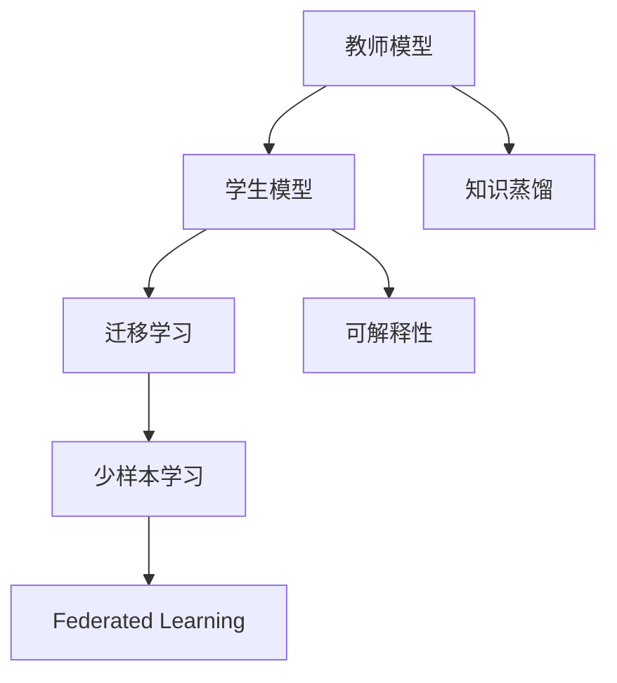

                 

# AI模型的知识蒸馏与迁移学习

> 关键词：知识蒸馏, 迁移学习, 教师模型, 学生模型, 自适应, 模型压缩, 少样本学习, 联邦学习, 可解释性

## 1. 背景介绍

### 1.1 问题由来
随着人工智能技术的不断进步，深度学习模型在各种任务中展现出了强大的能力。然而，这些模型的参数量巨大，训练过程复杂，对于数据和计算资源的要求也极为严格。为了解决这些问题，知识蒸馏和迁移学习成为近年来深度学习领域的热门研究方向。

知识蒸馏（Knowledge Distillation）是一种模型压缩技术，通过训练一个较小的模型（称为学生模型）来模仿一个较大的模型（称为教师模型）的输出，从而实现模型压缩和性能提升的目的。而迁移学习（Transfer Learning）则是一种模型适配技术，通过将一个预训练模型的知识迁移到新的任务上，减少从头训练所需的计算资源和时间。

### 1.2 问题核心关键点
知识蒸馏和迁移学习虽然目标不同，但它们都可以看作是一种“知识传递”的过程。通过这种方式，可以在保持模型性能的同时，显著减少其计算成本，使其能够更好地应用于实际生产环境中。

在知识蒸馏中，教师模型用于指导学生模型的训练，而迁移学习则是利用预训练模型的知识来提升新任务上的性能。两者相结合，可以实现高效模型压缩和快速任务适配，提升AI技术的落地能力。

### 1.3 问题研究意义
研究知识蒸馏和迁移学习，对于推动AI技术的产业化应用，提升模型的可解释性和鲁棒性，减少训练成本，具有重要意义：

1. **模型压缩与优化**：通过知识蒸馏和迁移学习，可以将大规模复杂模型压缩为轻量级模型，减少内存占用和计算开销，使模型能够更好地适配资源受限的设备。
2. **提升模型性能**：通过迁移学习，可以利用预训练模型的知识，快速适应新任务，减少从头训练所需的时间和数据量，提升模型在新任务上的表现。
3. **增强模型可解释性**：知识蒸馏和迁移学习可以使模型结构更简单，参数更少，从而更容易理解和解释模型的行为。
4. **降低训练成本**：利用预训练模型，可以减少从头训练所需的计算资源和数据量，大幅降低模型训练的成本。
5. **促进产业升级**：通过优化模型结构，提升模型性能，加速AI技术在各行业中的应用，推动产业升级和技术创新。

## 2. 核心概念与联系

### 2.1 核心概念概述

为更好地理解知识蒸馏与迁移学习的原理和应用，本节将介绍几个核心概念及其之间的联系：

- **知识蒸馏（Knowledge Distillation）**：通过训练一个小模型来模拟大模型的行为，从而在保持模型性能的同时减少参数量，实现模型压缩。
- **迁移学习（Transfer Learning）**：将一个预训练模型的知识迁移到新任务上，减少新任务从头训练所需的计算资源和时间。
- **教师模型（Teacher Model）**：用于指导学生模型训练的大模型，其行为和决策逻辑是知识蒸馏和迁移学习的核心。
- **学生模型（Student Model）**：通过知识蒸馏或迁移学习获得的较小模型，通常具有更高的计算效率和更小的内存占用。
- **自适应（Adaptive）**：指模型能够根据不同数据集的特点，动态调整自身的参数和结构，以适应不同的应用场景。
- **模型压缩（Model Compression）**：通过技术手段减少模型的参数量和计算量，提升模型的运行效率和适应能力。
- **少样本学习（Few-shot Learning）**：指模型在只有少量标注样本的情况下，仍然能够快速学习并完成新任务的能力。
- **联邦学习（Federated Learning）**：一种分布式机器学习技术，多个本地模型在不共享数据的前提下，协同训练出一个全局模型。
- **可解释性（Explainability）**：指模型能够提供透明和可理解的决策过程，帮助用户理解和信任模型行为。

这些核心概念之间存在紧密的联系，通过知识蒸馏和迁移学习，可以使模型更加自适应和高效，同时提升模型的可解释性和鲁棒性，从而更好地适应实际应用需求。

### 2.2 核心概念原理和架构的 Mermaid 流程图



这个流程图展示了知识蒸馏、迁移学习、少样本学习、联邦学习和可解释性之间的关系。教师模型通过知识蒸馏或迁移学习指导学生模型的训练，而学生模型可以通过少样本学习和联邦学习进一步提升性能。同时，可解释性也是这些技术的重要考量因素之一。

## 3. 核心算法原理 & 具体操作步骤

### 3.1 算法原理概述

知识蒸馏和迁移学习的核心原理都是通过“知识传递”来优化模型。知识蒸馏通过将教师模型的知识传递给学生模型，减少其计算量和内存占用，同时保持模型性能。迁移学习则是利用预训练模型的知识，减少新任务训练所需的计算资源和时间。

### 3.2 算法步骤详解

#### 3.2.1 知识蒸馏（Knowledge Distillation）

1. **选择教师模型**：选择一个大规模预训练模型作为教师模型，如BERT、GPT等。
2. **设计知识蒸馏目标**：设计知识蒸馏目标函数，如最大似然估计、交叉熵等，确保学生模型能够模仿教师模型的行为。
3. **训练学生模型**：使用教师模型的输出作为标签，训练学生模型，使其在相同的数据集上获得与教师模型相近的输出。
4. **验证与调整**：通过验证集评估学生模型的性能，根据评估结果调整训练参数，如学习率、迭代次数等。

#### 3.2.2 迁移学习（Transfer Learning）

1. **选择预训练模型**：选择一个在大规模数据集上预训练的模型，如BERT、GPT等。
2. **适配任务**：将预训练模型适配到新的任务上，通过微调或重新训练等方法，调整模型的输出层或解码器，使其适用于新任务。
3. **迁移学习训练**：使用新任务的标注数据，对适配后的模型进行有监督的微调或重新训练。
4. **评估与优化**：在新任务的测试集上评估迁移后的模型性能，根据评估结果调整模型参数，如学习率、正则化系数等。

### 3.3 算法优缺点

知识蒸馏和迁移学习各自具有优缺点：

#### 知识蒸馏（Knowledge Distillation）的优缺点

**优点**：
- 减少参数量：通过知识蒸馏，可以将教师模型的复杂结构压缩为轻量级学生模型，减少内存占用和计算开销。
- 保持性能：在压缩模型的同时，学生模型通常可以保持与教师模型相近的性能。
- 提高可解释性：由于模型参数量减少，模型结构更简单，更容易理解和解释模型的行为。

**缺点**：
- 训练复杂：知识蒸馏需要精心设计知识蒸馏目标和训练策略，寻找合适的平衡点，以确保学生模型能够准确地模仿教师模型。
- 数据依赖：知识蒸馏的效果很大程度上依赖于教师模型的表现，如果教师模型训练数据较少或偏差较大，学生模型的性能也可能受到影响。

#### 迁移学习（Transfer Learning）的优缺点

**优点**：
- 快速适配：通过迁移学习，可以利用预训练模型的知识，快速适应新任务，减少从头训练所需的时间和数据量。
- 泛化能力强：迁移学习模型通常具有更强的泛化能力，能够在不同数据集上获得较好的性能。
- 减少资源消耗：利用预训练模型的知识，可以避免从头训练所需的计算资源和数据量，降低训练成本。

**缺点**：
- 数据分布差异：当新任务的分布与预训练数据差异较大时，迁移学习的效果可能下降。
- 领域特定知识限制：迁移学习通常只能利用预训练模型中与新任务相关的知识，对于新领域的新知识可能无法充分利用。
- 可解释性不足：迁移学习模型通常结构复杂，参数较多，难以解释模型的决策过程。

### 3.4 算法应用领域

知识蒸馏和迁移学习已经在多个领域得到了广泛应用，包括但不限于：

- **自然语言处理（NLP）**：在文本分类、情感分析、机器翻译等任务上，利用知识蒸馏和迁移学习提升模型性能。
- **计算机视觉（CV）**：在图像分类、目标检测、图像生成等任务上，利用知识蒸馏和迁移学习减少模型计算量，提升识别准确率。
- **医疗健康**：在疾病诊断、基因分析、药物研发等任务上，利用知识蒸馏和迁移学习提升模型可靠性和泛化能力。
- **金融领域**：在风险评估、股票预测、信用评分等任务上，利用知识蒸馏和迁移学习优化模型决策。
- **智能制造**：在生产过程优化、质量控制、设备维护等任务上，利用知识蒸馏和迁移学习提升模型适应性和鲁棒性。

## 4. 数学模型和公式 & 详细讲解 & 举例说明

### 4.1 数学模型构建

知识蒸馏和迁移学习的数学模型构建主要基于两种目标函数：

- **知识蒸馏目标函数**：
$$
\mathcal{L}_{KD} = \mathcal{L}_{\text{KL}}(\mathcal{P}^T, \mathcal{P}^S) + \mathcal{L}_{\text{SL}}(\mathcal{P}^T, \mathcal{P}^S)
$$
其中 $\mathcal{P}^T$ 和 $\mathcal{P}^S$ 分别表示教师模型和学生模型的预测分布，$\mathcal{L}_{\text{KL}}$ 和 $\mathcal{L}_{\text{SL}}$ 分别表示KL散度和剩余度（Surrogate Loss）。

- **迁移学习目标函数**：
$$
\mathcal{L}_{TL} = \mathcal{L}_{\text{Class}}(\theta^T, D^T) + \mathcal{L}_{\text{Class}}(\theta^S, D^S)
$$
其中 $\theta^T$ 和 $\theta^S$ 分别表示教师模型和学生模型的参数，$D^T$ 和 $D^S$ 分别表示教师模型的训练集和学生模型的目标任务数据集，$\mathcal{L}_{\text{Class}}$ 表示分类损失函数，如交叉熵损失。

### 4.2 公式推导过程

#### 4.2.1 知识蒸馏的公式推导

知识蒸馏的目标是通过学生模型 $\mathcal{P}^S$ 来拟合教师模型 $\mathcal{P}^T$ 的输出。常见的知识蒸馏目标函数包括KL散度和剩余度：

1. **KL散度（KL Divergence）**：
$$
\mathcal{L}_{\text{KL}}(\mathcal{P}^T, \mathcal{P}^S) = -\sum_{i} \mathcal{P}^T_i \log \mathcal{P}^S_i
$$
其中 $\mathcal{P}^T_i$ 和 $\mathcal{P}^S_i$ 分别表示教师模型和学生模型在样本 $i$ 上的预测概率。

2. **剩余度（Surrogate Loss）**：
$$
\mathcal{L}_{\text{SL}}(\mathcal{P}^T, \mathcal{P}^S) = \mathcal{L}(\mathcal{P}^T, y) - \mathcal{L}(\mathcal{P}^S, y)
$$
其中 $\mathcal{L}$ 表示数据集 $D$ 上的损失函数，$y$ 表示数据集 $D$ 上的真实标签。

#### 4.2.2 迁移学习的公式推导

迁移学习的目标是通过微调学生模型 $\theta^S$ 来适配新任务 $D^S$，同时利用教师模型 $\theta^T$ 的知识。常见的迁移学习目标函数包括交叉熵损失和分类损失：

1. **交叉熵损失（Cross-Entropy Loss）**：
$$
\mathcal{L}_{\text{Class}}(\theta^T, D^T) = -\frac{1}{N} \sum_{i=1}^N \sum_{c=1}^C y_{i,c} \log \sigma(\mathbf{W}^T_{i,c} \mathbf{h}_i)
$$
其中 $\mathbf{h}_i$ 表示样本 $i$ 的输入表示，$\mathbf{W}^T_{i,c}$ 表示教师模型的输出层权重，$\sigma$ 表示softmax函数。

2. **分类损失（Classification Loss）**：
$$
\mathcal{L}_{\text{Class}}(\theta^S, D^S) = -\frac{1}{N} \sum_{i=1}^N \sum_{c=1}^C y_{i,c} \log \sigma(\mathbf{W}^S_{i,c} \mathbf{h}_i)
$$
其中 $\mathbf{W}^S_{i,c}$ 表示学生模型的输出层权重。

### 4.3 案例分析与讲解

#### 4.3.1 知识蒸馏案例分析

以文本分类任务为例，使用BERT作为教师模型，进行知识蒸馏：

1. **数据准备**：准备一个大规模文本分类数据集，如IMDB电影评论数据集。
2. **模型初始化**：使用BERT作为教师模型，将其输出作为标签进行知识蒸馏。
3. **学生模型训练**：使用教师模型的输出作为标签，训练一个轻量级BERT模型（学生模型），以最小化KL散度损失和剩余度损失。
4. **评估与调整**：在新数据集上评估学生模型的性能，根据评估结果调整训练参数，如学习率、迭代次数等。

#### 4.3.2 迁移学习案例分析

以图像分类任务为例，使用ResNet作为教师模型，进行迁移学习：

1. **数据准备**：准备一个大规模图像分类数据集，如ImageNet数据集。
2. **模型初始化**：使用ResNet作为教师模型，将其输出作为标签进行迁移学习。
3. **适配新任务**：对ResNet的顶层解码器进行微调，适配新任务的分类目标。
4. **迁移学习训练**：使用新任务的标注数据，对适配后的模型进行有监督的微调或重新训练。
5. **评估与优化**：在新任务的测试集上评估迁移后的模型性能，根据评估结果调整模型参数，如学习率、正则化系数等。

## 5. 项目实践：代码实例和详细解释说明

### 5.1 开发环境搭建

在进行知识蒸馏和迁移学习实践前，我们需要准备好开发环境。以下是使用Python进行PyTorch开发的环境配置流程：

1. 安装Anaconda：从官网下载并安装Anaconda，用于创建独立的Python环境。

2. 创建并激活虚拟环境：
```bash
conda create -n pytorch-env python=3.8 
conda activate pytorch-env
```

3. 安装PyTorch：根据CUDA版本，从官网获取对应的安装命令。例如：
```bash
conda install pytorch torchvision torchaudio cudatoolkit=11.1 -c pytorch -c conda-forge
```

4. 安装Transformers库：
```bash
pip install transformers
```

5. 安装各类工具包：
```bash
pip install numpy pandas scikit-learn matplotlib tqdm jupyter notebook ipython
```

完成上述步骤后，即可在`pytorch-env`环境中开始知识蒸馏和迁移学习的实践。

### 5.2 源代码详细实现

下面我们以迁移学习为例，给出使用Transformers库对BERT模型进行迁移学习的PyTorch代码实现。

首先，定义迁移学习任务的数据处理函数：

```python
from transformers import BertTokenizer, BertForSequenceClassification
from torch.utils.data import Dataset
import torch

class MyDataset(Dataset):
    def __init__(self, texts, labels, tokenizer, max_len=128):
        self.texts = texts
        self.labels = labels
        self.tokenizer = tokenizer
        self.max_len = max_len
        
    def __len__(self):
        return len(self.texts)
    
    def __getitem__(self, item):
        text = self.texts[item]
        label = self.labels[item]
        
        encoding = self.tokenizer(text, return_tensors='pt', max_length=self.max_len, padding='max_length', truncation=True)
        input_ids = encoding['input_ids'][0]
        attention_mask = encoding['attention_mask'][0]
        
        # 将标签转换为独热编码
        encoded_labels = [0 if label == 0 else 1]
        labels = torch.tensor(encoded_labels, dtype=torch.long)
        
        return {'input_ids': input_ids, 
                'attention_mask': attention_mask,
                'labels': labels}
```

然后，定义迁移学习任务的目标函数：

```python
from transformers import AdamW

model = BertForSequenceClassification.from_pretrained('bert-base-uncased', num_labels=2)
optimizer = AdamW(model.parameters(), lr=2e-5)

device = torch.device('cuda') if torch.cuda.is_available() else torch.device('cpu')
model.to(device)
```

接着，定义迁移学习任务的目标函数和训练函数：

```python
from torch.utils.data import DataLoader
from tqdm import tqdm

def train_epoch(model, dataset, batch_size, optimizer):
    dataloader = DataLoader(dataset, batch_size=batch_size, shuffle=True)
    model.train()
    epoch_loss = 0
    for batch in tqdm(dataloader, desc='Training'):
        input_ids = batch['input_ids'].to(device)
        attention_mask = batch['attention_mask'].to(device)
        labels = batch['labels'].to(device)
        model.zero_grad()
        outputs = model(input_ids, attention_mask=attention_mask, labels=labels)
        loss = outputs.loss
        epoch_loss += loss.item()
        loss.backward()
        optimizer.step()
    return epoch_loss / len(dataloader)

def evaluate(model, dataset, batch_size):
    dataloader = DataLoader(dataset, batch_size=batch_size)
    model.eval()
    preds, labels = [], []
    with torch.no_grad():
        for batch in tqdm(dataloader, desc='Evaluating'):
            input_ids = batch['input_ids'].to(device)
            attention_mask = batch['attention_mask'].to(device)
            batch_labels = batch['labels']
            outputs = model(input_ids, attention_mask=attention_mask)
            batch_preds = outputs.logits.argmax(dim=1).to('cpu').tolist()
            batch_labels = batch_labels.to('cpu').tolist()
            for pred, label in zip(batch_preds, batch_labels):
                preds.append(pred)
                labels.append(label)
                
    print(classification_report(labels, preds))
```

最后，启动迁移学习训练流程并在测试集上评估：

```python
epochs = 5
batch_size = 16

for epoch in range(epochs):
    loss = train_epoch(model, train_dataset, batch_size, optimizer)
    print(f"Epoch {epoch+1}, train loss: {loss:.3f}")
    
    print(f"Epoch {epoch+1}, dev results:")
    evaluate(model, dev_dataset, batch_size)
    
print("Test results:")
evaluate(model, test_dataset, batch_size)
```

以上就是使用PyTorch对BERT进行迁移学习的完整代码实现。可以看到，得益于Transformers库的强大封装，我们可以用相对简洁的代码完成迁移学习的任务适配。

### 5.3 代码解读与分析

让我们再详细解读一下关键代码的实现细节：

**MyDataset类**：
- `__init__`方法：初始化文本、标签、分词器等关键组件。
- `__len__`方法：返回数据集的样本数量。
- `__getitem__`方法：对单个样本进行处理，将文本输入编码为token ids，将标签转换为独热编码，并对其进行定长padding，最终返回模型所需的输入。

**模型初始化**：
- 使用`BertForSequenceClassification`从预训练的BERT模型中加载模型，适配二分类任务。
- 初始化AdamW优化器，设置学习率等参数。
- 将模型和数据加载到GPU或CPU上，进行前向传播和反向传播。

**训练和评估函数**：
- 使用PyTorch的DataLoader对数据集进行批次化加载，供模型训练和推理使用。
- 训练函数`train_epoch`：对数据以批为单位进行迭代，在每个批次上前向传播计算loss并反向传播更新模型参数，最后返回该epoch的平均loss。
- 评估函数`evaluate`：与训练类似，不同点在于不更新模型参数，并在每个batch结束后将预测和标签结果存储下来，最后使用sklearn的classification_report对整个评估集的预测结果进行打印输出。

**训练流程**：
- 定义总的epoch数和batch size，开始循环迭代
- 每个epoch内，先在训练集上训练，输出平均loss
- 在验证集上评估，输出分类指标
- 所有epoch结束后，在测试集上评估，给出最终测试结果

可以看到，PyTorch配合Transformers库使得迁移学习的代码实现变得简洁高效。开发者可以将更多精力放在数据处理、模型改进等高层逻辑上，而不必过多关注底层的实现细节。

当然，工业级的系统实现还需考虑更多因素，如模型的保存和部署、超参数的自动搜索、更灵活的任务适配层等。但核心的迁移学习范式基本与此类似。

## 6. 实际应用场景
### 6.1 智能推荐系统

基于迁移学习的大规模预训练模型，可以广泛应用于智能推荐系统，提升推荐结果的准确性和多样性。通过迁移学习，利用大规模预训练模型的知识，可以减少推荐模型的训练时间和计算成本，同时提升模型在新数据上的泛化能力。

在技术实现上，可以收集用户的行为数据（如浏览、点击、评分等），利用大规模预训练模型进行迁移学习，训练出能够准确预测用户偏好的推荐模型。利用迁移学习，可以大大降低推荐模型训练的难度和成本，同时提高模型的性能。

### 6.2 医疗影像分析

在医疗影像分析中，大规模预训练模型可以作为教师模型，帮助训练学生模型，提升模型对医学影像的诊断准确性。通过迁移学习，可以充分利用大规模预训练模型的先验知识，减少新任务从头训练所需的计算资源和时间，同时提升模型的泛化能力。

在技术实现上，可以收集医疗影像数据，利用大规模预训练模型进行迁移学习，训练出能够准确识别和分类医学影像的学生模型。利用迁移学习，可以大大提升医学影像诊断的准确性和可靠性。

### 6.3 金融风险管理

在金融风险管理中，大规模预训练模型可以作为教师模型，帮助训练学生模型，提升模型对金融市场风险的预测准确性。通过迁移学习，可以充分利用大规模预训练模型的先验知识，减少新任务从头训练所需的计算资源和时间，同时提升模型的泛化能力。

在技术实现上，可以收集金融市场数据，利用大规模预训练模型进行迁移学习，训练出能够准确预测金融市场风险的学生模型。利用迁移学习，可以大大提升金融市场风险管理的准确性和可靠性。

### 6.4 未来应用展望

随着知识蒸馏和迁移学习技术的不断发展，基于这些技术的AI应用将在更多领域得到广泛应用，为各行各业带来变革性影响。

在智慧医疗领域，基于迁移学习的大规模预训练模型将提升医疗影像诊断的准确性和可靠性，帮助医生更好地进行疾病诊断和治疗决策。

在智能推荐系统领域，基于迁移学习的大规模预训练模型将提升推荐结果的准确性和多样性，为用户提供更加个性化、精准的推荐服务。

在金融风险管理领域，基于迁移学习的大规模预训练模型将提升金融市场风险预测的准确性和可靠性，帮助金融机构更好地进行风险控制和资产管理。

此外，在智慧城市、智能制造、智慧教育等多个领域，基于知识蒸馏和迁移学习的大规模预训练模型也将不断涌现，为各行各业带来新的技术突破。

## 7. 工具和资源推荐
### 7.1 学习资源推荐

为了帮助开发者系统掌握知识蒸馏与迁移学习的理论基础和实践技巧，这里推荐一些优质的学习资源：

1. 《Knowledge Distillation: A Survey》论文：介绍了知识蒸馏技术的理论基础和实践方法，是研究知识蒸馏的必读文献。

2. 《Transfer Learning with Deep Learning: A Review》论文：总结了迁移学习的理论基础和应用方法，是研究迁移学习的经典文献。

3. CS231n《深度学习计算机视觉》课程：斯坦福大学开设的计算机视觉明星课程，有Lecture视频和配套作业，带你入门计算机视觉领域的知识蒸馏和迁移学习。

4. 《Python Machine Learning》书籍：Python机器学习经典教材，介绍了知识蒸馏和迁移学习的实现方法，是学习知识蒸馏和迁移学习的极佳入门教材。

5. Kaggle知识蒸馏竞赛：Kaggle上定期举行的知识蒸馏竞赛，提供丰富的实际案例和算法库，帮助开发者快速上手实践。

6. PyTorch官方文档：PyTorch的官方文档，提供了丰富的知识蒸馏和迁移学习的样例代码，是学习知识蒸馏和迁移学习的必备资料。

通过对这些资源的学习实践，相信你一定能够快速掌握知识蒸馏和迁移学习的精髓，并用于解决实际的AI问题。
###  7.2 开发工具推荐

高效的开发离不开优秀的工具支持。以下是几款用于知识蒸馏和迁移学习开发的常用工具：

1. PyTorch：基于Python的开源深度学习框架，灵活动态的计算图，适合快速迭代研究。大部分预训练语言模型都有PyTorch版本的实现。

2. TensorFlow：由Google主导开发的开源深度学习框架，生产部署方便，适合大规模工程应用。同样有丰富的预训练语言模型资源。

3. Transformers库：HuggingFace开发的NLP工具库，集成了众多SOTA语言模型，支持PyTorch和TensorFlow，是进行知识蒸馏和迁移学习开发的利器。

4. Weights & Biases：模型训练的实验跟踪工具，可以记录和可视化模型训练过程中的各项指标，方便对比和调优。与主流深度学习框架无缝集成。

5. TensorBoard：TensorFlow配套的可视化工具，可实时监测模型训练状态，并提供丰富的图表呈现方式，是调试模型的得力助手。

6. Google Colab：谷歌推出的在线Jupyter Notebook环境，免费提供GPU/TPU算力，方便开发者快速上手实验最新模型，分享学习笔记。

合理利用这些工具，可以显著提升知识蒸馏和迁移学习的开发效率，加快创新迭代的步伐。

### 7.3 相关论文推荐

知识蒸馏和迁移学习的发展源于学界的持续研究。以下是几篇奠基性的相关论文，推荐阅读：

1. Distilling the Knowledge in a Neural Network：知识蒸馏技术的开创性论文，提出了通过知识蒸馏来压缩模型的思路。

2. Fine-tuning Pretrained Embeddings for Sequence-Labeling Tasks：迁移学习的经典论文，提出了通过迁移学习来适配新任务的方法。

3. Massively Multitask Learning for Zero-shot Image Classification and Semantic Segmentation：零样本学习技术的经典论文，提出了通过迁移学习来实现零样本学习的方法。

4. Can Transformers Learn to Distill Knowledge：利用Transformer进行知识蒸馏的论文，展示了Transformer在知识蒸馏中的优异表现。

5. Towards Explainable and Robust Knowledge Distillation：可解释性知识蒸馏技术的经典论文，提出了通过知识蒸馏来提升模型可解释性的方法。

这些论文代表了大规模预训练模型知识蒸馏和迁移学习的最新进展，通过学习这些前沿成果，可以帮助研究者把握学科前进方向，激发更多的创新灵感。

## 8. 总结：未来发展趋势与挑战

### 8.1 总结

本文对知识蒸馏和迁移学习技术进行了全面系统的介绍。首先阐述了知识蒸馏和迁移学习的背景和意义，明确了知识传递在模型压缩和任务适配中的重要作用。其次，从原理到实践，详细讲解了知识蒸馏和迁移学习的数学模型和关键步骤，给出了知识蒸馏和迁移学习的完整代码实现。同时，本文还广泛探讨了知识蒸馏和迁移学习在多个领域的应用前景，展示了这些技术在提升AI模型性能和适应性方面的巨大潜力。

通过本文的系统梳理，可以看到，知识蒸馏和迁移学习作为深度学习模型的重要技术，正在成为AI模型压缩和适配的关键手段，极大地提升了AI技术的落地能力。未来，伴随知识蒸馏和迁移学习的持续演进，AI技术将能够更高效地适配新任务，更好地服务于各行各业。

### 8.2 未来发展趋势

展望未来，知识蒸馏和迁移学习技术将呈现以下几个发展趋势：

1. **模型压缩与优化**：知识蒸馏和迁移学习将继续推动模型压缩技术的发展，通过更高效的压缩算法和更轻量级的模型结构，使AI技术更好地适配资源受限的设备。

2. **自适应与泛化能力提升**：未来的知识蒸馏和迁移学习模型将更加自适应，能够动态调整参数和结构，以适应不同数据集和任务的特点，提升模型的泛化能力。

3. **少样本与联邦学习结合**：未来的知识蒸馏和迁移学习模型将结合少样本学习和联邦学习技术，在数据稀缺的情况下，仍然能够高效地适配新任务，同时保护数据隐私和安全。

4. **可解释性增强**：未来的知识蒸馏和迁移学习模型将更加注重可解释性，通过更透明和可理解的决策过程，提升用户对模型的信任和接受度。

5. **跨领域知识整合**：未来的知识蒸馏和迁移学习模型将更加注重跨领域知识的整合，通过与外部知识库、规则库等专家知识结合，形成更加全面、准确的信息整合能力。

这些趋势凸显了知识蒸馏和迁移学习技术的广阔前景。这些方向的探索发展，必将进一步提升AI模型的性能和适应性，为构建更加智能、普适的AI系统提供更强大的技术支持。

### 8.3 面临的挑战

尽管知识蒸馏和迁移学习技术已经取得了瞩目成就，但在迈向更加智能化、普适化应用的过程中，它仍面临诸多挑战：

1. **模型鲁棒性不足**：在数据分布差异较大时，知识蒸馏和迁移学习的效果可能下降，模型可能出现泛化能力不足的问题。如何提高模型的鲁棒性，避免灾难性遗忘，还需要更多理论和实践的积累。

2. **计算资源消耗大**：知识蒸馏和迁移学习模型通常参数量较大，计算资源消耗较大，难以在资源受限的设备上部署。如何通过算法优化和模型压缩，降低计算资源消耗，提升模型的实时性和适应性，将是重要的研究方向。

3. **可解释性不足**：知识蒸馏和迁移学习模型通常结构复杂，参数较多，难以解释模型的决策过程。如何赋予模型更强的可解释性，将是亟待攻克的难题。

4. **数据隐私和安全**：知识蒸馏和迁移学习模型通常需要在数据上训练，如何保护数据隐私和安全，防止模型被恶意利用，也是亟需解决的问题。

5. **训练成本高**：知识蒸馏和迁移学习模型通常需要大量的标注数据和计算资源，如何降低训练成本，提升模型训练的效率，也是值得研究的方向。

这些挑战凸显了知识蒸馏和迁移学习技术的实际应用中仍然存在的问题。未来的研究需要在这些方面寻求新的突破，才能推动知识蒸馏和迁移学习技术向更高的台阶发展。

### 8.4 研究展望

面对知识蒸馏和迁移学习所面临的种种挑战，未来的研究需要在以下几个方面寻求新的突破：

1. **探索新的压缩算法**：开发更高效的模型压缩算法，如知识蒸馏与剪枝、量化加速等，提升模型的实时性和适应性。

2. **结合多模态数据**：结合视觉、语音等多模态数据，提升知识蒸馏和迁移学习模型的泛化能力和鲁棒性。

3. **引入博弈论工具**：引入博弈论工具，通过模型训练过程中的博弈策略，提升模型的可解释性和鲁棒性。

4. **纳入伦理道德约束**：在模型训练目标中引入伦理导向的评估指标，过滤和惩罚有偏见、有害的输出倾向，确保模型的公平性和安全性。

5. **融合因果分析和强化学习**：结合因果分析和强化学习，增强模型的决策过程的可解释性和鲁棒性。

这些研究方向的探索，必将引领知识蒸馏和迁移学习技术迈向更高的台阶，为构建安全、可靠、可解释、可控的智能系统提供更强大的技术支持。面向未来，知识蒸馏和迁移学习技术还需要与其他人工智能技术进行更深入的融合，如知识表示、因果推理、强化学习等，多路径协同发力，共同推动自然语言理解和智能交互系统的进步。只有勇于创新、敢于突破，才能不断拓展知识蒸馏和迁移学习技术的边界，让智能技术更好地造福人类社会。

## 9. 附录：常见问题与解答

**Q1：知识蒸馏和迁移学习是否适用于所有任务？**

A: 知识蒸馏和迁移学习可以应用于大多数任务，特别是对于数据量较小的任务。但对于一些特定领域的任务，如医学、法律等，仅仅依靠通用语料预训练的模型可能难以很好地适应。此时需要在特定领域语料上进一步预训练，再进行知识蒸馏或迁移学习，才能获得理想效果。

**Q2：如何选择教师模型和学生模型？**

A: 教师模型和学生模型的选择应考虑任务的复杂度、数据量等因素。通常选择在大规模数据集上预训练的模型作为教师模型，如BERT、GPT等。学生模型通常需要比教师模型更小，以保证计算效率和内存占用。

**Q3：如何选择合适的知识蒸馏目标和迁移学习目标？**

A: 知识蒸馏和迁移学习目标的选择应根据具体的任务和数据集来定。通常使用交叉熵损失或分类损失作为知识蒸馏或迁移学习的目标。在实际应用中，还可以通过调整目标函数的参数，如学习率、正则化系数等，来优化模型的性能。

**Q4：知识蒸馏和迁移学习在实际应用中需要注意哪些问题？**

A: 知识蒸馏和迁移学习在实际应用中需要注意以下几个问题：
1. 数据分布差异：在迁移学习中，当新任务的分布与预训练数据差异较大时，模型的性能可能下降。
2. 数据隐私和安全：在知识蒸馏和迁移学习中，需要保护数据隐私和安全，防止模型被恶意利用。
3. 计算资源消耗：知识蒸馏和迁移学习模型通常参数量较大，计算资源消耗较大，需要优化算法和模型结构，提升模型的实时性和适应性。
4. 模型鲁棒性：在数据分布差异较大时，模型的泛化性能可能下降，需要提高模型的鲁棒性，避免灾难性遗忘。

这些问题是知识蒸馏和迁移学习在实际应用中需要注意的关键点，需要通过持续的研究和优化来解决。

**Q5：知识蒸馏和迁移学习在实际应用中如何解决过拟合问题？**

A: 知识蒸馏和迁移学习中的过拟合问题可以通过以下方法解决：
1. 数据增强：通过回译、近义替换等方式扩充训练集。
2. 正则化：使用L2正则、Dropout、Early Stopping等防止过拟合。
3. 对抗训练：加入对抗样本，提高模型鲁棒性。
4. 参数高效微调：只调整少量参数(如Adapter、Prefix等)，减小过拟合风险。

这些策略往往需要根据具体任务和数据特点进行灵活组合。只有在数据、模型、训练、推理等各环节进行全面优化，才能最大限度地发挥知识蒸馏和迁移学习的威力。

**Q6：知识蒸馏和迁移学习在实际应用中如何进行评估？**

A: 知识蒸馏和迁移学习模型的评估通常包括以下几个方面：
1. 数据集选择：选择合适的评估数据集，通常包括训练集、验证集和测试集。
2. 性能指标：选择合适的性能指标，如准确率、召回率、F1分数等，评估模型的性能。
3. 可解释性：通过可视化、可解释性技术等手段，分析模型的决策过程，确保模型的可解释性和可靠性。
4. 对抗攻击：通过对抗攻击等手段，测试模型的鲁棒性和安全性，确保模型的稳健性。

这些评估方法可以帮助开发者更好地理解知识蒸馏和迁移学习模型的性能和局限性，进一步优化模型的设计和训练过程。

总之，知识蒸馏和迁移学习技术正在引领AI模型压缩和适配技术的发展，未来将有更多的应用场景和研究方向。通过不断优化和改进，这些技术将为构建更加智能、普适的AI系统提供更强大的技术支持。相信随着研究的深入和技术的成熟，知识蒸馏和迁移学习技术将在各行各业中发挥越来越重要的作用，推动AI技术的发展和应用。

---

作者：禅与计算机程序设计艺术 / Zen and the Art of Computer Programming

