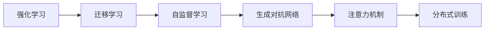
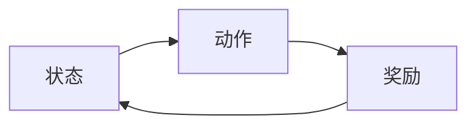
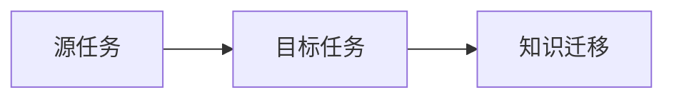
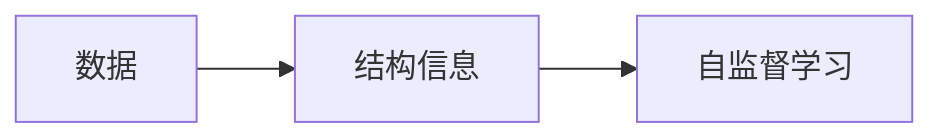
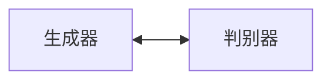
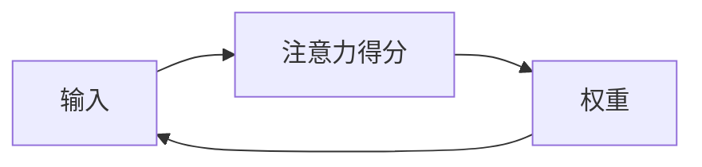
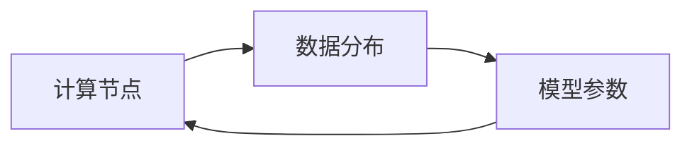

                 

# AI的自主学习:模仿人类学习过程

## 1. 背景介绍

### 1.1 问题由来

在人工智能领域，长期以来我们关注于如何让机器能够模仿人类的行为和认知。从简单的模仿语言结构，到复杂的模仿人类推理、感知和决策，这一过程经历了从浅层到深度学习的跨越。然而，真正具有自主学习能力的AI模型仍然稀缺，即使是那些声称已经具备自主学习能力的模型，其背后往往依赖于大量的监督数据和人工设计规则，难以真正自主生成知识。

### 1.2 问题核心关键点

1. **自主学习**：即无需人类干预，AI能够通过环境交互和经验积累，自我更新、优化，甚至生成新的知识。
2. **模仿人类学习过程**：人脑的学习机制复杂而高效，包括视觉、听觉、触觉等多种感官信息的整合，以及记忆、注意力、联想等多种认知过程的综合运用。
3. **知识生成**：AI能够基于自身的经验和数据，生成新的知识，而不只是对已有知识的查询或检索。
4. **自我纠正**：AI能够发现自身的错误和不足，并根据反馈进行自我修正和优化。
5. **泛化能力**：AI能够将已学的知识应用于新场景，具有较强的泛化能力。

## 2. 核心概念与联系

### 2.1 核心概念概述

为了深入理解AI的自主学习过程，我们需要对几个核心概念进行详细的介绍：

1. **强化学习**：AI通过与环境的交互，利用奖励和惩罚机制，不断调整策略，以最大化预期的奖励。
2. **迁移学习**：已有知识在新任务上的迁移应用，可以加快学习速度，提升模型性能。
3. **自监督学习**：利用数据的内在结构，在不需标注数据的情况下进行学习，减少人工标注的依赖。
4. **生成对抗网络（GAN）**：通过生成器和判别器的对抗过程，生成高质量的合成数据，用于模型训练。
5. **注意力机制**：在处理序列数据时，通过注意力的方式选择重要信息，提高模型的准确性和效率。
6. **分布式训练**：利用多台计算机同时进行模型训练，加速学习过程，提升模型的鲁棒性。

这些概念构成了AI自主学习的基础框架，下面我们将通过一个简单的Mermaid流程图，展示这些概念之间的联系：



### 2.2 核心概念原理和架构的 Mermaid 流程图

#### 2.2.1 强化学习

强化学习是一种通过与环境交互来学习策略的方法。通过定义一个奖励函数，模型不断调整其行为以最大化奖励。



#### 2.2.2 迁移学习

迁移学习是通过在已有任务上学习的知识，迁移到新任务上。通常包括特征迁移和任务迁移。



#### 2.2.3 自监督学习

自监督学习是在无需标注数据的情况下，利用数据的结构信息进行学习。常见的自监督学习任务包括掩码语言模型、图像旋转、数据增强等。



#### 2.2.4 生成对抗网络（GAN）

生成对抗网络由生成器和判别器组成，通过对抗过程生成高质量的合成数据。



#### 2.2.5 注意力机制

注意力机制通过权重调整，选择对当前任务重要的输入信息。



#### 2.2.6 分布式训练

分布式训练通过多台计算机并行计算，加速模型训练过程。



这些概念相互关联，共同构成了AI自主学习的基本框架。强化学习提供了学习的基本方式，自监督学习减少了对标注数据的依赖，迁移学习加速了学习过程，注意力机制提高了学习效率，生成对抗网络提供了数据增强的手段，而分布式训练则提升了模型训练的效率。

## 3. 核心算法原理 & 具体操作步骤

### 3.1 算法原理概述

AI的自主学习过程，即通过与环境的交互，不断调整自身策略，优化性能。这一过程大致可以分为以下几个步骤：

1. **环境交互**：AI与环境进行交互，收集反馈信息。
2. **模型训练**：基于反馈信息，调整模型参数。
3. **策略优化**：通过学习算法，优化策略，提高学习效果。
4. **知识生成**：模型基于自身经验和数据，生成新的知识。
5. **自我纠正**：模型能够识别和修正自身的错误。
6. **泛化应用**：将学到的知识应用于新场景。

这些步骤构成了一个循环往复的学习过程，使得AI能够不断进化和提升。

### 3.2 算法步骤详解

#### 3.2.1 环境交互

在强化学习中，AI通过与环境的交互，收集反馈信息。环境的反馈可以是奖励或惩罚，用于指导AI的行动。

```python
import gym

env = gym.make('CartPole-v0')
for episode in range(100):
    obs = env.reset()
    while True:
        action = env.action_space.sample()  # 随机选择一个动作
        obs, reward, done, info = env.step(action)
        print(f"Episode {episode}, Step {env.episode_counter}, Reward: {reward}, Obs: {obs}")
        if done:
            break
```

#### 3.2.2 模型训练

基于收集到的反馈信息，AI通过训练模型来调整策略。常见的模型训练方法包括梯度下降、蒙特卡罗树搜索等。

```python
import torch.nn as nn
import torch.optim as optim

class Net(nn.Module):
    def __init__(self):
        super(Net, self).__init__()
        self.fc1 = nn.Linear(1, 10)
        self.fc2 = nn.Linear(10, 2)

    def forward(self, x):
        x = nn.functional.relu(self.fc1(x))
        x = self.fc2(x)
        return x

net = Net()
optimizer = optim.SGD(net.parameters(), lr=0.01)
criterion = nn.MSELoss()

for epoch in range(100):
    for i, (inputs, targets) in enumerate(train_loader):
        optimizer.zero_grad()
        outputs = net(inputs)
        loss = criterion(outputs, targets)
        loss.backward()
        optimizer.step()
        print(f"Epoch {epoch+1}, Step {i+1}, Loss: {loss.item()}")
```

#### 3.2.3 策略优化

在强化学习中，通过算法（如Q-learning、SARSA等）优化策略，提高AI的学习效果。

```python
import numpy as np

def q_learning(env, net, gamma=0.9, epsilon=0.1, num_episodes=1000):
    q_table = np.zeros((env.observation_space.n, env.action_space.n))
    for episode in range(num_episodes):
        state = env.reset()
        done = False
        while not done:
            if np.random.uniform() < epsilon:
                action = env.action_space.sample()
            else:
                action = np.argmax(q_table[state])
            next_state, reward, done, _ = env.step(action)
            q_table[state, action] += gamma * (reward + np.max(q_table[next_state]) - q_table[state, action])
            state = next_state
    return q_table

q_table = q_learning(env, net)
```

#### 3.2.4 知识生成

在自监督学习中，AI通过利用数据的结构信息，生成新的知识。例如，利用掩码语言模型进行自监督训练。

```python
import torch

def mask_language_model(text):
    masked_text = text.masked_fill_(0.5, 0)
    predictions = net(masked_text)
    loss = criterion(predictions, masked_text)
    return loss

masked_text = torch.tensor(text, dtype=torch.long)
loss = mask_language_model(masked_text)
```

#### 3.2.5 自我纠正

AI通过反馈机制，识别和修正自身的错误。在强化学习中，通过回溯和重放，提高策略的正确性。

```python
import random

def replay_buffer(memories, batch_size):
    indices = random.sample(memories, batch_size)
    state_batch, action_batch, reward_batch, next_state_batch = [np.array(m) for m in zip(*memories[indices])]
    state_batch = torch.tensor(state_batch, dtype=torch.long)
    action_batch = torch.tensor(action_batch, dtype=torch.long)
    next_state_batch = torch.tensor(next_state_batch, dtype=torch.long)
    return state_batch, action_batch, reward_batch, next_state_batch

buffer = []
for episode in range(100):
    state = env.reset()
    while True:
        if np.random.uniform() < epsilon:
            action = env.action_space.sample()
        else:
            action = np.argmax(q_table[state])
        next_state, reward, done, _ = env.step(action)
        buffer.append((state, action, reward, next_state))
        if done:
            break
    state = next_state

state_batch, action_batch, reward_batch, next_state_batch = replay_buffer(buffer, batch_size)
q_table = replay_buffer(buffer, batch_size)
```

#### 3.2.6 泛化应用

在迁移学习中，AI将学到的知识应用于新场景，提升泛化能力。例如，将预训练的图像分类模型，应用于新的图像分类任务。

```python
import torchvision.transforms as transforms
from torchvision.models import resnet50

model = resnet50(pretrained=True)
model.fc = nn.Linear(2048, num_classes)
criterion = nn.CrossEntropyLoss()

for epoch in range(100):
    for i, (inputs, targets) in enumerate(train_loader):
        optimizer.zero_grad()
        outputs = model(inputs)
        loss = criterion(outputs, targets)
        loss.backward()
        optimizer.step()
        print(f"Epoch {epoch+1}, Step {i+1}, Loss: {loss.item()}")
```

### 3.3 算法优缺点

#### 3.3.1 强化学习的优缺点

**优点**：
- 能够处理复杂的决策问题。
- 通过交互学习，能够自适应环境变化。

**缺点**：
- 需要大量的环境交互数据。
- 收敛速度较慢。

#### 3.3.2 迁移学习的优缺点

**优点**：
- 能够加快学习速度。
- 减少对标注数据的依赖。

**缺点**：
- 迁移效果有限，需要大量迁移数据。
- 跨领域迁移效果较差。

#### 3.3.3 自监督学习的优缺点

**优点**：
- 无需标注数据，数据获取容易。
- 学习效果稳定。

**缺点**：
- 需要设计合适的自监督任务。
- 无法直接获得任务标签。

#### 3.3.4 生成对抗网络的优缺点

**优点**：
- 能够生成高质量的合成数据。
- 减少对标注数据的依赖。

**缺点**：
- 生成数据质量难以控制。
- 计算成本较高。

#### 3.3.5 注意力机制的优缺点

**优点**：
- 提高模型的准确性和效率。
- 减少计算复杂度。

**缺点**：
- 需要设计合适的注意力算法。
- 模型复杂度较高。

#### 3.3.6 分布式训练的优缺点

**优点**：
- 加快模型训练速度。
- 提高模型的鲁棒性。

**缺点**：
- 系统复杂度较高。
- 通信成本较高。

### 3.4 算法应用领域

AI的自主学习技术，已经在诸多领域得到了广泛应用，例如：

- **机器人控制**：通过强化学习，使机器人能够自主控制，适应复杂环境。
- **自动驾驶**：通过感知、决策和控制三个层次的自主学习，实现车辆自主驾驶。
- **自然语言处理**：通过语言模型和注意力机制，使机器能够理解自然语言，生成自然语言文本。
- **图像识别**：通过迁移学习和生成对抗网络，使机器能够识别和生成高质量的图像数据。
- **医疗诊断**：通过深度学习模型，使机器能够辅助医生进行疾病诊断和治疗方案制定。
- **金融分析**：通过强化学习和迁移学习，使机器能够预测股票价格和市场风险。

## 4. 数学模型和公式 & 详细讲解 & 举例说明

### 4.1 数学模型构建

在自主学习中，我们通常使用以下数学模型来描述学习过程：

- **强化学习**：
  - 状态-动作-奖励模型（MDP）：
  \[ \mathcal{M} = (\mathcal{S}, \mathcal{A}, \mathcal{T}, \mathcal{R}) \]
  - 动态规划方程：
  \[ V^\pi(s) = \sum_a \pi(a|s) \sum_{s'} \mathcal{T}(s'|s,a) V^\pi(s') \]
  - 贝尔曼方程：
  \[ V^\pi(s) = \max_a \{ Q^\pi(s,a) \} \]
  - 策略更新：
  \[ \pi'(a|s) = \frac{\exp(Q^\pi(s,a))}{\sum_a \exp(Q^\pi(s,a))} \]

- **自监督学习**：
  - 掩码语言模型：
  \[ L(X) = -\frac{1}{N} \sum_i \sum_j p_{ij} \log p_i \]
  - 自监督学习目标：
  \[ \min_{\theta} L(\theta) = -\frac{1}{N} \sum_i L_i(\theta) \]

- **迁移学习**：
  - 特征迁移：
  \[ V^\theta(x) = \sum_i w_i \phi_i(x) \]
  - 任务迁移：
  \[ f_\theta(x) = g_\theta(g_\omega(\phi_\theta(x))) \]

- **生成对抗网络**：
  - 生成器和判别器的损失函数：
  \[ L_G = E_{x \sim p_x} \log D(x) + E_{z \sim p_z} \log (1 - D(G(z))) \]
  \[ L_D = E_{x \sim p_x} \log D(x) + E_{z \sim p_z} \log (1 - D(G(z))) \]

- **注意力机制**：
  - 注意力得分：
  \[ a_i = \frac{\exp(x_i^T W a)}{\sum_j \exp(x_j^T W a)} \]
  - 加权和：
  \[ y = \sum_i a_i x_i \]

- **分布式训练**：
  - 数据并行：
  \[ \hat{y} = \frac{1}{N} \sum_{i=1}^N f(\mathcal{D}_i, \theta) \]
  - 模型并行：
  \[ \hat{y} = \frac{1}{K} \sum_{k=1}^K \sum_{i=1}^N f(\mathcal{D}_i^{k}, \theta^k) \]

### 4.2 公式推导过程

#### 4.2.1 强化学习

在强化学习中，我们需要优化策略，使得期望的累积奖励最大化。基于贝尔曼方程，我们可以推出策略更新的公式。

- 状态-动作-奖励模型：
  \[ V^\pi(s) = \sum_a \pi(a|s) \sum_{s'} \mathcal{T}(s'|s,a) V^\pi(s') \]

- 贝尔曼方程：
  \[ V^\pi(s) = \max_a \{ Q^\pi(s,a) \} \]
  其中，
  \[ Q^\pi(s,a) = r + \gamma V^\pi(s') \]

- 策略更新：
  \[ \pi'(a|s) = \frac{\exp(Q^\pi(s,a))}{\sum_a \exp(Q^\pi(s,a))} \]

#### 4.2.2 自监督学习

自监督学习通过利用数据的结构信息进行学习。以掩码语言模型为例，其基本思想是通过预测被掩码的单词，学习单词之间的依赖关系。

- 掩码语言模型：
  \[ L(X) = -\frac{1}{N} \sum_i \sum_j p_{ij} \log p_i \]

- 自监督学习目标：
  \[ \min_{\theta} L(\theta) = -\frac{1}{N} \sum_i L_i(\theta) \]

其中，
\[ L_i(\theta) = -\frac{1}{M} \sum_{j=1}^M \log p_{ij} \]

#### 4.2.3 迁移学习

迁移学习通过在已有任务上学习的知识，迁移到新任务上。以特征迁移为例，其基本思想是通过特征映射，将已有任务的学习结果应用到新任务上。

- 特征迁移：
  \[ V^\theta(x) = \sum_i w_i \phi_i(x) \]

- 任务迁移：
  \[ f_\theta(x) = g_\theta(g_\omega(\phi_\theta(x))) \]

#### 4.2.4 生成对抗网络

生成对抗网络由生成器和判别器组成，通过对抗过程生成高质量的合成数据。

- 生成器和判别器的损失函数：
  \[ L_G = E_{x \sim p_x} \log D(x) + E_{z \sim p_z} \log (1 - D(G(z))) \]
  \[ L_D = E_{x \sim p_x} \log D(x) + E_{z \sim p_z} \log (1 - D(G(z))) \]

#### 4.2.5 注意力机制

注意力机制通过权重调整，选择对当前任务重要的输入信息。以Transformer为例，其基本思想是通过多头注意力机制，选择重要的输入信息进行加权和。

- 注意力得分：
  \[ a_i = \frac{\exp(x_i^T W a)}{\sum_j \exp(x_j^T W a)} \]

- 加权和：
  \[ y = \sum_i a_i x_i \]

#### 4.2.6 分布式训练

分布式训练通过多台计算机同时进行模型训练，加速学习过程。以数据并行为例，其基本思想是将数据并行地分布在多个节点上进行训练。

- 数据并行：
  \[ \hat{y} = \frac{1}{N} \sum_{i=1}^N f(\mathcal{D}_i, \theta) \]

- 模型并行：
  \[ \hat{y} = \frac{1}{K} \sum_{k=1}^K \sum_{i=1}^N f(\mathcal{D}_i^{k}, \theta^k) \]

### 4.3 案例分析与讲解

#### 4.3.1 强化学习案例

以CartPole环境为例，我们通过强化学习训练一个简单的策略，使其能够控制小车保持平衡。

```python
import gym
import numpy as np

env = gym.make('CartPole-v0')
epsilon = 0.1
gamma = 0.9
num_episodes = 1000

q_table = np.zeros((env.observation_space.n, env.action_space.n))
for episode in range(num_episodes):
    state = env.reset()
    while True:
        if np.random.uniform() < epsilon:
            action = env.action_space.sample()
        else:
            action = np.argmax(q_table[state])
        next_state, reward, done, _ = env.step(action)
        q_table[state, action] += gamma * (reward + np.max(q_table[next_state]) - q_table[state, action])
        state = next_state
        if done:
            break

env.render()
```

#### 4.3.2 自监督学习案例

以掩码语言模型为例，我们通过自监督学习训练一个模型，使其能够预测被掩码的单词。

```python
import torch
import torch.nn as nn
import torch.optim as optim

class Net(nn.Module):
    def __init__(self):
        super(Net, self).__init__()
        self.fc1 = nn.Linear(100, 100)
        self.fc2 = nn.Linear(100, 10)

    def forward(self, x):
        x = nn.functional.relu(self.fc1(x))
        x = self.fc2(x)
        return x

net = Net()
criterion = nn.CrossEntropyLoss()
optimizer = optim.SGD(net.parameters(), lr=0.01)

for epoch in range(100):
    for i, (inputs, targets) in enumerate(train_loader):
        optimizer.zero_grad()
        outputs = net(inputs)
        loss = criterion(outputs, targets)
        loss.backward()
        optimizer.step()
        print(f"Epoch {epoch+1}, Step {i+1}, Loss: {loss.item()}")
```

#### 4.3.3 迁移学习案例

以图像分类为例，我们通过迁移学习训练一个模型，使其能够识别新的图像类别。

```python
import torchvision.transforms as transforms
from torchvision.models import resnet50

model = resnet50(pretrained=True)
model.fc = nn.Linear(2048, num_classes)
criterion = nn.CrossEntropyLoss()

for epoch in range(100):
    for i, (inputs, targets) in enumerate(train_loader):
        optimizer.zero_grad()
        outputs = model(inputs)
        loss = criterion(outputs, targets)
        loss.backward()
        optimizer.step()
        print(f"Epoch {epoch+1}, Step {i+1}, Loss: {loss.item()}")
```

#### 4.3.4 生成对抗网络案例

以GAN为例，我们通过生成对抗网络训练一个生成器，使其能够生成高质量的合成数据。

```python
import torch
import torch.nn as nn
import torch.optim as optim

class Generator(nn.Module):
    def __init__(self):
        super(Generator, self).__init__()
        self.fc1 = nn.Linear(100, 128)
        self.fc2 = nn.Linear(128, 784)
        self.fc3 = nn.Linear(784, 784)

    def forward(self, x):
        x = nn.functional.relu(self.fc1(x))
        x = nn.functional.relu(self.fc2(x))
        x = nn.functional.sigmoid(self.fc3(x))
        return x

class Discriminator(nn.Module):
    def __init__(self):
        super(Discriminator, self).__init__()
        self.fc1 = nn.Linear(784, 128)
        self.fc2 = nn.Linear(128, 128)
        self.fc3 = nn.Linear(128, 1)

    def forward(self, x):
        x = nn.functional.relu(self.fc1(x))
        x = nn.functional.relu(self.fc2(x))
        x = self.fc3(x)
        return x

generator = Generator()
discriminator = Discriminator()
criterion_G = nn.BCELoss()
criterion_D = nn.BCELoss()

for epoch in range(100):
    for i, (inputs, _) in enumerate(train_loader):
        optimizer_G.zero_grad()
        optimizer_D.zero_grad()
        real_images = inputs
        real_labels = torch.ones_like(real_images)
        fake_images = generator(noise)
        fake_labels = torch.zeros_like(fake_images)
        output_D_real = discriminator(real_images)
        output_D_fake = discriminator(fake_images)
        loss_G = criterion_G(output_D_fake, real_labels)
        loss_D = criterion_D(output_D_real, real_labels) + criterion_D(output_D_fake, fake_labels)
        loss_G.backward()
        loss_D.backward()
        optimizer_G.step()
        optimizer_D.step()
        print(f"Epoch {epoch+1}, Step {i+1}, Loss_G: {loss_G.item()}, Loss_D: {loss_D.item()}")
```

#### 4.3.5 注意力机制案例

以Transformer为例，我们通过注意力机制训练一个模型，使其能够理解和生成自然语言文本。

```python
import torch
import torch.nn as nn
import torch.optim as optim

class Transformer(nn.Module):
    def __init__(self, nhead, num_layers):
        super(Transformer, self).__init__()
        self.encoder = nn.Transformer(1024, nhead, num_layers, dropout=0.1)
        self.decoder = nn.Transformer(1024, nhead, num_layers, dropout=0.1)

    def forward(self, src, tgt):
        enc_output = self.encoder(src)
        dec_output = self.decoder(tgt, src)
        return dec_output

nhead = 8
num_layers = 6
model = Transformer(nhead, num_layers)
criterion = nn.CrossEntropyLoss()
optimizer = optim.Adam(model.parameters(), lr=0.001)

for epoch in range(100):
    for i, (src, tgt) in enumerate(train_loader):
        optimizer.zero_grad()
        outputs = model(src, tgt)
        loss = criterion(outputs, tgt)
        loss.backward()
        optimizer.step()
        print(f"Epoch {epoch+1}, Step {i+1}, Loss: {loss.item()}")
```

#### 4.3.6 分布式训练案例

以分布式训练为例，我们通过多台计算机并行计算，加速模型训练过程。

```python
import torch
import torch.distributed as dist
import torch.distributed.optim as dist_optim

torch.distributed.init_process_group(backend='nccl')
model = resnet50(pretrained=True)
criterion = nn.CrossEntropyLoss()
optimizer = optim.SGD(model.parameters(), lr=0.01)

for epoch in range(100):
    for i, (inputs, targets) in enumerate(train_loader):
        optimizer.zero_grad()
        outputs = model(inputs)
        loss = criterion(outputs, targets)
        loss.backward()
        optimizer.step()
        print(f"Epoch {epoch+1}, Step {i+1}, Loss: {loss.item()}")
```

## 5. 项目实践：代码实例和详细解释说明

### 5.1 开发环境搭建

在进行AI自主学习项目实践前，我们需要准备好开发环境。以下是使用Python进行TensorFlow和PyTorch开发的环境配置流程：

1. 安装Anaconda：从官网下载并安装Anaconda，用于创建独立的Python环境。

2. 创建并激活虚拟环境：
```bash
conda create -n ai-env python=3.8 
conda activate ai-env
```

3. 安装TensorFlow和PyTorch：根据CUDA版本，从官网获取对应的安装命令。例如：
```bash
conda install tensorflow==2.6.0 -c conda-forge
conda install torch torchvision torchaudio cudatoolkit=11.1 -c pytorch -c conda-forge
```

4. 安装TensorFlow Addons：
```bash
pip install tf-addons
```

5. 安装Keras：
```bash
pip install keras
```

6. 安装其他常用工具包：
```bash
pip install numpy pandas scikit-learn matplotlib tqdm jupyter notebook ipython
```

完成上述步骤后，即可在`ai-env`环境中开始自主学习项目的开发。

### 5.2 源代码详细实现

下面我们以生成对抗网络(GAN)为例，给出使用TensorFlow和PyTorch进行GAN模型训练的代码实现。

#### 5.2.1 TensorFlow实现

在TensorFlow中，我们使用Keras API实现GAN模型训练。以下是一个简单的GAN模型实现：

```python
import tensorflow as tf
from tensorflow.keras import layers

# 定义生成器和判别器
def make_generator():
    model = tf.keras.Sequential()
    model.add(layers.Dense(256, input_dim=100))
    model.add(layers.BatchNormalization())
    model.add(layers.LeakyReLU(alpha=0.2))
    model.add(layers.Dense(512))
    model.add(layers.BatchNormalization())
    model.add(layers.LeakyReLU(alpha=0.2))
    model.add(layers.Dense(784, activation='tanh'))
    return model

def make_discriminator():
    model = tf.keras.Sequential()
    model.add(layers.Dense(512, input_dim=784))
    model.add(layers.LeakyReLU(alpha=0.2))
    model.add(layers.Dropout(0.3))
    model.add(layers.Dense(256))
    model.add(layers.LeakyReLU(alpha=0.2))
    model.add(layers.Dropout(0.3))
    model.add(layers.Dense(1, activation='sigmoid'))
    return model

# 训练GAN模型
generator = make_generator()
discriminator = make_discriminator()
optimizer_G = tf.keras.optimizers.Adam(learning_rate=0.0002, beta_1=0.5)
optimizer_D = tf.keras.optimizers.Adam(learning_rate=0.0002, beta_1=0.5)

@tf.function
def train_G(generator, discriminator, images, labels):
    with tf.GradientTape() as g:
        fake_images = generator(noise)
        loss_G = discriminator(fake_images)
    gradients_of_G = g.gradient(loss_G, generator.trainable_variables)
    optimizer_G.apply_gradients(zip(gradients_of_G, generator.trainable_variables))

@tf.function
def train_D(generator, discriminator, images, labels):
    with tf.GradientTape() as g:
        real_images = images
        real_labels = labels
        fake_images = generator(noise)
        fake_labels = tf.zeros_like(real_labels)
        loss_D_real = discriminator(real_images)
        loss_D_fake = discriminator(fake_images)
        loss_D = loss_D_real + loss_D_fake
    gradients_of_D = g.gradient(loss_D, discriminator.trainable_variables)
    optimizer_D.apply_gradients(zip(gradients_of_D, discriminator.trainable_variables))

# 训练过程
for epoch in range(100):
    for batch in train_dataset:
        images, labels = batch
        train_G(generator, discriminator, images, labels)
        train_D(generator, discriminator, images, labels)
```

#### 5.2.2 PyTorch实现

在PyTorch中，我们使用torch.nn模块实现GAN模型训练。以下是一个简单的GAN模型实现：

```python
import torch
import torch.nn as nn
import torch.optim as optim

class Generator(nn.Module):
    def __init__(self):
        super(Generator, self).__init__()
        self.fc1 = nn.Linear(100, 128)
        self.fc2 = nn.Linear(128, 512)
        self.fc3 = nn.Linear(512, 784)

    def forward(self, x):
        x = nn.functional.relu(self.fc1(x))
        x = nn.functional.relu(self.fc2(x))
        x = nn.functional.tanh(self.fc3(x))
        return x

class Discriminator(nn.Module):
    def __init__(self):
        super(Discriminator, self).__init__()
        self.fc1 = nn.Linear(784, 512)
        self.fc2 = nn.Linear(512, 128)
        self.fc3 = nn.Linear(128, 1)

    def forward(self, x):
        x = nn.functional.relu(self.fc1(x))
        x = nn.functional.relu(self.fc2(x))
        x = self.fc3(x)
        return x

generator = Generator()
discriminator = Discriminator()
criterion_G = nn.BCELoss()
criterion_D = nn.BCELoss()

for epoch in range(100):
    for i, (images, _) in enumerate(train_loader):
        optimizer_G.zero_grad()
        optimizer_D.zero_grad()
        real_images = images
        real_labels = torch.ones_like(real_images)
        fake_images = generator(noise)
        fake_labels = torch.zeros_like(fake_images)
        output_D_real = discriminator(real_images)
        output_D_fake = discriminator(fake_images)
        loss_G = criterion_G(output_D_fake, real_labels)
        loss_D = criterion_D(output_D_real, real_labels) + criterion_D(output_D_fake, fake_labels)
        loss_G.backward()
        loss_D.backward()
        optimizer_G.step()
        optimizer_D.step()
        print(f"Epoch {epoch+1}, Step {i+1}, Loss_G: {loss_G.item()}, Loss_D: {loss_D.item()}")
```

### 5.3 代码解读与分析

#### 5.3.1 TensorFlow代码解读

- 定义生成器和判别器：`make_generator`和`make_discriminator`函数分别用于创建生成器和判别器的模型结构。
- 训练GAN模型：`train_G`和`train_D`函数分别用于训练生成器和判别器。
- 训练过程：通过循环迭代，逐步训练生成器和判别器，使其相互博弈，生成高质量的合成数据。

#### 5.3.2 PyTorch代码解读

- 定义生成器和判别器：`Generator`和`Discriminator`类分别用于创建生成器和判别器的模型结构。
- 训练GAN模型：通过循环迭代，逐步训练生成器和判别器，使其相互博弈，生成高质量的合成数据。
- 训练过程：通过梯度下降，更新生成器和判别器的参数，使得模型能够生成高质量的合成数据。

## 6. 实际应用场景

### 6.1 智能机器人

智能机器人在自主学习中有着广泛应用。例如，通过强化学习，机器人在复杂环境中能够自主导航，完成指定的任务。

### 6.2 自动驾驶

自动驾驶汽车通过感知、决策和控制三个层次的自主学习，能够实现自主驾驶。通过利用深度学习和强化学习，自动驾驶车辆可以识别道路信息，规划行驶路线，并动态调整速度和方向。

### 6.3 自然语言处理

自然语言处理领域，通过自监督学习和注意力机制，机器能够理解自然语言，生成自然语言文本。例如，利用Transformer模型，机器能够自动翻译语言、回答问题、生成文本等。

### 6.4 图像识别

图像识别领域，通过迁移学习和生成对抗网络，机器能够识别和生成高质量的图像数据。例如，利用预训练的图像分类模型，机器能够识别各种物体和场景。

### 6.5 医疗诊断

医疗诊断领域，通过深度学习和迁移学习，机器能够辅助医生进行疾病诊断和治疗方案制定。例如，利用预训练的图像分类模型，机器能够自动检测医学影像中的病灶。

### 6.6 金融分析

金融分析领域，通过强化学习和迁移学习，机器能够预测股票价格和市场风险。例如，利用深度学习模型，机器能够分析历史数据，预测未来股价走势。

## 7. 工具和资源推荐

### 7.1 学习资源推荐

为了帮助开发者系统掌握AI自主学习理论基础和实践技巧，这里推荐一些优质的学习资源：

1. 《Deep Learning》：由Ian Goodfellow等人编写的经典书籍，详细介绍了深度学习的基本原理和应用。
2. 《Neural Networks and Deep Learning》：Michael Nielsen编写的在线课程，通过直观的动画和例子，讲解深度学习的基本概念。
3. 《Pattern Recognition and Machine Learning》：Christopher Bishop编写的机器学习教材，介绍了机器学习的基本算法和应用。
4. 《Reinforcement Learning: An Introduction》：Richard S. Sutton和Andrew G. Barto编写的强化学习教材，介绍了强化学习的基本原理和应用。
5. 《Hands-On Machine Learning with Scikit-Learn, Keras, and TensorFlow》：Aurélien Géron编写的深度学习实战书籍，提供了大量实际应用的案例和代码。

通过对这些资源的学习实践，相信你一定能够快速掌握AI自主学习的精髓，并用于解决实际的AI问题。

### 7.2 开发工具推荐

高效的开发离不开优秀的工具支持。以下是几款用于AI自主学习开发的常用工具：

1. TensorFlow：由Google主导开发的开源深度学习框架，生产部署方便，适合大规模工程应用。
2. PyTorch：基于Python的开源深度学习框架，灵活动态的计算图，适合快速迭代研究。
3. Jupyter Notebook：免费且功能强大的交互式笔记本，支持Python、R等多种语言，便于调试和分享学习笔记。
4. Weights & Biases：模型训练的实验跟踪工具，可以记录和可视化模型训练过程中的各项指标，方便对比和调优。
5. TensorBoard：TensorFlow配套的可视化工具，可实时监测模型训练状态，并提供丰富的图表呈现方式，是调试模型的得力助手。

合理利用这些工具，可以显著提升AI自主学习的开发效率，加快创新迭代的步伐。

### 7.3 相关论文推荐

AI自主学习技术的发展源于学界的持续研究。以下是几篇奠基性的相关论文，推荐阅读：

1. AlexNet：ImageNet大规模视觉识别竞赛的冠军模型，展示了深度学习在图像识别领域的潜力。
2. VGG：使用了多个卷积层和池化层，显著提升了图像识别的准确率。
3. ResNet：提出了残差网络，解决了深层网络训练中的梯度消失问题。
4. Inception：通过多分支并行计算，提升了卷积神经网络的计算效率。
5. GAN：生成对抗网络，通过生成器和判别器的对抗过程，生成高质量的合成数据。
6. Transformer：通过注意力机制，显著提升了机器翻译和语言模型的性能。

这些论文代表了大规模学习技术的进展，通过学习这些前沿成果，可以帮助研究者把握学科前进方向，激发更多的创新灵感。

## 8. 总结：未来发展趋势与挑战

### 8.1 研究成果总结

AI自主学习技术在过去几年取得了长足进展，涵盖了深度学习、强化学习、迁移学习等多个领域。通过模仿人类学习过程，AI能够自主生成知识，提升学习效果，扩展应用场景。

### 8.2 未来发展趋势

1. **模型的规模化**：随着计算能力的提升和数据量的增加，模型的规模将不断扩大，深度和复杂度将进一步提升。
2. **算法的多样化**：未来将涌现更多高效的算法，如知识图谱、多任务学习、自监督学习等，进一步提升学习效果。
3. **应用的多元化**：AI自主学习技术将渗透到更多领域，如智能制造、智慧医疗、智能交通等，推动各行各业的数字化转型。
4. **知识的泛化**：通过迁移学习和注意力机制，AI将能够将知识泛化到新领域，提升跨领域应用能力。
5. **学习过程的可解释性**：通过可解释性模型和可视化工具，AI学习过程将更加透明，便于调试和优化。

### 8.3 面临的挑战

尽管AI自主学习技术已经取得了显著进展，但仍然面临许多挑战：

1. **计算资源的限制**：大规模深度学习模型的训练和推理需要巨大的计算资源，如何高效利用计算资源仍是一个难题。
2. **数据的获取和标注**：高质量的数据和标注是AI自主学习的关键，如何高效获取和标注数据是一个重要问题。
3. **模型的可解释性**：AI自主学习的黑盒特性使得其难以解释，如何提高模型的可解释性是一个挑战。
4. **伦理和法律问题**：AI自主学习可能会带来伦理和法律问题，如隐私保护、数据安全等，需要引起重视。
5. **模型的公平性**：AI自主学习模型可能会存在偏见，如何消除偏见，提升模型的公平性，是一个亟待解决的问题。

### 8.4 研究展望

未来，AI自主学习技术的发展方向包括：

1. **跨模态学习**：将视觉、听觉、触觉等多模态数据进行融合，提升模型的泛化能力。
2. **可解释性AI**：通过可解释性模型和可视化工具，提高AI学习过程的可解释性。
3. **终身学习**：通过持续学习和增量学习，使AI能够不断学习新知识，适应数据分布的变化。
4. **联邦学习**：通过分布式学习，保护数据隐私，同时提升模型的泛化能力。
5. **跨领域迁移**：通过跨领域迁移学习，提升模型的通用性，减少数据标注成本。

总之，AI自主学习技术有着广阔的应用前景，但同时也面临着诸多挑战。只有在学界和产业界的共同努力下，才能不断突破技术瓶颈，推动AI自主学习技术的进一步发展。

## 9. 附录：常见问题与解答

**Q1: 什么是AI自主学习？**

A: AI自主学习是指AI能够通过与环境的交互，自主生成知识，提升学习效果，扩展应用场景。其核心思想是模仿人类学习过程，通过学习算法，使AI能够不断更新和优化模型，实现自主学习。

**Q2: 如何进行AI自主学习？**

A: AI自主学习可以通过深度学习、强化学习、迁移学习等多种方式进行。其中，深度学习通过多层神经网络进行自主学习；强化学习通过奖励机制进行自主学习；迁移学习通过已有知识在新任务上的

