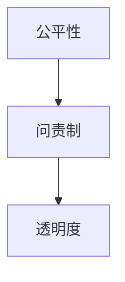

                 

## 1. 背景介绍

在人工智能（AI）飞速发展的今天，AI系统已经广泛应用于医疗诊断、金融风控、智能客服、自动驾驶等多个领域。然而，AI系统的广泛应用也带来了一些不容忽视的问题，例如模型的公平性、问责制和透明度。这些问题不仅影响到AI系统的可信度，还关系到公众的权益和社会的稳定。因此，确保AI系统的公平性、问责制和透明度，成为了当前AI研究的重要课题。

### 1.1 公平性

公平性是指AI系统在对待不同群体（如性别、种族、年龄等）时，应该避免偏见，确保对所有用户一视同仁。然而，由于训练数据中的固有偏见，AI系统容易复制和放大这些偏见，导致不公平的结果。例如，在招聘广告推荐中，AI模型可能会更倾向于推荐某一性别的职位，或者对不同种族的候选人产生歧视。因此，确保AI系统的公平性是当前AI研究的重要目标。

### 1.2 问责制

问责制是指对AI系统进行责任追溯，确保其决策过程透明、可解释。然而，由于深度学习模型的复杂性，AI系统的决策过程往往是黑箱的，难以解释。例如，在自动驾驶系统中，一旦发生事故，如何确定是AI系统的决策错误，还是驾驶员的误操作，成为一个难题。因此，确保AI系统的问责制，对于提高系统的可靠性和用户信任度至关重要。

### 1.3 透明度

透明度是指AI系统的决策过程应该公开、可理解。然而，深度学习模型的参数和计算过程往往是复杂的，难以直观理解。例如，在医疗诊断系统中，AI模型的诊断结果可能基于复杂的多层次特征提取，难以解释。因此，确保AI系统的透明度，对于提高系统的可信度和用户接受度具有重要意义。

## 2. 核心概念与联系

### 2.1 核心概念概述

为了更好地理解公平性、问责制和透明度，需要了解几个核心概念：

- **公平性（Fairness）**：指AI系统在处理不同群体时，不应该存在系统性的偏见，应该对所有群体一视同仁。
- **问责制（Accountability）**：指AI系统应该对其决策过程和结果负责，确保决策透明、可解释。
- **透明度（Transparency）**：指AI系统的决策过程应该公开、可理解，让用户能够直观地理解AI系统的决策依据。

这些概念之间的逻辑关系可以通过以下Mermaid流程图来展示：



这个流程图展示了公平性、问责制和透明度之间的联系：

1. 公平性是基础，确保AI系统不偏向某一特定群体。
2. 问责制是对公平性的进一步保证，确保AI系统在处理不公平时能够被追究责任。
3. 透明度是问责制的延伸，确保AI系统的决策过程透明、可理解。

### 2.2 核心概念原理和架构

#### 2.2.1 公平性原理

公平性通常通过以下方法来实现：

- **数据平衡**：确保训练数据中不同群体的样本数量相近，避免数据偏差。
- **偏见校正**：在模型训练过程中，通过正则化等方法减少模型的偏见。
- **公平算法**：开发专门的公平算法，确保模型的决策结果对所有群体公平。

#### 2.2.2 问责制原理

问责制通常通过以下方法来实现：

- **可解释模型**：开发可解释的模型，确保其决策过程透明、可理解。
- **透明数据流程**：记录和监控模型的输入、处理过程和输出，确保每一步都有记录。
- **责任追溯机制**：建立责任追溯机制，确保出现问题时能够迅速定位责任人。

#### 2.2.3 透明度原理

透明度通常通过以下方法来实现：

- **可视化工具**：开发可视化工具，展示模型的决策过程和结果。
- **文档记录**：记录和保存模型的训练过程、数据处理过程和模型参数，确保每一步都有记录。
- **用户教育**：教育用户如何使用和理解AI系统，提升用户对系统的信任度。

## 3. 核心算法原理 & 具体操作步骤

### 3.1 算法原理概述

为了实现公平性、问责制和透明度，需要开发相应的算法和技术。以下是对几个关键算法的简要介绍：

- **公平算法**：开发专门的公平算法，确保模型对所有群体的公平性。例如，可以使用Adversarial Debiasing、Equalized Odds等方法。
- **可解释模型**：开发可解释的模型，确保其决策过程透明、可理解。例如，可以使用LIME、SHAP等方法。
- **责任追溯机制**：建立责任追溯机制，确保出现问题时能够迅速定位责任人。例如，可以使用日志记录、版本管理等方法。

### 3.2 算法步骤详解

#### 3.2.1 公平算法步骤

1. **数据平衡**：收集不同群体的样本，确保训练数据中不同群体的样本数量相近。
2. **偏见校正**：在模型训练过程中，通过正则化等方法减少模型的偏见。例如，可以使用Fairness Constraints等方法。
3. **公平评估**：使用公平评估指标，评估模型的公平性。例如，可以使用Demographic Parity、Equalized Odds等指标。

#### 3.2.2 可解释模型步骤

1. **模型选择**：选择可解释的模型，例如决策树、线性模型等。
2. **解释方法**：使用LIME、SHAP等方法，解释模型的决策过程和结果。
3. **用户反馈**：收集用户的反馈，持续改进模型的可解释性。

#### 3.2.3 责任追溯机制步骤

1. **日志记录**：记录和保存模型的输入、处理过程和输出，确保每一步都有记录。
2. **版本管理**：管理模型的不同版本，确保每个版本都有记录。
3. **责任定位**：建立责任定位机制，确保出现问题时能够迅速定位责任人。

### 3.3 算法优缺点

#### 3.3.1 公平算法

**优点**：

- 减少模型的偏见，提高模型的公平性。
- 适用于多种模型和任务，具有广泛的适用性。

**缺点**：

- 需要额外的计算和数据处理，增加了模型的复杂性。
- 对于一些复杂任务，可能无法完全消除模型的偏见。

#### 3.3.2 可解释模型

**优点**：

- 确保模型的决策过程透明、可理解，提高用户信任度。
- 适用于多种模型和任务，具有广泛的适用性。

**缺点**：

- 解释方法可能影响模型的性能，降低模型的准确性。
- 对于一些复杂的模型，解释方法可能无法完全解释其决策过程。

#### 3.3.3 责任追溯机制

**优点**：

- 确保出现问题时能够迅速定位责任人，提高系统的可靠性。
- 适用于多种模型和任务，具有广泛的适用性。

**缺点**：

- 需要额外的记录和维护成本，增加了系统的复杂性。
- 对于一些高度自动化的系统，责任追溯机制可能难以实现。

### 3.4 算法应用领域

公平性、问责制和透明度在多个领域都有广泛的应用，例如：

- **医疗**：在医疗诊断中，确保AI系统的决策过程透明、可理解，避免医疗事故。
- **金融**：在金融风控中，确保AI系统的决策过程公平、透明，避免金融风险。
- **司法**：在司法审判中，确保AI系统的决策过程透明、可理解，避免司法不公。
- **智能客服**：在智能客服中，确保AI系统的决策过程公平、透明，提高用户满意度。

## 4. 数学模型和公式 & 详细讲解 & 举例说明

### 4.1 数学模型构建

为了确保AI系统的公平性、问责制和透明度，需要构建相应的数学模型。以下是对几个关键数学模型的简要介绍：

- **公平性模型**：通过约束模型参数，确保模型的决策过程公平。例如，可以使用Fairness Constraints等方法。
- **可解释性模型**：使用可解释性方法，解释模型的决策过程和结果。例如，可以使用LIME、SHAP等方法。
- **责任追溯模型**：记录和保存模型的输入、处理过程和输出，确保每一步都有记录。例如，可以使用日志记录、版本管理等方法。

### 4.2 公式推导过程

#### 4.2.1 公平性公式推导

公平性通常通过以下公式来计算：

$$
\text{Fairness} = \frac{\text{Fairness Score}}{\text{Score of reference group}}
$$

其中，$\text{Fairness Score}$表示模型对不同群体的公平性分数，$\text{Score of reference group}$表示模型的基准分数。通过计算不同群体之间的公平性分数，可以评估模型的公平性。

#### 4.2.2 可解释性公式推导

可解释性通常通过以下公式来计算：

$$
\text{Explainability} = \text{Explanation} \times \text{Accuracy}
$$

其中，$\text{Explanation}$表示模型的解释分数，$\text{Accuracy}$表示模型的准确性。通过计算模型的解释分数和准确性，可以评估模型的可解释性。

#### 4.2.3 责任追溯公式推导

责任追溯通常通过以下公式来记录：

$$
\text{Log} = \text{Input} + \text{Process} + \text{Output}
$$

其中，$\text{Log}$表示系统的日志记录，$\text{Input}$表示模型的输入，$\text{Process}$表示模型的处理过程，$\text{Output}$表示模型的输出。通过记录系统的输入、处理过程和输出，可以确保每一步都有记录，便于责任追溯。

### 4.3 案例分析与讲解

#### 4.3.1 公平性案例

在招聘广告推荐中，AI模型可能会更倾向于推荐某一性别的职位。为了确保公平性，可以使用Fairness Constraints等方法，约束模型参数，确保对所有性别一视同仁。具体实现步骤如下：

1. **数据平衡**：收集不同性别的样本，确保训练数据中不同性别的样本数量相近。
2. **偏见校正**：在模型训练过程中，使用Fairness Constraints等方法，减少模型的偏见。例如，可以使用Equalized Odds等方法。
3. **公平评估**：使用Demographic Parity、Equalized Odds等指标，评估模型的公平性。例如，可以使用公平误差率（FPR）和误报率（FNR）来评估模型的公平性。

#### 4.3.2 可解释性案例

在医疗诊断中，AI模型可能难以解释其诊断依据。为了确保可解释性，可以使用LIME、SHAP等方法，解释模型的决策过程和结果。具体实现步骤如下：

1. **模型选择**：选择可解释的模型，例如决策树、线性模型等。
2. **解释方法**：使用LIME、SHAP等方法，解释模型的决策过程和结果。例如，可以使用LIME来生成局部可解释性模型，SHAP来计算特征贡献度。
3. **用户反馈**：收集用户的反馈，持续改进模型的可解释性。例如，可以设计问卷调查，收集用户对解释结果的满意度。

#### 4.3.3 责任追溯案例

在自动驾驶系统中，一旦发生事故，如何确定是AI系统的决策错误，还是驾驶员的误操作，成为一个难题。为了确保责任追溯，可以使用日志记录、版本管理等方法，建立责任追溯机制。具体实现步骤如下：

1. **日志记录**：记录和保存系统的输入、处理过程和输出，确保每一步都有记录。例如，可以使用TensorBoard等工具记录日志。
2. **版本管理**：管理系统的不同版本，确保每个版本都有记录。例如，可以使用Git等版本控制系统。
3. **责任定位**：建立责任定位机制，确保出现问题时能够迅速定位责任人。例如，可以设计责任追踪算法，通过日志记录定位问题来源。

## 5. 项目实践：代码实例和详细解释说明

### 5.1 开发环境搭建

在进行公平性、问责制和透明度研究前，我们需要准备好开发环境。以下是使用Python进行PyTorch开发的环境配置流程：

1. 安装Anaconda：从官网下载并安装Anaconda，用于创建独立的Python环境。

2. 创建并激活虚拟环境：
```bash
conda create -n ai-env python=3.8 
conda activate ai-env
```

3. 安装PyTorch：根据CUDA版本，从官网获取对应的安装命令。例如：
```bash
conda install pytorch torchvision torchaudio cudatoolkit=11.1 -c pytorch -c conda-forge
```

4. 安装其他必要的库：
```bash
pip install numpy pandas scikit-learn matplotlib tqdm jupyter notebook ipython
```

完成上述步骤后，即可在`ai-env`环境中开始研究。

### 5.2 源代码详细实现

下面我们以公平性算法为例，给出使用PyTorch实现的代码实现。

首先，定义公平性模型：

```python
import torch
from torch.nn import BCEWithLogitsLoss, CrossEntropyLoss

class FairModel(torch.nn.Module):
    def __init__(self):
        super(FairModel, self).__init__()
        self.fc1 = torch.nn.Linear(10, 128)
        self.fc2 = torch.nn.Linear(128, 1)

    def forward(self, x):
        x = torch.relu(self.fc1(x))
        x = self.fc2(x)
        return x

# 定义训练函数
def train_model(model, train_loader, optimizer, criterion, n_epochs):
    for epoch in range(n_epochs):
        model.train()
        for batch_idx, (data, target) in enumerate(train_loader):
            optimizer.zero_grad()
            output = model(data)
            loss = criterion(output, target)
            loss.backward()
            optimizer.step()

        print(f'Epoch {epoch+1}, Loss: {loss.item()}')

# 定义公平性评估函数
def evaluate_model(model, test_loader, criterion):
    model.eval()
    total_loss = 0
    with torch.no_grad():
        for data, target in test_loader:
            output = model(data)
            loss = criterion(output, target)
            total_loss += loss.item()

    return total_loss / len(test_loader)
```

然后，准备公平性数据集：

```python
from torch.utils.data import DataLoader
import torch.utils.data

class FairDataset(torch.utils.data.Dataset):
    def __init__(self, x, y):
        self.x = x
        self.y = y

    def __len__(self):
        return len(self.x)

    def __getitem__(self, idx):
        return self.x[idx], self.y[idx]

# 准备数据集
train_x = torch.randn(100, 10)
train_y = torch.randint(0, 2, (100, 1))
test_x = torch.randn(50, 10)
test_y = torch.randint(0, 2, (50, 1))

train_dataset = FairDataset(train_x, train_y)
test_dataset = FairDataset(test_x, test_y)

train_loader = DataLoader(train_dataset, batch_size=32, shuffle=True)
test_loader = DataLoader(test_dataset, batch_size=32, shuffle=False)
```

最后，进行公平性模型训练和评估：

```python
# 定义公平性模型
model = FairModel()

# 定义优化器
optimizer = torch.optim.Adam(model.parameters(), lr=0.001)

# 定义损失函数
criterion = BCEWithLogitsLoss()

# 训练模型
train_model(model, train_loader, optimizer, criterion, n_epochs=100)

# 评估模型
loss = evaluate_model(model, test_loader, criterion)
print(f'Test Loss: {loss:.4f}')
```

以上就是使用PyTorch实现公平性算法的代码实现。可以看到，通过定义公平性模型、优化器、损失函数和数据集，可以方便地训练和评估公平性模型。

### 5.3 代码解读与分析

让我们再详细解读一下关键代码的实现细节：

**FairModel类**：
- `__init__`方法：定义模型的层级结构。
- `forward`方法：定义模型的前向传播过程。

**train_model函数**：
- `model.train`：设置模型为训练模式。
- `optimizer.zero_grad()`：梯度清零，避免参数累加。
- `output = model(data)`：前向传播计算模型输出。
- `loss = criterion(output, target)`：计算损失函数。
- `loss.backward()`：反向传播计算梯度。
- `optimizer.step()`：更新模型参数。

**evaluate_model函数**：
- `model.eval`：设置模型为评估模式。
- `total_loss += loss.item()`：累加损失函数值。
- `total_loss / len(test_loader)`：计算平均损失函数值。

**FairDataset类**：
- `__len__`方法：返回数据集长度。
- `__getitem__`方法：获取单个样本。

**数据集准备**：
- `train_x = torch.randn(100, 10)`：生成训练数据。
- `train_y = torch.randint(0, 2, (100, 1))`：生成训练标签。
- `test_x = torch.randn(50, 10)`：生成测试数据。
- `test_y = torch.randint(0, 2, (50, 1))`：生成测试标签。

**数据集定义**：
- `train_dataset = FairDataset(train_x, train_y)`：定义训练数据集。
- `test_dataset = FairDataset(test_x, test_y)`：定义测试数据集。
- `train_loader = DataLoader(train_dataset, batch_size=32, shuffle=True)`：定义训练数据加载器。
- `test_loader = DataLoader(test_dataset, batch_size=32, shuffle=False)`：定义测试数据加载器。

通过上述代码实现，可以清晰地看到公平性算法的训练和评估过程。可以看到，通过定义公平性模型、优化器、损失函数和数据集，可以方便地训练和评估公平性模型。

当然，实际应用中还需要考虑更多因素，如模型超参数、数据预处理、模型正则化等。但核心的公平性算法基本与此类似。

## 6. 实际应用场景

### 6.1 医疗诊断

在医疗诊断中，AI系统需要确保公平性、问责制和透明度，以避免误诊和医疗事故。例如，在影像诊断中，AI系统需要处理不同种族和性别的患者，确保其决策过程公平、透明。具体应用场景包括：

- **公平性**：确保AI系统在处理不同种族和性别的患者时，不偏向某一特定群体。例如，可以使用Fairness Constraints等方法，约束模型参数，确保对所有群体一视同仁。
- **问责制**：确保AI系统的决策过程透明、可理解，便于医疗人员理解和审查。例如，可以使用LIME、SHAP等方法，解释AI系统的诊断依据。
- **透明度**：确保AI系统的决策过程公开、可理解，提升医疗人员的信任度。例如，可以使用可视化工具，展示AI系统的决策过程和结果。

### 6.2 金融风控

在金融风控中，AI系统需要确保公平性、问责制和透明度，以避免金融风险和误判。例如，在信用评分中，AI系统需要处理不同性别、年龄和种族的客户，确保其决策过程公平、透明。具体应用场景包括：

- **公平性**：确保AI系统在处理不同性别、年龄和种族的客户时，不偏向某一特定群体。例如，可以使用Fairness Constraints等方法，约束模型参数，确保对所有群体一视同仁。
- **问责制**：确保AI系统的决策过程透明、可理解，便于金融人员理解和审查。例如，可以使用LIME、SHAP等方法，解释AI系统的信用评分依据。
- **透明度**：确保AI系统的决策过程公开、可理解，提升金融人员的信任度。例如，可以使用可视化工具，展示AI系统的信用评分过程和结果。

### 6.3 智能客服

在智能客服中，AI系统需要确保公平性、问责制和透明度，以提高用户满意度和信任度。例如，在问题回答中，AI系统需要处理不同年龄和性别的用户，确保其决策过程公平、透明。具体应用场景包括：

- **公平性**：确保AI系统在处理不同年龄和性别的用户时，不偏向某一特定群体。例如，可以使用Fairness Constraints等方法，约束模型参数，确保对所有群体一视同仁。
- **问责制**：确保AI系统的决策过程透明、可理解，便于客服人员理解和审查。例如，可以使用LIME、SHAP等方法，解释AI系统的问题回答依据。
- **透明度**：确保AI系统的决策过程公开、可理解，提升客服人员的信任度。例如，可以使用可视化工具，展示AI系统的问题回答过程和结果。

### 6.4 未来应用展望

随着AI系统的广泛应用，公平性、问责制和透明度将变得越来越重要。未来，AI系统将在更多领域得到应用，为社会带来新的机遇和挑战。

在智慧医疗领域，AI系统将应用于疾病预测、个性化治疗等环节，提升医疗服务的智能化水平。为了确保AI系统的公平性、问责制和透明度，需要开发专门的公平算法、可解释模型和责任追溯机制。

在智能制造领域，AI系统将应用于生产调度和质量控制等环节，提高生产效率和产品质量。为了确保AI系统的公平性、问责制和透明度，需要开发可解释模型和责任追溯机制。

在智慧城市治理中，AI系统将应用于交通管理、环境监测等环节，提升城市治理的智能化水平。为了确保AI系统的公平性、问责制和透明度，需要开发可解释模型和责任追溯机制。

总之，公平性、问责制和透明度是大规模AI系统不可或缺的一部分，未来随着AI系统的广泛应用，这些课题将越来越受到关注和重视。相信随着学界和产业界的共同努力，AI系统的公平性、问责制和透明度将得到更好的保障，为社会带来更大的福祉。

## 7. 工具和资源推荐

### 7.1 学习资源推荐

为了帮助开发者系统掌握公平性、问责制和透明度的理论基础和实践技巧，这里推荐一些优质的学习资源：

1. **《机器学习公平性》**：介绍机器学习中的公平性问题，包括数据平衡、偏见校正和公平算法等。
2. **《可解释机器学习》**：介绍可解释机器学习的方法和工具，包括LIME、SHAP等。
3. **《责任追溯机制》**：介绍责任追溯机制的设计和实现方法，包括日志记录、版本管理和责任定位等。
4. **《深度学习实战》**：介绍深度学习模型的开发和应用，包括公平性、问责制和透明度等。

通过对这些资源的学习实践，相信你一定能够快速掌握公平性、问责制和透明度的精髓，并用于解决实际的AI系统问题。

### 7.2 开发工具推荐

高效的开发离不开优秀的工具支持。以下是几款用于公平性、问责制和透明度研究的常用工具：

1. **TensorBoard**：用于记录和可视化模型的训练过程和结果，帮助开发者监控模型训练状态。
2. **Weights & Biases**：用于实验跟踪和模型部署，记录模型的训练、测试和部署结果，帮助开发者优化模型性能。
3. **LIME**：用于生成局部可解释性模型，解释模型的决策过程和结果。
4. **SHAP**：用于计算特征贡献度，解释模型的决策依据。
5. **Git**：用于版本管理，记录和保存模型的训练过程、数据处理过程和模型参数。

合理利用这些工具，可以显著提升公平性、问责制和透明度的研究效率，加快创新迭代的步伐。

### 7.3 相关论文推荐

公平性、问责制和透明度是当前AI研究的重要课题，以下是几篇奠基性的相关论文，推荐阅读：

1. **《公平机器学习》**：综述了公平机器学习的研究现状和方法，包括数据平衡、偏见校正和公平算法等。
2. **《可解释深度学习》**：综述了可解释深度学习的研究现状和方法，包括LIME、SHAP等。
3. **《责任追溯机制》**：介绍了责任追溯机制的设计和实现方法，包括日志记录、版本管理和责任定位等。
4. **《深度学习公平性》**：介绍了深度学习中的公平性问题，包括数据平衡、偏见校正和公平算法等。

这些论文代表了大规模AI系统公平性、问责制和透明度的研究脉络，通过学习这些前沿成果，可以帮助研究者把握学科前进方向，激发更多的创新灵感。

## 8. 总结：未来发展趋势与挑战

### 8.1 研究成果总结

本文对AI系统的公平性、问责制和透明度进行了全面系统的介绍。首先阐述了公平性、问责制和透明度的研究背景和意义，明确了这些课题在AI系统中的重要性。其次，从原理到实践，详细讲解了公平性、问责制和透明度的数学模型和操作步骤，给出了公平性算法的代码实现。同时，本文还广泛探讨了公平性、问责制和透明度的实际应用场景，展示了这些课题的广阔前景。

通过本文的系统梳理，可以看到，公平性、问责制和透明度是大规模AI系统不可或缺的一部分，对AI系统的可信度、可靠性和用户接受度具有重要影响。这些课题的研究，对于推动AI技术的公平、公正、透明、可靠的发展具有重要意义。

### 8.2 未来发展趋势

展望未来，公平性、问责制和透明度将呈现以下几个发展趋势：

1. **数据质量提升**：随着数据采集和标注技术的进步，训练数据的质量将不断提升，公平性、问责制和透明度也将得到更好的保障。
2. **算法不断演进**：随着算法研究的深入，公平性、问责制和透明度的实现方法将不断演进，更高效、更可靠的算法将不断涌现。
3. **多方协同治理**：随着AI技术的广泛应用，多方协同治理机制将不断完善，确保AI系统的公平性、问责制和透明度。
4. **用户教育和普及**：随着AI技术的普及，用户教育和普及将不断深入，提升用户对AI系统的理解和接受度。

这些趋势展示了公平性、问责制和透明度的广阔前景，相信随着学界和产业界的共同努力，这些课题将得到更好的解决，为AI技术的公平、公正、透明、可靠的发展铺平道路。

### 8.3 面临的挑战

尽管公平性、问责制和透明度在AI研究中具有重要意义，但实现这些目标仍然面临诸多挑战：

1. **数据偏差**：由于训练数据中的固有偏差，AI系统容易复制和放大这些偏差，导致不公平的结果。如何在数据采集和标注过程中避免偏差，是一个重要的挑战。
2. **模型复杂性**：深度学习模型的复杂性，导致其决策过程难以解释，难以实现公平性、问责制和透明度。如何开发可解释的模型，是一个重要的挑战。
3. **责任追溯难度**：AI系统在实际应用中可能面临多种复杂情况，责任追溯难度较大。如何建立有效的责任追溯机制，是一个重要的挑战。
4. **用户接受度**：AI系统在实际应用中，用户接受度较低，难以推广。如何提升用户对AI系统的信任度，是一个重要的挑战。
5. **技术标准**：缺乏统一的技术标准，导致不同系统之间的公平性、问责制和透明度的实现不一致。如何制定统一的技术标准，是一个重要的挑战。

这些挑战需要从数据、算法、技术、社会等多个方面综合考虑，才能更好地实现公平性、问责制和透明度。相信随着技术的不断进步，这些挑战终将得到克服，公平性、问责制和透明度将得到更好的保障。

### 8.4 研究展望

面向未来，公平性、问责制和透明度的研究需要在以下几个方面寻求新的突破：

1. **多模态数据融合**：将视觉、语音、文本等多模态数据进行融合，提升AI系统的理解能力和决策能力。
2. **因果推理**：将因果推理方法引入AI系统，增强其决策过程的因果关系，提高系统的可靠性。
3. **可解释性增强**：开发更加可解释的模型，增强其决策过程的透明性和可理解性。
4. **多方协同治理**：建立多方协同治理机制，确保AI系统的公平性、问责制和透明度。
5. **用户教育普及**：开展用户教育和普及活动，提升用户对AI系统的理解和接受度。

这些研究方向将引领公平性、问责制和透明度的研究走向更高层次，为AI技术的公平、公正、透明、可靠的发展提供新的思路和方法。

## 9. 附录：常见问题与解答

**Q1：如何确保AI系统的公平性？**

A: 确保AI系统的公平性，可以从数据平衡、偏见校正和公平算法等多个方面入手：

1. **数据平衡**：确保训练数据中不同群体的样本数量相近，避免数据偏差。
2. **偏见校正**：在模型训练过程中，使用正则化等方法减少模型的偏见。例如，可以使用Fairness Constraints等方法。
3. **公平算法**：开发专门的公平算法，确保模型的决策结果对所有群体公平。例如，可以使用Demographic Parity、Equalized Odds等指标。

**Q2：如何确保AI系统的问责制？**

A: 确保AI系统的问责制，可以从日志记录、版本管理、责任定位等多个方面入手：

1. **日志记录**：记录和保存模型的输入、处理过程和输出，确保每一步都有记录。例如，可以使用TensorBoard等工具记录日志。
2. **版本管理**：管理模型的不同版本，确保每个版本都有记录。例如，可以使用Git等版本控制系统。
3. **责任定位**：建立责任定位机制，确保出现问题时能够迅速定位责任人。例如，可以设计责任追踪算法，通过日志记录定位问题来源。

**Q3：如何确保AI系统的透明度？**

A: 确保AI系统的透明度，可以从可视化工具、文档记录、用户教育等多个方面入手：

1. **可视化工具**：开发可视化工具，展示模型的决策过程和结果。例如，可以使用LIME、SHAP等方法。
2. **文档记录**：记录和保存模型的训练过程、数据处理过程和模型参数，确保每一步都有记录。例如，可以使用Git等版本控制系统。
3. **用户教育**：教育用户如何使用和理解AI系统，提升用户对系统的信任度。例如，可以设计问卷调查，收集用户对解释结果的满意度。

通过上述措施，可以全面提升AI系统的公平性、问责制和透明度，确保其可信度和用户接受度。

---

作者：禅与计算机程序设计艺术 / Zen and the Art of Computer Programming

