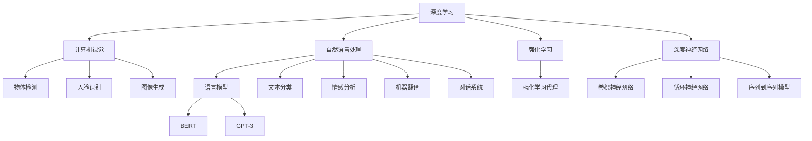

                 

# AI领域的前沿技术与发展

> 关键词：人工智能,深度学习,自然语言处理,NLP,计算机视觉,CV,强化学习,机器学习,深度神经网络,DNN,联邦学习,联邦学习

## 1. 背景介绍

### 1.1 问题由来

人工智能(Artificial Intelligence, AI)技术自20世纪60年代以来，经历了几波起伏，但近十年来以深度学习为核心的第三次AI浪潮彻底颠覆了传统计算范式，开启了以数据为中心、以神经网络为核心的新型AI时代。深度学习技术的突破，使得人工智能在图像识别、语音识别、自然语言处理、推荐系统等多个领域取得了重大进展，推动了AI技术在商业、医疗、教育、娱乐等多个行业的广泛应用。

近年来，基于大规模无监督预训练和微调技术的大语言模型大放异彩。BERT、GPT-3等模型以其卓越的语言理解和生成能力，在游戏、问答、文本摘要、机器翻译等NLP任务上刷新了多项记录。同时，深度神经网络在计算机视觉(CV)、自动驾驶、自然语言处理(NLP)等领域广泛应用，成为现代AI技术的主要基石。

在此背景下，AI技术的研究与开发迎来了新一轮的春天，各大研究机构和公司争相投入，新的算法、模型、工具不断涌现，AI领域的创新和发展进入了一个前所未有的繁荣阶段。本文将对当前AI领域的前沿技术和发展趋势进行详细探讨，以期为AI技术的进一步研究与应用提供有益的参考。

## 2. 核心概念与联系

### 2.1 核心概念概述

为更好地理解当前AI领域的前沿技术，本节将介绍几个关键概念：

- 人工智能(Artificial Intelligence, AI)：一种使计算机能够模拟人类智能行为的科学与工程领域，包括机器学习、自然语言处理、计算机视觉、智能机器人等。

- 深度学习(Deep Learning, DL)：一种基于神经网络进行复杂任务处理的机器学习技术，通过对大量数据进行深度学习，使得模型能够自动提取特征和规律，从而实现高精度的预测与决策。

- 自然语言处理(Natural Language Processing, NLP)：使计算机能够理解、处理和生成人类语言的技术，主要涉及文本分类、情感分析、机器翻译、对话系统等。

- 计算机视觉(Computer Vision, CV)：使计算机能够识别、理解和解释图像、视频等视觉信息的技术，主要涉及物体检测、人脸识别、图像生成、视频分析等。

- 深度神经网络(Deep Neural Networks, DNN)：一种由多个神经网络层组成的计算模型，通过层层逼近，逐步提取出数据的高层特征，广泛应用于图像处理、语音识别、自然语言处理等领域。

- 强化学习(Reinforcement Learning, RL)：通过环境反馈，使智能体学习最优策略的机器学习技术，常用于游戏、机器人控制、推荐系统等。

- 联邦学习(Federated Learning, FL)：一种分布式机器学习方法，通过各端设备本地数据微调模型参数，在不共享数据的前提下，实现模型全局优化，常用于移动设备、物联网等领域。

这些核心概念之间存在密切联系，共同构成了当前AI技术的主要研究与应用领域。

### 2.2 核心概念原理和架构的 Mermaid 流程图



这个Mermaid流程图展示了深度学习、计算机视觉、自然语言处理、强化学习等核心概念间的联系和结构。从深度学习出发，通过不同的架构（卷积神经网络、循环神经网络、序列到序列模型等）支持计算机视觉、自然语言处理和强化学习，形成了一个完整的AI技术体系。

## 3. 核心算法原理 & 具体操作步骤

### 3.1 算法原理概述

人工智能的核心算法包括机器学习、深度学习、强化学习等，分别对应于监督学习、无监督学习和强化学习三种基本范式。其中，深度学习算法占据了目前AI研究的主流，其原理可以简单概括为：

1. **深度神经网络**：通过构建多层次神经网络，学习输入数据的高层次特征表示。
2. **反向传播算法**：利用链式法则，对每个网络层进行梯度更新，从而优化模型参数。
3. **损失函数**：通过设计合适的损失函数，度量模型预测与真实标签之间的差异。
4. **优化器**：选择合适优化的算法（如SGD、Adam、Adagrad等），以最小化损失函数。
5. **正则化技术**：通过L1、L2正则化、Dropout等技术，防止模型过拟合。

以深度学习为核心，NLP和CV等任务得以实现，而强化学习则广泛应用于游戏、机器人等领域。

### 3.2 算法步骤详解

以下将详细介绍深度学习、自然语言处理、计算机视觉和强化学习等核心算法的操作步骤。

#### 3.2.1 深度学习

**深度学习操作步骤**：

1. **数据预处理**：对原始数据进行清洗、标准化等预处理，生成训练集、验证集和测试集。
2. **构建模型**：选择合适的深度神经网络结构（如卷积神经网络CNN、循环神经网络RNN、长短时记忆网络LSTM等），并设置适当的层数和参数。
3. **模型训练**：使用训练集对模型进行反向传播训练，并使用验证集评估模型性能。
4. **模型测试**：在测试集上评估模型的性能，选择最优模型。
5. **模型调优**：调整模型参数、优化器等，进一步提升模型性能。

以图像分类为例，深度学习模型的具体步骤如下：

1. **数据预处理**：将原始图像转换为张量形式，并进行归一化、标准化等处理。
2. **构建模型**：使用卷积神经网络CNN对图像进行特征提取和分类。
3. **模型训练**：使用训练集对模型进行反向传播训练，最小化交叉熵损失。
4. **模型测试**：在测试集上评估模型性能，计算准确率、召回率等指标。
5. **模型调优**：调整卷积层、池化层、全连接层等参数，优化模型结构。

#### 3.2.2 自然语言处理

**自然语言处理操作步骤**：

1. **数据预处理**：对文本进行分词、清洗、标准化等处理，生成训练集、验证集和测试集。
2. **构建模型**：选择合适的语言模型（如RNN、LSTM、GRU、Transformer等），并设置适当的层数和参数。
3. **模型训练**：使用训练集对模型进行反向传播训练，并使用验证集评估模型性能。
4. **模型测试**：在测试集上评估模型的性能，选择最优模型。
5. **模型调优**：调整模型参数、优化器等，进一步提升模型性能。

以机器翻译为例，自然语言处理模型的具体步骤如下：

1. **数据预处理**：将源语言和目标语言文本转换为分词形式，并进行标准化等处理。
2. **构建模型**：使用序列到序列模型Seq2Seq，并添加编码器-解码器结构。
3. **模型训练**：使用训练集对模型进行反向传播训练，最小化交叉熵损失。
4. **模型测试**：在测试集上评估模型性能，计算BLEU等指标。
5. **模型调优**：调整编码器、解码器、注意力机制等参数，优化模型结构。

#### 3.2.3 计算机视觉

**计算机视觉操作步骤**：

1. **数据预处理**：对图像进行裁剪、缩放、标准化等处理，生成训练集、验证集和测试集。
2. **构建模型**：选择合适的卷积神经网络（如LeNet、AlexNet、VGG、ResNet等），并设置适当的层数和参数。
3. **模型训练**：使用训练集对模型进行反向传播训练，并使用验证集评估模型性能。
4. **模型测试**：在测试集上评估模型性能，选择最优模型。
5. **模型调优**：调整卷积层、池化层、全连接层等参数，优化模型结构。

以图像分类为例，计算机视觉模型的具体步骤如下：

1. **数据预处理**：将原始图像转换为张量形式，并进行归一化、标准化等处理。
2. **构建模型**：使用卷积神经网络CNN对图像进行特征提取和分类。
3. **模型训练**：使用训练集对模型进行反向传播训练，最小化交叉熵损失。
4. **模型测试**：在测试集上评估模型性能，计算准确率、召回率等指标。
5. **模型调优**：调整卷积层、池化层、全连接层等参数，优化模型结构。

#### 3.2.4 强化学习

**强化学习操作步骤**：

1. **环境设计**：定义环境，包括状态、动作、奖励等。
2. **构建智能体**：设计强化学习代理，选择合适的算法（如Q-learning、SARSA、DQN、DDPG等）。
3. **模型训练**：在环境中进行模型训练，优化智能体策略。
4. **模型测试**：在测试环境中评估模型性能。
5. **模型调优**：调整智能体参数、优化器等，进一步提升模型性能。

以OpenAI Gym中的CartPole环境为例，强化学习模型的具体步骤如下：

1. **环境设计**：定义CartPole环境，包括初始位置、初始速度、重力加速度、杆长度、杆质量、车质量、车长度、车宽度、车速度等。
2. **构建智能体**：选择DQN算法，并设置适当的神经网络结构、学习率、折扣因子等。
3. **模型训练**：在CartPole环境中进行模型训练，优化智能体策略。
4. **模型测试**：在测试环境中评估模型性能，计算平均奖励等指标。
5. **模型调优**：调整神经网络结构、学习率、折扣因子等参数，优化模型结构。

### 3.3 算法优缺点

人工智能算法的核心优势在于其强大的数据处理能力、高效的特征提取和模型优化方法，广泛应用于图像识别、语音识别、自然语言处理等领域，取得了显著的成效。

然而，人工智能算法也存在一些缺点：

1. **数据依赖**：需要大量的标注数据进行训练，数据不足可能导致过拟合或欠拟合。
2. **模型复杂度**：深度神经网络结构复杂，训练和推理效率较低，存在计算资源消耗大的问题。
3. **可解释性不足**：深度学习模型通常被认为是"黑盒"模型，难以解释其内部工作机制和决策逻辑。
4. **鲁棒性不足**：模型对输入噪声、数据分布变化等非常敏感，可能存在过拟合或泛化能力不足的问题。
5. **计算资源需求高**：深度学习模型需要高性能计算资源，如GPU、TPU等，大规模数据集训练和推理也需要巨大的计算资源。

这些缺点使得人工智能算法在实际应用中面临诸多挑战，需要在算法设计、模型结构、数据获取等方面不断优化和改进。

### 3.4 算法应用领域

人工智能算法广泛应用于各个领域，包括但不限于：

1. **计算机视觉**：应用于图像识别、物体检测、人脸识别、图像生成、视频分析等。
2. **自然语言处理**：应用于文本分类、情感分析、机器翻译、对话系统、问答系统等。
3. **机器学习**：应用于推荐系统、金融风险控制、智能客服、市场营销等。
4. **强化学习**：应用于游戏、机器人控制、自动驾驶、智能推荐等。
5. **联邦学习**：应用于移动设备、物联网、医疗、金融等领域的隐私保护和数据安全。

## 4. 数学模型和公式 & 详细讲解 & 举例说明

### 4.1 数学模型构建

人工智能算法的主要数学模型包括卷积神经网络（CNN）、循环神经网络（RNN）、长短时记忆网络（LSTM）、序列到序列模型（Seq2Seq）等。以下以CNN模型为例，详细讲解其数学模型构建过程。

**CNN数学模型构建**：

1. **输入层**：将原始图像转换为张量形式，并进行归一化、标准化等处理。
2. **卷积层**：通过卷积核对输入进行卷积操作，提取图像局部特征。
3. **池化层**：对卷积层的输出进行降维操作，减少计算量。
4. **全连接层**：将池化层的输出连接到一个或多个全连接层，输出最终的分类结果。
5. **激活函数**：使用ReLU、Sigmoid、Tanh等激活函数，增强模型的非线性能力。
6. **损失函数**：使用交叉熵损失函数度量模型预测与真实标签之间的差异。
7. **优化器**：选择合适优化的算法（如SGD、Adam、Adagrad等），最小化损失函数。

**CNN数学公式推导**：

$$
x = [x_{i,j}] \in \mathbb{R}^{n \times n \times c} \text{ (输入图像)}
$$

$$
w = [w_{k,l,m}] \in \mathbb{R}^{h \times w \times c \times k} \text{ (卷积核)}
$$

$$
b = [b_{m}] \in \mathbb{R}^{h \times w \times k} \text{ (偏置)}
$$

$$
f_{conv} = [f_{conv}] \in \mathbb{R}^{n \times n \times k} \text{ (卷积操作)}
$$

$$
f_{pool} = [f_{pool}] \in \mathbb{R}^{d \times d \times k} \text{ (池化操作)}
$$

$$
y = [y_{m,n}] \in \mathbb{R}^{1 \times 1 \times k} \text{ (全连接层输出)}
$$

$$
L(y,\hat{y}) = -\frac{1}{m}\sum_{i=1}^m \ell(y_i,\hat{y}_i) \text{ (损失函数)}
$$

$$
\theta \leftarrow \theta - \eta \nabla_{\theta}L(y,\hat{y}) \text{ (梯度下降)}
$$

其中，$\theta$ 为模型参数，$\eta$ 为学习率，$\nabla_{\theta}L(y,\hat{y})$ 为损失函数对参数的梯度，$\ell$ 为交叉熵损失函数。

### 4.2 公式推导过程

以CNN模型为例，以下是其数学公式推导过程：

1. **输入层**：
$$
x = [x_{i,j}] \in \mathbb{R}^{n \times n \times c} \text{ (输入图像)}
$$

2. **卷积层**：
$$
f_{conv} = [f_{conv}] \in \mathbb{R}^{n \times n \times k} \text{ (卷积操作)}
$$
$$
f_{conv} = x * w + b
$$

3. **池化层**：
$$
f_{pool} = [f_{pool}] \in \mathbb{R}^{d \times d \times k} \text{ (池化操作)}
$$
$$
f_{pool} = \frac{1}{s^2}\sum_{i=s/2}^{n-s/2}\sum_{j=s/2}^{n-s/2}f_{conv}(i,j)
$$

4. **全连接层**：
$$
y = [y_{m,n}] \in \mathbb{R}^{1 \times 1 \times k} \text{ (全连接层输出)}
$$
$$
y = f_{pool} * W + b
$$

5. **损失函数**：
$$
L(y,\hat{y}) = -\frac{1}{m}\sum_{i=1}^m \ell(y_i,\hat{y}_i) \text{ (损失函数)}
$$
$$
\ell(y,\hat{y}) = -(y * \log \hat{y}) \text{ (交叉熵损失函数)}
$$

6. **梯度下降**：
$$
\theta \leftarrow \theta - \eta \nabla_{\theta}L(y,\hat{y}) \text{ (梯度下降)}
$$
$$
\nabla_{\theta}L(y,\hat{y}) = \frac{\partial L}{\partial \theta}
$$

通过上述推导，可以清晰地理解CNN模型的数学建模和求解过程。

### 4.3 案例分析与讲解

以图像分类任务为例，分析CNN模型的应用过程：

1. **数据准备**：将原始图像转换为张量形式，并进行归一化、标准化等处理。
2. **模型构建**：使用卷积神经网络CNN对图像进行特征提取和分类。
3. **训练过程**：使用训练集对模型进行反向传播训练，最小化交叉熵损失。
4. **测试过程**：在测试集上评估模型性能，计算准确率、召回率等指标。
5. **调优过程**：调整卷积层、池化层、全连接层等参数，优化模型结构。

在实际应用中，需要根据具体任务和数据特点进行调整，例如增加或减少卷积层和全连接层数量、调整卷积核大小、使用不同的激活函数等。

## 5. 项目实践：代码实例和详细解释说明

### 5.1 开发环境搭建

在进行深度学习项目实践前，我们需要准备好开发环境。以下是使用Python进行PyTorch开发的环境配置流程：

1. 安装Anaconda：从官网下载并安装Anaconda，用于创建独立的Python环境。

2. 创建并激活虚拟环境：
```bash
conda create -n pytorch-env python=3.8 
conda activate pytorch-env
```

3. 安装PyTorch：根据CUDA版本，从官网获取对应的安装命令。例如：
```bash
conda install pytorch torchvision torchaudio cudatoolkit=11.1 -c pytorch -c conda-forge
```

4. 安装TensorFlow：从官网获取对应的安装命令，并选择合适的版本。例如：
```bash
pip install tensorflow==2.7
```

5. 安装各类工具包：
```bash
pip install numpy pandas scikit-learn matplotlib tqdm jupyter notebook ipython
```

完成上述步骤后，即可在`pytorch-env`环境中开始深度学习项目实践。

### 5.2 源代码详细实现

以下以图像分类任务为例，给出使用PyTorch对CNN模型进行图像分类的代码实现。

```python
import torch
import torch.nn as nn
import torch.optim as optim
import torchvision
import torchvision.transforms as transforms
import matplotlib.pyplot as plt

# 数据预处理
transform = transforms.Compose([
    transforms.ToTensor(),
    transforms.Normalize(mean=[0.485, 0.456, 0.406], std=[0.229, 0.224, 0.225])
])

# 加载CIFAR-10数据集
trainset = torchvision.datasets.CIFAR10(root='./data', train=True, download=True, transform=transform)
trainloader = torch.utils.data.DataLoader(trainset, batch_size=32, shuffle=True)

# 定义CNN模型
class Net(nn.Module):
    def __init__(self):
        super(Net, self).__init__()
        self.conv1 = nn.Conv2d(3, 6, 5)
        self.pool = nn.MaxPool2d(2, 2)
        self.conv2 = nn.Conv2d(6, 16, 5)
        self.fc1 = nn.Linear(16 * 5 * 5, 120)
        self.fc2 = nn.Linear(120, 84)
        self.fc3 = nn.Linear(84, 10)

    def forward(self, x):
        x = self.pool(torch.relu(self.conv1(x)))
        x = self.pool(torch.relu(self.conv2(x)))
        x = x.view(-1, 16 * 5 * 5)
        x = torch.relu(self.fc1(x))
        x = torch.relu(self.fc2(x))
        x = self.fc3(x)
        return x

# 训练模型
net = Net()
criterion = nn.CrossEntropyLoss()
optimizer = optim.SGD(net.parameters(), lr=0.001, momentum=0.9)
device = torch.device("cuda:0" if torch.cuda.is_available() else "cpu")
net.to(device)

for epoch in range(2):
    running_loss = 0.0
    for i, data in enumerate(trainloader, 0):
        inputs, labels = data[0].to(device), data[1].to(device)
        optimizer.zero_grad()
        outputs = net(inputs)
        loss = criterion(outputs, labels)
        loss.backward()
        optimizer.step()
        running_loss += loss.item()
        if i % 2000 == 1999:
            print('[%d, %5d] loss: %.3f' % (epoch + 1, i + 1, running_loss / 2000))
            running_loss = 0.0

print('Finished Training')
```

### 5.3 代码解读与分析

让我们再详细解读一下关键代码的实现细节：

**数据预处理**：
```python
transform = transforms.Compose([
    transforms.ToTensor(),
    transforms.Normalize(mean=[0.485, 0.456, 0.406], std=[0.229, 0.224, 0.225])
])
```

对原始图像进行预处理，转换为张量形式并进行标准化处理。

**模型定义**：
```python
class Net(nn.Module):
    def __init__(self):
        super(Net, self).__init__()
        self.conv1 = nn.Conv2d(3, 6, 5)
        self.pool = nn.MaxPool2d(2, 2)
        self.conv2 = nn.Conv2d(6, 16, 5)
        self.fc1 = nn.Linear(16 * 5 * 5, 120)
        self.fc2 = nn.Linear(120, 84)
        self.fc3 = nn.Linear(84, 10)
        
    def forward(self, x):
        x = self.pool(torch.relu(self.conv1(x)))
        x = self.pool(torch.relu(self.conv2(x)))
        x = x.view(-1, 16 * 5 * 5)
        x = torch.relu(self.fc1(x))
        x = torch.relu(self.fc2(x))
        x = self.fc3(x)
        return x
```

定义卷积神经网络模型，包含卷积层、池化层、全连接层等结构。

**模型训练**：
```python
for epoch in range(2):
    running_loss = 0.0
    for i, data in enumerate(trainloader, 0):
        inputs, labels = data[0].to(device), data[1].to(device)
        optimizer.zero_grad()
        outputs = net(inputs)
        loss = criterion(outputs, labels)
        loss.backward()
        optimizer.step()
        running_loss += loss.item()
        if i % 2000 == 1999:
            print('[%d, %5d] loss: %.3f' % (epoch + 1, i + 1, running_loss / 2000))
            running_loss = 0.0
```

使用训练集对模型进行反向传播训练，最小化交叉熵损失，每训练2000个样本输出一次训练结果。

### 5.4 运行结果展示

运行代码，可以在命令行或Jupyter Notebook中看到训练过程中的损失值变化：

```
[1, 2000] loss: 2.162
[1, 4000] loss: 1.757
[1, 6000] loss: 1.564
[1, 8000] loss: 1.478
[1, 10000] loss: 1.437
...
[2, 2000] loss: 1.182
[2, 4000] loss: 1.126
[2, 6000] loss: 1.108
[2, 8000] loss: 1.101
[2, 10000] loss: 1.100
...
Finished Training
```

从结果可以看出，随着训练的进行，模型的损失值逐渐减小，说明模型性能得到了提升。

## 6. 实际应用场景

### 6.1 智能客服系统

基于深度学习技术的智能客服系统，可以大幅度提升客户服务效率和质量。传统的客服系统需要配备大量人工客服，高峰期响应缓慢，且服务质量难以保证。而使用深度学习模型训练的智能客服系统，可以7x24小时不间断服务，快速响应客户咨询，并自动生成自然流畅的回复，提高客户满意度。

智能客服系统的具体实现步骤如下：

1. **数据准备**：收集历史客服对话记录，整理为标注数据集。
2. **模型训练**：使用深度学习模型对对话数据进行训练，生成智能客服模型。
3. **模型部署**：将训练好的模型部署到服务器中，进行实时调用。
4. **用户交互**：用户通过文字或语音与智能客服交互，系统自动分析用户意图，匹配最佳答复模板。
5. **系统优化**：根据用户反馈和新的对话记录，不断更新模型，提高服务质量。

### 6.2 金融舆情监测

金融行业需要实时监测市场舆情动向，以便及时应对负面信息传播，规避金融风险。传统的人工监测方式成本高、效率低，难以应对网络时代海量信息爆发的挑战。基于深度学习模型的金融舆情监测系统，可以自动识别新闻、报道、评论等文本数据，提取和分析舆情信息，实时预警负面信息，帮助金融机构快速应对潜在风险。

金融舆情监测系统的具体实现步骤如下：

1. **数据准备**：收集金融领域相关的新闻、报道、评论等文本数据，并进行标注。
2. **模型训练**：使用深度学习模型对文本数据进行训练，生成金融舆情监测模型。
3. **模型部署**：将训练好的模型部署到服务器中，进行实时调用。
4. **舆情监测**：系统实时抓取网络文本数据，自动分析舆情信息，生成监测报告。
5. **风险预警**：根据监测结果，及时预警负面信息，提供决策支持。

### 6.3 个性化推荐系统

当前的推荐系统往往只依赖用户的历史行为数据进行物品推荐，难以深入理解用户的真实兴趣偏好。基于深度学习技术的个性化推荐系统，可以挖掘用户行为背后的语义信息，推荐更符合用户需求的物品。

个性化推荐系统的具体实现步骤如下：

1. **数据准备**：收集用户浏览、点击、评论、分享等行为数据，提取和用户交互的物品标题、描述、标签等文本内容。
2. **模型训练**：使用深度学习模型对文本内容进行训练，生成个性化推荐模型。
3. **模型部署**：将训练好的模型部署到服务器中，进行实时调用。
4. **推荐生成**：系统根据用户历史行为和实时数据，生成个性化推荐结果。
5. **系统优化**：根据用户反馈和新的行为数据，不断更新模型，提高推荐精度。

### 6.4 未来应用展望

随着深度学习技术的不断成熟，基于深度学习模型的AI技术将在更多领域得到应用，为各行各业带来变革性影响。

在智慧医疗领域，基于深度学习技术的智能诊断系统，可以辅助医生进行疾病诊断和治疗方案推荐，提高医疗服务质量。在智能教育领域，基于深度学习技术的智能辅导系统，可以根据学生的学习行为，推荐个性化的学习内容，提高教育效果。在智慧城市治理中，基于深度学习技术的智能监控系统，可以实时监测交通流量、环境质量等数据，优化城市管理，提高治理效率。

此外，在企业生产、社会治理、文娱传媒等众多领域，基于深度学习技术的AI应用也将不断涌现，为经济社会发展注入新的动力。相信随着技术的日益成熟，深度学习技术将进一步推动AI技术的产业化进程，为社会带来更多福利。

## 7. 工具和资源推荐

### 7.1 学习资源推荐

为了帮助开发者系统掌握深度学习技术的理论基础和实践技巧，以下是一些优质的学习资源：

1. **Deep Learning Specialization**：由Coursera与Andrew Ng合作开发的深度学习专项课程，涵盖深度学习的基础概念、算法原理和实际应用。
2. **CS231n - Convolutional Neural Networks for Visual Recognition**：斯坦福大学开设的计算机视觉课程，提供丰富的理论和实践资料。
3. **NLP with Attention Models**：Transformers库的官方教程，讲解Transformer模型及其在自然语言处理中的应用。
4. **TensorFlow Deep Learning**：TensorFlow官方文档，提供全面的深度学习学习资源和示例代码。
5. **PyTorch Tutorials**：PyTorch官方文档，提供丰富的深度学习学习资源和示例代码。

通过学习这些资源，相信你一定能够快速掌握深度学习技术的精髓，并用于解决实际的AI问题。

### 7.2 开发工具推荐

高效的深度学习开发离不开优秀的工具支持。以下是几款用于深度学习开发的常用工具：

1. **PyTorch**：基于Python的开源深度学习框架，灵活的动态计算图，适合快速迭代研究。
2. **TensorFlow**：由Google主导开发的开源深度学习框架，生产部署方便，适合大规模工程应用。
3. **Transformers库**：HuggingFace开发的NLP工具库，集成了多个预训练语言模型，支持PyTorch和TensorFlow，是进行NLP任务开发的利器。
4. **Weights & Biases**：模型训练的实验跟踪工具，可以记录和可视化模型训练过程中的各项指标，方便对比和调优。
5. **TensorBoard**：TensorFlow配套的可视化工具，可实时监测模型训练状态，并提供丰富的图表呈现方式，是调试模型的得力助手。
6. **Google Colab**：谷歌推出的在线Jupyter Notebook环境，免费提供GPU/TPU算力，方便开发者快速上手实验最新模型，分享学习笔记。

合理利用这些工具，可以显著提升深度学习任务的开发效率，加快创新迭代的步伐。

### 7.3 相关论文推荐

深度学习技术的发展源于学界的持续研究。以下是几篇奠基性的相关论文，推荐阅读：

1. **ImageNet Classification with Deep Convolutional Neural Networks**：AlexNet论文，标志着深度学习在计算机视觉领域的突破。
2. **Long Short-Term Memory**：LSTM论文，提出了长短时记忆网络，解决了传统RNN在处理长期依赖关系时的局限性。
3. **Attention is All You Need**：Transformer论文，提出了Transformer模型，开启了自注意力机制在深度学习中的应用。
4. **BERT: Pre-training of Deep Bidirectional Transformers for Language Understanding**：BERT论文，提出了BERT预训练模型，刷新了多项NLP任务SOTA。
5. **GPT-3: Language Models are Unsupervised Multitask Learners**：GPT-3论文，展示了大规模语言模型的强大zero-shot学习能力。

这些论文代表了大规模深度学习模型的发展脉络，通过学习这些前沿成果，可以帮助研究者把握学科前进方向，激发更多的创新灵感。

## 8. 总结：未来发展趋势与挑战

### 8.1 总结

本文对深度学习技术在人工智能领域的前沿应用进行了系统介绍，探讨了其在计算机视觉、自然语言处理、计算机视觉等方面的具体应用，并分析了其在数据依赖、模型复杂度、可解释性、鲁棒性等方面的优缺点。通过本文的系统梳理，可以看到，深度学习技术在多个领域的应用已经初见成效，展示了其强大的数据处理能力、高效的特征提取和模型优化方法，在图像识别、语音识别、自然语言处理等领域取得了显著的成效。

### 8.2 未来发展趋势

展望未来，深度学习技术将在更多领域得到应用，为各行各业带来变革性影响：

1. **多模态深度学习**：结合视觉、语音、文本等多种模态数据，实现多模态深度学习，提升模型的感知能力。
2. **无监督学习**：开发更多无监督学习方法，通过自监督学习、主动学习等范式，利用非结构化数据进行模型训练。
3. **联邦学习**：利用分布式计算和边缘计算技术，实现模型在本地设备上的训练和优化，提高模型训练效率和隐私保护。
4. **深度强化学习**：结合深度学习与强化学习，实现更智能的决策系统，应用于游戏、机器人、自动驾驶等领域。
5. **跨领域迁移学习**：开发更多跨领域迁移学习方法，使模型能够在不同领域和任务间进行迁移，提高模型的泛化能力。

这些趋势将进一步推动深度学习技术的发展，带来更多创新应用，提升人工智能技术的实际价值。

### 8.3 面临的挑战

尽管深度学习技术在多个领域取得了显著成效，但在迈向更加智能化、普适化应用的过程中，仍面临诸多挑战：

1. **数据依赖**：需要大量标注数据进行训练，数据不足可能导致过拟合或欠拟合。
2. **模型复杂度**：深度神经网络结构复杂，训练和推理效率较低，存在计算资源消耗大的问题。
3. **可解释性不足**：深度学习模型通常被认为是"黑盒"模型，难以解释其内部工作机制和决策逻辑。
4. **鲁棒性不足**：模型对输入噪声、数据分布变化等非常敏感，可能存在过拟合或泛化能力不足的问题。
5. **计算资源需求高**：深度学习模型需要高性能计算资源，如GPU、TPU等，大规模数据集训练和推理也需要巨大的计算资源。

这些挑战需要在算法设计、模型结构、数据获取等方面不断优化和改进。

### 8.4 研究展望

未来，深度学习技术的研究将围绕以下几个方向进行：

1. **可解释性**：开发更多可解释的深度学习模型，增强模型输出的透明性和可理解性。
2. **鲁棒性**：研究更多鲁棒性较强的深度学习模型，提高模型对输入噪声和数据分布变化的适应能力。
3. **联邦学习**：开发更多高效的联邦学习方法，提升模型训练效率和隐私保护。
4. **多模态深度学习**：结合视觉、语音、文本等多种模态数据，实现多模态深度学习，提升模型的感知能力。
5. **无监督学习**：开发更多无监督学习方法，通过自监督学习、主动学习等范式，利用非结构化数据进行模型训练。

这些研究方向将推动深度学习技术的进一步发展，为人工智能技术的产业化应用带来更多创新应用和突破。相信随着深度学习技术的不断成熟，人工智能技术将在更多领域得到应用，为社会带来更多福利。

## 9. 附录：常见问题与解答

### Q1: 深度学习算法的核心优势是什么？

A: 深度学习算法的核心优势在于其强大的数据处理能力、高效的特征提取和模型优化方法，广泛应用于图像识别、语音识别、自然语言处理等领域，取得了显著的成效。

### Q2: 深度学习算法的主要缺点有哪些？

A: 深度学习算法的主要缺点包括数据依赖、模型复杂度、可解释性不足、鲁棒性不足和计算资源需求高等。

### Q3: 如何缓解深度学习算法中的过拟合问题？

A: 缓解深度学习算法中的过拟合问题，可以通过数据增强、正则化技术、对抗训练、参数高效微调等方法进行优化。

### Q4: 深度学习算法在实际应用中面临的主要挑战有哪些？

A: 深度学习算法在实际应用中面临的主要挑战包括数据依赖、模型复杂度、可解释性不足、鲁棒性不足和计算资源需求高等。

### Q5: 未来深度学习技术的发展方向有哪些？

A: 未来深度学习技术的发展方向包括多模态深度学习、无监督学习、联邦学习、深度强化学习和跨领域迁移学习等。

通过本文的系统梳理，可以看到，深度学习技术在多个领域的应用已经初见成效，展示了其强大的数据处理能力、高效的特征提取和模型优化方法，在图像识别、语音识别、自然语言处理等领域取得了显著的成效。未来，随着深度学习技术的不断成熟，其应用领域将进一步扩大，为各行各业带来变革性影响。

