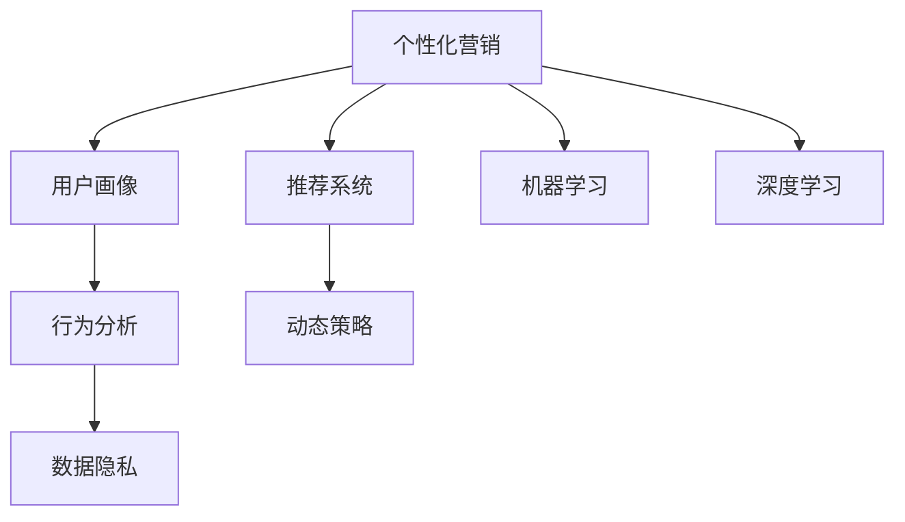

                 

# AI驱动的个性化营销：机遇与风险

> 关键词：个性化营销, 机器学习, 深度学习, 推荐系统, 用户画像, 数据隐私, 行为分析, 营销策略

## 1. 背景介绍

在数字化时代的浪潮中，市场营销的边界正迅速扩张。从传统的电视、报纸到如今的社交媒体、搜索引擎，品牌触达消费者的渠道日益增多。然而，面对海量的用户数据和不断变化的市场需求，传统的粗放式营销模式已难以适应。这正是AI驱动的个性化营销应运而生的时代背景。

个性化营销的核心在于利用数据分析、机器学习等技术手段，识别并分析用户的行为特征和偏好，实现精准的用户画像和动态化的营销策略。通过AI技术，企业能够深入洞察消费者的心理和行为，为每一位用户量身定制最适合的营销信息，从而大幅提升营销效率和转化率。

个性化营销的兴起，伴随着技术的进步和应用场景的不断拓展，也带来了新的机遇与挑战。本文将从AI驱动个性化营销的原理、实践、应用及未来展望四个方面，深入探讨这一领域的机遇与风险，为业界同仁提供参考。

## 2. 核心概念与联系

### 2.1 核心概念概述

为更好地理解AI驱动个性化营销的核心技术，本节将介绍几个关键概念：

- **个性化营销**：基于用户的行为数据、心理特征和偏好，量身定制个性化的营销内容和策略，以提高用户参与度和转化率。
- **机器学习**：一种让计算机通过数据学习，自动提升模型性能的技术，广泛应用于推荐系统、图像识别、自然语言处理等领域。
- **深度学习**：机器学习的一种高级形式，通过多层神经网络模型，自动从数据中提取抽象特征，实现更强的数据拟合能力。
- **推荐系统**：根据用户历史行为和兴趣，推荐相关产品或内容的技术，旨在提升用户满意度和营销效果。
- **用户画像**：通过对用户行为数据的分析，构建用户的多维度特征画像，为个性化推荐和精准营销提供基础。
- **数据隐私**：在收集和分析用户数据时，确保数据的安全和合法使用，避免侵犯用户隐私。

这些概念之间的逻辑关系可以通过以下Mermaid流程图来展示：



这个流程图展示了个性化营销的核心概念及其之间的关系：

1. 个性化营销通过用户画像和推荐系统，实现个性化推荐和精准营销。
2. 机器学习和深度学习提供数据分析和模型训练的技术支持。
3. 行为分析揭示用户行为模式，构建完整用户画像。
4. 数据隐私保障用户数据的安全合法使用。

## 3. 核心算法原理 & 具体操作步骤

### 3.1 算法原理概述

AI驱动个性化营销的实现主要基于机器学习和深度学习算法。其核心流程包括用户行为数据的收集与分析、用户画像的构建、推荐模型的训练和优化、营销策略的动态调整等。

首先，企业需要收集用户的行为数据，包括浏览记录、购买历史、互动行为等，构建完整的用户画像。然后，基于画像特征，使用推荐系统算法（如协同过滤、基于内容的推荐等），生成个性化的产品或内容推荐。最后，利用机器学习模型对推荐效果进行预测和优化，动态调整营销策略，实现个性化营销的闭环管理。

### 3.2 算法步骤详解

#### 3.2.1 用户行为数据的收集与预处理

用户行为数据的收集是个性化营销的第一步。这包括：

- 网站点击、浏览、停留时间等网页行为数据。
- 用户购买历史、支付行为、浏览商品列表等交易行为数据。
- 社交媒体互动、评论、点赞等社交行为数据。
- 用户的人口统计特征，如年龄、性别、职业等。

数据收集完成后，需要进行预处理，包括数据清洗、缺失值填充、特征工程等，以提升后续模型的性能。

#### 3.2.2 用户画像的构建

用户画像的构建是将用户的行为数据进行聚类和特征提取的过程，包括：

- 基于用户的浏览记录，提取兴趣标签，构建用户的兴趣画像。
- 分析用户的购买历史，提取购买行为特征，构建用户的消费画像。
- 利用自然语言处理技术，分析用户的评论和社交互动，构建用户的情感画像。
- 结合用户的地理位置、年龄、性别等人口统计特征，构建全面的用户画像。

#### 3.2.3 推荐模型的训练与优化

推荐系统基于用户画像和商品特征，使用协同过滤、基于内容的推荐、深度学习等算法进行训练和优化。常用的算法包括：

- 协同过滤算法：通过分析用户的历史行为，发现相似用户和商品，实现个性化推荐。
- 基于内容的推荐算法：利用商品属性和用户画像，推荐与用户兴趣匹配的商品。
- 深度学习推荐模型：如NeuMF、BERT4Rec等，通过多层神经网络模型，实现更强的数据拟合能力。

#### 3.2.4 营销策略的动态调整

营销策略的动态调整是基于推荐效果预测和反馈，对推荐模型和营销策略进行持续优化的过程。常用的方法包括：

- 利用A/B测试，评估不同营销策略的效果，选择最优方案。
- 实时分析推荐效果，调整推荐模型和算法参数。
- 结合用户反馈，动态调整营销内容和策略。

### 3.3 算法优缺点

AI驱动个性化营销的优势在于：

1. **精准推荐**：通过深度学习和大数据分析，能够实现对用户兴趣的精准预测，提升推荐准确性。
2. **提升转化率**：个性化营销能够提高用户参与度和满意度，从而提升转化率。
3. **成本优化**：利用AI技术，减少无效广告投放，优化广告预算分配，降低营销成本。

但其缺点也不容忽视：

1. **数据隐私问题**：收集和分析用户数据时，需严格遵守数据隐私法规，避免侵犯用户隐私。
2. **算法复杂性**：推荐模型和算法需要大量的数据和计算资源，设计复杂，实施难度大。
3. **过度个性化风险**：过度个性化可能导致用户陷入“信息茧房”，限制用户的选择范围。

### 3.4 算法应用领域

AI驱动个性化营销的应用领域广泛，主要包括以下几个方面：

- **电商推荐**：基于用户的浏览和购买行为，推荐相关商品，提升购物体验。
- **内容推荐**：如视频、音乐、文章等内容的个性化推荐，提升用户黏性和满意度。
- **营销自动化**：自动化营销策略的制定和执行，如广告投放、邮件营销等。
- **客户服务**：利用AI技术，实现智能客服、聊天机器人等客户服务自动化。
- **社交媒体分析**：分析用户互动数据，提升社交媒体营销效果。

## 4. 数学模型和公式 & 详细讲解 & 举例说明

### 4.1 数学模型构建

个性化营销的数学模型包括用户画像构建、推荐模型训练和营销策略调整等多个方面。以下以电商推荐系统为例，介绍其数学模型构建过程。

假设用户画像为 $U=\{x_1, x_2, \ldots, x_n\}$，其中 $x_i$ 表示第 $i$ 个用户特征；商品特征为 $I=\{y_1, y_2, \ldots, y_m\}$，其中 $y_j$ 表示第 $j$ 个商品特征。推荐系统目标是最小化预测误差，即：

$$
\min_{\theta} \sum_{i=1}^N \sum_{j=1}^M w_{i,j} (\hat{r}_{i,j} - r_{i,j})^2
$$

其中 $N$ 为训练样本数量，$M$ 为商品数量，$w_{i,j}$ 为样本 $i$ 对商品 $j$ 的权重，$\hat{r}_{i,j}$ 为模型预测的点击率，$r_{i,j}$ 为实际点击率。

### 4.2 公式推导过程

推荐系统常用的算法包括协同过滤和基于内容的推荐。以下是这两种算法的推导过程。

#### 协同过滤

协同过滤算法基于用户-商品矩阵 $R$，通过分析用户行为数据，推荐与用户兴趣相似的商品。其推导过程如下：

1. **用户-商品矩阵构建**：
   $$
   R = \begin{bmatrix}
   r_{1,1} & r_{1,2} & \ldots & r_{1,m} \\
   r_{2,1} & r_{2,2} & \ldots & r_{2,m} \\
   \vdots & \vdots & \ddots & \vdots \\
   r_{n,1} & r_{n,2} & \ldots & r_{n,m}
   \end{bmatrix}
   $$

2. **相似度计算**：
   $$
   \text{similarity}(i,j) = \frac{R_{i,j}}{\sqrt{\sum_{k=1}^m R_{i,k}^2}} \cdot \frac{R_{i,j}}{\sqrt{\sum_{k=1}^m R_{j,k}^2}}
   $$

3. **推荐商品**：
   $$
   \hat{r}_{i,j} = \sum_{k=1}^m \text{similarity}(i,k) \cdot r_{k,j}
   $$

#### 基于内容的推荐

基于内容的推荐算法通过分析商品属性和用户画像，推荐与用户兴趣匹配的商品。其推导过程如下：

1. **用户画像特征提取**：
   $$
   \mathbf{x}_i = [x_{i1}, x_{i2}, \ldots, x_{in}]
   $$

2. **商品特征向量构建**：
   $$
   \mathbf{y}_j = [y_{j1}, y_{j2}, \ldots, y_{jm}]
   $$

3. **相似度计算**：
   $$
   \text{similarity}(i,j) = \mathbf{x}_i \cdot \mathbf{y}_j
   $$

4. **推荐商品**：
   $$
   \hat{r}_{i,j} = \text{similarity}(i,j)
   $$

### 4.3 案例分析与讲解

以某电商平台的推荐系统为例，分析其推荐效果和优化过程。

**案例背景**：某电商平台拥有数百万用户和数十万商品，希望通过个性化推荐提升用户满意度。

**数据预处理**：收集用户浏览、购买、评分等行为数据，进行数据清洗、缺失值填充、特征工程等预处理。

**用户画像构建**：基于用户的浏览记录，提取兴趣标签；分析用户的购买历史，提取消费习惯；利用自然语言处理技术，分析用户的评论和社交互动，构建情感画像；结合用户的人口统计特征，构建全面的用户画像。

**推荐模型训练**：使用协同过滤算法和基于内容的推荐算法，训练推荐模型。在训练过程中，使用交叉验证等技术评估模型性能，调整算法参数和特征选择。

**营销策略调整**：利用A/B测试，评估不同推荐策略的效果，选择最优方案。根据实时反馈，调整推荐模型和算法参数。结合用户反馈，动态调整推荐内容和策略。

**推荐效果评估**：通过点击率、转化率等指标，评估推荐模型的性能，不断优化模型和策略，提升用户满意度。

## 5. 项目实践：代码实例和详细解释说明

### 5.1 开发环境搭建

在进行个性化营销系统开发前，我们需要准备好开发环境。以下是使用Python进行Pandas开发的环境配置流程：

1. 安装Anaconda：从官网下载并安装Anaconda，用于创建独立的Python环境。

2. 创建并激活虚拟环境：
```bash
conda create -n pythonscraper python=3.8 
conda activate pythonscraper
```

3. 安装Pandas：
```bash
pip install pandas
```

4. 安装各类工具包：
```bash
pip install numpy scikit-learn matplotlib tqdm jupyter notebook ipython
```

完成上述步骤后，即可在`pythonscraper`环境中开始个性化营销系统的开发。

### 5.2 源代码详细实现

下面我们以电商推荐系统为例，给出使用Pandas进行用户画像构建和推荐系统训练的Python代码实现。

```python
import pandas as pd
import numpy as np
from sklearn.decomposition import TruncatedSVD

# 读取用户数据和商品数据
user_data = pd.read_csv('user_data.csv')
item_data = pd.read_csv('item_data.csv')

# 用户画像构建
user_profile = user_data[['age', 'gender', 'location']] # 假设用户画像只包含年龄、性别和位置
user_profile['label'] = user_profile['age'] + user_profile['gender'] + user_profile['location']

# 商品画像构建
item_profile = item_data[['category', 'price']] # 假设商品画像只包含类别和价格
item_profile['label'] = item_profile['category'] + item_profile['price']

# 用户画像和商品画像合并
merged_data = pd.merge(user_profile, item_profile, on='label')

# 用户画像和商品画像的特征工程
merged_data['user_age'] = merged_data['age'].astype('float')
merged_data['user_gender'] = merged_data['gender'].astype('float')
merged_data['user_location'] = merged_data['location'].astype('float')
merged_data['item_category'] = merged_data['category'].astype('float')
merged_data['item_price'] = merged_data['price'].astype('float')

# 用户画像和商品画像的相似度计算
user_item_similarity = merged_data[['user_age', 'user_gender', 'user_location', 'item_category', 'item_price']].corr()

# 协同过滤推荐模型训练
svd = TruncatedSVD(n_components=50, random_state=42)
X = merged_data[['user_age', 'user_gender', 'user_location', 'item_category', 'item_price']]
X_svd = svd.fit_transform(X)
X_svd = np.concatenate([X_svd, user_item_similarity], axis=1)
X_svd = X_svd.todense()

# 推荐商品列表
top_n = 10
indices = svd.components_.argsort()[:top_n]
user_recommendations = merged_data.iloc[indices, 0:top_n] # 获取推荐商品列表

print(user_recommendations)
```

以上代码实现了基于协同过滤的电商推荐系统。首先，从用户和商品数据中提取画像特征，计算用户画像和商品画像之间的相似度，构建协同过滤推荐模型，最后输出推荐商品列表。

### 5.3 代码解读与分析

让我们再详细解读一下关键代码的实现细节：

**用户画像构建**：
- `user_data` 和 `item_data` 分别存储用户和商品的数据。
- `user_profile` 和 `item_profile` 从数据中提取关键特征。
- `merged_data` 通过合并用户画像和商品画像，生成一个包含画像特征的 DataFrame。

**特征工程**：
- 将画像特征转换为浮点数，以便进行数值计算。
- `merged_data` 中的特征包括年龄、性别、位置、类别和价格。

**相似度计算**：
- 使用Pandas的 `corr` 函数计算画像特征之间的相关性，生成相似度矩阵。
- 将相似度矩阵与画像特征矩阵拼接，生成包含画像特征和相似度的矩阵 `X_svd`。

**协同过滤推荐模型训练**：
- 使用TruncatedSVD算法对画像特征进行降维，生成低维的特征矩阵 `X_svd`。
- 训练协同过滤推荐模型，得到推荐商品列表 `user_recommendations`。

**运行结果展示**：
- 最后输出推荐商品列表 `user_recommendations`，包含推荐商品类别和价格信息。

以上代码实现了简单的电商推荐系统，展示了基于协同过滤的个性化推荐过程。在实际应用中，还需要对推荐模型进行优化，如使用深度学习推荐模型、考虑用户行为动态变化等因素。

## 6. 实际应用场景

### 6.1 电商推荐

基于AI驱动的个性化营销，电商推荐系统是最典型的应用场景。通过分析用户的浏览、购买和行为数据，电商推荐系统能够精准地推荐相关商品，提升用户购物体验，增加销售转化率。

**应用实例**：某大型电商平台的推荐系统通过个性化推荐，大幅提升了用户的购物满意度和复购率。通过分析用户的浏览和购买历史，推荐系统会实时生成个性化推荐商品，并在网站首页和购物车页面进行展示。用户点击推荐商品后的购买行为数据，又会实时反馈到推荐系统，进一步优化推荐策略。

### 6.2 内容推荐

内容推荐系统是AI驱动个性化营销的另一个重要应用场景。通过分析用户的历史观看记录、评分等行为数据，内容推荐系统能够为用户推荐相关视频、文章等，提升用户黏性和满意度。

**应用实例**：某视频平台的内容推荐系统通过分析用户的观看历史和评分数据，生成个性化的视频推荐列表。平台通过实时分析用户点击和播放数据，动态调整推荐算法和内容，提升推荐效果。此外，平台还利用机器学习模型，预测用户对新内容的兴趣，提前推荐相关视频，增强用户黏性。

### 6.3 营销自动化

营销自动化是AI驱动个性化营销的重要组成部分。通过自动化营销策略的制定和执行，企业能够提升营销效率，降低营销成本。

**应用实例**：某房地产公司的营销自动化系统通过分析用户的浏览和咨询记录，生成个性化的营销邮件和广告。系统根据用户的行为数据，自动调整邮件内容和发送时间，提升营销效果。此外，系统还利用AI技术，实时监测广告投放效果，自动优化广告预算分配，提升广告投资回报率。

### 6.4 未来应用展望

随着AI技术的不断进步，个性化营销的应用场景将进一步拓展。未来，以下几方面将迎来新的突破：

1. **多模态数据融合**：结合图像、视频、语音等多模态数据，构建更加全面的用户画像，提升推荐效果。
2. **实时动态调整**：利用实时数据分析和反馈，动态调整推荐策略，提升用户体验。
3. **深度学习推荐模型**：使用深度学习模型，提升推荐准确性和个性化程度。
4. **用户行为预测**：通过机器学习模型，预测用户行为和需求，实现更精准的个性化推荐。
5. **跨领域应用**：个性化营销技术将应用于更多领域，如金融、医疗、教育等，提升各行业的智能化水平。

## 7. 工具和资源推荐

### 7.1 学习资源推荐

为了帮助开发者系统掌握AI驱动个性化营销的理论基础和实践技巧，这里推荐一些优质的学习资源：

1. 《推荐系统实战》：详细介绍了推荐系统的理论基础和算法实现，包括协同过滤、基于内容的推荐、深度学习推荐等。
2. 《Python数据科学手册》：介绍了Python在数据处理和机器学习中的应用，包括Pandas、NumPy、Scikit-learn等库的使用。
3. 《深度学习入门：基于Python的理论与实现》：介绍了深度学习的基础理论和实现方法，包括神经网络、卷积神经网络、循环神经网络等。
4. Coursera《机器学习》课程：由斯坦福大学Andrew Ng教授讲授的机器学习入门课程，涵盖监督学习、非监督学习、神经网络等重要内容。
5. Kaggle：全球最大的数据科学竞赛平台，提供丰富的数据集和竞赛任务，帮助你实践和提升推荐系统算法。

通过对这些资源的学习实践，相信你一定能够快速掌握AI驱动个性化营销的精髓，并用于解决实际的推荐问题。

### 7.2 开发工具推荐

高效的开发离不开优秀的工具支持。以下是几款用于AI驱动个性化营销开发的常用工具：

1. Python：作为数据科学和机器学习的主流语言，Python提供了丰富的库和工具，如Pandas、NumPy、Scikit-learn等，适合数据处理和机器学习任务。
2. R：另一种数据科学和机器学习常用的语言，提供了ggplot2、caret等库，适合数据分析和机器学习任务。
3. Apache Spark：一个分布式计算框架，适合处理大规模数据集，支持机器学习和数据挖掘等任务。
4. TensorFlow：由Google开发的深度学习框架，支持各种深度学习模型，适合复杂推荐系统的实现。
5. PyTorch：由Facebook开发的深度学习框架，支持动态图和静态图，适合研究和实验任务。
6. Scikit-learn：一个Python机器学习库，提供了简单易用的API，适合数据预处理和模型训练任务。

合理利用这些工具，可以显著提升AI驱动个性化营销任务的开发效率，加快创新迭代的步伐。

### 7.3 相关论文推荐

AI驱动个性化营销的发展源于学界的持续研究。以下是几篇奠基性的相关论文，推荐阅读：

1. "A Factorization Approach to Learning the Semantic Representation of Texts"：提出了矩阵分解方法，用于分析和推荐文本数据。
2. "Collaborative Filtering for Implicit Feedback Datasets"：提出协同过滤算法，用于推荐系统中的隐式反馈数据。
3. "A Neural Collaborative Filtering Approach"：提出基于神经网络的推荐模型，提升了推荐系统的性能。
4. "Scalable Text Categorization Using Distributed Representations"：提出了基于词向量和卷积神经网络的文本分类方法，适用于推荐系统的用户画像构建。
5. "Deep Collaborative Filtering"：提出深度学习推荐模型，提升了推荐系统的精度和效果。

这些论文代表了个性化营销的最新进展，通过学习这些前沿成果，可以帮助研究者把握学科前进方向，激发更多的创新灵感。

## 8. 总结：未来发展趋势与挑战

### 8.1 总结

本文对AI驱动个性化营销的原理、实践、应用及未来展望进行了全面系统的介绍。首先，阐述了个性化营销的核心技术及其在电商、内容推荐、营销自动化等领域的应用。其次，从用户画像构建、推荐模型训练和营销策略调整等环节，详细讲解了个性化营销的实现过程。最后，分析了个性化营销的机遇与风险，展望了未来的发展趋势。

通过本文的系统梳理，可以看到，AI驱动个性化营销正成为现代营销的重要工具。其高效精准的特点，为各行业带来了显著的业务价值，推动了营销技术的发展。然而，个性化营销也面临数据隐私、算法复杂性和过度个性化等挑战，需要持续优化和改进。

### 8.2 未来发展趋势

展望未来，AI驱动个性化营销的发展趋势如下：

1. **多模态数据融合**：结合图像、视频、语音等多模态数据，构建更加全面的用户画像，提升推荐效果。
2. **实时动态调整**：利用实时数据分析和反馈，动态调整推荐策略，提升用户体验。
3. **深度学习推荐模型**：使用深度学习模型，提升推荐准确性和个性化程度。
4. **用户行为预测**：通过机器学习模型，预测用户行为和需求，实现更精准的个性化推荐。
5. **跨领域应用**：个性化营销技术将应用于更多领域，如金融、医疗、教育等，提升各行业的智能化水平。

### 8.3 面临的挑战

尽管AI驱动个性化营销技术已经取得了显著进展，但在迈向更加智能化、普适化应用的过程中，仍面临诸多挑战：

1. **数据隐私问题**：在收集和分析用户数据时，需严格遵守数据隐私法规，避免侵犯用户隐私。
2. **算法复杂性**：推荐模型和算法需要大量的数据和计算资源，设计复杂，实施难度大。
3. **过度个性化风险**：过度个性化可能导致用户陷入“信息茧房”，限制用户的选择范围。
4. **实时动态调整**：实时数据分析和反馈需要高效的处理能力和存储能力，难以应对大规模数据。
5. **用户行为预测**：预测用户行为需要大量的数据和复杂的模型，难以保证预测的准确性。

### 8.4 研究展望

面对AI驱动个性化营销所面临的挑战，未来的研究需要在以下几个方面寻求新的突破：

1. **提升数据隐私保护**：在推荐系统设计中，引入隐私保护技术，确保用户数据的安全和合法使用。
2. **优化算法性能**：开发更加高效的推荐算法，提升模型的训练速度和推理速度，降低资源消耗。
3. **减少过度个性化**：平衡个性化推荐和多样化推荐，避免用户陷入“信息茧房”，提升用户的多样化选择。
4. **提升实时动态调整能力**：采用流式数据处理和分布式计算技术，提升实时动态调整的效率和准确性。
5. **增强用户行为预测能力**：结合深度学习和符号化方法，提升用户行为预测的准确性和鲁棒性。

这些研究方向的探索，必将引领AI驱动个性化营销技术迈向更高的台阶，为构建更加智能、可靠、安全的推荐系统铺平道路。面向未来，AI驱动个性化营销技术还需要与其他人工智能技术进行更深入的融合，如知识表示、因果推理、强化学习等，多路径协同发力，共同推动推荐系统的进步。只有勇于创新、敢于突破，才能不断拓展个性化营销的边界，让推荐系统更好地服务于用户和社会。

## 9. 附录：常见问题与解答

**Q1：如何确保个性化营销的推荐效果？**

A: 个性化营销的推荐效果依赖于用户画像的准确性和推荐算法的有效性。为了确保推荐效果，可以采取以下措施：

1. 用户画像构建：从用户历史数据中提取全面的特征，如浏览记录、购买历史、社交互动等，构建多维度的用户画像。
2. 推荐算法优化：使用协同过滤、基于内容的推荐、深度学习推荐等算法，并结合A/B测试等方法不断优化推荐策略。
3. 实时数据分析：利用实时数据分析技术，动态调整推荐策略，确保推荐效果的实时性和稳定性。

**Q2：如何平衡个性化推荐和多样化推荐？**

A: 在个性化推荐中，过度个性化可能导致用户陷入“信息茧房”，限制用户的选择范围。为了平衡个性化推荐和多样化推荐，可以采取以下措施：

1. 引入多样性约束：在推荐模型中加入多样性约束，限制推荐的商品类别或属性的多样性。
2. 引入噪声推荐：在推荐列表中引入随机元素，增加推荐的多样性。
3. 用户自主选择：允许用户自定义推荐列表的展示方式和推荐频率，提升用户体验。

**Q3：如何处理推荐系统的冷启动问题？**

A: 冷启动问题是指新用户或新商品在系统中缺乏足够的历史数据，难以进行有效的推荐。为了解决冷启动问题，可以采取以下措施：

1. 利用先验知识：结合领域知识，如商品属性、类别等，进行推荐。
2. 利用相似度计算：通过分析已有的用户画像和商品画像，计算新用户和新商品的相似度，进行推荐。
3. 利用协同过滤：利用已有的用户行为数据，进行基于相似用户或相似商品的推荐。

这些措施可以帮助推荐系统在新用户或新商品情况下，提供可靠的推荐服务。

**Q4：如何处理推荐系统的稀疏性问题？**

A: 推荐系统的稀疏性问题是指用户-商品矩阵中的大部分位置缺乏有效的推荐数据。为了解决稀疏性问题，可以采取以下措施：

1. 数据增强：通过数据增强技术，如回译、近义替换等，丰富用户行为数据。
2. 矩阵分解：使用矩阵分解方法，将用户-商品矩阵分解成低维的向量表示，提高数据稀疏性问题的处理能力。
3. 迁移学习：利用预训练模型，将已有的知识迁移到新的任务中，提升推荐效果。

这些措施可以帮助推荐系统处理稀疏性问题，提升推荐效果和用户体验。

**Q5：如何保护用户隐私？**

A: 在个性化营销中，保护用户隐私至关重要。为了保护用户隐私，可以采取以下措施：

1. 匿名化处理：对用户数据进行匿名化处理，去除可能泄露用户身份的信息。
2. 数据最小化：仅收集和分析必要的用户数据，避免过度收集和分析。
3. 加密存储：对用户数据进行加密存储，防止数据泄露和篡改。
4. 合规审核：确保推荐系统符合数据隐私法规和行业标准，如GDPR、CCPA等。

这些措施可以帮助保护用户隐私，提升用户的信任感和满意度。

---

作者：禅与计算机程序设计艺术 / Zen and the Art of Computer Programming

