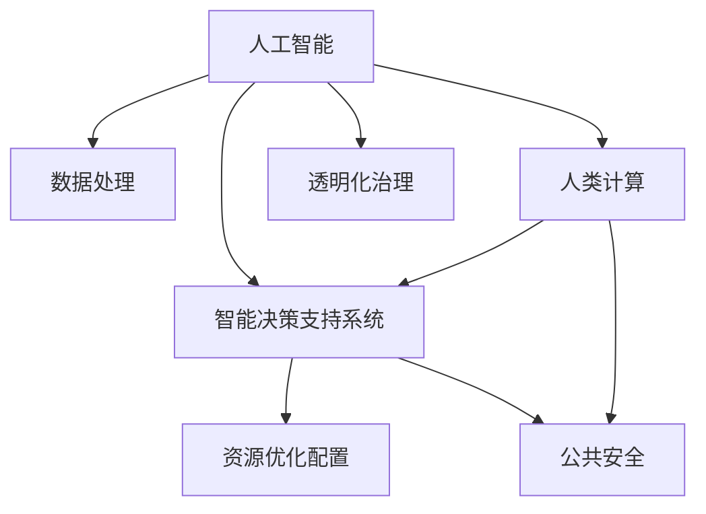

                 

# AI驱动的创新：人类计算在政府中的价值

> 关键词：人工智能, 人类计算, 政府治理, 数据处理, 机器学习, 决策支持系统, 大数据, 公共政策, 智能应用

## 1. 背景介绍

### 1.1 问题由来
在全球信息化的浪潮中，政府面临着前所未有的数据量和复杂度挑战。传统的决策支持系统已无法满足现代政府的治理需求，亟需一种高效、智能的解决方案。而人工智能(AI)技术的迅猛发展，为政府治理的现代化提供了新的可能。

通过AI技术，政府能够更快速、更精确地处理海量数据，提供精准的决策支持，优化资源配置，提升公共服务质量。然而，AI技术在政府中的应用，并不是一蹴而就的，需要在技术、数据、治理等多个层面进行深入探索和实践。本文将深入探讨AI技术在政府中的应用价值，并提出具体实现方案。

### 1.2 问题核心关键点
AI在政府中的应用，主要包括以下几个关键点：

- 数据处理与分析：政府需要处理海量数据，包括公共服务数据、税收数据、人口统计数据等，AI能够提供高效的数据处理与分析能力。
- 智能决策支持：AI可以辅助政府进行智能决策，提高决策的科学性和精准性。
- 资源优化配置：AI可以优化资源配置，提升政府公共服务的效率和质量。
- 公共安全保障：AI可以应用于公共安全领域，提升政府对突发事件的处理能力。
- 透明化治理：AI可以增强政府工作的透明性，提升公众对政府工作的信任度。

这些关键点构成了AI在政府治理中应用的框架，下面将逐一深入探讨。

## 2. 核心概念与联系

### 2.1 核心概念概述

为更好地理解AI在政府中的应用，本节将介绍几个密切相关的核心概念：

- 人工智能(Artificial Intelligence, AI)：一种通过计算机模拟人类智能的技术，包括机器学习、自然语言处理、计算机视觉等多个领域。
- 人类计算(Human Computation)：指通过大规模人类计算参与的数据标注、任务标注等，辅助AI模型训练的过程。
- 政府治理(Government Governance)：指政府如何运用各种手段和措施，对国家和社会进行有效管理，实现社会稳定和发展的过程。
- 数据处理(Data Processing)：指对原始数据进行清洗、转换、处理等操作，使其成为可供分析的形态。
- 智能决策支持系统(Intelligent Decision Support System, IDSS)：一种利用AI技术提供决策支持的系统，能够辅助政府进行更精准、高效的决策。
- 公共安全(Public Security)：指政府对社会治安、公共卫生等公共安全问题的管理。
- 透明化治理(Transparent Governance)：指政府通过AI技术提高治理工作的透明性，提升公众信任度。

这些核心概念之间的逻辑关系可以通过以下Mermaid流程图来展示：



这个流程图展示了大语言模型的核心概念及其之间的关系：

1. AI技术通过数据处理和智能决策支持系统为政府治理提供支持。
2. 人类计算技术辅助AI模型训练，提高模型效果。
3. 智能决策支持系统优化资源配置，提升公共服务效率。
4. AI技术提升公共安全管理能力。
5. 透明化治理提升政府工作的透明度，增强公众信任。

这些概念共同构成了AI在政府治理中应用的框架，为政府提供了全方位的数据、决策、资源、安全、治理等多维度的支持。

## 3. 核心算法原理 & 具体操作步骤

### 3.1 算法原理概述

AI在政府治理中的应用，核心是利用AI技术进行数据处理和智能决策支持。具体来说，主要包括以下几个步骤：

1. 数据收集：收集政府各部门的数据，如人口统计、公共服务记录、税收数据等。
2. 数据预处理：对原始数据进行清洗、转换、处理等操作，使其成为可供分析的形态。
3. 模型训练：使用机器学习、深度学习等AI技术，训练智能决策支持系统。
4. 智能决策：智能决策支持系统根据输入数据，提供决策建议。
5. 资源优化配置：根据智能决策结果，优化资源配置，提升公共服务效率。
6. 公共安全保障：利用AI技术，提升公共安全管理能力。
7. 透明化治理：通过AI技术，提高政府工作的透明性。

这些步骤构成了一个完整的AI在政府治理中的应用流程。

### 3.2 算法步骤详解

**Step 1: 数据收集**

政府各部门的数据来源广泛，包括：

- 公共服务记录：如医疗记录、教育记录、社会福利记录等。
- 税收数据：包括个人所得税、增值税、营业税等。
- 人口统计数据：如人口普查数据、出生死亡记录、移民记录等。
- 环境监测数据：如空气质量监测数据、水质监测数据等。
- 公共安全数据：如治安监控数据、灾害监测数据等。

这些数据通常以电子文档、图像、视频等形式存在，需要通过数据整合平台进行收集和管理。

**Step 2: 数据预处理**

数据预处理是数据处理中的重要环节，主要包括以下步骤：

- 数据清洗：去除无效、重复、噪声数据。
- 数据转换：将数据转换为统一的格式，便于后续分析。
- 数据集成：将来自不同部门的数据进行集成，形成综合数据集。
- 数据归一化：将数据归一化到同一量纲，便于比较和分析。

数据预处理的质量直接影响后续模型的训练效果，因此需要高度重视。

**Step 3: 模型训练**

模型训练是AI在政府治理中应用的核心步骤。主要包括以下几个方面：

- 数据标注：通过大规模人类计算，为模型训练提供标注数据。
- 模型选择：选择合适的模型架构，如深度神经网络、支持向量机等。
- 模型训练：利用训练数据集，训练智能决策支持系统。
- 模型评估：通过测试数据集，评估模型的效果。
- 模型优化：根据评估结果，优化模型参数，提高模型效果。

模型训练需要高度依赖高质量的标注数据，因此需要投入大量人力和时间。

**Step 4: 智能决策**

智能决策支持系统是AI在政府治理中最重要的应用之一。主要包括以下几个步骤：

- 数据输入：将政府部门的决策数据输入到智能决策支持系统中。
- 模型预测：智能决策支持系统根据输入数据，输出决策建议。
- 决策输出：决策者根据智能决策支持系统的建议，进行决策。
- 反馈评估：对决策结果进行反馈评估，优化模型参数。

智能决策支持系统能够提供精准的决策建议，提高政府决策的科学性和精准性。

**Step 5: 资源优化配置**

资源优化配置是AI在政府治理中的另一个重要应用。主要包括以下几个方面：

- 需求预测：通过分析历史数据，预测未来的需求。
- 资源配置：根据需求预测结果，合理配置资源。
- 绩效评估：对资源配置结果进行绩效评估，优化资源配置方案。

资源优化配置能够提高政府公共服务的效率和质量。

**Step 6: 公共安全保障**

公共安全是政府治理的重要领域，AI在公共安全中的应用主要包括以下几个方面：

- 安全监控：通过监控系统，实时监测公共安全事件。
- 异常检测：利用AI技术，识别异常事件。
- 风险预警：对潜在风险进行预警，提前采取防范措施。
- 应急响应：根据预警结果，快速响应突发事件。

AI技术能够提升政府对公共安全事件的处理能力。

**Step 7: 透明化治理**

透明化治理是AI在政府治理中的重要目标之一。主要包括以下几个方面：

- 信息公开：通过AI技术，公开政府工作信息。
- 公众参与：利用AI技术，收集公众意见和建议。
- 决策透明：通过AI技术，公开决策过程和结果。
- 监督审计：利用AI技术，进行监督审计，提升治理透明度。

透明化治理能够提高政府工作的透明度，增强公众对政府工作的信任度。

### 3.3 算法优缺点

AI在政府治理中的应用，具有以下优点：

- 数据处理能力强：AI能够处理海量数据，提高数据处理效率。
- 决策科学化精准化：AI能够提供精准的决策建议，提升决策的科学性和精准性。
- 资源配置优化：AI能够优化资源配置，提高公共服务效率。
- 公共安全保障：AI能够提升公共安全管理能力。
- 透明化治理：AI能够提高政府工作的透明度，增强公众信任。

同时，AI在政府治理中的应用，也存在以下缺点：

- 依赖数据质量：AI的效果高度依赖于数据质量，数据质量差会导致模型效果差。
- 成本高昂：大规模数据标注和模型训练需要大量人力和时间，成本较高。
- 模型可解释性不足：AI模型往往是"黑盒"系统，缺乏可解释性，难以理解决策过程。
- 伦理安全问题：AI模型可能存在偏见和歧视，存在伦理和安全问题。
- 技术复杂度高：AI技术复杂度高，需要专业技术人员进行维护和管理。

这些优缺点需要在实际应用中加以权衡，选择合适的应用场景和技术方案。

### 3.4 算法应用领域

AI在政府治理中的应用，涵盖多个领域，具体如下：

- **医疗健康**：利用AI技术，进行疾病预测、医疗资源配置、健康数据分析等。
- **教育**：利用AI技术，进行学生成绩预测、教育资源配置、教学效果评估等。
- **交通管理**：利用AI技术，进行交通流量预测、交通信号优化、交通违法检测等。
- **环境保护**：利用AI技术，进行环境污染监测、生态资源配置、环境数据处理等。
- **公共安全**：利用AI技术，进行安全监控、异常检测、风险预警、应急响应等。
- **城市规划**：利用AI技术，进行城市交通规划、城市灾害预警、城市资源配置等。

这些领域中，AI技术可以发挥重要作用，提升政府治理的效率和质量。

## 4. 数学模型和公式 & 详细讲解 & 举例说明

### 4.1 数学模型构建

为更好地理解AI在政府中的应用，我们以智能决策支持系统为例，构建数学模型。

假设政府需要处理的数据为 $X=\{(x_i,y_i)\}_{i=1}^N$，其中 $x_i$ 为输入数据，$y_i$ 为输出数据。智能决策支持系统 $M_{\theta}$ 的输出为 $\hat{y}=M_{\theta}(x)$，其中 $\theta$ 为模型参数。

智能决策支持系统的目标是最小化损失函数 $\mathcal{L}(\theta)$，即：

$$
\hat{y} = \mathop{\arg\min}_{\theta} \mathcal{L}(\theta)
$$

其中 $\mathcal{L}(\theta)$ 为损失函数，通常使用均方误差损失函数。

智能决策支持系统的预测公式为：

$$
\hat{y} = \sum_{i=1}^n w_i f(x_i; \theta)
$$

其中 $w_i$ 为权重，$f(x_i; \theta)$ 为模型预测函数。

### 4.2 公式推导过程

以线性回归为例，推导智能决策支持系统的预测公式和损失函数。

假设输入数据 $x_i$ 为一维向量，输出数据 $y_i$ 为标量，线性回归模型为：

$$
\hat{y} = \theta^T x_i + b
$$

其中 $\theta$ 为模型参数，$b$ 为偏置项。

均方误差损失函数为：

$$
\mathcal{L}(\theta) = \frac{1}{N}\sum_{i=1}^N (y_i - \hat{y})^2
$$

目标是最小化损失函数 $\mathcal{L}(\theta)$。

根据梯度下降算法，模型的参数更新公式为：

$$
\theta \leftarrow \theta - \eta \nabla_{\theta}\mathcal{L}(\theta)
$$

其中 $\eta$ 为学习率，$\nabla_{\theta}\mathcal{L}(\theta)$ 为损失函数对参数 $\theta$ 的梯度，可以通过反向传播算法计算。

### 4.3 案例分析与讲解

以交通流量预测为例，介绍智能决策支持系统的应用。

假设政府需要预测某个路口的交通流量 $y_i$，可以收集该路口的历史流量数据 $x_i$，如时间、天气、节假日等。使用线性回归模型进行预测，输出流量 $\hat{y}_i$。

训练模型时，将历史数据集 $D=\{(x_i,y_i)\}_{i=1}^N$ 分成训练集 $D_{train}$ 和测试集 $D_{test}$，使用训练集 $D_{train}$ 进行模型训练，在测试集 $D_{test}$ 上评估模型效果。

预测时，将新输入数据 $x_{new}$ 输入到模型中，输出流量预测值 $\hat{y}_{new}$，根据 $\hat{y}_{new}$ 调整交通信号灯的控制策略，优化交通流量。

通过智能决策支持系统，政府能够实现交通流量的精准预测和优化，提高交通管理效率。

## 5. 项目实践：代码实例和详细解释说明

### 5.1 开发环境搭建

在进行AI在政府中的应用实践前，我们需要准备好开发环境。以下是使用Python进行TensorFlow开发的环境配置流程：

1. 安装Anaconda：从官网下载并安装Anaconda，用于创建独立的Python环境。

2. 创建并激活虚拟环境：
```bash
conda create -n tf-env python=3.8 
conda activate tf-env
```

3. 安装TensorFlow：根据CUDA版本，从官网获取对应的安装命令。例如：
```bash
conda install tensorflow -c conda-forge -c pytorch -c nvidia
```

4. 安装各类工具包：
```bash
pip install numpy pandas scikit-learn matplotlib tqdm jupyter notebook ipython
```

完成上述步骤后，即可在`tf-env`环境中开始AI在政府中的应用实践。

### 5.2 源代码详细实现

这里我们以智能决策支持系统为例，给出使用TensorFlow进行预测的PyTorch代码实现。

首先，定义智能决策支持系统的训练数据和测试数据：

```python
import numpy as np
import tensorflow as tf
from sklearn.model_selection import train_test_split

# 生成样本数据
X = np.random.randn(100, 10)
y = np.dot(X, np.random.randn(10, 1)) + np.random.randn(100, 1)

# 划分训练集和测试集
X_train, X_test, y_train, y_test = train_test_split(X, y, test_size=0.2, random_state=42)
```

然后，定义智能决策支持系统的模型：

```python
from tensorflow.keras.layers import Dense

# 定义模型结构
model = tf.keras.Sequential([
    Dense(64, input_dim=10, activation='relu'),
    Dense(1, activation='linear')
])
```

接着，定义训练和评估函数：

```python
from tensorflow.keras.optimizers import Adam

# 定义优化器
optimizer = Adam(learning_rate=0.01)

# 定义训练函数
def train(model, X_train, y_train, epochs=100):
    model.compile(optimizer=optimizer, loss='mse')
    model.fit(X_train, y_train, epochs=epochs, verbose=0)

# 定义评估函数
def evaluate(model, X_test, y_test):
    mse = model.evaluate(X_test, y_test)
    print(f'Mean Squared Error: {mse:.4f}')
```

最后，启动训练流程并在测试集上评估：

```python
# 训练模型
train(model, X_train, y_train)

# 评估模型
evaluate(model, X_test, y_test)
```

以上就是使用TensorFlow对智能决策支持系统进行预测的完整代码实现。可以看到，TensorFlow提供的强大框架，使得模型训练和评估过程变得简洁高效。

### 5.3 代码解读与分析

让我们再详细解读一下关键代码的实现细节：

**数据生成**：
- `np.random.randn(100, 10)`：生成100个10维的随机数据。
- `np.dot(X, np.random.randn(10, 1)) + np.random.randn(100, 1)`：生成100个随机标签。

**模型定义**：
- `Dense(64, input_dim=10, activation='relu')`：定义输入层，64个神经元，ReLU激活函数。
- `Dense(1, activation='linear')`：定义输出层，线性激活函数。

**训练函数**：
- `model.compile(optimizer=optimizer, loss='mse')`：编译模型，指定优化器和损失函数。
- `model.fit(X_train, y_train, epochs=epochs, verbose=0)`：训练模型，指定训练集、测试集和训练轮数。

**评估函数**：
- `model.evaluate(X_test, y_test)`：评估模型，返回均方误差。

可以看到，TensorFlow框架的强大封装，使得模型训练和评估过程变得简洁高效。开发者可以将更多精力放在模型改进和业务逻辑上，而不必过多关注底层的实现细节。

当然，工业级的系统实现还需考虑更多因素，如模型的保存和部署、超参数的自动搜索、更灵活的任务适配层等。但核心的智能决策支持系统构建流程基本与此类似。

## 6. 实际应用场景

### 6.1 医疗健康

AI在医疗健康领域的应用，可以提升医疗服务的智能化水平，辅助医生诊疗，加速新药开发进程。具体应用包括：

- **疾病预测**：利用AI技术，进行疾病预测和早期诊断。
- **医疗资源配置**：利用AI技术，进行医疗资源优化配置。
- **健康数据分析**：利用AI技术，进行健康数据分析，发现潜在的健康问题。

以疾病预测为例，可以利用AI技术，分析患者的病历记录、遗传信息、环境数据等，预测患者可能患有的疾病。通过智能决策支持系统，医生可以更好地辅助诊疗，提高治疗效果。

### 6.2 教育

AI在教育领域的应用，可以提升教育资源的智能化水平，提高教学效果。具体应用包括：

- **学生成绩预测**：利用AI技术，进行学生成绩预测和评估。
- **教育资源配置**：利用AI技术，进行教育资源优化配置。
- **教学效果评估**：利用AI技术，进行教学效果评估，发现教学中的问题。

以学生成绩预测为例，可以利用AI技术，分析学生的学习记录、作业成绩、测试成绩等，预测学生的最终成绩。通过智能决策支持系统，教育机构可以更好地进行教育管理和资源配置。

### 6.3 交通管理

AI在交通管理领域的应用，可以提高交通管理智能化水平，提升交通效率。具体应用包括：

- **交通流量预测**：利用AI技术，进行交通流量预测和优化。
- **交通信号优化**：利用AI技术，进行交通信号优化，减少交通拥堵。
- **交通违法检测**：利用AI技术，进行交通违法检测和处理。

以交通流量预测为例，可以利用AI技术，分析历史交通流量数据、天气、节假日等，预测未来的交通流量。通过智能决策支持系统，政府可以更好地进行交通管理和优化。

### 6.4 环境保护

AI在环境保护领域的应用，可以提高环境保护智能化水平，提升环境保护效果。具体应用包括：

- **环境污染监测**：利用AI技术，进行环境污染监测和预警。
- **生态资源配置**：利用AI技术，进行生态资源优化配置。
- **环境数据处理**：利用AI技术，进行环境数据处理和分析。

以环境污染监测为例，可以利用AI技术，分析环境监测数据，预测环境污染趋势，提前采取防范措施。通过智能决策支持系统，政府可以更好地进行环境保护。

### 6.5 公共安全

AI在公共安全领域的应用，可以提高公共安全管理智能化水平，提升公共安全效果。具体应用包括：

- **安全监控**：利用AI技术，进行安全监控和预警。
- **异常检测**：利用AI技术，进行异常检测和处理。
- **风险预警**：利用AI技术，进行风险预警和防范。

以安全监控为例，可以利用AI技术，分析监控视频，识别异常行为，及时预警和处理突发事件。通过智能决策支持系统，政府可以更好地进行公共安全管理。

## 7. 工具和资源推荐

### 7.1 学习资源推荐

为了帮助开发者系统掌握AI在政府中的应用理论基础和实践技巧，这里推荐一些优质的学习资源：

1. **《深度学习》课程**：斯坦福大学开设的深度学习课程，介绍了深度学习的基本概念和经典模型。
2. **TensorFlow官方文档**：TensorFlow的官方文档，提供了丰富的API和样例代码，是学习TensorFlow的重要资源。
3. **Keras官方文档**：Keras的官方文档，提供了简单易用的API，适合快速上手模型构建和训练。
4. **AI for Good系列报告**：由联合国全球契约办公室发布的AI在政府中的应用报告，提供了最新的AI应用案例和技术进展。
5. **IBM AI for Industry**：IBM的AI在政府中的应用案例，展示了AI在实际场景中的广泛应用。

通过对这些资源的学习实践，相信你一定能够快速掌握AI在政府中的应用精髓，并用于解决实际的政府治理问题。

### 7.2 开发工具推荐

高效的开发离不开优秀的工具支持。以下是几款用于AI在政府中的应用开发的常用工具：

1. **TensorFlow**：由Google主导开发的深度学习框架，生产部署方便，适合大规模工程应用。
2. **Keras**：基于TensorFlow的高层API，提供简单易用的模型构建接口。
3. **PyTorch**：由Facebook主导开发的深度学习框架，灵活动态，适合研究应用。
4. **Jupyter Notebook**：开源的交互式笔记本环境，支持Python和R语言开发。
5. **Scikit-learn**：开源的机器学习库，提供了丰富的算法和工具函数。

合理利用这些工具，可以显著提升AI在政府中的应用开发效率，加快创新迭代的步伐。

### 7.3 相关论文推荐

AI在政府中的应用，近年来得到了学界的持续研究。以下是几篇奠基性的相关论文，推荐阅读：

1. **《深度学习在公共安全中的应用》**：介绍深度学习在公共安全领域的应用，如视频监控、异常检测等。
2. **《基于AI的政府治理优化》**：介绍AI技术在政府治理中的多维度应用，如交通管理、环境保护等。
3. **《智能决策支持系统在政府中的应用》**：介绍智能决策支持系统在政府中的设计、实现和应用。
4. **《AI在教育中的应用》**：介绍AI技术在教育中的应用，如学生成绩预测、教学效果评估等。
5. **《AI在医疗中的应用》**：介绍AI技术在医疗中的应用，如疾病预测、医疗资源配置等。

这些论文代表了大语言模型微调技术的发展脉络。通过学习这些前沿成果，可以帮助研究者把握学科前进方向，激发更多的创新灵感。

## 8. 总结：未来发展趋势与挑战

### 8.1 总结

本文对AI在政府中的应用进行了全面系统的介绍。首先阐述了AI在政府中的应用背景和意义，明确了AI在政府治理中应用的框架和目标。其次，从原理到实践，详细讲解了智能决策支持系统的数学模型和算法步骤，给出了具体的代码实现。同时，本文还探讨了AI在医疗健康、教育、交通管理、环境保护、公共安全等多个领域的应用场景，展示了AI在政府治理中的广泛价值。

通过本文的系统梳理，可以看到，AI技术在政府治理中的应用前景广阔，能够提升政府决策的科学性和精准性，优化资源配置，提升公共服务效率。未来，AI在政府中的应用将更加深入和广泛，为政府治理带来新的突破。

### 8.2 未来发展趋势

展望未来，AI在政府中的应用将呈现以下几个发展趋势：

1. **智能化水平提升**：随着AI技术的发展，政府治理的智能化水平将进一步提升，能够更好地处理海量数据，提供精准的决策支持。
2. **多模态融合**：未来的AI应用将不仅仅是单一模态，而是多种模态的融合，如视觉、语音、文本等，提升政府治理的综合能力。
3. **模型可解释性增强**：未来的AI模型将更注重可解释性，能够提供清晰透明的决策过程，增强公众信任度。
4. **伦理安全问题重视**：未来的AI应用将更加注重伦理和安全问题，确保模型的公平、公正、透明。
5. **跨领域应用拓展**：未来的AI应用将不仅仅局限于单一领域，而是跨领域的融合，如医疗、教育、交通等，提升政府治理的综合能力。

这些趋势将进一步推动AI在政府中的应用，为政府治理带来新的突破。

### 8.3 面临的挑战

尽管AI在政府中的应用前景广阔，但在迈向更加智能化、普适化应用的过程中，它仍面临着诸多挑战：

1. **数据隐私保护**：政府数据涉及敏感信息，数据隐私保护是一个重要问题。如何保护数据隐私，同时充分利用数据，是一个难题。
2. **模型公平性**：AI模型可能存在偏见和歧视，影响公平性。如何消除模型偏见，是一个重要的研究方向。
3. **技术复杂度高**：AI技术复杂度高，需要专业技术人员进行维护和管理。如何降低技术门槛，是一个重要的挑战。
4. **伦理安全问题**：AI模型可能存在伦理和安全问题，影响公共信任。如何确保模型的伦理性和安全性，是一个重要的研究方向。
5. **技术落地难**：AI技术在实际应用中面临诸多技术难题，如何实现技术落地，是一个重要的挑战。

这些挑战需要在技术、法律、伦理等多个层面进行综合考虑，才能实现AI在政府中的广泛应用。

### 8.4 研究展望

面对AI在政府中应用所面临的挑战，未来的研究需要在以下几个方面寻求新的突破：

1. **数据隐私保护技术**：开发新的数据隐私保护技术，确保政府数据的安全性和隐私性。
2. **模型公平性技术**：开发新的模型公平性技术，消除模型偏见，提升模型公平性。
3. **技术落地方案**：开发新的技术落地方案，降低技术门槛，实现AI在政府中的广泛应用。
4. **伦理安全框架**：建立新的伦理安全框架，确保AI模型的伦理性和安全性。
5. **跨领域应用研究**：开展跨领域应用研究，提升AI在政府治理中的综合能力。

这些研究方向将引领AI在政府中的应用走向更加智能化、普适化、透明化、安全化的新阶段。

## 9. 附录：常见问题与解答

**Q1：AI在政府中的应用有哪些优点？**

A: AI在政府中的应用，主要有以下优点：

1. **数据处理能力强**：AI能够处理海量数据，提高数据处理效率。
2. **决策科学化精准化**：AI能够提供精准的决策建议，提升决策的科学性和精准性。
3. **资源配置优化**：AI能够优化资源配置，提高公共服务效率。
4. **公共安全保障**：AI能够提升公共安全管理能力。
5. **透明化治理**：AI能够提高政府工作的透明度，增强公众信任。

**Q2：AI在政府中的应用有哪些缺点？**

A: AI在政府中的应用，主要有以下缺点：

1. **依赖数据质量**：AI的效果高度依赖于数据质量，数据质量差会导致模型效果差。
2. **成本高昂**：大规模数据标注和模型训练需要大量人力和时间，成本较高。
3. **模型可解释性不足**：AI模型往往是"黑盒"系统，缺乏可解释性，难以理解决策过程。
4. **伦理安全问题**：AI模型可能存在偏见和歧视，存在伦理和安全问题。
5. **技术复杂度高**：AI技术复杂度高，需要专业技术人员进行维护和管理。

这些优缺点需要在实际应用中加以权衡，选择合适的应用场景和技术方案。

**Q3：AI在政府中的应用有哪些领域？**

A: AI在政府中的应用，涵盖多个领域，具体如下：

1. **医疗健康**：利用AI技术，进行疾病预测、医疗资源配置、健康数据分析等。
2. **教育**：利用AI技术，进行学生成绩预测、教育资源配置、教学效果评估等。
3. **交通管理**：利用AI技术，进行交通流量预测、交通信号优化、交通违法检测等。
4. **环境保护**：利用AI技术，进行环境污染监测、生态资源配置、环境数据处理等。
5. **公共安全**：利用AI技术，进行安全监控、异常检测、风险预警等。

这些领域中，AI技术可以发挥重要作用，提升政府治理的效率和质量。

**Q4：如何提升AI在政府中的应用效果？**

A: 提升AI在政府中的应用效果，可以从以下几个方面进行：

1. **提高数据质量**：确保输入数据的质量，减少噪声和冗余信息，提升模型效果。
2. **优化模型结构**：选择适合的模型架构，调整模型参数，提升模型效果。
3. **增加训练数据**：增加训练数据量，提升模型的泛化能力。
4. **改进算法**：改进优化算法，提升模型训练速度和效果。
5. **融合多模态数据**：利用多模态数据，提升模型的综合能力。
6. **注重可解释性**：提升模型的可解释性，增强公众信任度。

这些措施可以在实际应用中结合使用，提升AI在政府中的应用效果。

**Q5：如何保护政府数据隐私？**

A: 保护政府数据隐私，可以从以下几个方面进行：

1. **数据脱敏**：对敏感数据进行脱敏处理，减少泄露风险。
2. **访问控制**：对敏感数据进行访问控制，限制数据访问权限。
3. **数据加密**：对敏感数据进行加密处理，确保数据安全。
4. **隐私保护技术**：开发新的隐私保护技术，如差分隐私、联邦学习等。
5. **数据匿名化**：对敏感数据进行匿名化处理，减少泄露风险。

这些措施可以在实际应用中结合使用，保护政府数据隐私。

---

作者：禅与计算机程序设计艺术 / Zen and the Art of Computer Programming

