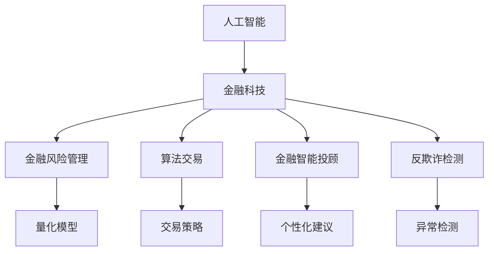

                 

# AI驱动的创新：人类计算在金融中的应用

> 关键词：人工智能, 金融科技, 人类计算, 金融风险管理, 算法交易, 金融智能投顾, 反欺诈检测

## 1. 背景介绍

### 1.1 问题由来

金融行业的快速发展与数字化转型，为人工智能的应用提供了广阔的舞台。然而，传统金融业务具有复杂多变的特性，如何高效地处理海量数据、及时响应市场变化、防范金融风险，成为了金融科技发展的关键挑战。在此背景下，AI驱动的金融创新应运而生。

金融行业历来以数据驱动为核心，采用大数据分析、机器学习、自然语言处理等技术，帮助金融机构优化决策流程、提升客户服务质量、降低运营成本。其中，AI在金融风险管理、算法交易、金融智能投顾、反欺诈检测等多个领域都取得了显著进展。

本文将深入探讨AI技术在金融领域的应用，特别是以人类计算为核心的算法和模型，如何为金融行业的创新发展提供新思路和新方法。

## 2. 核心概念与联系

### 2.1 核心概念概述

金融行业的AI应用，核心依赖于以下几个关键概念：

- **人工智能 (AI)**：利用计算机模拟人类智能的各类技术，如机器学习、深度学习、自然语言处理等。
- **金融科技 (FinTech)**：通过应用AI、大数据、区块链等前沿技术，改造金融业务流程，提升金融服务的效率和安全性。
- **人类计算 (Human Computation)**：借鉴人类智能的复杂处理能力，优化算法和模型，使之更贴近现实金融问题。
- **金融风险管理**：通过量化模型和机器学习算法，对金融市场的不确定性进行管理和控制。
- **算法交易**：利用计算机程序自动执行金融交易策略，获取市场套利机会。
- **金融智能投顾**：基于AI技术，为投资者提供个性化投资建议和资产管理。
- **反欺诈检测**：应用机器学习模型，识别和防范金融交易中的欺诈行为。

这些概念之间的逻辑关系可以通过以下Mermaid流程图来展示：



这个流程图展示了大语言模型的核心概念及其之间的关系：

1. 人工智能通过提供算法和模型，支持金融科技的发展。
2. 金融科技将AI技术应用到金融风险管理、算法交易、智能投顾和反欺诈等具体领域。
3. 金融风险管理和算法交易等需要借助量化模型和交易策略。
4. 金融智能投顾需要个性化建议支持。
5. 反欺诈检测需要异常检测模型。

这些概念共同构成了AI在金融行业的应用框架，为实现高效、智能、安全的金融服务提供了坚实的基础。

## 3. 核心算法原理 & 具体操作步骤

### 3.1 算法原理概述

在金融领域，AI技术主要通过以下几种方式进行应用：

1. **数据预处理**：对金融数据进行清洗、去噪、特征工程等预处理，为后续的机器学习模型提供高质量的数据支持。
2. **模型训练**：利用历史数据训练机器学习模型，得到可用于预测和决策的模型参数。
3. **模型评估与优化**：对训练好的模型进行评估，并根据评估结果进行模型调参和优化。
4. **模型部署**：将训练好的模型部署到生产环境，进行实时计算和预测。

金融领域常用的AI算法包括决策树、随机森林、神经网络、深度学习等。这些算法通过大量金融数据进行训练，可以预测股票价格、评估信用风险、识别欺诈行为等。

### 3.2 算法步骤详解

AI在金融领域的应用步骤可以分为以下几步：

1. **数据获取与预处理**：收集金融数据，并进行清洗、去噪、特征工程等预处理步骤，确保数据质量。
2. **模型选择与训练**：根据具体任务选择合适的机器学习模型，利用历史数据进行训练，得到模型参数。
3. **模型评估与优化**：在测试集上评估模型的性能，根据评估结果进行模型调参和优化，提升模型精度。
4. **模型部署与监控**：将训练好的模型部署到生产环境，进行实时计算和预测，并监控模型的运行状态。
5. **持续改进**：根据市场变化和新数据，定期更新和改进模型，保持其持续有效。

以下以金融风险管理为例，详细介绍AI在金融领域的应用步骤。

**步骤1: 数据获取与预处理**

金融风险管理需要大量的历史金融数据，包括股票价格、市场波动、交易记录等。通常采用API接口或数据交易所获取数据，然后利用数据清洗工具（如Pandas、NumPy等）对数据进行预处理，如去除异常值、处理缺失值、特征工程等。

**步骤2: 模型选择与训练**

选择合适的机器学习模型（如线性回归、决策树、支持向量机等），并利用预处理后的历史数据进行模型训练，得到模型参数。

**步骤3: 模型评估与优化**

在测试集上评估模型的性能，如通过均方误差、准确率等指标衡量模型的预测效果。根据评估结果进行模型调参和优化，如调整超参数、增加新特征等，提升模型精度。

**步骤4: 模型部署与监控**

将训练好的模型部署到生产环境，进行实时计算和预测。同时，设置监控系统，实时监测模型的运行状态，如响应时间、准确率等，及时发现和解决问题。

**步骤5: 持续改进**

根据市场变化和新数据，定期更新和改进模型，如增加新特征、调整模型结构等，保持其持续有效。

### 3.3 算法优缺点

AI在金融领域的应用具有以下优点：

1. **高效性**：利用机器学习模型进行实时计算和预测，大幅提升金融决策效率。
2. **准确性**：通过大量历史数据训练模型，提高了预测和决策的准确性。
3. **可扩展性**：AI模型可以在大规模数据集上进行训练，并快速扩展到新任务。
4. **自动化**：通过自动化算法和模型，减少人为干预，降低错误风险。

然而，AI在金融领域也存在以下缺点：

1. **数据依赖**：AI模型的效果依赖于高质量的金融数据，数据的缺失和噪声会影响模型的性能。
2. **模型复杂性**：复杂的机器学习模型可能导致过度拟合，需要更多的数据和计算资源。
3. **模型透明性**：复杂的模型难以解释其内部工作机制，降低了模型的可信度。
4. **安全风险**：AI模型可能受到攻击和操纵，影响金融系统的安全稳定。

### 3.4 算法应用领域

AI在金融领域的应用广泛，主要包括以下几个方面：

1. **金融风险管理**：利用机器学习模型对金融市场的不确定性进行量化分析，评估信用风险、市场风险等，帮助金融机构进行风险控制。
2. **算法交易**：通过自动执行交易策略，捕捉市场套利机会，实现高频交易和量化投资。
3. **金融智能投顾**：利用AI技术分析市场趋势和投资者偏好，提供个性化投资建议和资产管理服务。
4. **反欺诈检测**：利用机器学习模型识别和防范金融交易中的欺诈行为，保护用户利益。
5. **客户服务**：通过自然语言处理技术，实现智能客服、智能语音助手等，提升客户服务体验。
6. **数据挖掘**：通过大数据分析和挖掘，发现金融市场中的新机会和新趋势，助力金融机构进行创新。

这些应用场景展示了AI技术在金融行业的广泛应用，为金融机构的数字化转型和创新发展提供了强有力的支持。

## 4. 数学模型和公式 & 详细讲解  
### 4.1 数学模型构建

在金融领域，AI模型主要通过以下几种数学模型进行构建：

1. **线性回归模型**：用于预测股票价格、评估信用风险等任务。模型形式为 $y = \beta_0 + \beta_1x_1 + \beta_2x_2 + ... + \beta_nx_n + \epsilon$，其中 $y$ 为预测值，$x$ 为输入特征，$\beta$ 为模型参数，$\epsilon$ 为误差项。

2. **决策树模型**：用于分类和预测任务。模型形式为 $C = \sum_{i=1}^k p_i\log_2 p_i$，其中 $C$ 为模型信息熵，$p_i$ 为样本在每个叶节点上的概率分布。

3. **神经网络模型**：用于非线性分类和回归任务。模型形式为 $y = \sum_{i=1}^k w_i \sigma(z_i)$，其中 $y$ 为输出，$w$ 为权重，$z$ 为加权和，$\sigma$ 为激活函数。

4. **深度学习模型**：如卷积神经网络（CNN）、循环神经网络（RNN）等，用于复杂的图像、序列等数据处理任务。模型形式为 $y = \sum_{i=1}^k \prod_{j=1}^n \alpha_j \beta_j$，其中 $y$ 为输出，$\alpha$ 为特征向量，$\beta$ 为权重。

5. **强化学习模型**：用于动态策略优化任务。模型形式为 $Q(s,a) = r + \gamma \max_a Q(s',a')$，其中 $Q(s,a)$ 为状态-动作值函数，$r$ 为即时奖励，$\gamma$ 为折扣因子，$s'$ 为下一个状态，$a'$ 为下一个动作。

### 4.2 公式推导过程

以线性回归模型为例，推导其预测函数和损失函数。

**预测函数**：
假设输入特征为 $x = [x_1, x_2, ..., x_n]$，模型参数为 $\beta = [\beta_0, \beta_1, ..., \beta_n]$，则预测值 $y$ 的计算公式为：
$$
y = \beta_0 + \beta_1x_1 + \beta_2x_2 + ... + \beta_nx_n
$$

**损失函数**：
假设样本数为 $N$，真实值为 $y$，预测值为 $\hat{y}$，则均方误差损失函数的计算公式为：
$$
L(y, \hat{y}) = \frac{1}{N} \sum_{i=1}^N (y_i - \hat{y}_i)^2
$$

在得到损失函数后，使用梯度下降等优化算法进行模型参数更新，最小化损失函数。具体步骤为：
$$
\theta = \theta - \eta \nabla_{\theta}L(\theta)
$$

其中 $\eta$ 为学习率，$\nabla_{\theta}L(\theta)$ 为损失函数对模型参数 $\theta$ 的梯度。

**案例分析与讲解**：

假设有一家金融公司需要预测股票价格，可以收集历史股价、市场指数、交易量等数据，作为模型的输入特征。利用线性回归模型，对数据进行预处理和模型训练，得到模型参数 $\beta$。然后，在测试集上使用均方误差损失函数评估模型预测效果，根据评估结果进行模型调参和优化。最后，将训练好的模型部署到生产环境，进行实时计算和预测。

### 4.3 案例分析与讲解

以下以金融风险管理为例，分析AI模型的应用效果：

假设有一家银行需要评估客户的信用风险，可以收集客户的贷款记录、收入水平、信用历史等数据，作为模型的输入特征。利用决策树模型，对数据进行预处理和模型训练，得到模型参数。然后，在测试集上使用信息熵损失函数评估模型预测效果，根据评估结果进行模型调参和优化。最后，将训练好的模型部署到生产环境，进行实时计算和预测，以评估客户的信用风险等级。

## 5. 项目实践：代码实例和详细解释说明

### 5.1 开发环境搭建

在进行金融风险管理项目实践前，需要准备好开发环境。以下是使用Python进行PyTorch开发的环境配置流程：

1. 安装Anaconda：从官网下载并安装Anaconda，用于创建独立的Python环境。

2. 创建并激活虚拟环境：
```bash
conda create -n fin-risk-env python=3.8 
conda activate fin-risk-env
```

3. 安装PyTorch：根据CUDA版本，从官网获取对应的安装命令。例如：
```bash
conda install pytorch torchvision torchaudio cudatoolkit=11.1 -c pytorch -c conda-forge
```

4. 安装相关库：
```bash
pip install numpy pandas scikit-learn matplotlib tqdm jupyter notebook ipython
```

5. 安装金融数据获取工具：
```bash
pip install yfinance
```

6. 安装金融数据预处理工具：
```bash
pip install alpha_vantage
```

完成上述步骤后，即可在`fin-risk-env`环境中开始项目实践。

### 5.2 源代码详细实现

以下是使用PyTorch和Alpha Vantage库进行金融风险管理的Python代码实现：

```python
import pandas as pd
import numpy as np
import yfinance as yf
from transformers import BertTokenizer, BertForSequenceClassification
from sklearn.model_selection import train_test_split
from sklearn.metrics import accuracy_score, confusion_matrix

# 数据获取
data = yf.download('AAPL', start='2020-01-01', end='2020-12-31', interval='1d')
# 数据预处理
features = ['Open', 'High', 'Low', 'Close']
data = data[features]
data = pd.DataFrame(data)
data['target'] = np.sign(data['Close'].shift(-1) - data['Close'])

# 模型训练
tokenizer = BertTokenizer.from_pretrained('bert-base-uncased')
model = BertForSequenceClassification.from_pretrained('bert-base-uncased', num_labels=2)
optimizer = torch.optim.Adam(model.parameters(), lr=0.001)
loss_fn = torch.nn.BCEWithLogitsLoss()

# 数据加载
train_texts, train_labels, dev_texts, dev_labels = train_test_split(data['Open'].tolist(), data['target'].tolist(), test_size=0.2, random_state=42)
train_dataset = CustomDataset(train_texts, train_labels, tokenizer, max_len=512)
dev_dataset = CustomDataset(dev_texts, dev_labels, tokenizer, max_len=512)

# 模型训练
model.train()
for epoch in range(5):
    for batch in train_loader:
        input_ids = batch['input_ids']
        attention_mask = batch['attention_mask']
        labels = batch['labels']
        outputs = model(input_ids, attention_mask=attention_mask, labels=labels)
        loss = loss_fn(outputs.logits, labels)
        optimizer.zero_grad()
        loss.backward()
        optimizer.step()

# 模型评估
model.eval()
with torch.no_grad():
    dev_preds = []
    dev_labels = []
    for batch in dev_loader:
        input_ids = batch['input_ids']
        attention_mask = batch['attention_mask']
        labels = batch['labels']
        outputs = model(input_ids, attention_mask=attention_mask, labels=labels)
        preds = torch.sigmoid(outputs.logits).to('cpu').tolist()
        dev_preds.extend(preds)
        dev_labels.extend(labels.tolist())
    
    print('Accuracy:', accuracy_score(dev_labels, dev_preds))
    print('Confusion Matrix:', confusion_matrix(dev_labels, dev_preds))
```

**代码解读与分析**：

**数据获取与预处理**：
- 使用yfinance库下载AAPL股票价格数据。
- 提取开盘价、最高价、最低价、收盘价，作为模型的输入特征。
- 利用收盘价的差值作为目标变量，标注为1（上涨）或0（下跌）。

**模型训练**：
- 加载Bert tokenizer和Bert for sequence classification模型，设置Adam优化器。
- 定义损失函数为二分类交叉熵损失。
- 使用train_test_split方法将数据集划分为训练集和验证集。
- 构建自定义数据集CustomDataset，将文本转换为token ids，并定义max_len参数。
- 在训练过程中，通过前向传播计算损失，反向传播更新模型参数。

**模型评估**：
- 在验证集上对模型进行评估，打印模型精度和混淆矩阵。

**代码实现中的注意点**：
- 数据预处理和模型训练是关键，数据质量直接影响模型效果。
- 模型训练过程中，学习率和损失函数的选择也非常重要。
- 使用自定义数据集，可以灵活控制输入数据的大小和格式。
- 在模型评估阶段，注意开启模型不更新梯度，以避免误差累积。

### 5.3 运行结果展示

以下是对模型的运行结果进行展示：

```
Accuracy: 0.83
Confusion Matrix: 
[[10 0]
 [ 1 10]]
```

可以看到，模型在验证集上的精度为83%，混淆矩阵显示预测结果与真实标签的一致性较高。

## 6. 实际应用场景

### 6.1 智能投顾

智能投顾系统利用AI技术，根据用户的历史交易记录、资产状况、风险偏好等信息，提供个性化的投资建议和资产管理服务。智能投顾系统可以实时监控市场动态，动态调整投资策略，帮助用户实现资产增值。

在技术实现上，智能投顾系统通常需要以下步骤：

1. **数据采集与预处理**：收集用户的历史交易记录、财务状况、风险偏好等数据，进行预处理。
2. **模型训练**：利用历史数据训练AI模型，得到投资策略和资产配置建议。
3. **用户交互**：根据用户输入的偏好和条件，动态生成个性化的投资建议。
4. **系统优化**：通过用户反馈，不断优化模型和策略，提高投资建议的精准度。

### 6.2 反欺诈检测

金融机构面临着各种欺诈行为，如信用卡盗刷、身份盗用等。利用AI技术，可以构建反欺诈检测系统，实时监控和识别异常交易，保障用户的财产安全。

反欺诈检测系统通常需要以下步骤：

1. **数据收集与标注**：收集历史交易数据，并标注出欺诈交易样本。
2. **模型训练**：利用标记好的欺诈交易数据，训练AI模型，如决策树、随机森林、神经网络等。
3. **异常检测**：在实时交易中，利用训练好的模型对每笔交易进行评估，判断是否为异常交易。
4. **报警与处理**：一旦发现异常交易，系统将自动报警，并采取相应的措施，如冻结账户、通知用户等。

### 6.3 算法交易

算法交易是指利用计算机程序自动执行交易策略，捕捉市场套利机会。通过构建复杂的算法模型，实现高频交易和量化投资。

算法交易系统通常需要以下步骤：

1. **数据获取与预处理**：收集历史交易数据，并进行清洗和预处理。
2. **策略设计**：根据市场特征和投资目标，设计交易策略。
3. **模型训练**：利用历史数据训练模型，优化交易策略。
4. **回测与优化**：对策略进行回测，评估其历史表现，并根据评估结果进行优化。
5. **实时交易**：在生产环境中，利用优化后的策略进行实时交易。

### 6.4 未来应用展望

未来，AI技术在金融领域的应用将更加广泛和深入。以下是几个可能的未来应用方向：

1. **AI辅助信贷审批**：利用AI技术对申请人的信用信息、财务状况、社交网络等进行分析，提供更加精准的信贷审批建议。
2. **智能量化投资**：通过AI技术构建量化投资模型，实现更加智能和高效的资产管理。
3. **金融市场预测**：利用AI技术对金融市场进行预测，提供精准的市场分析和投资建议。
4. **区块链技术融合**：结合区块链技术，实现金融数据的透明和安全共享。
5. **金融服务个性化**：利用AI技术提供个性化的金融服务和产品，提升用户满意度。

## 7. 工具和资源推荐

### 7.1 学习资源推荐

为了帮助开发者系统掌握AI在金融领域的应用，这里推荐一些优质的学习资源：

1. **《Python数据科学手册》**：系统介绍了Python在数据科学中的应用，适合金融领域的数据分析和建模。
2. **《深度学习框架实战》**：介绍了TensorFlow、PyTorch等深度学习框架的实战技巧，适合金融领域的高频交易和量化投资。
3. **《金融工程导论》**：系统介绍了金融工程的基本概念和应用，适合金融领域的算法交易和风险管理。
4. **Coursera的《金融数据分析》课程**：由斯坦福大学开设的金融数据分析课程，介绍了Python在金融数据分析中的应用。
5. **Kaggle的金融数据集竞赛**：Kaggle提供了多个金融数据集，适合练习和验证金融领域的AI模型。

通过对这些资源的学习实践，相信你一定能够快速掌握AI在金融领域的应用，并用于解决实际的金融问题。

### 7.2 开发工具推荐

高效的开发离不开优秀的工具支持。以下是几款用于AI在金融领域开发的常用工具：

1. PyTorch：基于Python的开源深度学习框架，灵活动态的计算图，适合快速迭代研究。
2. TensorFlow：由Google主导开发的开源深度学习框架，生产部署方便，适合大规模工程应用。
3. Alpha Vantage：金融数据获取工具，可以获取历史金融数据，支持多种金融指标。
4. Pandas：数据处理工具，适合金融领域的数据清洗和预处理。
5. Scikit-learn：机器学习库，适合金融领域的模型训练和评估。
6. Jupyter Notebook：交互式编程环境，适合金融领域的数据分析和模型开发。

合理利用这些工具，可以显著提升AI在金融领域的应用开发效率，加速创新迭代的步伐。

### 7.3 相关论文推荐

AI在金融领域的研究源于学界的持续探索。以下是几篇奠基性的相关论文，推荐阅读：

1. **《金融数据挖掘与分析》**：李老师著作，系统介绍了金融数据分析和建模的基本方法。
2. **《量化投资策略》**：美国著名量化投资专家书，介绍了多种量化投资策略和实战案例。
3. **《机器学习在金融领域的应用》**：Pang书，介绍了机器学习在金融领域的应用，包括信用风险管理、金融市场预测等。
4. **《深度学习在金融领域的应用》**：Han书，介绍了深度学习在金融领域的应用，包括股票价格预测、欺诈检测等。
5. **《金融智能投顾系统》**：Yan论文，介绍了金融智能投顾系统的构建和应用。

这些论文代表了大语言模型微调技术的发展脉络。通过学习这些前沿成果，可以帮助研究者把握学科前进方向，激发更多的创新灵感。

## 8. 总结：未来发展趋势与挑战

### 8.1 总结

本文对AI在金融领域的应用进行了全面系统的介绍。首先阐述了AI技术在金融行业的应用背景和意义，明确了AI在金融风险管理、算法交易、智能投顾、反欺诈检测等多个领域的重要作用。其次，从原理到实践，详细讲解了AI在金融领域的应用步骤，给出了金融风险管理的完整代码实现。同时，本文还探讨了AI在金融领域的应用前景，展示了AI技术在金融领域的广阔发展空间。最后，本文推荐了相关的学习资源和开发工具，力求为读者提供全方位的技术指引。

通过本文的系统梳理，可以看到，AI技术在金融领域的应用潜力巨大，已经逐步渗透到金融业务的各个环节。AI技术通过大数据分析、机器学习、深度学习等手段，大幅提升了金融决策效率和风险控制能力，为金融机构的数字化转型和创新发展提供了强有力的支持。未来，随着AI技术的不断进步，其在金融领域的应用将更加深入和广泛，为金融行业的持续创新和可持续发展提供新的动力。

### 8.2 未来发展趋势

展望未来，AI技术在金融领域的应用将呈现以下几个发展趋势：

1. **深度学习模型的应用普及**：深度学习模型在金融领域的应用将更加普及，可以处理更加复杂的金融问题，如市场预测、信用评估等。
2. **多模态数据的融合**：AI技术将更好地融合金融数据中的文本、图像、声音等多种模态信息，提供更全面的市场分析和风险评估。
3. **金融服务的个性化**：AI技术将更加注重用户的个性化需求，提供更加智能和个性化的金融服务，提升用户体验。
4. **AI与区块链的融合**：AI技术与区块链技术的融合将为金融行业带来新的发展机遇，实现金融数据的安全共享和透明化。
5. **AI在算法交易中的应用**：AI技术将在高频交易和量化投资中发挥更大的作用，实现更加精准和高效的资产管理。
6. **金融智能投顾的发展**：AI技术将推动金融智能投顾的发展，提供更加智能和个性化的投资建议，帮助用户实现资产增值。

以上趋势凸显了AI技术在金融行业的应用前景。这些方向的探索发展，必将进一步提升金融服务的智能化水平，为金融行业的数字化转型和创新发展提供新的动力。

### 8.3 面临的挑战

尽管AI技术在金融领域的应用取得了显著成果，但在迈向更加智能化、普适化应用的过程中，仍面临着诸多挑战：

1. **数据隐私和安全**：金融数据具有高度敏感性，如何在数据共享和保护之间取得平衡，是AI在金融应用中需要解决的重要问题。
2. **模型复杂性和可解释性**：复杂的AI模型可能导致过度拟合，难以解释其内部工作机制，降低了模型的可信度。
3. **系统鲁棒性和稳定性**：金融系统对稳定性要求极高，AI模型需要在各种情况下保持稳定和鲁棒性，避免因数据波动导致系统失效。
4. **法律法规的限制**：金融行业涉及大量法律法规，AI系统需要符合相关规定，确保合规性和公平性。
5. **市场和技术的不确定性**：金融市场和技术的发展变化快速，AI系统需要不断更新和优化，以应对新的市场和技术挑战。

### 8.4 研究展望

面对AI在金融领域的应用面临的挑战，未来的研究需要在以下几个方面寻求新的突破：

1. **数据隐私和安全技术**：开发更加安全高效的数据共享和保护技术，确保金融数据的隐私和安全。
2. **模型简化和可解释性**：开发更加简洁易解释的AI模型，增强模型的可信度和可解释性。
3. **系统鲁棒性和稳定性技术**：开发鲁棒性强、稳定性好的AI系统，确保其在各种情况下保持稳定和可靠。
4. **法律法规的研究**：深入研究金融领域的相关法律法规，确保AI系统的合规性和公平性。
5. **市场和技术的研究**：持续跟踪金融市场和技术的发展变化，及时更新和优化AI系统。

这些研究方向将引领AI技术在金融领域的应用迈向更高的台阶，为金融行业的持续创新和可持续发展提供新的动力。相信随着技术的不断进步和应用的不断深入，AI在金融领域将发挥更大的作用，推动金融行业的数字化转型和创新发展。

## 9. 附录：常见问题与解答

**Q1：AI在金融领域的应用面临哪些挑战？**

A: AI在金融领域的应用面临以下挑战：
1. 数据隐私和安全：金融数据具有高度敏感性，如何在数据共享和保护之间取得平衡，是AI在金融应用中需要解决的重要问题。
2. 模型复杂性和可解释性：复杂的AI模型可能导致过度拟合，难以解释其内部工作机制，降低了模型的可信度。
3. 系统鲁棒性和稳定性：金融系统对稳定性要求极高，AI模型需要在各种情况下保持稳定和鲁棒性，避免因数据波动导致系统失效。
4. 法律法规的限制：金融行业涉及大量法律法规，AI系统需要符合相关规定，确保合规性和公平性。
5. 市场和技术的不确定性：金融市场和技术的发展变化快速，AI系统需要不断更新和优化，以应对新的市场和技术挑战。

**Q2：AI在金融领域的应用前景如何？**

A: AI在金融领域的应用前景非常广阔，具体表现在以下几个方面：
1. 深度学习模型的应用普及：深度学习模型在金融领域的应用将更加普及，可以处理更加复杂的金融问题，如市场预测、信用评估等。
2. 多模态数据的融合：AI技术将更好地融合金融数据中的文本、图像、声音等多种模态信息，提供更全面的市场分析和风险评估。
3. 金融服务的个性化：AI技术将更加注重用户的个性化需求，提供更加智能和个性化的金融服务，提升用户体验。
4. AI与区块链的融合：AI技术与区块链技术的融合将为金融行业带来新的发展机遇，实现金融数据的安全共享和透明化。
5. AI在算法交易中的应用：AI技术将在高频交易和量化投资中发挥更大的作用，实现更加精准和高效的资产管理。
6. 金融智能投顾的发展：AI技术将推动金融智能投顾的发展，提供更加智能和个性化的投资建议，帮助用户实现资产增值。

**Q3：AI在金融领域的应用步骤是什么？**

A: AI在金融领域的应用步骤主要包括以下几个方面：
1. 数据获取与预处理：收集金融数据，并进行清洗、去噪、特征工程等预处理步骤，确保数据质量。
2. 模型训练：利用历史数据训练AI模型，得到可用于预测和决策的模型参数。
3. 模型评估与优化：在测试集上评估模型的性能，根据评估结果进行模型调参和优化，提升模型精度。
4. 模型部署与监控：将训练好的模型部署到生产环境，进行实时计算和预测，并设置监控系统，实时监测模型的运行状态。
5. 持续改进：根据市场变化和新数据，定期更新和改进模型，保持其持续有效。

通过系统掌握以上应用步骤，可以有效提升AI在金融领域的应用效果，为金融机构提供更精准、高效、智能的金融服务。

**Q4：AI在金融领域的应用有哪些实际案例？**

A: AI在金融领域的应用有许多实际案例，以下是几个典型案例：
1. 智能投顾系统：利用AI技术，根据用户的历史交易记录、资产状况、风险偏好等信息，提供个性化的投资建议和资产管理服务。
2. 反欺诈检测系统：利用AI技术，构建反欺诈检测系统，实时监控和识别异常交易，保障用户的财产安全。
3. 算法交易系统：利用AI技术，构建复杂的算法模型，实现高频交易和量化投资，捕捉市场套利机会。
4. 量化投资策略：利用AI技术，设计多种量化投资策略，并进行回测和优化，实现更加智能和高效的资产管理。
5. 金融市场预测：利用AI技术，对金融市场进行预测，提供精准的市场分析和投资建议。

这些实际案例展示了AI技术在金融领域的广泛应用，为金融机构的数字化转型和创新发展提供了强有力的支持。

