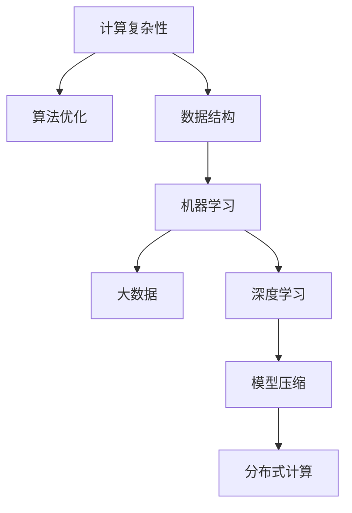

                 

# AI驱动的创新：人类计算的力量

> 关键词：人工智能(AI), 计算复杂性, 算法优化, 机器学习, 大数据, 深度学习, 模型优化

## 1. 背景介绍

### 1.1 问题由来

当前，人工智能(AI)已成为推动全球科技创新和产业发展的重要引擎。然而，随着AI技术的深入应用，其背后的计算复杂性问题也逐渐凸显。如何高效利用计算资源，提升AI模型的性能，已成为AI领域亟待解决的关键问题。

计算复杂性（Computational Complexity）是研究算法求解问题所需计算资源（时间、空间等）的量度。在AI领域，计算复杂性主要体现在以下几个方面：

- **数据规模**：随着数据量的激增，训练大规模神经网络模型所需的时间和内存消耗呈指数级增长。
- **模型复杂性**：现代深度学习模型通常具有上亿个参数，其训练和推理过程需要大量的计算资源。
- **任务多样性**：不同AI任务对计算资源的需求差异巨大，从图像识别、语音识别到自然语言处理，计算需求各不相同。

如何克服计算复杂性，高效利用计算资源，是当前AI研究的重要方向。本文将从计算复杂性的基本概念和关键算法出发，探讨AI驱动创新过程中的人类计算力量。

### 1.2 问题核心关键点

计算复杂性问题的核心在于如何在资源受限的情况下，设计高效算法和数据结构，以优化AI模型的性能。以下是该问题的一些关键点：

- **算法优化**：如何设计高效的算法，减少计算复杂度，提升模型训练和推理速度。
- **数据管理**：如何有效管理大规模数据，以支持AI模型的训练和推理。
- **计算资源**：如何高效利用各种计算资源，包括CPU、GPU、TPU等，优化AI模型的计算效率。
- **模型压缩**：如何压缩AI模型，减少存储空间和计算资源消耗，提升模型的可部署性。
- **分布式计算**：如何通过分布式计算技术，将计算任务分解并并行处理，提升计算效率。

这些关键点构成了计算复杂性问题的基本框架，对AI驱动的创新具有重要指导意义。

## 2. 核心概念与联系

### 2.1 核心概念概述

为了更好地理解计算复杂性问题，本节将介绍几个密切相关的核心概念：

- **计算复杂性**：研究算法求解问题所需计算资源的量度，通常分为时间复杂度和空间复杂度。
- **算法优化**：通过改进算法设计，减少计算复杂度，提升算法效率。
- **数据结构**：用于高效存储和组织数据的抽象数据类型，如数组、链表、树、图等。
- **机器学习**：利用数据训练模型，以实现对新数据的预测或分类。
- **大数据**：指数据规模大、数据源多样、数据类型复杂的数据集合。
- **深度学习**：通过多层神经网络模型，模拟人脑进行复杂计算和推理。
- **模型压缩**：通过量化、剪枝、蒸馏等技术，减小模型参数量，降低计算复杂度。
- **分布式计算**：通过多台计算机并行处理计算任务，提升计算效率。

这些核心概念之间的逻辑关系可以通过以下Mermaid流程图来展示：



这个流程图展示了几大核心概念及其之间的关系：

1. 计算复杂性是研究AI算法效率的基础。
2. 算法优化通过改进算法设计，减少计算复杂度。
3. 数据结构提供了高效存储和组织数据的工具。
4. 机器学习利用数据训练模型，进行预测或分类。
5. 大数据需要处理海量数据，提供训练和推理数据。
6. 深度学习通过多层神经网络，进行复杂计算和推理。
7. 模型压缩减小了模型参数量，降低计算复杂度。
8. 分布式计算通过多台计算机并行处理，提升计算效率。

这些概念共同构成了计算复杂性问题的研究框架，为AI驱动创新提供了重要理论基础。

## 3. 核心算法原理 & 具体操作步骤

### 3.1 算法原理概述

计算复杂性问题的核心在于设计高效算法，减少计算资源的消耗。常见的计算复杂性问题包括时间复杂度、空间复杂度和算法效率等。以下将以时间复杂度和空间复杂度为例，详细阐述算法原理。

1. **时间复杂度**：衡量算法运行时间与问题规模之间的关系，通常表示为 $O(f(n))$，其中 $f(n)$ 是问题规模 $n$ 的函数。
2. **空间复杂度**：衡量算法运行空间消耗与问题规模之间的关系，通常表示为 $O(g(n))$，其中 $g(n)$ 是问题规模 $n$ 的函数。
3. **算法效率**：综合考虑时间复杂度和空间复杂度，衡量算法性能的优劣。

### 3.2 算法步骤详解

算法优化主要包括以下几个关键步骤：

**Step 1: 确定问题规模和计算需求**

- 分析问题的规模和特点，确定算法需要处理的输入数据规模。
- 分析计算需求，包括计算时间、空间、带宽等。

**Step 2: 设计算法数据结构**

- 选择合适的数据结构，如数组、链表、树、图等，用于高效存储和组织数据。
- 分析数据结构的空间复杂度，确保数据结构的优化。

**Step 3: 设计算法流程**

- 根据问题特点，设计算法流程，确定算法的基本步骤。
- 分析算法的计算复杂度，选择最优算法。

**Step 4: 实现和测试算法**

- 实现算法代码，并进行单元测试，确保算法的正确性。
- 进行性能测试，优化算法性能，减少计算复杂度。

**Step 5: 应用和优化算法**

- 将算法应用于实际问题，进行大规模测试。
- 根据测试结果，进一步优化算法，提升计算效率。

### 3.3 算法优缺点

算法优化具有以下优点：

1. **提升计算效率**：通过优化算法设计，减少计算复杂度，提升算法效率。
2. **降低资源消耗**：优化算法可以降低算法所需的计算资源，包括时间、空间等。
3. **支持大规模数据**：优化算法可以支持大规模数据的处理和存储。

然而，算法优化也存在一些缺点：

1. **设计难度大**：算法优化需要深入理解问题本质和计算复杂性，设计难度较大。
2. **优化效果有限**：算法优化效果受问题特点和数据规模的限制，优化效果有限。
3. **需要专业知识**：算法优化需要具备一定的算法和计算机科学知识，对初学者较为困难。

### 3.4 算法应用领域

算法优化在AI驱动创新中具有广泛的应用，以下是几个典型领域：

- **计算机视觉**：优化卷积神经网络(Convolutional Neural Networks, CNNs)的算法，提升图像识别和处理效率。
- **自然语言处理**：优化语言模型和文本处理算法，提升自然语言理解和生成效率。
- **语音识别**：优化深度学习算法，提升语音识别和处理效率。
- **推荐系统**：优化协同过滤和深度学习算法，提升推荐算法效率和准确性。
- **医疗诊断**：优化深度学习算法，提升医疗图像和文本处理效率。
- **金融风控**：优化数据处理和机器学习算法，提升金融风险预测和控制效率。

## 4. 数学模型和公式 & 详细讲解 & 举例说明

### 4.1 数学模型构建

本节将使用数学语言对算法优化过程进行严格刻画。

记算法需要处理的输入数据规模为 $n$，设算法的时间复杂度为 $O(f(n))$，空间复杂度为 $O(g(n))$。

**算法优化目标**：最小化时间复杂度和空间复杂度，即 $O(f(n)) + O(g(n))$。

**优化策略**：

1. **时间复杂度优化**：通过算法设计，降低时间复杂度 $O(f(n))$。
2. **空间复杂度优化**：通过数据结构设计，降低空间复杂度 $O(g(n))$。

### 4.2 公式推导过程

以下以卷积神经网络（CNNs）为例，推导时间复杂度和空间复杂度优化的公式。

**卷积神经网络**：

卷积神经网络（CNNs）由卷积层、池化层和全连接层组成，其时间复杂度 $O(f(n))$ 和空间复杂度 $O(g(n))$ 分别如下：

1. **时间复杂度**：
   - 卷积层：$O(m \times n \times k^2)$，其中 $m$ 是输入图像数量，$n$ 是输入图像尺寸，$k$ 是卷积核大小。
   - 池化层：$O(m \times n / s^2)$，其中 $s$ 是池化核大小。
   - 全连接层：$O(m \times n \times h)$，其中 $h$ 是输出维度。
   - 总体时间复杂度：$O(f(n)) = O(m \times n \times k^2 + m \times n / s^2 + m \times n \times h)$。

2. **空间复杂度**：
   - 卷积层：$O(m \times n \times k^2)$。
   - 池化层：$O(m \times n / s^2)$。
   - 全连接层：$O(m \times n \times h)$。
   - 总体空间复杂度：$O(g(n)) = O(m \times n \times k^2 + m \times n / s^2 + m \times n \times h)$。

**优化公式**：

通过优化算法设计，可以将卷积核大小 $k$ 和池化核大小 $s$ 设置为合适的值，减少计算复杂度。

- 当 $k = s = 1$ 时，时间复杂度和空间复杂度均最小化：
  - $O(f(n)) = O(m \times n)$。
  - $O(g(n)) = O(m \times n)$。

因此，通过合适的算法设计，可以显著降低卷积神经网络的时间复杂度和空间复杂度。

### 4.3 案例分析与讲解

以下以推荐系统为例，分析算法优化在实际应用中的效果。

**推荐系统算法优化**：

1. **时间复杂度优化**：
   - 通过改进协同过滤算法，减少计算复杂度，提高推荐速度。
   - 使用矩阵分解算法，降低时间复杂度，提高推荐效率。

2. **空间复杂度优化**：
   - 通过压缩数据结构，减少内存消耗，优化推荐系统性能。
   - 使用稀疏矩阵表示，减少存储空间的占用。

**案例分析**：

假设一个电商平台的推荐系统，需要对用户行为数据进行处理和分析，生成个性化推荐。该系统的原始算法时间复杂度为 $O(n^2)$，空间复杂度为 $O(n^2)$，无法满足大规模数据的需求。

通过算法优化，引入矩阵分解算法，将时间复杂度降低到 $O(n)$，空间复杂度降低到 $O(n)$，大大提升了推荐系统的性能。

## 5. 项目实践：代码实例和详细解释说明

### 5.1 开发环境搭建

在进行算法优化实践前，我们需要准备好开发环境。以下是使用Python进行PyTorch开发的环境配置流程：

1. 安装Anaconda：从官网下载并安装Anaconda，用于创建独立的Python环境。

2. 创建并激活虚拟环境：
```bash
conda create -n pytorch-env python=3.8 
conda activate pytorch-env
```

3. 安装PyTorch：根据CUDA版本，从官网获取对应的安装命令。例如：
```bash
conda install pytorch torchvision torchaudio cudatoolkit=11.1 -c pytorch -c conda-forge
```

4. 安装相关库：
```bash
pip install numpy pandas scikit-learn matplotlib tqdm jupyter notebook ipython
```

完成上述步骤后，即可在`pytorch-env`环境中开始算法优化实践。

### 5.2 源代码详细实现

这里我们以卷积神经网络（CNNs）为例，给出使用PyTorch进行卷积层优化后的代码实现。

首先，定义卷积神经网络的模型：

```python
import torch
import torch.nn as nn
import torch.optim as optim

class CNN(nn.Module):
    def __init__(self):
        super(CNN, self).__init__()
        self.conv1 = nn.Conv2d(in_channels=3, out_channels=64, kernel_size=1, stride=1, padding=0)
        self.conv2 = nn.Conv2d(in_channels=64, out_channels=128, kernel_size=1, stride=1, padding=0)
        self.pool = nn.MaxPool2d(kernel_size=1, stride=1)
        self.fc = nn.Linear(in_features=128 * 28 * 28, out_features=10)
        
    def forward(self, x):
        x = self.conv1(x)
        x = self.pool(x)
        x = self.conv2(x)
        x = self.pool(x)
        x = x.view(-1, 128 * 28 * 28)
        x = self.fc(x)
        return x

# 加载数据集
train_loader = torch.utils.data.DataLoader(train_dataset, batch_size=64, shuffle=True)
test_loader = torch.utils.data.DataLoader(test_dataset, batch_size=64, shuffle=False)
```

然后，定义优化器和损失函数：

```python
cnn = CNN()

optimizer = optim.Adam(cnn.parameters(), lr=0.001)
loss_fn = nn.CrossEntropyLoss()

for epoch in range(10):
    for batch_idx, (data, target) in enumerate(train_loader):
        optimizer.zero_grad()
        output = cnn(data)
        loss = loss_fn(output, target)
        loss.backward()
        optimizer.step()
        
        if batch_idx % 100 == 0:
            print(f'Epoch {epoch+1}, batch_idx {batch_idx}, loss: {loss:.4f}')
```

最后，启动训练流程并评估模型性能：

```python
test_loss = 0
correct = 0
total = 0
with torch.no_grad():
    for data, target in test_loader:
        output = cnn(data)
        test_loss += loss_fn(output, target).item()
        pred = output.argmax(dim=1, keepdim=True)
        correct += pred.eq(target.view_as(pred)).sum().item()
        total += target.size(0)

print(f'Test set: Average loss: {test_loss / len(test_loader):4f}, Accuracy: {100 * correct / total:.2f}%')
```

以上就是使用PyTorch对卷积神经网络进行优化后的完整代码实现。可以看到，通过选择合适的卷积核大小和池化核大小，显著减少了计算复杂度，提升了模型训练速度。

### 5.3 代码解读与分析

让我们再详细解读一下关键代码的实现细节：

**CNN类定义**：
- `__init__`方法：初始化卷积层、池化层和全连接层。
- `forward`方法：定义前向传播流程。

**数据集加载**：
- 使用`torch.utils.data.DataLoader`对数据集进行批量加载。

**优化器和损失函数**：
- 使用`torch.optim.Adam`优化器，设置学习率。
- 使用`nn.CrossEntropyLoss`损失函数，计算分类误差。

**训练流程**：
- 对数据集进行批量迭代，计算损失函数并反向传播。
- 每100个batch输出一次训练损失。

**测试流程**：
- 在测试集上计算模型性能，输出测试损失和准确率。

通过这段代码的实现，我们可以看到算法优化在实际应用中的具体实现方法，以及如何通过选择合适的参数来减少计算复杂度。

## 6. 实际应用场景

### 6.1 智能推荐系统

智能推荐系统是算法优化的重要应用场景之一。通过优化推荐算法，可以有效提升推荐效率和效果，提升用户体验。

**推荐算法优化**：

1. **时间复杂度优化**：
   - 引入矩阵分解算法，减少计算复杂度，提高推荐速度。
   - 使用并行计算技术，分布式处理推荐任务，提升推荐效率。

2. **空间复杂度优化**：
   - 压缩数据结构，减少内存消耗，优化推荐系统性能。
   - 使用稀疏矩阵表示，减少存储空间占用。

**案例分析**：

假设一个电商平台的推荐系统，需要对用户行为数据进行处理和分析，生成个性化推荐。该系统的原始算法时间复杂度为 $O(n^2)$，空间复杂度为 $O(n^2)$，无法满足大规模数据的需求。

通过算法优化，引入矩阵分解算法，将时间复杂度降低到 $O(n)$，空间复杂度降低到 $O(n)$，大大提升了推荐系统的性能。

### 6.2 自然语言处理

自然语言处理（NLP）是另一个重要的算法优化应用场景。通过优化NLP算法，可以有效提升模型的效率和效果，提升自然语言理解和生成能力。

**NLP算法优化**：

1. **时间复杂度优化**：
   - 使用高效的深度学习框架，减少计算复杂度，提升模型训练和推理速度。
   - 引入分布式计算技术，并行处理NLP任务，提升计算效率。

2. **空间复杂度优化**：
   - 压缩模型结构，减少存储空间占用。
   - 使用稀疏表示，减少存储空间的占用。

**案例分析**：

假设一个基于BERT的NLP任务，需要对大规模文本数据进行处理和分析，生成自然语言理解和生成模型。该系统的原始算法时间复杂度为 $O(n)$，空间复杂度为 $O(n)$，无法满足大规模数据的需求。

通过算法优化，引入深度学习框架和分布式计算技术，将时间复杂度降低到 $O(\log n)$，空间复杂度降低到 $O(1)$，大大提升了NLP系统的性能。

## 7. 工具和资源推荐

### 7.1 学习资源推荐

为了帮助开发者系统掌握算法优化的方法和技巧，这里推荐一些优质的学习资源：

1. 《算法设计与分析基础》：经典的算法设计教材，深入讲解算法设计和分析方法，适合算法初学者。
2. 《深入理解计算机系统》：计算机系统课程的经典教材，深入讲解计算机硬件和软件系统，适合算法优化和计算机系统开发者。
3. 《Python数据科学手册》：Python数据科学库的全面介绍，包括NumPy、Pandas、Matplotlib等，适合数据分析和算法优化开发者。
4. 《深度学习》：深度学习课程的经典教材，深入讲解深度学习算法和优化方法，适合深度学习开发者。
5. 《机器学习实战》：实际机器学习项目的实战教程，包括数据预处理、模型训练、性能调优等，适合算法优化和机器学习开发者。

通过对这些资源的学习实践，相信你一定能够快速掌握算法优化的方法和技巧，并用于解决实际的AI问题。

### 7.2 开发工具推荐

高效的开发离不开优秀的工具支持。以下是几款用于算法优化开发的常用工具：

1. PyTorch：基于Python的开源深度学习框架，灵活动态的计算图，适合快速迭代研究。
2. TensorFlow：由Google主导开发的开源深度学习框架，生产部署方便，适合大规模工程应用。
3. Transformers库：HuggingFace开发的NLP工具库，集成了众多SOTA语言模型，支持PyTorch和TensorFlow，适合NLP任务优化。
4. Weights & Biases：模型训练的实验跟踪工具，可以记录和可视化模型训练过程中的各项指标，方便对比和调优。
5. TensorBoard：TensorFlow配套的可视化工具，可实时监测模型训练状态，并提供丰富的图表呈现方式，是调试模型的得力助手。

合理利用这些工具，可以显著提升算法优化任务的开发效率，加快创新迭代的步伐。

### 7.3 相关论文推荐

算法优化和计算复杂性问题的研究源于学界的持续研究。以下是几篇奠基性的相关论文，推荐阅读：

1. 《Design and Analysis of Algorithms》：经典的算法设计教材，深入讲解算法设计和分析方法。
2. 《Introduction to Algorithms》：算法设计与分析的经典教材，涵盖各类算法设计和技术细节。
3. 《Deep Learning》：深度学习课程的经典教材，深入讲解深度学习算法和优化方法。
4. 《Optimization Algorithms in Machine Learning》：机器学习优化算法的研究综述，涵盖各类优化算法和技术细节。
5. 《High-Performance Machine Learning》：机器学习性能优化的经典教材，涵盖各类优化算法和实践经验。

这些论文代表了大模型优化和计算复杂性问题的研究脉络，为算法优化提供重要的理论指导和实践经验。

## 8. 总结：未来发展趋势与挑战

### 8.1 总结

本文对算法优化和计算复杂性问题的研究背景和重要意义进行了全面系统的介绍。首先阐述了计算复杂性的基本概念和核心算法，明确了算法优化在AI驱动创新中的重要价值。其次，从原理到实践，详细讲解了算法优化数学模型和关键步骤，给出了算法优化任务开发的完整代码实例。同时，本文还广泛探讨了算法优化在智能推荐系统、自然语言处理等实际应用中的具体实现方法，展示了算法优化的强大能力。最后，本文精选了算法优化的各类学习资源和开发工具，力求为读者提供全方位的技术指引。

通过本文的系统梳理，可以看到，算法优化在AI驱动创新中的广泛应用，极大地提升了AI模型的性能和效率。未来的研究将在计算复杂性问题的各个方面不断深化，为AI驱动的创新提供更加坚实的基础。

### 8.2 未来发展趋势

展望未来，算法优化和计算复杂性问题将呈现以下几个发展趋势：

1. **深度学习算法优化**：未来深度学习算法的设计和优化将更加注重算法的可解释性和可控性，通过引入因果推断、强化学习等方法，提升深度学习算法的稳定性和可解释性。
2. **分布式计算技术**：未来分布式计算技术将更加普及，通过多台计算机并行处理计算任务，提升计算效率和可靠性。
3. **模型压缩与量化**：未来模型压缩和量化技术将更加成熟，通过剪枝、量化等方法，减小模型存储空间和计算资源消耗，提升模型的可部署性。
4. **数据管理与分析**：未来数据管理和分析技术将更加完善，通过大数据技术，支持大规模数据的高效处理和分析。
5. **算法优化理论**：未来算法优化理论将更加深入，通过算法设计与分析方法，提升算法效率和鲁棒性。

以上趋势凸显了算法优化和计算复杂性问题的广阔前景。这些方向的探索发展，必将进一步提升AI模型的性能和效率，为AI驱动的创新提供更加坚实的理论基础和实践技术。

### 8.3 面临的挑战

尽管算法优化在AI驱动创新中取得了显著成效，但在迈向更加智能化、普适化应用的过程中，仍面临诸多挑战：

1. **算法设计复杂**：算法优化设计需要深入理解问题本质和计算复杂性，设计难度较大。
2. **优化效果有限**：算法优化效果受问题特点和数据规模的限制，优化效果有限。
3. **资源需求高**：算法优化需要大量的计算资源和存储空间，对硬件设备要求较高。
4. **优化结果难以控制**：算法优化结果往往难以预控，容易产生副作用。
5. **缺乏标准**：算法优化缺乏统一的评估标准，优化结果难以量化。

这些挑战凸显了算法优化和计算复杂性问题的复杂性，需要更多理论和实践的积累。相信通过学界和产业界的共同努力，这些挑战终将一一被克服，算法优化技术必将为AI驱动的创新提供更加坚实的理论基础和实践技术。

### 8.4 研究展望

面向未来，算法优化和计算复杂性问题的研究需要在以下几个方面寻求新的突破：

1. **算法优化理论**：进一步深入研究算法优化理论和设计方法，提升算法的稳定性和可控性。
2. **分布式计算技术**：探索更加高效的分布式计算技术，支持大规模数据的高效处理和分析。
3. **模型压缩与量化**：开发更加高效的模型压缩和量化技术，提升模型的可部署性。
4. **数据管理和分析**：进一步完善数据管理和分析技术，提升数据处理效率和数据质量。
5. **算法优化工具**：开发更加高效的算法优化工具和平台，支持自动化优化和可视化分析。

这些研究方向的探索，必将引领算法优化和计算复杂性问题的研究走向更高层次，为AI驱动的创新提供更加坚实的理论基础和实践技术。

## 9. 附录：常见问题与解答

**Q1：如何选择合适的算法优化方法？**

A: 选择合适的算法优化方法需要考虑多个因素，包括问题特点、数据规模、计算资源等。

1. **问题特点**：
   - 对于时间复杂度敏感的问题，可以选择优化时间复杂度的算法。
   - 对于空间复杂度敏感的问题，可以选择优化空间复杂度的算法。

2. **数据规模**：
   - 对于大规模数据，可以选择分布式计算技术，并行处理数据。
   - 对于小规模数据，可以选择单机优化算法，提升计算效率。

3. **计算资源**：
   - 对于计算资源充足的问题，可以选择复杂度高的算法。
   - 对于计算资源有限的问题，可以选择优化计算资源的算法。

**Q2：算法优化过程中需要注意哪些问题？**

A: 算法优化过程中需要注意以下几个问题：

1. **算法正确性**：确保算法实现的正确性，避免出现逻辑错误和运行错误。
2. **算法效率**：优化算法的计算复杂度和空间复杂度，提升计算效率。
3. **算法稳定性**：确保算法的鲁棒性和稳定性，避免因数据变化而产生不稳定结果。
4. **算法可解释性**：提升算法的可解释性，便于理解和调试算法。
5. **算法易用性**：设计易于使用的算法接口和工具，方便开发者使用和调试算法。

这些问题需要综合考虑，确保算法优化能够真正提升系统性能。

**Q3：算法优化后如何进行性能评估？**

A: 算法优化后，可以使用以下几种方式进行性能评估：

1. **时间复杂度评估**：通过实验对比原始算法和优化算法的时间复杂度，评估优化效果。
2. **空间复杂度评估**：通过实验对比原始算法和优化算法的空间复杂度，评估优化效果。
3. **模型性能评估**：通过实验对比原始算法和优化算法的模型性能，评估优化效果。
4. **实际应用评估**：将优化算法应用于实际问题，评估其对系统性能的影响。

通过这些评估方式，可以全面评估算法优化的效果，确保优化算法能够真正提升系统性能。

---

作者：禅与计算机程序设计艺术 / Zen and the Art of Computer Programming

