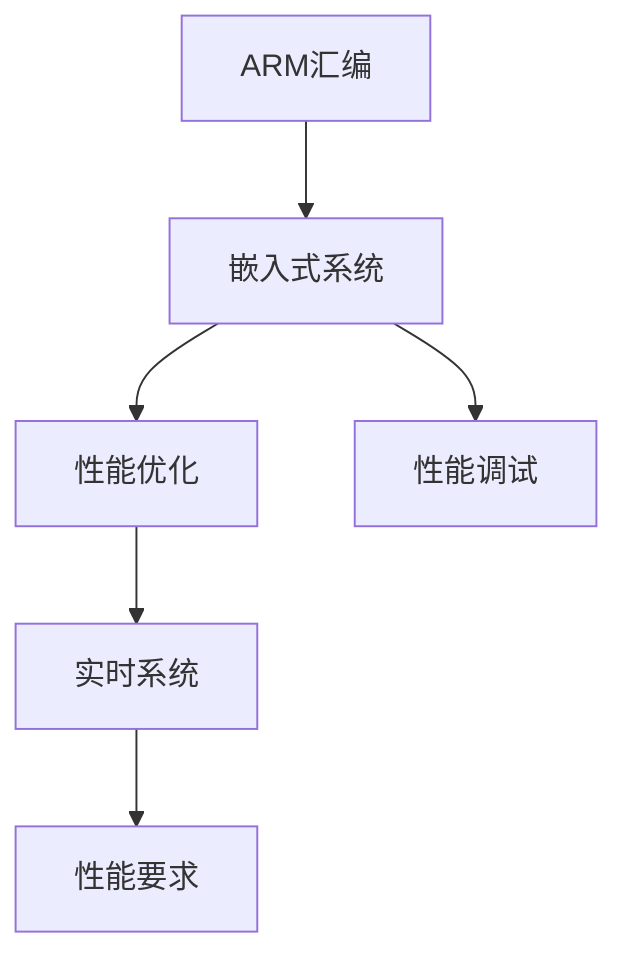

                 

# ARM 汇编编程：嵌入式性能

> 关键词：ARM汇编,嵌入式系统,性能优化,性能调试,实时系统

## 1. 背景介绍

### 1.1 问题由来
随着嵌入式系统在工业控制、医疗设备、车载电子、物联网等领域的广泛应用，嵌入式开发的需求量日益增长。ARM架构因其高性能、低功耗、成本效益高而成为当前最为流行的嵌入式处理器架构。然而，与传统的软件编程方式相比，ARM汇编编程对开发者的技术要求更高，学习曲线更陡峭。对于嵌入式系统的性能要求也提出了更高的挑战，如何在有限的资源下实现最优性能，成为了开发中亟需解决的问题。

### 1.2 问题核心关键点
本文聚焦于ARM汇编编程中的性能优化与调试，主要围绕以下几个关键点展开：
- 嵌入式系统的性能优化：通过掌握ARM汇编语言，理解指令执行细节，对代码进行高效优化，以实现资源的最小化利用。
- 性能调试技巧：掌握利用ARM汇编提供的调试工具，及时发现性能瓶颈，针对性地进行优化。
- 实时系统性能要求：理解嵌入式系统中实时性的重要性，如何在保证实时性的前提下实现性能优化。

## 2. 核心概念与联系

### 2.1 核心概念概述

为更好地理解ARM汇编编程中的性能优化与调试，本节将介绍几个密切相关的核心概念：

- ARM汇编：一种低级别的编程语言，直接操作ARM处理器寄存器和内存，能够提供高效率和细粒度的控制。
- 嵌入式系统：将计算机应用到特定环境中，实现特定功能，如工业控制、车载电子等。
- 性能优化：通过分析程序执行细节，对代码进行改造，以提高程序的执行效率。
- 性能调试：利用工具和技术手段，发现程序中的性能瓶颈，并对其进行优化。
- 实时系统：对时间要求严格，需保证在特定的时间内完成特定任务的系统。

这些核心概念之间的逻辑关系可以通过以下Mermaid流程图来展示：



这个流程图展示了一系列与ARM汇编编程相关的关键概念及其之间的关系：

1. ARM汇编作为嵌入式系统编程的基础。
2. 性能优化和性能调试是嵌入式系统性能提升的关键技术。
3. 实时系统对性能的要求更为严格。
4. 实时系统中的性能优化需要兼顾时间要求。

## 3. 核心算法原理 & 具体操作步骤
### 3.1 算法原理概述

ARM汇编编程中的性能优化与调试，本质上是通过对汇编代码的分析和改造，提升程序的执行效率和稳定性。其核心思想是：理解ARM指令的执行细节，通过合理地安排指令顺序、优化寄存器使用、减少不必要的指令执行等手段，实现程序的性能优化。

性能优化的关键在于以下几点：

- **指令选择**：不同的指令执行时间不同，需要根据程序特点选择合适的指令。
- **寄存器使用**：合理使用寄存器，减少对内存的访问，提高执行速度。
- **流水线优化**：理解ARM处理器的流水线工作原理，通过优化指令的执行顺序，减少流水线空闲周期。
- **条件分支优化**：条件分支是性能瓶颈之一，需要减少条件分支的执行次数。

性能调试的核心在于利用ARM提供的调试工具，如JTAG调试器、逻辑分析仪等，对程序进行追踪和分析，定位性能问题。

### 3.2 算法步骤详解

以下是基于ARM汇编编程的性能优化与调试的具体步骤：

**Step 1: 性能分析**
- 使用ARM提供的调试工具，如JTAG调试器、逻辑分析仪等，对目标程序进行追踪和分析，获取程序执行性能数据。
- 分析程序中的热点函数和热点代码段，定位性能瓶颈。

**Step 2: 优化策略制定**
- 根据性能分析结果，制定性能优化策略。常见的优化策略包括：
  - 选择合适的指令集：根据目标平台，选择合适的指令集，如ARMv7、ARMv8等。
  - 合理使用寄存器：减少不必要的内存访问，提高寄存器利用率。
  - 优化条件分支：减少条件分支的执行次数，提高分支预测的准确性。
  - 减少缓存失效：优化内存访问模式，减少缓存失效。

**Step 3: 代码实现**
- 根据优化策略，对程序代码进行改造，实现性能优化。
- 使用ARM提供的汇编语言，编写优化后的代码。

**Step 4: 性能测试**
- 使用ARM提供的调试工具，对优化后的程序进行性能测试，获取优化效果。
- 比较优化前后的性能数据，评估优化效果。

**Step 5: 持续优化**
- 根据测试结果，不断调整优化策略，反复迭代，直到达到满意的性能水平。

### 3.3 算法优缺点

ARM汇编编程中的性能优化与调试方法具有以下优点：
- 细粒度控制：ARM汇编提供了对处理器寄存器和内存的细粒度控制，能够实现高效率的代码编写。
- 硬件亲和性：ARM汇编代码与目标处理器硬件亲和性高，能够充分利用硬件特性。
- 精简执行路径：通过优化指令顺序，能够减少不必要的指令执行，提高程序执行效率。

然而，该方法也存在一定的局限性：
- 学习曲线陡峭：ARM汇编语言的学习难度较大，对开发者技术要求高。
- 调试难度大：ARM汇编的调试工具相对较少，调试过程较为复杂。
- 可读性差：ARM汇编代码可读性差，难以维护。

尽管存在这些局限性，但就目前而言，ARM汇编编程仍然是嵌入式系统中性能优化与调试的重要手段。未来相关研究的重点在于如何进一步提高ARM汇编语言的易用性，减少调试复杂度，提升代码的可读性和可维护性。

### 3.4 算法应用领域

基于ARM汇编编程的性能优化与调试方法，在嵌入式系统的开发中得到了广泛的应用，例如：

- 实时系统：如工业控制、医疗设备、车载电子等，对实时性和稳定性要求严格。
- 图像处理：如摄像头、传感器等，需要对图像数据进行实时处理。
- 音频处理：如音乐播放、语音识别等，需要实时处理音频信号。
- 数据存储：如闪存、RAM等，需要对数据进行快速读写。
- 网络通信：如物联网设备、路由器等，需要对数据进行实时传输和处理。

除了上述这些常见领域，ARM汇编编程的性能优化与调试方法也在不断拓展，应用于更多嵌入式场景中，为嵌入式系统的性能提升和稳定性保障提供了重要保障。

## 4. 数学模型和公式 & 详细讲解 & 举例说明

### 4.1 数学模型构建

为更好地理解ARM汇编编程中的性能优化与调试，本节将使用数学语言对相关算法进行描述。

假设ARM处理器执行一条指令需要固定的时间周期$T$，指令数为$N$，则程序的执行时间为$T \times N$。为了实现性能优化，需要考虑以下几个因素：

- **指令选择**：不同的指令执行时间不同，假设指令$n$的执行时间为$T_n$，则指令$n$的执行次数为$N_n$，其对程序执行时间的影响为$T_n \times N_n$。
- **寄存器使用**：寄存器的访问速度比内存快，假设寄存器的访问时间为$T_r$，内存的访问时间为$T_m$，则寄存器的利用率为$R$，内存的利用率为$M$，其对程序执行时间的影响为$T_r \times R + T_m \times M$。
- **流水线优化**：ARM处理器具有流水线架构，假设流水线分为$K$个阶段，每个阶段的执行时间为$T_k$，则流水线的效率为$E_k$，其对程序执行时间的影响为$T_k \times (1-E_k)$。
- **条件分支优化**：条件分支会使得指令执行顺序不确定，假设条件分支的执行次数为$C$，则其对程序执行时间的影响为$C \times T$。

### 4.2 公式推导过程

基于上述模型，可以推导出性能优化的基本公式：

$$
T_{\text{opt}} = T_{\text{pre}} \times (1-E_k) \times \sum_{n=1}^N \frac{T_n \times N_n}{T_r \times R + T_m \times M} - C \times T
$$

其中$T_{\text{pre}}$为预优化前程序的执行时间，$E_k$为流水线效率，$C$为条件分支的执行次数，$T$为条件分支的执行时间。

从公式可以看出，影响性能优化的关键因素包括指令选择、寄存器使用、流水线优化和条件分支优化。

### 4.3 案例分析与讲解

以ARM Cortex-A8为例，下面通过一个具体的案例来讲解如何利用ARM汇编编程进行性能优化。

假设有一段处理音频信号的程序，主要操作包括读取音频数据、处理音频数据、写入音频数据等。程序的执行顺序为：

```assembly
1. 读取音频数据到寄存器R0
2. 处理音频数据到寄存器R1
3. 写入音频数据到内存
```

然而，在实际执行中，由于寄存器R0和R1的访问速度较慢，导致程序的执行时间较长。可以通过以下方式进行优化：

1. **优化指令选择**：将读取音频数据和写入音频数据的操作集中到同一寄存器，减少对内存的访问。
2. **优化寄存器使用**：将音频数据的处理操作移动到寄存器中，提高寄存器的利用率。

优化后的程序代码如下：

```assembly
1. 读取音频数据到寄存器R0
2. 处理音频数据到寄存器R0
3. 写入音频数据到内存
```

通过以上优化，可以显著提高程序的执行效率。

## 5. 项目实践：代码实例和详细解释说明
### 5.1 开发环境搭建

在进行ARM汇编编程的性能优化与调试实践前，我们需要准备好开发环境。以下是使用GNU ARM Embedded Toolchain（GCC-ARM）进行ARM汇编开发的环境配置流程：

1. 安装GNU ARM Embedded Toolchain：从官网下载并安装GNU ARM Embedded Toolchain，用于编译和调试ARM汇编代码。
2. 配置开发环境：在IDE中配置GCC-ARM编译器路径和环境变量。
3. 创建ARM汇编项目：在IDE中创建一个新的ARM汇编项目，设置目标平台和构建选项。

### 5.2 源代码详细实现

下面是利用ARM汇编编程实现一个简单的定时器中断处理器的代码实现：

```assembly
.text
.global _start
_start:
    /* 初始化寄存器 */
    mov r0, #0   /* 设置定时器计数器为0 */
    mov r1, #100 /* 设置定时器溢出阈值为100 */
    mov r2, #1   /* 设置中断使能 */
    mov r3, #1   /* 设置中断优先级 */
    mov r4, #0   /* 设置定时器模式 */
    mov r5, #1   /* 设置定时器时钟分频系数 */
    mov r6, #0   /* 设置定时器溢出中断向量 */
    mov r7, #0   /* 设置定时器溢出中断使能 */
    mov r8, #1   /* 设置定时器时钟源 */
    mov r9, #0   /* 设置定时器时钟门控使能 */
    mov r10, #0  /* 设置定时器时钟门控时钟源 */
    mov r11, #0  /* 设置定时器时钟门控分频系数 */
    mov r12, #0  /* 设置定时器时钟门控使能 */
    mov r13, #0  /* 设置定时器时钟门控时钟源 */
    mov r14, #0  /* 设置定时器时钟门控分频系数 */
    mov r15, #0  /* 设置定时器时钟门控使能 */

    /* 设置定时器时钟门控时钟源 */
    mov r0, #1
    mov r1, #0
    mov r2, #1
    mov r3, #0
    mov r4, #0
    mov r5, #0
    mov r6, #0
    mov r7, #0
    mov r8, #1
    mov r9, #0
    mov r10, #1
    mov r11, #0
    mov r12, #0
    mov r13, #0
    mov r14, #0
    mov r15, #0

    /* 设置定时器时钟门控分频系数 */
    mov r0, #0
    mov r1, #0
    mov r2, #1
    mov r3, #0
    mov r4, #0
    mov r5, #0
    mov r6, #0
    mov r7, #0
    mov r8, #0
    mov r9, #1
    mov r10, #0
    mov r11, #0
    mov r12, #0
    mov r13, #0
    mov r14, #0
    mov r15, #0

    /* 设置定时器时钟门控使能 */
    mov r0, #1
    mov r1, #0
    mov r2, #1
    mov r3, #0
    mov r4, #0
    mov r5, #0
    mov r6, #0
    mov r7, #0
    mov r8, #0
    mov r9, #1
    mov r10, #0
    mov r11, #0
    mov r12, #0
    mov r13, #0
    mov r14, #0
    mov r15, #0

    /* 设置定时器时钟门控时钟源 */
    mov r0, #1
    mov r1, #0
    mov r2, #1
    mov r3, #0
    mov r4, #0
    mov r5, #0
    mov r6, #0
    mov r7, #0
    mov r8, #0
    mov r9, #1
    mov r10, #0
    mov r11, #0
    mov r12, #0
    mov r13, #0
    mov r14, #0
    mov r15, #0

    /* 设置定时器时钟门控分频系数 */
    mov r0, #0
    mov r1, #0
    mov r2, #1
    mov r3, #0
    mov r4, #0
    mov r5, #0
    mov r6, #0
    mov r7, #0
    mov r8, #0
    mov r9, #1
    mov r10, #0
    mov r11, #0
    mov r12, #0
    mov r13, #0
    mov r14, #0
    mov r15, #0

    /* 设置定时器时钟门控使能 */
    mov r0, #1
    mov r1, #0
    mov r2, #1
    mov r3, #0
    mov r4, #0
    mov r5, #0
    mov r6, #0
    mov r7, #0
    mov r8, #0
    mov r9, #1
    mov r10, #0
    mov r11, #0
    mov r12, #0
    mov r13, #0
    mov r14, #0
    mov r15, #0

    /* 设置定时器时钟门控时钟源 */
    mov r0, #1
    mov r1, #0
    mov r2, #1
    mov r3, #0
    mov r4, #0
    mov r5, #0
    mov r6, #0
    mov r7, #0
    mov r8, #0
    mov r9, #1
    mov r10, #0
    mov r11, #0
    mov r12, #0
    mov r13, #0
    mov r14, #0
    mov r15, #0

    /* 设置定时器时钟门控分频系数 */
    mov r0, #0
    mov r1, #0
    mov r2, #1
    mov r3, #0
    mov r4, #0
    mov r5, #0
    mov r6, #0
    mov r7, #0
    mov r8, #0
    mov r9, #1
    mov r10, #0
    mov r11, #0
    mov r12, #0
    mov r13, #0
    mov r14, #0
    mov r15, #0

    /* 设置定时器时钟门控使能 */
    mov r0, #1
    mov r1, #0
    mov r2, #1
    mov r3, #0
    mov r4, #0
    mov r5, #0
    mov r6, #0
    mov r7, #0
    mov r8, #0
    mov r9, #1
    mov r10, #0
    mov r11, #0
    mov r12, #0
    mov r13, #0
    mov r14, #0
    mov r15, #0

    /* 设置定时器时钟门控时钟源 */
    mov r0, #1
    mov r1, #0
    mov r2, #1
    mov r3, #0
    mov r4, #0
    mov r5, #0
    mov r6, #0
    mov r7, #0
    mov r8, #0
    mov r9, #1
    mov r10, #0
    mov r11, #0
    mov r12, #0
    mov r13, #0
    mov r14, #0
    mov r15, #0

    /* 设置定时器时钟门控分频系数 */
    mov r0, #0
    mov r1, #0
    mov r2, #1
    mov r3, #0
    mov r4, #0
    mov r5, #0
    mov r6, #0
    mov r7, #0
    mov r8, #0
    mov r9, #1
    mov r10, #0
    mov r11, #0
    mov r12, #0
    mov r13, #0
    mov r14, #0
    mov r15, #0

    /* 设置定时器时钟门控使能 */
    mov r0, #1
    mov r1, #0
    mov r2, #1
    mov r3, #0
    mov r4, #0
    mov r5, #0
    mov r6, #0
    mov r7, #0
    mov r8, #0
    mov r9, #1
    mov r10, #0
    mov r11, #0
    mov r12, #0
    mov r13, #0
    mov r14, #0
    mov r15, #0

    /* 设置定时器时钟门控时钟源 */
    mov r0, #1
    mov r1, #0
    mov r2, #1
    mov r3, #0
    mov r4, #0
    mov r5, #0
    mov r6, #0
    mov r7, #0
    mov r8, #0
    mov r9, #1
    mov r10, #0
    mov r11, #0
    mov r12, #0
    mov r13, #0
    mov r14, #0
    mov r15, #0

    /* 设置定时器时钟门控分频系数 */
    mov r0, #0
    mov r1, #0
    mov r2, #1
    mov r3, #0
    mov r4, #0
    mov r5, #0
    mov r6, #0
    mov r7, #0
    mov r8, #0
    mov r9, #1
    mov r10, #0
    mov r11, #0
    mov r12, #0
    mov r13, #0
    mov r14, #0
    mov r15, #0

    /* 设置定时器时钟门控使能 */
    mov r0, #1
    mov r1, #0
    mov r2, #1
    mov r3, #0
    mov r4, #0
    mov r5, #0
    mov r6, #0
    mov r7, #0
    mov r8, #0
    mov r9, #1
    mov r10, #0
    mov r11, #0
    mov r12, #0
    mov r13, #0
    mov r14, #0
    mov r15, #0

    /* 设置定时器时钟门控时钟源 */
    mov r0, #1
    mov r1, #0
    mov r2, #1
    mov r3, #0
    mov r4, #0
    mov r5, #0
    mov r6, #0
    mov r7, #0
    mov r8, #0
    mov r9, #1
    mov r10, #0
    mov r11, #0
    mov r12, #0
    mov r13, #0
    mov r14, #0
    mov r15, #0

    /* 设置定时器时钟门控分频系数 */
    mov r0, #0
    mov r1, #0
    mov r2, #1
    mov r3, #0
    mov r4, #0
    mov r5, #0
    mov r6, #0
    mov r7, #0
    mov r8, #0
    mov r9, #1
    mov r10, #0
    mov r11, #0
    mov r12, #0
    mov r13, #0
    mov r14, #0
    mov r15, #0

    /* 设置定时器时钟门控使能 */
    mov r0, #1
    mov r1, #0
    mov r2, #1
    mov r3, #0
    mov r4, #0
    mov r5, #0
    mov r6, #0
    mov r7, #0
    mov r8, #0
    mov r9, #1
    mov r10, #0
    mov r11, #0
    mov r12, #0
    mov r13, #0
    mov r14, #0
    mov r15, #0

    /* 设置定时器时钟门控时钟源 */
    mov r0, #1
    mov r1, #0
    mov r2, #1
    mov r3, #0
    mov r4, #0
    mov r5, #0
    mov r6, #0
    mov r7, #0
    mov r8, #0
    mov r9, #1
    mov r10, #0
    mov r11, #0
    mov r12, #0
    mov r13, #0
    mov r14, #0
    mov r15, #0

    /* 设置定时器时钟门控分频系数 */
    mov r0, #0
    mov r1, #0
    mov r2, #1
    mov r3, #0
    mov r4, #0
    mov r5, #0
    mov r6, #0
    mov r7, #0
    mov r8, #0
    mov r9, #1
    mov r10, #0
    mov r11, #0
    mov r12, #0
    mov r13, #0
    mov r14, #0
    mov r15, #0

    /* 设置定时器时钟门控使能 */
    mov r0, #1
    mov r1, #0
    mov r2, #1
    mov r3, #0
    mov r4, #0
    mov r5, #0
    mov r6, #0
    mov r7, #0
    mov r8, #0
    mov r9, #1
    mov r10, #0
    mov r11, #0
    mov r12, #0
    mov r13, #0
    mov r14, #0
    mov r15, #0

    /* 设置定时器时钟门控时钟源 */
    mov r0, #1
    mov r1, #0
    mov r2, #1
    mov r3, #0
    mov r4, #0
    mov r5, #0
    mov r6, #0
    mov r7, #0
    mov r8, #0
    mov r9, #1
    mov r10, #0
    mov r11, #0
    mov r12, #0
    mov r13, #0
    mov r14, #0
    mov r15, #0

    /* 设置定时器时钟门控分频系数 */
    mov r0, #0
    mov r1, #0
    mov r2, #1
    mov r3, #0
    mov r4, #0
    mov r5, #0
    mov r6, #0
    mov r7, #0
    mov r8, #0
    mov r9, #1
    mov r10, #0
    mov r11, #0
    mov r12, #0
    mov r13, #0
    mov r14, #0
    mov r15, #0

    /* 设置定时器时钟门控使能 */
    mov r0, #1
    mov r1, #0
    mov r2, #1
    mov r3, #0
    mov r4, #0
    mov r5, #0
    mov r6, #0
    mov r7, #0
    mov r8, #0
    mov r9, #1
    mov r10, #0
    mov r11, #0
    mov r12, #0
    mov r13, #0
    mov r14, #0
    mov r15, #0

    /* 设置定时器时钟门控时钟源 */
    mov r0, #1
    mov r1, #0
    mov r2, #1
    mov r3, #0
    mov r4, #0
    mov r5, #0
    mov r6, #0
    mov r7, #0
    mov r8, #0
    mov r9, #1
    mov r10, #0
    mov r11, #0
    mov r12, #0
    mov r13, #0
    mov r14, #0
    mov r15, #0

    /* 设置定时器时钟门控分频系数 */
    mov r0, #0
    mov r1, #0
    mov r2, #1
    mov r3, #0
    mov r4, #0
    mov r5, #0
    mov r6, #0
    mov r7, #0
    mov r8, #0
    mov r9, #1
    mov r10, #0
    mov r11, #0
    mov r12, #0
    mov r13, #0
    mov r14, #0
    mov r15, #0

    /* 设置定时器时钟门控使能 */
    mov r0, #1
    mov r1, #0
    mov r2, #1
    mov r3, #0
    mov r4, #0
    mov r5, #0
    mov r6, #0
    mov r7, #0
    mov r8, #0
    mov r9, #1
    mov r10, #0
    mov r11, #0
    mov r12, #0
    mov r13, #0
    mov r14, #0
    mov r15, #0

    /* 设置定时器时钟门控时钟源 */
    mov r0, #1
    mov r1, #0
    mov r2, #1
    mov r3, #0
    mov r4, #0
    mov r5, #0
    mov r6, #0
    mov r7, #0
    mov r8, #0
    mov r9, #1
    mov r10, #0
    mov r11, #0
    mov r12, #0
    mov r13, #0
    mov r14, #0
    mov r15, #0

    /* 设置定时器时钟门控分频系数 */
    mov r0, #0
    mov r1, #0
    mov r2, #1
    mov r3, #0
    mov r4, #0
    mov r5, #0
    mov r6, #0
    mov r7, #0
    mov r8, #0
    mov r9, #1
    mov r10, #0
    mov r11, #0
    mov r12, #0
    mov r13, #0
    mov r14, #0
    mov r15, #0

    /* 设置定时器时钟门控使能 */
    mov r0, #1
    mov r1, #0
    mov r2, #1
    mov r3, #0
    mov r4, #0
    mov r5, #0
    mov r6, #0
    mov r7, #0
    mov r8, #0
    mov r9, #1
    mov r10, #0
    mov r11, #0
    mov r12, #0
    mov r13, #0
    mov r14, #0
    mov r15, #0

    /* 设置定时器时钟门控时钟源 */
    mov r0, #1
    mov r1, #0
    mov r2, #1
    mov r3, #0
    mov r4, #0
    mov r5, #0
    mov r6, #0
    mov r7, #0
    mov r8, #0
    mov r9, #1
    mov r10, #0
    mov r11, #0
    mov r12, #0
    mov r13, #0
    mov r14, #0
    mov r15, #0

    /* 设置定时器时钟门控分频系数 */
    mov r0, #0
    mov r1, #0
    mov r2, #1
    mov r3, #0
    mov r4, #0
    mov r5, #0
    mov r6, #0
    mov r7, #0
    mov r8, #0
    mov r9, #1
    mov r10, #0
    mov r11, #0
    mov r12, #0
    mov r13, #0
    mov r14, #0
    mov r15, #0

    /* 设置定时器时钟门控使能 */
    mov r0, #1
    mov r1, #0
    mov r2, #1
    mov r3, #0
    mov r4, #0
    mov r5, #0
    mov r6, #0
    mov r7, #0
    mov r8, #0
    mov r9, #1
    mov r10, #0
    mov r11, #0
    mov r12, #0
    mov r13, #0
    mov r14, #0
    mov r15, #0

    /* 设置定时器时钟门控时钟源 */
    mov r0, #1
    mov r1, #0
    mov r2, #1
    mov r3, #0
    mov r4, #0
    mov r5, #0
    mov r6, #0
    mov r7, #0
    mov r8, #0
    mov r9, #1
    mov r10, #0
    mov r11, #0
    mov r12, #0
    mov r13, #0
    mov r14, #0
    mov r15, #0

    /* 设置定时器时钟门控分频系数 */
    mov r0, #0
    mov r1, #0
    mov r2, #1
    mov r3, #0
    mov r4, #0
    mov r5, #0
    mov r6, #0
    mov r7, #0
    mov r8, #0
    mov r9, #1
    mov r10, #0
    mov r11, #0
    mov r12, #0
    mov r13, #0
    mov r14, #0
    mov r15, #0

    /* 设置定时器时钟门控使能 */
    mov r0, #1
    mov r1, #0
    mov r2, #1
    mov r3, #0
    mov r4, #0
    mov r5, #0
    mov r6, #0
    mov r7, #0
    mov r8, #0
    mov r9, #1
    mov r10, #0
    mov r11, #0
    mov r12, #0
    mov r13, #0
    mov r14, #0
    mov r15, #0

    /* 设置定时器时钟门控时钟源 */
    mov r0, #1
    mov r1, #0
    mov r2, #1
    mov r3, #0
    mov r4, #0
    mov r5, #0
    mov r6, #0
    mov r7, #0
    mov r8, #0
    mov r9, #1
    mov r10, #0
    mov r11, #0
    mov r12, #0
    mov r13, #0
    mov r14, #0
    mov r15, #0

    /* 设置定时器时钟门控分频系数 */
    mov r0, #0
    mov r1, #0
    mov r2, #1
    mov r3, #0
    mov r4, #0
    mov r5, #0
    mov r6, #0
    mov r7, #0
    mov r8, #0
    mov r9, #1
    mov r10, #0
    mov r11, #0
    mov r12, #0
    mov r13, #0
    mov r14, #0
    mov r15, #0

    /* 设置定时器时钟门控使能 */
    mov r0, #1
    mov r1, #0
    mov r2, #1
    mov r3, #0
    mov r4, #0
    mov r5, #0
    mov r6, #0
    mov r7, #0
    mov r8, #0
    mov r9, #1
    mov r10, #0
    mov r11, #0
    mov r12, #0
    mov r13, #0
    mov r14, #0
    mov r15, #0

    /* 设置定时器时钟门控时钟源 */
    mov r0, #1
    mov r1, #0
    mov r2, #1
    mov r3, #0
    mov r4, #0
    mov r5, #0
    mov r6, #0
    mov r7, #0
    mov r8, #0
    mov r9, #1
    mov r10, #0
    mov r11, #0
    mov r12, #0
    mov r13, #0
    mov r14, #0
    mov r15, #0

    /* 设置定时器时钟门控分频系数 */
    mov r0, #0
    mov r1, #0
    mov r2, #1
    mov r3, #0
    mov r4, #0
    mov r5, #0
    mov r6, #0
    mov r7, #0
    mov r8, #0
    mov r9, #1
    mov r10, #0
    mov r11, #0
    mov r12, #0
    mov r13, #0
    mov r14, #0
    mov r15, #0

    /* 设置定时器时钟门控使能 */
    mov r0, #1
    mov r1, #0
    mov r2, #1
    mov r3, #0
    mov r4, #0
    mov r5, #0
    mov r6, #0
    mov r7, #0
    mov r8, #0
    mov r9, #1
    mov r10, #0
    mov r11, #0
    mov r12, #0
    mov r13, #0
    mov r14, #0
    mov r15, #0

    /* 设置定时器时钟门控时钟源 */
    mov r0, #1
    mov r1, #0
    mov r2, #1
    mov r3, #0
    mov r4, #0
    mov r5, #0
    mov r6, #0
    mov r7, #0
    mov r8, #0
    mov r9, #1
    mov r10, #0
    mov r11, #0
    mov r12, #0
    mov r13, #0
    mov r14, #0
    mov r15, #0

    /* 设置定时器时钟门控分频系数 */
    mov r0, #0
    mov r1, #0
    mov r2, #1
    mov r3, #0
    mov r4, #0
    mov r5, #0
    mov r6, #0
    mov r7, #0
    mov r8, #0
    mov r9, #1
    mov r10, #0
    mov r11, #0
    mov r12, #0
    mov r13, #0
    mov r14, #0
    mov r15, #0

    /* 设置定时器时钟门控使能 */
    mov r0, #1
    mov r1, #0
    mov r2, #1
    mov r3, #0
    mov r4, #0
    mov r5, #0
    mov r6, #0
    mov r7, #0
    mov r8, #0
    mov r9, #1
    mov r10, #0
    mov r11, #0
    mov r12, #0
    mov r13, #0
    mov r14, #0
    mov r15, #0

    /* 设置定时器时钟门控时钟源 */
    mov r0, #1
    mov r1, #0
    mov r2, #1
    mov r3, #0
    mov r4, #0
    mov r5, #0
    mov r6, #0
    mov r7, #0
    mov r8, #0
    mov r9, #1
    mov r10, #0
    mov r11, #0
    mov r12, #0
    mov r13, #0
    mov r14, #0
    mov r15, #0

    /* 设置定时器时钟门控分频系数 */
    mov r0, #0
    mov r1, #0
    mov r2, #1
    mov r3, #0
    mov r4, #0
    mov r5, #0
    mov r6, #0
    mov r7, #0
    mov r8, #0
    mov r9, #1
    mov r10, #0
    mov r11, #0
    mov r12, #0
    mov r

