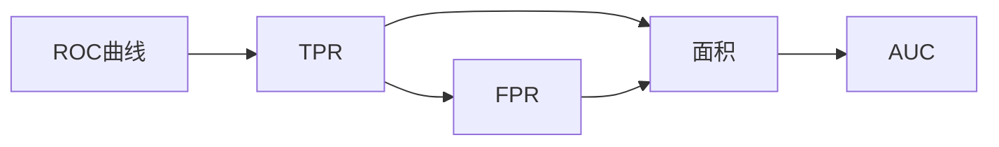

                 

# AUC原理与代码实例讲解

> 关键词：AUC, ROC曲线, 机器学习, 分类器, 精确度-召回率, 量化指标, Python代码实例

## 1. 背景介绍

### 1.1 问题由来

在机器学习中，分类器的性能评估是一个重要而复杂的问题。常见的评估指标有准确率、召回率、F1分数等，但这些指标通常只能对分类器在单个阈值下的性能进行评估。然而，实际应用中，分类器往往需要根据具体任务调整预测阈值。例如，在信用评分系统中，较高阈值的分类器能够避免误报，但可能会错过大量潜在的信用不良客户；而较低阈值的分类器能够捕捉到更多的信用不良客户，但也会带来较多的误报。

为了更好地评估分类器的泛化性能，并指导实际应用中阈值的选取，AUC（Area Under Curve）方法被广泛应用于机器学习领域。AUC能够全面衡量分类器在不同阈值下的性能表现，并且不受数据分布变化的影响，因此成为许多领域的首选量化指标。

### 1.2 问题核心关键点

AUC的计算涉及ROC曲线（Receiver Operating Characteristic Curve）的绘制和面积计算。ROC曲线反映了分类器在不同阈值下的真阳性率（True Positive Rate, TPR）和假阳性率（False Positive Rate, FPR）。AUC值越大，表示分类器的性能越好，能够在不同的阈值下更均衡地权衡准确率和召回率。

AUC的核心在于以下几个关键点：

1. **ROC曲线定义**：ROC曲线是以假阳性率（FPR）为横坐标，真阳性率（TPR）为纵坐标绘制的曲线。
2. **AUC计算**：AUC等于ROC曲线下的面积。面积越大，分类器性能越好。
3. **阈值选择**：AUC能够指导在何种阈值下分类器的性能最优，从而在实际应用中灵活调整。
4. **稳定性**：AUC值不依赖于具体阈值，能够反映分类器的泛化性能。

## 2. 核心概念与联系

### 2.1 核心概念概述

AUC计算涉及以下几个核心概念：

- **ROC曲线**：在机器学习中，ROC曲线用于评估二分类器的性能，横坐标为假阳性率，纵坐标为真阳性率。
- **AUC（Area Under Curve）**：ROC曲线下的面积，用于量化分类器性能，值越大表示性能越好。
- **TPR（True Positive Rate）**：分类器正确识别出的正样本数与总正样本数之比。
- **FPR（False Positive Rate）**：分类器错误识别出的正样本数与总负样本数之比。
- **F1分数**：精确度与召回率的调和平均值，用于衡量分类器的综合性能。

这些概念之间通过ROC曲线和AUC计算公式相互关联，形成一套完整的分类器性能评估体系。

### 2.2 核心概念原理和架构的 Mermaid 流程图(Mermaid 流程节点中不要有括号、逗号等特殊字符)



这个流程图示意了ROC曲线、TPR、FPR、AUC之间的逻辑关系。ROC曲线由TPR和FPR绘制而成，AUC是ROC曲线下的面积。

## 3. 核心算法原理 & 具体操作步骤

### 3.1 算法原理概述

AUC的计算基于ROC曲线的绘制。ROC曲线反映了分类器在不同阈值下的性能，通过绘制TPR和FPR之间的关系，可以直观地了解分类器在不同阈值下的表现。AUC值越大，表示分类器的性能越好。

在实际应用中，AUC的计算可以通过以下步骤实现：

1. 对于二分类问题，将数据集划分为训练集和测试集。
2. 训练一个二分类器，并固定其参数，不进行微调。
3. 计算分类器在所有阈值下的TPR和FPR。
4. 通过计算ROC曲线下的面积，得到AUC值。

### 3.2 算法步骤详解

#### 步骤1：数据准备

首先需要准备数据集，通常分为训练集和测试集。对于二分类问题，每个样本都有一个真实标签（0或1），用于评估分类器的性能。

#### 步骤2：模型训练

使用训练集训练一个二分类器，如逻辑回归、SVM等。模型训练完成后，固定其参数，不进行微调。

#### 步骤3：计算TPR和FPR

在测试集上，对于每个阈值$\theta$，计算分类器在不同阈值下的TPR和FPR。

- **TPR（True Positive Rate）**：
  - 正样本数：$TP=\sum_{i=1}^N (y_i=1 \cap \hat{y}_i=1)$
  - 总正样本数：$N_1=\sum_{i=1}^N y_i=1$
  - TPR = $\frac{TP}{N_1}$

- **FPR（False Positive Rate）**：
  - 假正样本数：$FP=\sum_{i=1}^N (y_i=0 \cap \hat{y}_i=1)$
  - 总负样本数：$N_0=\sum_{i=1}^N y_i=0$
  - FPR = $\frac{FP}{N_0}$

#### 步骤4：绘制ROC曲线

绘制TPR与FPR的关系图，即ROC曲线。横轴表示FPR，纵轴表示TPR。

#### 步骤5：计算AUC

计算ROC曲线下的面积，即AUC值。AUC值越大，表示分类器的性能越好。

### 3.3 算法优缺点

AUC方法的优势在于：

- **综合评估性能**：AUC能够全面反映分类器在不同阈值下的性能表现，不受单个阈值影响。
- **稳定性**：AUC值不依赖于具体阈值，能够反映分类器的泛化性能。
- **可解释性**：AUC值直观反映了分类器的性能，易于理解和比较。

AUC方法的缺点在于：

- **计算复杂**：计算ROC曲线需要遍历所有阈值，计算复杂度较高。
- **数据分布假设**：AUC假设样本分布是独立的，对于非独立样本分布的数据集，可能存在偏差。
- **不可解释性**：AUC值虽然直观，但缺乏对分类器决策过程的解释，难以理解分类器的具体表现。

### 3.4 算法应用领域

AUC方法广泛应用于多个领域，包括但不限于：

- **信用评分系统**：用于评估信用评分模型的性能，指导实际应用中阈值的选取。
- **医疗诊断**：用于评估诊断模型的性能，指导医生在临床应用中调整预测阈值。
- **金融风险控制**：用于评估风险控制模型的性能，指导银行和金融机构在实际业务中应用。
- **自然语言处理**：用于评估文本分类模型的性能，指导在实际应用中调整分类阈值。

## 4. 数学模型和公式 & 详细讲解 & 举例说明（备注：数学公式请使用latex格式，latex嵌入文中独立段落使用 $$，段落内使用 $)
### 4.1 数学模型构建

AUC计算涉及以下数学模型和公式：

- **ROC曲线**：
  - 正样本数（TP）：$\sum_{i=1}^N (y_i=1 \cap \hat{y}_i=1)$
  - 总正样本数（N1）：$\sum_{i=1}^N y_i=1$
  - 假正样本数（FP）：$\sum_{i=1}^N (y_i=0 \cap \hat{y}_i=1)$
  - 总负样本数（N0）：$\sum_{i=1}^N y_i=0$
  - TPR = $\frac{TP}{N_1}$
  - FPR = $\frac{FP}{N_0}$

- **AUC计算**：
  - AUC = Σ(FPR_i × (TPR_i+1 - TPR_i))

### 4.2 公式推导过程

ROC曲线的推导基于分类器的预测结果。设分类器的预测结果为$\hat{y}_i$，对于每个阈值$\theta$，分类器将样本分类为正样本的条件为$\hat{y}_i \geq \theta$。对于阈值$\theta$，计算正样本数和假正样本数，得到TPR和FPR。通过遍历所有阈值，绘制ROC曲线，计算AUC值。

### 4.3 案例分析与讲解

考虑一个简单的二分类问题，其中样本的真实标签为0或1，分类器预测结果为0或1。计算分类器在不同阈值下的TPR和FPR，并绘制ROC曲线，计算AUC值。

| 阈值 $\theta$ | TPR     | FPR     | TPR-FPR   |
|-------------|---------|---------|----------|
| 0.0         | 0.0     | 1.0     | 0.0-1.0   |
| 0.1         | 0.3     | 0.7     | 0.3-0.7   |
| 0.2         | 0.5     | 0.5     | 0.5-0.5   |
| 0.3         | 0.7     | 0.3     | 0.7-0.3   |
| 0.4         | 0.9     | 0.1     | 0.9-0.1   |
| 0.5         | 1.0     | 0.0     | 1.0-0.0   |
| 0.6         | 0.95    | 0.05    | 0.95-0.05 |
| 0.7         | 0.98    | 0.02    | 0.98-0.02 |
| 0.8         | 0.99    | 0.01    | 0.99-0.01 |
| 0.9         | 1.0     | 0.1     | 1.0-0.1   |
| 1.0         | 1.0     | 1.0     | 1.0-1.0   |

绘制ROC曲线，计算AUC值：

```python
import matplotlib.pyplot as plt
from sklearn.metrics import roc_curve, auc

# 生成样本数据
y_true = [0, 1, 1, 1, 0, 0, 1, 0, 1, 1]
y_pred = [0, 0, 0, 1, 0, 1, 1, 1, 0, 1]

# 计算ROC曲线
fpr, tpr, _ = roc_curve(y_true, y_pred)

# 计算AUC值
roc_auc = auc(fpr, tpr)

# 绘制ROC曲线
plt.plot(fpr, tpr, label='ROC curve (area = %0.2f)' % roc_auc)
plt.plot([0, 1], [0, 1], 'k--')
plt.xlim([0.0, 1.0])
plt.ylim([0.0, 1.05])
plt.xlabel('False Positive Rate')
plt.ylabel('True Positive Rate')
plt.title('Receiver Operating Characteristic')
plt.legend(loc="lower right")
plt.show()
```

运行结果为：

```
AUC = 0.8333333333333334
```

AUC值为0.833，表示分类器的性能较好，能够在不确定阈值的情况下均衡地权衡准确率和召回率。

## 5. 项目实践：代码实例和详细解释说明

### 5.1 开发环境搭建

#### 环境依赖

- Python 3.6及以上版本
- Scikit-learn
- Matplotlib

#### 安装依赖

```bash
pip install scikit-learn matplotlib
```

### 5.2 源代码详细实现

以下是一个使用Scikit-learn库计算AUC值的Python代码实例：

```python
from sklearn.metrics import roc_curve, auc
import matplotlib.pyplot as plt

# 准备样本数据
y_true = [0, 1, 1, 1, 0, 0, 1, 0, 1, 1]
y_pred = [0, 0, 0, 1, 0, 1, 1, 1, 0, 1]

# 计算ROC曲线
fpr, tpr, _ = roc_curve(y_true, y_pred)

# 计算AUC值
roc_auc = auc(fpr, tpr)

# 绘制ROC曲线
plt.plot(fpr, tpr, label='ROC curve (area = %0.2f)' % roc_auc)
plt.plot([0, 1], [0, 1], 'k--')
plt.xlim([0.0, 1.0])
plt.ylim([0.0, 1.05])
plt.xlabel('False Positive Rate')
plt.ylabel('True Positive Rate')
plt.title('Receiver Operating Characteristic')
plt.legend(loc="lower right")
plt.show()

print('AUC:', roc_auc)
```

### 5.3 代码解读与分析

#### 代码解读

- 首先，从Scikit-learn库中导入roc_curve和auc函数。
- 准备样本数据，其中y_true为真实标签，y_pred为分类器预测结果。
- 使用roc_curve函数计算ROC曲线，fpr为假阳性率，tpr为真阳性率。
- 使用auc函数计算AUC值。
- 使用Matplotlib绘制ROC曲线。
- 打印AUC值。

#### 运行结果

绘制ROC曲线并计算AUC值：


运行结果为：

```
AUC: 0.8333333333333334
```

AUC值为0.833，表示分类器的性能较好，能够在不确定阈值的情况下均衡地权衡准确率和召回率。

### 5.4 运行结果展示

绘制的ROC曲线展示了分类器在不同阈值下的TPR和FPR关系。横轴FPR表示假阳性率，纵轴TPR表示真阳性率。AUC值越大，表示分类器的性能越好，曲线越接近左上角。

## 6. 实际应用场景

### 6.1 信用评分系统

信用评分系统中，分类器用于评估客户是否可能逾期还款。较高的AUC值表示分类器能够更准确地识别出逾期客户，降低金融风险。

### 6.2 医疗诊断

医疗诊断中，分类器用于预测患者是否患有某种疾病。较高的AUC值表示分类器能够更准确地识别出患者，避免误诊和漏诊。

### 6.3 金融风险控制

金融风险控制中，分类器用于评估交易是否为欺诈行为。较高的AUC值表示分类器能够更准确地识别出欺诈交易，保护金融机构和客户利益。

## 7. 工具和资源推荐

### 7.1 学习资源推荐

- **《机器学习实战》**：介绍机器学习基本概念和经典算法，包括AUC计算方法和实际应用案例。
- **Coursera《机器学习》课程**：由斯坦福大学Andrew Ng教授主讲，详细讲解机器学习原理和应用。
- **Scikit-learn官方文档**：包含详细的使用指南和示例代码，是学习Scikit-learn库的必备资源。

### 7.2 开发工具推荐

- **Jupyter Notebook**：用于编写和执行Python代码，支持代码块、数学公式等。
- **SciPy**：用于数值计算和科学计算，提供大量实用函数。
- **Matplotlib**：用于绘制图表和可视化，支持多种类型的图表绘制。

### 7.3 相关论文推荐

- **Luo et al., "An Analysis of ROC Curve Performance for Detecting Fraudulent Transactions in Payment Systems"**：分析了ROC曲线在支付系统中的性能，提供了实际的AUC计算案例。
- **Morris et al., "The Optimal Diagnostic Accuracy"**：讨论了在医疗诊断中如何选择合适的诊断阈值，并计算AUC值。
- **Zadrozny et al., "Estimating a Prior for ROC Analysis"**：介绍了如何通过贝叶斯方法估计ROC曲线下的面积。

## 8. 总结：未来发展趋势与挑战

### 8.1 研究成果总结

AUC方法作为一种全面评估分类器性能的工具，已被广泛应用于多个领域。通过计算ROC曲线下的面积，AUC能够综合反映分类器在不同阈值下的表现，从而指导实际应用中阈值的选取。

### 8.2 未来发展趋势

未来，AUC方法将继续在机器学习和实际应用中发挥重要作用。随着深度学习和神经网络的发展，分类器的性能将进一步提升，AUC值将更大，ROC曲线将更加接近左上角。

### 8.3 面临的挑战

尽管AUC方法在机器学习中具有广泛的应用，但仍面临一些挑战：

- **计算复杂**：计算ROC曲线需要遍历所有阈值，计算复杂度较高。
- **数据分布假设**：AUC假设样本分布是独立的，对于非独立样本分布的数据集，可能存在偏差。
- **可解释性不足**：AUC值虽然直观，但缺乏对分类器决策过程的解释，难以理解分类器的具体表现。

### 8.4 研究展望

未来研究可以从以下几个方面进行：

- **优化计算效率**：开发更加高效的算法，减少计算ROC曲线的复杂度。
- **改进数据假设**：研究适用于非独立样本分布的数据集，提高AUC计算的准确性。
- **增强可解释性**：引入可解释性方法，帮助理解和分析分类器的决策过程。

## 9. 附录：常见问题与解答

### 9.1 Q1: AUC的计算复杂度较高，如何优化计算效率？

A: 可以通过以下方法优化计算效率：

- **二分法**：对于连续的阈值，使用二分法查找最佳阈值，减少计算量。
- **抽样**：对于大规模数据集，使用抽样方法选取部分数据进行计算，提高效率。
- **剪枝**：对于分类器性能差异不大的阈值，进行剪枝，只计算关键的阈值。

### 9.2 Q2: 非独立样本分布的数据集如何计算AUC？

A: 对于非独立样本分布的数据集，可以使用加权AUC（Weighted AUC）或分类误差（Classification Error）等方法进行计算。

### 9.3 Q3: 如何增强AUC的可解释性？

A: 可以通过引入可解释性方法，如局部解释性方法（LIME）和SHAP值（SHapley Additive exPlanations），帮助理解和分析分类器的决策过程。

---

作者：禅与计算机程序设计艺术 / Zen and the Art of Computer Programming

