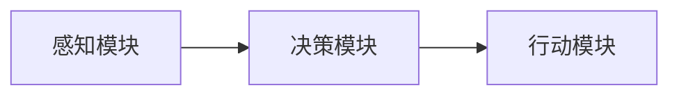

                 

## 1. 背景介绍

在当今的智能应用领域，Agent 模型（通常指智能代理或智能体）作为核心构建块，广泛应用于自然语言处理、推荐系统、自动驾驶、游戏AI等诸多领域。其核心思想是通过模拟人类的感知、决策、行动等过程，构建出一个具备智能处理能力的实体，以实现自动化、智能化的复杂任务。

Agent 模型是由一系列组件构建而成的，各组件之间通过协同工作来模拟人类智能行为。理解 Agent 模型的基础架构及其关键要素，有助于深入其设计原理和应用实践。

## 2. 核心概念与联系

### 2.1 核心概念概述

Agent 模型通常由感知模块、决策模块和行动模块三个核心组件构成，如图1所示。



- **感知模块**：负责接收外界信息并将其转化为结构化数据，是智能体与环境交互的接口。
- **决策模块**：接收感知模块传入的数据，通过推理、规划等机制，生成行动策略。
- **行动模块**：根据决策模块生成的策略，执行具体行动。

这些组件通过相互协作，完成智能体的感知、决策和行动过程。

### 2.2 核心概念原理和架构的 Mermaid 流程图


Agent 的核心架构流程由数据流向展开，具体流程如下：

1. 感知模块接收外界环境数据。
2. 感知模块将数据转换为结构化表示，传递给决策模块。
3. 决策模块分析感知数据，生成行动计划。
4. 行动模块根据行动计划执行相应的行动。

## 3. 核心算法原理 & 具体操作步骤

### 3.1 算法原理概述

Agent 模型基于代理学习（Agential Learning）的原理，通过不断与环境交互，学习优化自身的决策策略。这种基于奖励（Reward）的学习方法，被称为强化学习（Reinforcement Learning, RL）。强化学习通过不断地试错，逐步优化智能体的决策过程，最终达到最优策略。

### 3.2 算法步骤详解

Agent 模型的训练通常包括以下几个关键步骤：

**Step 1: 环境定义**
- 定义Agent需要交互的环境，包括环境的状态空间、行动空间、初始状态和状态转移函数。
- 环境通常由状态空间、行动空间、状态转移函数等构成，如MDP（Markov Decision Process）。

**Step 2: 感知模块构建**
- 将感知数据转换为模型可以处理的结构化格式。
- 常见的感知数据包括文本、图像、语音等，转换为向量或矩阵表示。

**Step 3: 决策模块设计**
- 设计智能体的决策策略，可以是基于规则的决策策略，也可以是基于深度学习的决策策略。
- 常用的决策策略包括策略梯度、价值迭代、Q-learning、策略网络等。

**Step 4: 行动模块实现**
- 将决策策略转换为具体的行动。
- 行动模块通常包含一个行动选择器，根据当前状态和决策策略，选择合适的行动。

**Step 5: 模型训练**
- 通过在特定环境中训练Agent，学习最优决策策略。
- 训练过程包括多轮交互，不断优化行动策略，提升Agent的性能。

**Step 6: 模型评估与部署**
- 对训练好的Agent进行评估，确保其在目标环境中的表现。
- 将训练好的Agent部署到实际应用中，执行特定的智能任务。

### 3.3 算法优缺点

Agent 模型的优缺点如下：

#### 优点
1. **通用性**：Agent 模型具有通用性，可以应用于多种场景，如自然语言处理、推荐系统、自动驾驶等。
2. **适应性强**：Agent 模型可以根据环境的变化，动态调整决策策略，适应不同的环境需求。
3. **可扩展性强**：Agent 模型的组件模块化设计，便于扩展和优化。

#### 缺点
1. **训练复杂**：Agent 模型的训练过程相对复杂，需要大量的计算资源和时间。
2. **效果依赖于环境**：Agent 模型的性能依赖于环境的复杂性和环境提供的奖励信号。
3. **鲁棒性不足**：Agent 模型在面对不确定性和环境变化时，可能出现策略失效的情况。

### 3.4 算法应用领域

Agent 模型的应用领域非常广泛，以下列举了几个典型的应用场景：

- **自然语言处理**：如自动问答系统、机器翻译、智能客服等。
- **推荐系统**：如商品推荐、新闻推荐、音乐推荐等。
- **自动驾驶**：如路径规划、避障决策等。
- **游戏AI**：如智能对抗、策略游戏、即时战略游戏等。
- **金融风控**：如信用评分、风险评估、欺诈检测等。

这些应用场景都具有复杂性、多变性和不确定性，Agent 模型能够通过学习不断优化策略，适应不同环境，达到智能化的效果。

## 4. 数学模型和公式 & 详细讲解 & 举例说明

### 4.1 数学模型构建

Agent 模型通常基于MDP框架，定义状态空间 $S$、行动空间 $A$、奖励函数 $R$、状态转移函数 $P$ 和折扣因子 $\gamma$。

设当前状态为 $s_t$，行动为 $a_t$，下一个状态为 $s_{t+1}$，则MDP的期望总奖励为：

$$
J(s_0) = \mathbb{E}\left[\sum_{t=0}^{\infty} \gamma^t R(s_t, a_t) \mid s_0 \right]
$$

其中，$\gamma$ 为折扣因子，通常取 $0.9-0.99$ 之间。

### 4.2 公式推导过程

Agent 模型的训练目标是通过最大化期望总奖励 $J(s_0)$。使用策略 $\pi$ 定义智能体的行动策略，则有：

$$
J(s_0) = \max_{\pi} \mathbb{E}\left[\sum_{t=0}^{\infty} \gamma^t R(s_t, a_t) \mid s_0 \right]
$$

对于基于Q-learning的Agent，目标是最小化状态-行动值函数 $Q(s, a)$：

$$
Q(s, a) = \mathbb{E}[r + \gamma Q(s', a') \mid s, a]
$$

其中 $s'$ 和 $a'$ 表示下一个状态和行动。

### 4.3 案例分析与讲解

以自然语言处理的自动问答系统为例，该系统可以视为一个MDP，问题 $q$ 为状态，答案 $a$ 为行动。奖励函数 $R(q, a)$ 可以定义为回答正确与否。

问题 $q$ 的行动 $a$ 通常可以通过模型预测得到，如BERT模型的向量表示。状态转移函数 $P(q', q \mid q, a)$ 表示根据当前问题和答案，生成下一个问题。

通过在大量问题-答案对上训练Agent，不断调整状态-行动值函数 $Q(q, a)$，使Agent能够精准回答各种问题。

## 5. 项目实践：代码实例和详细解释说明

### 5.1 开发环境搭建

**Step 1: 环境配置**
- 安装Python 3.7及以上版本，建议使用Anaconda环境管理工具。
- 安装OpenAI Gym、TensorFlow、PyTorch等依赖库。

**Step 2: 数据准备**
- 收集问题-答案对的数据集，如Cornell Movie Dialogs Corpus。
- 预处理数据集，如分词、编码等。

### 5.2 源代码详细实现

以下是一个简单的基于PyTorch和OpenAI Gym的Q-learningAgent实现代码示例。

```python
import gym
import torch
import torch.nn as nn
import torch.optim as optim
import numpy as np

# 定义Q网络
class QNetwork(nn.Module):
    def __init__(self, input_size, output_size):
        super(QNetwork, self).__init__()
        self.fc1 = nn.Linear(input_size, 64)
        self.fc2 = nn.Linear(64, output_size)

    def forward(self, x):
        x = self.fc1(x)
        x = torch.relu(x)
        x = self.fc2(x)
        return x

# 定义Agent
class QLearningAgent:
    def __init__(self, env, input_size, output_size, learning_rate):
        self.env = env
        self.input_size = input_size
        self.output_size = output_size
        self.learning_rate = learning_rate
        self.model = QNetwork(input_size, output_size)
        self.optimizer = optim.Adam(self.model.parameters(), lr=learning_rate)

    def get_action(self, state):
        state = torch.tensor(state, dtype=torch.float32)
        with torch.no_grad():
            action_probs = self.model(state)
            action = np.random.choice(np.arange(self.output_size), p=action_probs.numpy()[0])
        return action

    def update_model(self, state, action, reward, next_state, done):
        state = torch.tensor(state, dtype=torch.float32)
        next_state = torch.tensor(next_state, dtype=torch.float32)
        action = torch.tensor(action, dtype=torch.int64)
        reward = torch.tensor(reward, dtype=torch.float32)
        target = reward + self.env.gamma * self.model(next_state).detach().max(1)[0]
        prediction = self.model(state)
        loss = nn.functional.mse_loss(prediction, target.unsqueeze(1))
        self.optimizer.zero_grad()
        loss.backward()
        self.optimizer.step()

    def train(self, episodes=1000, max_steps=100):
        for episode in range(episodes):
            state = self.env.reset()
            done = False
            total_reward = 0
            for step in range(max_steps):
                action = self.get_action(state)
                next_state, reward, done, _ = self.env.step(action)
                self.update_model(state, action, reward, next_state, done)
                state = next_state
                total_reward += reward
                if done:
                    break
            print(f"Episode {episode+1}, Reward: {total_reward}")
        self.model.eval()

# 使用QLearningAgent进行训练
env = gym.make("CartPole-v1")
agent = QLearningAgent(env, input_size=4, output_size=2, learning_rate=0.01)
agent.train()
```

### 5.3 代码解读与分析

**QNetwork类**：
- 定义了Q网络的输入层和输出层，以及激活函数和前向传播方法。

**QLearningAgent类**：
- 初始化时创建Q网络和优化器。
- `get_action`方法：根据当前状态，生成行动。
- `update_model`方法：根据状态、行动、奖励和下一个状态更新模型参数。
- `train`方法：在Gym环境中训练Agent，不断优化模型参数。

**使用示例**：
- 使用Gym创建CartPole环境。
- 创建QLearningAgent，并传入输入大小、输出大小和学习率。
- 调用`train`方法进行训练，打印训练过程中的奖励。

## 6. 实际应用场景

### 6.1 智能客服系统

智能客服系统利用Agent模型处理用户查询，提供自动化服务。通过在实际对话中训练Agent，使其逐步学习用户意图和常见问题，能够快速响应用户需求，提供准确的解答。

**技术实现**：
- 收集用户查询和答案对，预处理成向量表示。
- 定义智能体的状态和行动，训练基于深度学习的决策策略。
- 部署到客服系统中，实时接收用户输入，输出应答。

**效果**：
- 提升客服系统的响应速度和准确率。
- 降低人力成本，提高客户满意度。

### 6.2 推荐系统

推荐系统通过Agent模型预测用户偏好，生成个性化推荐结果。通过在用户行为数据上训练Agent，使其学习到用户偏好，能够动态调整推荐策略。

**技术实现**：
- 收集用户浏览、购买等行为数据。
- 预处理成向量表示，定义智能体的状态和行动。
- 训练基于深度学习的决策策略，输出推荐结果。

**效果**：
- 提升推荐系统的个性化和准确性。
- 提升用户体验，提高转化率。

### 6.3 自动驾驶

自动驾驶系统利用Agent模型进行路径规划和避障决策。通过在虚拟或实际环境中训练Agent，使其学习到最优驾驶策略，能够适应各种复杂交通场景。

**技术实现**：
- 收集车辆位置、速度、周围环境等数据。
- 定义智能体的状态和行动，训练基于深度学习的决策策略。
- 部署到自动驾驶系统中，实时进行路径规划和避障决策。

**效果**：
- 提升自动驾驶系统的安全性。
- 提升用户体验，减少交通拥堵。

## 7. 工具和资源推荐

### 7.1 学习资源推荐

- **《强化学习：经典与现代》**：由Richard S. Sutton和Andrew G. Barto所著的经典教材，介绍了强化学习的理论基础和实践应用。
- **DeepRL（深度强化学习）课程**：由Dharmin Desai等专家讲授的Coursera课程，覆盖了强化学习的核心算法和应用案例。
- **PyTorch RL tutorial**：PyTorch官方提供的RL教程，包含丰富的代码示例和详细解释。

### 7.2 开发工具推荐

- **Gym**：OpenAI提供的基于Python的AI环境，支持多种游戏和环境，便于训练和测试Agent。
- **TensorFlow**：Google开源的深度学习框架，支持分布式训练和模型部署。
- **PyTorch**：Facebook开源的深度学习框架，易于使用和调试，适用于研究和小规模项目。
- **JAX**：Google开发的加速深度学习的库，支持高性能计算和自动微分。

### 7.3 相关论文推荐

- **《Deep Reinforcement Learning for Agents》**：David Silver等专家撰写的深度强化学习综述，介绍了各种Agent模型的训练方法和应用案例。
- **《Playing Atari with Deep Reinforcement Learning》**：David Silver等专家在Nature上发表的论文，展示了深度强化学习在多种Atari游戏上的应用效果。
- **《Attention is All You Need》**：谷歌开源的Transformer模型，引入自注意力机制，提升了自然语言处理任务的表现。

## 8. 总结：未来发展趋势与挑战

### 8.1 研究成果总结

Agent模型作为智能系统的核心构建块，经过多年的发展和研究，已经在自然语言处理、推荐系统、自动驾驶等领域取得了显著成果。其核心思想通过模拟人类感知、决策和行动过程，实现智能化的复杂任务处理。

### 8.2 未来发展趋势

1. **多模态融合**：Agent模型将从单模态扩展到多模态，如视觉、语音、文本等多种信息源的融合，提升系统智能水平。
2. **分布式训练**：随着计算资源和硬件的发展，Agent模型的训练将逐步向分布式和并行方向发展，提升训练效率和效果。
3. **模型压缩与优化**：为了应对计算资源的限制，Agent模型将向模型压缩和优化方向发展，提升模型推理效率和资源利用率。
4. **混合学习策略**：将强化学习与监督学习、无监督学习等其他学习方式相结合，提升Agent模型的性能和鲁棒性。

### 8.3 面临的挑战

1. **训练复杂性**：Agent模型的训练需要大量的计算资源和时间，如何优化训练过程，提升训练效率是未来研究的重要方向。
2. **鲁棒性不足**：Agent模型在面对复杂和不确定的环境时，可能出现策略失效的情况，如何提升模型的鲁棒性，是未来研究的重要课题。
3. **模型可解释性**：Agent模型通常是"黑盒"系统，难以解释其决策过程和行动策略，如何提升模型的可解释性，将是未来的研究方向。
4. **资源消耗大**：Agent模型通常需要大量的计算资源，如何优化模型结构，减少资源消耗，提升推理效率，是未来研究的重要方向。

### 8.4 研究展望

未来Agent模型将在多模态融合、分布式训练、模型压缩与优化、混合学习策略等方向继续深入研究，提升系统的智能水平和应用效果。同时，研究将更多关注模型鲁棒性、可解释性和资源消耗，推动Agent模型的实际应用和产业化进程。

## 9. 附录：常见问题与解答

**Q1：Agent模型与传统机器学习模型的区别是什么？**

A: Agent模型与传统机器学习模型的主要区别在于其动态决策过程和智能体与环境的交互能力。Agent模型通过感知模块接收环境信息，通过决策模块生成行动策略，通过行动模块执行行动，不断与环境交互，学习最优策略。而传统机器学习模型通常静态地处理输入数据，缺乏动态决策和环境交互能力。

**Q2：Agent模型在训练过程中如何避免过拟合？**

A: Agent模型在训练过程中可以采用以下几种方法避免过拟合：
1. 数据增强：通过对训练数据进行扩充和变换，增加数据多样性。
2. 正则化：使用L2正则、Dropout等方法防止模型过拟合。
3. 对抗训练：通过对抗样本训练模型，提升模型的鲁棒性和泛化能力。
4. 模型裁剪：去除冗余参数和层，简化模型结构，减少过拟合风险。

**Q3：Agent模型在实际应用中如何优化推理效率？**

A: Agent模型在实际应用中可以通过以下几种方法优化推理效率：
1. 模型压缩：使用知识蒸馏、剪枝等方法压缩模型，减少参数数量和计算量。
2. 分布式推理：使用多台设备并行推理，提升推理速度和效率。
3. 硬件加速：使用GPU、TPU等高性能设备加速推理过程。
4. 推理缓存：使用缓存技术，重复利用已计算结果，减少重复计算。

**Q4：Agent模型在实际应用中如何保证模型安全性？**

A: Agent模型在实际应用中可以通过以下几种方法保证模型安全性：
1. 数据加密：对输入数据进行加密，防止数据泄露和篡改。
2. 模型监控：实时监控模型行为，发现异常情况及时采取措施。
3. 输入验证：对输入数据进行严格验证，防止恶意输入。
4. 模型审计：定期对模型进行审计，发现并修复潜在漏洞。

以上是对Agent模型基础架构要素的全面介绍和深入分析，希望对读者在理解Agent模型和应用实践中有所帮助。

