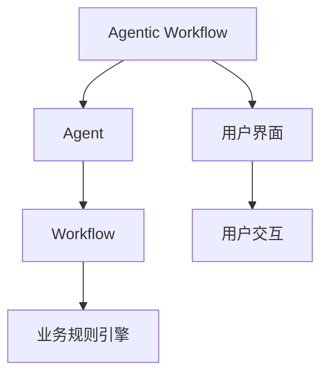

                 

# Agentic Workflow 的用户群体

## 1. 背景介绍

### 1.1 问题由来
随着自动化、人工智能(AI)等技术的迅速发展，软件工程领域的许多工作开始由机器替代。同时，越来越多的任务需要同时考虑自动化的普适性、易用性和专业性。

但传统的工作流管理系统（Workflow Management Systems，WMS）往往过于专注于自动化和抽象级别，无法灵活应对实际业务场景中的复杂性和多样性。例如，对于执行和监控工作流的工具，需要兼顾业务流程的具体细节，以及多方的协同工作。

这些痛点催生了Agentic Workflow（智能工作流）的概念，希望通过引入AI辅助工作流管理，提升业务流程的自动化水平，同时确保其在复杂业务场景中的易用性和专业性。

## 2. 核心概念与联系

### 2.1 核心概念概述
为了更准确地把握Agentic Workflow的核心概念，我们首先定义以下几个关键概念：

- **Agentic Workflow（智能工作流）**：结合了自动化、机器学习和用户界面的智能工作流管理系统，旨在优化业务流程，提升自动化水平和系统灵活性。
- **Agent（智能代理）**：Agentic Workflow中的关键组件，通过机器学习算法，自动处理数据、执行任务、优化决策，从而提升工作流的自动化程度。
- **Workflow（工作流）**：描述任务执行的顺序和步骤，通常包括数据流动、任务执行和决策等环节。
- **业务规则引擎（Business Rule Engine）**：一种自动化工作流机制，用于实现业务逻辑的自动化处理，确保工作流按照既定规则执行。

这些核心概念之间的关系，可以通过以下Mermaid流程图来展示：



这个流程图展示了Agentic Workflow的组成和关键流程：

1. 用户通过用户界面（UI）与Agentic Workflow进行交互。
2. Workflow描述任务执行的顺序和步骤。
3. Agent利用AI技术执行任务、处理数据、优化决策。
4. 业务规则引擎确保任务按照预设规则执行。

### 2.2 核心概念原理和架构

#### 2.2.1 代理（Agent）原理
Agent作为Agentic Workflow的核心，通常基于机器学习算法，其原理包括但不限于以下几个方面：

1. **监督学习**：使用标记好的数据集训练模型，使其能够从历史数据中学习并预测未来行为。
2. **强化学习**：通过模拟环境和奖励机制训练模型，使其能够在复杂多变的环境中做出最优决策。
3. **规则引擎**：通过一系列业务规则，指导Agent在特定条件下采取特定行为。
4. **知识库**：整合专家知识和经验，使Agent具备更丰富的先验信息。

Agent的设计和实现可以采用多种方式，包括：

1. **封装化智能模块**：将智能模块封装为可重用的组件，可以在不同的业务场景中灵活使用。
2. **分布式体系结构**：通过分布式计算，提升Agentic Workflow的扩展性和处理能力。
3. **端到端训练**：将Agentic Workflow视为一个整体进行训练，确保各组件协同工作。

#### 2.2.2 Workflow原理
Workflow作为业务流程的逻辑描述，其主要原理包括：

1. **流程建模**：使用图形化或编程的方式，定义任务的顺序、条件、数据流动等。
2. **任务调度**：根据业务规则引擎和Agent的决策，安排任务的执行顺序和时间。
3. **状态管理**：记录任务执行状态，确保任务按照既定流程进行。
4. **异常处理**：处理执行过程中的异常情况，确保流程的稳定性。

#### 2.2.3 业务规则引擎原理
业务规则引擎的核心原理包括：

1. **条件判断**：根据业务规则，对输入数据进行条件判断，决定后续处理逻辑。
2. **逻辑执行**：执行预定义的业务逻辑，对数据进行相应的处理。
3. **决策支持**：提供决策建议，辅助Agent进行复杂决策。
4. **事件驱动**：根据事件触发规则，动态调整业务逻辑和执行顺序。

## 3. 核心算法原理 & 具体操作步骤

### 3.1 算法原理概述

Agentic Workflow的核心算法主要集中在Agent的训练和优化上，通过机器学习算法和业务规则引擎，实现任务的自动执行和优化决策。其核心算法包括以下几个方面：

1. **监督学习**：利用标记好的数据集，训练Agent的决策模型。
2. **强化学习**：在模拟环境中，通过奖励机制，训练Agent的执行策略。
3. **集成学习**：结合不同的算法和模型，提升Agent的综合性能。
4. **元学习**：通过学习如何学习，提高Agent的适应性和泛化能力。
5. **知识抽取**：从大量数据中提取有价值的信息，指导Agent的行为。

### 3.2 算法步骤详解

Agentic Workflow的算法步骤可以分为以下几个关键步骤：

1. **数据收集与预处理**：收集业务流程中的数据，包括历史执行记录、用户反馈、任务参数等，并进行清洗和标注。
2. **模型训练与优化**：利用监督学习和强化学习算法，训练Agent的决策模型和执行策略，并通过交叉验证和超参数调整优化模型性能。
3. **规则编写与验证**：根据业务需求，编写业务规则，并在模拟环境中进行验证，确保规则的正确性和可执行性。
4. **模型部署与监控**：将训练好的Agent和业务规则引擎部署到实际环境中，并进行持续监控和反馈优化。
5. **用户交互与反馈**：在实际业务环境中，通过用户界面与用户进行交互，收集反馈信息，用于进一步优化Agent和业务规则引擎。

### 3.3 算法优缺点

Agentic Workflow的算法具有以下优点：

1. **高度自动化**：通过Agent和业务规则引擎的协同工作，实现业务的自动化处理，大大提升工作效率。
2. **高灵活性**：Agent可以根据不同业务场景和用户需求，灵活调整决策和执行策略，适应复杂多变的业务环境。
3. **易用性**：用户界面简化了复杂的工作流程，使得业务人员能够快速上手和操作Agentic Workflow。
4. **可扩展性**：通过分布式计算和微服务架构，Agentic Workflow可以轻松扩展处理能力和支持多种业务场景。

同时，Agentic Workflow的算法也存在以下缺点：

1. **数据依赖性高**：Agentic Workflow需要大量标注数据进行模型训练，数据质量直接影响Agent的性能。
2. **模型复杂性**：Agent的训练和优化需要复杂的算法和计算资源，对技术要求较高。
3. **规则复杂性**：业务规则的编写和验证需要业务人员具备较强的专业知识和技能。
4. **反馈周期长**：用户反馈和模型优化的周期较长，需要持续迭代和改进。

### 3.4 算法应用领域

Agentic Workflow在多个领域得到了广泛的应用，包括但不限于：

1. **金融服务**：在风险管理、交易执行、客户服务等方面，利用Agentic Workflow提升自动化水平和业务响应速度。
2. **医疗健康**：在病历管理、诊断分析、患者管理等方面，通过Agentic Workflow优化工作流程，提高医疗服务质量。
3. **零售电商**：在订单处理、客户服务、库存管理等方面，利用Agentic Workflow提升业务效率和客户满意度。
4. **人力资源**：在招聘管理、员工培训、绩效评估等方面，通过Agentic Workflow简化流程，提升管理效率。
5. **制造工程**：在生产调度、质量控制、设备维护等方面，利用Agentic Workflow实现智能生产和管理。
6. **交通运输**：在车辆调度、路径规划、实时监控等方面，通过Agentic Workflow提高运营效率和服务质量。

## 4. 数学模型和公式 & 详细讲解 & 举例说明

### 4.1 数学模型构建

Agentic Workflow的数学模型构建主要包括以下几个方面：

1. **输入数据**：包括历史执行记录、用户反馈、任务参数等，形式化表示为 $D=\{x_i,y_i\}_{i=1}^N$，其中 $x_i$ 为输入数据，$y_i$ 为输出标签。
2. **决策模型**：Agentic Workflow中的决策模型通常基于监督学习和强化学习算法，形式化表示为 $\hat{y}=f_\theta(x)$，其中 $f_\theta$ 为模型函数，$\theta$ 为模型参数。
3. **业务规则引擎**：业务规则引擎通常基于逻辑表达式和条件判断，形式化表示为 $R(\{x_i\})$，其中 $R$ 为规则函数。
4. **执行策略**：Agentic Workflow中的执行策略通常基于强化学习算法，形式化表示为 $\pi_\theta(a|s)$，其中 $a$ 为执行动作，$s$ 为当前状态。

### 4.2 公式推导过程

以监督学习为例，Agentic Workflow中的决策模型可以表示为：

$$
f_\theta(x) = \sum_{i=1}^n w_i g_i(x; \theta)
$$

其中 $g_i$ 为单个决策函数，$w_i$ 为权重，$n$ 为决策函数个数。决策函数 $g_i$ 的输出通常为概率分布或分数，用于评估每个决策的可能性和效果。

业务规则引擎的逻辑表达式可以表示为：

$$
R(\{x_i\}) = \left\{
\begin{array}{ll}
true, & \text{if } C_1(\{x_i\}) \land C_2(\{x_i\}) \\
false, & \text{otherwise}
\end{array}
\right.
$$

其中 $C_1, C_2$ 为条件表达式，$\land$ 为逻辑与。业务规则引擎根据逻辑表达式，对输入数据进行条件判断，确定执行策略。

强化学习的执行策略可以表示为：

$$
\pi_\theta(a|s) = \frac{\exp(\theta^\top Q(s,a))}{\sum_{a'} \exp(\theta^\top Q(s,a'))}
$$

其中 $Q(s,a)$ 为状态-动作值函数，$\theta$ 为策略参数，$a$ 为执行动作，$s$ 为当前状态。强化学习通过最大化累积奖励，优化执行策略。

### 4.3 案例分析与讲解

以金融风险管理为例，Agentic Workflow可以通过以下步骤实现自动化处理：

1. **数据收集与预处理**：收集历史交易数据、客户信息、市场行情等数据，并进行清洗和标注。
2. **模型训练与优化**：利用监督学习算法，训练Agentic Workflow的决策模型，用于识别风险类型和评估风险水平。
3. **规则编写与验证**：根据金融业务需求，编写业务规则，确保交易合规性和风险控制。
4. **模型部署与监控**：将训练好的Agentic Workflow部署到交易系统，并进行持续监控和反馈优化。
5. **用户交互与反馈**：通过用户界面与交易员进行交互，收集反馈信息，用于进一步优化Agentic Workflow。

## 5. 项目实践：代码实例和详细解释说明

### 5.1 开发环境搭建

在进行Agentic Workflow的开发前，我们需要准备好开发环境。以下是使用Python进行PyTorch开发的环境配置流程：

1. 安装Anaconda：从官网下载并安装Anaconda，用于创建独立的Python环境。

2. 创建并激活虚拟环境：
```bash
conda create -n pytorch-env python=3.8 
conda activate pytorch-env
```

3. 安装PyTorch：根据CUDA版本，从官网获取对应的安装命令。例如：
```bash
conda install pytorch torchvision torchaudio cudatoolkit=11.1 -c pytorch -c conda-forge
```

4. 安装TensorBoard：
```bash
pip install tensorboard
```

5. 安装Flask：用于构建用户界面和API。
```bash
pip install flask
```

完成上述步骤后，即可在`pytorch-env`环境中开始Agentic Workflow的开发。

### 5.2 源代码详细实现

这里我们以一个简单的Agentic Workflow为例，给出使用Flask构建的用户界面和API代码实现。

首先，定义Agentic Workflow的决策模型：

```python
import torch
from torch import nn
from torch.optim import Adam

class Model(nn.Module):
    def __init__(self, input_size, output_size):
        super(Model, self).__init__()
        self.fc1 = nn.Linear(input_size, 128)
        self.fc2 = nn.Linear(128, output_size)
        
    def forward(self, x):
        x = self.fc1(x)
        x = torch.relu(x)
        x = self.fc2(x)
        return x
```

然后，定义业务规则引擎：

```python
class RuleEngine:
    def __init__(self):
        self.rules = [
            ("if age > 18, then eligible", lambda age: age > 18),
            ("if income > 50000, then high_risk", lambda income: income > 50000)
        ]
    
    def apply(self, data):
        for rule in self.rules:
            if rule[1](data):
                return True
        return False
```

接着，定义Flask用户界面和API：

```python
from flask import Flask, request, jsonify

app = Flask(__name__)

@app.route('/predict', methods=['POST'])
def predict():
    data = request.json
    age = data['age']
    income = data['income']
    
    if RuleEngine().apply(data):
        model = Model(input_size=2, output_size=2)
        model.load_state_dict(torch.load('model.pth'))
        model.eval()
        with torch.no_grad():
            output = model(torch.tensor([age, income]).float())
        return jsonify({'result': output.item() > 0.5})
    else:
        return jsonify({'result': False})

if __name__ == '__main__':
    app.run(debug=True)
```

最后，启动Flask应用：

```bash
python app.py
```

在浏览器中访问 `http://localhost:5000/predict`，发送JSON格式的请求数据，即可测试Agentic Workflow的用户界面和API。

### 5.3 代码解读与分析

让我们再详细解读一下关键代码的实现细节：

**Model类**：
- `__init__`方法：初始化决策模型，定义全连接层和激活函数。
- `forward`方法：定义模型的前向传播过程，计算输入数据经过多层的非线性变换后的输出。

**RuleEngine类**：
- `__init__`方法：初始化业务规则引擎，定义一系列规则。
- `apply`方法：根据规则函数判断输入数据是否满足规则条件。

**Flask应用**：
- `/predict`路由：处理POST请求，接收JSON格式的输入数据，通过业务规则引擎判断是否符合条件，如果符合则进行决策模型的预测，返回预测结果。

在实际开发中，还需要考虑更多因素，如数据存储、模型训练、用户权限、安全防护等。但核心的Agentic Workflow范式基本与此类似。

## 6. 实际应用场景

### 6.1 金融服务

Agentic Workflow在金融服务中的应用可以显著提升风险管理和交易执行的自动化水平。通过Agentic Workflow，金融机构可以实时监测市场动态，自动执行交易策略，减少人为干预，提高业务效率。

在风险管理方面，Agentic Workflow可以通过自动分析历史交易数据，识别出潜在的风险因素，并根据业务规则引擎的建议，自动执行风险控制措施，如暂停交易、调整仓位等。这不仅提高了风险管理的效率，还能减少人为失误，提升决策的准确性。

在交易执行方面，Agentic Workflow可以通过自动分析市场行情和用户订单，智能生成交易策略，自动执行买卖操作，优化交易结果。这能够提升交易的响应速度和执行效率，同时减少人为干预，降低交易成本。

### 6.2 医疗健康

在医疗健康领域，Agentic Workflow可以显著提高病历管理和诊断分析的自动化水平。通过Agentic Workflow，医疗机构可以实时处理病历数据，自动生成诊断报告，辅助医生进行决策。

在病历管理方面，Agentic Workflow可以通过自动分析历史病历数据，提取有价值的信息，如患者病史、症状、诊断结果等。这不仅提高了病历管理的效率，还能减少人为错误，提升病历的完整性和准确性。

在诊断分析方面，Agentic Workflow可以通过自动分析患者症状和病史，智能生成诊断报告，提供初步诊断建议。这能够提升诊断的速度和准确性，同时减少医生的工作负担，提高诊疗效率。

### 6.3 零售电商

在零售电商领域，Agentic Workflow可以显著提升订单处理和客户服务的自动化水平。通过Agentic Workflow，电商平台可以实时处理订单数据，自动执行配送任务，优化客户体验。

在订单处理方面，Agentic Workflow可以通过自动分析订单数据，识别出异常订单和配送问题。这不仅提高了订单处理的效率，还能减少人为干预，提升配送的准确性。

在客户服务方面，Agentic Workflow可以通过自动分析用户反馈和聊天记录，智能生成服务建议，优化客户体验。这能够提升客户服务的响应速度和质量，同时减少客服人员的工作负担，提高客户满意度。

## 7. 工具和资源推荐

### 7.1 学习资源推荐

为了帮助开发者系统掌握Agentic Workflow的理论基础和实践技巧，这里推荐一些优质的学习资源：

1. **《Agentic Workflow：自动化与智能》系列博文**：由大模型技术专家撰写，深入浅出地介绍了Agentic Workflow的原理、架构和应用场景。
2. **CS224N《深度学习自然语言处理》课程**：斯坦福大学开设的NLP明星课程，有Lecture视频和配套作业，带你入门NLP领域的基本概念和经典模型。
3. **《Agentic Workflow：实践指南》书籍**：全面介绍了如何使用Agentic Workflow进行NLP任务开发，包括模型训练、规则编写、用户界面设计等。
4. **Flask官方文档**：Flask的官方文档，提供了详细的API开发指南，是上手实践的必备资料。
5. **TensorBoard官方文档**：TensorBoard的官方文档，提供了丰富的图表呈现方式，是调试模型的得力助手。

通过对这些资源的学习实践，相信你一定能够快速掌握Agentic Workflow的核心思想和开发方法，并将其应用于实际项目中。

### 7.2 开发工具推荐

高效的开发离不开优秀的工具支持。以下是几款用于Agentic Workflow开发的常用工具：

1. **PyTorch**：基于Python的开源深度学习框架，灵活动态的计算图，适合快速迭代研究。大部分预训练语言模型都有PyTorch版本的实现。
2. **TensorFlow**：由Google主导开发的开源深度学习框架，生产部署方便，适合大规模工程应用。同样有丰富的预训练语言模型资源。
3. **Flask**：Python的Web开发框架，简单易用，适合构建用户界面和API。
4. **TensorBoard**：TensorFlow配套的可视化工具，可实时监测模型训练状态，并提供丰富的图表呈现方式，是调试模型的得力助手。
5. **Jupyter Notebook**：Python的交互式开发环境，适合进行数据分析、模型训练等任务。

合理利用这些工具，可以显著提升Agentic Workflow的开发效率，加快创新迭代的步伐。

### 7.3 相关论文推荐

Agentic Workflow的发展源于学界的持续研究。以下是几篇奠基性的相关论文，推荐阅读：

1. **《Agentic Workflow：自动化与智能》**：论文介绍了Agentic Workflow的基本原理和应用场景，讨论了机器学习和业务规则引擎的协同工作机制。
2. **《智能工作流管理系统》**：介绍了智能工作流管理系统的发展历程和关键技术，包括决策模型、业务规则引擎等。
3. **《强化学习与智能工作流》**：讨论了强化学习在智能工作流中的应用，探索了如何利用强化学习提升决策策略的优化能力。
4. **《知识抽取与智能工作流》**：介绍了知识抽取技术在智能工作流中的应用，讨论了如何从大量数据中提取有价值的信息，指导智能决策。

这些论文代表了大模型微调技术的发展脉络。通过学习这些前沿成果，可以帮助研究者把握学科前进方向，激发更多的创新灵感。

## 8. 总结：未来发展趋势与挑战

### 8.1 总结

本文对Agentic Workflow的用户群体进行了全面系统的介绍。首先阐述了Agentic Workflow的背景和核心概念，明确了其在自动化、智能化的工作流管理中的应用价值。其次，从原理到实践，详细讲解了Agentic Workflow的核心算法和操作步骤，给出了Agentic Workflow开发的完整代码实例。同时，本文还广泛探讨了Agentic Workflow在金融服务、医疗健康、零售电商等多个行业领域的应用前景，展示了其广阔的应用潜力。此外，本文精选了Agentic Workflow的学习资源，力求为读者提供全方位的技术指引。

通过本文的系统梳理，可以看到，Agentic Workflow正在成为自动化、智能化工作流管理的重要范式，极大地拓展了工作流系统的自动化水平和系统灵活性。受益于机器学习和业务规则引擎的协同工作，Agentic Workflow能够提升业务流程的效率和质量，促进各行业的信息化升级。

### 8.2 未来发展趋势

展望未来，Agentic Workflow的发展趋势包括以下几个方面：

1. **自动化水平持续提升**：随着机器学习算法的进步，Agentic Workflow的自动化水平将进一步提升，能够处理更多复杂的业务场景和任务。
2. **智能化程度不断提高**：通过引入更多先验知识和多模态数据，Agentic Workflow将具备更强的决策能力和适应性。
3. **用户交互优化**：随着用户界面的优化和增强现实技术的应用，Agentic Workflow将更贴近用户需求，提供更加个性化和人性化的服务。
4. **跨领域应用拓展**：Agentic Workflow将逐渐从特定领域向更多行业扩展，形成跨领域的通用解决方案。
5. **分布式计算支持**：通过分布式计算和微服务架构，Agentic Workflow将具备更强的扩展性和处理能力。

### 8.3 面临的挑战

尽管Agentic Workflow已经取得了显著的进展，但在实现其广泛应用的过程中，仍面临诸多挑战：

1. **数据质量问题**：Agentic Workflow需要大量的高质量数据进行训练和优化，数据质量直接影响模型的性能。如何获取和处理高质量的数据，是Agentic Workflow需要解决的重要问题。
2. **算法复杂性**：Agentic Workflow中的决策模型和业务规则引擎通常比较复杂，需要较强的专业知识和技能才能实现。如何简化算法模型，降低技术门槛，是Agentic Workflow需要关注的重要方向。
3. **用户接受度**：Agentic Workflow需要与用户进行交互，其决策结果可能影响用户的实际利益。如何提高用户的接受度和信任度，是Agentic Workflow需要解决的重要问题。
4. **业务规则编写**：业务规则的编写和验证需要业务人员具备较强的专业知识和技能，如何简化规则编写流程，提升规则的可执行性，是Agentic Workflow需要解决的重要方向。
5. **模型解释性**：Agentic Workflow中的决策模型和业务规则引擎通常是黑盒系统，难以解释其内部工作机制和决策逻辑。如何提高模型的解释性，是Agentic Workflow需要解决的重要问题。

### 8.4 研究展望

面对Agentic Workflow面临的挑战，未来的研究需要在以下几个方面寻求新的突破：

1. **无监督学习与半监督学习**：摆脱对大规模标注数据的依赖，利用无监督学习和半监督学习，最大限度利用非结构化数据，实现更加灵活高效的Agentic Workflow。
2. **端到端训练与优化**：将Agentic Workflow视为一个整体进行训练和优化，确保各组件协同工作，提升整体性能。
3. **多模态数据融合**：将视觉、语音、文本等多模态数据进行融合，提升Agentic Workflow的决策能力和适应性。
4. **增强现实与虚拟现实**：利用增强现实和虚拟现实技术，提升用户交互体验，提供更加个性化的服务。
5. **知识图谱与语义网络**：通过知识图谱和语义网络，增强Agentic Workflow的知识抽取和决策能力，提升系统的智能水平。

这些研究方向将引领Agentic Workflow走向更高的台阶，为构建智能、高效、灵活的工作流系统铺平道路。面向未来，Agentic Workflow需要与其他人工智能技术进行更深入的融合，如自然语言处理、机器视觉、增强学习等，多路径协同发力，共同推动自动化和智能化工作流系统的发展。只有勇于创新、敢于突破，才能不断拓展Agentic Workflow的边界，让智能技术更好地服务于各行业。

## 9. 附录：常见问题与解答

**Q1：Agentic Workflow的决策模型如何训练？**

A: Agentic Workflow的决策模型通常基于监督学习或强化学习算法进行训练。训练数据可以包括历史执行记录、用户反馈、任务参数等，通过反向传播算法进行参数更新，优化模型的预测能力。

**Q2：业务规则引擎如何编写？**

A: 业务规则引擎的编写通常基于领域专家的知识和经验，定义一系列条件判断和逻辑表达式。在编写规则时，需要考虑规则的可执行性和业务需求，确保规则的准确性和可行性。

**Q3：Agentic Workflow的扩展性和可维护性如何保障？**

A: 为了保障Agentic Workflow的扩展性和可维护性，可以采用微服务架构和组件化设计。将Agentic Workflow拆分为多个独立的组件，每个组件负责特定的功能模块，如决策模型、业务规则引擎等。这种设计不仅提高了系统的可扩展性，还便于后续的维护和升级。

**Q4：Agentic Workflow在实际应用中需要注意哪些问题？**

A: 在实际应用中，Agentic Workflow需要注意以下几个问题：
1. 数据质量问题：确保数据来源的可靠性和数据处理的准确性。
2. 模型解释性：提高模型的可解释性，增强系统的透明度和可信度。
3. 用户接受度：通过用户界面和交互设计，提高用户对Agentic Workflow的接受度和信任度。
4. 业务规则编写：简化规则编写流程，提高规则的可执行性和业务适应性。
5. 系统安全性：保障系统的安全性，防止恶意攻击和数据泄露。

通过全面考虑这些因素，Agentic Workflow才能在实际应用中发挥其优势，提升业务流程的自动化水平和系统灵活性。

---

作者：禅与计算机程序设计艺术 / Zen and the Art of Computer Programming

