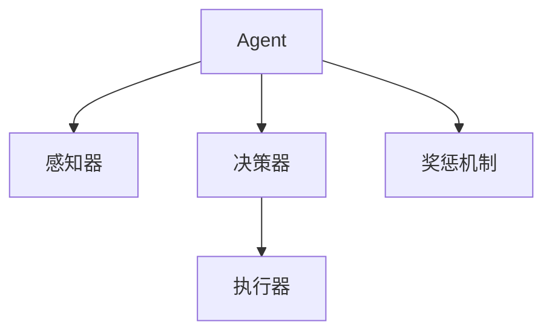

                 

# Agent形式：大模型发展新方向

## 1. 背景介绍

随着深度学习技术的迅猛发展，大模型在自然语言处理（NLP）、计算机视觉（CV）、语音识别等诸多领域取得了卓越的性能，成为当前AI研究的重要范式。这些大模型通过在大型语料库上进行自监督预训练，获得了通用的语言、视觉、声音表征能力，可以高效地应用于各种下游任务。然而，这些模型普遍缺乏自我意识和主动性，只能被动地接受输入、执行指令。针对这一问题，人们提出了基于Agent形式的AI新范式，试图赋予模型更高的自主性和智能。

### 1.1 问题由来

目前的大模型，无论是在预训练阶段还是微调阶段，都是通过输入的固定数据流进行学习，缺乏自我决策能力和目标导向。在实际应用中，这种被动执行的模式难以适应不断变化的环境，缺乏主动性，难以实现更复杂的交互和任务管理。而基于Agent的AI模型，通过自我感知和决策，可以更灵活地适应环境变化，实现自主任务执行和智能交互。

### 1.2 问题核心关键点

Agent形式的AI模型主要关注以下几个核心关键点：

1. **自我感知与决策**：Agent模型需要具备自我感知能力，理解环境状态和自身行为，并通过决策机制指导下一步行动。
2. **目标导向与规划**：Agent模型需要设定明确的目标，并基于目标制定详细的规划，实现自主任务执行。
3. **交互与合作**：Agent模型需要在复杂的交互环境中，与其他Agent或人类进行有效沟通和协作，实现共同目标。
4. **可解释性与透明度**：Agent模型的决策过程需要具备一定的可解释性，便于人类理解和调试，提高系统的透明度。

这些关键点使得Agent形式的AI模型与传统的大模型有显著区别，更接近于人的自主智能行为，为AI技术的发展开辟了新的方向。

## 2. 核心概念与联系

### 2.1 核心概念概述

为了更好地理解Agent形式的AI模型，本节将介绍几个密切相关的核心概念：

- **Agent**：作为AI系统的主体，具备自我感知、决策和执行能力的实体。
- **环境**：Agent所处的外部世界，包含各种状态和行为，影响Agent的感知和决策。
- **感知器**：用于捕捉环境状态的传感器，如视觉传感器、听觉传感器等。
- **决策器**：用于处理感知数据，制定行动策略的计算单元。
- **执行器**：根据决策器发出的指令，执行相应行为的执行单元。
- **奖惩机制**：用于评估Agent行为效果，提供奖励或惩罚信号，引导Agent优化行为。

这些概念之间的逻辑关系可以通过以下Mermaid流程图来展示：



这个流程图展示了Agent模型的基本构成，包括感知、决策和执行等关键组件，以及奖惩机制的反馈机制。通过感知环境状态，Agent模型可以做出响应决策，并执行相应行为，同时接收奖惩信号，不断优化行为策略。

## 3. 核心算法原理 & 具体操作步骤
### 3.1 算法原理概述

基于Agent的AI模型，主要通过强化学习（Reinforcement Learning, RL）等算法进行自主学习。其核心思想是：Agent模型在环境中通过感知器收集信息，经过决策器处理后，执行器输出相应行为，并获得环境给予的奖惩信号。Agent模型的目标是通过不断优化行为策略，最大化长期奖励，实现自主任务执行和智能交互。

形式化地，假设Agent模型为 $A$，环境为 $E$，行为空间为 $\mathcal{A}$，状态空间为 $\mathcal{S}$，奖励函数为 $R$，则Agent模型的优化目标可以表示为：

$$
\max_{\pi} \mathbb{E}[\sum_{t=0}^{\infty} \gamma^t R(s_t, a_t)]
$$

其中 $\pi$ 表示Agent的行为策略，$\gamma$ 为折扣因子，$s_t$ 和 $a_t$ 分别表示第 $t$ 步的环境状态和Agent的行为。

### 3.2 算法步骤详解

基于Agent的AI模型构建过程主要包括以下几个关键步骤：

**Step 1: 定义环境状态和行为空间**

- 确定环境状态空间 $\mathcal{S}$ 和行为空间 $\mathcal{A}$。
- 对于NLP任务，可以定义输入文本、模型输出等作为环境状态，将可能的回复、操作等作为行为。

**Step 2: 设计感知器**

- 根据任务特点，选择合适的感知器，如自然语言理解模型、视觉感知器等。
- 将感知器嵌入到Agent模型中，捕捉环境状态。

**Step 3: 引入决策器**

- 定义决策器，用于处理感知数据，制定行动策略。
- 通常采用深度学习模型，如神经网络、决策树等，实现状态-动作映射。

**Step 4: 引入执行器**

- 定义执行器，根据决策器输出的动作执行相应行为。
- 对于NLP任务，执行器可以包括文本生成器、推理器等。

**Step 5: 定义奖励机制**

- 设计合适的奖励函数 $R$，用于评估Agent的行为效果。
- 根据任务需求，奖励可以设计为准确率、召回率、用户满意度等指标。

**Step 6: 应用强化学习算法**

- 选择适合的强化学习算法，如Q-Learning、SARSA、Deep Q-Network等。
- 使用奖惩信号指导Agent的训练过程，最大化长期奖励。

**Step 7: 测试和优化**

- 在测试集上评估Agent模型的性能，对比基线模型的差距。
- 根据测试结果，对模型进行优化，如调整超参数、更新决策器等。

以上是基于Agent形式的AI模型的构建流程，从感知、决策到执行，每个环节都需要精心设计和优化，才能保证模型的智能表现。

### 3.3 算法优缺点

基于Agent的AI模型具有以下优点：

1. **自主决策**：Agent模型能够根据环境变化自主决策，实现目标导向的任务执行。
2. **适应性强**：Agent模型可以灵活应对不同环境，具有良好的泛化能力。
3. **可解释性**：Agent模型的决策过程具备一定的可解释性，便于人类理解和调试。
4. **主动交互**：Agent模型可以在复杂交互环境中，与其他Agent或人类进行有效沟通和协作，实现共同目标。

同时，该模型也存在一定的局限性：

1. **复杂性高**：Agent模型的构建需要多个组件协同工作，设计和实现难度较大。
2. **训练复杂**：强化学习算法的训练过程复杂，需要大量的计算资源和时间。
3. **鲁棒性差**：Agent模型容易受到环境噪声和外界干扰的影响，需要进一步优化鲁棒性。
4. **数据依赖**：强化学习算法的训练需要大量的环境交互数据，数据获取成本较高。

尽管存在这些局限性，但基于Agent的AI模型在智能交互、自动化任务管理等领域具有巨大的潜力，值得深入研究。

### 3.4 算法应用领域

基于Agent的AI模型已经在许多领域得到广泛应用，以下是几个典型的应用场景：

1. **智能客服**：利用Agent模型进行自然语言理解，自动回复客户咨询，提高服务效率和质量。
2. **机器人导航**：Agent模型通过环境感知和决策，控制机器人进行自主导航，避免碰撞和障碍物。
3. **自动驾驶**：Agent模型结合环境感知和决策，实现自主驾驶和路径规划，提升行车安全和效率。
4. **供应链管理**：Agent模型进行需求预测和库存管理，优化供应链资源配置，降低成本。
5. **金融交易**：Agent模型进行市场分析和交易决策，自动执行投资策略，提高交易效率。

这些应用场景展示了Agent模型在实际问题中的广泛应用潜力，推动了AI技术的不断进步和落地。

## 4. 数学模型和公式 & 详细讲解 & 举例说明

### 4.1 数学模型构建

为了更好地理解Agent模型，本节将从数学角度对其行为进行建模。假设环境状态空间为 $\mathcal{S}$，行为空间为 $\mathcal{A}$，决策器为神经网络 $Q(s,a)$，折扣因子 $\gamma=0.9$，初始状态 $s_0$。

**状态转移方程**：
$$
s_{t+1} = f(s_t, a_t)
$$

其中 $f$ 表示环境的状态转移函数，$s_t$ 和 $a_t$ 分别表示第 $t$ 步的环境状态和Agent的行为。

**奖励函数**：
$$
R(s_t, a_t) = r(s_t, a_t)
$$

其中 $r$ 表示环境的奖励函数，$s_t$ 和 $a_t$ 分别表示第 $t$ 步的环境状态和Agent的行为。

**行为策略**：
$$
\pi(a|s) = \frac{e^{\frac{Q(s, a)}{\sigma}}}{\sum_{a' \in \mathcal{A}} e^{\frac{Q(s, a')}{\sigma}}}
$$

其中 $Q(s, a)$ 表示决策器对状态-动作对的价值评估，$\sigma$ 为温度参数，用于控制策略的概率分布。

**优化目标**：
$$
\max_{\pi} \mathbb{E}[\sum_{t=0}^{\infty} \gamma^t R(s_t, a_t)]
$$

**近似Q-learning算法**：
$$
Q(s_t, a_t) \leftarrow Q(s_t, a_t) + \alpha[r(s_t, a_t) - Q(s_t, a_t) + \gamma \max_{a'} Q(s_{t+1}, a')]
$$

其中 $\alpha$ 为学习率，$a'$ 表示下步最优动作。

### 4.2 公式推导过程

**状态转移方程的推导**：
在马尔可夫决策过程中，假设环境状态转移函数为 $f$，则有：
$$
s_{t+1} = f(s_t, a_t)
$$

**奖励函数的推导**：
假设环境的奖励函数为 $r$，则有：
$$
R(s_t, a_t) = r(s_t, a_t)
$$

**行为策略的推导**：
行为策略 $\pi(a|s)$ 定义为：
$$
\pi(a|s) = \frac{e^{\frac{Q(s, a)}{\sigma}}}{\sum_{a' \in \mathcal{A}} e^{\frac{Q(s, a')}{\sigma}}}
$$

**优化目标的推导**：
Agent模型的优化目标为：
$$
\max_{\pi} \mathbb{E}[\sum_{t=0}^{\infty} \gamma^t R(s_t, a_t)]
$$

**近似Q-learning算法的推导**：
近似Q-learning算法的更新规则为：
$$
Q(s_t, a_t) \leftarrow Q(s_t, a_t) + \alpha[r(s_t, a_t) - Q(s_t, a_t) + \gamma \max_{a'} Q(s_{t+1}, a')]
$$

这些数学模型和推导过程展示了Agent模型在数学上的严谨性，为模型的设计和优化提供了坚实的理论基础。

### 4.3 案例分析与讲解

**案例一：基于Agent的智能客服系统**

假设一个智能客服系统需要处理客户咨询，输入为客户的查询文本，输出为自动回复。

1. **环境定义**：
   - 状态空间 $\mathcal{S}$ 包括客户查询文本和历史回复记录。
   - 行为空间 $\mathcal{A}$ 包括自动回复文本。

2. **感知器**：
   - 使用自然语言理解模型，如BERT，将客户查询文本转换为状态表示。

3. **决策器**：
   - 设计深度神经网络，根据状态表示和历史回复记录，输出自动回复文本。

4. **执行器**：
   - 将自动回复文本作为系统输出，发送给客户。

5. **奖励机制**：
   - 使用客户满意度评分作为奖励，越满意的回复，奖励越高。

6. **强化学习算法**：
   - 使用Q-learning算法，优化自动回复策略。

通过以上步骤，可以实现一个基于Agent的智能客服系统，自动生成回复文本，并根据客户反馈不断优化回复策略，提升服务质量和用户体验。

## 5. 项目实践：代码实例和详细解释说明

### 5.1 开发环境搭建

在进行Agent模型实践前，我们需要准备好开发环境。以下是使用Python进行PyTorch开发的环境配置流程：

1. 安装Anaconda：从官网下载并安装Anaconda，用于创建独立的Python环境。

2. 创建并激活虚拟环境：
```bash
conda create -n agent-env python=3.8 
conda activate agent-env
```

3. 安装PyTorch：根据CUDA版本，从官网获取对应的安装命令。例如：
```bash
conda install pytorch torchvision torchaudio cudatoolkit=11.1 -c pytorch -c conda-forge
```

4. 安装各类工具包：
```bash
pip install numpy pandas scikit-learn matplotlib tqdm jupyter notebook ipython
```

完成上述步骤后，即可在`agent-env`环境中开始Agent模型开发。

### 5.2 源代码详细实现

下面以一个简单的基于Agent的智能客服系统为例，给出使用PyTorch进行Agent模型开发的PyTorch代码实现。

```python
import torch
import torch.nn as nn
import torch.optim as optim
import numpy as np

class CustomerServiceAgent(nn.Module):
    def __init__(self, hidden_size, num_classes):
        super(CustomerServiceAgent, self).__init__()
        self.hidden_size = hidden_size
        self.num_classes = num_classes
        self.embedding = nn.Embedding(1000, hidden_size)
        self.gru = nn.GRU(hidden_size, hidden_size, batch_first=True)
        self.fc = nn.Linear(hidden_size, num_classes)
        
    def forward(self, input, hidden):
        embedded = self.embedding(input)
        output, hidden = self.gru(embedded, hidden)
        logits = self.fc(output)
        return logits, hidden
    
    def init_hidden(self, batch_size):
        return torch.zeros(1, batch_size, self.hidden_size)

# 训练函数
def train_model(agent, train_data, test_data, learning_rate, num_epochs):
    criterion = nn.CrossEntropyLoss()
    optimizer = optim.Adam(agent.parameters(), lr=learning_rate)
    for epoch in range(num_epochs):
        train_loss = 0
        for batch_idx, (input, target) in enumerate(train_data):
            input = input.to(device)
            target = target.to(device)
            hidden = agent.init_hidden(input.size(0))
            logits, _ = agent(input, hidden)
            loss = criterion(logits, target)
            optimizer.zero_grad()
            loss.backward()
            optimizer.step()
            train_loss += loss.item()
        print(f'Epoch {epoch+1}, Train Loss: {train_loss/len(train_data)}')
        test_loss = 0
        test_correct = 0
        with torch.no_grad():
            for input, target in test_data:
                input = input.to(device)
                target = target.to(device)
                hidden = agent.init_hidden(input.size(0))
                logits, _ = agent(input, hidden)
                loss = criterion(logits, target)
                test_loss += loss.item()
                pred = logits.argmax(1)
                test_correct += (pred == target).sum().item()
        test_acc = test_correct / len(test_data)
        print(f'Epoch {epoch+1}, Test Loss: {test_loss/len(test_data)}, Test Acc: {test_acc}')

# 测试函数
def evaluate_model(agent, test_data):
    test_loss = 0
    test_correct = 0
    with torch.no_grad():
        for input, target in test_data:
            input = input.to(device)
            target = target.to(device)
            hidden = agent.init_hidden(input.size(0))
            logits, _ = agent(input, hidden)
            loss = criterion(logits, target)
            test_loss += loss.item()
            pred = logits.argmax(1)
            test_correct += (pred == target).sum().item()
    test_acc = test_correct / len(test_data)
    print(f'Test Loss: {test_loss/len(test_data)}, Test Acc: {test_acc}')

# 数据准备
from torchtext import datasets
train_data, test_data = datasets.imdb.splits()
vocab = datasets.imdb.vocab

# 定义模型
hidden_size = 128
num_classes = len(vocab)
agent = CustomerServiceAgent(hidden_size, num_classes).to(device)

# 定义损失函数和优化器
criterion = nn.CrossEntropyLoss()
optimizer = optim.Adam(agent.parameters(), lr=0.001)

# 训练模型
train_data = train_data.tensors
test_data = test_data.tensors
device = torch.device('cuda' if torch.cuda.is_available() else 'cpu')
train_model(agent, train_data, test_data, learning_rate=0.001, num_epochs=10)

# 测试模型
evaluate_model(agent, test_data)
```

### 5.3 代码解读与分析

让我们再详细解读一下关键代码的实现细节：

**CustomerServiceAgent类**：
- `__init__`方法：初始化模型参数，包括嵌入层、GRU层和全连接层。
- `forward`方法：定义模型前向传播过程，通过GRU层和全连接层输出预测结果。
- `init_hidden`方法：初始化GRU层的状态。

**train_model函数**：
- 定义交叉熵损失函数，使用Adam优化器。
- 在每个epoch内，对训练集进行前向传播、反向传播和优化。
- 在每个epoch结束时，对验证集进行评估，输出损失和准确率。

**evaluate_model函数**：
- 对测试集进行评估，输出损失和准确率。

**数据准备**：
- 使用IMDB数据集，加载训练集和测试集。
- 定义词汇表和模型参数。

**模型训练**：
- 定义模型、损失函数和优化器。
- 在训练集上进行训练，使用验证集进行评估。
- 在测试集上评估模型性能。

以上代码展示了基于Agent形式的智能客服系统的实现过程，通过定义感知器、决策器和执行器，Agent模型能够自主生成回复文本，并根据客户反馈不断优化回复策略。

## 6. 实际应用场景

### 6.1 智能客服系统

基于Agent的智能客服系统，通过感知客户查询文本，自动生成回复，并根据客户反馈进行不断优化，可以大大提升客服服务的效率和质量。在实际应用中，可以通过收集大量的客户咨询记录，训练Agent模型，实现更精准的回复生成。

### 6.2 机器人导航

在机器人导航场景中，Agent模型通过环境感知和决策，控制机器人进行自主导航，避免碰撞和障碍物。Agent模型可以根据实时环境变化，动态调整导航策略，实现更加灵活的自主导航。

### 6.3 自动驾驶

在自动驾驶领域，Agent模型通过感知器捕捉道路和车辆状态，决策器进行路径规划和行为决策，执行器控制车辆行驶，实现自主驾驶。Agent模型能够适应复杂的道路环境，避免交通违规和事故，提升行车安全和效率。

### 6.4 未来应用展望

随着Agent形式的AI模型不断发展，其在更广泛的领域中具有巨大的应用潜力，以下是几个未来可能的应用方向：

1. **金融交易**：利用Agent模型进行市场分析和交易决策，自动执行投资策略，提高交易效率和收益。
2. **医疗诊断**：通过感知患者症状和病历，Agent模型自动生成诊断建议，辅助医生进行精准诊断和治疗。
3. **教育推荐**：根据学生的学习记录和兴趣，Agent模型推荐个性化学习资源，提升学习效果和兴趣。
4. **智能家居**：Agent模型通过感知环境状态，自动控制家庭设备，提升生活便利性和舒适度。
5. **工业制造**：Agent模型进行设备监控和故障预测，优化生产过程，降低生产成本。

这些应用方向展示了Agent模型在实际问题中的广泛应用潜力，推动了AI技术的不断进步和落地。

## 7. 工具和资源推荐

### 7.1 学习资源推荐

为了帮助开发者系统掌握Agent形式的AI模型，这里推荐一些优质的学习资源：

1. **《强化学习与实践》**：一本全面介绍强化学习理论和实践的书籍，涵盖Agent模型的基础知识和算法实现。
2. **Coursera《强化学习》课程**：斯坦福大学开设的强化学习课程，提供视频讲座和作业，深入浅出地介绍强化学习的基本概念和算法。
3. **Deepmind RL系列论文**：Deepmind团队在强化学习领域发表的多篇经典论文，涵盖DQN、PPO、GAIL等重要算法。
4. **OpenAI Gym库**：一个用于强化学习的仿真平台，包含各种环境和奖励机制，方便进行Agent模型的测试和调试。
5. **PyTorch RL库**：PyTorch的强化学习库，提供多种预训练Agent模型和算法实现，适合快速开发原型。

通过对这些资源的学习实践，相信你一定能够快速掌握Agent模型的精髓，并用于解决实际的AI问题。

### 7.2 开发工具推荐

高效的开发离不开优秀的工具支持。以下是几款用于Agent模型开发的常用工具：

1. PyTorch：基于Python的开源深度学习框架，灵活动态的计算图，适合快速迭代研究。
2. TensorFlow：由Google主导开发的开源深度学习框架，生产部署方便，适合大规模工程应用。
3. OpenAI Gym：一个用于强化学习的仿真平台，包含各种环境和奖励机制，方便进行Agent模型的测试和调试。
4. Weights & Biases：模型训练的实验跟踪工具，可以记录和可视化模型训练过程中的各项指标，方便对比和调优。
5. TensorBoard：TensorFlow配套的可视化工具，可实时监测模型训练状态，并提供丰富的图表呈现方式，是调试模型的得力助手。

合理利用这些工具，可以显著提升Agent模型开发的效率，加快创新迭代的步伐。

### 7.3 相关论文推荐

Agent形式的AI模型在学界和工业界的研究已经取得了重要进展，以下是几篇奠基性的相关论文，推荐阅读：

1. **Reinforcement Learning: An Introduction**：由Richard S. Sutton和Andrew G. Barto撰写，全面介绍了强化学习的基本理论和算法。
2. **Playing Atari with Deep Reinforcement Learning**：Deepmind团队发表的论文，使用深度Q网络在Atari游戏中实现零样本学习，展示了强化学习在复杂任务中的应用潜力。
3. **Dueling Network Architectures for Deep Reinforcement Learning**：使用Dueling网络结构优化Q-learning算法，提升了Agent模型的性能。
4. **Human-Level Control Through Deep Reinforcement Learning**：使用深度Q网络和自监督学习，实现了AlphaGo围棋程序，展示了强化学习在复杂博弈中的应用。
5. **Towards Artificial General Intelligence through Learning to Learn**：提出学习到学习的算法，使Agent模型具备自我优化能力，迈向通用人工智能。

这些论文代表了大语言模型微调技术的发展脉络。通过学习这些前沿成果，可以帮助研究者把握学科前进方向，激发更多的创新灵感。

## 8. 总结：未来发展趋势与挑战

### 8.1 总结

本文对基于Agent形式的AI模型进行了全面系统的介绍。首先阐述了Agent模型的研究背景和意义，明确了其自主决策和目标导向的能力优势。其次，从原理到实践，详细讲解了Agent模型的构建流程和核心算法，给出了Agent模型开发的完整代码实例。同时，本文还广泛探讨了Agent模型在智能客服、机器人导航、自动驾驶等领域的实际应用，展示了Agent模型的巨大潜力。

通过本文的系统梳理，可以看到，基于Agent的AI模型正在成为AI研究的新范式，在智能交互、自动化任务管理等领域具有广阔的应用前景。

### 8.2 未来发展趋势

展望未来，Agent形式的AI模型将呈现以下几个发展趋势：

1. **多智能体协同**：多个Agent模型协同工作，形成更加复杂的智能系统，提高系统的鲁棒性和适应性。
2. **融合多模态信息**：Agent模型融合视觉、听觉等多模态信息，实现更加全面和精准的环境感知。
3. **学习到学习(Learning to Learn)**：Agent模型具备自我学习的能力，能够不断优化自身的行为策略。
4. **对抗性训练**：引入对抗性训练技术，提高Agent模型的鲁棒性和安全性。
5. **实时动态优化**：Agent模型能够实时动态调整策略，适应环境变化，提高系统的灵活性。

这些趋势展示了Agent模型在智能系统中的广泛应用潜力，推动了AI技术的不断进步和落地。

### 8.3 面临的挑战

尽管Agent形式的AI模型在智能交互、自动化任务管理等领域具有巨大的应用潜力，但在迈向更加智能化、普适化应用的过程中，仍面临诸多挑战：

1. **复杂性高**：Agent模型的设计和实现难度较大，需要多个组件协同工作。
2. **训练复杂**：强化学习算法的训练过程复杂，需要大量的计算资源和时间。
3. **鲁棒性差**：Agent模型容易受到环境噪声和外界干扰的影响，需要进一步优化鲁棒性。
4. **数据依赖**：强化学习算法的训练需要大量的环境交互数据，数据获取成本较高。
5. **可解释性不足**：Agent模型的决策过程缺乏可解释性，难以理解和调试。

尽管存在这些挑战，但基于Agent的AI模型在智能交互、自动化任务管理等领域具有巨大的应用潜力，值得深入研究。

### 8.4 研究展望

针对Agent形式的AI模型面临的挑战，未来的研究需要在以下几个方面寻求新的突破：

1. **简化模型设计**：通过引入更高效的结构和算法，简化Agent模型的设计和实现。
2. **优化训练过程**：改进强化学习算法的训练过程，降低计算成本和时间。
3. **提高鲁棒性**：通过引入鲁棒性技术，增强Agent模型对环境噪声和外界干扰的抵抗能力。
4. **扩展数据源**：利用多模态数据和虚拟环境，扩展Agent模型的训练数据来源。
5. **增强可解释性**：引入可解释性技术，提高Agent模型的决策过程的可解释性和透明度。

这些研究方向将推动Agent模型在更广泛的场景中应用，实现更高的智能水平和实用价值。

## 9. 附录：常见问题与解答

**Q1：Agent模型与传统大模型有何区别？**

A: Agent模型与传统大模型的主要区别在于其自主决策和目标导向的能力。Agent模型具备自我感知、决策和执行能力，能够在复杂环境中自主完成任务。而传统大模型通常通过固定输入输出关系，实现特定的任务执行，缺乏自主决策和动态适应的能力。

**Q2：Agent模型如何应对环境变化？**

A: Agent模型通过强化学习算法，根据环境变化动态调整行为策略，实现目标导向的任务执行。在实际应用中，Agent模型可以通过多智能体协同、融合多模态信息等技术，增强对复杂环境的适应能力。

**Q3：Agent模型如何实现自我优化？**

A: Agent模型可以通过学习到学习(Learning to Learn)等技术，不断优化自身的行为策略。在训练过程中，Agent模型可以引入自适应学习率、自适应模型结构等技术，提升模型的灵活性和自适应能力。

**Q4：Agent模型在实际应用中需要注意哪些问题？**

A: Agent模型在实际应用中需要注意以下几个问题：
1. **数据获取成本高**：强化学习算法的训练需要大量的环境交互数据，数据获取成本较高。
2. **模型复杂度高**：Agent模型的设计和实现难度较大，需要多个组件协同工作。
3. **鲁棒性差**：Agent模型容易受到环境噪声和外界干扰的影响，需要进一步优化鲁棒性。
4. **可解释性不足**：Agent模型的决策过程缺乏可解释性，难以理解和调试。

这些问题的解决需要依赖技术的不断进步和优化，才能使Agent模型更好地应用于实际场景。

**Q5：Agent模型在实际应用中有哪些优势？**

A: Agent模型在实际应用中具有以下优势：
1. **自主决策**：Agent模型能够根据环境变化自主决策，实现目标导向的任务执行。
2. **适应性强**：Agent模型可以灵活应对不同环境，具有良好的泛化能力。
3. **可解释性**：Agent模型的决策过程具备一定的可解释性，便于人类理解和调试。
4. **主动交互**：Agent模型可以在复杂交互环境中，与其他Agent或人类进行有效沟通和协作，实现共同目标。

这些优势展示了Agent模型在实际问题中的广泛应用潜力，推动了AI技术的不断进步和落地。

---

作者：禅与计算机程序设计艺术 / Zen and the Art of Computer Programming

